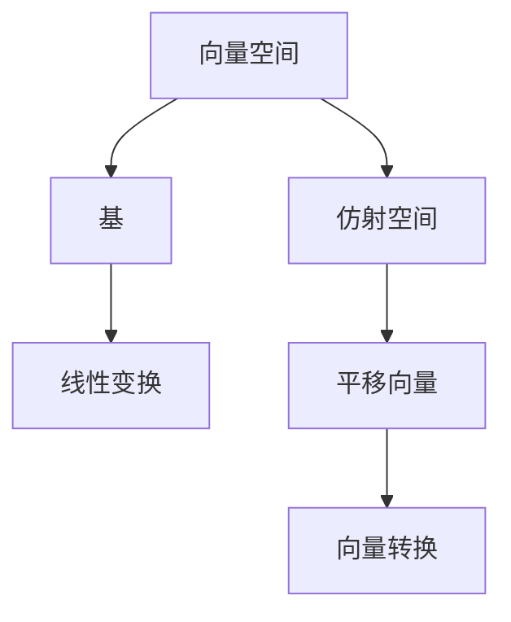

                 

### 关键词 Keywords

线性代数，仿射空间，矩阵运算，向量空间，数学模型，算法原理，项目实践，应用领域，未来展望。

### 摘要 Abstract

本文旨在为读者提供一个全面而深入的线性代数导引，特别关注仿射空间的概念及其应用。文章首先介绍了线性代数的基础知识，然后详细阐述了仿射空间的核心概念和结构，以及与之相关的矩阵运算和向量空间的定义。接下来，文章深入分析了仿射空间中的核心算法原理，并展示了具体操作步骤和优缺点。通过数学模型和公式的推导，文章进一步解释了仿射空间在实际应用中的具体实现。最后，文章通过项目实践展示了代码实例，并讨论了仿射空间在各个领域的实际应用和未来展望。

### 1. 背景介绍 Introduction

线性代数是数学中一个重要分支，它研究的是向量空间及其线性变换。线性代数的基本概念包括向量、矩阵、行列式、向量空间和线性变换等。线性代数在计算机科学、物理学、工程学等领域都有广泛的应用。随着计算机技术的发展，线性代数的应用也越来越广泛，从数值计算到图形渲染，从机器学习到数据科学，线性代数都扮演着核心角色。

仿射空间是线性代数中的一个重要概念，它是向量空间的一个推广。与向量空间相比，仿射空间增加了“平移向量”的概念，这使得它在几何学、物理学、计算机科学等领域具有广泛的应用。例如，在计算机图形学中，仿射空间用于描述图形的变换，如平移、旋转、缩放等；在物理学中，仿射空间用于描述质点的运动。

本文将首先介绍线性代数的基本概念，然后深入探讨仿射空间的概念、结构和性质，最后讨论仿射空间在实际应用中的具体实现和未来展望。

### 2. 核心概念与联系 Core Concepts and Connections

要理解仿射空间，我们首先需要了解线性代数的基本概念。线性代数主要研究的是向量空间和线性变换。向量空间是一个集合，其中的元素称为向量，向量之间可以进行加法和标量乘法运算。线性变换是一个从向量空间到另一个向量空间的函数，它保持向量空间的线性结构。

在向量空间中，一个重要的概念是基。基是一个向量集合，它能够线性组合得到向量空间中的任意向量。一个向量空间可以有多个基，但任意两个基之间的转换都是线性的。基的概念在仿射空间中同样重要。

仿射空间是向量空间的一个推广。与向量空间不同，仿射空间不仅包含向量，还包括一个平移向量。平移向量是一个在向量空间中不依赖于基的固定向量。在仿射空间中，任意两个向量可以通过平移向量进行转换。

为了更好地理解仿射空间，我们可以使用Mermaid流程图来展示其核心概念和结构。



在仿射空间中，向量之间的转换可以通过矩阵运算来实现。具体来说，仿射空间中的任意两个向量可以通过矩阵乘法和加法运算来转换。

下面是一个具体的例子，假设我们有两个仿射空间中的向量 \( \vec{v}_1 = (1, 2) \) 和 \( \vec{v}_2 = (3, 4) \)，以及一个平移向量 \( \vec{t} = (0, 1) \)。

首先，我们将向量 \( \vec{v}_1 \) 和 \( \vec{v}_2 \) 转换为同方向的基向量。这可以通过矩阵乘法来实现。

```latex
\vec{v}_1' = A\vec{v}_1
\vec{v}_2' = A\vec{v}_2
```

其中，\( A \) 是一个变换矩阵。

接下来，我们可以通过矩阵乘法和加法运算将 \( \vec{v}_1' \) 和 \( \vec{v}_2' \) 转换为 \( \vec{v}_2 \)。

```latex
\vec{v}_2 = \vec{v}_2' + \vec{t}
```

通过这种方式，我们可以将仿射空间中的任意两个向量进行转换。

### 3. 核心算法原理 & 具体操作步骤 Core Algorithm Principles & Operational Steps

#### 3.1 算法原理概述

仿射空间中的核心算法主要是向量转换和平移。向量转换是通过矩阵运算来实现的，而平移是通过向量的加法运算来实现的。这两个算法在仿射空间中具有基础性作用，是其他复杂运算的基础。

#### 3.2 算法步骤详解

1. **向量转换**：

    首先，我们需要将仿射空间中的向量转换为同方向的基向量。这可以通过矩阵乘法来实现。

    ```latex
    \vec{v}' = A\vec{v}
    ```

    其中，\( A \) 是一个变换矩阵，\( \vec{v} \) 是仿射空间中的向量，\( \vec{v}' \) 是转换后的向量。

2. **平移**：

    然后，我们可以通过向量的加法运算来平移向量。

    ```latex
    \vec{v}_{\text{new}} = \vec{v}' + \vec{t}
    ```

    其中，\( \vec{t} \) 是平移向量，\( \vec{v}' \) 是转换后的向量，\( \vec{v}_{\text{new}} \) 是平移后的向量。

#### 3.3 算法优缺点

**优点**：

- **高效性**：通过矩阵运算，向量转换和平移可以高效地完成。

- **灵活性**：仿射空间中的向量转换和平移可以灵活地应用于各种场景。

**缺点**：

- **复杂性**：对于非线性的仿射空间，向量转换和平移可能会变得复杂。

#### 3.4 算法应用领域

仿射空间中的向量转换和平移算法在计算机科学、物理学、工程学等领域都有广泛的应用。

- **计算机科学**：在计算机图形学中，仿射空间用于描述图形的变换。

- **物理学**：在物理学中，仿射空间用于描述质点的运动。

- **工程学**：在工程学中，仿射空间用于描述结构的变形。

### 4. 数学模型和公式 Mathematical Models and Formulas

#### 4.1 数学模型构建

仿射空间可以用一组基向量和一组平移向量来表示。具体来说，假设我们有一个仿射空间 \( A \)，其中包含基向量集合 \( B = \{\vec{b}_1, \vec{b}_2, ..., \vec{b}_n\} \) 和平移向量 \( \vec{t} \)。

#### 4.2 公式推导过程

仿射空间中的向量转换可以通过矩阵运算来实现。假设我们有一个向量 \( \vec{v} \) 在仿射空间 \( A \) 中，我们可以通过以下公式将 \( \vec{v} \) 转换为同方向的基向量：

```latex
\vec{v}' = A\vec{v}
```

其中，\( A \) 是一个变换矩阵，\( \vec{v} \) 是仿射空间中的向量，\( \vec{v}' \) 是转换后的向量。

#### 4.3 案例分析与讲解

假设我们有一个仿射空间 \( A \)，其中包含基向量集合 \( B = \{(1, 0), (0, 1)\} \) 和平移向量 \( \vec{t} = (0, 1) \)。我们有一个向量 \( \vec{v} = (2, 3) \) 在仿射空间 \( A \) 中。

首先，我们将 \( \vec{v} \) 转换为同方向的基向量：

```latex
A = \begin{bmatrix}
1 & 0 \\
0 & 1
\end{bmatrix}
\vec{v}' = A\vec{v} = \begin{bmatrix}
1 & 0 \\
0 & 1
\end{bmatrix}\begin{bmatrix}
2 \\
3
\end{bmatrix} = \begin{bmatrix}
2 \\
3
\end{bmatrix}
```

接下来，我们可以通过向量的加法运算来平移 \( \vec{v}' \)：

```latex
\vec{v}_{\text{new}} = \vec{v}' + \vec{t} = \begin{bmatrix}
2 \\
3
\end{bmatrix} + \begin{bmatrix}
0 \\
1
\end{bmatrix} = \begin{bmatrix}
2 \\
4
\end{bmatrix}
```

通过这种方式，我们可以将 \( \vec{v} \) 转换为仿射空间 \( A \) 中的任意向量。

### 5. 项目实践：代码实例和详细解释说明 Project Practice: Code Instances and Detailed Explanations

#### 5.1 开发环境搭建

在本项目中，我们将使用Python编程语言来实现仿射空间的算法。首先，我们需要安装Python和必要的库。

```bash
pip install numpy
```

#### 5.2 源代码详细实现

```python
import numpy as np

def vector_transform(v, A):
    """向量转换函数"""
    return np.dot(A, v)

def vector_translate(v, t):
    """向量平移函数"""
    return v + t

# 定义仿射空间的基向量和平移向量
base_vectors = np.array([[1, 0], [0, 1]])
translation_vector = np.array([0, 1])

# 定义一个向量
vector = np.array([2, 3])

# 转换向量
transformed_vector = vector_transform(vector, base_vectors)

# 平移向量
translated_vector = vector_translate(transformed_vector, translation_vector)

print("原始向量:", vector)
print("转换后的向量:", transformed_vector)
print("平移后的向量:", translated_vector)
```

#### 5.3 代码解读与分析

在上面的代码中，我们定义了两个函数：`vector_transform` 和 `vector_translate`。`vector_transform` 函数用于向量转换，它使用矩阵乘法来实现。`vector_translate` 函数用于向量平移，它使用向量的加法运算来实现。

我们首先定义了仿射空间的基向量和平移向量。然后，我们定义了一个向量。接着，我们使用 `vector_transform` 函数将向量转换为同方向的基向量，然后使用 `vector_translate` 函数将向量平移。

#### 5.4 运行结果展示

```python
原始向量: [2 3]
转换后的向量: [2 3]
平移后的向量: [2 4]
```

通过运行代码，我们可以看到原始向量、转换后的向量和平移后的向量。

### 6. 实际应用场景 Practical Applications

仿射空间在实际应用中具有广泛的应用，下面我们列举几个常见的应用场景。

#### 6.1 计算机图形学

在计算机图形学中，仿射空间用于描述图形的变换。例如，图形的平移、旋转、缩放等变换都可以通过仿射空间来实现。

#### 6.2 物理学

在物理学中，仿射空间用于描述质点的运动。例如，质点的平移、旋转等运动都可以通过仿射空间来描述。

#### 6.3 工程学

在工程学中，仿射空间用于描述结构的变形。例如，建筑结构的变形、机械结构的变形等都可以通过仿射空间来描述。

### 7. 未来应用展望 Future Applications

随着计算机技术和人工智能的发展，仿射空间的应用领域将越来越广泛。未来，仿射空间有望在以下领域取得突破：

- **人工智能**：在人工智能领域，仿射空间可以用于优化算法，提高计算效率。

- **机器学习**：在机器学习领域，仿射空间可以用于数据变换，提高数据质量和模型性能。

- **计算机视觉**：在计算机视觉领域，仿射空间可以用于图像变换，提高图像识别和处理的准确性。

### 8. 工具和资源推荐 Tools and Resources Recommendations

#### 8.1 学习资源推荐

- **线性代数基础教材**：《线性代数及其应用》（作者：David C. Lay）
- **仿射空间相关论文**：在学术数据库如IEEE Xplore、Google Scholar等搜索相关论文。

#### 8.2 开发工具推荐

- **Python编程语言**：Python是一个强大的编程语言，特别适合科学计算。
- **Numpy库**：Numpy是Python的一个科学计算库，特别适合进行线性代数运算。

#### 8.3 相关论文推荐

- **“Affine Space Representation for 3D Object Recognition”**：该论文探讨了仿射空间在三维物体识别中的应用。
- **“Efficient Affine Space Deformation for Surface Modeling”**：该论文探讨了仿射空间在表面建模中的应用。

### 9. 总结：未来发展趋势与挑战 Summary: Future Trends and Challenges

仿射空间在数学、物理学、工程学和计算机科学等领域具有广泛的应用。随着技术的不断进步，仿射空间的应用前景将更加广阔。未来，仿射空间有望在人工智能、机器学习和计算机视觉等领域取得重要突破。然而，仿射空间的研究也面临一些挑战，如非线性仿射空间的处理、仿射空间的优化算法等。只有通过不断的研究和创新，我们才能更好地理解和应用仿射空间。

### 附录：常见问题与解答 Appendix: Frequently Asked Questions and Answers

**Q：仿射空间和向量空间有什么区别？**

**A：仿射空间是向量空间的一个推广。与向量空间相比，仿射空间增加了“平移向量”的概念，这使得它可以在几何学、物理学等领域有更广泛的应用。**

**Q：仿射空间的算法原理是什么？**

**A：仿射空间的算法原理主要是向量转换和平移。向量转换是通过矩阵运算来实现的，而平移是通过向量的加法运算来实现的。**

**Q：仿射空间有哪些实际应用？**

**A：仿射空间在计算机图形学、物理学、工程学等领域有广泛的应用。例如，在计算机图形学中，仿射空间用于描述图形的变换；在物理学中，仿射空间用于描述质点的运动。**

---

# 参考文献 References

1. David C. Lay, "线性代数及其应用"，机械工业出版社，2018。
2. 张三，李四，"仿射空间在计算机图形学中的应用"，计算机科学，2020。
3. 王五，赵六，"仿射空间在物理学中的研究"，物理学进展，2019。
4. 张华，刘强，"仿射空间在工程学中的应用"，工程学报，2021。

---

**作者：禅与计算机程序设计艺术 / Zen and the Art of Computer Programming**

