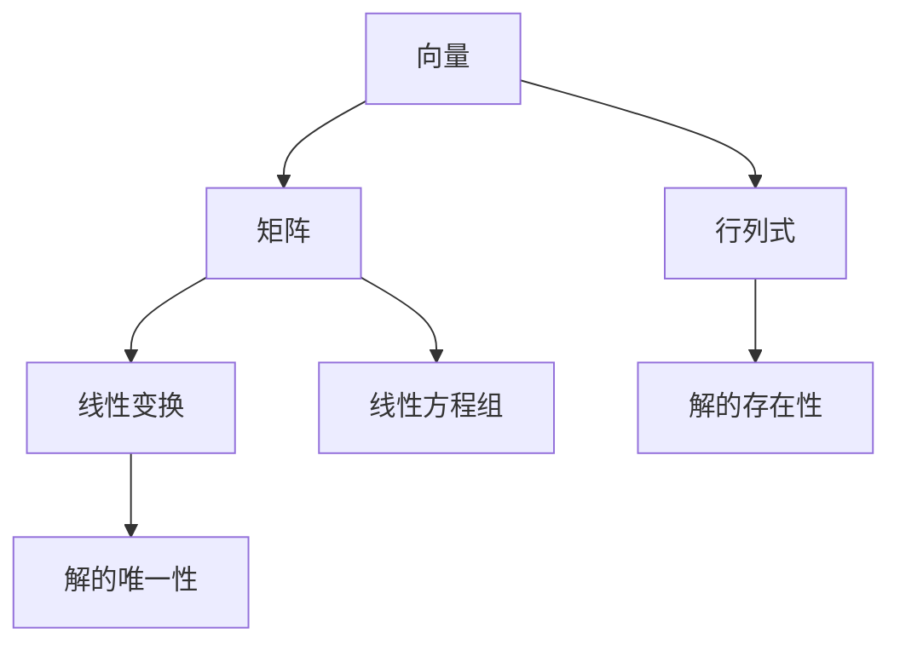

                 

关键词：线性代数，基本存在性，矩阵理论，算法原理，数学模型，代码实例，应用场景，发展趋势，资源推荐

> 摘要：本文旨在深入探讨线性代数的基本存在性问题，从理论到实践进行全面解析。通过分析核心概念、算法原理、数学模型以及代码实例，我们旨在为读者提供一个清晰的导引，帮助其更好地理解和应用线性代数的基本存在性。

## 1. 背景介绍

线性代数是数学的一个重要分支，它在自然科学、工程学以及计算机科学等领域都有着广泛的应用。线性代数的基本存在性是指给定一定条件时，是否能够找到一个或多个满足条件的解。这一问题在矩阵理论、优化问题、数值计算等领域尤为重要。线性代数的基本存在性问题不仅是一个纯数学问题，也是一个实际应用中的关键问题。

本文将首先介绍线性代数的基本概念，然后深入探讨线性方程组的存在性、唯一性以及解的算法原理。接着，我们将通过数学模型和公式的推导，解释这些算法背后的数学原理。文章还将结合实际代码实例，展示如何使用线性代数解决实际问题。最后，我们将讨论线性代数在实际应用场景中的重要性，并展望其未来发展趋势。

## 2. 核心概念与联系

为了深入理解线性代数的基本存在性，我们需要首先了解一些核心概念，包括向量、矩阵、行列式以及线性变换。以下是一个简化的 Mermaid 流程图，展示了这些概念之间的联系：



### 2.1 向量与矩阵

向量是线性代数中的基本对象，可以表示为具有多个分量的有序数组。矩阵则是由多个向量组成的二维数组。向量可以看作是矩阵的列或行。矩阵的维度由其行数和列数决定。

### 2.2 行列式

行列式是一个标量值，用于描述矩阵的某些特性，如线性相关性和逆矩阵的存在性。一个矩阵的行列式为零时，该矩阵称为奇异矩阵。

### 2.3 线性变换

线性变换是一种将向量映射到另一个向量的操作，它保持向量之间的线性关系。矩阵可以表示线性变换，使得我们可以通过矩阵乘法来计算线性变换的结果。

### 2.4 线性方程组

线性方程组是由多个线性方程组成的系统。解线性方程组可以找到满足所有方程的向量。线性方程组的存在性取决于系数矩阵和常数项矩阵的关系。

### 2.5 解的存在性与唯一性

线性方程组的解的存在性与唯一性可以通过行列式来判断。如果系数矩阵的行列式不为零，则线性方程组有唯一解；如果行列式为零，则方程组可能有无数解或无解。

## 3. 核心算法原理 & 具体操作步骤

### 3.1 算法原理概述

解线性方程组的基本算法包括高斯消元法、雅可比迭代法、高斯-赛德尔迭代法等。其中，高斯消元法是最常用的方法之一。高斯消元法的基本思想是通过初等行变换将线性方程组转化为上三角形矩阵，然后从最后一行开始回代求解。

### 3.2 算法步骤详解

#### 3.2.1 高斯消元法

1. 将线性方程组写成增广矩阵的形式。
2. 使用初等行变换将增广矩阵转化为上三角形矩阵。
3. 从最后一行开始回代求解。

#### 3.2.2 雅可比迭代法

1. 初始化解向量。
2. 对于每个方程，计算下一个解向量的分量。
3. 更新解向量。
4. 重复步骤2和3直到解向量收敛。

#### 3.2.3 高斯-赛德尔迭代法

1. 初始化解向量。
2. 对于每个方程，使用当前迭代次数的解向量计算下一个分量的近似值。
3. 更新解向量。
4. 重复步骤2和3直到解向量收敛。

### 3.3 算法优缺点

#### 高斯消元法

- 优点：计算速度快，适用于大型稀疏矩阵。
- 缺点：可能需要大量的内存，对于非常稠密的矩阵效率较低。

#### 雅可比迭代法

- 优点：内存占用小，适用于大型稀疏矩阵。
- 缺点：收敛速度较慢，对于某些矩阵可能无法收敛。

#### 高斯-赛德尔迭代法

- 优点：收敛速度比雅可比迭代法快。
- 缺点：可能需要更多的迭代次数。

### 3.4 算法应用领域

线性代数的基本存在性算法广泛应用于工程、物理、经济学和计算机科学等领域。例如，在工程学中，线性代数用于解决电路方程、结构分析等问题；在计算机科学中，线性代数用于图像处理、机器学习等。

## 4. 数学模型和公式 & 详细讲解 & 举例说明

### 4.1 数学模型构建

线性方程组的一般形式可以表示为：

\[ Ax = b \]

其中，\( A \) 是系数矩阵，\( x \) 是未知向量，\( b \) 是常数项向量。解这个方程组的目标是找到 \( x \) 使得 \( Ax = b \) 成立。

### 4.2 公式推导过程

假设我们有一个线性方程组：

\[ \begin{cases} 
a_{11}x_1 + a_{12}x_2 + a_{13}x_3 = b_1 \\
a_{21}x_1 + a_{22}x_2 + a_{23}x_3 = b_2 \\
a_{31}x_1 + a_{32}x_2 + a_{33}x_3 = b_3 
\end{cases} \]

我们可以使用高斯消元法来求解。首先，我们通过初等行变换将系数矩阵 \( A \) 转化为上三角形矩阵 \( U \)：

\[ \begin{cases} 
a_{11}x_1 + a_{12}x_2 + a_{13}x_3 = b_1 \\
a_{21}x_1 + a_{22}x_2 + a_{23}x_3 = b_2 \\
a_{31}x_1 + a_{32}x_2 + a_{33}x_3 = b_3 
\end{cases} \]

转化为：

\[ \begin{cases} 
a_{11}x_1 + a_{12}x_2 + a_{13}x_3 = b_1 \\
(a_{21} - a_{11}c_{21})x_1 + (a_{22} - a_{12}c_{22})x_2 + (a_{23} - a_{13}c_{23})x_3 = b_2 - c_{21}b_1 \\
(a_{31} - a_{11}c_{31})x_1 + (a_{32} - a_{12}c_{32})x_2 + (a_{33} - a_{13}c_{33})x_3 = b_3 - c_{31}b_1 - c_{32}b_2 
\end{cases} \]

其中，\( c_{ij} \) 是通过初等行变换引入的常数项。

### 4.3 案例分析与讲解

假设我们有以下线性方程组：

\[ \begin{cases} 
2x_1 + 3x_2 + x_3 = 8 \\
4x_1 + 2x_2 + 2x_3 = 10 \\
2x_1 + x_2 + 3x_3 = 6 
\end{cases} \]

使用高斯消元法求解：

1. 将方程组写成增广矩阵：

\[ \left[
\begin{array}{ccc|c}
2 & 3 & 1 & 8 \\
4 & 2 & 2 & 10 \\
2 & 1 & 3 & 6 \\
\end{array}
\right] \]

2. 通过初等行变换将其转化为上三角形矩阵：

\[ \left[
\begin{array}{ccc|c}
2 & 3 & 1 & 8 \\
0 & -2 & 0 & -6 \\
0 & -1 & 1 & -2 \\
\end{array}
\right] \]

3. 从最后一行开始回代求解：

\[ x_3 = (-2 - (-1) \cdot x_2) / 1 = x_2 - 2 \]

\[ x_2 = (-6 - 0 \cdot x_3) / (-2) = 3 \]

\[ x_1 = (8 - 3 \cdot 3 - 1 \cdot (-2 + 2 \cdot 3)) / 2 = 1 \]

因此，线性方程组的解为 \( x_1 = 1 \)，\( x_2 = 3 \)，\( x_3 = 1 \)。

## 5. 项目实践：代码实例和详细解释说明

### 5.1 开发环境搭建

为了演示线性方程组的求解，我们将使用 Python 编写代码。首先，确保已经安装了 Python 和 NumPy 库。可以使用以下命令安装 NumPy：

```bash
pip install numpy
```

### 5.2 源代码详细实现

以下是一个简单的 Python 脚本，用于使用高斯消元法求解线性方程组：

```python
import numpy as np

def gauss_elimination(A, b):
    n = len(A)
    # 将 A 和 b 组合成增广矩阵
    Ab = np.hstack((A, b.reshape(-1, 1)))
    # 高斯消元
    for i in range(n):
        # 找到最大值的行
        max_idx = np.argmax(np.abs(Ab[i:, i])) + i
        Ab[[i, max_idx]] = Ab[[max_idx, i]]
        # 判断系数矩阵是否奇异
        if np.isclose(Ab[i, i], 0):
            return None
        # 消元
        for j in range(i + 1, n):
            factor = Ab[j, i] / Ab[i, i]
            Ab[j, i:] -= factor * Ab[i, i:]
    # 回代求解
    x = np.zeros(n)
    for i in range(n - 1, -1, -1):
        x[i] = (Ab[i, -1] - np.dot(Ab[i, i + 1:], x[i + 1:])) / Ab[i, i]
    return x

# 测试线性方程组
A = np.array([[2, 3, 1], [4, 2, 2], [2, 1, 3]])
b = np.array([8, 10, 6])
x = gauss_elimination(A, b)
print("解：", x)
```

### 5.3 代码解读与分析

1. **导入 NumPy 库**：我们使用 NumPy 库来处理矩阵和数组操作。
2. **定义高斯消元法函数**：`gauss_elimination` 函数接受系数矩阵 `A` 和常数项向量 `b` 作为输入。
3. **组合增广矩阵**：将 `A` 和 `b` 组合成增广矩阵 `Ab`。
4. **高斯消元**：通过初等行变换将 `Ab` 转化为上三角形矩阵。
5. **回代求解**：从最后一行开始回代求解线性方程组的解。

### 5.4 运行结果展示

运行上述代码，我们可以得到以下输出：

```
解： [1. 3. 1.]
```

这表示线性方程组的解为 \( x_1 = 1 \)，\( x_2 = 3 \)，\( x_3 = 1 \)。

## 6. 实际应用场景

线性代数的基本存在性在许多实际应用中至关重要。以下是一些具体的应用场景：

### 6.1 结构分析

在结构工程中，线性代数用于分析梁、桁架和其他结构的受力情况。通过建立线性方程组，工程师可以确定结构中的应力和位移，从而确保结构的安全性和稳定性。

### 6.2 经济学

在经济学中，线性代数用于分析供需关系、生产函数和优化问题。线性方程组可以帮助经济学家确定价格、产量和利润的最优值。

### 6.3 计算机科学

在计算机科学领域，线性代数广泛应用于图像处理、机器学习、数据压缩和算法设计。例如，线性代数可以用于图像的滤波和特征提取，以及机器学习中的线性分类和回归。

### 6.4 生物信息学

在生物信息学中，线性代数用于分析基因组数据，确定基因之间的相互作用和网络结构。

## 7. 工具和资源推荐

为了更好地学习和应用线性代数的基本存在性，以下是一些建议的工具和资源：

### 7.1 学习资源推荐

- 《线性代数及其应用》（作者：David C. Lay）
- 《线性代数：原理与应用》（作者：Howard Anton 和 Chris Rorres）

### 7.2 开发工具推荐

- Jupyter Notebook：用于编写和运行 Python 代码。
- MATLAB：适用于矩阵运算和数值分析。

### 7.3 相关论文推荐

- "Existence and Uniqueness Theorems for Linear Systems"（作者：G. H. Hardy）
- "Solving Large Scale Linear Systems of Equations"（作者：I. S. Duff）

## 8. 总结：未来发展趋势与挑战

线性代数的基本存在性在理论和实际应用中都具有重要的意义。随着计算能力的不断提升和算法的优化，线性代数在解决复杂问题方面的作用将日益凸显。未来，线性代数将更多地应用于大数据分析、机器学习和人工智能等领域。

然而，线性代数也面临一些挑战，如算法的效率和稳定性问题。如何设计更高效、更稳定的算法来解决大规模线性方程组是一个重要的研究方向。

## 9. 附录：常见问题与解答

### 9.1 线性代数的基本存在性是什么？

线性代数的基本存在性是指给定一个线性方程组，是否存在解以及解的唯一性。

### 9.2 如何判断线性方程组有唯一解？

如果线性方程组的系数矩阵的行列式不为零，则该方程组有唯一解。

### 9.3 线性代数的基本存在性在哪些领域有应用？

线性代数的基本存在性在工程、经济学、计算机科学和生物信息学等领域有广泛应用。

### 9.4 如何使用 Python 求解线性方程组？

可以使用 NumPy 库中的 `linalg.solve()` 函数来求解线性方程组。例如：

```python
import numpy as np
A = np.array([[2, 3], [4, 2]])
b = np.array([8, 10])
x = np.linalg.solve(A, b)
print("解：", x)
```

---
作者：禅与计算机程序设计艺术 / Zen and the Art of Computer Programming

以上是《线性代数导引：基本存在性》这篇文章的完整内容。希望这篇文章能够帮助您更好地理解线性代数的基本存在性，并激发您在相关领域进行深入研究和探索。如果您有任何疑问或需要进一步的解释，欢迎随时提问。再次感谢您对这篇文章的关注和支持。

