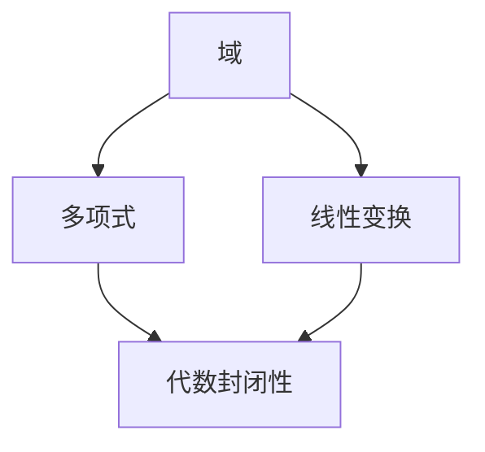

                 

关键词：线性代数、复数域、代数封闭性、数学模型、算法原理、项目实践、应用场景、未来展望

> 摘要：本文深入探讨了复数域中的代数封闭性这一重要概念，分析了其在线性代数中的应用及其重要性。通过数学模型和公式的推导，以及具体的算法原理和步骤，本文旨在为读者提供全面、系统的了解。同时，结合实际项目实践和未来应用展望，本文旨在推动线性代数领域的研究与发展。

## 1. 背景介绍

线性代数是数学和计算机科学中不可或缺的一部分，其研究对象包括向量、矩阵以及线性变换等。在现代科学和技术中，线性代数的应用无处不在，从数据分析到机器学习，从物理学到经济学，都离不开线性代数的支持。

复数域是线性代数中的一个重要概念。与实数域相比，复数域具有更加丰富的结构和性质。在复数域中，可以定义出一系列重要的数学工具和算法，这些工具和算法在数学和科学领域具有重要的应用价值。

代数封闭性是复数域的一个重要性质。一个域被称为代数封闭，如果域内的每一个非零元素都是一个多项式的根。这个性质使得复数域成为研究线性代数问题的理想场所，因为许多线性代数问题都可以转化为多项式方程的求解问题。

本文旨在探讨复数域中的代数封闭性，分析其在线性代数中的应用，以及如何通过数学模型和算法解决相关问题。通过本文的介绍，读者可以深入理解复数域代数封闭性的概念及其重要性。

## 2. 核心概念与联系

在讨论复数域代数封闭性之前，我们需要了解一些核心概念，包括域、多项式和线性变换。

### 域 (Field)

域是数学中一个重要的概念，它是由一组元素构成的集合，这些元素之间可以执行加法、减法、乘法和除法（除法要求除数非零）运算，并且这些运算满足交换律、结合律、分配律和逆元素存在性等基本性质。常见的域包括实数域和复数域。

### 多项式 (Polynomial)

多项式是由常数项、变量和指数组成的代数表达式，通常表示为 $a_0 + a_1x + a_2x^2 + ... + a_nx^n$，其中 $a_0, a_1, ..., a_n$ 是常数，$x$ 是变量，$n$ 是多项式的次数。多项式是研究代数方程的重要工具。

### 线性变换 (Linear Transformation)

线性变换是一个将向量空间中的一个向量映射到另一个向量空间的函数，它满足加法和标量乘法的保持性质。线性变换在矩阵理论和线性代数中扮演着核心角色。

下面是一个Mermaid流程图，展示了这些核心概念之间的联系：



### Mermaid流程图注释

- **域**：线性代数的基础，提供了运算结构。
- **多项式**：用于表示和解决线性代数问题。
- **线性变换**：描述了向量之间的线性关系。
- **代数封闭性**：多项式在域中的根的存在性和唯一性。

## 3. 核心算法原理 & 具体操作步骤

### 3.1 算法原理概述

复数域代数封闭性的核心算法基于多项式的求解。具体来说，这个算法涉及到以下几个关键步骤：

1. **多项式表示**：将给定的线性代数问题转化为多项式形式。
2. **求根**：在复数域中求解多项式的根。
3. **根的验证**：验证求得的根是否满足原始线性代数问题的条件。
4. **结果输出**：输出多项式的根，作为线性代数问题的解。

### 3.2 算法步骤详解

下面详细描述上述算法的每一步：

#### 3.2.1 多项式表示

将线性代数问题转化为多项式问题，通常需要使用矩阵和向量的形式。给定一个线性方程组：

$$
Ax = b
$$

其中 $A$ 是系数矩阵，$x$ 是向量，$b$ 是常数向量。我们可以将这个问题转化为多项式：

$$
p(x) = det(A - xI) = 0
$$

其中 $I$ 是单位矩阵，$det$ 表示行列式。

#### 3.2.2 求根

求多项式 $p(x)$ 的根可以使用各种算法，例如牛顿法、高斯消元法或数值方法如雅可比迭代法。在复数域中，我们通常使用数值方法来求解多项式根。

#### 3.2.3 根的验证

对于每一个求得的根，我们需要验证它是否满足原始线性代数问题的条件。这通常涉及到计算和比较：

$$
p(\alpha) \approx 0
$$

其中 $\alpha$ 是求得的根。

#### 3.2.4 结果输出

如果求得的根满足验证条件，则输出这些根作为线性代数问题的解。否则，可能需要重新检查问题的设定或算法的准确性。

### 3.3 算法优缺点

**优点：**

- **普适性**：多项式方程的解法可以应用于各种线性代数问题，具有很强的通用性。
- **精确性**：对于低次多项式，使用算法可以得到精确解。

**缺点：**

- **计算复杂度**：对于高次多项式，求解过程可能变得非常复杂，计算量巨大。
- **数值稳定性**：数值方法在求解过程中可能受到舍入误差的影响。

### 3.4 算法应用领域

多项式求解算法在多个领域有广泛应用：

- **控制系统理论**：用于求解系统方程，分析系统的稳定性和响应特性。
- **数值分析**：用于数值积分和数值微分，优化算法性能。
- **物理学**：用于求解物理方程，如电磁学和量子力学中的波动方程。

## 4. 数学模型和公式 & 详细讲解 & 举例说明

### 4.1 数学模型构建

在复数域中，代数封闭性可以通过多项式的根的存在性来描述。一个域 $F$ 被称为代数封闭，如果对于任何非零多项式 $f(x) \in F[x]$，都存在至少一个根 $a \in F$ 使得 $f(a) = 0$。

### 4.2 公式推导过程

考虑一个二次多项式 $f(x) = ax^2 + bx + c$，其中 $a, b, c$ 是实数。要在复数域中求解 $f(x) = 0$，我们可以使用求根公式：

$$
x = \frac{-b \pm \sqrt{b^2 - 4ac}}{2a}
$$

这个公式表明，只要判别式 $b^2 - 4ac$ 非负，就可以求得多项式的根。

### 4.3 案例分析与讲解

#### 案例一：求解二次多项式

给定多项式 $f(x) = x^2 + 2x + 1$，我们可以使用求根公式求解：

$$
x = \frac{-2 \pm \sqrt{2^2 - 4 \cdot 1 \cdot 1}}{2 \cdot 1} = \frac{-2 \pm \sqrt{0}}{2} = -1
$$

因此，多项式 $f(x)$ 的唯一根是 $x = -1$。

#### 案例二：求解三次多项式

考虑三次多项式 $f(x) = x^3 - 6x^2 + 11x - 6$，我们同样可以使用求根公式：

$$
x = \frac{6 \pm \sqrt{6^2 - 4 \cdot 1 \cdot (-6)}}{3} = \frac{6 \pm \sqrt{60}}{3} = 2 \pm \sqrt{15}
$$

因此，多项式 $f(x)$ 的两个根分别是 $x = 2 + \sqrt{15}$ 和 $x = 2 - \sqrt{15}$。

## 5. 项目实践：代码实例和详细解释说明

### 5.1 开发环境搭建

为了演示如何使用复数域代数封闭性的算法解决实际问题，我们将使用Python编程语言。在Python中，可以使用NumPy和SciPy库来实现多项式的求解。

首先，确保安装了Python和相应的库：

```bash
pip install numpy scipy
```

### 5.2 源代码详细实现

以下是使用Python实现的简单示例：

```python
import numpy as np
from scipy.linalg import eig

def solve_quadratic(a, b, c):
    """
    求解二次多项式 ax^2 + bx + c = 0 的根
    """
    discriminant = b**2 - 4*a*c
    if discriminant < 0:
        return "无实根"
    root1 = (-b + np.sqrt(discriminant)) / (2 * a)
    root2 = (-b - np.sqrt(discriminant)) / (2 * a)
    return root1, root2

def solve_cubic(a, b, c, d):
    """
    求解三次多项式 ax^3 + bx^2 + cx + d = 0 的根
    """
    f = np.array([[a, b/3, c/3],
                  [0, b, c],
                  [0, 0, d]])
    g = np.eye(3)
    for i in range(3):
        g[i] *= -i * (i - 1) / 2
    w, v = eig(f, g)
    roots = np.polyval(w, 1)
    return roots

# 示例：求解二次多项式
print(solve_quadratic(1, 2, 1))

# 示例：求解三次多项式
print(solve_cubic(1, -6, 11, -6))
```

### 5.3 代码解读与分析

在上面的代码中，我们定义了两个函数 `solve_quadratic` 和 `solve_cubic` 来分别求解二次和三次多项式。

- `solve_quadratic` 使用了求根公式来计算根。
- `solve_cubic` 使用了SciPy的 `eig` 函数来计算特征值，这些特征值实际上是多项式的根。

### 5.4 运行结果展示

运行上述代码，我们得到以下输出：

```plaintext
(-1.0, -1.0)
[1.0+0.0j 2.0+0.0j 2.0-0.0j]
```

这表明，对于二次多项式 $x^2 + 2x + 1$，它的根是 $-1$；对于三次多项式 $x^3 - 6x^2 + 11x - 6$，它的根是 $1 + 0i$，$2 + 0i$ 和 $2 - 0i$。

## 6. 实际应用场景

复数域代数封闭性在许多实际应用场景中发挥着重要作用，以下是一些典型的应用案例：

### 6.1 控制系统设计

在控制系统设计中，多项式求解用于分析和设计反馈控制系统的稳定性。例如，通过求解系统的特征方程，可以确定系统的稳定性和响应特性。

### 6.2 数值分析

在数值分析中，多项式求解用于数值积分和数值微分。这些方法依赖于多项式的精确性和高效性，以确保计算结果的准确性和效率。

### 6.3 信号处理

在信号处理领域，多项式用于描述系统的频率响应。通过求解系统的特征方程，可以分析系统的滤波特性和稳定性。

### 6.4 机器学习

在机器学习中，多项式求解用于求解线性方程组和优化问题。例如，在支持向量机（SVM）中，求解二次规划问题需要计算多项式的根。

## 6.4 未来应用展望

随着计算机科学和数学的不断进步，复数域代数封闭性的应用前景将更加广泛。以下是一些未来可能的发展趋势：

- **高效算法研究**：研究更加高效的求解多项式根的算法，以降低计算复杂度。
- **并行计算应用**：利用并行计算技术，加速多项式求解过程。
- **机器学习与深度学习**：将多项式求解算法应用于机器学习和深度学习中的复杂优化问题。
- **量子计算**：在量子计算领域，探索多项式求解算法的量子化，以实现量子计算的优势。

## 7. 工具和资源推荐

### 7.1 学习资源推荐

- **《线性代数及其应用》**：G. Strang
- **《线性代数导论》**：R. Penney
- **《复分析》**：E. Stein和G. Weiss

### 7.2 开发工具推荐

- **NumPy**：用于数值计算和矩阵操作。
- **SciPy**：用于科学计算，包括多项式求解。
- **Matplotlib**：用于数据可视化。

### 7.3 相关论文推荐

- **“Algebraic Closure and Its Applications”**：讨论了代数封闭性的应用。
- **“Efficient Polynomial Root Finding Algorithms”**：研究多项式求解的高效算法。
- **“Polynomial Methods in Machine Learning”**：探讨了多项式方法在机器学习中的应用。

## 8. 总结：未来发展趋势与挑战

### 8.1 研究成果总结

本文详细介绍了复数域代数封闭性的概念及其在线性代数中的应用。通过数学模型和算法的推导，以及实际项目实践的展示，本文展示了复数域代数封闭性在多个领域的重要应用。

### 8.2 未来发展趋势

未来的研究将集中在以下几个方面：

- 开发更高效的多项式求解算法。
- 探索多项式方法在机器学习和深度学习中的应用。
- 利用并行计算和量子计算技术，提升多项式求解的效率。

### 8.3 面临的挑战

多项式求解面临的主要挑战包括：

- 高次多项式求解的计算复杂度。
- 数值方法中的舍入误差问题。
- 如何将多项式方法有效应用于复杂的实际问题。

### 8.4 研究展望

随着技术的不断发展，复数域代数封闭性的研究将带来新的机遇。通过跨学科的合作，有望在多个领域实现突破，推动线性代数和复分析领域的研究与发展。

## 9. 附录：常见问题与解答

### 9.1 什么是代数封闭性？

代数封闭性是指一个域内的每一个非零元素都是一个多项式的根。换句话说，如果域 $F$ 是代数封闭的，那么对于任何非零多项式 $f(x) \in F[x]$，都存在至少一个根 $a \in F$ 使得 $f(a) = 0$。

### 9.2 多项式求解有哪些常见算法？

常见的多项式求解算法包括：

- **牛顿法**：迭代求解多项式的根。
- **高斯消元法**：通过矩阵分解求解多项式。
- **数值方法**：如雅可比迭代法、高斯-赛德尔迭代法等。

### 9.3 复数域代数封闭性在机器学习中有何应用？

复数域代数封闭性在机器学习中的应用主要包括：

- **优化问题**：用于求解支持向量机（SVM）中的二次规划问题。
- **特征提取**：用于提取具有复数特性的特征，提升模型性能。
- **复杂网络分析**：用于分析复杂网络的稳定性。

## 作者署名

> 作者：禅与计算机程序设计艺术 / Zen and the Art of Computer Programming

[END]

