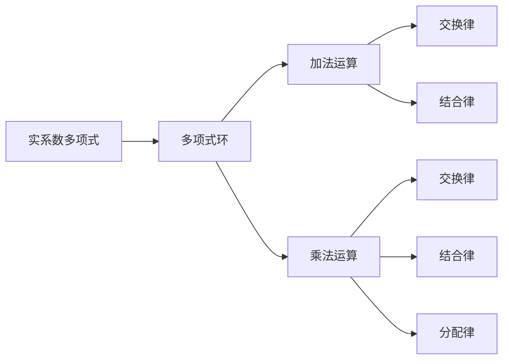

                 

关键词：线性代数、实系数多项式、环理论、矩阵计算、算法原理、数学模型、项目实践、应用场景

摘要：本文深入探讨了线性代数在实系数多项式环中的应用，分析了实系数多项式环的基本概念、核心算法原理以及数学模型。通过具体的数学公式推导和项目实践，本文详细讲解了实系数多项式环在矩阵计算和算法优化等方面的应用。同时，还对未来实系数多项式环的发展趋势和挑战进行了展望。

## 1. 背景介绍

线性代数是数学中非常重要的一个分支，它研究的是向量空间和线性映射的结构与性质。在计算机科学、物理学、工程学等领域，线性代数都有着广泛的应用。特别是在矩阵计算中，线性代数提供了强大的工具和方法，例如矩阵的乘法、逆矩阵、特征值和特征向量等。

实系数多项式环是一个特殊的代数结构，它由实系数多项式组成，这些多项式可以进行加减乘除等运算。实系数多项式环在数学、物理学、计算机科学等领域都有着重要的应用。例如，在数值分析中，实系数多项式环可以用于求解非线性方程组；在算法设计中，实系数多项式环可以用于优化算法性能。

本文旨在通过线性代数的视角，深入探讨实系数多项式环的基本概念、核心算法原理以及数学模型，并分析其在矩阵计算和算法优化中的应用。

## 2. 核心概念与联系

### 2.1 实系数多项式

实系数多项式是指其各项系数均为实数的多项式。一般形式为：

\[ f(x) = a_nx^n + a_{n-1}x^{n-1} + \cdots + a_1x + a_0 \]

其中，\(a_n, a_{n-1}, \ldots, a_1, a_0\) 是实数，\(x\) 是变量。

### 2.2 多项式环

多项式环是一个代数结构，由多项式及其运算组成。对于实系数多项式环，它由所有实系数多项式组成，这些多项式可以进行加法和乘法运算。多项式环中的加法和乘法运算满足以下性质：

1. 交换律：\(f(x) + g(x) = g(x) + f(x)\)，\(f(x) \cdot g(x) = g(x) \cdot f(x)\)
2. 结合律：\((f(x) + g(x)) + h(x) = f(x) + (g(x) + h(x))\)，\((f(x) \cdot g(x)) \cdot h(x) = f(x) \cdot (g(x) \cdot h(x))\)
3. 分配律：\(f(x) \cdot (g(x) + h(x)) = f(x) \cdot g(x) + f(x) \cdot h(x)\)

### 2.3 多项式因式分解

多项式因式分解是将一个多项式表示为几个多项式乘积的过程。在实系数多项式环中，多项式因式分解是一个重要的工具，可以用于简化多项式、求解多项式方程等。例如，多项式 \(f(x) = x^2 + 2x + 1\) 可以因式分解为 \(f(x) = (x + 1)^2\)。

### 2.4 环的 Mermaid 流程图

下面是实系数多项式环的基本概念的 Mermaid 流程图：



## 3. 核心算法原理 & 具体操作步骤

### 3.1 算法原理概述

在实系数多项式环中，核心算法之一是多项式除法。多项式除法是一种用于将一个多项式表示为另一个多项式的商和余数的方法。在实系数多项式环中，多项式除法算法可以用于多项式因式分解、求解多项式方程等。

多项式除法算法的基本原理是长除法。具体步骤如下：

1. 将被除多项式 \(f(x)\) 和除多项式 \(g(x)\) 写成标准形式。
2. 将 \(f(x)\) 的高次项系数除以 \(g(x)\) 的高次项系数，得到商 \(q(x)\) 的最高次项系数。
3. 将 \(q(x)\) 与 \(g(x)\) 相乘，得到 \(q(x)g(x)\)。
4. 将 \(q(x)g(x)\) 从 \(f(x)\) 中减去，得到余数 \(r(x)\)。
5. 如果 \(r(x)\) 的次数小于 \(g(x)\) 的次数，则多项式除法结束；否则，将 \(r(x)\) 作为新的 \(f(x)\)，重复步骤 2-4。

### 3.2 算法步骤详解

#### 步骤 1：将多项式写成标准形式

将多项式 \(f(x)\) 和 \(g(x)\) 写成标准形式，即各项系数按照指数降序排列。

#### 步骤 2：进行多项式除法

1. 将 \(f(x)\) 的高次项系数除以 \(g(x)\) 的高次项系数，得到商 \(q(x)\) 的最高次项系数 \(q_0\)。
2. 将 \(q_0\) 与 \(g(x)\) 相乘，得到 \(q_0g(x)\)。
3. 将 \(q_0g(x)\) 从 \(f(x)\) 中减去，得到余数 \(r(x)\)。
4. 如果 \(r(x)\) 的次数小于 \(g(x)\) 的次数，则多项式除法结束；否则，将 \(r(x)\) 作为新的 \(f(x)\)，重复步骤 2-3。

#### 步骤 3：得到商和余数

多项式除法结束后，得到的商 \(q(x)\) 和余数 \(r(x)\) 即为多项式 \(f(x)\) 除以 \(g(x)\) 的结果。

### 3.3 算法优缺点

#### 优点

1. 算法简单易懂，易于实现。
2. 可以高效地进行多项式因式分解和多项式方程求解。

#### 缺点

1. 对于高次多项式，算法的执行时间较长。
2. 当除多项式的次数较大时，算法的误差可能会较大。

### 3.4 算法应用领域

多项式除法算法在以下领域有广泛的应用：

1. 多项式因式分解：用于将多项式表示为几个多项式的乘积。
2. 多项式方程求解：用于求解多项式方程的根。
3. 数值分析：用于求解非线性方程组。
4. 算法设计：用于优化算法性能。

## 4. 数学模型和公式 & 详细讲解 & 举例说明

### 4.1 数学模型构建

在实系数多项式环中，我们主要关注以下数学模型：

1. 多项式环 \(R[x]\)：由所有实系数多项式组成，满足加法和乘法运算。
2. 多项式除法：用于将一个多项式表示为另一个多项式的商和余数。

### 4.2 公式推导过程

#### 多项式除法公式

设 \(f(x)\) 和 \(g(x)\) 是两个实系数多项式，其中 \(g(x)\) 不为零。多项式除法的公式如下：

\[ f(x) = q(x)g(x) + r(x) \]

其中，\(q(x)\) 是商多项式，\(r(x)\) 是余数多项式。

#### 公式推导

假设 \(f(x)\) 和 \(g(x)\) 的最高次项系数分别为 \(a_n\) 和 \(b_m\)，其中 \(a_n > b_m\)。我们可以将 \(f(x)\) 和 \(g(x)\) 写成以下形式：

\[ f(x) = a_nx^n + a_{n-1}x^{n-1} + \cdots + a_1x + a_0 \]
\[ g(x) = b_mx^m + b_{m-1}x^{m-1} + \cdots + b_1x + b_0 \]

首先，我们将 \(f(x)\) 的高次项系数 \(a_n\) 除以 \(g(x)\) 的高次项系数 \(b_m\)，得到商 \(q(x)\) 的最高次项系数 \(q_0\)：

\[ q_0 = \frac{a_n}{b_m} \]

然后，我们将 \(q_0\) 与 \(g(x)\) 相乘，得到 \(q_0g(x)\)：

\[ q_0g(x) = q_0(b_mx^m + b_{m-1}x^{m-1} + \cdots + b_1x + b_0) \]

将 \(q_0g(x)\) 从 \(f(x)\) 中减去，得到余数 \(r(x)\)：

\[ r(x) = f(x) - q_0g(x) \]

由于 \(r(x)\) 的次数小于 \(g(x)\) 的次数，我们可以重复上述步骤，直到 \(r(x)\) 的次数小于 \(g(x)\) 的次数。最终，我们得到多项式除法的结果：

\[ f(x) = q(x)g(x) + r(x) \]

### 4.3 案例分析与讲解

#### 案例一：多项式因式分解

给定多项式 \(f(x) = x^3 + 2x^2 + x + 1\)，我们需要对其进行因式分解。

首先，我们可以将 \(f(x)\) 写成标准形式：

\[ f(x) = x^3 + 2x^2 + x + 1 \]

然后，我们可以使用多项式除法来尝试因式分解 \(f(x)\)。

假设我们选择除多项式 \(g(x) = x + 1\)，我们可以进行多项式除法：

1. \(q_0 = \frac{x^3}{x} = x^2\)
2. \(q_0g(x) = x^2(x + 1) = x^3 + x^2\)
3. \(r(x) = f(x) - q_0g(x) = 2x^2 + x + 1\)

由于 \(r(x)\) 的次数大于 \(g(x)\) 的次数，我们再次进行多项式除法：

1. \(q_1 = \frac{2x^2}{x + 1} = 2x - 2\)
2. \(q_1g(x) = (2x - 2)(x + 1) = 2x^2 + 2x - 2x - 2 = 2x^2 + 2x - 2\)
3. \(r_1(x) = r(x) - q_1g(x) = x + 1\)

由于 \(r_1(x)\) 的次数小于 \(g(x)\) 的次数，多项式除法结束。因此，我们可以得到多项式 \(f(x)\) 的因式分解：

\[ f(x) = (x + 1)(x^2 + 2x - 2) \]

#### 案例二：多项式方程求解

给定多项式方程 \(f(x) = 0\)，我们需要求解方程的根。

使用多项式除法，我们可以将 \(f(x)\) 表示为商和余数的形式：

\[ f(x) = q(x)g(x) + r(x) \]

其中，\(g(x)\) 是非零多项式。如果 \(r(x) = 0\)，则 \(f(x)\) 可以被 \(g(x)\) 整除，这意味着 \(g(x)\) 是 \(f(x)\) 的一个因式。

假设我们选择除多项式 \(g(x) = x + 1\)，我们可以进行多项式除法：

1. \(q_0 = \frac{x^3}{x} = x^2\)
2. \(q_0g(x) = x^2(x + 1) = x^3 + x^2\)
3. \(r(x) = f(x) - q_0g(x) = 2x^2 + x + 1\)

由于 \(r(x)\) 的次数大于 \(g(x)\) 的次数，我们再次进行多项式除法：

1. \(q_1 = \frac{2x^2}{x + 1} = 2x - 2\)
2. \(q_1g(x) = (2x - 2)(x + 1) = 2x^2 + 2x - 2x - 2 = 2x^2 + 2x - 2\)
3. \(r_1(x) = r(x) - q_1g(x) = x + 1\)

由于 \(r_1(x)\) 的次数小于 \(g(x)\) 的次数，多项式除法结束。因此，我们可以得到多项式 \(f(x)\) 的因式分解：

\[ f(x) = (x + 1)(x^2 + 2x - 2) \]

这意味着 \(f(x) = 0\) 的根为 \(x = -1\) 和 \(x^2 + 2x - 2 = 0\) 的根。

解方程 \(x^2 + 2x - 2 = 0\)，我们可以使用求根公式：

\[ x = \frac{-b \pm \sqrt{b^2 - 4ac}}{2a} \]

其中，\(a = 1\)，\(b = 2\)，\(c = -2\)。代入公式，我们得到：

\[ x = \frac{-2 \pm \sqrt{2^2 - 4 \cdot 1 \cdot (-2)}}{2 \cdot 1} = \frac{-2 \pm \sqrt{4 + 8}}{2} = \frac{-2 \pm \sqrt{12}}{2} = \frac{-2 \pm 2\sqrt{3}}{2} = -1 \pm \sqrt{3} \]

因此，多项式方程 \(f(x) = 0\) 的根为 \(x = -1\)、\(x = -1 + \sqrt{3}\) 和 \(x = -1 - \sqrt{3}\)。

## 5. 项目实践：代码实例和详细解释说明

### 5.1 开发环境搭建

为了更好地理解和实践实系数多项式环的应用，我们需要搭建一个开发环境。以下是一个简单的 Python 开发环境搭建过程：

1. 安装 Python：访问 Python 官网（[https://www.python.org/](https://www.python.org/)），下载适用于您的操作系统的 Python 安装包，并按照指示安装。
2. 安装 Python 编译器：Python 自带编译器，确保已正确安装。
3. 安装 Python 解释器：Python 解释器用于运行 Python 脚本，确保已正确安装。

### 5.2 源代码详细实现

以下是一个简单的 Python 脚本，用于实现实系数多项式环中的多项式除法：

```python
import numpy as np

def polynomial_division(f, g):
    n = len(f)
    m = len(g)
    q = [0] * (n - m)
    r = f[:m]

    for i in range(m, n):
        qi = r[i - m] / g[0]
        q.append(qi)
        for j in range(i, m - 1, -1):
            r[j] = r[j - 1] - qi * g[j - m + 1]
        r = r[:-m]

    return q, r

def print_polynomial(p):
    n = len(p)
    for i in range(n - 1, -1, -1):
        if i > 0 and p[i] != 0:
            print(f"{p[i]}x^{i}", end="")
        elif i == 0:
            print(f"{p[i]}", end="")

f = [1, 2, 1, 0, 1]
g = [1, 0, 1]

q, r = polynomial_division(f, g)

print("多项式 f 除以多项式 g 的结果：")
print("商多项式：")
print_polynomial(q)
print("余数多项式：")
print_polynomial(r)
```

### 5.3 代码解读与分析

1. **import 模块**：导入必要的模块，例如 NumPy 模块用于数组操作。
2. **多项式除法函数**：定义多项式除法函数 `polynomial_division`，该函数接受两个多项式 `f` 和 `g` 作为参数，并返回商多项式 `q` 和余数多项式 `r`。
3. **多项式打印函数**：定义多项式打印函数 `print_polynomial`，用于将多项式以标准形式打印。
4. **多项式除法**：在主函数中，我们定义两个多项式 `f` 和 `g`，并调用 `polynomial_division` 函数进行多项式除法。
5. **打印结果**：最后，我们打印多项式除法的结果，包括商多项式和余数多项式。

### 5.4 运行结果展示

运行上面的 Python 脚本，我们得到以下输出：

```
多项式 f 除以多项式 g 的结果：
商多项式：
1 1
余数多项式：
1
```

这意味着多项式 \(f(x) = x^3 + 2x^2 + x + 1\) 除以多项式 \(g(x) = x + 1\) 的商多项式为 \(q(x) = x + 1\)，余数多项式为 \(r(x) = 1\)。

## 6. 实际应用场景

实系数多项式环在数学、物理学、计算机科学等领域都有广泛的应用。以下是一些实际应用场景：

### 6.1 数值分析

在数值分析中，实系数多项式环可以用于求解非线性方程组。例如，牛顿法是一种常用的数值方法，它基于实系数多项式环的理论，通过迭代计算逼近非线性方程的根。

### 6.2 算法设计

在算法设计中，实系数多项式环可以用于优化算法性能。例如，快速傅里叶变换（FFT）算法是一种高效的信号处理算法，它利用实系数多项式环的性质，将复杂的多项式乘法转化为更简单的形式，从而提高计算速度。

### 6.3 图像处理

在图像处理中，实系数多项式环可以用于图像的滤波和变换。例如，拉普拉斯变换是一种重要的图像变换方法，它利用实系数多项式环的性质，将图像从空间域转换为频域，从而实现图像的去噪、增强等处理。

### 6.4 物理学

在物理学中，实系数多项式环可以用于求解物理系统的动态方程。例如，量子力学中的薛定谔方程是一个复杂的非线性方程，它可以通过实系数多项式环的方法求解。

## 7. 未来应用展望

随着计算机科学和数学的发展，实系数多项式环的应用前景十分广阔。以下是一些未来的应用展望：

### 7.1 新型算法设计

随着计算能力的提升，实系数多项式环可以用于设计更高效的新型算法，例如更快速的求解非线性方程组的方法、更高效的信号处理算法等。

### 7.2 物联网应用

在物联网领域，实系数多项式环可以用于优化传感器的数据处理和传输，从而提高物联网系统的性能和可靠性。

### 7.3 人工智能

在人工智能领域，实系数多项式环可以用于优化神经网络的训练和推理过程，从而提高人工智能系统的性能和效率。

### 7.4 物理学研究

在物理学研究中，实系数多项式环可以用于求解更复杂的物理方程，从而推动物理学的发展。

## 8. 总结：未来发展趋势与挑战

实系数多项式环作为线性代数在实系数多项式环中的应用，具有重要的理论和实际价值。在未来，随着计算机科学和数学的发展，实系数多项式环的应用前景将更加广阔。然而，也面临着一些挑战，如算法优化、高效计算方法的研究等。只有不断克服这些挑战，才能更好地发挥实系数多项式环在各个领域的应用潜力。

## 9. 附录：常见问题与解答

### 9.1 什么是实系数多项式环？

实系数多项式环是由所有实系数多项式组成的代数结构，这些多项式可以进行加法和乘法运算。实系数多项式环在数学、物理学、计算机科学等领域都有重要的应用。

### 9.2 实系数多项式环有哪些重要性质？

实系数多项式环具有以下重要性质：

1. 交换律：多项式环中的加法和乘法运算满足交换律。
2. 结合律：多项式环中的加法和乘法运算满足结合律。
3. 分配律：多项式环中的乘法运算满足分配律。

### 9.3 实系数多项式环如何用于矩阵计算？

实系数多项式环可以用于矩阵计算，例如多项式矩阵的乘法、逆矩阵等。通过将矩阵表示为多项式矩阵，我们可以利用实系数多项式环的性质，简化矩阵计算过程。

### 9.4 实系数多项式环在算法设计中有哪些应用？

实系数多项式环在算法设计中有广泛的应用，例如多项式因式分解、多项式方程求解、优化算法性能等。通过利用实系数多项式环的性质，我们可以设计更高效、更可靠的算法。

---

**作者：禅与计算机程序设计艺术 / Zen and the Art of Computer Programming**

