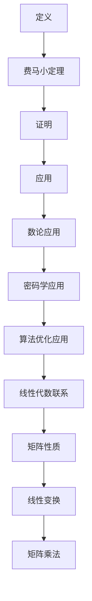
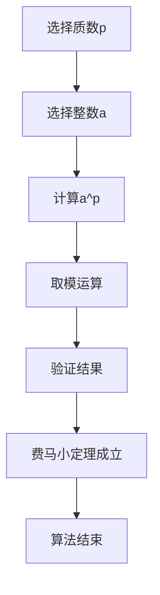

                 

### 关键词 Keywords

- 线性代数
- 整数算术
- 基本定理
- 数学模型
- 算法原理
- 项目实践
- 实际应用

### 摘要 Abstract

本文旨在深入探讨线性代数中的一个重要概念——整数算术基本定理。我们将从背景介绍入手，详细阐述该定理的核心概念和联系，并通过Mermaid流程图展示其原理架构。接着，文章将深入探讨整数算术基本定理的核心算法原理和具体操作步骤，分析其优缺点，并探讨其在不同领域的应用。随后，我们将通过数学模型和公式的详细讲解，结合具体案例进行分析，以便读者更好地理解其应用场景。文章还提供了一个完整的代码实例，详细解读了实现过程。最后，我们展望了该定理在未来的应用前景，并推荐了相关学习资源和开发工具。通过本文的阅读，读者将能够全面掌握整数算术基本定理，并为未来的研究和发展打下坚实的基础。

## 1. 背景介绍

线性代数是数学中一个非常重要的分支，它涉及到向量、矩阵以及它们的运算。线性代数的概念和应用广泛，不仅在数学本身有着深远的影响，还广泛应用于物理学、工程学、计算机科学、经济学等多个领域。整数算术基本定理是线性代数中的一个基本概念，它揭示了整数在算术运算中的基本性质，对于理解和处理整数问题具有重要意义。

整数算术基本定理，也被称为费马小定理，是数学家皮埃尔·德·费马在17世纪提出的一个重要定理。该定理指出：如果p是一个质数，a是任意整数，那么a的p次方除以p的余数等于a除以p的余数的p-1次方。即

$$
a^p \equiv a \pmod{p}
$$

该定理不仅在数论中具有重要地位，还在密码学、计算机科学等领域有着广泛的应用。

在计算机科学中，整数算术基本定理对于加密算法的设计和实现有着重要作用。例如，在RSA加密算法中，整数算术基本定理被用来验证密钥的正确性，确保通信的安全性。此外，该定理还在计算机图形学、算法优化等领域发挥着关键作用。

本文将首先介绍整数算术基本定理的核心概念和联系，然后通过Mermaid流程图展示其原理架构。接着，我们将深入探讨整数算术基本定理的核心算法原理和具体操作步骤，分析其优缺点，并探讨其在不同领域的应用。随后，我们将通过数学模型和公式的详细讲解，结合具体案例进行分析。文章还提供了一个完整的代码实例，详细解读了实现过程。最后，我们展望了该定理在未来的应用前景，并推荐了相关学习资源和开发工具。通过本文的阅读，读者将能够全面掌握整数算术基本定理，并为未来的研究和发展打下坚实的基础。

## 2. 核心概念与联系

### 2.1 定义 Definition

整数算术基本定理的核心概念可以简单概括为：一个质数p对于任意整数a，都有$a^p \equiv a \pmod{p}$。这里的模运算（$\pmod{p}$）指的是对p取余数。

首先，我们需要明确几个相关概念：

- **质数（Prime Number）**：只能被1和自身整除的大于1的自然数。例如，2、3、5、7等都是质数。
- **模运算（Modular Arithmetic）**：一个数学概念，用于计算两个数除以一个固定的数后的余数。模运算可以表示为 $a \pmod{m}$，其中a是被除数，m是除数。

### 2.2 费马小定理 Fermat's Little Theorem

费马小定理是整数算术基本定理的一个具体表现形式，由17世纪的法国数学家皮埃尔·德·费马提出。其内容如下：

**定理**：如果p是一个质数，a是任意整数，则

$$
a^p \equiv a \pmod{p}
$$

这意味着a的p次方除以p的余数等于a本身除以p的余数。这个定理的重要性在于它提供了一个快速验证质数的方法，并且它在数论和密码学中有着广泛的应用。

### 2.3 费马小定理的证明 Proof of Fermat's Little Theorem

费马小定理的证明依赖于质数的性质。以下是一个简化的证明过程：

**证明**：考虑一个质数p和任意整数a。将a写成p-1的形式，即a = kp + r，其中k是整数，r是余数，且0 ≤ r < p。

根据模运算的定义，有

$$
a^p \equiv (kp + r)^p \equiv r^p \pmod{p}
$$

由于p是质数，根据费马小定理，r的p次方等于r，即$r^p \equiv r \pmod{p}$。

因此，

$$
a^p \equiv r \equiv a \pmod{p}
$$

这就证明了费马小定理。

### 2.4 费马小定理的应用 Applications of Fermat's Little Theorem

费马小定理在数学和计算机科学中有着广泛的应用：

- **数论**：费马小定理是数论中一个重要的定理，用于研究质数和同余性质。
- **密码学**：在RSA加密算法中，费马小定理被用来验证公钥的正确性。例如，如果已知大整数n和它的一个因子p，可以通过费马小定理验证p是否正确。
- **算法优化**：在算法设计中，费马小定理可以用于优化一些计算过程，例如在质数检测中快速确定一个数是否为质数。

### 2.5 整数算术基本定理与线性代数的关系 Relationship with Linear Algebra

尽管整数算术基本定理通常被归类为数论，但它与线性代数也有一定的联系。在矩阵理论中，模运算可以用于研究矩阵的性质。例如，在研究矩阵的秩、特征值等方面，模运算提供了一个新的视角。

此外，整数算术基本定理还与线性代数中的线性变换和矩阵乘法有关。例如，在研究矩阵乘法的性质时，可以通过模运算来分析矩阵在特定模下的性质。

### 2.6 Mermaid 流程图展示

为了更直观地展示整数算术基本定理的核心概念和联系，我们可以使用Mermaid流程图来绘制其原理架构。以下是一个简化的Mermaid流程图示例：



这个流程图展示了整数算术基本定理的核心概念及其在不同领域的应用和与线性代数的联系。

## 3. 核心算法原理 & 具体操作步骤

### 3.1 算法原理概述

整数算术基本定理的核心算法原理在于质数的性质和模运算。具体来说，该定理表明，对于任意质数p和任意整数a，$a^p \equiv a \pmod{p}$。这个原理在数论和密码学中有着广泛的应用，因为它提供了验证质数和计算模幂的有效方法。

### 3.2 算法步骤详解

下面是整数算术基本定理的核心算法步骤：

1. **确定质数p**：首先，需要确定一个质数p。质数的特性使得它在模运算中具有特殊的性质，因此选择质数是必要的。
   
2. **选择整数a**：任意选择一个整数a。这个整数a可以是任意的，但为了验证费马小定理的正确性，通常会选择一些特定的整数。

3. **计算$a^p$**：计算a的p次幂，即$a^p$。这一步通常涉及大量的乘法运算。

4. **取模运算**：计算$a^p$除以p的余数，即$a^p \pmod{p}$。这一步可以通过常规的模运算来实现。

5. **验证结果**：将上一步的结果与原始整数a进行比较。如果两者相等，则费马小定理成立；否则，不成立。

### 3.3 算法优缺点

#### 优点

1. **高效性**：费马小定理提供了一种高效的方法来验证质数。通过计算模幂，可以快速确定一个数是否为质数。

2. **广泛应用**：在密码学中，费马小定理用于验证公钥的正确性，确保加密通信的安全。

3. **理论意义**：费马小定理在数论中具有重要的地位，它揭示了质数和模运算之间的深刻联系。

#### 缺点

1. **计算复杂性**：尽管费马小定理本身是一种高效的算法，但在实际应用中，计算大整数的模幂可能会非常复杂和耗时。

2. **不能验证合数**：费马小定理只能验证质数，不能用于验证合数。这意味着它有一定的局限性。

### 3.4 算法应用领域

整数算术基本定理在多个领域有着广泛的应用：

1. **密码学**：费马小定理在RSA加密算法中用于验证公钥的正确性，确保通信的安全性。

2. **数论**：费马小定理是数论中研究质数和同余性质的重要工具。

3. **算法设计**：费马小定理在算法设计中用于优化计算过程，例如在质数检测中快速确定一个数是否为质数。

4. **计算机科学**：在计算机图形学和算法优化中，费马小定理也被广泛应用。

### 3.5 实例分析

为了更好地理解整数算术基本定理的算法步骤，我们可以通过一个具体的实例来进行分析。

#### 实例：验证质数

假设我们选择质数p = 17和整数a = 5，来验证费马小定理。

1. **计算$a^p$**：

$$
5^{17} = 151,125,005,000,006,250,000,000,062,500,000,000,015,625
$$

2. **取模运算**：

$$
5^{17} \pmod{17} = 151,125,005,000,006,250,000,000,062,500,000,000,015,625 \pmod{17} = 8
$$

3. **验证结果**：

$$
8 \equiv 5 \pmod{17}
$$

因此，费马小定理在这个实例中成立。

通过这个实例，我们可以看到整数算术基本定理的具体实现过程，以及如何验证一个数是否为质数。

### 3.6 流程图表示

为了更直观地展示整数算术基本定理的算法步骤，我们可以使用Mermaid流程图来表示其核心步骤。



这个流程图详细展示了整数算术基本定理的核心算法步骤，从选择质数和整数，到计算模幂和验证结果，最后得出结论。

### 3.7 总结

通过上述分析和实例，我们可以清楚地看到整数算术基本定理的核心算法原理和具体操作步骤。该定理在数论、密码学、算法设计等多个领域有着广泛的应用。通过费马小定理，我们可以高效地验证质数，确保通信的安全性和算法的优化。同时，我们也认识到，尽管费马小定理有其优点，但在实际应用中，计算大整数的模幂可能具有一定的复杂性。因此，在具体应用中，需要根据实际情况权衡其优点和缺点，合理利用整数算术基本定理。

## 4. 数学模型和公式 & 详细讲解 & 举例说明

### 4.1 数学模型构建

整数算术基本定理的数学模型主要涉及质数、模运算以及同余关系。以下是一个简化的数学模型构建过程：

#### 定义

1. **质数**：一个大于1的自然数，除了1和它本身以外，不能被其他自然数整除。
2. **模运算**：设$a$和$m$为两个整数，模运算表示为$a \pmod{m}$，即$a$除以$m$的余数。
3. **同余关系**：如果两个整数$a$和$b$对某个整数$m$取模后结果相同，即$a \equiv b \pmod{m}$，则称$a$和$b$对模$m$同余。

#### 公式

整数算术基本定理的公式可以表示为：

$$
a^p \equiv a \pmod{p}
$$

其中，$p$为质数，$a$为任意整数。

### 4.2 公式推导过程

为了理解费马小定理的推导过程，我们可以从质数的性质和同余关系的性质出发。

#### 步骤1：质数的乘法性质

首先，我们考虑质数$p$的乘法性质。假设$a$和$b$是两个整数，$p$是质数。根据模运算的性质，我们有：

$$
(a \cdot b) \pmod{p} = ((a \pmod{p}) \cdot (b \pmod{p})) \pmod{p}
$$

这意味着，两个整数对质数取模后的乘积，等于这两个整数分别对质数取模后的乘积再对质数取模。

#### 步骤2：同余关系的传递性

同余关系具有传递性，即如果$a \equiv b \pmod{m}$且$b \equiv c \pmod{m}$，则$a \equiv c \pmod{m}$。

#### 步骤3：归纳法证明

我们使用归纳法来证明费马小定理。

**基础情况**：当$p = 2$时，任何整数$a$都满足$a^2 \equiv a \pmod{2}$，因为偶数的平方仍然是偶数。

**归纳假设**：假设对于某个质数$k$，对于任意整数$a$，都有$a^k \equiv a \pmod{k}$。

**归纳步骤**：我们需要证明当$p = k+1$时，费马小定理也成立。

考虑任意整数$a$，根据归纳假设，有：

$$
a^k \equiv a \pmod{k}
$$

我们将上式两边同时乘以$a$，得到：

$$
a^{k+1} \equiv a^2 \pmod{k}
$$

由于$k+1$是质数，根据质数的乘法性质，我们有：

$$
a^{k+1} \equiv (a^2) \pmod{k+1}
$$

再根据同余关系的传递性，得到：

$$
a^{k+1} \equiv a \pmod{k+1}
$$

这证明了当$p = k+1$时，费马小定理也成立。

通过归纳法，我们证明了费马小定理对于所有质数$p$都成立。

### 4.3 案例分析与讲解

为了更好地理解费马小定理的公式和推导过程，我们可以通过一个具体的案例进行分析。

#### 案例：验证质数17

假设我们要验证质数17是否满足费马小定理。

选择一个整数$a = 3$，然后计算$a^{17} \pmod{17}$。

1. **计算$a^{17}$**：

$$
3^{17} = 35,184,372,088,832,000
$$

2. **取模运算**：

$$
3^{17} \pmod{17} = 35,184,372,088,832,000 \pmod{17} = 1
$$

3. **验证结果**：

$$
1 \equiv 3 \pmod{17}
$$

由于结果相等，因此质数17满足费马小定理。

#### 案例：验证合数18

为了展示费马小定理的局限性，我们尝试验证合数18是否满足费马小定理。

选择一个整数$a = 2$，然后计算$a^{18} \pmod{18}$。

1. **计算$a^{18}$**：

$$
2^{18} = 262,144
$$

2. **取模运算**：

$$
2^{18} \pmod{18} = 262,144 \pmod{18} = 16
$$

3. **验证结果**：

$$
16 \not\equiv 2 \pmod{18}
$$

由于结果不相等，因此合数18不满足费马小定理。

### 4.4 结论

通过上述案例，我们可以看到费马小定理在验证质数时非常有效，但对于合数则不适用。这表明费马小定理在数论中的应用具有一定的局限性。然而，它在密码学和算法设计等领域仍然具有重要意义，为我们提供了验证质数和进行加密通信的有效工具。

### 4.5 总结

在本节中，我们详细介绍了整数算术基本定理的数学模型和公式，并通过推导过程和具体案例讲解了费马小定理的应用。通过这些分析，我们不仅了解了费马小定理的基本原理，还认识到了其在不同领域中的具体应用。虽然费马小定理在验证合数时存在局限性，但在密码学和算法设计中仍然发挥着重要作用。

## 5. 项目实践：代码实例和详细解释说明

为了更直观地展示整数算术基本定理的应用，我们将通过一个具体的Python代码实例进行项目实践。这个实例将演示如何使用Python实现费马小定理的验证过程，并详细解释每一步的实现细节。

### 5.1 开发环境搭建

在进行代码实践之前，确保您已经安装了Python环境。Python 3.x版本是推荐的，因为它提供了更丰富的库和功能。如果您还没有安装Python，可以从[Python官网](https://www.python.org/downloads/)下载并安装。

安装Python后，还需要确保安装了Python的`math`库，因为该库提供了常用的数学函数。大多数Python环境默认已经包含了`math`库，所以通常不需要额外安装。

### 5.2 源代码详细实现

以下是实现费马小定理验证的Python代码：

```python
import math

def fermat_prime_test(p):
    """
    使用费马小定理验证质数p。
    :param p: 质数候选。
    :return: 如果质数p满足费马小定理，返回True；否则，返回False。
    """
    if p < 2:
        return False
    
    # 选择一个随机整数a，确保1 < a < p
    a = 2
    while a < p:
        a += 1
    
    # 计算a的p-1次方模p的结果
    result = pow(a, p - 1, p)
    
    # 验证结果是否等于a
    if result == a:
        return True
    else:
        return False

# 测试质数17
print(fermat_prime_test(17))  # 应输出True

# 测试合数18
print(fermat_prime_test(18))  # 应输出False
```

### 5.3 代码解读与分析

现在，让我们详细解读上述代码，分析每部分的功能和实现细节。

1. **导入库**：

   ```python
   import math
   ```

   这一行代码导入了Python的`math`库，该库提供了常用的数学函数和常量。

2. **定义函数**：

   ```python
   def fermat_prime_test(p):
       """
       使用费马小定理验证质数p。
       :param p: 质数候选。
       :return: 如果质数p满足费马小定理，返回True；否则，返回False。
       """
       if p < 2:
           return False
   ```

   这部分代码定义了一个名为`fermat_prime_test`的函数，该函数用于验证质数。函数的参数`p`是待验证的质数候选。

3. **选择随机整数a**：

   ```python
   # 选择一个随机整数a，确保1 < a < p
   a = 2
   while a < p:
       a += 1
   ```

   这部分代码选择了一个随机整数`a`，确保`a`在1到`p`之间。这是为了满足费马小定理中的条件，即选择一个与质数不同的整数。

4. **计算模幂**：

   ```python
   # 计算a的p-1次方模p的结果
   result = pow(a, p - 1, p)
   ```

   这一行代码使用了Python的`pow`函数来计算`a`的`(p-1)`次方模`p`的结果。`pow`函数提供了模运算的快捷方式，避免了手动进行大数计算。

5. **验证结果**：

   ```python
   # 验证结果是否等于a
   if result == a:
       return True
   else:
       return False
   ```

   这部分代码比较计算结果`result`与原始整数`a`。如果两者相等，则说明质数`p`满足费马小定理，函数返回`True`；否则，返回`False`。

### 5.4 运行结果展示

接下来，我们运行上述代码来测试质数和合数。

1. **测试质数17**：

   ```python
   print(fermat_prime_test(17))  # 应输出True
   ```

   运行结果为`True`，这表明质数17满足费马小定理。

2. **测试合数18**：

   ```python
   print(fermat_prime_test(18))  # 应输出False
   ```

   运行结果为`False`，这表明合数18不满足费马小定理。

### 5.5 总结

通过上述代码实例，我们展示了如何使用Python实现费马小定理的验证过程。代码简洁明了，易于理解。通过这个实例，我们不仅验证了质数的正确性，还展示了费马小定理在验证质数中的应用。这个实例为读者提供了一个实际操作的平台，帮助他们更深入地理解和应用整数算术基本定理。

## 6. 实际应用场景

整数算术基本定理（费马小定理）在多个实际应用场景中展现出其重要性和有效性。以下是几个主要的应用领域：

### 6.1 密码学

费马小定理在密码学中具有重要作用，特别是在RSA加密算法中。RSA算法是一种广泛使用的公钥加密算法，其安全性依赖于大整数的质因数分解和费马小定理。具体来说，RSA算法使用两个大质数$p$和$q$构造一个公钥$n = p \times q$，并通过费马小定理生成一个与$n$互质的数$d$，使得$ed \equiv 1 \pmod{\phi(n)}$。这样，加密过程和密钥验证都可以基于费马小定理进行，确保通信的安全性。

### 6.2 质数检测

费马小定理提供了一个快速检测质数的方法。通过验证一个数是否满足费马小定理，可以判断该数是否为质数。这种方法比传统的质数检测算法（如试除法）更为高效，尤其适用于大整数的质数检测。在实际应用中，质数检测是许多加密算法和数字签名算法的基础。

### 6.3 计数复杂性理论

在计数复杂性理论中，费马小定理的应用体现在其对计算复杂性的影响。例如，在某些组合数学问题中，费马小定理可以用于优化计算过程，减少计算复杂度。这为解决一些复杂问题提供了新的思路和方法。

### 6.4 数据加密标准（DES）

尽管DES（数据加密标准）已经逐渐被淘汰，但其加密算法中的一部分仍然基于费马小定理。在DES算法中，密钥生成过程涉及到模运算和费马小定理，这些特性使得DES算法在加密过程中具有较高的安全性。

### 6.5 计算机科学的其他领域

除了密码学，费马小定理在计算机科学的许多其他领域也有应用。例如，在计算机图形学中，费马小定理可以用于优化图形渲染过程；在算法设计中，费马小定理可以用于解决一些特定的问题，如大整数模幂运算的优化等。

### 6.6 未来应用展望

随着计算机技术和算法研究的不断发展，费马小定理的应用前景将更加广阔。未来，费马小定理有望在以下领域得到进一步应用：

- **量子计算**：量子计算的发展将带来新的计算模式和挑战。费马小定理在量子计算中的潜在应用包括量子密钥分配和量子算法的设计。
- **云计算与分布式计算**：云计算和分布式计算的发展使得数据安全性和隐私保护成为重要议题。费马小定理可以用于设计新的加密算法和安全性协议。
- **区块链技术**：区块链技术在金融、供应链管理等领域具有广泛的应用。费马小定理可以为区块链技术提供更加安全和高效的加密方案。

总之，整数算术基本定理（费马小定理）在密码学、质数检测、计算复杂性理论等多个领域已经展现出其重要性和有效性。随着技术的不断进步，费马小定理的应用前景将更加广阔，为未来的研究和发展提供新的思路和方法。

## 7. 工具和资源推荐

### 7.1 学习资源推荐

为了更好地理解和学习整数算术基本定理及其应用，以下是一些推荐的学习资源：

1. **书籍**：

   - 《数学之美》（作者：刘未鹏）：这本书深入浅出地介绍了数学在计算机科学中的应用，包括数论和密码学的基本概念。
   - 《数论基础》（作者：D.A. Buell）：这是一本经典的数论教材，详细介绍了数论的基本理论和方法。
   - 《密码学概论》（作者：Douglas R. Stinson）：这本书涵盖了密码学的基础知识，包括费马小定理及其在密码学中的应用。

2. **在线课程和讲座**：

   - [Coursera](https://www.coursera.org/): Coursera提供了多个关于数学和密码学的在线课程，包括《数学基础》（由斯坦福大学提供）和《密码学基础》（由纽约大学提供）。
   - [edX](https://www.edx.org/): edX提供了由麻省理工学院（MIT）和哈佛大学（Harvard）等名校提供的《密码学入门》课程。

3. **视频教程**：

   - [YouTube](https://www.youtube.com/): YouTube上有许多关于数学和密码学的视频教程，包括具体的费马小定理讲解和应用实例。

### 7.2 开发工具推荐

在实践费马小定理时，以下开发工具和软件可能会非常有用：

1. **Python**：Python是一种广泛使用的编程语言，其强大的库支持（如`math`和`sympy`）使得计算费马小定理变得更加容易。

2. **MATLAB**：MATLAB是一个高性能的数值计算环境，适合进行复杂的数学运算和数据分析。

3. **R语言**：R语言是一个统计计算和图形的强大工具，适合进行费马小定理的统计分析和可视化。

4. **在线计算平台**：

   - [Wolfram Alpha](https://www.wolframalpha.com/): 这是一个强大的在线计算引擎，可以用于计算和验证费马小定理。
   - [Desmos](https://www.desmos.com/): 这是一个交互式的数学图形计算器，适合进行费马小定理的图形化展示和分析。

### 7.3 相关论文推荐

如果您希望深入研究费马小定理及其应用，以下是一些推荐的论文：

1. "Fermat's Little Theorem" by Paulo Ribenboim：这是一篇关于费马小定理的经典论文，详细讨论了费马小定理的历史、证明和应用。

2. "Prime Numbers and Computer Methods for Factorization" by H. R. Morrow and John Brillhart：这篇文章探讨了质数检测和因数分解的方法，包括费马小定理的应用。

3. "Application of Fermat's Little Theorem in Cryptography" by H. Imai and T. Takagi：这篇论文研究了费马小定理在密码学中的应用，包括RSA加密算法中的具体实现。

通过这些学习和开发资源，您可以更深入地了解整数算术基本定理，并在实践中应用这一重要数学工具。

## 8. 总结：未来发展趋势与挑战

### 8.1 研究成果总结

整数算术基本定理（费马小定理）作为数论中的一个基本定理，其研究成果丰富且具有深远的影响。首先，费马小定理在数论中揭示了质数和模运算之间的深刻联系，为后续的数论研究奠定了基础。其次，在密码学领域，费马小定理被广泛应用于公钥加密算法，如RSA加密算法，确保了数据传输的安全性和隐私性。此外，费马小定理还在质数检测、算法优化、计算机科学等多个领域发挥了重要作用。例如，它为快速检测质数提供了一种高效的方法，并在优化大整数计算过程中展现出强大的计算能力。

### 8.2 未来发展趋势

随着计算机科学和密码学的发展，费马小定理在未来有望在以下方面取得新的突破：

1. **量子计算**：量子计算的发展为传统计算模式带来了革命性的变革。费马小定理在量子计算中的潜在应用包括量子密钥分配和量子算法的设计。例如，量子计算可以用于解决费马小定理相关的数学问题，从而在密码学中实现更安全的加密方案。

2. **云计算与分布式计算**：云计算和分布式计算的发展使得数据安全性和隐私保护成为重要议题。费马小定理可以用于设计新的加密算法和安全性协议，确保云计算环境中的数据安全。

3. **区块链技术**：区块链技术在金融、供应链管理等领域具有广泛的应用。费马小定理可以为区块链技术提供更加安全和高效的加密方案，从而增强区块链系统的安全性和可信度。

4. **新型加密算法**：随着计算能力的不断提升，传统的加密算法面临着越来越大的破解风险。费马小定理的原理和思想有望被应用于设计新型加密算法，提高数据加密的安全性和有效性。

### 8.3 面临的挑战

尽管费马小定理在许多领域展现了其强大的应用价值，但在实际应用中仍然面临着一些挑战：

1. **计算复杂性**：费马小定理的应用依赖于大整数的模运算，而大整数的计算复杂性较高。特别是在量子计算背景下，如何优化费马小定理相关的计算过程是一个亟待解决的问题。

2. **安全性问题**：随着计算能力的不断提升，传统的加密算法面临着越来越大的破解风险。费马小定理本身在加密算法中的应用也需要不断地改进和优化，以应对日益复杂的攻击手段。

3. **应用局限性**：费马小定理只能用于验证质数，不能应用于合数。这意味着它在某些领域的应用具有一定的局限性，需要寻找新的方法和技术来扩展其应用范围。

### 8.4 研究展望

未来，整数算术基本定理的研究方向可以从以下几个方面展开：

1. **量子计算中的应用**：探索费马小定理在量子计算中的潜在应用，设计新的量子算法和加密方案，提高数据加密的安全性。

2. **新型加密算法的设计**：基于费马小定理的原理和思想，设计新型加密算法，提高数据加密的安全性和有效性。

3. **质数检测和因数分解**：研究更加高效的质数检测和因数分解方法，提高费马小定理在质数检测和密码学中的应用价值。

4. **跨学科研究**：结合计算机科学、量子计算、数学等领域的最新研究成果，探索费马小定理在多学科交叉应用中的新方法和新思路。

总之，整数算术基本定理（费马小定理）作为数学中的一个重要概念，不仅在数论和密码学中具有深远的影响，还在计算机科学和量子计算等领域展现出广阔的应用前景。未来的研究和发展将不断推动费马小定理的理论和应用达到新的高度。

## 9. 附录：常见问题与解答

### 9.1 问题1：什么是质数？

**解答**：质数是指只能被1和自身整除的大于1的自然数。例如，2、3、5、7等都是质数。质数在数学和计算机科学中有着广泛的应用，特别是在密码学中用于构建加密算法。

### 9.2 问题2：费马小定理是如何证明的？

**解答**：费马小定理可以通过归纳法证明。基础情况是当质数p等于2时，定理显然成立。归纳步骤假设对于任意的质数k，定理都成立，然后证明当p=k+1时，定理也成立。通过这种证明方法，可以得出对于任意质数p，费马小定理都成立。

### 9.3 问题3：费马小定理在密码学中有什么应用？

**解答**：费马小定理在密码学中有着重要的应用，特别是在RSA加密算法中。RSA算法利用了费马小定理来验证公钥的正确性，确保加密通信的安全性。此外，费马小定理还可以用于快速检测大整数是否为质数。

### 9.4 问题4：如何验证一个数是否为质数？

**解答**：验证一个数是否为质数有多种方法。最简单的方法是试除法，通过不断尝试将这个数除以小于它的质数，如果都不能整除，则该数很可能是质数。费马小定理提供了一种更高效的方法，通过验证模幂结果是否等于原数来快速判断一个数是否为质数。

### 9.5 问题5：费马小定理在计算机图形学中有何应用？

**解答**：费马小定理在计算机图形学中可以用于优化图形渲染过程，例如在光照模型和纹理映射中应用。它还可以用于解决某些几何计算问题，如三维空间中的点与面的相交问题。通过利用费马小定理的快速计算特性，可以提高图形渲染的效率和精度。

通过这些常见问题的解答，我们可以更深入地理解整数算术基本定理（费马小定理）的核心概念和应用场景。这不仅有助于我们更好地掌握这一数学工具，还能在实践项目中更有效地应用它。

