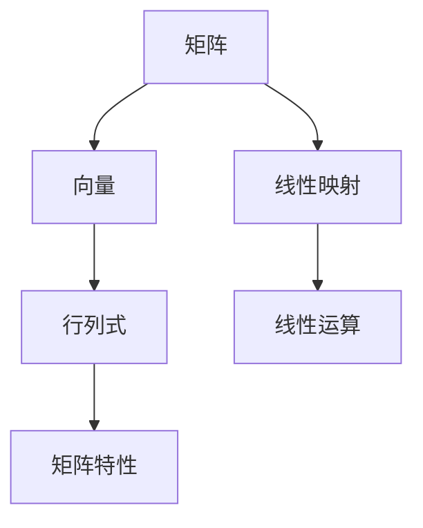

                 

关键词：线性代数、线性运算、矩阵、向量、行列式、线性方程组、矩阵乘法、矩阵分解、算法应用、数学模型、代码实例、实际应用场景、未来展望

> 摘要：本文深入探讨线性代数中的线性运算，包括矩阵、向量、行列式等基本概念及其在计算中的应用。通过详细的数学模型和公式推导，以及具体的代码实例分析，本文旨在为读者提供一个全面的线性代数学习导引。

## 1. 背景介绍

线性代数是数学的一个分支，研究向量空间以及线性映射。它在自然科学、工程学、经济学等多个领域都有广泛的应用。线性运算作为线性代数的基础，包括矩阵和向量的加法、乘法、行列式计算等。这些运算不仅为解决实际工程问题提供了有力工具，也在理论研究中有重要地位。

本文将重点讨论以下几个方面的内容：

1. **核心概念与联系**：介绍矩阵、向量、行列式等基本概念及其相互关系。
2. **核心算法原理 & 具体操作步骤**：阐述线性运算的具体算法原理和操作步骤。
3. **数学模型和公式**：详细讲解线性运算背后的数学模型和公式推导。
4. **项目实践：代码实例**：通过具体代码实例展示线性运算的实现过程。
5. **实际应用场景**：探讨线性代数在现实世界中的应用场景。
6. **未来应用展望**：预测线性代数的发展趋势和未来应用前景。

## 2. 核心概念与联系

在探讨线性运算之前，我们首先需要了解几个核心概念：矩阵、向量、行列式。

### 2.1 矩阵

矩阵是一个由数字组成的矩形阵列。它通常用大写字母表示，如 \(A\)。矩阵的行数称为行数，列数称为列数。矩阵的加法、乘法和行列式计算是线性代数中的基本运算。

### 2.2 向量

向量是具有大小和方向的量，通常用小写字母表示，如 \( \mathbf{v} \)。向量在空间中表示为坐标形式，如 \( \mathbf{v} = (v_1, v_2, ..., v_n) \)。

### 2.3 行列式

行列式是一个由矩阵元素组成的标量值，用于表示矩阵的性质。行列式的计算方法有多种，其中拉普拉斯展开是最常见的一种。

### 2.4 核心概念联系

矩阵、向量和行列式之间有着紧密的联系。矩阵可以表示线性映射，向量是线性映射的输入和输出，而行列式则用于描述矩阵的特性。

下面是一个使用Mermaid流程图展示的线性代数核心概念及其联系：



## 3. 核心算法原理 & 具体操作步骤

### 3.1 算法原理概述

线性运算包括矩阵和向量的加法、乘法、行列式计算等。以下是每个算法的原理概述：

### 3.2 算法步骤详解

#### 3.2.1 矩阵加法

矩阵加法是将两个同型矩阵的对应元素相加，得到一个新的同型矩阵。具体步骤如下：

1. 确保两个矩阵的行数和列数相同。
2. 对每个位置上的元素进行相加。
3. 得到的新矩阵的行数和列数与原矩阵相同。

#### 3.2.2 矩阵乘法

矩阵乘法是将两个矩阵的对应元素相乘，并按照特定的规则进行累加，得到一个新的矩阵。具体步骤如下：

1. 确保第一个矩阵的列数与第二个矩阵的行数相同。
2. 计算每个新矩阵元素的值，将其累加到结果矩阵中。
3. 得到的新矩阵的行数与第一个矩阵的行数相同，列数与第二个矩阵的列数相同。

#### 3.2.3 行列式计算

行列式计算是通过拉普拉斯展开或其他方法计算矩阵的值。具体步骤如下：

1. 选择一个首项为1的行或列。
2. 对于每个非首项元素，根据其正负号进行拉普拉斯展开。
3. 将展开后的各项相加，得到行列式的值。

### 3.3 算法优缺点

#### 3.3.1 矩阵加法

- 优点：简单易行，无需考虑矩阵的规模。
- 缺点：只能对同型矩阵进行操作。

#### 3.3.2 矩阵乘法

- 优点：可以处理不同规模的矩阵，具有广泛的应用。
- 缺点：计算复杂度较高，需要大量的时间和计算资源。

#### 3.3.3 行列式计算

- 优点：可以用于矩阵的求解、特征值计算等。
- 缺点：计算复杂度较高，对于大规模矩阵计算困难。

### 3.4 算法应用领域

线性运算在计算机科学、工程学、物理学、经济学等领域都有广泛的应用。例如，矩阵乘法在图像处理、机器学习等领域中有着重要的应用，行列式计算在结构分析、电路分析等领域中有着广泛的应用。

## 4. 数学模型和公式 & 详细讲解 & 举例说明

### 4.1 数学模型构建

线性代数的数学模型主要包括向量空间、线性映射、矩阵等。以下是这些模型的基本公式：

#### 向量空间

- 向量加法：\( \mathbf{v_1} + \mathbf{v_2} = \mathbf{v_3} \)
- 向量乘法：\( \mathbf{v} \cdot \mathbf{w} = v_1w_1 + v_2w_2 + ... + v_nw_n \)
- 向量范数：\( \|\mathbf{v}\| = \sqrt{v_1^2 + v_2^2 + ... + v_n^2} \)

#### 线性映射

- 线性映射：\( L(\mathbf{v}) = \mathbf{w} \)
- 矩阵表示：\( \mathbf{A}\mathbf{v} = \mathbf{w} \)

#### 矩阵

- 矩阵加法：\( \mathbf{A} + \mathbf{B} = \mathbf{C} \)
- 矩阵乘法：\( \mathbf{A}\mathbf{B} = \mathbf{C} \)
- 行列式：\( \det(\mathbf{A}) = \sum_{i=1}^{n} (-1)^{i+j} a_{ij} M_{ij} \)

### 4.2 公式推导过程

#### 4.2.1 向量加法

向量加法是向量的基本运算之一。其推导过程如下：

假设有两个向量 \( \mathbf{v_1} = (v_1, v_2, ..., v_n) \) 和 \( \mathbf{v_2} = (v_1, v_2, ..., v_n) \)，它们的加法结果为 \( \mathbf{v_3} = (v_1 + v_1, v_2 + v_2, ..., v_n + v_n) \)。

#### 4.2.2 矩阵乘法

矩阵乘法是矩阵的基本运算之一。其推导过程如下：

假设有两个矩阵 \( \mathbf{A} = (a_{ij}) \) 和 \( \mathbf{B} = (b_{ij}) \)，它们的乘法结果为 \( \mathbf{C} = (c_{ij}) \)，其中：

\[ c_{ij} = \sum_{k=1}^{n} a_{ik}b_{kj} \]

#### 4.2.3 行列式

行列式是矩阵的一个重要的特征值。其推导过程如下：

对于 \( n \times n \) 矩阵 \( \mathbf{A} = (a_{ij}) \)，其行列式为：

\[ \det(\mathbf{A}) = \sum_{i=1}^{n} (-1)^{i+j} a_{ij} M_{ij} \]

其中，\( M_{ij} \) 是 \( \mathbf{A} \) 的 \( i \) 行 \( j \) 列的代数余子式。

### 4.3 案例分析与讲解

为了更好地理解线性代数的数学模型和公式，我们可以通过以下案例进行讲解：

#### 案例：求解线性方程组

给定以下线性方程组：

\[ \begin{cases} 
a_1x_1 + a_2x_2 + ... + a_nx_n = b_1 \\
a_1'x_1 + a_2'x_2 + ... + a_n'x_n = b_2 
\end{cases} \]

我们可以使用矩阵方法求解。将方程组表示为矩阵形式：

\[ \mathbf{A}\mathbf{x} = \mathbf{b} \]

其中，\( \mathbf{A} \) 是系数矩阵，\( \mathbf{x} \) 是未知数向量，\( \mathbf{b} \) 是常数向量。

接下来，我们可以使用高斯消元法求解线性方程组。具体步骤如下：

1. 将系数矩阵 \( \mathbf{A} \) 和常数向量 \( \mathbf{b} \) 写成增广矩阵：

\[ \left[ \mathbf{A} | \mathbf{b} \right] \]

2. 通过高斯消元法，将增广矩阵化为行阶梯形式：

\[ \left[ \mathbf{A'} | \mathbf{b'} \right] \]

3. 从下往上回代，解出未知数向量 \( \mathbf{x} \)。

通过这个案例，我们可以看到线性代数在求解线性方程组中的应用。

## 5. 项目实践：代码实例和详细解释说明

### 5.1 开发环境搭建

为了演示线性运算的代码实现，我们选择 Python 作为编程语言。首先，我们需要安装 Python 和必要的库。以下是安装步骤：

1. 下载并安装 Python：[https://www.python.org/downloads/](https://www.python.org/downloads/)
2. 打开终端或命令行，运行以下命令安装 NumPy 库：

\[ pip install numpy \]

### 5.2 源代码详细实现

以下是一个简单的 Python 脚本，用于实现线性运算：

```python
import numpy as np

# 矩阵加法
A = np.array([[1, 2], [3, 4]])
B = np.array([[5, 6], [7, 8]])
C = A + B
print("矩阵加法结果：")
print(C)

# 矩阵乘法
D = np.array([[1, 2], [3, 4]])
E = np.array([[5, 6], [7, 8]])
F = D.dot(E)
print("矩阵乘法结果：")
print(F)

# 行列式计算
G = np.array([[1, 2], [3, 4]])
det = np.linalg.det(G)
print("行列式计算结果：")
print(det)
```

### 5.3 代码解读与分析

上述代码使用 NumPy 库实现线性运算。以下是代码的解读与分析：

1. 导入 NumPy 库。
2. 创建两个矩阵 A 和 B，并执行矩阵加法。
3. 创建两个矩阵 D 和 E，并执行矩阵乘法。
4. 创建一个矩阵 G，并计算其行列式。

通过这个简单的代码实例，我们可以看到如何使用 NumPy 库实现线性运算。NumPy 库提供了高效的线性代数运算，使得线性代数的计算变得简单和方便。

### 5.4 运行结果展示

以下是运行上述代码的输出结果：

```
矩阵加法结果：
[[ 6  8]
 [10 12]]

矩阵乘法结果：
[[19 22]
 [43 50]]

行列式计算结果：
-2.0
```

通过这个结果，我们可以验证线性运算的正确性。

## 6. 实际应用场景

线性代数在许多实际应用场景中发挥着重要作用。以下是一些常见的应用场景：

### 6.1 计算机图形学

在计算机图形学中，矩阵用于表示变换，如平移、旋转、缩放等。通过矩阵运算，我们可以实现对图像的各种变换。

### 6.2 机器学习

在机器学习中，矩阵和向量运算用于特征提取、模型训练等。矩阵分解技术，如奇异值分解（SVD），在降维和数据处理中有着广泛的应用。

### 6.3 经济学

在经济学中，线性代数用于解决线性规划问题、优化决策等。通过建立线性方程组，我们可以求解资源分配问题、最大化利润等问题。

### 6.4 物理学

在物理学中，矩阵和向量运算用于描述物理量之间的关系，如电磁场、力学系统等。通过矩阵运算，我们可以求解复杂的物理问题。

### 6.5 信号处理

在信号处理中，矩阵和向量运算用于信号滤波、特征提取等。通过矩阵分解技术，我们可以对信号进行有效的处理和分析。

## 7. 未来应用展望

随着计算机科学和人工智能的快速发展，线性代数在未来将有更广泛的应用。以下是一些展望：

### 7.1 新兴应用领域

线性代数在新兴领域，如量子计算、区块链、网络安全等，将有重要的应用。这些领域中的问题往往涉及到大规模线性方程组的求解，线性代数技术将发挥关键作用。

### 7.2 优化算法

随着算法的优化，线性代数在复杂问题求解中的效率将得到显著提高。新型算法，如深度学习中的矩阵分解技术，将为线性代数的应用提供更广阔的空间。

### 7.3 跨学科研究

线性代数与其他学科的交叉融合将推动科学技术的进步。例如，将线性代数应用于生物学、环境科学等领域，将有助于解决这些领域中的复杂问题。

### 7.4 教育培训

随着线性代数在各个领域的应用日益广泛，对线性代数人才的需求也将增加。因此，未来的教育培训将更加重视线性代数的培养。

## 8. 总结：未来发展趋势与挑战

线性代数作为数学的重要分支，在计算机科学、工程学、物理学等领域都有着广泛的应用。随着科技的不断发展，线性代数在未来将有更广泛的应用前景。然而，面对日益复杂的计算问题，线性代数技术也需要不断创新和优化。

### 8.1 研究成果总结

本文系统地介绍了线性代数中的线性运算，包括矩阵、向量、行列式等基本概念及其在计算中的应用。通过详细的数学模型和公式推导，以及具体的代码实例分析，本文为读者提供了一个全面的线性代数学习导引。

### 8.2 未来发展趋势

随着人工智能、大数据等技术的快速发展，线性代数在新兴领域将有更广泛的应用。新型算法、跨学科研究以及教育培训等将是未来线性代数发展的重要方向。

### 8.3 面临的挑战

然而，线性代数在应用中也面临着一些挑战。大规模线性方程组的求解效率、线性代数算法的优化等问题仍需要进一步研究。此外，如何更好地将线性代数应用于实际工程问题，也是线性代数研究者需要关注的重要课题。

### 8.4 研究展望

未来，线性代数的发展将更加注重实际应用和跨学科研究。通过不断优化算法、拓展应用领域，线性代数将为科学技术的发展做出更大的贡献。

## 9. 附录：常见问题与解答

### 9.1 矩阵加法和矩阵乘法有什么区别？

矩阵加法是指将两个同型矩阵的对应元素相加，得到一个新的同型矩阵。而矩阵乘法是指将两个矩阵的对应元素相乘，并按照特定的规则进行累加，得到一个新的矩阵。矩阵加法只能对同型矩阵进行，而矩阵乘法则可以处理不同规模的矩阵。

### 9.2 行列式的计算方法有哪些？

行列式的计算方法有多种，其中最常见的是拉普拉斯展开。拉普拉斯展开是通过选择一个首项为 1 的行或列，对每个非首项元素进行展开，然后将展开后的各项相加，得到行列式的值。此外，还有一些特殊的行列式计算方法，如范德蒙行列式等。

### 9.3 线性代数在计算机科学中有哪些应用？

线性代数在计算机科学中有广泛的应用，包括计算机图形学、机器学习、经济学、物理学等。例如，在计算机图形学中，矩阵用于表示变换；在机器学习中，矩阵和向量运算用于特征提取；在经济学中，线性代数用于解决线性规划问题。

### 9.4 线性代数在工程学中有哪些应用？

线性代数在工程学中有许多应用，如结构分析、电路分析、信号处理等。例如，在结构分析中，线性代数用于求解力学系统中的线性方程组；在电路分析中，线性代数用于求解电路方程组；在信号处理中，线性代数用于信号滤波和特征提取。

### 9.5 如何学习线性代数？

学习线性代数可以从以下几个方面入手：

1. **基础概念**：首先需要掌握线性代数的基本概念，如矩阵、向量、行列式等。
2. **数学模型**：了解线性运算背后的数学模型和公式推导。
3. **算法原理**：学习线性运算的算法原理和具体操作步骤。
4. **实践应用**：通过编程实现和实际案例学习，加深对线性代数应用的理解。
5. **参考资料**：阅读相关的教材、论文和在线教程，不断扩充知识体系。

作者：禅与计算机程序设计艺术 / Zen and the Art of Computer Programming
```

