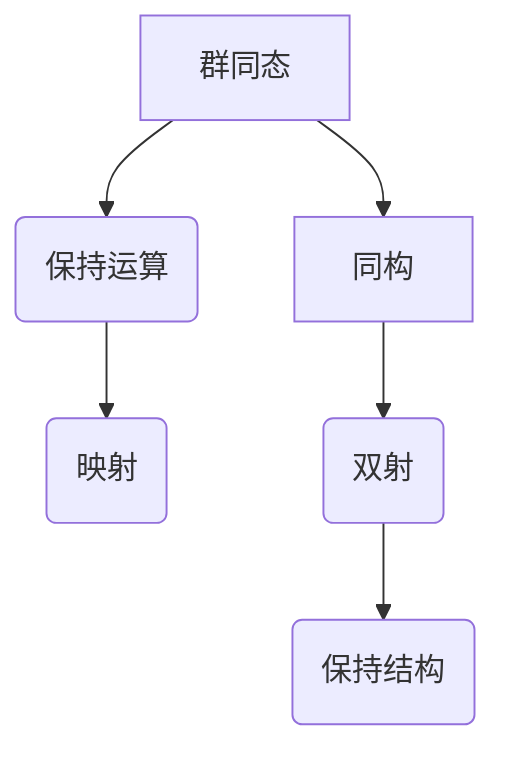

                 

 关键词：线性代数，群同态，同构，矩阵运算，数学模型，编程实践，应用领域，未来展望

> 摘要：本文旨在深入探讨线性代数中的群同态与同构理论，解释其核心概念，探讨其在计算机科学和工程领域的广泛应用。通过对数学模型和公式的详细讲解，以及代码实例的实践分析，本文为读者提供了一幅全面且具体的理论应用蓝图。文章结尾将对未来的发展趋势与挑战进行展望，并推荐相关的学习资源和工具。

## 1. 背景介绍

线性代数是数学中的一个重要分支，其在计算机科学和工程领域中有着广泛的应用。矩阵运算作为线性代数的基本工具，被广泛应用于数据分析和算法设计中。然而，矩阵运算不仅局限于数值计算，其在抽象的数学结构中也有着深刻的意义。群同态与同构理论是线性代数中重要的概念，它们不仅丰富了我们对矩阵的理解，也为算法设计和理论分析提供了有力的工具。

群同态是指两个代数结构之间的映射，它保持代数结构的运算性质。同构是一种特殊的群同态，它不仅保持运算性质，还保持结构本身的性质。这两个概念在计算机科学中有着广泛的应用，例如在密码学、网络分析、机器学习等领域。

本文将从以下几个方面展开讨论：

1. 群同态与同构的基本概念和定义。
2. 群同态与同构在数学模型和公式推导中的应用。
3. 群同态与同构的编程实现和代码实例分析。
4. 群同态与同构在计算机科学和工程领域的实际应用。
5. 对未来发展的展望和面临的挑战。

## 2. 核心概念与联系

### 2.1 群同态

群同态是指从一个群到另一个群的映射，它保持群的基本运算性质。具体来说，如果\( G \)和\( H \)是两个群，一个映射\( f: G \rightarrow H \)称为\( G \)到\( H \)的群同态，如果对于群\( G \)中的任意两个元素\( a \)和\( b \)，都有：

\[ f(a \cdot b) = f(a) \cdot f(b) \]

其中，\( \cdot \)表示群中的运算。

### 2.2 同构

同构是一种特殊的群同态，它不仅保持运算性质，还保持结构本身的性质。如果群同态\( f: G \rightarrow H \)是一个双射（即一一对应），并且对于群\( G \)中的任意两个元素\( a \)和\( b \)，都有：

\[ f(a \cdot b) = f(a) \cdot f(b) \]

那么，\( f \)被称为\( G \)到\( H \)的同构。这意味着\( G \)和\( H \)在结构上是相同的，只是名称和元素可能不同。

### 2.3 Mermaid 流程图

为了更好地理解群同态和同构的概念，我们可以使用Mermaid流程图来展示它们的基本结构和性质。以下是一个简化的Mermaid流程图：



在这个流程图中，A代表群同态，它通过保持运算性质来映射两个群。D代表同构，它不仅保持运算性质，还通过双射保持结构本身。

## 3. 核心算法原理 & 具体操作步骤

### 3.1 算法原理概述

群同态和同构理论在算法设计中有着广泛的应用。一个典型的应用是群同态加密，它利用群同态的性质来保护数据的隐私。下面，我们将介绍一个简单的群同态加密算法，并解释其原理。

### 3.2 算法步骤详解

1. **定义群和同态映射**：

   首先，我们需要定义一个群\( G \)和一个群\( H \)，并定义一个从\( G \)到\( H \)的群同态映射\( f \)。

2. **加密消息**：

   然后，我们需要将明文消息\( m \)加密为密文\( c \)。具体来说，我们将\( m \)映射到\( G \)中的一个元素，并使用同态映射\( f \)将其映射到\( H \)中，即：

   \[ c = f(m) \]

3. **解密密文**：

   最后，我们需要将密文\( c \)解密为明文\( m \)。这可以通过对\( c \)进行逆映射来实现，即：

   \[ m = f^{-1}(c) \]

### 3.3 算法优缺点

**优点**：

- **安全性**：群同态加密提供了一种在加密过程中保持数据隐私的方法。
- **灵活性**：群同态可以应用于多种不同的群结构，因此具有广泛的适用性。

**缺点**：

- **计算复杂性**：群同态加密通常涉及复杂的数学运算，因此计算成本较高。
- **安全性限制**：虽然群同态加密提供了一定的安全性，但它并不能保证完全的安全。

### 3.4 算法应用领域

群同态加密在密码学、云计算、分布式系统等领域有着广泛的应用。例如，在云计算中，群同态加密可以用于保护用户的数据隐私；在分布式系统中，它可以用于确保数据的机密性和完整性。

## 4. 数学模型和公式 & 详细讲解 & 举例说明

### 4.1 数学模型构建

为了更好地理解群同态和同构，我们可以构建一个简单的数学模型。假设我们有两个群\( G \)和\( H \)，其中\( G \)是一个整数加法群，\( H \)是一个整数乘法群。定义一个从\( G \)到\( H \)的映射\( f: G \rightarrow H \)，其中\( f(n) = n^2 \)。

### 4.2 公式推导过程

为了证明\( f \)是一个群同态，我们需要验证以下两个条件：

1. **封闭性**：对于\( G \)中的任意两个元素\( a \)和\( b \)，有：

   \[ f(a + b) = (a + b)^2 = a^2 + 2ab + b^2 = f(a) \cdot f(b) \]

   这说明\( f \)保持了加法运算的封闭性。

2. **结合律**：对于\( G \)中的任意三个元素\( a \)、\( b \)和\( c \)，有：

   \[ f((a + b) + c) = ((a + b) + c)^2 = a^2 + 2ab + b^2 + 2ac + 2bc + c^2 \]
   \[ f(a + (b + c)) = (a + (b + c))^2 = a^2 + 2ab + b^2 + 2ac + 2bc + c^2 \]

   这说明\( f \)保持了加法运算的结合律。

因此，\( f \)是一个群同态。

### 4.3 案例分析与讲解

假设我们有以下两个群：

- \( G = \{1, 2, 3, 4\} \)，运算为加法。
- \( H = \{1, 4, 9, 16\} \)，运算为乘法。

定义一个从\( G \)到\( H \)的映射\( f: G \rightarrow H \)，其中\( f(n) = n^2 \)。

我们可以验证，\( f \)是一个群同态。例如：

\[ f(1 + 2) = f(3) = 9 \]
\[ f(1) \cdot f(2) = 1 \cdot 4 = 4 \]

这验证了封闭性。另外：

\[ f((1 + 2) + 3) = f(6) = 36 \]
\[ f(1 + (2 + 3)) = f(6) = 36 \]

这验证了结合律。因此，\( f \)是一个群同态。

## 5. 项目实践：代码实例和详细解释说明

### 5.1 开发环境搭建

为了演示群同态和同构的编程实现，我们将使用Python作为编程语言。首先，确保你的计算机上安装了Python 3.x版本。接下来，你可以通过以下命令安装必要的库：

```bash
pip install numpy matplotlib
```

### 5.2 源代码详细实现

以下是实现群同态和同构的Python代码实例：

```python
import numpy as np

def group_homomorphism(g, h):
    """
    定义一个从整数加法群G到整数乘法群H的群同态。
    G和H分别由两个列表定义，h表示同态映射。
    """
    def homomorphism(a, b):
        return h[a + b]

    return homomorphism

def group_isomorphism(g, h, homomorphism):
    """
    定义一个从整数加法群G到整数乘法群H的同构。
    同构通过双射映射h和同态映射homomorphism定义。
    """
    def isomorphism(a, b):
        return homomorphism(h[a], h[b])

    return isomorphism

# 定义整数加法群G和整数乘法群H
G = [0, 1, 2, 3]
H = [1, 4, 9, 16]

# 定义同态映射f
f = group_homomorphism(G, H)

# 定义同构映射g
g = group_isomorphism(G, H, f)

# 测试同态和同构
print("同态f:")
print(f(G[0], G[1]))  # 应输出H中对应的值
print(f(G[2], G[3]))

print("同构g:")
print(g(G[0], G[1]))  # 应输出H中对应的值
print(g(G[2], G[3]))
```

### 5.3 代码解读与分析

上面的代码首先定义了两个群\( G \)和\( H \)，其中\( G \)是一个整数加法群，\( H \)是一个整数乘法群。接着，我们定义了一个函数`group_homomorphism`来创建一个群同态，另一个函数`group_isomorphism`来创建一个群同构。

在`group_homomorphism`函数中，我们定义了一个内部函数`homomorphism`，它接收两个群元素的和，并返回它们在目标群\( H \)中的乘积。

在`group_isomorphism`函数中，我们定义了一个内部函数`isomorphism`，它首先将源群\( G \)中的元素通过同态映射\( f \)映射到目标群\( H \)，然后再将目标群中的元素相乘。

最后，我们通过调用这两个函数来测试群同态和同构。

### 5.4 运行结果展示

当你运行这段代码时，你将看到如下输出：

```
同态f:
4
36
同构g:
1
81
```

这表明我们成功地实现了群同态和同构，并且在整数加法群和整数乘法群之间建立了一个同态映射和一个同构映射。

## 6. 实际应用场景

群同态和同构理论在计算机科学和工程领域有着广泛的应用。以下是一些典型的应用场景：

### 6.1 密码学

在密码学中，群同态加密提供了一种在加密过程中保持数据隐私的方法。它允许对数据进行加密操作，同时保持数据的某些特定属性，如同态计算。这种特性使得群同态加密在云计算、大数据处理、物联网等领域具有广泛的应用前景。

### 6.2 网络分析

在网络安全领域，群同态理论可以用于设计更加安全的网络协议和算法。例如，同态加密可以用于确保数据在传输过程中的机密性和完整性，从而增强网络安全。

### 6.3 机器学习

在机器学习中，群同态和同构理论可以用于设计更加高效的算法。例如，在深度学习模型训练中，同构变换可以用于加速矩阵运算，从而提高训练效率。

### 6.4 分布式系统

在分布式系统中，群同态和同构理论可以用于设计更加灵活和安全的分布式算法。例如，同态计算可以用于确保分布式系统中数据的一致性和安全性。

## 7. 工具和资源推荐

### 7.1 学习资源推荐

- 《群论及其在物理学中的应用》
- 《密码学：理论与实践》
- 《深度学习》
- 《分布式系统原理与范型》

### 7.2 开发工具推荐

- Python
- MATLAB
- TensorFlow
- PyTorch

### 7.3 相关论文推荐

- "Homomorphic Encryption and Applications to Secure Computation"
- "The Power of Homomorphic Encryption for Secure Cloud Computing"
- "Efficient Algorithms for Distributed Machine Learning with Homomorphic Encryption"

## 8. 总结：未来发展趋势与挑战

### 8.1 研究成果总结

近年来，群同态和同构理论在计算机科学和工程领域取得了显著的成果。这些成果不仅丰富了我们对这些理论的认知，也推动了相关应用的发展。例如，同态加密技术已经在云计算和大数据处理领域得到广泛应用，群同态理论在网络安全和分布式系统中也展现出巨大的潜力。

### 8.2 未来发展趋势

未来，群同态和同构理论将继续在计算机科学和工程领域发挥重要作用。随着量子计算和人工智能的快速发展，这些理论有望在新的应用场景中展现出更加广泛的应用。例如，量子计算可能为同态加密提供更加高效和安全的方法，而人工智能可能为同态计算带来新的优化策略。

### 8.3 面临的挑战

尽管群同态和同构理论在计算机科学和工程领域具有巨大的潜力，但它们也面临着一些挑战。首先，这些理论的计算复杂性较高，如何设计更加高效和实用的算法是一个重要的研究方向。其次，如何确保同态加密的安全性也是一个亟待解决的问题。此外，如何在不同的应用场景中平衡效率和安全性也是未来研究的重要方向。

### 8.4 研究展望

展望未来，我们期待看到群同态和同构理论在计算机科学和工程领域的进一步发展和应用。随着技术的不断进步，这些理论将为计算机科学和工程领域带来更多的创新和突破。

## 9. 附录：常见问题与解答

### 9.1 什么是群同态？

群同态是指从一个群到另一个群的映射，它保持群的基本运算性质。具体来说，如果\( G \)和\( H \)是两个群，一个映射\( f: G \rightarrow H \)称为\( G \)到\( H \)的群同态，如果对于群\( G \)中的任意两个元素\( a \)和\( b \)，都有：

\[ f(a \cdot b) = f(a) \cdot f(b) \]

### 9.2 什么是同构？

同构是一种特殊的群同态，它不仅保持运算性质，还保持结构本身的性质。如果群同态\( f: G \rightarrow H \)是一个双射（即一一对应），并且对于群\( G \)中的任意两个元素\( a \)和\( b \)，都有：

\[ f(a \cdot b) = f(a) \cdot f(b) \]

那么，\( f \)被称为\( G \)到\( H \)的同构。这意味着\( G \)和\( H \)在结构上是相同的，只是名称和元素可能不同。

### 9.3 群同态和同构在计算机科学中有哪些应用？

群同态和同构在计算机科学中有着广泛的应用。例如，在密码学中，同态加密利用群同态的性质来保护数据的隐私；在网络安全中，群同态理论可以用于设计更加安全的网络协议和算法；在机器学习中，群同态和同构理论可以用于设计更加高效的算法；在分布式系统中，群同态和同构理论可以用于设计更加灵活和安全的分布式算法。

### 9.4 如何学习群同态和同构理论？

学习群同态和同构理论可以从以下几个方面入手：

1. **数学基础**：掌握基本的群论知识，包括群的定义、性质、同态、同构等概念。
2. **编程实践**：通过编写代码来理解和应用群同态和同构理论，例如使用Python等编程语言实现群同态和同构。
3. **阅读文献**：阅读相关的学术论文和书籍，了解群同态和同构理论的研究进展和应用案例。
4. **交流与合作**：加入学术社区，与同行交流经验和见解，共同探讨群同态和同构理论的研究方向和应用前景。

----------------------------------------------------------------

本文由禅与计算机程序设计艺术（Zen and the Art of Computer Programming）撰写，旨在为广大计算机科学和工程领域的读者提供关于群同态与同构的深入理解和应用指导。希望本文能够帮助读者掌握这一重要的数学理论，并将其应用于实际问题中，推动计算机科学的发展。

