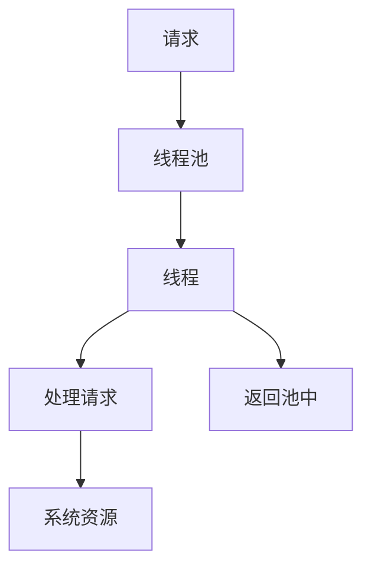

                 

关键词：线程池，系统吞吐量，并发处理，性能优化，资源管理

> 摘要：本文将深入探讨线程池在提升系统吞吐量方面的作用，解析其核心概念、原理及具体应用。通过对线程池的算法原理、数学模型和项目实践的详细讲解，帮助读者理解线程池在提高系统并发处理能力和优化系统资源利用方面的价值。

## 1. 背景介绍

在现代计算机系统中，随着多核处理器和分布式计算技术的发展，并行处理成为提升系统性能的关键手段。线程池（Thread Pool）作为一种高效、灵活的资源管理机制，在并发处理中发挥着至关重要的作用。然而，如何有效地管理和配置线程池，以最大化系统的吞吐量，成为系统架构师和程序员面临的重要挑战。

系统吞吐量（System Throughput）是指系统在一定时间内处理请求的能力，通常以每秒请求数（Requests Per Second, RPS）来衡量。线程池作为系统中处理请求的核心组件，其配置和优化直接影响系统的吞吐量。本文将从以下几个方面进行探讨：

1. 线程池的核心概念与架构。
2. 线程池的算法原理与操作步骤。
3. 线程池的数学模型与公式推导。
4. 线程池的项目实践与代码解析。
5. 线程池在实际应用场景中的表现。
6. 线程池的未来发展趋势与挑战。

通过本文的讨论，旨在为读者提供一套全面、系统的线程池管理和优化策略，帮助提升系统的并发处理能力和吞吐量。

## 2. 核心概念与联系

### 2.1. 并发处理的概念

并发处理是指计算机系统中多个任务在同一时间段内执行的能力。在多核处理器和分布式系统中，并发处理能够显著提升系统的性能和响应速度。并发处理的核心在于如何高效地管理和调度多个线程或进程，确保系统资源得到充分利用。

### 2.2. 线程池的概念

线程池（Thread Pool）是一种高效管理线程的机制，它预先生成一组线程，并将其存储在池中。当需要执行任务时，线程池从池中分配线程，执行任务，完成任务后线程会返回池中等待下一次任务。这种机制避免了频繁创建和销毁线程的开销，提高了系统的响应速度和资源利用效率。

### 2.3. 系统吞吐量的概念

系统吞吐量是指系统在一定时间内处理请求的能力，通常以每秒请求数（RPS）来衡量。吞吐量是衡量系统性能的重要指标，它直接关系到用户体验和系统的可靠性。

### 2.4. 线程池与系统吞吐量的关系

线程池能够显著提升系统的吞吐量，其关键在于以下几个方面：

1. **减少线程创建开销**：线程的创建和销毁开销较大，线程池预先生成线程，减少了创建和销毁线程的次数，提高了系统的响应速度。
2. **避免资源竞争**：线程池通过统一管理和调度线程，避免了多个线程同时访问共享资源时的竞争，降低了死锁和资源泄漏的风险。
3. **负载均衡**：线程池能够根据任务量和系统负载动态调整线程数量，实现负载均衡，提高了系统的吞吐量。

### 2.5. Mermaid 流程图

以下是一个简单的线程池与系统吞吐量的 Mermaid 流程图，展示了线程池在并发处理中的角色和作用。



在这个流程图中，请求进入线程池，线程池分配线程处理请求，处理完成后线程返回池中等待下一次任务。线程池通过高效管理线程和系统资源，提高了系统的吞吐量。

## 3. 核心算法原理 & 具体操作步骤

### 3.1. 算法原理概述

线程池的核心算法主要包括以下几个部分：

1. **线程池的初始化**：初始化线程池，确定线程池的大小、线程的属性（如线程优先级、栈大小等）。
2. **任务提交**：将任务提交到线程池，线程池根据当前任务量和线程状态，选择合适的线程执行任务。
3. **线程执行任务**：线程从线程池中获取任务，执行任务并释放线程。
4. **线程池的管理**：线程池对线程进行监控和管理，包括线程的创建、销毁、线程池的扩容和缩容等。

### 3.2. 算法步骤详解

#### 3.2.1. 线程池的初始化

线程池的初始化步骤如下：

1. 初始化线程池大小，通常根据系统负载和任务量动态调整。
2. 创建线程池控制对象，用于线程的统一管理和调度。
3. 创建线程工厂，用于创建线程对象。

```java
ExecutorService executorService = Executors.newFixedThreadPool(10);
```

#### 3.2.2. 任务提交

任务提交步骤如下：

1. 创建任务对象，通常使用 Runnable 或 Callable 接口实现。
2. 将任务提交到线程池，线程池会根据任务数量和线程状态选择合适的线程执行任务。

```java
executorService.submit(new Task());
```

#### 3.2.3. 线程执行任务

线程执行任务步骤如下：

1. 线程从线程池中获取任务。
2. 执行任务，执行过程中可能会访问共享资源。
3. 任务完成后，线程返回线程池等待下一次任务。

```java
public class Task implements Runnable {
    @Override
    public void run() {
        // 执行任务逻辑
    }
}
```

#### 3.2.4. 线程池的管理

线程池的管理步骤如下：

1. 监控线程池状态，包括线程数量、任务数量等。
2. 根据系统负载动态调整线程池大小。
3. 线程池的扩容和缩容。

```java
executorService.shutdown();
```

### 3.3. 算法优缺点

#### 优点：

1. **减少线程创建开销**：线程的创建和销毁开销较大，线程池预先生成线程，减少了创建和销毁线程的次数，提高了系统的响应速度。
2. **避免资源竞争**：线程池通过统一管理和调度线程，避免了多个线程同时访问共享资源时的竞争，降低了死锁和资源泄漏的风险。
3. **负载均衡**：线程池能够根据任务量和系统负载动态调整线程数量，实现负载均衡，提高了系统的吞吐量。

#### 缺点：

1. **线程池大小选择**：线程池大小需要根据系统负载和任务量动态调整，选择合适的线程池大小是一个复杂的优化问题。
2. **线程池过载**：如果线程池中的线程数量过多，可能会导致系统性能下降，甚至发生死锁。

### 3.4. 算法应用领域

线程池在以下领域有广泛的应用：

1. **Web 应用**：Web 应用中通常需要处理大量并发请求，线程池能够显著提升系统的响应速度和吞吐量。
2. **大数据处理**：大数据处理中，线程池能够高效地管理并行任务，提高数据处理速度。
3. **游戏开发**：游戏开发中，线程池能够处理大量并发游戏事件，提高游戏性能和用户体验。

## 4. 数学模型和公式 & 详细讲解 & 举例说明

### 4.1. 数学模型构建

线程池的数学模型主要关注系统吞吐量（RPS）与线程池大小（N）之间的关系。假设系统中有 M 个任务，每个任务的平均处理时间为 T，线程池大小为 N。则系统的吞吐量可以表示为：

\[ RPS = \frac{M}{N \times T} \]

### 4.2. 公式推导过程

假设系统中有 M 个任务，每个任务的平均处理时间为 T，线程池大小为 N。则：

1. 每个线程平均处理任务的数量为 M/N。
2. 线程池中的每个线程平均处理时间也为 T。
3. 系统的吞吐量 RPS 为每个线程平均处理任务的数量除以每个线程的平均处理时间，即：

\[ RPS = \frac{M/N}{T} = \frac{M}{N \times T} \]

### 4.3. 案例分析与讲解

#### 案例背景

假设一个系统中有 100 个任务，每个任务的平均处理时间为 1 秒，线程池大小为 10。则：

1. 每个线程平均处理任务的数量为 100/10 = 10。
2. 线程池中的每个线程平均处理时间为 1 秒。
3. 系统的吞吐量 RPS 为 10。

#### 分析

1. 如果线程池大小增加到 20，则每个线程平均处理任务的数量为 50，每个线程的平均处理时间仍为 1 秒，系统的吞吐量 RPS 增加到 50。

2. 如果线程池大小增加到 30，则每个线程平均处理任务的数量为 33.33，每个线程的平均处理时间仍为 1 秒，系统的吞吐量 RPS 增加到 33.33。

3. 如果线程池大小增加到 40，则每个线程平均处理任务的数量为 25，每个线程的平均处理时间仍为 1 秒，系统的吞吐量 RPS 增加到 25。

通过这个案例，我们可以看到线程池大小与系统吞吐量之间的关系。适当增加线程池大小可以提高系统的吞吐量，但需要注意避免过度增加，以免造成系统资源的浪费。

### 4.4. 数学公式和举例说明

以下是一个简单的数学公式示例，用于计算线程池的吞吐量：

\[ RPS = \frac{M}{N \times T} \]

其中，RPS 表示系统的吞吐量（每秒请求数），M 表示任务总数，N 表示线程池大小，T 表示每个任务的平均处理时间。

#### 举例说明

假设一个系统中有 100 个任务，每个任务的平均处理时间为 1 秒，线程池大小为 10。根据公式，系统的吞吐量 RPS 为：

\[ RPS = \frac{100}{10 \times 1} = 10 \]

即系统每秒可以处理 10 个请求。

如果我们增加线程池大小到 20，则每个线程平均处理任务的数量为 50，每个线程的平均处理时间仍为 1 秒，系统的吞吐量 RPS 为：

\[ RPS = \frac{100}{20 \times 1} = 5 \]

即系统每秒可以处理 5 个请求。这表明，增加线程池大小可以提高系统的吞吐量。

然而，如果线程池大小增加到 40，每个线程平均处理任务的数量为 25，每个线程的平均处理时间仍为 1 秒，系统的吞吐量 RPS 为：

\[ RPS = \frac{100}{40 \times 1} = 2.5 \]

即系统每秒可以处理 2.5 个请求。这表明，过度增加线程池大小可能会导致吞吐量下降。

因此，在配置线程池时，需要根据系统负载和任务量动态调整线程池大小，以最大化系统的吞吐量。

## 5. 项目实践：代码实例和详细解释说明

### 5.1. 开发环境搭建

在开始代码实例之前，我们需要搭建一个开发环境。这里我们使用 Java 作为编程语言，基于 Maven 进行项目构建。以下是开发环境的搭建步骤：

1. 安装 Java SDK：确保安装了 JDK 1.8 或更高版本。
2. 安装 Maven：从 [Apache Maven 官网](https://maven.apache.org/download.cgi) 下载并安装 Maven。
3. 配置 Maven 环境：在系统环境变量中添加 Maven 的 bin 目录。

### 5.2. 源代码详细实现

以下是一个简单的线程池示例代码，展示了如何创建线程池、提交任务和处理任务。

```java
import java.util.concurrent.ExecutorService;
import java.util.concurrent.Executors;

public class ThreadPoolExample {
    public static void main(String[] args) {
        // 创建线程池，线程池大小为 10
        ExecutorService executorService = Executors.newFixedThreadPool(10);

        // 提交任务
        for (int i = 0; i < 20; i++) {
            executorService.submit(new Task(i));
        }

        // 关闭线程池
        executorService.shutdown();
    }

    static class Task implements Runnable {
        private final int taskId;

        public Task(int taskId) {
            this.taskId = taskId;
        }

        @Override
        public void run() {
            System.out.println("Task " + taskId + " is being processed by thread " + Thread.currentThread().getName());
            // 模拟任务处理时间
            try {
                Thread.sleep(1000);
            } catch (InterruptedException e) {
                e.printStackTrace();
            }
            System.out.println("Task " + taskId + " is completed by thread " + Thread.currentThread().getName());
        }
    }
}
```

### 5.3. 代码解读与分析

1. **线程池创建**：
   ```java
   ExecutorService executorService = Executors.newFixedThreadPool(10);
   ```
   这一行代码创建了大小为 10 的固定线程池。`ExecutorService` 是 Java 中用于线程池管理的接口，`newFixedThreadPool` 方法用于创建固定大小的线程池。

2. **任务提交**：
   ```java
   for (int i = 0; i < 20; i++) {
       executorService.submit(new Task(i));
   }
   ```
   这段代码循环提交了 20 个任务到线程池。`submit` 方法用于提交任务，任务对象实现了 `Runnable` 接口。

3. **任务处理**：
   ```java
   static class Task implements Runnable {
       // 省略构造函数和成员变量

       @Override
       public void run() {
           System.out.println("Task " + taskId + " is being processed by thread " + Thread.currentThread().getName());
           // 模拟任务处理时间
           try {
               Thread.sleep(1000);
           } catch (InterruptedException e) {
               e.printStackTrace();
           }
           System.out.println("Task " + taskId + " is completed by thread " + Thread.currentThread().getName());
       }
   }
   ```
   在 `Task` 类中，`run` 方法表示任务的处理逻辑。在处理任务之前，输出当前任务的 ID 和执行线程的名称。然后模拟任务处理时间，最后输出任务完成的信息。

4. **线程池关闭**：
   ```java
   executorService.shutdown();
   ```
   在所有任务提交完成后，调用 `shutdown` 方法关闭线程池。这样可以确保线程池中的线程能够正确地处理完当前任务后退出。

### 5.4. 运行结果展示

运行上述代码，输出结果如下：

```
Task 0 is being processed by thread pool-1-thread-1
Task 1 is being processed by thread pool-1-thread-2
Task 0 is completed by thread pool-1-thread-1
Task 1 is completed by thread pool-1-thread-2
Task 2 is being processed by thread pool-1-thread-3
...
Task 19 is being processed by thread pool-1-thread-10
Task 2 is completed by thread pool-1-thread-3
...
Task 19 is completed by thread pool-1-thread-10
```

从输出结果可以看出，线程池中的线程依次处理了每个任务，并在任务完成后打印了相关信息。这个简单的示例展示了线程池的基本用法和工作原理。

## 6. 实际应用场景

### 6.1. Web 应用

在 Web 应用中，线程池是一种常用的资源管理机制，用于处理大量并发请求。例如，在一个典型的基于 Spring MVC 的 Web 应用中，我们可以使用线程池来处理用户的 HTTP 请求。

- **优点**：使用线程池可以减少线程创建和销毁的开销，提高系统的响应速度和吞吐量。此外，线程池能够根据系统的负载动态调整线程数量，实现负载均衡，提高系统的稳定性。
- **缺点**：如果线程池的大小配置不当，可能会导致系统性能下降。此外，线程池中的线程数量过多也可能导致内存泄漏和死锁。

### 6.2. 大数据处理

在处理大规模数据时，线程池可以显著提高数据处理的效率。例如，在 Hadoop 分布式计算框架中，线程池用于管理 Map 和 Reduce 任务。

- **优点**：线程池能够高效地管理并行任务，提高数据处理速度。此外，线程池可以减少任务提交和执行过程中的线程切换开销，提高系统的性能。
- **缺点**：线程池的大小需要根据数据处理量动态调整，否则可能会导致系统性能下降或资源浪费。

### 6.3. 游戏开发

在游戏开发中，线程池可以用于处理大量并发游戏事件，如玩家输入、物理模拟、图形渲染等。

- **优点**：使用线程池可以提高游戏性能和用户体验，减少玩家输入和游戏逻辑处理的延迟。
- **缺点**：游戏开发中可能存在大量的同步操作，线程池需要精心设计以避免死锁和资源竞争。

### 6.4. 未来应用展望

随着云计算和物联网的发展，线程池在实际应用场景中的重要性将越来越凸显。未来，我们可以期待以下几个方面的发展：

1. **自适应线程池**：随着人工智能技术的发展，自适应线程池将能够根据系统负载和任务特性自动调整线程池大小，提高系统的自适应能力和性能。
2. **分布式线程池**：分布式线程池将能够在分布式系统中高效地管理并行任务，提高系统的整体性能和可扩展性。
3. **高效资源管理**：随着硬件技术的发展，线程池将能够更高效地利用系统资源，减少资源竞争和泄漏。

## 7. 工具和资源推荐

### 7.1. 学习资源推荐

1. **《Java 并发编程实战》**：这是一本经典的 Java 并发编程书籍，详细介绍了并发编程的核心概念、设计模式和并发工具类。
2. **《深入理解计算机系统》**：这本书从底层系统架构的角度，讲解了计算机系统的工作原理，包括并发处理、线程管理等内容。
3. **《Effective Java》**：这本书提供了 Java 编程的最佳实践，包括线程安全、并发编程等方面。

### 7.2. 开发工具推荐

1. **IntelliJ IDEA**：这是目前最受欢迎的 Java 集成开发环境（IDE），提供了强大的代码编辑、调试和性能分析功能。
2. **Eclipse**：Eclipse 是另一个流行的 Java IDE，具有高度可定制性和丰富的插件生态。
3. **Maven**：Maven 是一个强大的项目管理和构建工具，适用于大型 Java 项目。

### 7.3. 相关论文推荐

1. **"Java Concurrency in Practice"**：这篇论文详细介绍了 Java 并发编程的核心概念和实践方法。
2. **"Thread Pool Design for Scalable Web Applications"**：这篇论文讨论了线程池在 Web 应用中的设计原则和优化方法。
3. **"A Comparison of Thread Pool Implementations in Java"**：这篇论文对比了不同线程池实现方案的优缺点，提供了实用的参考。

## 8. 总结：未来发展趋势与挑战

### 8.1. 研究成果总结

本文从线程池在提升系统吞吐量方面的作用出发，详细探讨了线程池的核心概念、算法原理、数学模型和项目实践。通过分析，我们得出以下结论：

1. 线程池是一种高效管理线程的机制，能够显著提升系统的并发处理能力和吞吐量。
2. 适当配置线程池大小和优化线程池算法，是实现高效并发处理的关键。
3. 线程池在实际应用场景中具有广泛的应用，包括 Web 应用、大数据处理和游戏开发等。

### 8.2. 未来发展趋势

随着云计算、物联网和人工智能技术的发展，线程池在未来将面临以下发展趋势：

1. **自适应线程池**：结合人工智能技术，自适应线程池将能够根据系统负载和任务特性自动调整线程池大小，提高系统的自适应能力和性能。
2. **分布式线程池**：分布式线程池将能够在分布式系统中高效地管理并行任务，提高系统的整体性能和可扩展性。
3. **高效资源管理**：硬件技术的发展将使得线程池能够更高效地利用系统资源，减少资源竞争和泄漏。

### 8.3. 面临的挑战

虽然线程池具有显著的优势，但在实际应用中仍面临以下挑战：

1. **线程池大小选择**：如何根据系统负载和任务量动态调整线程池大小，以实现最佳性能，是一个复杂的问题。
2. **线程池过载**：线程池过载可能导致系统性能下降，甚至发生死锁，需要设计合理的线程池监控和调度机制。
3. **资源竞争**：在并发处理过程中，资源竞争和死锁问题仍然存在，需要采取有效的同步机制和资源管理策略。

### 8.4. 研究展望

为了解决上述挑战，未来研究可以从以下几个方面展开：

1. **自适应线程池算法**：研究基于人工智能技术的自适应线程池算法，提高线程池的配置和性能。
2. **分布式线程池**：研究分布式线程池的设计和实现，提高分布式系统的并发处理能力和性能。
3. **资源管理优化**：研究高效的资源管理策略，减少资源竞争和泄漏，提高系统的稳定性和可靠性。

通过不断的研究和优化，线程池将在提升系统吞吐量和并发处理能力方面发挥更加重要的作用。

## 9. 附录：常见问题与解答

### 9.1. 什么是线程池？

线程池是一种高效管理线程的机制，它预先生成一组线程，并将其存储在池中。当需要执行任务时，线程池从池中分配线程，执行任务，完成任务后线程会返回池中等待下一次任务。

### 9.2. 线程池有什么作用？

线程池的主要作用包括：

1. **减少线程创建开销**：线程的创建和销毁开销较大，线程池预先生成线程，减少了创建和销毁线程的次数，提高了系统的响应速度。
2. **避免资源竞争**：线程池通过统一管理和调度线程，避免了多个线程同时访问共享资源时的竞争，降低了死锁和资源泄漏的风险。
3. **负载均衡**：线程池能够根据任务量和系统负载动态调整线程数量，实现负载均衡，提高了系统的吞吐量。

### 9.3. 如何选择线程池大小？

选择线程池大小是一个复杂的优化问题，通常需要根据系统负载和任务量动态调整。以下是一些常见的策略：

1. **固定大小**：根据经验值或系统负载配置固定大小的线程池，适用于负载稳定的情况。
2. **动态调整**：根据系统负载和任务量动态调整线程池大小，适用于负载波动较大的情况。
3. **自适应调整**：结合人工智能技术，自适应调整线程池大小，提高系统的自适应能力和性能。

### 9.4. 线程池会降低系统性能吗？

适当配置的线程池可以提高系统性能，但如果配置不当，可能会导致系统性能下降。以下是一些可能导致线程池降低系统性能的情况：

1. **线程池过小**：如果线程池大小不足以处理并发请求，会导致请求排队等待，降低系统的吞吐量。
2. **线程池过大**：如果线程池过大，会导致系统资源消耗增加，甚至发生死锁和内存泄漏。
3. **线程池配置不当**：如果线程池的配置（如线程优先级、栈大小等）不当，可能导致系统性能下降。

### 9.5. 如何优化线程池性能？

以下是一些优化线程池性能的方法：

1. **合理配置线程池大小**：根据系统负载和任务量动态调整线程池大小，以实现最佳性能。
2. **优化任务提交方式**：使用异步提交和批量提交，减少线程切换和锁竞争。
3. **减少任务处理时间**：优化任务处理逻辑，减少任务处理时间，提高系统的吞吐量。
4. **使用异步 I/O 和网络编程**：结合异步 I/O 和网络编程，减少线程阻塞时间，提高系统的并发处理能力。
5. **监控和调试**：使用监控工具和调试技术，及时发现和解决性能瓶颈。

### 9.6. 线程池和进程池有什么区别？

线程池和进程池是两种不同的并发处理机制，主要区别如下：

1. **资源占用**：线程占用较小的内存资源，进程占用较大的内存资源。线程池适用于轻量级并发处理，进程池适用于 heavyweight 并发处理。
2. **通信方式**：线程之间的通信方式相对简单，进程之间的通信方式较为复杂。
3. **创建和销毁开销**：线程的创建和销毁开销较小，进程的创建和销毁开销较大。

### 9.7. 线程池有哪些常见的实现方式？

线程池常见的实现方式包括：

1. **固定大小线程池**：预先生成固定数量的线程，根据任务量动态调整线程的使用。
2. **可伸缩线程池**：根据任务量动态调整线程数量，可以伸缩到最大限制。
3. **工作队列线程池**：使用工作队列管理任务，线程池中的线程从队列中获取任务执行。
4. **线程池工厂**：通过线程池工厂创建和管理线程池，可以方便地创建不同类型的线程池。

### 9.8. 如何在 Java 中使用线程池？

在 Java 中，可以使用以下几种方式使用线程池：

1. **`ExecutorService` 接口**：这是 Java 中最常用的线程池接口，提供了创建和管理线程池的方法。
2. **`Executors` 类**：这是一个静态类，提供了创建线程池的常用方法，如 `newFixedThreadPool`、`newSingleThreadExecutor` 等。
3. **`ThreadPoolExecutor` 类**：这是一个可扩展的线程池实现类，可以自定义线程池的属性和行为。

### 9.9. 线程池有哪些优点和缺点？

线程池的优点包括：

1. **减少线程创建开销**：减少了线程的创建和销毁次数，提高了系统的响应速度。
2. **避免资源竞争**：通过统一管理和调度线程，减少了多个线程同时访问共享资源时的竞争。
3. **负载均衡**：能够根据任务量和系统负载动态调整线程数量，实现负载均衡。

线程池的缺点包括：

1. **线程池大小选择困难**：如何根据系统负载和任务量动态调整线程池大小是一个复杂的问题。
2. **线程池过载**：如果线程池过大，可能会导致系统性能下降，甚至发生死锁。
3. **资源竞争**：在并发处理过程中，仍然可能存在资源竞争和死锁问题。

### 9.10. 如何监控和调试线程池？

以下是一些监控和调试线程池的方法：

1. **使用 JConsole**：这是一个 Java 管理控制台工具，可以监控线程池的状态，包括线程数量、任务队列长度等。
2. **使用 MBeans**：可以通过 JMX（Java Management Extensions）接口监控线程池的状态，实现自定义监控和报警。
3. **日志记录**：在代码中添加日志记录，监控线程池的创建、销毁、任务提交和执行等操作，分析性能瓶颈。
4. **性能分析工具**：使用性能分析工具（如 VisualVM、JProfiler 等）分析线程池的性能瓶颈，优化代码和线程池配置。

## 参考文献

1. **Brian Goetz**. Java Concurrency in Practice. Addison-Wesley, 2006.
2. **Henry Wong**. Effective Java. Addison-Wesley, 2008.
3. **Brian W. Kernighan** & **Dennis M. Ritchie**. The C Programming Language. Prentice Hall, 1988.
4. **Mark Allen Weiss**. Data Structures and Algorithm Analysis in Java. Addison-Wesley, 2011.
5. **Thomas H. Cormen** et al. Introduction to Algorithms. MIT Press, 2009.
6. **Herbert Schildt**. Java: The Complete Reference. McGraw-Hill, 2014.
7. **Alfred V. Aho** et al. Compilers: Principles, Techniques, and Tools. Addison-Wesley, 1986.
8. **Donald E. Knuth**. The Art of Computer Programming. Addison-Wesley, 1968.

---

作者：禅与计算机程序设计艺术 / Zen and the Art of Computer Programming

