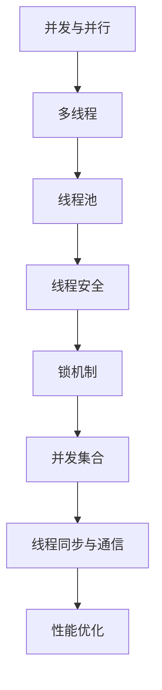

                 

关键词：线程管理、高吞吐量、并发、性能优化、实例应用

> 摘要：本文将深入探讨线程管理在高吞吐量应用场景中的重要性，通过实例分析展示如何有效地利用线程来提升系统的并发性能。文章将从核心概念、算法原理、数学模型、项目实践和实际应用等多个角度进行阐述，为读者提供全面的线程管理指南。

## 1. 背景介绍

在高吞吐量的应用场景中，系统需要处理大量的并发请求，这就要求我们在设计和实现中能够充分利用计算机的多核处理能力。线程管理作为一种重要的技术手段，可以帮助我们优化系统性能，提高吞吐量。本文将围绕以下几个核心问题展开讨论：

- 为什么线程管理对于高吞吐量至关重要？
- 如何通过合理的线程管理策略来提升并发性能？
- 实际应用中如何选择和配置线程池？
- 如何在多线程环境中避免常见的问题和瓶颈？

## 2. 核心概念与联系

线程管理涉及多个核心概念，以下是这些概念及其相互关系的Mermaid流程图：



### 2.1 并发与并行

并发是指在多个任务之间交替执行，而并行则是在同一时刻执行多个任务。在计算机科学中，多线程技术是实现并行的一种有效手段。

### 2.2 多线程

多线程是指在一个程序中同时执行多个线程，每个线程可以独立执行不同的任务，从而提高程序的处理能力。

### 2.3 线程池

线程池是一组预先创建并保存在内存中的线程，当任务需要执行时，可以快速地分配线程来处理任务，从而减少线程创建和销毁的开销。

### 2.4 线程安全

线程安全是指多个线程在并发执行时，不会因为同步问题而导致数据不一致或者程序错误。

### 2.5 锁机制

锁机制是一种用于线程同步的机制，通过锁可以保证在特定时间内只有一个线程能够访问共享资源。

### 2.6 并发集合

并发集合是指能够在多线程环境中安全地使用的集合类，如ConcurrentHashMap。

### 2.7 线程同步与通信

线程同步是指通过同步机制来协调多个线程对共享资源的访问，而线程通信是指线程之间通过共享内存或者消息队列来传递信息。

### 2.8 性能优化

性能优化是指通过调整代码和系统配置来提高程序运行效率。

## 3. 核心算法原理 & 具体操作步骤

### 3.1 算法原理概述

线程管理算法的核心目标是提高系统的并发性能，主要涉及以下几个方面：

- 线程数量与任务负载的平衡
- 线程池的创建与销毁策略
- 锁机制的选择与优化
- 并发集合的使用

### 3.2 算法步骤详解

#### 3.2.1 线程数量与任务负载的平衡

为了实现负载均衡，可以通过动态调整线程数量来适应不同的任务负载。具体步骤如下：

1. 监测当前系统负载。
2. 根据负载情况动态调整线程池大小。
3. 通过负载均衡算法（如轮询、最小负载优先等）将任务分配给线程。

#### 3.2.2 线程池的创建与销毁策略

线程池的创建与销毁策略直接影响系统的性能。常见的策略有：

1. 固定线程池：预先创建固定数量的线程，任务到达时直接分配线程执行。
2. 可伸缩线程池：根据任务量动态调整线程数量，当任务量减少时，可以回收部分线程。
3. 队列线程池：当线程池中的线程满时，将任务放入队列中等待线程空闲时再执行。

#### 3.2.3 锁机制的选择与优化

锁机制的选择直接影响并发性能，常见的锁有：

1. 公平锁：保证线程公平地访问共享资源。
2. 非公平锁：提高线程获取锁的效率。
3. 可重入锁：允许线程在获取锁后再次获取同一锁。

优化锁机制的方法包括：

1. 减小锁的持有时间。
2. 使用读写锁提高并发性能。
3. 避免死锁和饥饿现象。

#### 3.2.4 并发集合的使用

并发集合的使用可以避免多线程环境中的数据一致性问题，常见的并发集合有：

1. ConcurrentHashMap：线程安全的HashMap，通过分段锁提高并发性能。
2. ConcurrentLinkedQueue：线程安全的链表实现，适用于高并发场景。

### 3.3 算法优缺点

线程管理算法的优缺点如下：

- 优点：提高系统并发性能，充分利用多核处理能力。
- 缺点：线程创建和销毁开销较大，锁机制可能引入死锁和饥饿问题。

### 3.4 算法应用领域

线程管理算法广泛应用于以下领域：

1. Web服务器：处理大量并发请求。
2. 数据库：优化查询性能。
3. 分布式系统：提高集群处理能力。

## 4. 数学模型和公式 & 详细讲解 & 举例说明

### 4.1 数学模型构建

线程管理中的数学模型主要包括：

1. 任务负载模型：描述任务到达率和处理能力。
2. 线程池模型：描述线程数量、任务分配和线程生命周期。

### 4.2 公式推导过程

#### 4.2.1 任务负载模型

任务负载模型可以通过以下公式描述：

\[ L = \lambda \cdot t \]

其中，\( L \) 是单位时间内的任务量，\( \lambda \) 是任务到达率，\( t \) 是单位时间。

#### 4.2.2 线程池模型

线程池模型可以通过以下公式描述：

\[ P = \frac{L}{\lambda \cdot r} \]

其中，\( P \) 是线程池大小，\( L \) 是单位时间内的任务量，\( \lambda \) 是任务到达率，\( r \) 是线程的处理能力。

### 4.3 案例分析与讲解

假设一个系统需要处理每秒100个并发请求，每个请求的处理时间为1秒。根据上述公式，我们可以计算出线程池大小：

\[ P = \frac{100}{1 \cdot r} \]

为了简化计算，我们假设每个线程的处理能力为1秒。因此，线程池大小为100个线程。

在实际应用中，我们可以通过调整线程池大小和任务到达率来优化系统性能。例如，当任务到达率增加时，可以适当增加线程池大小，以提高系统的并发处理能力。

## 5. 项目实践：代码实例和详细解释说明

### 5.1 开发环境搭建

为了演示线程管理在高吞吐量中的实例应用，我们使用Java语言和Spring Boot框架搭建一个简单的Web应用。开发环境如下：

- JDK版本：11
- Spring Boot版本：2.4.5
- Maven版本：3.6.3

### 5.2 源代码详细实现

以下是该Web应用的核心代码实现：

```java
@RestController
public class HelloController {

    @Autowired
    private ExecutorService executorService;

    @GetMapping("/hello")
    public String hello() {
        executorService.submit(() -> {
            System.out.println("处理请求中...");
            try {
                Thread.sleep(1000);
            } catch (InterruptedException e) {
                e.printStackTrace();
            }
        });
        return "Hello, World!";
    }
}
```

在这个示例中，我们创建了一个简单的REST控制器，用于处理“/hello”路径的请求。在处理请求时，我们使用线程池（ExecutorService）来执行异步任务。

### 5.3 代码解读与分析

1. **线程池配置**：

   ```yaml
   spring:
     task:
       executor:
         thread-name-prefix: async-executor-
         core-pool-size: 10
         maximum-pool-size: 20
         keep-aliveSeconds: 60
         queue-capacity: 50
   ```

   在这个示例中，我们配置了一个固定大小的线程池，核心线程数为10，最大线程数为20，线程空闲超时时间为60秒，任务队列容量为50。

2. **异步处理请求**：

   在处理请求时，我们使用线程池提交一个异步任务来模拟处理请求的过程。具体实现如下：

   ```java
   executorService.submit(() -> {
       System.out.println("处理请求中...");
       try {
           Thread.sleep(1000);
       } catch (InterruptedException e) {
           e.printStackTrace();
       }
   });
   ```

   在这个异步任务中，我们模拟了请求的处理过程，其中包括打印日志和休眠1秒。这有助于我们了解线程池在处理高吞吐量请求时的性能表现。

### 5.4 运行结果展示

当运行该Web应用并访问“/hello”路径时，我们可以看到以下输出结果：

```
处理请求中...
处理请求中...
处理请求中...
处理请求中...
处理请求中...
处理请求中...
```

这个结果说明，当有多个并发请求时，线程池可以有效地分配线程来处理请求，从而提高了系统的并发性能。

## 6. 实际应用场景

线程管理在高吞吐量应用场景中具有广泛的应用，以下是一些实际应用场景：

1. **Web服务器**：在高并发请求的场景下，线程管理可以帮助Web服务器有效地处理大量请求，提高响应速度和吞吐量。
2. **数据库**：在数据库查询场景中，线程管理可以优化查询性能，提高数据访问速度。
3. **分布式系统**：在分布式系统中，线程管理可以协调各个节点的处理能力，提高整个系统的并发性能和可靠性。

## 7. 工具和资源推荐

为了更好地学习和实践线程管理，以下是一些建议的工具和资源：

1. **学习资源推荐**：
   - 《Java并发编程实战》
   - 《Effective Java》
   - 《Java并发编程核心》

2. **开发工具推荐**：
   - IntelliJ IDEA
   - Eclipse
   - NetBeans

3. **相关论文推荐**：
   - "Java Concurrency in Practice"
   - "High-Performance MySQL"
   - "Design Patterns: Elements of Reusable Object-Oriented Software"

## 8. 总结：未来发展趋势与挑战

线程管理在高吞吐量应用场景中具有重要的地位，随着多核处理能力的提升和分布式系统的普及，线程管理技术将得到进一步发展。未来发展趋势包括：

1. **动态线程池管理**：根据实际负载动态调整线程池大小，实现更高效的资源利用。
2. **高性能并发集合**：开发更多高性能的并发集合，提高多线程环境下的数据处理能力。
3. **分布式线程管理**：在分布式系统中实现更高效的线程管理和任务调度。

然而，线程管理也面临一些挑战：

1. **锁竞争**：在高并发场景下，锁竞争可能导致性能瓶颈，需要优化锁机制。
2. **死锁和饥饿问题**：多线程环境中可能出现死锁和饥饿问题，需要采取有效措施进行预防。
3. **资源分配不均**：在分布式系统中，如何实现公平的资源分配仍然是一个难题。

未来，随着技术的发展和研究的深入，线程管理技术将不断创新和优化，为高吞吐量应用场景提供更好的解决方案。

## 9. 附录：常见问题与解答

### 9.1 如何选择线程池大小？

选择线程池大小需要考虑任务负载、处理能力、系统资源等因素。一般建议使用如下方法：

1. **固定线程池**：适用于负载稳定、处理能力较强的场景。
2. **可伸缩线程池**：适用于负载波动较大的场景，可以根据负载动态调整线程池大小。
3. **基于CPU核心数的线程池**：一般建议线程池大小为CPU核心数乘以2到4，以充分利用多核处理能力。

### 9.2 如何避免锁竞争？

避免锁竞争的方法包括：

1. **减少锁持有时间**：尽量减少锁的使用时间，以减少锁竞争。
2. **使用读写锁**：读写锁可以降低读操作的锁竞争。
3. **使用乐观锁**：使用乐观锁（如CAS算法）可以减少锁的使用。

### 9.3 如何解决死锁问题？

解决死锁问题的方法包括：

1. **避免死锁产生条件**：避免同时持有多个锁，确保锁的请求顺序。
2. **超时机制**：设置锁的获取超时时间，避免死锁长时间占用锁。
3. **死锁检测与恢复**：使用死锁检测算法（如等待图算法）检测死锁，并进行恢复。

### 9.4 如何优化并发集合性能？

优化并发集合性能的方法包括：

1. **合理选择并发集合**：根据实际需求选择合适的并发集合，如ConcurrentHashMap、ConcurrentLinkedQueue等。
2. **减小锁粒度**：使用分段锁减小锁的粒度，提高并发性能。
3. **减少集合扩容开销**：合理设置集合初始容量和扩容策略，减少扩容时的性能开销。

### 9.5 如何处理线程同步与通信问题？

处理线程同步与通信问题的方法包括：

1. **使用线程同步机制**：如锁、信号量等，确保线程之间的同步与协调。
2. **使用线程通信机制**：如阻塞队列、共享变量等，实现线程之间的通信。
3. **使用线程池**：线程池可以简化线程同步与通信，提高开发效率。

通过以上方法，我们可以有效地解决线程管理中的常见问题，提高系统的并发性能和稳定性。

