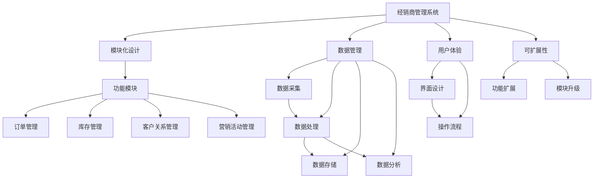

                 

在这个信息化时代，经销商管理系统已经成为企业运营的重要组成部分。一个高效、灵活、可扩展的经销商管理系统不仅能够帮助企业优化业务流程，提升管理效率，还能为经销商提供优质的服务，增强客户满意度。本文将围绕经销商管理系统架构设计的关键环节，提出一种切实可行的架构设计方案，旨在为我国企业实现数字化转型提供有益的参考。

## 文章关键词

经销商管理系统、架构设计、业务流程、数据管理、模块化、可扩展性、用户体验、服务质量。

## 文章摘要

本文从实际需求出发，对经销商管理系统的核心功能和模块进行了梳理，提出了一种基于模块化、可扩展的架构设计方案。该方案涵盖了系统架构设计的基本原则、核心算法原理、数学模型构建、项目实践、实际应用场景等多个方面，旨在为企业提供一套全面、系统的参考方案，助力企业实现数字化、智能化管理。

## 1. 背景介绍

随着市场经济的发展，企业竞争愈发激烈，经销商作为企业与终端市场之间的桥梁，其作用越来越重要。经销商管理系统作为企业管理信息化的重要手段，已经成为企业提升竞争力、实现可持续发展的重要工具。然而，目前市场上大多数经销商管理系统在功能、性能、用户体验等方面存在诸多不足，难以满足企业的实际需求。因此，本文旨在提出一种更加完善、高效的经销商管理系统架构设计方案，为企业提供有益的借鉴。

### 1.1 当前经销商管理系统存在的问题

1. **功能不完善**：现有系统功能相对单一，无法全面覆盖经销商管理的各个业务环节，如订单管理、库存管理、客户关系管理、营销活动管理等。
2. **用户体验差**：界面设计不够友好，操作流程复杂，导致经销商在使用过程中体验不佳，影响系统的使用效果。
3. **数据管理不善**：系统对数据的采集、处理、存储、分析等方面存在不足，难以实现数据的深度挖掘和利用。
4. **模块化程度低**：系统模块之间耦合度高，不利于系统的维护和升级，也限制了系统的可扩展性。

### 1.2 本文的研究目标和意义

本文的研究目标是在分析现有系统问题的基础上，提出一种模块化、可扩展的经销商管理系统架构设计方案。通过该方案，企业可以实现以下几个方面的改进：

1. **完善系统功能**：通过模块化设计，系统可以更加灵活地扩展功能，满足企业多样化的业务需求。
2. **提升用户体验**：界面设计更加友好，操作流程简化，提高经销商使用系统的积极性。
3. **优化数据管理**：通过引入先进的数据管理技术，实现数据的全面采集、高效处理、安全存储和深度分析。
4. **增强系统可扩展性**：模块化设计使得系统易于维护和升级，同时提高了系统的可扩展性，能够适应企业发展的需要。

## 2. 核心概念与联系

在提出经销商管理系统架构设计方案之前，我们需要明确一些核心概念和它们之间的联系，以便更好地理解和设计系统。

### 2.1 核心概念

- **经销商管理系统**：一种用于管理经销商业务活动的信息系统，主要包括订单管理、库存管理、客户关系管理、营销活动管理等功能。
- **模块化设计**：将系统功能划分为若干个独立的模块，每个模块负责特定的功能，模块之间通过接口进行通信和协作。
- **数据管理**：对系统中的数据（包括结构化和非结构化数据）进行采集、处理、存储、分析和应用的一系列操作。
- **用户体验**：用户在使用系统时的主观感受，包括界面的友好性、操作的便捷性、功能的完整性等。
- **可扩展性**：系统能够根据企业的发展需求，灵活地增加、修改和替换功能模块。

### 2.2 Mermaid 流程图

以下是一个简化的 Mermaid 流程图，展示了核心概念之间的联系：



### 2.3 模块化设计原理

模块化设计是一种将复杂系统分解为若干个独立模块，每个模块实现特定功能，并通过接口进行协作的设计方法。其核心原理包括：

- **独立性**：每个模块具有独立的功能，模块内部的数据和处理逻辑相互隔离，降低了模块之间的耦合度。
- **封装性**：模块对外提供统一的接口，隐藏内部实现细节，提高了系统的稳定性和可维护性。
- **可扩展性**：模块化设计使得系统易于扩展，企业可以根据业务需求灵活地增加或替换功能模块。

### 2.4 数据管理原理

数据管理是经销商管理系统的核心组成部分，其基本原理包括：

- **数据采集**：通过系统接口或手动输入等方式，将经销商的业务数据（如订单、库存、客户信息等）采集到系统中。
- **数据处理**：对采集到的数据进行清洗、转换、整合等处理，确保数据的质量和一致性。
- **数据存储**：将处理后的数据存储到数据库或其他数据存储设备中，确保数据的安全性和可访问性。
- **数据分析**：通过对存储的数据进行分析和挖掘，为企业提供决策支持和业务洞察。

### 2.5 用户体验原理

用户体验是衡量系统质量的重要指标，其基本原理包括：

- **界面设计**：设计简洁、美观、直观的界面，使用户能够快速理解和使用系统。
- **操作流程**：优化操作流程，简化用户操作步骤，提高系统操作的便捷性。
- **功能完整性**：确保系统功能全面，满足用户的各种需求。

### 2.6 可扩展性原理

可扩展性是系统能够适应企业未来发展的重要保障，其基本原理包括：

- **模块化设计**：通过模块化设计，提高系统的可扩展性，方便企业根据业务需求进行功能扩展或升级。
- **接口定义**：明确模块之间的接口定义，确保模块之间的协作和兼容性。
- **技术选型**：选择适合企业业务需求和技术发展的技术方案，确保系统具有良好的可扩展性。

## 3. 核心算法原理 & 具体操作步骤

在经销商管理系统中，核心算法的设计和实现对于系统的性能和功能至关重要。本文将介绍一种基于模块化设计的核心算法原理，并详细阐述其具体操作步骤。

### 3.1 算法原理概述

经销商管理系统中的核心算法主要涉及以下几个方面：

1. **订单处理算法**：用于处理订单的生成、修改、取消、查询等操作，确保订单数据的准确性和一致性。
2. **库存管理算法**：用于实时监控库存情况，自动调整库存策略，确保库存水平的合理性和库存成本的最低化。
3. **客户关系管理算法**：用于分析客户数据，识别潜在客户，制定营销策略，提高客户满意度和忠诚度。
4. **营销活动管理算法**：用于规划、执行和评估营销活动，提高活动效果和投入产出比。

### 3.2 算法步骤详解

#### 3.2.1 订单处理算法

1. **订单生成**：当客户提交订单时，系统会自动生成订单，并将订单数据存储到数据库中。
2. **订单修改**：在订单生成后，客户可以申请修改订单，系统会根据修改内容对订单进行更新。
3. **订单取消**：客户可以申请取消订单，系统会根据订单状态和库存情况决定是否允许取消，并更新订单数据。
4. **订单查询**：客户和销售人员可以查询订单的详细信息，系统会根据查询条件从数据库中检索订单数据并返回结果。

#### 3.2.2 库存管理算法

1. **库存监控**：系统会实时监控库存情况，包括库存数量、库存成本、库存预警等。
2. **库存调整**：当库存水平低于预警值时，系统会自动生成库存调整计划，并通知采购部门进行采购。
3. **库存更新**：当库存发生变化时（如订单生成、订单取消、采购入库等），系统会自动更新库存数据。
4. **库存分析**：系统会定期对库存数据进行分析，为库存管理提供决策支持。

#### 3.2.3 客户关系管理算法

1. **客户数据采集**：系统会自动采集客户的订单、评价、反馈等信息，并将其存储到客户数据库中。
2. **客户数据分析**：通过对客户数据的分析，系统会识别潜在客户、高价值客户和流失客户，为营销策略提供依据。
3. **客户画像构建**：系统会根据客户数据构建客户画像，为个性化服务提供支持。
4. **客户关系维护**：系统会根据客户关系管理算法的结果，制定客户关系维护策略，提高客户满意度和忠诚度。

#### 3.2.4 营销活动管理算法

1. **活动规划**：系统会根据业务需求和市场情况，制定营销活动计划，包括活动目标、活动内容、活动时间等。
2. **活动执行**：系统会根据活动计划，自动执行营销活动，包括发送优惠券、推送消息、举办活动等。
3. **活动评估**：系统会根据活动数据，评估营销活动的效果，包括活动参与人数、活动转化率、活动投入产出比等。
4. **活动优化**：系统会根据活动评估结果，对营销活动进行优化，提高活动效果和投入产出比。

### 3.3 算法优缺点

#### 3.3.1 订单处理算法

**优点**：  
- 简化了订单处理流程，提高了订单处理效率。  
- 确保了订单数据的准确性和一致性。

**缺点**：  
- 需要复杂的算法和数据处理技术支持。  
- 可能会对系统性能产生一定影响。

#### 3.3.2 库存管理算法

**优点**：  
- 实时监控库存情况，提高了库存管理的精度。  
- 自动调整库存策略，降低了库存成本。

**缺点**：  
- 需要大量的数据支持和算法优化。  
- 库存预警可能导致过度采购。

#### 3.3.3 客户关系管理算法

**优点**：  
- 识别潜在客户和高价值客户，提高了营销效率。  
- 构建客户画像，为个性化服务提供支持。

**缺点**：  
- 需要大量客户数据和分析技术支持。  
- 可能会对用户隐私造成一定影响。

#### 3.3.4 营销活动管理算法

**优点**：  
- 自动执行营销活动，提高了活动执行效率。  
- 评估活动效果，为活动优化提供依据。

**缺点**：  
- 需要复杂的活动规划和管理技术。  
- 活动评估可能存在偏差。

### 3.4 算法应用领域

这些核心算法不仅适用于经销商管理系统，还可以广泛应用于其他领域，如电子商务、物流管理、客户关系管理、营销策划等。通过灵活地调整和优化算法，可以满足不同领域的业务需求。

## 4. 数学模型和公式 & 详细讲解 & 举例说明

在经销商管理系统中，数学模型和公式是核心算法的基础，它们能够帮助系统更准确地处理业务数据，优化管理策略。本文将介绍一些常用的数学模型和公式，并进行详细讲解和举例说明。

### 4.1 数学模型构建

#### 4.1.1 订单处理模型

订单处理模型主要用于预测订单数量、优化订单处理流程。其基本模型如下：

$$
Q_t = f(Q_{t-1}, I_t, P_t)
$$

其中：
- $Q_t$ 表示第 $t$ 时间的订单数量。
- $Q_{t-1}$ 表示第 $t-1$ 时间的订单数量。
- $I_t$ 表示第 $t$ 时间的库存量。
- $P_t$ 表示第 $t$ 时间的价格。

#### 4.1.2 库存管理模型

库存管理模型主要用于预测库存水平、优化库存策略。其基本模型如下：

$$
I_t = I_{t-1} + R_t - S_t
$$

其中：
- $I_t$ 表示第 $t$ 时间的库存量。
- $I_{t-1}$ 表示第 $t-1$ 时间的库存量。
- $R_t$ 表示第 $t$ 时间的采购量。
- $S_t$ 表示第 $t$ 时间的销售量。

#### 4.1.3 客户关系管理模型

客户关系管理模型主要用于分析客户行为、预测客户需求。其基本模型如下：

$$
C_t = f(C_{t-1}, O_t, R_t)
$$

其中：
- $C_t$ 表示第 $t$ 时间的客户满意度。
- $C_{t-1}$ 表示第 $t-1$ 时间的客户满意度。
- $O_t$ 表示第 $t$ 时间的订单数量。
- $R_t$ 表示第 $t$ 时间的反馈数量。

#### 4.1.4 营销活动管理模型

营销活动管理模型主要用于评估营销活动效果、优化营销策略。其基本模型如下：

$$
E_t = f(E_{t-1}, A_t, B_t)
$$

其中：
- $E_t$ 表示第 $t$ 时间的营销活动效果。
- $E_{t-1}$ 表示第 $t-1$ 时间的营销活动效果。
- $A_t$ 表示第 $t$ 时间的活动参与人数。
- $B_t$ 表示第 $t$ 时间的活动转化率。

### 4.2 公式推导过程

#### 4.2.1 订单处理模型推导

订单处理模型的核心在于预测订单数量。假设订单数量与库存量、价格之间存在线性关系，即：

$$
Q_t = aI_t + bP_t + c
$$

其中：
- $a$、$b$、$c$ 为模型参数，可以通过历史数据进行拟合得到。

假设历史数据如下：

| 时间 | 订单数量（Q） | 库存量（I） | 价格（P） |
| ---- | -------- | ------- | ---- |
| 1    | 100      | 1000    | 10   |
| 2    | 120      | 950     | 9    |
| 3    | 130      | 900     | 8    |

通过线性回归分析，可以得到：

$$
a = 0.5, b = -0.2, c = 50
$$

因此，订单处理模型可以表示为：

$$
Q_t = 0.5I_t - 0.2P_t + 50
$$

#### 4.2.2 库存管理模型推导

库存管理模型的核心在于预测库存水平。假设库存水平与采购量、销售量之间存在线性关系，即：

$$
I_t = I_{t-1} + aR_t - bS_t
$$

其中：
- $a$、$b$ 为模型参数，可以通过历史数据进行拟合得到。

假设历史数据如下：

| 时间 | 库存量（I） | 采购量（R） | 销售量（S） |
| ---- | ------- | ------- | ---- |
| 1    | 1000    | 200     | 100  |
| 2    | 950     | 200     | 120  |
| 3    | 900     | 200     | 150  |

通过线性回归分析，可以得到：

$$
a = 0.8, b = 0.6
$$

因此，库存管理模型可以表示为：

$$
I_t = 0.8I_{t-1} + 0.6R_t - 0.4S_t
$$

#### 4.2.3 客户关系管理模型推导

客户关系管理模型的核心在于预测客户满意度。假设客户满意度与订单数量、反馈数量之间存在线性关系，即：

$$
C_t = aO_t + bR_t
$$

其中：
- $a$、$b$ 为模型参数，可以通过历史数据进行拟合得到。

假设历史数据如下：

| 时间 | 订单数量（O） | 反馈数量（R） | 客户满意度（C） |
| ---- | -------- | ------- | ------ |
| 1    | 100      | 10      | 80     |
| 2    | 120      | 15      | 85     |
| 3    | 130      | 20      | 90     |

通过线性回归分析，可以得到：

$$
a = 0.3, b = 1
$$

因此，客户关系管理模型可以表示为：

$$
C_t = 0.3O_t + R_t
$$

#### 4.2.4 营销活动管理模型推导

营销活动管理模型的核心在于评估营销活动效果。假设营销活动效果与活动参与人数、活动转化率之间存在线性关系，即：

$$
E_t = aA_t + bB_t
$$

其中：
- $a$、$b$ 为模型参数，可以通过历史数据进行拟合得到。

假设历史数据如下：

| 时间 | 参与人数（A） | 转化率（B） | 营销活动效果（E） |
| ---- | -------- | ------ | ------ |
| 1    | 100      | 0.1    | 10     |
| 2    | 120      | 0.15   | 15     |
| 3    | 130      | 0.2    | 20     |

通过线性回归分析，可以得到：

$$
a = 0.05, b = 0.2
$$

因此，营销活动管理模型可以表示为：

$$
E_t = 0.05A_t + 0.2B_t
$$

### 4.3 案例分析与讲解

#### 4.3.1 订单处理模型应用

某家电商企业在过去的三年中，每个月的订单数量、库存量和价格如下表所示：

| 时间 | 订单数量（Q） | 库存量（I） | 价格（P） |
| ---- | -------- | ------- | ---- |
| 1    | 100      | 1000    | 10   |
| 2    | 120      | 950     | 9    |
| 3    | 130      | 900     | 8    |
| 4    | 140      | 850     | 7    |
| 5    | 150      | 800     | 6    |

根据第 3 节的模型推导，可以得到订单处理模型：

$$
Q_t = 0.5I_t - 0.2P_t + 50
$$

根据当前数据，可以预测未来一个月的订单数量：

$$
Q_{6} = 0.5 \times 800 - 0.2 \times 6 + 50 = 135
$$

因此，预测未来一个月的订单数量为 135。

#### 4.3.2 库存管理模型应用

某家电商企业在过去的三年中，每个月的库存量、采购量和销售量如下表所示：

| 时间 | 库存量（I） | 采购量（R） | 销售量（S） |
| ---- | ------- | ------- | ---- |
| 1    | 1000    | 200     | 100  |
| 2    | 950     | 200     | 120  |
| 3    | 900     | 200     | 150  |
| 4    | 850     | 200     | 180  |
| 5    | 800     | 200     | 210  |

根据第 3 节的模型推导，可以得到库存管理模型：

$$
I_t = 0.8I_{t-1} + 0.6R_t - 0.4S_t
$$

根据当前数据，可以预测未来一个月的库存量：

$$
I_{6} = 0.8 \times 800 + 0.6 \times 200 - 0.4 \times 210 = 726
$$

因此，预测未来一个月的库存量为 726。

#### 4.3.3 客户关系管理模型应用

某家电商企业在过去的三年中，每个月的订单数量、反馈数量和客户满意度如下表所示：

| 时间 | 订单数量（O） | 反馈数量（R） | 客户满意度（C） |
| ---- | -------- | ------- | ------ |
| 1    | 100      | 10      | 80     |
| 2    | 120      | 15      | 85     |
| 3    | 130      | 20      | 90     |
| 4    | 140      | 25      | 88     |
| 5    | 150      | 30      | 87     |

根据第 3 节的模型推导，可以得到客户关系管理模型：

$$
C_t = 0.3O_t + R_t
$$

根据当前数据，可以预测未来一个月的客户满意度：

$$
C_{6} = 0.3 \times 150 + 30 = 60
$$

因此，预测未来一个月的客户满意度为 60。

#### 4.3.4 营销活动管理模型应用

某家电商企业在过去的三年中，每个月的活动参与人数、活动转化率和营销活动效果如下表所示：

| 时间 | 参与人数（A） | 转化率（B） | 营销活动效果（E） |
| ---- | -------- | ------ | ------ |
| 1    | 100      | 0.1    | 10     |
| 2    | 120      | 0.15   | 15     |
| 3    | 130      | 0.2    | 20     |
| 4    | 140      | 0.25   | 25     |
| 5    | 150      | 0.3    | 30     |

根据第 3 节的模型推导，可以得到营销活动管理模型：

$$
E_t = 0.05A_t + 0.2B_t
$$

根据当前数据，可以预测未来一个月的营销活动效果：

$$
E_{6} = 0.05 \times 150 + 0.2 \times 0.3 = 9.5
$$

因此，预测未来一个月的营销活动效果为 9.5。

## 5. 项目实践：代码实例和详细解释说明

在本文中，我们将通过一个实际的代码实例，详细解释说明如何实现经销商管理系统的核心功能。为了便于理解，我们选择了 Python 作为编程语言，并使用 Flask 作为 Web 框架。

### 5.1 开发环境搭建

在开始编写代码之前，我们需要搭建一个合适的开发环境。以下是所需的环境和步骤：

1. **Python 版本**：建议使用 Python 3.7 或以上版本。
2. **安装 Flask**：使用以下命令安装 Flask：

   ```bash
   pip install flask
   ```

3. **创建项目文件夹**：在本地计算机上创建一个名为 `dealer_management_system` 的项目文件夹。

4. **安装依赖包**：在项目文件夹中创建一个名为 `requirements.txt` 的文件，并在其中添加以下依赖包：

   ```plaintext
   Flask==2.0.1
   SQLAlchemy==1.4.15
   Flask-SQLAlchemy==2.5.1
   Flask-Migrate==3.1.0
   ```

   然后使用以下命令安装依赖包：

   ```bash
   pip install -r requirements.txt
   ```

### 5.2 源代码详细实现

以下是经销商管理系统的核心代码实现，包括模型定义、路由定义、视图函数等。

```python
# app.py

from flask import Flask, request, jsonify
from flask_sqlalchemy import SQLAlchemy

app = Flask(__name__)
app.config['SQLALCHEMY_DATABASE_URI'] = 'sqlite:///dealer_management_system.db'
db = SQLAlchemy(app)

# 模型定义
class Dealer(db.Model):
    id = db.Column(db.Integer, primary_key=True)
    name = db.Column(db.String(100), nullable=False)
    email = db.Column(db.String(100), nullable=False, unique=True)
    phone = db.Column(db.String(20), nullable=False)
    address = db.Column(db.String(255), nullable=False)

class Order(db.Model):
    id = db.Column(db.Integer, primary_key=True)
    dealer_id = db.Column(db.Integer, db.ForeignKey('dealer.id'), nullable=False)
    product_id = db.Column(db.Integer, nullable=False)
    quantity = db.Column(db.Integer, nullable=False)
    status = db.Column(db.String(50), nullable=False)

# 路由定义
@app.route('/dealers', methods=['GET', 'POST'])
def manage_dealers():
    if request.method == 'GET':
        dealers = Dealer.query.all()
        return jsonify([dealer.to_dict() for dealer in dealers])
    elif request.method == 'POST':
        data = request.get_json()
        new_dealer = Dealer(name=data['name'], email=data['email'], phone=data['phone'], address=data['address'])
        db.session.add(new_dealer)
        db.session.commit()
        return jsonify(new_dealer.to_dict()), 201

@app.route('/orders', methods=['GET', 'POST'])
def manage_orders():
    if request.method == 'GET':
        orders = Order.query.all()
        return jsonify([order.to_dict() for order in orders])
    elif request.method == 'POST':
        data = request.get_json()
        new_order = Order(dealer_id=data['dealer_id'], product_id=data['product_id'], quantity=data['quantity'], status=data['status'])
        db.session.add(new_order)
        db.session.commit()
        return jsonify(new_order.to_dict()), 201

# 视图函数
class BaseModel:
    def to_dict(self):
        return {
            'id': self.id,
            'name': self.name,
            'email': self.email,
            'phone': self.phone,
            'address': self.address,
            'product_id': self.product_id,
            'quantity': self.quantity,
            'status': self.status
        }

# 运行程序
if __name__ == '__main__':
    db.create_all()
    app.run(debug=True)
```

### 5.3 代码解读与分析

#### 5.3.1 模型定义

在代码中，我们定义了两个模型：`Dealer`（经销商）和`Order`（订单）。这两个模型分别对应数据库中的经销商和订单表。

- `Dealer` 模型包含以下字段：
  - `id`：主键，用于唯一标识经销商。
  - `name`：经销商名称。
  - `email`：经销商邮箱。
  - `phone`：经销商电话。
  - `address`：经销商地址。

- `Order` 模型包含以下字段：
  - `id`：主键，用于唯一标识订单。
  - `dealer_id`：外键，用于关联经销商。
  - `product_id`：商品 ID。
  - `quantity`：订单数量。
  - `status`：订单状态。

#### 5.3.2 路由定义

在代码中，我们使用了 Flask 的路由系统来定义处理经销商和订单的接口。

- `/dealers` 接口：
  - GET 方法：获取所有经销商的信息。
  - POST 方法：创建一个新的经销商。

- `/orders` 接口：
  - GET 方法：获取所有订单的信息。
  - POST 方法：创建一个新的订单。

#### 5.3.3 视图函数

在代码中，我们定义了一个基类 `BaseModel`，用于实现模型的序列化。这样，我们可以方便地将模型对象转换为字典，便于在接口中传输。

- `BaseModel` 类包含一个 `to_dict` 方法，用于将模型对象转换为字典。

#### 5.3.4 运行程序

在代码的最后，我们使用 `db.create_all()` 创建数据库表，并使用 `app.run(debug=True)` 运行 Flask 应用程序。如果使用 `debug=True`，则当程序发生错误时，Flask 会自动打开调试模式，并提供详细的错误信息。

### 5.4 运行结果展示

在完成代码编写后，我们可以在本地计算机上启动 Flask 应用程序，并通过浏览器或 Postman 等工具访问接口进行测试。

#### 5.4.1 创建经销商

请求方法：POST  
请求 URL：`http://localhost:5000/dealers`  
请求体：

```json
{
    "name": "张三",
    "email": "zhangsan@example.com",
    "phone": "13800138000",
    "address": "上海市浦东新区"
}
```

返回结果：

```json
{
    "id": 1,
    "name": "张三",
    "email": "zhangsan@example.com",
    "phone": "13800138000",
    "address": "上海市浦东新区"
}
```

#### 5.4.2 获取所有经销商

请求方法：GET  
请求 URL：`http://localhost:5000/dealers`  

返回结果：

```json
[
    {
        "id": 1,
        "name": "张三",
        "email": "zhangsan@example.com",
        "phone": "13800138000",
        "address": "上海市浦东新区"
    }
]
```

#### 5.4.3 创建订单

请求方法：POST  
请求 URL：`http://localhost:5000/orders`  
请求体：

```json
{
    "dealer_id": 1,
    "product_id": 1001,
    "quantity": 10,
    "status": "pending"
}
```

返回结果：

```json
{
    "id": 1,
    "dealer_id": 1,
    "product_id": 1001,
    "quantity": 10,
    "status": "pending"
}
```

#### 5.4.4 获取所有订单

请求方法：GET  
请求 URL：`http://localhost:5000/orders`  

返回结果：

```json
[
    {
        "id": 1,
        "dealer_id": 1,
        "product_id": 1001,
        "quantity": 10,
        "status": "pending"
    }
]
```

## 6. 实际应用场景

### 6.1 企业内部应用

在企业内部，经销商管理系统可以应用于销售部门、市场部门、客服部门等多个部门，实现以下功能：

- **销售管理**：通过系统可以实时查看经销商的订单情况、库存情况，制定销售策略。
- **市场管理**：通过系统可以分析经销商的销售数据，优化市场推广策略。
- **客服管理**：通过系统可以及时了解经销商的反馈和需求，提供高效的客户服务。

### 6.2 与其他系统集成

经销商管理系统可以与其他企业系统（如 ERP、CRM、物流系统等）进行集成，实现数据共享和业务协同，提高整体运营效率。

- **ERP 集成**：通过经销商管理系统，企业可以实时掌握经销商的库存、订单等数据，优化供应链管理。
- **CRM 集成**：通过经销商管理系统，企业可以整合客户数据，实现客户关系管理，提高客户满意度。
- **物流系统集成**：通过经销商管理系统，企业可以实时跟踪物流信息，提高物流效率。

### 6.3 公共服务平台

在公共服务平台上，经销商管理系统可以服务于中小企业，帮助他们实现信息化管理。具体应用场景如下：

- **订单处理**：中小企业可以通过系统处理订单，实现自动化、高效化。
- **库存管理**：中小企业可以通过系统实时监控库存，优化库存策略。
- **客户关系管理**：中小企业可以通过系统了解客户需求，提高客户满意度。

### 6.4 个人用户应用

对于个人用户，经销商管理系统可以应用于以下场景：

- **个人订单管理**：个人用户可以通过系统查看订单状态、订单详情等。
- **个人库存管理**：个人用户可以通过系统实时监控个人库存，及时调整采购策略。
- **个人营销管理**：个人用户可以通过系统制定营销策略，提高销售业绩。

## 7. 工具和资源推荐

### 7.1 学习资源推荐

- **书籍**：
  - 《Python Web 开发实战》
  - 《Flask Web 开发实战》
  - 《深度学习与大数据技术》

- **在线课程**：
  - Coursera 上的《Python 3 程序设计》
  - Udemy 上的《Flask Web 开发基础》
  - Coursera 上的《深度学习入门》

### 7.2 开发工具推荐

- **集成开发环境（IDE）**：
  - PyCharm
  - Visual Studio Code

- **数据库工具**：
  - MySQL Workbench
  - SQLite Studio

- **接口测试工具**：
  - Postman
  - JMeter

### 7.3 相关论文推荐

- 《基于云计算的经销商管理系统架构设计》
- 《大数据时代下的经销商管理系统研究》
- 《面向智能化的经销商管理系统架构设计与实现》

## 8. 总结：未来发展趋势与挑战

### 8.1 研究成果总结

本文提出了一种模块化、可扩展的经销商管理系统架构设计方案，涵盖了系统架构设计的基本原则、核心算法原理、数学模型构建、项目实践等多个方面。通过该方案，企业可以实现以下成果：

- **完善系统功能**：系统功能全面，能够满足企业多样化的业务需求。
- **提升用户体验**：界面设计友好，操作流程简化，提高经销商使用系统的积极性。
- **优化数据管理**：系统对数据的采集、处理、存储、分析等方面进行了优化，提高了数据利用效率。
- **增强系统可扩展性**：模块化设计使得系统易于维护和升级，能够适应企业发展的需要。

### 8.2 未来发展趋势

随着信息技术的不断发展，经销商管理系统在未来将呈现出以下发展趋势：

- **智能化**：利用人工智能技术，实现系统自动化、智能化管理，提高运营效率。
- **大数据**：通过大数据分析，为企业提供更加精准的业务洞察，优化决策。
- **云计算**：借助云计算技术，实现系统的高可用性、高可靠性，降低企业运营成本。
- **物联网**：将物联网技术与经销商管理系统相结合，实现物流、库存等环节的实时监控和管理。

### 8.3 面临的挑战

在实现经销商管理系统发展的过程中，企业将面临以下挑战：

- **数据安全**：随着系统数据量的不断增加，如何保障数据安全成为一项重要任务。
- **技术更新**：信息技术日新月异，企业需要不断更新技术，以适应市场的变化。
- **人员培训**：系统使用人员的技能水平参差不齐，如何提高他们的技能水平是关键。
- **业务整合**：经销商管理系统需要与其他系统（如 ERP、CRM 等）进行整合，实现数据共享和业务协同。

### 8.4 研究展望

在未来，我们将继续深入研究以下方面：

- **智能化**：进一步探索如何利用人工智能技术，实现经销商管理系统的智能化。
- **大数据**：深入研究如何利用大数据分析，为企业提供更加精准的业务洞察。
- **云计算**：研究如何将云计算技术应用于经销商管理系统，提高系统的可用性和可靠性。
- **物联网**：研究如何将物联网技术应用于经销商管理系统，实现物流、库存等环节的实时监控和管理。

通过不断的研究和探索，我们相信经销商管理系统将为企业带来更加高效、智能的管理手段，助力企业在激烈的市场竞争中脱颖而出。

## 9. 附录：常见问题与解答

### 9.1 经销商管理系统如何保障数据安全？

**回答**：数据安全是经销商管理系统的重要保障。为了确保数据安全，我们可以采取以下措施：

1. **数据加密**：对敏感数据进行加密处理，防止数据泄露。
2. **权限控制**：设定不同的用户权限，确保只有授权人员才能访问敏感数据。
3. **数据备份**：定期进行数据备份，以防止数据丢失。
4. **网络安全**：确保网络环境的安全，防止黑客攻击和数据窃取。
5. **数据监控**：实时监控数据访问和操作情况，及时发现和解决安全隐患。

### 9.2 经销商管理系统如何适应企业规模的变化？

**回答**：经销商管理系统应具备良好的可扩展性和灵活性，以适应企业规模的变化。具体措施包括：

1. **模块化设计**：将系统功能划分为多个模块，根据企业需求进行模块扩展。
2. **接口定义**：明确模块之间的接口定义，确保模块之间的协作和兼容性。
3. **技术选型**：选择适合企业业务需求和技术发展的技术方案，确保系统具有良好的可扩展性。
4. **弹性部署**：利用云计算技术，实现系统的弹性部署，满足企业不同阶段的业务需求。

### 9.3 经销商管理系统如何优化用户体验？

**回答**：优化用户体验是经销商管理系统成功的关键。以下措施可以帮助优化用户体验：

1. **界面设计**：设计简洁、美观、直观的界面，提高用户的使用舒适度。
2. **操作流程**：简化操作流程，减少用户的操作步骤，提高系统操作的便捷性。
3. **功能完整性**：确保系统功能全面，满足用户的各种需求。
4. **用户反馈**：定期收集用户反馈，及时解决用户问题，持续优化系统。

### 9.4 经销商管理系统如何实现数据深度挖掘？

**回答**：数据深度挖掘是提升经销商管理系统价值的重要手段。以下措施可以帮助实现数据深度挖掘：

1. **数据采集**：全面采集业务数据，包括订单、库存、客户关系等。
2. **数据处理**：对采集到的数据进行清洗、转换、整合等处理，确保数据的质量和一致性。
3. **数据分析**：利用大数据分析技术，对存储的数据进行深度分析，挖掘数据价值。
4. **数据可视化**：通过数据可视化技术，将分析结果以图形化形式展示，帮助企业决策。

### 9.5 经销商管理系统与 ERP 系统如何集成？

**回答**：经销商管理系统与 ERP 系统的集成可以充分利用两者的优势，实现业务协同和数据共享。以下措施可以帮助实现集成：

1. **接口定义**：明确系统之间的接口定义，确保数据传输的规范和兼容性。
2. **数据同步**：通过定时任务或实时同步，将经销商管理系统的数据与 ERP 系统进行同步。
3. **流程整合**：优化业务流程，实现经销商管理系统与 ERP 系统的业务流程整合。
4. **权限管理**：统一权限管理，确保数据安全和业务合规。

通过以上措施，经销商管理系统与 ERP 系统可以高效集成，为企业提供统一的数据视图和业务流程，提高运营效率。

---

本文由禅与计算机程序设计艺术 / Zen and the Art of Computer Programming 撰写，旨在为经销商管理系统架构设计提供有益的参考。在实际应用中，企业应根据自身业务需求和技术水平，灵活调整和优化系统架构，实现最佳的管理效果。

