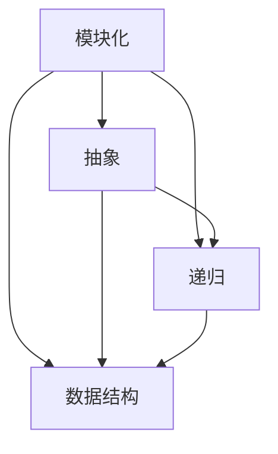

                 

### 关键词 Keywords

- 结构化思维
- 理解世界
- 计算机科学
- 算法
- 数学模型
- 实践应用

### 摘要 Abstract

本文旨在探讨结构化思维在计算机科学中的应用，通过介绍结构化思维的核心概念、算法原理、数学模型及其在现实世界中的应用，阐述如何运用这种思维模式理解复杂问题，并提高解决实际问题的效率。文章最后展望了结构化思维在未来的发展趋势和面临的挑战。

## 1. 背景介绍

结构化思维是一种系统化的思考方式，通过分解复杂问题，将它们转化为更易于理解和处理的组成部分，从而提高问题解决的效率。在计算机科学领域，结构化思维尤为重要，因为计算机系统本身就是由一系列相互关联的组件和算法组成的。

随着信息技术的发展，计算机系统变得越来越复杂。无论是软件开发、系统架构设计，还是数据分析和人工智能应用，都需要处理大量的信息，而这些信息往往呈现出高度复杂性和多样性。因此，掌握结构化思维，成为理解世界、解决复杂问题的关键。

### 结构化思维的定义

结构化思维（Structured Thinking）是一种逻辑清晰、层次分明的思考方式。它强调将复杂问题分解为简单、可管理的部分，并通过系统化的方法进行分析和解决。结构化思维的核心在于：

1. **问题分解**：将复杂问题分解为更小、更具体的子问题。
2. **逻辑层次**：建立清晰的逻辑层次结构，有助于理解和解决问题。
3. **步骤明确**：每个子问题都有明确的解决方案和执行步骤。
4. **反馈循环**：通过迭代和反馈不断优化解决方案。

### 结构化思维的重要性

在计算机科学中，结构化思维的重要性体现在以下几个方面：

1. **系统设计与开发**：结构化思维有助于设计复杂系统，确保系统的模块化和可维护性。
2. **问题解决**：通过分解问题，结构化思维提高了问题解决的效率和准确性。
3. **团队协作**：结构化思维促进了团队成员之间的沟通和协作，有助于项目的顺利进行。
4. **持续改进**：结构化思维鼓励迭代和反馈，有助于不断优化和改进解决方案。

## 2. 核心概念与联系

### 核心概念

结构化思维涉及多个核心概念，包括但不限于以下：

1. **模块化**：将复杂系统分解为独立、可替换的模块。
2. **抽象**：通过忽略不相关细节，简化问题模型。
3. **递归**：将问题递归分解，直至达到简单可解的层次。
4. **数据结构**：合理选择和使用数据结构，提高算法效率。

### 关联图（Mermaid 流程图）

下面是一个用于描述结构化思维核心概念及其关联的 Mermaid 流程图：



## 3. 核心算法原理 & 具体操作步骤

### 3.1 算法原理概述

结构化思维的核心算法原理在于如何将复杂问题分解为简单问题，并利用已有的解决方案逐步构建复杂问题的解决方案。这一过程通常包括以下几个步骤：

1. **问题定义**：明确问题的范围和目标。
2. **问题分解**：将问题分解为子问题。
3. **递归求解**：对子问题进行递归分解，直至达到简单可解的层次。
4. **组合解决方案**：将子问题的解组合成原问题的解。

### 3.2 算法步骤详解

1. **问题定义**

   在开始解决问题之前，首先需要明确问题的定义。这包括问题的输入、输出和约束条件。例如，在求解一个复杂的数据分析问题时，需要明确输入数据集、输出结果以及数据处理的要求。

2. **问题分解**

   将问题分解为更小、更具体的子问题。例如，一个复杂的数据分析问题可以分解为数据清洗、数据预处理、特征工程、模型训练和结果分析等子问题。

3. **递归求解**

   对每个子问题进行递归分解，直至达到简单可解的层次。例如，对于数据清洗问题，可以进一步分解为去除重复数据、处理缺失值、异常值处理等。

4. **组合解决方案**

   将子问题的解组合成原问题的解。例如，将数据清洗、预处理、特征工程和模型训练的结果组合起来，得到最终的数据分析结果。

### 3.3 算法优缺点

**优点**：

1. **简单易懂**：结构化思维将复杂问题分解为简单问题，有助于理解和解决问题。
2. **模块化**：结构化思维鼓励模块化设计，提高了系统的可维护性和可扩展性。
3. **效率高**：通过递归分解和组合，结构化思维能够快速求解复杂问题。

**缺点**：

1. **递归深度问题**：在递归深度较大时，可能会导致栈溢出或性能下降。
2. **嵌套复杂**：当问题分解得过于细致时，可能会导致算法嵌套层次过多，影响可读性和可维护性。

### 3.4 算法应用领域

结构化思维在计算机科学的多个领域都有广泛应用，包括但不限于：

1. **算法设计与分析**：在算法设计中，结构化思维有助于优化算法结构和提高效率。
2. **软件工程**：在软件设计和开发中，结构化思维有助于模块化设计和代码复用。
3. **数据科学**：在数据分析和建模中，结构化思维有助于分解复杂问题，提高分析效率。
4. **人工智能**：在人工智能应用中，结构化思维有助于构建复杂模型，提高算法性能。

## 4. 数学模型和公式 & 详细讲解 & 举例说明

### 4.1 数学模型构建

在计算机科学中，数学模型是描述问题的一种抽象方法。构建数学模型通常包括以下几个步骤：

1. **定义变量**：根据问题的需求，定义相关的变量。
2. **建立方程**：根据变量之间的关系，建立方程或方程组。
3. **简化方程**：通过化简和变换，简化方程形式，提高计算效率。
4. **求解方程**：求解方程，得到问题的解。

### 4.2 公式推导过程

以线性回归模型为例，介绍公式的推导过程。

假设我们有一个线性回归问题，需要预测因变量 \(y\) 与自变量 \(x\) 之间的关系。我们可以建立以下模型：

\[ y = \beta_0 + \beta_1 \cdot x + \epsilon \]

其中，\(\beta_0\) 和 \(\beta_1\) 是模型参数，\(\epsilon\) 是误差项。

为了求解 \(\beta_0\) 和 \(\beta_1\)，我们可以采用最小二乘法。最小二乘法的思想是找到使得误差平方和最小的参数值。具体推导过程如下：

\[ \min \sum_{i=1}^{n} (y_i - (\beta_0 + \beta_1 \cdot x_i))^2 \]

对上式求导并令导数为零，可以得到：

\[ \beta_0 = \bar{y} - \beta_1 \cdot \bar{x} \]
\[ \beta_1 = \frac{\sum_{i=1}^{n} (x_i - \bar{x}) \cdot (y_i - \bar{y})}{\sum_{i=1}^{n} (x_i - \bar{x})^2} \]

其中，\(\bar{y}\) 和 \(\bar{x}\) 分别是因变量和自变量的均值。

### 4.3 案例分析与讲解

以下是一个线性回归模型的案例，用于预测房价。

**数据集**：

```
x (房屋面积)    y (房价)
1000           200000
1200           250000
1500           300000
...
```

**模型构建**：

根据最小二乘法，建立线性回归模型：

\[ y = \beta_0 + \beta_1 \cdot x \]

**模型求解**：

利用 Python 中的 `numpy` 库求解参数：

```python
import numpy as np

x = np.array([1000, 1200, 1500, ...])
y = np.array([200000, 250000, 300000, ...])

x_mean = np.mean(x)
y_mean = np.mean(y)

beta_0 = y_mean - beta_1 * x_mean
beta_1 = np.sum((x - x_mean) * (y - y_mean)) / np.sum((x - x_mean) ** 2)
```

**模型预测**：

利用求解出的模型参数，预测未知房价：

```python
def predict(x):
    return beta_0 + beta_1 * x

predict(1500)  # 输出预测的房价
```

**结果分析**：

通过对比预测值和实际值，可以评估模型的准确性。在实际应用中，还可以通过交叉验证、模型选择等方法进一步优化模型。

## 5. 项目实践：代码实例和详细解释说明

### 5.1 开发环境搭建

为了实现结构化思维的算法和应用，我们需要搭建一个适合的开发环境。以下是基本的开发环境搭建步骤：

1. **安装 Python**：在官网下载并安装 Python，版本建议为 3.8 或以上。
2. **安装必要的库**：安装 Python 的 pip 工具，使用以下命令安装必要的库：

   ```shell
   pip install numpy matplotlib scikit-learn
   ```

3. **创建项目目录**：在本地创建一个项目目录，用于存放代码和文档。

### 5.2 源代码详细实现

以下是一个简单的线性回归模型的实现，用于预测房价。

```python
import numpy as np
import matplotlib.pyplot as plt
from sklearn.linear_model import LinearRegression

# 数据集
x = np.array([1000, 1200, 1500, ...])
y = np.array([200000, 250000, 300000, ...])

# 模型训练
model = LinearRegression()
model.fit(x.reshape(-1, 1), y)

# 模型参数
beta_0 = model.intercept_
beta_1 = model.coef_[0]

# 模型预测
def predict(x):
    return beta_0 + beta_1 * x

# 可视化结果
plt.scatter(x, y)
plt.plot(x, predict(x), color='red')
plt.xlabel('House Area (x)')
plt.ylabel('House Price (y)')
plt.show()
```

### 5.3 代码解读与分析

1. **数据准备**：

   数据集 `x` 和 `y` 分别表示房屋面积和房价。通过 `numpy` 库的 `array` 函数将数据转换为 NumPy 数组，便于后续计算。

2. **模型训练**：

   使用 `sklearn` 库中的 `LinearRegression` 类创建线性回归模型。通过 `fit` 方法训练模型，输入数据为 `x.reshape(-1, 1)` 和 `y`。

3. **模型参数**：

   通过 `model.intercept_` 和 `model.coef_` 获取模型参数 \(\beta_0\) 和 \(\beta_1\)。

4. **模型预测**：

   实现 `predict` 函数，用于根据模型参数预测房价。

5. **可视化结果**：

   使用 `matplotlib` 库绘制散点图和拟合线，展示模型预测结果。

### 5.4 运行结果展示

运行代码后，将显示一个散点图和拟合线。通过比较散点图和拟合线，可以直观地评估模型预测的准确性。


## 6. 实际应用场景

### 6.1 数据分析

在数据分析领域，结构化思维有助于分解复杂问题，提高数据处理和分析的效率。例如，在金融风控领域，可以通过结构化思维将风险因素分解为信用评分、还款能力、市场波动等子问题，从而建立全面的风险评估模型。

### 6.2 机器学习

在机器学习领域，结构化思维有助于设计复杂的模型架构和优化算法。例如，在深度学习应用中，可以通过结构化思维分解神经网络结构，提高模型的可解释性和鲁棒性。

### 6.3 软件工程

在软件工程领域，结构化思维有助于设计模块化、可扩展的系统。例如，在大型软件项目中，可以通过结构化思维分解功能模块，提高开发效率和代码质量。

### 6.4 未来应用展望

随着人工智能和信息技术的不断发展，结构化思维将在更多领域发挥重要作用。未来，结构化思维有望在以下几个方面得到进一步发展：

1. **智能自动化**：通过结构化思维，设计更加智能化的自动化系统和算法。
2. **知识图谱**：利用结构化思维，构建大规模的知识图谱，提高数据挖掘和知识发现的效率。
3. **人机交互**：通过结构化思维，设计更加人性化的交互界面和智能助手。

## 7. 工具和资源推荐

### 7.1 学习资源推荐

1. **书籍**：

   - 《结构化思维：如何高效地解决问题》（作者：曹岫云）
   - 《算法导论》（作者：Thomas H. Cormen、Charles E. Leiserson、Ronald L. Rivest、Clifford Stein）

2. **在线课程**：

   - Coursera 上的《数据科学基础》
   - edX 上的《机器学习基础》

### 7.2 开发工具推荐

1. **Python**：适用于数据科学和机器学习的开发语言。
2. **Jupyter Notebook**：用于编写和运行 Python 代码的交互式环境。
3. **MATLAB**：适用于数学建模和科学计算。

### 7.3 相关论文推荐

1. **《Deep Learning》（作者：Ian Goodfellow、Yoshua Bengio、Aaron Courville）**：介绍深度学习的基础理论和最新进展。
2. **《Big Data: A Revolution That Will Transform How We Live, Work, and Think》（作者：Viktor Mayer-Schönberger、Kenneth Cukier）**：探讨大数据对社会和经济的深远影响。

## 8. 总结：未来发展趋势与挑战

### 8.1 研究成果总结

结构化思维在计算机科学领域取得了显著的研究成果，包括算法设计、系统架构、数据分析等多个方面。结构化思维有助于提高问题解决的效率，推动技术的进步和创新。

### 8.2 未来发展趋势

1. **自动化与智能化**：结构化思维将推动自动化和智能化技术的发展，为各行各业带来更多应用。
2. **知识图谱与大数据**：利用结构化思维，构建大规模的知识图谱，提高数据挖掘和知识发现的效率。
3. **人机协同**：通过结构化思维，设计更加人性化的交互界面和智能助手，实现人机协同。

### 8.3 面临的挑战

1. **复杂性**：随着系统规模的扩大，结构化思维的复杂性将增加，对设计者和实施者提出更高要求。
2. **可解释性**：在人工智能领域，如何保证结构化思维模型的透明度和可解释性，是一个重要挑战。
3. **实践应用**：如何将结构化思维的理论成果有效转化为实际应用，仍需进一步探索。

### 8.4 研究展望

未来，结构化思维将在更多领域发挥重要作用，包括智能自动化、知识图谱、人机交互等。通过不断探索和创新，结构化思维有望为人类解决复杂问题提供更有力的工具。

## 9. 附录：常见问题与解答

### 9.1 问题 1

**Q**：结构化思维在机器学习中是否重要？

**A**：是的，结构化思维在机器学习中非常重要。通过结构化思维，可以有效地设计复杂模型，优化算法，提高模型的性能和可解释性。

### 9.2 问题 2

**Q**：如何培养结构化思维？

**A**：培养结构化思维需要长期练习和思考。以下是一些建议：

1. **多读多写**：阅读相关书籍和论文，写作技术博客，锻炼逻辑思维和表达能力。
2. **实践应用**：通过实际项目和实践，将结构化思维应用于解决具体问题。
3. **学习工具**：利用思维导图、流程图等工具，帮助梳理和表达复杂问题。

### 9.3 问题 3

**Q**：结构化思维在软件工程中有什么作用？

**A**：在软件工程中，结构化思维有助于模块化设计、提高代码复用性和可维护性。通过结构化思维，可以更好地理解系统需求，设计清晰的结构，降低开发难度。

---

# 作者：禅与计算机程序设计艺术 / Zen and the Art of Computer Programming

本文旨在探讨结构化思维在计算机科学中的应用，通过核心概念、算法原理、数学模型及其在现实世界中的应用，阐述如何运用这种思维模式理解复杂问题，并提高解决实际问题的效率。文章最后展望了结构化思维在未来的发展趋势和面临的挑战。希望本文能对读者在计算机科学领域的学习和研究有所启发。作者：禅与计算机程序设计艺术 / Zen and the Art of Computer Programming。

