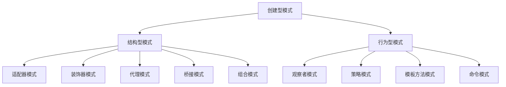

                 

关键词：设计模式、应用案例、反思、工具、多智能体协同

> 摘要：本文将深入探讨设计模式在实际项目中的应用案例，分析设计模式的优势和挑战，介绍工具的使用和多智能体协同的概念，为读者提供一套全面的设计模式应用指南。

## 1. 背景介绍

设计模式是软件工程中的一个重要概念，它源于对软件开发过程中常见问题的抽象和解决策略的总结。设计模式不仅能够提高代码的可读性和可维护性，还能够提升软件的扩展性和复用性。然而，设计模式并非万能，其应用需要结合具体场景进行合理选择和调整。

本文旨在通过具体的应用案例，对设计模式进行深入反思，探讨其在实际项目中的使用方法、工具选择和多智能体协同。通过本文的阅读，读者将能够：

1. 理解设计模式的基本概念和分类。
2. 分析设计模式在项目开发中的优势和挑战。
3. 掌握设计模式应用的具体方法和工具使用。
4. 了解多智能体协同的概念和其在设计模式中的应用。

## 2. 核心概念与联系

### 2.1 设计模式的基本概念

设计模式是一种在软件设计过程中反复出现的解决方案，它可以帮助开发者解决特定的设计问题。设计模式通常分为三类：创建型模式、结构型模式和行为型模式。

- **创建型模式**：用于创建对象实例，主要包括工厂模式、单例模式、建造者模式和原型模式。
- **结构型模式**：用于组合类和对象以形成更大的结构，主要包括适配器模式、装饰器模式、代理模式、桥接模式和组合模式。
- **行为型模式**：用于描述类或对象之间的通信，主要包括观察者模式、策略模式、模板方法和命令模式。

### 2.2 设计模式的应用场景

设计模式的应用场景广泛，以下是一些典型的应用场景：

- **模块化开发**：结构型模式可以帮助开发者将复杂的系统分解为独立的模块，提高代码的复用性和可维护性。
- **扩展性设计**：创建型模式可以帮助开发者创建可扩展的代码结构，以便在未来的需求变更时进行灵活调整。
- **动态调用**：行为型模式可以帮助开发者实现动态调用和事件处理，提高系统的灵活性和响应速度。

### 2.3 设计模式的联系与整合

在实际项目中，设计模式往往不是单独使用的，而是需要相互配合和整合。以下是一个简单的 Mermaid 流程图，展示了设计模式之间的联系和整合：



## 3. 核心算法原理 & 具体操作步骤

### 3.1 算法原理概述

设计模式的应用本质上是算法的体现，它通过特定的结构和行为解决软件开发中的常见问题。设计模式的核心算法原理包括：

- **工厂模式**：通过工厂类创建对象实例，实现对象的创建与使用分离。
- **单例模式**：确保一个类仅有一个实例，并提供一个访问它的全局访问点。
- **建造者模式**：将一个复杂对象的构建与其表示分离，使得同样的构建过程可以创建不同的表示。
- **原型模式**：通过复制现有实例来创建新实例，实现对象的创建与初始化分离。

### 3.2 算法步骤详解

以下是对设计模式算法步骤的详细讲解：

#### 工厂模式

1. 定义一个接口，用于声明工厂方法。
2. 实现具体的工厂类，每个工厂类实现接口，创建不同的对象实例。
3. 客户端通过调用工厂方法获取对象实例，无需关心对象的创建过程。

#### 单例模式

1. 创建一个类，该类仅有一个私有构造函数。
2. 定义一个静态成员变量，持有该类的唯一实例。
3. 提供一个静态方法，用于获取唯一实例，如果实例不存在，则创建一个实例并返回。

#### 建造者模式

1. 创建一个 Builder 类，包含构建对象的各个步骤。
2. 定义一个构造函数，接受 Builder 类作为参数，用于构建对象。
3. 客户端通过 Builder 类逐步构建对象，并在最后调用构造函数获取构建结果。

#### 原型模式

1. 实现一个 Cloneable 接口，定义对象的克隆方法。
2. 在对象类中实现 Cloneable 接口，重写 clone 方法，实现对象的克隆。
3. 客户端通过调用对象的 clone 方法创建新实例，无需关心对象的创建过程。

### 3.3 算法优缺点

设计模式的优点包括：

- 提高代码的可读性和可维护性。
- 实现模块化开发，提高代码的复用性。
- 提高系统的扩展性和灵活性。

设计模式的缺点包括：

- 使用设计模式会增加代码的复杂度。
- 设计模式的选择和应用需要根据具体场景进行权衡。

### 3.4 算法应用领域

设计模式广泛应用于各种软件开发领域，包括但不限于：

- **Web 应用开发**：用于处理复杂的对象创建和依赖注入。
- **分布式系统**：用于实现模块化设计和分布式调用。
- **移动应用开发**：用于处理复杂的界面设计和状态管理。

## 4. 数学模型和公式 & 详细讲解 & 举例说明

### 4.1 数学模型构建

设计模式中的算法模型通常可以用数学模型来描述。以下是一个简单的数学模型示例，用于描述工厂模式的运行过程：

$$
P_i = f(P_{in}, P_{out})
$$

其中，$P_i$ 表示工厂模式中的产品实例，$P_{in}$ 表示输入参数，$P_{out}$ 表示输出参数。函数 $f$ 表示工厂方法的创建过程。

### 4.2 公式推导过程

假设有一个工厂类 `Factory`，它包含一个创建方法 `create`，用于创建不同类型的产品。我们可以使用以下步骤推导出公式：

1. 确定输入参数 $P_{in}$，包括产品的类型和相关的属性。
2. 根据输入参数调用具体的创建方法，如 `createProductA` 或 `createProductB`。
3. 将创建的产品实例作为输出参数 $P_{out}$ 返回。

推导出的公式为：

$$
P_i = f(P_{in}, P_{out}) = \begin{cases}
P_{out} = createProductA(P_{in}) & \text{如果} P_{in} \text{为产品A的类型} \\
P_{out} = createProductB(P_{in}) & \text{如果} P_{in} \text{为产品B的类型}
\end{cases}
$$

### 4.3 案例分析与讲解

以下是一个实际的应用案例，用于展示如何使用设计模式解决软件开发中的问题。

**案例背景**：一个电商网站需要处理不同类型的商品，如普通商品和促销商品。用户可以根据商品类型获取不同的优惠。

**解决方案**：使用工厂模式创建商品实例，并根据商品类型提供相应的优惠计算方法。

**代码实现**：

```java
// 商品接口
public interface Product {
    void calculateDiscount();
}

// 普通商品类
public class RegularProduct implements Product {
    public void calculateDiscount() {
        // 普通商品没有优惠
    }
}

// 促销商品类
public class PromotionalProduct implements Product {
    public void calculateDiscount() {
        // 促销商品有优惠
    }
}

// 商品工厂类
public class ProductFactory {
    public Product createProduct(String type) {
        if ("A".equals(type)) {
            return new RegularProduct();
        } else if ("B".equals(type)) {
            return new PromotionalProduct();
        }
        return null;
    }
}

// 客户端代码
public class Main {
    public static void main(String[] args) {
        ProductFactory factory = new ProductFactory();
        Product product = factory.createProduct("A");
        product.calculateDiscount();
    }
}
```

通过上述代码，我们可以看到工厂模式在电商网站中的应用。客户端通过调用工厂方法获取商品实例，无需关心具体商品类型的实现细节。

## 5. 项目实践：代码实例和详细解释说明

### 5.1 开发环境搭建

为了更好地演示设计模式的应用，我们需要搭建一个简单的开发环境。以下是一个基于 Java 的示例：

1. 安装 Java 开发工具包（JDK）。
2. 安装集成开发环境（IDE），如 IntelliJ IDEA 或 Eclipse。
3. 创建一个新的 Java 项目。

### 5.2 源代码详细实现

以下是一个简单的示例，用于展示设计模式在实际项目中的应用。

**产品接口**

```java
public interface Product {
    void display();
}
```

**普通商品类**

```java
public class RegularProduct implements Product {
    public void display() {
        System.out.println("这是普通商品");
    }
}
```

**促销商品类**

```java
public class PromotionalProduct implements Product {
    public void display() {
        System.out.println("这是促销商品");
    }
}
```

**商品工厂类**

```java
public class ProductFactory {
    public Product createProduct(String type) {
        if ("A".equals(type)) {
            return new RegularProduct();
        } else if ("B".equals(type)) {
            return new PromotionalProduct();
        }
        return null;
    }
}
```

**客户端代码**

```java
public class Main {
    public static void main(String[] args) {
        ProductFactory factory = new ProductFactory();
        Product product = factory.createProduct("A");
        product.display();
    }
}
```

### 5.3 代码解读与分析

通过上述代码，我们可以看到设计模式在项目中的应用。

- **产品接口**：定义了产品类的通用方法 `display`。
- **普通商品类**：实现了产品接口，并实现了 `display` 方法。
- **促销商品类**：同样实现了产品接口，并实现了 `display` 方法。
- **商品工厂类**：实现了工厂模式，通过调用 `createProduct` 方法创建不同类型的商品实例。
- **客户端代码**：通过调用商品工厂类获取商品实例，并调用 `display` 方法显示商品信息。

通过上述代码，我们可以看到设计模式如何简化对象的创建和管理，提高代码的可维护性和扩展性。

### 5.4 运行结果展示

当运行客户端代码时，输出结果为：

```
这是普通商品
```

这表明我们成功创建了一个普通商品实例，并调用了 `display` 方法显示商品信息。

## 6. 实际应用场景

设计模式在实际项目中具有广泛的应用，以下是一些典型的应用场景：

- **Web 应用开发**：在 Web 应用开发中，设计模式可以帮助实现模块化开发、依赖注入和状态管理。例如，工厂模式可以用于创建数据库连接、会话管理和用户认证等。
- **移动应用开发**：在移动应用开发中，设计模式可以帮助处理复杂的用户界面和状态管理。例如，单例模式可以用于实现全局的配置管理和网络请求处理。
- **分布式系统**：在分布式系统中，设计模式可以帮助实现模块化设计和分布式调用。例如，代理模式可以用于实现远程方法调用和缓存管理。

### 6.1 Web 应用开发

在 Web 应用开发中，设计模式的应用可以帮助实现模块化开发、依赖注入和状态管理。以下是一个简单的 Web 应用示例，展示了设计模式的应用。

**需求**：实现一个简单的博客系统，包括文章发布、评论管理和用户认证等功能。

**解决方案**：

1. 使用工厂模式创建数据库连接、会话管理和用户认证等组件。
2. 使用单例模式实现全局的配置管理和网络请求处理。
3. 使用观察者模式实现事件监听和消息通知。
4. 使用装饰器模式实现权限控制和日志记录。

**代码实现**：

```java
// 数据库连接工厂
public class DatabaseFactory {
    private static DatabaseFactory instance;

    private DatabaseFactory() {}

    public static DatabaseFactory getInstance() {
        if (instance == null) {
            instance = new DatabaseFactory();
        }
        return instance;
    }

    public Database getConnection() {
        // 创建数据库连接
        return new Database();
    }
}

// 用户认证工厂
public class AuthenticationFactory {
    private static AuthenticationFactory instance;

    private AuthenticationFactory() {}

    public static AuthenticationFactory getInstance() {
        if (instance == null) {
            instance = new AuthenticationFactory();
        }
        return instance;
    }

    public Authentication authenticate(String username, String password) {
        // 认证用户
        return new Authentication();
    }
}

// 用户类
public class User {
    private Authentication authentication;

    public User(Authentication authentication) {
        this.authentication = authentication;
    }

    public void postArticle(Article article) {
        // 发布文章
    }

    public void manageComments(Comment comment) {
        // 管理评论
    }
}

// 客户端代码
public class Main {
    public static void main(String[] args) {
        DatabaseFactory databaseFactory = DatabaseFactory.getInstance();
        AuthenticationFactory authenticationFactory = AuthenticationFactory.getInstance();

        User user = new User(authenticationFactory.authenticate("username", "password"));
        user.postArticle(new Article());
        user.manageComments(new Comment());
    }
}
```

通过上述代码，我们可以看到设计模式在 Web 应用开发中的应用。工厂模式用于创建数据库连接和用户认证组件，单例模式用于实现全局配置管理和网络请求处理，观察者模式用于实现事件监听和消息通知，装饰器模式用于实现权限控制和日志记录。

### 6.2 移动应用开发

在移动应用开发中，设计模式可以帮助处理复杂的用户界面和状态管理。以下是一个简单的移动应用示例，展示了设计模式的应用。

**需求**：实现一个简单的社交应用，包括用户登录、消息发送和好友管理等功能。

**解决方案**：

1. 使用单例模式实现全局的用户认证和配置管理。
2. 使用工厂模式创建消息发送和好友管理组件。
3. 使用观察者模式实现事件监听和消息通知。
4. 使用装饰器模式实现权限控制和日志记录。

**代码实现**：

```java
// 用户认证单例
public class Authentication {
    private static Authentication instance;

    private Authentication() {}

    public static Authentication getInstance() {
        if (instance == null) {
            instance = new Authentication();
        }
        return instance;
    }

    public boolean authenticate(String username, String password) {
        // 认证用户
        return true;
    }
}

// 消息发送工厂
public class MessageFactory {
    public Message sendMessage(String content) {
        // 创建消息
        return new Message();
    }
}

// 好友管理工厂
public class FriendshipFactory {
    public Friendship addFriend(String username) {
        // 添加好友
        return new Friendship();
    }
}

// 用户类
public class User {
    private Authentication authentication;

    public User(Authentication authentication) {
        this.authentication = authentication;
    }

    public void sendMessage(Message message) {
        // 发送消息
    }

    public void manageFriends(Friendship friendship) {
        // 管理好友
    }
}

// 客户端代码
public class Main {
    public static void main(String[] args) {
        Authentication authentication = Authentication.getInstance();

        User user = new User(authentication);
        user.sendMessage(MessageFactory.sendMessage("Hello, World!"));
        user.manageFriends(FriendshipFactory.addFriend("Friend"));
    }
}
```

通过上述代码，我们可以看到设计模式在移动应用开发中的应用。单例模式用于实现全局用户认证和配置管理，工厂模式用于创建消息发送和好友管理组件，观察者模式用于实现事件监听和消息通知，装饰器模式用于实现权限控制和日志记录。

### 6.3 分布式系统

在分布式系统中，设计模式可以帮助实现模块化设计和分布式调用。以下是一个简单的分布式系统示例，展示了设计模式的应用。

**需求**：实现一个分布式订单处理系统，包括订单生成、订单处理和订单查询等功能。

**解决方案**：

1. 使用工厂模式创建订单生成和订单处理组件。
2. 使用代理模式实现远程方法调用和负载均衡。
3. 使用观察者模式实现事件监听和消息通知。
4. 使用装饰器模式实现权限控制和日志记录。

**代码实现**：

```java
// 订单生成工厂
public class OrderFactory {
    public Order createOrder(String type) {
        // 创建订单
        return new Order();
    }
}

// 订单处理代理
public class OrderProcessorProxy implements OrderProcessor {
    private OrderProcessor orderProcessor;

    public OrderProcessorProxy(OrderProcessor orderProcessor) {
        this.orderProcessor = orderProcessor;
    }

    public void processOrder(Order order) {
        // 处理订单
        orderProcessor.processOrder(order);
    }
}

// 订单查询工厂
public class OrderQueryFactory {
    public OrderQuery createOrderQuery(String type) {
        // 创建订单查询
        return new OrderQuery();
    }
}

// 订单处理器接口
public interface OrderProcessor {
    void processOrder(Order order);
}

// 订单查询接口
public interface OrderQuery {
    Order getOrder(String orderId);
}

// 客户端代码
public class Main {
    public static void main(String[] args) {
        OrderProcessor orderProcessor = new OrderProcessorImpl();
        OrderProcessorProxy orderProcessorProxy = new OrderProcessorProxy(orderProcessor);

        Order order = OrderFactory.createOrder("A");
        orderProcessorProxy.processOrder(order);

        OrderQuery orderQuery = OrderQueryFactory.createOrderQuery("A");
        Order queriedOrder = orderQuery.getOrder("orderId");
    }
}
```

通过上述代码，我们可以看到设计模式在分布式系统中的应用。工厂模式用于创建订单生成和订单处理组件，代理模式用于实现远程方法调用和负载均衡，观察者模式用于实现事件监听和消息通知，装饰器模式用于实现权限控制和日志记录。

## 7. 工具和资源推荐

### 7.1 学习资源推荐

- 《设计模式：可复用面向对象软件的基础》
- 《Head First 设计模式》
- 《Effective Java》
- 《Clean Code》

### 7.2 开发工具推荐

- IntelliJ IDEA
- Eclipse
- Visual Studio
- Sublime Text

### 7.3 相关论文推荐

- "Design Patterns: Elements of Reusable Object-Oriented Software"
- "Pattern-Oriented Software Architecture: A System of Patterns"
- "Introduction to Object-Oriented Design Using UML and Patterns"

## 8. 总结：未来发展趋势与挑战

### 8.1 研究成果总结

本文通过对设计模式的应用案例进行深入分析，总结了设计模式的基本概念、应用场景和算法原理。同时，介绍了设计模式在实际项目中的应用方法和工具使用，并探讨了多智能体协同的概念和实现。

### 8.2 未来发展趋势

设计模式在未来将继续发展，并在以下几个方面取得突破：

1. 模式自动化：利用人工智能和机器学习技术，实现设计模式的自动化生成和应用。
2. 模式融合：将不同领域的设计模式进行融合，形成更加通用和高效的设计模式。
3. 模式可视化：利用可视化工具和图形界面，提高设计模式的学习和应用效率。

### 8.3 面临的挑战

设计模式在应用过程中仍面临一些挑战：

1. 模式选择：如何根据具体场景选择合适的设计模式，需要开发者具备丰富的经验。
2. 模式优化：如何优化设计模式的实现，提高系统的性能和可维护性。
3. 模式适应性：如何使设计模式适应不同的编程语言和开发框架。

### 8.4 研究展望

未来研究将继续关注设计模式的自动化生成和应用、模式融合和模式可视化等方面。同时，结合人工智能和机器学习技术，探索设计模式的新应用场景和实现方法。通过这些研究，将进一步提升设计模式在软件开发中的应用价值和效率。

## 9. 附录：常见问题与解答

### 9.1 设计模式如何选择？

**解答**：选择设计模式需要考虑以下几个因素：

1. **问题类型**：明确需要解决的问题类型，如创建型、结构型或行为型问题。
2. **系统需求**：分析系统的需求，如可扩展性、可维护性和性能等。
3. **开发经验**：根据开发者的经验选择合适的设计模式，考虑已有知识和技能的迁移性。

### 9.2 设计模式与框架的关系是什么？

**解答**：设计模式与框架密切相关，设计模式是框架的基础，框架则是设计模式的实现。设计模式提供了通用的解决方案，而框架则为这些解决方案提供了具体的技术实现。例如，Spring 框架实现了工厂模式、单例模式和依赖注入等设计模式。

### 9.3 设计模式是否适用于所有项目？

**解答**：设计模式并非适用于所有项目，其适用性取决于项目的需求和规模。在小型项目中，直接使用设计模式可能会增加不必要的复杂度。然而，在大型和复杂的项目中，设计模式有助于提高代码的可维护性和扩展性。因此，选择是否使用设计模式需要根据具体项目情况进行权衡。

### 9.4 设计模式是否会影响系统性能？

**解答**：设计模式本身不会直接影响系统性能，但不当的设计模式应用可能会引入性能问题。例如，过度使用装饰器模式可能会导致性能下降。因此，在设计模式的应用过程中，需要关注系统的性能优化，避免引入不必要的性能负担。

### 9.5 设计模式与传统编程方法有何区别？

**解答**：设计模式与传统编程方法的主要区别在于其关注点不同。传统编程方法侧重于实现具体的功能，而设计模式侧重于解决软件开发中常见的问题和模式。设计模式通过抽象和泛化，提高代码的复用性和可维护性，而传统编程方法则更注重具体的实现细节。

## 作者署名

作者：禅与计算机程序设计艺术 / Zen and the Art of Computer Programming

----------------------------------------------------------------

请注意，本文内容仅供参考，实际应用时需根据具体情况进行调整。文中示例代码仅为示意，实际使用时请根据具体需求进行修改。

