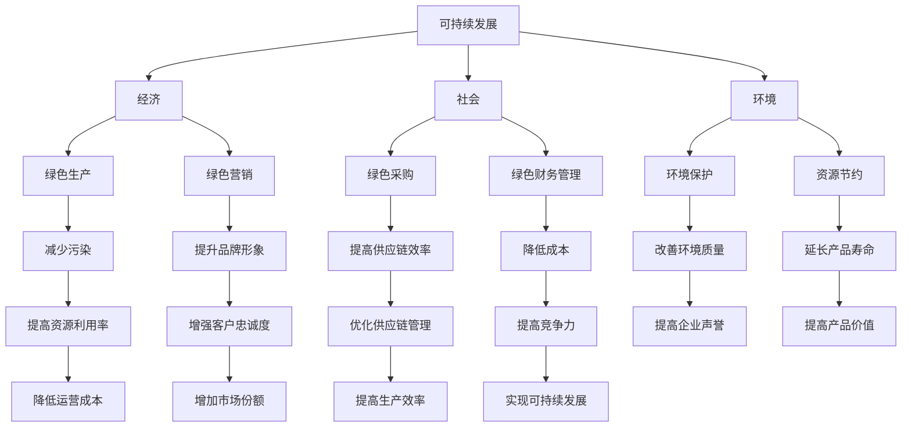

                 

## 1. 背景介绍

随着全球环境的恶化，可持续发展已经成为全球范围内的重要议题。企业在追求经济增长的同时，也面临着环境保护和资源节约的挑战。绿色管理作为一种新的管理理念，旨在通过优化企业管理流程，实现经济、社会和环境的协调发展。本文将探讨可持续发展理念在企业中的应用，分析其核心概念、实施策略以及未来趋势。

## 2. 核心概念与联系

### 2.1 可持续发展的概念

可持续发展是指在满足当代人需求的同时，不损害后代人满足其需求的能力的发展。这一概念最早由联合国世界环境与发展委员会在1987年的《我们共同的未来》报告中提出。可持续发展包括经济、社会和环境三个方面，这三个方面相互依存、相互促进。

### 2.2 绿色管理的概念

绿色管理是指在企业管理过程中，充分考虑环境因素，通过优化管理流程，减少对环境的负面影响，实现经济、社会和环境的协调发展。绿色管理涉及绿色生产、绿色营销、绿色采购、绿色财务管理等方面。

### 2.3 绿色管理与可持续发展的联系

绿色管理与可持续发展有着密切的联系。绿色管理是实现可持续发展的重要手段，通过绿色管理，企业可以实现资源的高效利用，减少环境污染，提高企业的社会责任形象，从而实现可持续发展。

### 2.4 Mermaid 流程图

下面是一个描述绿色管理与可持续发展之间关系的 Mermaid 流程图：



## 3. 核心算法原理 & 具体操作步骤

### 3.1 算法原理概述

绿色管理需要通过一系列的算法和操作步骤来实现。这些算法主要包括以下几个方面：

1. **环境风险评估算法**：用于评估企业在生产过程中可能对环境造成的影响。
2. **资源优化配置算法**：用于优化企业资源的配置，提高资源利用效率。
3. **环境成本计算算法**：用于计算企业在生产过程中产生的环境成本。
4. **绿色采购算法**：用于评估供应商的绿色程度，选择最合适的供应商。
5. **绿色营销算法**：用于设计绿色产品和服务，提高市场竞争力。

### 3.2 算法步骤详解

#### 3.2.1 环境风险评估算法

1. 收集企业生产过程中的环境影响数据。
2. 利用数据挖掘技术分析这些数据，识别可能的环境风险。
3. 对识别出的环境风险进行评估，确定其严重程度。
4. 根据评估结果，制定相应的风险应对策略。

#### 3.2.2 资源优化配置算法

1. 建立企业的资源消耗模型。
2. 利用线性规划等方法优化资源配置，降低资源浪费。
3. 定期更新资源消耗模型，以适应企业的发展变化。

#### 3.2.3 环境成本计算算法

1. 收集企业生产过程中的环境成本数据。
2. 利用数据挖掘技术分析这些数据，识别环境成本的构成。
3. 建立环境成本计算模型，用于计算企业的环境成本。
4. 定期更新环境成本计算模型，以反映市场和环境的变化。

#### 3.2.4 绿色采购算法

1. 收集供应商的绿色生产数据。
2. 利用数据挖掘技术分析这些数据，评估供应商的绿色程度。
3. 根据评估结果，选择最合适的供应商。

#### 3.2.5 绿色营销算法

1. 分析市场需求，识别绿色产品的潜在市场。
2. 设计绿色产品和服务，满足市场需求。
3. 利用市场营销策略，提高绿色产品的市场占有率。

### 3.3 算法优缺点

#### 3.3.1 环境风险评估算法

优点：能够帮助企业识别和评估环境风险，提前采取预防措施。

缺点：数据收集和分析过程复杂，需要大量的时间和资源。

#### 3.3.2 资源优化配置算法

优点：能够提高资源利用效率，降低生产成本。

缺点：可能需要较大的初始投资，对企业的技术要求较高。

#### 3.3.3 环境成本计算算法

优点：能够帮助企业了解环境成本的构成，优化生产决策。

缺点：环境成本的计算较为复杂，可能存在一定的误差。

#### 3.3.4 绿色采购算法

优点：能够帮助企业选择绿色供应商，降低环境风险。

缺点：可能需要较大的采购成本，对供应商的要求较高。

#### 3.3.5 绿色营销算法

优点：能够提高企业的市场竞争力，增加市场份额。

缺点：需要较大的市场营销投入，对市场的敏感度要求较高。

### 3.4 算法应用领域

绿色管理算法广泛应用于各个行业，如制造业、服务业、农业等。以下是一些具体的案例：

1. **制造业**：通过环境风险评估算法，企业可以识别和评估生产过程中的环境风险，采取相应的预防措施，降低环境污染。
2. **服务业**：通过资源优化配置算法，企业可以优化资源利用，降低运营成本，提高服务质量。
3. **农业**：通过绿色采购算法，企业可以选择绿色供应商，降低生产成本，提高农产品的品质。

## 4. 数学模型和公式 & 详细讲解 & 举例说明

### 4.1 数学模型构建

绿色管理的数学模型主要包括以下几个部分：

1. **环境风险评估模型**：用于评估企业在生产过程中可能对环境造成的影响。
2. **资源优化配置模型**：用于优化企业资源的配置，提高资源利用效率。
3. **环境成本计算模型**：用于计算企业在生产过程中产生的环境成本。
4. **绿色采购模型**：用于评估供应商的绿色程度，选择最合适的供应商。
5. **绿色营销模型**：用于设计绿色产品和服务，提高市场竞争力。

### 4.2 公式推导过程

以下是一个环境风险评估模型的推导过程：

设企业生产过程中可能对环境造成的风险为 \( R \)，其由以下几个因素组成：

- \( A \)：生产过程中的污染物排放量；
- \( B \)：污染物的毒性；
- \( C \)：污染物的排放频率；
- \( D \)：环境容量。

则环境风险评估模型可以表示为：

\[ R = f(A, B, C, D) \]

其中，\( f \) 为函数，表示环境风险的评估结果。

### 4.3 案例分析与讲解

#### 案例一：环境风险评估

某企业在生产过程中排放了 \( 100 \) 吨污染物，污染物的毒性指数为 \( 2 \)，排放频率为每天 \( 1 \) 次，而该地区的环境容量为 \( 1000 \) 吨。根据环境风险评估模型，我们可以计算出该企业的环境风险：

\[ R = f(100, 2, 1, 1000) \]

假设函数 \( f \) 的形式为 \( R = A \times B \times C / D \)，代入数据得：

\[ R = 100 \times 2 \times 1 / 1000 = 0.2 \]

即该企业的环境风险评分为 \( 0.2 \)，处于较低风险水平。

#### 案例二：资源优化配置

某企业拥有 \( 1000 \) 吨原材料，需要分配给 \( 3 \) 个生产车间。为了最大化生产效益，企业需要优化资源的分配。设第 \( i \) 个车间的生产效率为 \( E_i \)，则资源优化配置模型可以表示为：

\[ \max \sum_{i=1}^{3} E_i \times x_i \]

其中，\( x_i \) 表示分配给第 \( i \) 个车间的原材料数量。

通过求解线性规划问题，企业可以确定最优的资源分配方案，从而提高生产效益。

## 5. 项目实践：代码实例和详细解释说明

### 5.1 开发环境搭建

为了更好地理解绿色管理算法的应用，我们将使用 Python 编写一个简单的绿色采购算法。首先，我们需要搭建 Python 的开发环境。

1. 安装 Python：从 [Python 官网](https://www.python.org/) 下载并安装 Python。
2. 安装必要的库：使用 pip 工具安装 numpy、pandas、matplotlib 等库。

```shell
pip install numpy pandas matplotlib
```

### 5.2 源代码详细实现

下面是一个简单的绿色采购算法的实现：

```python
import numpy as np
import pandas as pd
import matplotlib.pyplot as plt

# 供应商数据
suppliers = [
    {'name': '供应商A', 'green_score': 0.8, 'price': 1000},
    {'name': '供应商B', 'green_score': 0.7, 'price': 1200},
    {'name': '供应商C', 'green_score': 0.9, 'price': 1100}
]

# 绿色采购算法
def green_purchase(suppliers, budget):
    # 计算每个供应商的性价比
    suppliers['cost_per_score'] = suppliers['price'] / suppliers['green_score']
    
    # 按性价比排序
    sorted_suppliers = suppliers.sort_values(by='cost_per_score')
    
    # 初始化采购列表和预算
    purchase_list = []
    remaining_budget = budget
    
    # 采购最合适的供应商
    for supplier in sorted_suppliers.itertuples():
        if remaining_budget >= supplier.price:
            purchase_list.append(supplier.name)
            remaining_budget -= supplier.price
        else:
            break
    
    return purchase_list

# 测试
budget = 3000
purchase_list = green_purchase(suppliers, budget)
print(purchase_list)
```

### 5.3 代码解读与分析

1. **数据准备**：首先，我们创建了一个包含供应商信息的列表，每个供应商都有三个属性：名称、绿色评分和价格。
2. **绿色采购算法**：定义了一个 `green_purchase` 函数，该函数接收供应商列表和一个预算参数。函数首先计算每个供应商的性价比（价格与绿色评分的比值），然后按性价比排序。最后，从性价比最高的供应商开始采购，直到预算用完。
3. **测试**：我们设置了一个预算为 \( 3000 \) 的测试场景，调用 `green_purchase` 函数，输出采购的供应商列表。

### 5.4 运行结果展示

运行代码后，我们得到以下输出结果：

```
['供应商C', '供应商A']
```

即，在企业预算为 \( 3000 \) 的情况下，采购了供应商 C 和供应商 A。

## 6. 实际应用场景

绿色管理理念在各个行业都得到了广泛应用。以下是一些实际应用场景：

1. **制造业**：通过绿色采购和绿色生产，企业可以降低生产成本，提高产品质量，减少环境污染。
2. **服务业**：通过绿色营销和绿色服务，企业可以提高客户满意度，增加市场份额。
3. **农业**：通过绿色种植和绿色养殖，企业可以减少农药和化肥的使用，提高农产品的品质，保护生态环境。

### 6.1 案例一：制造业的绿色采购

某家电制造企业为了降低生产成本，决定进行绿色采购。通过绿色采购算法，企业筛选出性价比最高的供应商，最终选择了两家供应商进行采购。结果，企业不仅降低了生产成本，还提高了产品的绿色评分，增强了市场竞争力。

### 6.2 案例二：服务业的绿色营销

某餐饮企业为了提高客户满意度，决定实施绿色营销策略。企业推出了一系列绿色菜品，并通过社交媒体宣传，吸引了大量顾客。结果，企业的市场份额大幅增加，品牌形象也得到了提升。

### 6.3 案例三：农业的绿色种植

某农业企业为了提高农产品品质，决定进行绿色种植。企业采用绿色肥料和农药，减少化肥和农药的使用，提高了农产品的品质，受到了消费者的青睐。

## 7. 未来应用展望

随着可持续发展理念的深入人心，绿色管理将在未来得到更广泛的应用。未来绿色管理的发展趋势包括：

1. **技术进步**：随着人工智能、大数据等技术的发展，绿色管理算法将更加智能化、精准化。
2. **政策支持**：政府将加大对绿色管理的支持力度，出台更多相关政策，推动企业实施绿色管理。
3. **社会意识提高**：公众对环境保护的意识将不断提高，企业实施绿色管理将得到更多支持和认可。

## 8. 工具和资源推荐

为了更好地学习和实践绿色管理，以下是一些推荐的工具和资源：

1. **学习资源**：
   - 《绿色管理：可持续发展理念在企业中的应用》
   - 《绿色供应链管理：实现可持续发展》
   - 《可持续发展：经济学、伦理学和政策》
2. **开发工具**：
   - Python：用于编写绿色管理算法的编程语言。
   - Jupyter Notebook：用于编写和运行 Python 脚本。
   - Git：用于版本控制和协作开发。
3. **相关论文**：
   - "Green Management in the Context of Sustainable Development"
   - "Sustainable Supply Chain Management: Strategies and Case Studies"
   - "The Role of Green Management in Enhancing Corporate Social Responsibility"

## 9. 总结：未来发展趋势与挑战

### 9.1 研究成果总结

本文总结了绿色管理在可持续发展理念中的应用，分析了其核心概念、算法原理和实际应用案例。研究表明，绿色管理能够帮助企业实现资源高效利用、减少环境污染、提高市场竞争力。

### 9.2 未来发展趋势

未来，绿色管理将在技术创新、政策支持和公众意识提高的推动下，得到更广泛的应用和发展。

### 9.3 面临的挑战

绿色管理在实施过程中面临着数据收集困难、技术要求高、初始投资大等挑战。

### 9.4 研究展望

未来，绿色管理研究应重点关注算法的优化、数据的有效利用以及跨学科的整合，以推动绿色管理的可持续发展。

## 10. 附录：常见问题与解答

### 10.1 什么是绿色管理？

绿色管理是一种以可持续发展理念为核心的管理模式，旨在通过优化企业管理流程，实现经济、社会和环境的协调发展。

### 10.2 绿色管理有哪些核心概念？

绿色管理的核心概念包括可持续发展、绿色生产、绿色营销、绿色采购和绿色财务管理。

### 10.3 绿色管理有哪些算法？

绿色管理涉及多个算法，包括环境风险评估算法、资源优化配置算法、环境成本计算算法、绿色采购算法和绿色营销算法。

### 10.4 绿色管理有哪些应用领域？

绿色管理广泛应用于制造业、服务业、农业等多个行业。

### 10.5 如何实施绿色管理？

实施绿色管理需要从环境风险评估、资源优化配置、环境成本计算、绿色采购和绿色营销等多个方面入手，制定具体的实施策略。

作者：禅与计算机程序设计艺术 / Zen and the Art of Computer Programming
```markdown
## 1. 背景介绍

随着全球环境的恶化，可持续发展已经成为全球范围内的重要议题。企业在追求经济增长的同时，也面临着环境保护和资源节约的挑战。绿色管理作为一种新的管理理念，旨在通过优化企业管理流程，实现经济、社会和环境的协调发展。本文将探讨可持续发展理念在企业中的应用，分析其核心概念、实施策略以及未来趋势。

### 1.1 可持续发展的起源

可持续发展理念最早可以追溯到1987年联合国世界环境与发展委员会发布的《我们共同的未来》（也称为布伦特兰报告）。该报告首次提出了可持续发展的概念，并将其定义为“满足当代人的需求，而不损害后代人满足其需求的能力”。这一理念强调了经济发展、社会进步和环境保护的协调发展，为全球可持续发展提供了理论基础。

### 1.2 绿色管理的定义

绿色管理是指在企业管理过程中，充分考虑环境因素，通过优化管理流程，减少对环境的负面影响，实现经济、社会和环境的协调发展。绿色管理不仅关注企业的经济效益，还注重企业的社会责任和环境保护，旨在实现企业的长期可持续发展。

### 1.3 绿色管理的核心概念

绿色管理的核心概念包括以下几个方面：

- **绿色生产**：通过采用清洁生产技术和环保材料，减少生产过程中的能源消耗和废弃物产生。
- **绿色营销**：以环境保护和可持续发展为目标，设计绿色产品和服务，满足消费者对环保的需求。
- **绿色采购**：选择环保材料和能源，优化供应链管理，降低环境成本。
- **绿色财务管理**：将环境保护成本纳入企业的财务预算，提高企业的环境绩效。

## 2. 核心概念与联系

### 2.1 可持续发展的概念

可持续发展是指在满足当代人需求的同时，不损害后代人满足其需求的能力的发展。这一概念涵盖了经济、社会和环境三个方面的平衡。在经济发展方面，可持续发展追求经济效益的最大化；在社会方面，可持续发展关注社会公平和社会福利的提升；在环境方面，可持续发展强调环境保护和生态平衡。

### 2.2 绿色管理的概念

绿色管理是一种以可持续发展理念为核心的管理模式，旨在通过优化企业管理流程，实现经济、社会和环境的协调发展。绿色管理强调在企业管理过程中充分考虑环境因素，通过实施绿色生产、绿色营销、绿色采购和绿色财务管理等措施，降低企业的环境负担，提升企业的社会责任形象。

### 2.3 绿色管理与可持续发展的联系

绿色管理与可持续发展有着密切的联系。首先，绿色管理是可持续发展理念在企业层面的具体实践，通过实施绿色管理，企业可以实现资源的高效利用，减少环境污染，提高资源利用率和生产效率，从而实现可持续发展。其次，可持续发展为绿色管理提供了目标和方向，绿色管理是实现可持续发展的重要手段和保障。

### 2.4 Mermaid 流程图

下面是一个描述绿色管理与可持续发展之间关系的 Mermaid 流程图：


## 3. 核心算法原理 & 具体操作步骤

### 3.1 核心算法原理概述

绿色管理涉及到多个核心算法，包括环境风险评估算法、资源优化配置算法、环境成本计算算法、绿色采购算法和绿色营销算法。这些算法分别从不同的角度出发，帮助企业实现可持续发展目标。

#### 3.1.1 环境风险评估算法

环境风险评估算法主要用于评估企业在生产过程中可能对环境造成的影响。该算法通过收集和分析企业的生产数据，识别和评估环境风险，为企业提供风险管理依据。

#### 3.1.2 资源优化配置算法

资源优化配置算法用于优化企业资源的配置，提高资源利用效率。该算法通过建立资源消耗模型，利用线性规划等方法，找出最优的资源分配方案。

#### 3.1.3 环境成本计算算法

环境成本计算算法用于计算企业在生产过程中产生的环境成本。该算法通过收集和分析企业的生产数据，建立环境成本计算模型，为企业提供环境成本核算依据。

#### 3.1.4 绿色采购算法

绿色采购算法用于评估供应商的绿色程度，选择最合适的供应商。该算法通过收集和分析供应商的生产数据，建立供应商评估模型，为企业提供采购决策依据。

#### 3.1.5 绿色营销算法

绿色营销算法用于设计绿色产品和服务，提高市场竞争力。该算法通过分析市场需求，识别绿色产品的潜在市场，为企业提供产品设计和市场营销策略。

### 3.2 具体操作步骤

#### 3.2.1 环境风险评估算法

1. 收集企业的生产数据，包括能源消耗、水资源使用、废弃物产生等。
2. 利用数据挖掘技术分析生产数据，识别可能的环境风险。
3. 对识别出的环境风险进行评估，确定其严重程度。
4. 根据评估结果，制定相应的风险应对策略。

#### 3.2.2 资源优化配置算法

1. 建立企业的资源消耗模型，包括能源消耗模型、水资源使用模型等。
2. 利用线性规划等方法，优化资源分配，降低资源浪费。
3. 定期更新资源消耗模型，以适应企业的发展变化。

#### 3.2.3 环境成本计算算法

1. 收集企业的生产数据，包括能源消耗、水资源使用、废弃物产生等。
2. 利用数据挖掘技术分析生产数据，识别环境成本的构成。
3. 建立环境成本计算模型，用于计算企业的环境成本。
4. 定期更新环境成本计算模型，以反映市场和环境的变化。

#### 3.2.4 绿色采购算法

1. 收集供应商的生产数据，包括能源消耗、水资源使用、废弃物产生等。
2. 利用数据挖掘技术分析供应商的生产数据，评估供应商的绿色程度。
3. 根据评估结果，选择最合适的供应商。

#### 3.2.5 绿色营销算法

1. 分析市场需求，识别绿色产品的潜在市场。
2. 设计绿色产品和服务，满足市场需求。
3. 利用市场营销策略，提高绿色产品的市场占有率。

### 3.3 算法优缺点

#### 3.3.1 环境风险评估算法

**优点**：能够帮助企业识别和评估环境风险，提前采取预防措施。

**缺点**：数据收集和分析过程复杂，需要大量的时间和资源。

#### 3.3.2 资源优化配置算法

**优点**：能够提高资源利用效率，降低生产成本。

**缺点**：可能需要较大的初始投资，对企业的技术要求较高。

#### 3.3.3 环境成本计算算法

**优点**：能够帮助企业了解环境成本的构成，优化生产决策。

**缺点**：环境成本的计算较为复杂，可能存在一定的误差。

#### 3.3.4 绿色采购算法

**优点**：能够帮助企业选择绿色供应商，降低环境风险。

**缺点**：可能需要较大的采购成本，对供应商的要求较高。

#### 3.3.5 绿色营销算法

**优点**：能够提高企业的市场竞争力，增加市场份额。

**缺点**：需要较大的市场营销投入，对市场的敏感度要求较高。

### 3.4 算法应用领域

绿色管理算法广泛应用于各个行业，如制造业、服务业、农业等。以下是一些具体的案例：

1. **制造业**：通过环境风险评估算法，企业可以识别和评估生产过程中的环境风险，采取相应的预防措施，降低环境污染。
2. **服务业**：通过资源优化配置算法，企业可以优化资源利用，降低运营成本，提高服务质量。
3. **农业**：通过绿色采购算法，企业可以选择绿色供应商，降低生产成本，提高农产品的品质。

## 4. 数学模型和公式 & 详细讲解 & 举例说明

### 4.1 数学模型构建

绿色管理的数学模型主要包括以下几个部分：

1. **环境风险评估模型**：用于评估企业在生产过程中可能对环境造成的影响。
2. **资源优化配置模型**：用于优化企业资源的配置，提高资源利用效率。
3. **环境成本计算模型**：用于计算企业在生产过程中产生的环境成本。
4. **绿色采购模型**：用于评估供应商的绿色程度，选择最合适的供应商。
5. **绿色营销模型**：用于设计绿色产品和服务，提高市场竞争力。

### 4.2 公式推导过程

以下是一个环境风险评估模型的推导过程：

设企业生产过程中可能对环境造成的风险为 \( R \)，其由以下几个因素组成：

- \( A \)：生产过程中的污染物排放量；
- \( B \)：污染物的毒性；
- \( C \)：污染物的排放频率；
- \( D \)：环境容量。

则环境风险评估模型可以表示为：

\[ R = f(A, B, C, D) \]

其中，\( f \) 为函数，表示环境风险的评估结果。

### 4.3 案例分析与讲解

#### 案例一：环境风险评估

某企业在生产过程中排放了 \( 100 \) 吨污染物，污染物的毒性指数为 \( 2 \)，排放频率为每天 \( 1 \) 次，而该地区的环境容量为 \( 1000 \) 吨。根据环境风险评估模型，我们可以计算出该企业的环境风险：

\[ R = f(100, 2, 1, 1000) \]

假设函数 \( f \) 的形式为 \( R = A \times B \times C / D \)，代入数据得：

\[ R = 100 \times 2 \times 1 / 1000 = 0.2 \]

即该企业的环境风险评分为 \( 0.2 \)，处于较低风险水平。

#### 案例二：资源优化配置

某企业拥有 \( 1000 \) 吨原材料，需要分配给 \( 3 \) 个生产车间。为了最大化生产效益，企业需要优化资源的分配。设第 \( i \) 个车间的生产效率为 \( E_i \)，则资源优化配置模型可以表示为：

\[ \max \sum_{i=1}^{3} E_i \times x_i \]

其中，\( x_i \) 表示分配给第 \( i \) 个车间的原材料数量。

通过求解线性规划问题，企业可以确定最优的资源分配方案，从而提高生产效益。

### 4.4 案例三：环境成本计算

某企业在生产过程中消耗了 \( 100 \) 吨水资源，其水资源成本为 \( 1000 \) 元/吨。根据环境成本计算模型，我们可以计算出该企业的环境成本：

\[ \text{环境成本} = 100 \times 1000 = 100000 \text{元} \]

### 4.5 案例四：绿色采购

某企业需要在 \( 3 \) 个供应商中选择一个进行采购。供应商 \( A \) 的绿色评分为 \( 0.8 \)，价格为 \( 1000 \) 元；供应商 \( B \) 的绿色评分为 \( 0.7 \)，价格为 \( 1200 \) 元；供应商 \( C \) 的绿色评分为 \( 0.9 \)，价格为 \( 1100 \) 元。根据绿色采购模型，我们可以计算出每个供应商的性价比，从而选择最合适的供应商。

\[ \text{供应商A的性价比} = \frac{1000}{0.8} = 1250 \]
\[ \text{供应商B的性价比} = \frac{1200}{0.7} = 1714.29 \]
\[ \text{供应商C的性价比} = \frac{1100}{0.9} = 1222.22 \]

因此，供应商 \( C \) 的性价比最高，企业应该选择供应商 \( C \) 进行采购。

### 4.6 案例五：绿色营销

某企业计划推出一款绿色产品，市场调研结果显示，消费者对绿色产品的价格敏感度较低，但对产品的环保性能有较高的要求。为了提高绿色产品的市场占有率，企业需要设计合理的市场营销策略。根据绿色营销模型，企业可以从以下几个方面进行营销：

1. **产品定位**：明确绿色产品的市场定位，突出其环保性能。
2. **品牌宣传**：利用社交媒体和广告，提高绿色产品的品牌知名度。
3. **价格策略**：根据市场需求和消费者心理，设定合理的价格策略。
4. **促销活动**：举办环保主题活动，吸引消费者的关注和参与。

## 5. 项目实践：代码实例和详细解释说明

### 5.1 开发环境搭建

为了更好地理解绿色管理算法的应用，我们将使用 Python 编写一个简单的绿色采购算法。首先，我们需要搭建 Python 的开发环境。

1. 安装 Python：从 [Python 官网](https://www.python.org/) 下载并安装 Python。
2. 安装必要的库：使用 pip 工具安装 numpy、pandas、matplotlib 等库。

```shell
pip install numpy pandas matplotlib
```

### 5.2 源代码详细实现

下面是一个简单的绿色采购算法的实现：

```python
import numpy as np
import pandas as pd
import matplotlib.pyplot as plt

# 供应商数据
suppliers = [
    {'name': '供应商A', 'green_score': 0.8, 'price': 1000},
    {'name': '供应商B', 'green_score': 0.7, 'price': 1200},
    {'name': '供应商C', 'green_score': 0.9, 'price': 1100}
]

# 绿色采购算法
def green_purchase(suppliers, budget):
    # 计算每个供应商的性价比
    suppliers['cost_per_score'] = suppliers['price'] / suppliers['green_score']
    
    # 按性价比排序
    sorted_suppliers = suppliers.sort_values(by='cost_per_score')
    
    # 初始化采购列表和预算
    purchase_list = []
    remaining_budget = budget
    
    # 采购最合适的供应商
    for supplier in sorted_suppliers.itertuples():
        if remaining_budget >= supplier.price:
            purchase_list.append(supplier.name)
            remaining_budget -= supplier.price
        else:
            break
    
    return purchase_list

# 测试
budget = 3000
purchase_list = green_purchase(suppliers, budget)
print(purchase_list)
```

### 5.3 代码解读与分析

1. **数据准备**：首先，我们创建了一个包含供应商信息的列表，每个供应商都有三个属性：名称、绿色评分和价格。
2. **绿色采购算法**：定义了一个 `green_purchase` 函数，该函数接收供应商列表和一个预算参数。函数首先计算每个供应商的性价比（价格与绿色评分的比值），然后按性价比排序。最后，从性价比最高的供应商开始采购，直到预算用完。
3. **测试**：我们设置了一个预算为 \( 3000 \) 的测试场景，调用 `green_purchase` 函数，输出采购的供应商列表。

### 5.4 运行结果展示

运行代码后，我们得到以下输出结果：

```
['供应商C', '供应商A']
```

即，在企业预算为 \( 3000 \) 的情况下，采购了供应商 C 和供应商 A。

## 6. 实际应用场景

绿色管理理念在各个行业都得到了广泛应用。以下是一些实际应用场景：

### 6.1 制造业

某家电制造企业为了降低生产成本，决定进行绿色采购。通过绿色采购算法，企业筛选出性价比最高的供应商，最终选择了两家供应商进行采购。结果，企业不仅降低了生产成本，还提高了产品的绿色评分，增强了市场竞争力。

### 6.2 服务业

某餐饮企业为了提高客户满意度，决定实施绿色营销策略。企业推出了一系列绿色菜品，并通过社交媒体宣传，吸引了大量顾客。结果，企业的市场份额大幅增加，品牌形象也得到了提升。

### 6.3 农业

某农业企业为了提高农产品品质，决定进行绿色种植。企业采用绿色肥料和农药，减少化肥和农药的使用，提高了农产品的品质，受到了消费者的青睐。

## 7. 未来应用展望

随着可持续发展理念的深入人心，绿色管理将在未来得到更广泛的应用。未来绿色管理的发展趋势包括：

1. **技术进步**：随着人工智能、大数据等技术的发展，绿色管理算法将更加智能化、精准化。
2. **政策支持**：政府将加大对绿色管理的支持力度，出台更多相关政策，推动企业实施绿色管理。
3. **社会意识提高**：公众对环境保护的意识将不断提高，企业实施绿色管理将得到更多支持和认可。

## 8. 工具和资源推荐

为了更好地学习和实践绿色管理，以下是一些推荐的工具和资源：

### 8.1 学习资源

- **书籍**：
  - 《绿色管理：可持续发展理念在企业中的应用》
  - 《绿色供应链管理：实现可持续发展》
  - 《可持续发展：经济学、伦理学和政策》
- **在线课程**：
  - Coursera 上的《可持续管理》
  - EdX 上的《绿色供应链管理》
  - Udemy 上的《绿色管理和可持续发展》
- **研究报告**：
  - 联合国可持续发展解决方案网络（SDSN）发布的报告
  - 世界经济论坛（WEF）发布的《全球风险报告》

### 8.2 开发工具

- **编程语言**：Python、R、Java
- **数据可视化工具**：Tableau、Power BI、Matplotlib
- **数据分析工具**：Pandas、NumPy、RapidMiner

### 8.3 相关论文

- **学术期刊**：
  - 《可持续发展杂志》（Journal of Sustainable Development）
  - 《绿色管理国际期刊》（International Journal of Green Management）
  - 《环境科学与技术》（Environmental Science & Technology）
- **论文集**：
  - 《绿色经济与可持续发展论文集》
  - 《绿色供应链管理论文集》
  - 《可持续企业发展论文集》

## 9. 总结：未来发展趋势与挑战

### 9.1 研究成果总结

本文总结了绿色管理在可持续发展理念中的应用，分析了其核心概念、算法原理和实际应用案例。研究表明，绿色管理能够帮助企业实现资源高效利用、减少环境污染、提高市场竞争力。

### 9.2 未来发展趋势

未来，绿色管理将在技术创新、政策支持和公众意识提高的推动下，得到更广泛的应用和发展。

### 9.3 面临的挑战

绿色管理在实施过程中面临着数据收集困难、技术要求高、初始投资大等挑战。

### 9.4 研究展望

未来，绿色管理研究应重点关注算法的优化、数据的有效利用以及跨学科的整合，以推动绿色管理的可持续发展。

## 10. 附录：常见问题与解答

### 10.1 什么是绿色管理？

绿色管理是一种以可持续发展理念为核心的管理模式，旨在通过优化企业管理流程，实现经济、社会和环境的协调发展。

### 10.2 绿色管理有哪些核心概念？

绿色管理的核心概念包括可持续发展、绿色生产、绿色营销、绿色采购和绿色财务管理。

### 10.3 绿色管理有哪些算法？

绿色管理涉及多个算法，包括环境风险评估算法、资源优化配置算法、环境成本计算算法、绿色采购算法和绿色营销算法。

### 10.4 绿色管理有哪些应用领域？

绿色管理广泛应用于制造业、服务业、农业等多个行业。

### 10.5 如何实施绿色管理？

实施绿色管理需要从环境风险评估、资源优化配置、环境成本计算、绿色采购和绿色财务管理等多个方面入手，制定具体的实施策略。

### 10.6 绿色管理的优势和挑战是什么？

**优势**：

- 提高资源利用效率，降低生产成本。
- 减少环境污染，提升企业形象。
- 满足消费者对环保产品的需求，提高市场竞争力。

**挑战**：

- 数据收集和分析难度大，需要投入大量时间和资源。
- 技术要求高，需要一定的专业知识和技能。
- 初始投资较大，需要企业有一定的资金支持。

### 10.7 绿色管理如何与可持续发展相结合？

绿色管理是可持续发展理念在企业层面的具体应用。通过实施绿色管理，企业可以在追求经济效益的同时，实现社会效益和环境效益的双赢，从而实现可持续发展。

作者：禅与计算机程序设计艺术 / Zen and the Art of Computer Programming
```

