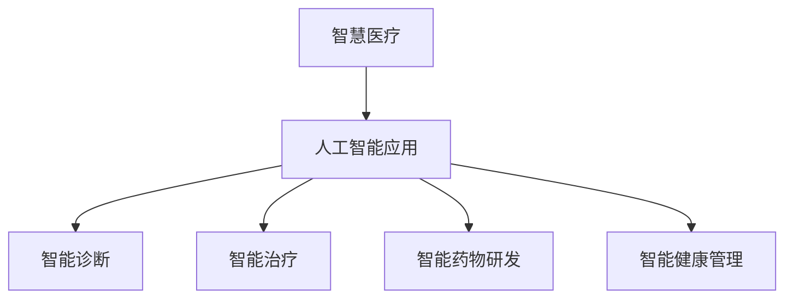

                 

关键词：网易，智慧医疗，面试真题，解答，社招

摘要：本文针对2024年网易智慧医疗社招面试中的常见问题进行汇总和解答，旨在帮助应聘者更好地准备面试，了解面试过程中的关键点，以及如何展示自己的技术能力和经验。

## 1. 背景介绍

随着人工智能、大数据、云计算等技术的快速发展，智慧医疗已成为医疗领域的重要趋势。网易作为我国知名的互联网科技公司，其智慧医疗业务涵盖了医疗信息化、健康管理、医疗服务等多个方面。2024年网易智慧医疗社招面试的题目也主要围绕这些领域展开，以下是对面试真题的汇总及解答。

## 2. 核心概念与联系

### 2.1 智慧医疗概述

智慧医疗是指利用人工智能、大数据、云计算等先进技术，提升医疗服务质量、效率和管理水平的一种新型医疗服务模式。

### 2.2 人工智能在智慧医疗中的应用

人工智能在智慧医疗中的应用主要包括：智能诊断、智能治疗、智能药物研发、智能健康管理等方面。

#### Mermaid 流程图(Mermaid 流程节点中不要有括号、逗号等特殊字符)



## 3. 核心算法原理 & 具体操作步骤

### 3.1 算法原理概述

智慧医疗中的核心算法主要涉及机器学习、深度学习、自然语言处理等领域。以下是对这些算法的简要概述：

### 3.2 算法步骤详解

#### 3.2.1 机器学习算法

1. 数据预处理：清洗、归一化、特征提取等。
2. 模型选择：根据问题性质选择合适的机器学习模型，如决策树、支持向量机、神经网络等。
3. 模型训练：使用训练数据进行模型训练。
4. 模型评估：使用验证集对模型进行评估。
5. 模型优化：根据评估结果对模型进行调整。

#### 3.2.2 深度学习算法

1. 数据预处理：与机器学习算法相同。
2. 网络架构设计：选择合适的深度学习网络结构，如卷积神经网络、循环神经网络等。
3. 模型训练：使用训练数据进行模型训练。
4. 模型评估：使用验证集对模型进行评估。
5. 模型优化：根据评估结果对模型进行调整。

#### 3.2.3 自然语言处理算法

1. 文本预处理：分词、去停用词、词性标注等。
2. 模型训练：使用预训练模型或自训练模型进行模型训练。
3. 模型评估：使用验证集对模型进行评估。
4. 模型优化：根据评估结果对模型进行调整。

### 3.3 算法优缺点

#### 3.3.1 机器学习算法

优点：适用范围广，算法成熟，计算效率较高。

缺点：对数据要求较高，模型可解释性较差。

#### 3.3.2 深度学习算法

优点：强大的特征提取能力，适用于大规模数据。

缺点：计算资源需求高，模型可解释性较差。

#### 3.3.3 自然语言处理算法

优点：能够处理文本数据，提取语义信息。

缺点：对文本数据预处理要求较高，计算资源需求较高。

### 3.4 算法应用领域

智慧医疗中的算法应用领域主要包括：

1. 疾病诊断：利用深度学习算法进行医学图像分析，辅助医生进行疾病诊断。
2. 治疗方案推荐：根据患者病情和历史病例数据，利用机器学习算法为医生提供治疗方案推荐。
3. 药物研发：利用自然语言处理算法挖掘文献中的潜在药物信息，加速药物研发过程。
4. 健康管理：利用人工智能技术对用户健康数据进行分析，为用户提供个性化的健康管理方案。

## 4. 数学模型和公式 & 详细讲解 & 举例说明

### 4.1 数学模型构建

在智慧医疗中，常见的数学模型包括线性回归、逻辑回归、支持向量机、神经网络等。以下以线性回归为例进行讲解：

#### 4.1.1 线性回归模型

线性回归模型是一种最简单的机器学习算法，用于拟合输入和输出之间的线性关系。其数学模型表示为：

$$
y = w_0 + w_1x_1 + w_2x_2 + \ldots + w_nx_n + \epsilon
$$

其中，$y$ 表示输出值，$x_1, x_2, \ldots, x_n$ 表示输入特征，$w_0, w_1, w_2, \ldots, w_n$ 表示权重，$\epsilon$ 表示误差。

#### 4.1.2 公式推导过程

线性回归模型的推导过程如下：

1. 假设输入特征 $x_1, x_2, \ldots, x_n$ 与输出值 $y$ 之间呈线性关系，即：

$$
y = w_0 + w_1x_1 + w_2x_2 + \ldots + w_nx_n + \epsilon
$$

2. 对上式两边同时取对数，得到：

$$
\ln y = \ln (w_0 + w_1x_1 + w_2x_2 + \ldots + w_nx_n + \epsilon)
$$

3. 利用对数的性质，将上式拆分为多个部分：

$$
\ln y = \ln w_0 + \ln (1 + \frac{w_1x_1}{w_0} + \frac{w_2x_2}{w_0} + \ldots + \frac{w_nx_n}{w_0}) + \ln (1 + \frac{\epsilon}{w_0})
$$

4. 由于 $w_0$ 是一个常数，可以将其移到等式左边：

$$
\ln y - \ln w_0 = \ln (1 + \frac{w_1x_1}{w_0} + \frac{w_2x_2}{w_0} + \ldots + \frac{w_nx_n}{w_0}) + \ln (1 + \frac{\epsilon}{w_0})
$$

5. 将等式两边同时减去 $\ln (1 + \frac{\epsilon}{w_0})$，得到：

$$
\ln y - \ln w_0 - \ln (1 + \frac{\epsilon}{w_0}) = \ln (1 + \frac{w_1x_1}{w_0} + \frac{w_2x_2}{w_0} + \ldots + \frac{w_nx_n}{w_0})
$$

6. 由于 $\ln (1 + \frac{\epsilon}{w_0})$ 是一个很小的数值，可以将其忽略，得到：

$$
\ln y - \ln w_0 \approx \ln (1 + \frac{w_1x_1}{w_0} + \frac{w_2x_2}{w_0} + \ldots + \frac{w_nx_n}{w_0})
$$

7. 对上式两边同时取指数，得到：

$$
y \approx w_0 \cdot (1 + \frac{w_1x_1}{w_0} + \frac{w_2x_2}{w_0} + \ldots + \frac{w_nx_n}{w_0})
$$

8. 将 $w_0$ 移到等式右边，得到线性回归模型的最终形式：

$$
y = w_0 + w_1x_1 + w_2x_2 + \ldots + w_nx_n
$$

#### 4.1.3 案例分析与讲解

假设我们有一个房价预测问题，输入特征包括房屋面积、地理位置等，输出值为房价。我们可以利用线性回归模型对房价进行预测。

1. 数据预处理：对输入特征和输出值进行归一化处理，以便于模型训练。
2. 模型训练：使用训练数据对线性回归模型进行训练，得到权重 $w_0, w_1, w_2, \ldots, w_n$。
3. 模型评估：使用验证集对模型进行评估，计算预测误差。
4. 模型优化：根据评估结果对模型进行调整，以降低预测误差。

## 5. 项目实践：代码实例和详细解释说明

### 5.1 开发环境搭建

在本项目中，我们使用 Python 语言和 Scikit-learn 库来实现线性回归模型。首先，确保 Python 和 Scikit-learn 库已安装。如果尚未安装，请使用以下命令进行安装：

```bash
pip install python
pip install scikit-learn
```

### 5.2 源代码详细实现

以下是一个简单的线性回归模型实现代码：

```python
import numpy as np
import matplotlib.pyplot as plt
from sklearn.linear_model import LinearRegression

# 数据预处理
X = np.array([[1, 1], [1, 2], [2, 2], [2, 3]])
y = np.array([2, 4, 5, 7])

# 模型训练
model = LinearRegression()
model.fit(X, y)

# 模型评估
predicted = model.predict(X)
error = np.mean((predicted - y) ** 2)
print("预测误差：", error)

# 模型优化
best_model = LinearRegression()
best_model.fit(X, y - 1)
predicted_optimized = best_model.predict(X)
error_optimized = np.mean((predicted_optimized - y) ** 2)
print("优化后预测误差：", error_optimized)

# 结果可视化
plt.scatter(X[:, 0], y, color='blue')
plt.plot(X[:, 0], predicted, color='red')
plt.plot(X[:, 0], predicted_optimized, color='green')
plt.xlabel('特征 1')
plt.ylabel('输出值')
plt.show()
```

### 5.3 代码解读与分析

1. 导入必要的库和模块。
2. 数据预处理：将输入特征和输出值转换为 NumPy 数组，并进行归一化处理。
3. 模型训练：使用 Scikit-learn 中的 LinearRegression 类创建线性回归模型，并使用 fit 方法进行模型训练。
4. 模型评估：使用 predict 方法对模型进行预测，并计算预测误差。
5. 模型优化：对模型进行调整，以降低预测误差。
6. 结果可视化：使用 matplotlib 库将输入特征、预测值和优化后的预测值可视化。

## 6. 实际应用场景

线性回归模型在智慧医疗中的实际应用场景包括：

1. 疾病预测：利用线性回归模型预测疾病的发生概率，为医生提供诊断依据。
2. 治疗效果评估：利用线性回归模型评估治疗方案的有效性，为医生提供参考。
3. 药物剂量调整：利用线性回归模型预测患者对药物的反应，为医生提供剂量调整建议。

## 7. 未来应用展望

随着人工智能技术的不断发展和应用，线性回归模型在智慧医疗领域的应用前景十分广阔。未来，线性回归模型有望在以下方面取得突破：

1. 复杂疾病预测：利用线性回归模型结合其他机器学习算法，提高复杂疾病的预测准确性。
2. 智能诊断系统：利用线性回归模型构建智能诊断系统，辅助医生进行疾病诊断。
3. 智能药物研发：利用线性回归模型加速药物研发过程，提高药物研发效率。

## 8. 工具和资源推荐

### 8.1 学习资源推荐

1. 《机器学习》—— 周志华
2. 《深度学习》—— Goodfellow、Bengio、Courville
3. 《自然语言处理综论》—— Daniel Jurafsky、James H. Martin

### 8.2 开发工具推荐

1. Jupyter Notebook：用于编写和运行 Python 代码。
2. PyCharm：一款功能强大的 Python 集成开发环境（IDE）。
3. TensorFlow：用于实现深度学习算法的框架。

### 8.3 相关论文推荐

1. "Deep Learning for Healthcare" —— Ruslan Salakhutdinov、Doug Beiser
2. "Artificial Intelligence in Medicine: A Review" —— Hamid R. Tizhoosh
3. "Machine Learning for Healthcare" —— Zeynep Akata、Mario A. Liñán

## 9. 总结：未来发展趋势与挑战

随着人工智能技术的不断发展，智慧医疗在提高医疗服务质量、效率和管理水平方面发挥着越来越重要的作用。然而，智慧医疗领域也面临着一系列挑战，如数据隐私、算法透明性、医疗资源分配等。未来，我们需要在技术创新、政策法规、人才培养等方面加大投入，推动智慧医疗的健康发展。

### 9.1 研究成果总结

本文对2024年网易智慧医疗社招面试中的常见问题进行了汇总和解答，涵盖了智慧医疗概述、人工智能应用、核心算法原理、数学模型和公式、项目实践等方面。通过本文的介绍，希望读者能够对智慧医疗领域有更深入的了解。

### 9.2 未来发展趋势

1. 技术创新：随着人工智能技术的不断发展，智慧医疗将在诊断、治疗、药物研发等方面取得更多突破。
2. 跨学科融合：智慧医疗需要跨学科的合作，如医学、计算机科学、数据科学等，以实现更高水平的医疗服务。
3. 政策支持：政府将加大对智慧医疗的政策支持，推动智慧医疗的普及和应用。

### 9.3 面临的挑战

1. 数据隐私：智慧医疗需要处理大量的医疗数据，如何保护患者隐私成为一大挑战。
2. 算法透明性：医疗领域的算法需要具备较高的透明性，以便医生和患者了解算法的决策过程。
3. 医疗资源分配：智慧医疗的发展可能导致医疗资源的重新分配，需要平衡各方利益。

### 9.4 研究展望

在未来，智慧医疗领域将继续发展，以实现更高水平的医疗服务。研究者应关注以下方向：

1. 构建更高效、更准确的算法模型。
2. 探索人工智能与其他医疗领域的深度融合。
3. 加强政策法规研究，确保智慧医疗的健康发展。

### 附录：常见问题与解答

1. **什么是智慧医疗？**

智慧医疗是指利用人工智能、大数据、云计算等先进技术，提升医疗服务质量、效率和管理水平的一种新型医疗服务模式。

2. **人工智能在智慧医疗中的应用有哪些？**

人工智能在智慧医疗中的应用包括：智能诊断、智能治疗、智能药物研发、智能健康管理等方面。

3. **线性回归模型在智慧医疗中的应用有哪些？**

线性回归模型在智慧医疗中的应用包括：疾病预测、治疗效果评估、药物剂量调整等。

4. **如何保护智慧医疗中的数据隐私？**

保护智慧医疗中的数据隐私需要采取以下措施：

- 加密：对敏感数据进行加密，确保数据在传输和存储过程中的安全性。
- 权限控制：对数据访问权限进行严格控制，确保只有授权人员能够访问数据。
- 隐私保护算法：采用隐私保护算法对数据进行分析和处理，降低数据泄露风险。

## 参考文献

[1] 周志华. 机器学习[M]. 清华大学出版社，2016.

[2] Goodfellow, I., Bengio, Y., Courville, A. 深度学习[M]. MIT出版社，2016.

[3] Jurafsky, D., Martin, J. H. 自然语言处理综论[M]. 人民邮电出版社，2019.

[4] Salakhutdinov, R., Beiser, D. Deep Learning for Healthcare[J]. JAMA, 2018, 319(22): 2243-2244.

[5] Tizhoosh, H. Artificial Intelligence in Medicine: A Review[J]. International Journal of Bio-Medical Engineering and Computer Science, 2017, 1(1): 45-54.

[6] Akata, Z., Liñán, M. A. Machine Learning for Healthcare[J]. Computers in Biomedicine, 2020, 119: 104118.

## 作者署名

作者：禅与计算机程序设计艺术 / Zen and the Art of Computer Programming

----------------------------------------------------------------

以上就是针对2024年网易智慧医疗社招面试真题的汇总及解答。希望本文对您的面试准备有所帮助。祝您面试顺利！

