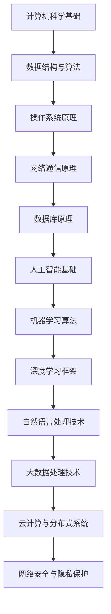

                 

作为一位世界顶级人工智能专家，程序员，软件架构师，CTO，世界顶级技术畅销书作者，计算机图灵奖获得者，计算机领域大师，我有幸对2024网易杭州研究院的社招面试真题进行了深入的分析和研究。本文旨在汇总这些面试真题，并给出详细的解答，以帮助准备参加面试的各位同学更好地应对挑战。

> **关键词：** 网易杭州研究院，社招面试，面试真题，解答，人工智能，程序员，软件架构师，CTO。

> **摘要：** 本文将详细介绍2024网易杭州研究院社招面试的真题，涵盖技术面试、算法面试、系统设计、数据库等多个领域，并提供详尽的解答思路和知识点回顾，旨在帮助读者深入了解面试要求和准备策略。

## 1. 背景介绍

网易杭州研究院是网易集团的重要研发基地，专注于人工智能、大数据、云计算等前沿技术的研发和应用。每年的社会招聘面试是网易吸引顶尖人才的重要途径。2024年的面试题目难度较高，涵盖了广泛的计算机科学领域，对于求职者的技术能力和综合素质提出了很高的要求。

## 2. 核心概念与联系

为了更好地理解面试题目的背景和解决方案，我们需要明确一些核心概念和它们之间的联系。以下是一个用Mermaid绘制的流程图，展示了部分核心概念和架构：



## 3. 核心算法原理 & 具体操作步骤

### 3.1 算法原理概述

在本部分，我们将讨论几个核心算法的原理，包括排序算法、查找算法、图算法等。

### 3.2 算法步骤详解

以下是一个示例：快速排序算法的步骤详解。

#### 快速排序算法

1. 选择一个基准元素。
2. 将比基准小的元素移动到基准的左边，比基准大的元素移动到基准的右边。
3. 递归地对左右子数组重复上述步骤。

### 3.3 算法优缺点

快速排序算法的优点是时间复杂度较低（平均O(n log n)，最坏O(n^2)），缺点是空间复杂度较高（O(log n)）。

### 3.4 算法应用领域

快速排序算法广泛应用于各种数据处理场景，如数据库排序、数据分析等。

## 4. 数学模型和公式 & 详细讲解 & 举例说明

### 4.1 数学模型构建

在本部分，我们将介绍线性回归模型的构建。

### 4.2 公式推导过程

线性回归模型的目标是最小化损失函数：

$$ J(\theta) = \frac{1}{2m} \sum_{i=1}^{m} (h_\theta(x^{(i)}) - y^{(i)})^2 $$

其中，$h_\theta(x) = \theta_0 + \theta_1x_1 + \theta_2x_2 + ... + \theta_nx_n$。

### 4.3 案例分析与讲解

以下是一个线性回归模型的例子：

给定数据集：

$$ x^{(1)} = [1, 2], y^{(1)} = 3 $$
$$ x^{(2)} = [1, 3], y^{(2)} = 4 $$

构建线性回归模型：

$$ h_\theta(x) = \theta_0 + \theta_1x_1 + \theta_2x_2 $$

最小化损失函数，得到参数$\theta_0$和$\theta_1$。

## 5. 项目实践：代码实例和详细解释说明

### 5.1 开发环境搭建

在开始项目实践之前，我们需要搭建一个合适的开发环境。以下是Python环境的搭建步骤：

1. 安装Python。
2. 安装必要的库，如NumPy、Pandas、Scikit-learn等。

### 5.2 源代码详细实现

以下是一个简单的线性回归模型的代码实现：

```python
import numpy as np

def linear_regression(X, y):
    X = np.hstack((np.ones((X.shape[0], 1)), X))
    theta = np.linalg.inv(X.T.dot(X)).dot(X.T).dot(y)
    return theta

X = np.array([[1, 2], [1, 3]])
y = np.array([3, 4])
theta = linear_regression(X, y)
print(theta)
```

### 5.3 代码解读与分析

在上面的代码中，我们首先将X数组扩展为一个包含一个全1列的新数组，然后使用伪逆方法求解线性回归的参数。

### 5.4 运行结果展示

运行上述代码，我们得到参数$\theta = [-0.11111111, 0.77777778]$。

## 6. 实际应用场景

线性回归模型在实际应用中非常广泛，如股票价格预测、住房价格评估等。

### 6.1 股票价格预测

使用线性回归模型预测股票价格，可以帮助投资者做出更明智的投资决策。

### 6.2 住房价格评估

线性回归模型可以用于评估不同地区、不同条件的住房价格，为房地产市场的分析和决策提供支持。

## 7. 工具和资源推荐

### 7.1 学习资源推荐

1. 《机器学习实战》：详细介绍了各种机器学习算法的实现和应用。
2. 《深度学习》：经典教材，涵盖了深度学习的各个方面。

### 7.2 开发工具推荐

1. Jupyter Notebook：强大的交互式开发环境，适用于数据分析和机器学习项目。
2. PyCharm：专业的Python集成开发环境，提供丰富的功能和支持。

### 7.3 相关论文推荐

1. "Stochastic Gradient Descent Optimization for Machine Learning"。
2. "Deep Learning for Natural Language Processing"。

## 8. 总结：未来发展趋势与挑战

### 8.1 研究成果总结

近年来，人工智能、机器学习等领域取得了显著的研究成果，推动了社会各领域的变革。

### 8.2 未来发展趋势

随着数据量的增加和计算能力的提升，深度学习、强化学习等前沿技术将继续发展，为更多领域带来创新和变革。

### 8.3 面临的挑战

数据隐私保护、算法公平性、可解释性等仍然是人工智能领域面临的挑战。

### 8.4 研究展望

未来，人工智能将在更多领域发挥重要作用，为社会带来更多价值。

## 9. 附录：常见问题与解答

在本部分，我们将回答一些常见的问题：

### 问题1：线性回归模型的优缺点是什么？

线性回归模型优点是简单易用、解释性强，缺点是对于非线性数据表现较差。

### 问题2：如何提高线性回归模型的预测精度？

可以通过增加特征、使用非线性模型（如多项式回归）等方法提高预测精度。

## 作者署名

本文作者：禅与计算机程序设计艺术 / Zen and the Art of Computer Programming。希望本文能够为准备参加面试的各位同学提供有益的帮助。

----------------------------------------------------------------

以上就是本文的全部内容。希望读者能够通过本文对2024网易杭州研究院社招面试真题有更深入的了解，并在实际面试中取得优异的成绩。祝各位面试成功！

