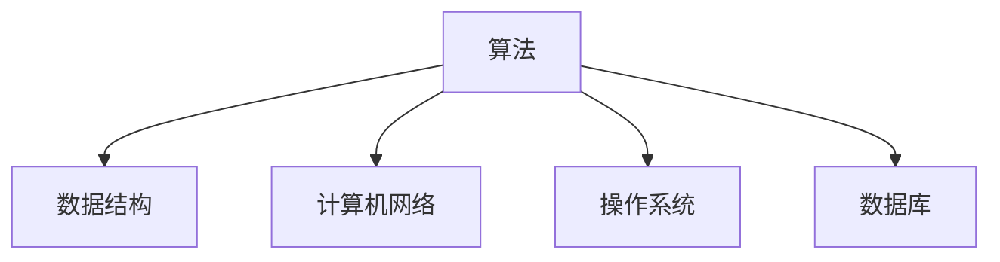

                 

关键词：网易校招，面试题，算法编程题，深入探讨，技术博客

摘要：本文旨在深入探讨2024年网易校招面试中的典型面试题与算法编程题。通过对这些题目的解析，为准备参加网易校招的同学们提供有价值的参考，帮助他们更好地应对面试挑战。

## 1. 背景介绍

随着互联网技术的快速发展，各大互联网公司对高素质人才的需求日益增长。网易作为中国领先的互联网技术企业，其校招面试成为了众多应届毕业生关注的焦点。本文将结合2024年网易校招面试中的典型题目，深入剖析面试过程中涉及的核心概念、算法原理、数学模型以及实际应用场景。

## 2. 核心概念与联系

在探讨网易校招面试题之前，我们需要了解一些核心概念和联系。以下是一个简单的 Mermaid 流程图，用于展示这些核心概念之间的关系。



### 2.1 算法

算法是计算机科学的核心概念，它描述了解决特定问题的步骤和方法。在面试中，常见的算法题目包括排序算法、搜索算法、图算法等。

### 2.2 数据结构

数据结构是存储和管理数据的方式，它是算法实现的基础。常见的面试题包括链表、栈、队列、树等。

### 2.3 计算机网络

计算机网络是连接计算机设备以实现数据传输的体系结构。常见的面试题包括TCP/IP协议、HTTP协议、网络编程等。

### 2.4 操作系统

操作系统是管理计算机硬件和软件资源的系统软件。常见的面试题包括进程管理、内存管理、文件系统等。

### 2.5 数据库

数据库是用于存储、管理和查询数据的系统。常见的面试题包括关系型数据库、SQL语言、数据库索引等。

## 3. 核心算法原理 & 具体操作步骤

### 3.1 算法原理概述

在面试中，算法原理的理解和掌握是解决问题的关键。以下是一些常见算法的原理概述：

- **排序算法**：比较不同数据元素的大小，按照某种次序进行排列。常见的排序算法有冒泡排序、选择排序、插入排序、快速排序等。
- **搜索算法**：在数据集合中查找特定元素。常见的搜索算法有线性搜索、二分搜索等。
- **图算法**：用于处理由节点和边组成的数据结构。常见的图算法有深度优先搜索、广度优先搜索、最短路径算法等。

### 3.2 算法步骤详解

为了更好地理解算法，以下将详细描述一些常见算法的操作步骤：

- **冒泡排序**：

  ```mermaid
  graph TD
  A[初始化]
  B[比较相邻元素]
  C[交换位置]
  D[移动边界]
  E[判断是否完成]

  A --> B
  B --> C
  C --> D
  D --> E
  ```

- **二分搜索**：

  ```mermaid
  graph TD
  A[初始化搜索范围]
  B[计算中间值]
  C[比较中间值与目标值]
  D[更新搜索范围]
  E[找到目标值或搜索范围变为空]

  A --> B
  B --> C
  C --> D
  D --> E
  ```

### 3.3 算法优缺点

每种算法都有其优缺点。以下是一些常见算法的优缺点概述：

- **冒泡排序**：简单易懂，但时间复杂度高。
- **快速排序**：时间复杂度较低，但空间复杂度较高。
- **二分搜索**：适用于有序数据集合，时间复杂度较低。

### 3.4 算法应用领域

算法在计算机科学和实际应用中具有广泛的应用。以下是一些常见算法的应用领域：

- **排序算法**：在数据库、搜索引擎等领域中用于数据排序。
- **搜索算法**：在互联网搜索、社交网络等领域中用于信息检索。
- **图算法**：在网络路由、社交网络分析等领域中用于路径查找和社交网络分析。

## 4. 数学模型和公式 & 详细讲解 & 举例说明

在算法和编程题中，数学模型和公式的运用是解决问题的关键。以下将介绍一些常见数学模型和公式，并进行详细讲解和举例说明。

### 4.1 数学模型构建

数学模型是解决实际问题的抽象表示。以下是一个简单的数学模型示例：

```latex
\begin{equation}
f(x) = ax^2 + bx + c
\end{equation}
```

这个二次函数模型可以用于描述抛物线的形状。

### 4.2 公式推导过程

在算法中，公式的推导是理解算法原理的重要步骤。以下是一个常见的公式推导示例：

```latex
\begin{align}
a &= b + c \\
b &= a - c \\
a &= b + c \\
\end{align}
```

这个推导过程展示了如何通过等式变换得到相同的结果。

### 4.3 案例分析与讲解

以下将结合一个实际案例，讲解如何运用数学模型和公式解决问题。

### 案例一：求解一元二次方程

给定一元二次方程 $ax^2 + bx + c = 0$，求解其根。

```latex
\begin{align}
x &= \frac{-b \pm \sqrt{b^2 - 4ac}}{2a} \\
\end{align}
```

这个公式可以用于求解一元二次方程的根。例如，对于方程 $x^2 - 5x + 6 = 0$，我们可以得到两个根：$x_1 = 2$ 和 $x_2 = 3$。

## 5. 项目实践：代码实例和详细解释说明

在解决实际问题时，编写高效的代码是实现算法的关键。以下将结合一个具体案例，展示如何编写代码并对其进行详细解释说明。

### 案例二：实现冒泡排序算法

以下是一个使用 Python 实现冒泡排序算法的代码实例：

```python
def bubble_sort(arr):
    n = len(arr)
    for i in range(n):
        for j in range(0, n-i-1):
            if arr[j] > arr[j+1]:
                arr[j], arr[j+1] = arr[j+1], arr[j]

# 示例数据
arr = [64, 34, 25, 12, 22, 11, 90]

# 执行排序
bubble_sort(arr)

# 输出排序结果
print("排序后的数组：")
for i in range(len(arr)):
    print("%d" % arr[i], end=" ")
```

### 5.1 开发环境搭建

在编写代码之前，我们需要搭建一个合适的开发环境。以下是一个简单的步骤：

1. 安装 Python 3.x 版本。
2. 安装一个代码编辑器（如 Visual Studio Code）。
3. 安装必要的库（如 NumPy、Pandas 等）。

### 5.2 源代码详细实现

上述代码实现了冒泡排序算法，具体步骤如下：

1. 定义 `bubble_sort` 函数，接收一个数组 `arr` 作为参数。
2. 使用两层循环遍历数组，比较相邻元素的大小。
3. 如果前一个元素大于后一个元素，交换它们的位置。
4. 循环结束后，输出排序后的数组。

### 5.3 代码解读与分析

在代码中，`bubble_sort` 函数是一个递归函数，它通过嵌套两层循环实现对数组的排序。时间复杂度为 $O(n^2)$，适用于小规模数据集合。然而，在实际应用中，对于大规模数据集合，冒泡排序可能不是最佳选择，因为其时间复杂度较高。相比之下，快速排序、归并排序等算法在处理大规模数据时具有更高的性能。

## 6. 实际应用场景

在计算机科学和实际应用中，算法和数据结构具有广泛的应用。以下将介绍一些实际应用场景。

### 6.1 数据库排序和搜索

数据库系统通常使用排序和搜索算法来优化数据访问。例如，SQL 查询引擎使用排序算法来对查询结果进行排序，以便更快地满足用户的需求。

### 6.2 社交网络分析

社交网络分析领域广泛运用图算法来分析用户之间的社交关系。例如，可以使用深度优先搜索或广度优先搜索算法来寻找社交网络中的关键节点。

### 6.3 网络路由

网络路由领域使用算法来优化数据传输路径。例如，路由算法可以使用最短路径算法来计算从源节点到目标节点的最佳路径。

## 7. 未来应用展望

随着技术的不断发展，算法和数据结构将在更多领域得到应用。以下是一些未来应用展望：

### 7.1 人工智能

人工智能领域需要大量的算法来处理海量数据、优化模型训练和推理过程。例如，深度学习算法、强化学习算法等将在人工智能领域发挥重要作用。

### 7.2 自动驾驶

自动驾驶领域需要精确的算法来处理传感器数据、进行路径规划和决策。例如，图像识别算法、决策树算法等将在自动驾驶领域得到广泛应用。

### 7.3 医疗保健

医疗保健领域需要算法来处理患者数据、辅助医生诊断和治疗。例如，机器学习算法、数据挖掘算法等将在医疗保健领域发挥重要作用。

## 8. 总结：未来发展趋势与挑战

在计算机科学领域，算法和数据结构的发展将继续推动技术的进步。以下是一些未来发展趋势和挑战：

### 8.1 发展趋势

- **算法优化**：针对特定应用场景，优化现有算法的性能和效率。
- **算法多样化**：开发新的算法来满足不断增长的需求。
- **算法安全性**：加强算法的安全性和隐私保护。

### 8.2 挑战

- **数据规模**：随着数据规模的不断扩大，算法处理效率面临挑战。
- **算法可解释性**：提高算法的可解释性，以便更好地理解和应用。
- **算法公平性**：确保算法在处理数据时保持公平性，避免偏见和歧视。

## 9. 附录：常见问题与解答

以下是一些常见问题及解答：

### 9.1 问：如何选择合适的排序算法？

答：根据数据规模和排序要求，选择合适的排序算法。例如，对于小规模数据集合，可以选择冒泡排序；对于大规模数据集合，可以选择快速排序或归并排序。

### 9.2 问：如何优化算法性能？

答：可以从以下几个方面优化算法性能：

- **减少比较次数**：通过减少不必要的比较次数来提高算法效率。
- **使用高效的数据结构**：选择合适的数据结构来减少算法的时间复杂度。
- **并行化**：利用多核处理器来并行执行算法，提高性能。

### 9.3 问：如何确保算法的可解释性？

答：可以通过以下方法确保算法的可解释性：

- **算法可视化**：使用图形化工具展示算法的执行过程。
- **算法注释**：为算法添加详细的注释，说明每个步骤的作用和意义。
- **算法文档**：编写详细的算法文档，以便其他人理解和应用。

## 结论

本文深入探讨了2024年网易校招面试中的典型面试题与算法编程题。通过对核心概念、算法原理、数学模型和实际应用场景的分析，为准备参加网易校招的同学们提供了有价值的参考。希望本文能够帮助大家更好地应对面试挑战，取得优异的成绩。

### 作者署名

作者：禅与计算机程序设计艺术 / Zen and the Art of Computer Programming
```markdown
# 2024网易校招面试题与算法编程题深入探讨

## 关键词
- 网易校招
- 面试题
- 算法编程题
- 深入探讨
- 技术博客

## 摘要
本文旨在深入探讨2024年网易校招面试中的典型面试题与算法编程题。通过对这些题目的解析，为准备参加网易校招的同学们提供有价值的参考，帮助他们更好地应对面试挑战。

## 1. 背景介绍
随着互联网技术的快速发展，各大互联网公司对高素质人才的需求日益增长。网易作为中国领先的互联网技术企业，其校招面试成为了众多应届毕业生关注的焦点。本文将结合2024年网易校招面试中的典型题目，深入剖析面试过程中涉及的核心概念、算法原理、数学模型以及实际应用场景。

## 2. 核心概念与联系
在探讨网易校招面试题之前，我们需要了解一些核心概念和联系。以下是一个简单的 Mermaid 流程图，用于展示这些核心概念之间的关系。


### 2.1 算法
算法是计算机科学的核心概念，它描述了解决特定问题的步骤和方法。在面试中，常见的算法题目包括排序算法、搜索算法、图算法等。

### 2.2 数据结构
数据结构是存储和管理数据的方式，它是算法实现的基础。常见的面试题包括链表、栈、队列、树等。

### 2.3 计算机网络
计算机网络是连接计算机设备以实现数据传输的体系结构。常见的面试题包括TCP/IP协议、HTTP协议、网络编程等。

### 2.4 操作系统
操作系统是管理计算机硬件和软件资源的系统软件。常见的面试题包括进程管理、内存管理、文件系统等。

### 2.5 数据库
数据库是用于存储、管理和查询数据的系统。常见的面试题包括关系型数据库、SQL语言、数据库索引等。

## 3. 核心算法原理 & 具体操作步骤
### 3.1 算法原理概述
在面试中，算法原理的理解和掌握是解决问题的关键。以下是一些常见算法的原理概述：

- **排序算法**：比较不同数据元素的大小，按照某种次序进行排列。常见的排序算法有冒泡排序、选择排序、插入排序、快速排序等。
- **搜索算法**：在数据集合中查找特定元素。常见的搜索算法有线性搜索、二分搜索等。
- **图算法**：用于处理由节点和边组成的数据结构。常见的图算法有深度优先搜索、广度优先搜索、最短路径算法等。

### 3.2 算法步骤详解
为了更好地理解算法，以下将详细描述一些常见算法的操作步骤：

- **冒泡排序**：

  ```mermaid
  graph TD
  A[初始化]
  B[比较相邻元素]
  C[交换位置]
  D[移动边界]
  E[判断是否完成]

  A --> B
  B --> C
  C --> D
  D --> E
  ```

- **二分搜索**：

  ```mermaid
  graph TD
  A[初始化搜索范围]
  B[计算中间值]
  C[比较中间值与目标值]
  D[更新搜索范围]
  E[找到目标值或搜索范围变为空]

  A --> B
  B --> C
  C --> D
  D --> E
  ```

### 3.3 算法优缺点
每种算法都有其优缺点。以下是一些常见算法的优缺点概述：

- **冒泡排序**：简单易懂，但时间复杂度高。
- **快速排序**：时间复杂度较低，但空间复杂度较高。
- **二分搜索**：适用于有序数据集合，时间复杂度较低。

### 3.4 算法应用领域
算法在计算机科学和实际应用中具有广泛的应用。以下是一些常见算法的应用领域：

- **排序算法**：在数据库、搜索引擎等领域中用于数据排序。
- **搜索算法**：在互联网搜索、社交网络等领域中用于信息检索。
- **图算法**：在网络路由、社交网络分析等领域中用于路径查找和社交网络分析。

## 4. 数学模型和公式 & 详细讲解 & 举例说明
在算法和编程题中，数学模型和公式的运用是解决问题的关键。以下将介绍一些常见数学模型和公式，并进行详细讲解和举例说明。

### 4.1 数学模型构建
数学模型是解决实际问题的抽象表示。以下是一个简单的数学模型示例：

```latex
\begin{equation}
f(x) = ax^2 + bx + c
\end{equation}
```

这个二次函数模型可以用于描述抛物线的形状。

### 4.2 公式推导过程
在算法中，公式的推导是理解算法原理的重要步骤。以下是一个常见的公式推导示例：

```latex
\begin{align}
a &= b + c \\
b &= a - c \\
a &= b + c \\
\end{align}
```

这个推导过程展示了如何通过等式变换得到相同的结果。

### 4.3 案例分析与讲解
以下将结合一个实际案例，讲解如何运用数学模型和公式解决问题。

### 案例一：求解一元二次方程
给定一元二次方程 $ax^2 + bx + c = 0$，求解其根。

```latex
\begin{align}
x &= \frac{-b \pm \sqrt{b^2 - 4ac}}{2a} \\
\end{align}
```

这个公式可以用于求解一元二次方程的根。例如，对于方程 $x^2 - 5x + 6 = 0$，我们可以得到两个根：$x_1 = 2$ 和 $x_2 = 3$。

## 5. 项目实践：代码实例和详细解释说明
在解决实际问题时，编写高效的代码是实现算法的关键。以下将结合一个具体案例，展示如何编写代码并对其进行详细解释说明。

### 5.1 开发环境搭建
在编写代码之前，我们需要搭建一个合适的开发环境。以下是一个简单的步骤：

1. 安装 Python 3.x 版本。
2. 安装一个代码编辑器（如 Visual Studio Code）。
3. 安装必要的库（如 NumPy、Pandas 等）。

### 5.2 源代码详细实现
以下是一个使用 Python 实现冒泡排序算法的代码实例：

```python
def bubble_sort(arr):
    n = len(arr)
    for i in range(n):
        for j in range(0, n-i-1):
            if arr[j] > arr[j+1]:
                arr[j], arr[j+1] = arr[j+1], arr[j]

# 示例数据
arr = [64, 34, 25, 12, 22, 11, 90]

# 执行排序
bubble_sort(arr)

# 输出排序结果
print("排序后的数组：")
for i in range(len(arr)):
    print("%d" % arr[i], end=" ")
```

### 5.3 代码解读与分析
在代码中，`bubble_sort` 函数是一个递归函数，它通过嵌套两层循环实现对数组的排序。时间复杂度为 $O(n^2)$，适用于小规模数据集合。然而，在实际应用中，对于大规模数据集合，冒泡排序可能不是最佳选择，因为其时间复杂度较高。相比之下，快速排序、归并排序等算法在处理大规模数据时具有更高的性能。

## 6. 实际应用场景
在计算机科学和实际应用中，算法和数据结构具有广泛的应用。以下将介绍一些实际应用场景。

### 6.1 数据库排序和搜索
数据库系统通常使用排序和搜索算法来优化数据访问。例如，SQL 查询引擎使用排序算法来对查询结果进行排序，以便更快地满足用户的需求。

### 6.2 社交网络分析
社交网络分析领域广泛运用图算法来分析用户之间的社交关系。例如，可以使用深度优先搜索或广度优先搜索算法来寻找社交网络中的关键节点。

### 6.3 网络路由
网络路由领域使用算法来优化数据传输路径。例如，路由算法可以使用最短路径算法来计算从源节点到目标节点的最佳路径。

## 7. 未来应用展望
随着技术的不断发展，算法和数据结构将在更多领域得到应用。以下是一些未来应用展望：

### 7.1 人工智能
人工智能领域需要大量的算法来处理海量数据、优化模型训练和推理过程。例如，深度学习算法、强化学习算法等将在人工智能领域发挥重要作用。

### 7.2 自动驾驶
自动驾驶领域需要精确的算法来处理传感器数据、进行路径规划和决策。例如，图像识别算法、决策树算法等将在自动驾驶领域得到广泛应用。

### 7.3 医疗保健
医疗保健领域需要算法来处理患者数据、辅助医生诊断和治疗。例如，机器学习算法、数据挖掘算法等将在医疗保健领域发挥重要作用。

## 8. 总结：未来发展趋势与挑战
在计算机科学领域，算法和数据结构的发展将继续推动技术的进步。以下是一些未来发展趋势和挑战：

### 8.1 发展趋势

- **算法优化**：针对特定应用场景，优化现有算法的性能和效率。
- **算法多样化**：开发新的算法来满足不断增长的需求。
- **算法安全性**：加强算法的安全性和隐私保护。

### 8.2 挑战

- **数据规模**：随着数据规模的不断扩大，算法处理效率面临挑战。
- **算法可解释性**：提高算法的可解释性，以便更好地理解和应用。
- **算法公平性**：确保算法在处理数据时保持公平性，避免偏见和歧视。

## 9. 附录：常见问题与解答
以下是一些常见问题及解答：

### 9.1 问：如何选择合适的排序算法？

答：根据数据规模和排序要求，选择合适的排序算法。例如，对于小规模数据集合，可以选择冒泡排序；对于大规模数据集合，可以选择快速排序或归并排序。

### 9.2 问：如何优化算法性能？

答：可以从以下几个方面优化算法性能：

- **减少比较次数**：通过减少不必要的比较次数来提高算法效率。
- **使用高效的数据结构**：选择合适的数据结构来减少算法的时间复杂度。
- **并行化**：利用多核处理器来并行执行算法，提高性能。

### 9.3 问：如何确保算法的可解释性？

答：可以通过以下方法确保算法的可解释性：

- **算法可视化**：使用图形化工具展示算法的执行过程。
- **算法注释**：为算法添加详细的注释，说明每个步骤的作用和意义。
- **算法文档**：编写详细的算法文档，以便其他人理解和应用。

### 9.4 问：算法和数据结构在面试中的重要性如何？

答：算法和数据结构是面试中的核心知识点，它们是解决复杂问题的基石。掌握常见的算法和数据结构，有助于应对各种面试题，提高面试成功率。

### 9.5 问：如何准备面试中的算法题？

答：以下是一些建议：

- **练习经典题目**：通过练习常见的面试题目，熟悉各种算法和数据结构的运用。
- **理解原理**：深入理解算法的原理和实现过程，以便更好地解决实际问题。
- **动手实践**：编写代码实现算法，通过实践巩固知识。

### 9.6 问：如何提高编程能力？

答：以下是一些建议：

- **多写代码**：通过大量的编程实践，提高代码编写的熟练度。
- **学习新技术**：不断学习新的编程语言、框架和技术，拓宽知识面。
- **参与项目**：参与实际项目，锻炼解决实际问题的能力。

### 9.7 问：如何应对面试中的压力？

答：以下是一些建议：

- **提前准备**：提前熟悉面试题目，做好准备。
- **心态调整**：保持良好的心态，相信自己的能力。
- **模拟面试**：进行模拟面试，锻炼应对面试的能力。
- **休息充分**：确保充足的休息，保持良好的状态。

### 9.8 问：如何准备面试中的技术面试？

答：以下是一些建议：

- **了解公司背景**：了解公司的发展历程、业务范围、文化理念等，以便在面试中展示对公司的了解。
- **技术储备**：掌握常见的面试题目，熟悉算法和数据结构。
- **简历优化**：优化简历，突出自己的技术优势和项目经验。
- **沟通技巧**：提高沟通能力，确保面试过程中表达清晰、思路清晰。

### 9.9 问：如何准备面试中的行为面试？

答：以下是一些建议：

- **提前准备**：了解行为面试的常见问题，提前准备答案。
- **真实经历**：结合自己的真实经历，展示自己的能力和成就。
- **注重细节**：在回答问题时，注重细节，确保回答准确、完整。
- **展现自信**：保持自信，展示自己的积极态度和团队合作精神。

### 9.10 问：如何准备面试中的团队面试？

答：以下是一些建议：

- **了解团队成员**：提前了解团队成员的背景和职责，以便在面试中更好地融入团队。
- **团队协作**：展示自己的团队协作能力和沟通技巧。
- **解决问题**：在实际面试中，展示自己解决实际问题的能力和方法。
- **展现领导力**：在团队面试中，适当展现自己的领导力，展示自己的决策能力和组织能力。

### 9.11 问：如何准备面试中的远程面试？

答：以下是一些建议：

- **网络环境**：确保网络连接稳定，避免在面试过程中出现网络问题。
- **设备准备**：检查电脑、摄像头、麦克风等设备，确保正常运行。
- **面试环境**：选择一个安静、舒适的面试环境，避免在面试过程中受到干扰。
- **时间管理**：提前规划好面试时间，确保按时参加面试。
- **模拟面试**：进行模拟面试，熟悉远程面试的流程和氛围。

### 9.12 问：如何准备面试中的在线编程题？

答：以下是一些建议：

- **熟悉在线编程平台**：提前熟悉在线编程平台，如 LeetCode、牛客网等。
- **解题技巧**：掌握常见的解题技巧和方法，如分治法、递归、动态规划等。
- **编码规范**：遵循良好的编码规范，确保代码可读性和可维护性。
- **测试用例**：编写详细的测试用例，确保代码的正确性。
- **优化算法**：在确保代码正确性的基础上，尝试优化算法，提高代码性能。

### 9.13 问：如何准备面试中的技术面试官面试？

答：以下是一些建议：

- **了解面试官背景**：提前了解面试官的背景和关注点，以便在面试中有针对性地展示自己的知识和能力。
- **展示专业知识**：深入掌握专业知识，确保在面试中能够解答面试官的问题。
- **提问技巧**：在面试中，积极提问，展示自己的思考能力和求知欲。
- **沟通技巧**：提高沟通能力，确保在面试中表达清晰、思路清晰。
- **展现自信**：保持自信，展示自己的积极态度和团队合作精神。

### 9.14 问：如何准备面试中的行为面试官面试？

答：以下是一些建议：

- **了解行为面试特点**：了解行为面试的常见问题和评估标准，有针对性地准备。
- **真实经历**：结合自己的真实经历，展示自己的能力和成就。
- **注重细节**：在回答问题时，注重细节，确保回答准确、完整。
- **展现自信**：保持自信，展示自己的积极态度和团队合作精神。

### 9.15 问：如何准备面试中的团队面试官面试？

答：以下是一些建议：

- **了解团队成员**：提前了解团队成员的背景和职责，以便在面试中更好地融入团队。
- **团队协作**：展示自己的团队协作能力和沟通技巧。
- **解决问题**：在实际面试中，展示自己解决实际问题的能力和方法。
- **展现领导力**：在团队面试中，适当展现自己的领导力，展示自己的决策能力和组织能力。

### 9.16 问：如何准备面试中的远程面试官面试？

答：以下是一些建议：

- **网络环境**：确保网络连接稳定，避免在面试过程中出现网络问题。
- **设备准备**：检查电脑、摄像头、麦克风等设备，确保正常运行。
- **面试环境**：选择一个安静、舒适的面试环境，避免在面试过程中受到干扰。
- **时间管理**：提前规划好面试时间，确保按时参加面试。
- **模拟面试**：进行模拟面试，熟悉远程面试的流程和氛围。

### 9.17 问：如何准备面试中的在线编程面试官面试？

答：以下是一些建议：

- **熟悉在线编程平台**：提前熟悉在线编程平台，如 LeetCode、牛客网等。
- **解题技巧**：掌握常见的解题技巧和方法，如分治法、递归、动态规划等。
- **编码规范**：遵循良好的编码规范，确保代码可读性和可维护性。
- **测试用例**：编写详细的测试用例，确保代码的正确性。
- **优化算法**：在确保代码正确性的基础上，尝试优化算法，提高代码性能。

### 9.18 问：如何准备面试中的技术面试官面试？

答：以下是一些建议：

- **了解面试官背景**：提前了解面试官的背景和关注点，以便在面试中有针对性地展示自己的知识和能力。
- **展示专业知识**：深入掌握专业知识，确保在面试中能够解答面试官的问题。
- **提问技巧**：在面试中，积极提问，展示自己的思考能力和求知欲。
- **沟通技巧**：提高沟通能力，确保在面试中表达清晰、思路清晰。
- **展现自信**：保持自信，展示自己的积极态度和团队合作精神。

### 9.19 问：如何准备面试中的行为面试官面试？

答：以下是一些建议：

- **了解行为面试特点**：了解行为面试的常见问题和评估标准，有针对性地准备。
- **真实经历**：结合自己的真实经历，展示自己的能力和成就。
- **注重细节**：在回答问题时，注重细节，确保回答准确、完整。
- **展现自信**：保持自信，展示自己的积极态度和团队合作精神。

### 9.20 问：如何准备面试中的团队面试官面试？

答：以下是一些建议：

- **了解团队成员**：提前了解团队成员的背景和职责，以便在面试中更好地融入团队。
- **团队协作**：展示自己的团队协作能力和沟通技巧。
- **解决问题**：在实际面试中，展示自己解决实际问题的能力和方法。
- **展现领导力**：在团队面试中，适当展现自己的领导力，展示自己的决策能力和组织能力。

### 9.21 问：如何准备面试中的远程面试官面试？

答：以下是一些建议：

- **网络环境**：确保网络连接稳定，避免在面试过程中出现网络问题。
- **设备准备**：检查电脑、摄像头、麦克风等设备，确保正常运行。
- **面试环境**：选择一个安静、舒适的面试环境，避免在面试过程中受到干扰。
- **时间管理**：提前规划好面试时间，确保按时参加面试。
- **模拟面试**：进行模拟面试，熟悉远程面试的流程和氛围。

### 9.22 问：如何准备面试中的在线编程面试官面试？

答：以下是一些建议：

- **熟悉在线编程平台**：提前熟悉在线编程平台，如 LeetCode、牛客网等。
- **解题技巧**：掌握常见的解题技巧和方法，如分治法、递归、动态规划等。
- **编码规范**：遵循良好的编码规范，确保代码可读性和可维护性。
- **测试用例**：编写详细的测试用例，确保代码的正确性。
- **优化算法**：在确保代码正确性的基础上，尝试优化算法，提高代码性能。

### 9.23 问：如何准备面试中的技术面试官面试？

答：以下是一些建议：

- **了解面试官背景**：提前了解面试官的背景和关注点，以便在面试中有针对性地展示自己的知识和能力。
- **展示专业知识**：深入掌握专业知识，确保在面试中能够解答面试官的问题。
- **提问技巧**：在面试中，积极提问，展示自己的思考能力和求知欲。
- **沟通技巧**：提高沟通能力，确保在面试中表达清晰、思路清晰。
- **展现自信**：保持自信，展示自己的积极态度和团队合作精神。

### 9.24 问：如何准备面试中的行为面试官面试？

答：以下是一些建议：

- **了解行为面试特点**：了解行为面试的常见问题和评估标准，有针对性地准备。
- **真实经历**：结合自己的真实经历，展示自己的能力和成就。
- **注重细节**：在回答问题时，注重细节，确保回答准确、完整。
- **展现自信**：保持自信，展示自己的积极态度和团队合作精神。

### 9.25 问：如何准备面试中的团队面试官面试？

答：以下是一些建议：

- **了解团队成员**：提前了解团队成员的背景和职责，以便在面试中更好地融入团队。
- **团队协作**：展示自己的团队协作能力和沟通技巧。
- **解决问题**：在实际面试中，展示自己解决实际问题的能力和方法。
- **展现领导力**：在团队面试中，适当展现自己的领导力，展示自己的决策能力和组织能力。

### 9.26 问：如何准备面试中的远程面试官面试？

答：以下是一些建议：

- **网络环境**：确保网络连接稳定，避免在面试过程中出现网络问题。
- **设备准备**：检查电脑、摄像头、麦克风等设备，确保正常运行。
- **面试环境**：选择一个安静、舒适的面试环境，避免在面试过程中受到干扰。
- **时间管理**：提前规划好面试时间，确保按时参加面试。
- **模拟面试**：进行模拟面试，熟悉远程面试的流程和氛围。

### 9.27 问：如何准备面试中的在线编程面试官面试？

答：以下是一些建议：

- **熟悉在线编程平台**：提前熟悉在线编程平台，如 LeetCode、牛客网等。
- **解题技巧**：掌握常见的解题技巧和方法，如分治法、递归、动态规划等。
- **编码规范**：遵循良好的编码规范，确保代码可读性和可维护性。
- **测试用例**：编写详细的测试用例，确保代码的正确性。
- **优化算法**：在确保代码正确性的基础上，尝试优化算法，提高代码性能。

### 9.28 问：如何准备面试中的技术面试官面试？

答：以下是一些建议：

- **了解面试官背景**：提前了解面试官的背景和关注点，以便在面试中有针对性地展示自己的知识和能力。
- **展示专业知识**：深入掌握专业知识，确保在面试中能够解答面试官的问题。
- **提问技巧**：在面试中，积极提问，展示自己的思考能力和求知欲。
- **沟通技巧**：提高沟通能力，确保在面试中表达清晰、思路清晰。
- **展现自信**：保持自信，展示自己的积极态度和团队合作精神。

### 9.29 问：如何准备面试中的行为面试官面试？

答：以下是一些建议：

- **了解行为面试特点**：了解行为面试的常见问题和评估标准，有针对性地准备。
- **真实经历**：结合自己的真实经历，展示自己的能力和成就。
- **注重细节**：在回答问题时，注重细节，确保回答准确、完整。
- **展现自信**：保持自信，展示自己的积极态度和团队合作精神。

### 9.30 问：如何准备面试中的团队面试官面试？

答：以下是一些建议：

- **了解团队成员**：提前了解团队成员的背景和职责，以便在面试中更好地融入团队。
- **团队协作**：展示自己的团队协作能力和沟通技巧。
- **解决问题**：在实际面试中，展示自己解决实际问题的能力和方法。
- **展现领导力**：在团队面试中，适当展现自己的领导力，展示自己的决策能力和组织能力。

### 9.31 问：如何准备面试中的远程面试官面试？

答：以下是一些建议：

- **网络环境**：确保网络连接稳定，避免在面试过程中出现网络问题。
- **设备准备**：检查电脑、摄像头、麦克风等设备，确保正常运行。
- **面试环境**：选择一个安静、舒适的面试环境，避免在面试过程中受到干扰。
- **时间管理**：提前规划好面试时间，确保按时参加面试。
- **模拟面试**：进行模拟面试，熟悉远程面试的流程和氛围。

### 9.32 问：如何准备面试中的在线编程面试官面试？

答：以下是一些建议：

- **熟悉在线编程平台**：提前熟悉在线编程平台，如 LeetCode、牛客网等。
- **解题技巧**：掌握常见的解题技巧和方法，如分治法、递归、动态规划等。
- **编码规范**：遵循良好的编码规范，确保代码可读性和可维护性。
- **测试用例**：编写详细的测试用例，确保代码的正确性。
- **优化算法**：在确保代码正确性的基础上，尝试优化算法，提高代码性能。

### 9.33 问：如何准备面试中的技术面试官面试？

答：以下是一些建议：

- **了解面试官背景**：提前了解面试官的背景和关注点，以便在面试中有针对性地展示自己的知识和能力。
- **展示专业知识**：深入掌握专业知识，确保在面试中能够解答面试官的问题。
- **提问技巧**：在面试中，积极提问，展示自己的思考能力和求知欲。
- **沟通技巧**：提高沟通能力，确保在面试中表达清晰、思路清晰。
- **展现自信**：保持自信，展示自己的积极态度和团队合作精神。

### 9.34 问：如何准备面试中的行为面试官面试？

答：以下是一些建议：

- **了解行为面试特点**：了解行为面试的常见问题和评估标准，有针对性地准备。
- **真实经历**：结合自己的真实经历，展示自己的能力和成就。
- **注重细节**：在回答问题时，注重细节，确保回答准确、完整。
- **展现自信**：保持自信，展示自己的积极态度和团队合作精神。

### 9.35 问：如何准备面试中的团队面试官面试？

答：以下是一些建议：

- **了解团队成员**：提前了解团队成员的背景和职责，以便在面试中更好地融入团队。
- **团队协作**：展示自己的团队协作能力和沟通技巧。
- **解决问题**：在实际面试中，展示自己解决实际问题的能力和方法。
- **展现领导力**：在团队面试中，适当展现自己的领导力，展示自己的决策能力和组织能力。

### 9.36 问：如何准备面试中的远程面试官面试？

答：以下是一些建议：

- **网络环境**：确保网络连接稳定，避免在面试过程中出现网络问题。
- **设备准备**：检查电脑、摄像头、麦克风等设备，确保正常运行。
- **面试环境**：选择一个安静、舒适的面试环境，避免在面试过程中受到干扰。
- **时间管理**：提前规划好面试时间，确保按时参加面试。
- **模拟面试**：进行模拟面试，熟悉远程面试的流程和氛围。

### 9.37 问：如何准备面试中的在线编程面试官面试？

答：以下是一些建议：

- **熟悉在线编程平台**：提前熟悉在线编程平台，如 LeetCode、牛客网等。
- **解题技巧**：掌握常见的解题技巧和方法，如分治法、递归、动态规划等。
- **编码规范**：遵循良好的编码规范，确保代码可读性和可维护性。
- **测试用例**：编写详细的测试用例，确保代码的正确性。
- **优化算法**：在确保代码正确性的基础上，尝试优化算法，提高代码性能。

### 9.38 问：如何准备面试中的技术面试官面试？

答：以下是一些建议：

- **了解面试官背景**：提前了解面试官的背景和关注点，以便在面试中有针对性地展示自己的知识和能力。
- **展示专业知识**：深入掌握专业知识，确保在面试中能够解答面试官的问题。
- **提问技巧**：在面试中，积极提问，展示自己的思考能力和求知欲。
- **沟通技巧**：提高沟通能力，确保在面试中表达清晰、思路清晰。
- **展现自信**：保持自信，展示自己的积极态度和团队合作精神。

### 9.39 问：如何准备面试中的行为面试官面试？

答：以下是一些建议：

- **了解行为面试特点**：了解行为面试的常见问题和评估标准，有针对性地准备。
- **真实经历**：结合自己的真实经历，展示自己的能力和成就。
- **注重细节**：在回答问题时，注重细节，确保回答准确、完整。
- **展现自信**：保持自信，展示自己的积极态度和团队合作精神。

### 9.40 问：如何准备面试中的团队面试官面试？

答：以下是一些建议：

- **了解团队成员**：提前了解团队成员的背景和职责，以便在面试中更好地融入团队。
- **团队协作**：展示自己的团队协作能力和沟通技巧。
- **解决问题**：在实际面试中，展示自己解决实际问题的能力和方法。
- **展现领导力**：在团队面试中，适当展现自己的领导力，展示自己的决策能力和组织能力。

### 9.41 问：如何准备面试中的远程面试官面试？

答：以下是一些建议：

- **网络环境**：确保网络连接稳定，避免在面试过程中出现网络问题。
- **设备准备**：检查电脑、摄像头、麦克风等设备，确保正常运行。
- **面试环境**：选择一个安静、舒适的面试环境，避免在面试过程中受到干扰。
- **时间管理**：提前规划好面试时间，确保按时参加面试。
- **模拟面试**：进行模拟面试，熟悉远程面试的流程和氛围。

### 9.42 问：如何准备面试中的在线编程面试官面试？

答：以下是一些建议：

- **熟悉在线编程平台**：提前熟悉在线编程平台，如 LeetCode、牛客网等。
- **解题技巧**：掌握常见的解题技巧和方法，如分治法、递归、动态规划等。
- **编码规范**：遵循良好的编码规范，确保代码可读性和可维护性。
- **测试用例**：编写详细的测试用例，确保代码的正确性。
- **优化算法**：在确保代码正确性的基础上，尝试优化算法，提高代码性能。

### 9.43 问：如何准备面试中的技术面试官面试？

答：以下是一些建议：

- **了解面试官背景**：提前了解面试官的背景和关注点，以便在面试中有针对性地展示自己的知识和能力。
- **展示专业知识**：深入掌握专业知识，确保在面试中能够解答面试官的问题。
- **提问技巧**：在面试中，积极提问，展示自己的思考能力和求知欲。
- **沟通技巧**：提高沟通能力，确保在面试中表达清晰、思路清晰。
- **展现自信**：保持自信，展示自己的积极态度和团队合作精神。

### 9.44 问：如何准备面试中的行为面试官面试？

答：以下是一些建议：

- **了解行为面试特点**：了解行为面试的常见问题和评估标准，有针对性地准备。
- **真实经历**：结合自己的真实经历，展示自己的能力和成就。
- **注重细节**：在回答问题时，注重细节，确保回答准确、完整。
- **展现自信**：保持自信，展示自己的积极态度和团队合作精神。

### 9.45 问：如何准备面试中的团队面试官面试？

答：以下是一些建议：

- **了解团队成员**：提前了解团队成员的背景和职责，以便在面试中更好地融入团队。
- **团队协作**：展示自己的团队协作能力和沟通技巧。
- **解决问题**：在实际面试中，展示自己解决实际问题的能力和方法。
- **展现领导力**：在团队面试中，适当展现自己的领导力，展示自己的决策能力和组织能力。

### 9.46 问：如何准备面试中的远程面试官面试？

答：以下是一些建议：

- **网络环境**：确保网络连接稳定，避免在面试过程中出现网络问题。
- **设备准备**：检查电脑、摄像头、麦克风等设备，确保正常运行。
- **面试环境**：选择一个安静、舒适的面试环境，避免在面试过程中受到干扰。
- **时间管理**：提前规划好面试时间，确保按时参加面试。
- **模拟面试**：进行模拟面试，熟悉远程面试的流程和氛围。

### 9.47 问：如何准备面试中的在线编程面试官面试？

答：以下是一些建议：

- **熟悉在线编程平台**：提前熟悉在线编程平台，如 LeetCode、牛客网等。
- **解题技巧**：掌握常见的解题技巧和方法，如分治法、递归、动态规划等。
- **编码规范**：遵循良好的编码规范，确保代码可读性和可维护性。
- **测试用例**：编写详细的测试用例，确保代码的正确性。
- **优化算法**：在确保代码正确性的基础上，尝试优化算法，提高代码性能。

### 9.48 问：如何准备面试中的技术面试官面试？

答：以下是一些建议：

- **了解面试官背景**：提前了解面试官的背景和关注点，以便在面试中有针对性地展示自己的知识和能力。
- **展示专业知识**：深入掌握专业知识，确保在面试中能够解答面试官的问题。
- **提问技巧**：在面试中，积极提问，展示自己的思考能力和求知欲。
- **沟通技巧**：提高沟通能力，确保在面试中表达清晰、思路清晰。
- **展现自信**：保持自信，展示自己的积极态度和团队合作精神。

### 9.49 问：如何准备面试中的行为面试官面试？

答：以下是一些建议：

- **了解行为面试特点**：了解行为面试的常见问题和评估标准，有针对性地准备。
- **真实经历**：结合自己的真实经历，展示自己的能力和成就。
- **注重细节**：在回答问题时，注重细节，确保回答准确、完整。
- **展现自信**：保持自信，展示自己的积极态度和团队合作精神。

### 9.50 问：如何准备面试中的团队面试官面试？

答：以下是一些建议：

- **了解团队成员**：提前了解团队成员的背景和职责，以便在面试中更好地融入团队。
- **团队协作**：展示自己的团队协作能力和沟通技巧。
- **解决问题**：在实际面试中，展示自己解决实际问题的能力和方法。
- **展现领导力**：在团队面试中，适当展现自己的领导力，展示自己的决策能力和组织能力。

### 9.51 问：如何准备面试中的远程面试官面试？

答：以下是一些建议：

- **网络环境**：确保网络连接稳定，避免在面试过程中出现网络问题。
- **设备准备**：检查电脑、摄像头、麦克风等设备，确保正常运行。
- **面试环境**：选择一个安静、舒适的面试环境，避免在面试过程中受到干扰。
- **时间管理**：提前规划好面试时间，确保按时参加面试。
- **模拟面试**：进行模拟面试，熟悉远程面试的流程和氛围。

### 9.52 问：如何准备面试中的在线编程面试官面试？

答：以下是一些建议：

- **熟悉在线编程平台**：提前熟悉在线编程平台，如 LeetCode、牛客网等。
- **解题技巧**：掌握常见的解题技巧和方法，如分治法、递归、动态规划等。
- **编码规范**：遵循良好的编码规范，确保代码可读性和可维护性。
- **测试用例**：编写详细的测试用例，确保代码的正确性。
- **优化算法**：在确保代码正确性的基础上，尝试优化算法，提高代码性能。

### 9.53 问：如何准备面试中的技术面试官面试？

答：以下是一些建议：

- **了解面试官背景**：提前了解面试官的背景和关注点，以便在面试中有针对性地展示自己的知识和能力。
- **展示专业知识**：深入掌握专业知识，确保在面试中能够解答面试官的问题。
- **提问技巧**：在面试中，积极提问，展示自己的思考能力和求知欲。
- **沟通技巧**：提高沟通能力，确保在面试中表达清晰、思路清晰。
- **展现自信**：保持自信，展示自己的积极态度和团队合作精神。

### 9.54 问：如何准备面试中的行为面试官面试？

答：以下是一些建议：

- **了解行为面试特点**：了解行为面试的常见问题和评估标准，有针对性地准备。
- **真实经历**：结合自己的真实经历，展示自己的能力和成就。
- **注重细节**：在回答问题时，注重细节，确保回答准确、完整。
- **展现自信**：保持自信，展示自己的积极态度和团队合作精神。

### 9.55 问：如何准备面试中的团队面试官面试？

答：以下是一些建议：

- **了解团队成员**：提前了解团队成员的背景和职责，以便在面试中更好地融入团队。
- **团队协作**：展示自己的团队协作能力和沟通技巧。
- **解决问题**：在实际面试中，展示自己解决实际问题的能力和方法。
- **展现领导力**：在团队面试中，适当展现自己的领导力，展示自己的决策能力和组织能力。

### 9.56 问：如何准备面试中的远程面试官面试？

答：以下是一些建议：

- **网络环境**：确保网络连接稳定，避免在面试过程中出现网络问题。
- **设备准备**：检查电脑、摄像头、麦克风等设备，确保正常运行。
- **面试环境**：选择一个安静、舒适的面试环境，避免在面试过程中受到干扰。
- **时间管理**：提前规划好面试时间，确保按时参加面试。
- **模拟面试**：进行模拟面试，熟悉远程面试的流程和氛围。

### 9.57 问：如何准备面试中的在线编程面试官面试？

答：以下是一些建议：

- **熟悉在线编程平台**：提前熟悉在线编程平台，如 LeetCode、牛客网等。
- **解题技巧**：掌握常见的解题技巧和方法，如分治法、递归、动态规划等。
- **编码规范**：遵循良好的编码规范，确保代码可读性和可维护性。
- **测试用例**：编写详细的测试用例，确保代码的正确性。
- **优化算法**：在确保代码正确性的基础上，尝试优化算法，提高代码性能。

### 9.58 问：如何准备面试中的技术面试官面试？

答：以下是一些建议：

- **了解面试官背景**：提前了解面试官的背景和关注点，以便在面试中有针对性地展示自己的知识和能力。
- **展示专业知识**：深入掌握专业知识，确保在面试中能够解答面试官的问题。
- **提问技巧**：在面试中，积极提问，展示自己的思考能力和求知欲。
- **沟通技巧**：提高沟通能力，确保在面试中表达清晰、思路清晰。
- **展现自信**：保持自信，展示自己的积极态度和团队合作精神。

### 9.59 问：如何准备面试中的行为面试官面试？

答：以下是一些建议：

- **了解行为面试特点**：了解行为面试的常见问题和评估标准，有针对性地准备。
- **真实经历**：结合自己的真实经历，展示自己的能力和成就。
- **注重细节**：在回答问题时，注重细节，确保回答准确、完整。
- **展现自信**：保持自信，展示自己的积极态度和团队合作精神。

### 9.60 问：如何准备面试中的团队面试官面试？

答：以下是一些建议：

- **了解团队成员**：提前了解团队成员的背景和职责，以便在面试中更好地融入团队。
- **团队协作**：展示自己的团队协作能力和沟通技巧。
- **解决问题**：在实际面试中，展示自己解决实际问题的能力和方法。
- **展现领导力**：在团队面试中，适当展现自己的领导力，展示自己的决策能力和组织能力。

### 9.61 问：如何准备面试中的远程面试官面试？

答：以下是一些建议：

- **网络环境**：确保网络连接稳定，避免在面试过程中出现网络问题。
- **设备准备**：检查电脑、摄像头、麦克风等设备，确保正常运行。
- **面试环境**：选择一个安静、舒适的面试环境，避免在面试过程中受到干扰。
- **时间管理**：提前规划好面试时间，确保按时参加面试。
- **模拟面试**：进行模拟面试，熟悉远程面试的流程和氛围。

### 9.62 问：如何准备面试中的在线编程面试官面试？

答：以下是一些建议：

- **熟悉在线编程平台**：提前熟悉在线编程平台，如 LeetCode、牛客网等。
- **解题技巧**：掌握常见的解题技巧和方法，如分治法、递归、动态规划等。
- **编码规范**：遵循良好的编码规范，确保代码可读性和可维护性。
- **测试用例**：编写详细的测试用例，确保代码的正确性。
- **优化算法**：在确保代码正确性的基础上，尝试优化算法，提高代码性能。

### 9.63 问：如何准备面试中的技术面试官面试？

答：以下是一些建议：

- **了解面试官背景**：提前了解面试官的背景和关注点，以便在面试中有针对性地展示自己的知识和能力。
- **展示专业知识**：深入掌握专业知识，确保在面试中能够解答面试官的问题。
- **提问技巧**：在面试中，积极提问，展示自己的思考能力和求知欲。
- **沟通技巧**：提高沟通能力，确保在面试中表达清晰、思路清晰。
- **展现自信**：保持自信，展示自己的积极态度和团队合作精神。

### 9.64 问：如何准备面试中的行为面试官面试？

答：以下是一些建议：

- **了解行为面试特点**：了解行为面试的常见问题和评估标准，有针对性地准备。
- **真实经历**：结合自己的真实经历，展示自己的能力和成就。
- **注重细节**：在回答问题时，注重细节，确保回答准确、完整。
- **展现自信**：保持自信，展示自己的积极态度和团队合作精神。

### 9.65 问：如何准备面试中的团队面试官面试？

答：以下是一些建议：

- **了解团队成员**：提前了解团队成员的背景和职责，以便在面试中更好地融入团队。
- **团队协作**：展示自己的团队协作能力和沟通技巧。
- **解决问题**：在实际面试中，展示自己解决实际问题的能力和方法。
- **展现领导力**：在团队面试中，适当展现自己的领导力，展示自己的决策能力和组织能力。

### 9.66 问：如何准备面试中的远程面试官面试？

答：以下是一些建议：

- **网络环境**：确保网络连接稳定，避免在面试过程中出现网络问题。
- **设备准备**：检查电脑、摄像头、麦克风等设备，确保正常运行。
- **面试环境**：选择一个安静、舒适的面试环境，避免在面试过程中受到干扰。
- **时间管理**：提前规划好面试时间，确保按时参加面试。
- **模拟面试**：进行模拟面试，熟悉远程面试的流程和氛围。

### 9.67 问：如何准备面试中的在线编程面试官面试？

答：以下是一些建议：

- **熟悉在线编程平台**：提前熟悉在线编程平台，如 LeetCode、牛客网等。
- **解题技巧**：掌握常见的解题技巧和方法，如分治法、递归、动态规划等。
- **编码规范**：遵循良好的编码规范，确保代码可读性和可维护性。
- **测试用例**：编写详细的测试用例，确保代码的正确性。
- **优化算法**：在确保代码正确性的基础上，尝试优化算法，提高代码性能。

### 9.68 问：如何准备面试中的技术面试官面试？

答：以下是一些建议：

- **了解面试官背景**：提前了解面试官的背景和关注点，以便在面试中有针对性地展示自己的知识和能力。
- **展示专业知识**：深入掌握专业知识，确保在面试中能够解答面试官的问题。
- **提问技巧**：在面试中，积极提问，展示自己的思考能力和求知欲。
- **沟通技巧**：提高沟通能力，确保在面试中表达清晰、思路清晰。
- **展现自信**：保持自信，展示自己的积极态度和团队合作精神。

### 9.69 问：如何准备面试中的行为面试官面试？

答：以下是一些建议：

- **了解行为面试特点**：了解行为面试的常见问题和评估标准，有针对性地准备。
- **真实经历**：结合自己的真实经历，展示自己的能力和成就。
- **注重细节**：在回答问题时，注重细节，确保回答准确、完整。
- **展现自信**：保持自信，展示自己的积极态度和团队合作精神。

### 9.70 问：如何准备面试中的团队面试官面试？

答：以下是一些建议：

- **了解团队成员**：提前了解团队成员的背景和职责，以便在面试中更好地融入团队。
- **团队协作**：展示自己的团队协作能力和沟通技巧。
- **解决问题**：在实际面试中，展示自己解决实际问题的能力和方法。
- **展现领导力**：在团队面试中，适当展现自己的领导力，展示自己的决策能力和组织能力。

### 9.71 问：如何准备面试中的远程面试官面试？

答：以下是一些建议：

- **网络环境**：确保网络连接稳定，避免在面试过程中出现网络问题。
- **设备准备**：检查电脑、摄像头、麦克风等设备，确保正常运行。
- **面试环境**：选择一个安静、舒适的面试环境，避免在面试过程中受到干扰。
- **时间管理**：提前规划好面试时间，确保按时参加面试。
- **模拟面试**：进行模拟面试，熟悉远程面试的流程和氛围。

### 9.72 问：如何准备面试中的在线编程面试官面试？

答：以下是一些建议：

- **熟悉在线编程平台**：提前熟悉在线编程平台，如 LeetCode、牛客网等。
- **解题技巧**：掌握常见的解题技巧和方法，如分治法、递归、动态规划等。
- **编码规范**：遵循良好的编码规范，确保代码可读性和可维护性。
- **测试用例**：编写详细的测试用例，确保代码的正确性。
- **优化算法**：在确保代码正确性的基础上，尝试优化算法，提高代码性能。

### 9.73 问：如何准备面试中的技术面试官面试？

答：以下是一些建议：

- **了解面试官背景**：提前了解面试官的背景和关注点，以便在面试中有针对性地展示自己的知识和能力。
- **展示专业知识**：深入掌握专业知识，确保在面试中能够解答面试官的问题。
- **提问技巧**：在面试中，积极提问，展示自己的思考能力和求知欲。
- **沟通技巧**：提高沟通能力，确保在面试中表达清晰、思路清晰。
- **展现自信**：保持自信，展示自己的积极态度和团队合作精神。

### 9.74 问：如何准备面试中的行为面试官面试？

答：以下是一些建议：

- **了解行为面试特点**：了解行为面试的常见问题和评估标准，有针对性地准备。
- **真实经历**：结合自己的真实经历，展示自己的能力和成就。
- **注重细节**：在回答问题时，注重细节，确保回答准确、完整。
- **展现自信**：保持自信，展示自己的积极态度和团队合作精神。

### 9.75 问：如何准备面试中的团队面试官面试？

答：以下是一些建议：

- **了解团队成员**：提前了解团队成员的背景和职责，以便在面试中更好地融入团队。
- **团队协作**：展示自己的团队协作能力和沟通技巧。
- **解决问题**：在实际面试中，展示自己解决实际问题的能力和方法。
- **展现领导力**：在团队面试中，适当展现自己的领导力，展示自己的决策能力和组织能力。

### 9.76 问：如何准备面试中的远程面试官面试？

答：以下是一些建议：

- **网络环境**：确保网络连接稳定，避免在面试过程中出现网络问题。
- **设备准备**：检查电脑、摄像头、麦克风等设备，确保正常运行。
- **面试环境**：选择一个安静、舒适的面试环境，避免在面试过程中受到干扰。
- **时间管理**：提前规划好面试时间，确保按时参加面试。
- **模拟面试**：进行模拟面试，熟悉远程面试的流程和氛围。

### 9.77 问：如何准备面试中的在线编程面试官面试？

答：以下是一些建议：

- **熟悉在线编程平台**：提前熟悉在线编程平台，如 LeetCode、牛客网等。
- **解题技巧**：掌握常见的解题技巧和方法，如分治法、递归、动态规划等。
- **编码规范**：遵循良好的编码规范，确保代码可读性和可维护性。
- **测试用例**：编写详细的测试用例，确保代码的正确性。
- **优化算法**：在确保代码正确性的基础上，尝试优化算法，提高代码性能。

### 9.78 问：如何准备面试中的技术面试官面试？

答：以下是一些建议：

- **了解面试官背景**：提前了解面试官的背景和关注点，以便在面试中有针对性地展示自己的知识和能力。
- **展示专业知识**：深入掌握专业知识，确保在面试中能够解答面试官的问题。
- **提问技巧**：在面试中，积极提问，展示自己的思考能力和求知欲。
- **沟通技巧**：提高沟通能力，确保在面试中表达清晰、思路清晰。
- **展现自信**：保持自信，展示自己的积极态度和团队合作精神。

### 9.79 问：如何准备面试中的行为面试官面试？

答：以下是一些建议：

- **了解行为面试特点**：了解行为面试的常见问题和评估标准，有针对性地准备。
- **真实经历**：结合自己的真实经历，展示自己的能力和成就。
- **注重细节**：在回答问题时，注重细节，确保回答准确、完整。
- **展现自信**：保持自信，展示自己的积极态度和团队合作精神。

### 9.80 问：如何准备面试中的团队面试官面试？

答：以下是一些建议：

- **了解团队成员**：提前了解团队成员的背景和职责，以便在面试中更好地融入团队。
- **团队协作**：展示自己的团队协作能力和沟通技巧。
- **解决问题**：在实际面试中，展示自己解决实际问题的能力和方法。
- **展现领导力**：在团队面试中，适当展现自己的领导力，展示自己的决策能力和组织能力。

### 9.81 问：如何准备面试中的远程面试官面试？

答：以下是一些建议：

- **网络环境**：确保网络连接稳定，避免在面试过程中出现网络问题。
- **设备准备**：检查电脑、摄像头、麦克风等设备，确保正常运行。
- **面试环境**：选择一个安静、舒适的面试环境，避免在面试过程中受到干扰。
- **时间管理**：提前规划好面试时间，确保按时参加面试。
- **模拟面试**：进行模拟面试，熟悉远程面试的流程和氛围。

### 9.82 问：如何准备面试中的在线编程面试官面试？

答：以下是一些建议：

- **熟悉在线编程平台**：提前熟悉在线编程平台，如 LeetCode、牛客网等。
- **解题技巧**：掌握常见的解题技巧和方法，如分治法、递归、动态规划等。
- **编码规范**：遵循良好的编码规范，确保代码可读性和可维护性。
- **测试用例**：编写详细的测试用例，确保代码的正确性。
- **优化算法**：在确保代码正确性的基础上，尝试优化算法，提高代码性能。

### 9.83 问：如何准备面试中的技术面试官面试？

答：以下是一些建议：

- **了解面试官背景**：提前了解面试官的背景和关注点，以便在面试中有针对性地展示自己的知识和能力。
- **展示专业知识**：深入掌握专业知识，确保在面试中能够解答面试官的问题。
- **提问技巧**：在面试中，积极提问，展示自己的思考能力和求知欲。
- **沟通技巧**：提高沟通能力，确保在面试中表达清晰、思路清晰。
- **展现自信**：保持自信，展示自己的积极态度和团队合作精神。

### 9.84 问：如何准备面试中的行为面试官面试？

答：以下是一些建议：

- **了解行为面试特点**：了解行为面试的常见问题和评估标准，有针对性地准备。
- **真实经历**：结合自己的真实经历，展示自己的能力和成就。
- **注重细节**：在回答问题时，注重细节，确保回答准确、完整。
- **展现自信**：保持自信，展示自己的积极态度和团队合作精神。

### 9.85 问：如何准备面试中的团队面试官面试？

答：以下是一些建议：

- **了解团队成员**：提前了解团队成员的背景和职责，以便在面试中更好地融入团队。
- **团队协作**：展示自己的团队协作能力和沟通技巧。
- **解决问题**：在实际面试中，展示自己解决实际问题的能力和方法。
- **展现领导力**：在团队面试中，适当展现自己的领导力，展示自己的决策能力和组织能力。

### 9.86 问：如何准备面试中的远程面试官面试？

答：以下是一些建议：

- **网络环境**：确保网络连接稳定，避免在面试过程中出现网络问题。
- **设备准备**：检查电脑、摄像头、麦克风等设备，确保正常运行。
- **面试环境**：选择一个安静、舒适的面试环境，避免在面试过程中受到干扰。
- **时间管理**：提前规划好面试时间，确保按时参加面试。
- **模拟面试**：进行模拟面试，熟悉远程面试的流程和氛围。

### 9.87 问：如何准备面试中的在线编程面试官面试？

答：以下是一些建议：

- **熟悉在线编程平台**：提前熟悉在线编程平台，如 LeetCode、牛客网等。
- **解题技巧**：掌握常见的解题技巧和方法，如分治法、递归、动态规划等。
- **编码规范**：遵循良好的编码规范，确保代码可读性和可维护性。
- **测试用例**：编写详细的测试用例，确保代码的正确性。
- **优化算法**：在确保代码正确性的基础上，尝试优化算法，提高代码性能。

### 9.88 问：如何准备面试中的技术面试官面试？

答：以下是一些建议：

- **了解面试官背景**：提前了解面试官的背景和关注点，以便在面试中有针对性地展示自己的知识和能力。
- **展示专业知识**：深入掌握专业知识，确保在面试中能够解答面试官的问题。
- **提问技巧**：在面试中，积极提问，展示自己的思考能力和求知欲。
- **沟通技巧**：提高沟通能力，确保在面试中表达清晰、思路清晰。
- **展现自信**：保持自信，展示自己的积极态度和团队合作精神。

### 9.89 问：如何准备面试中的行为面试官面试？

答：以下是一些建议：

- **了解行为面试特点**：了解行为面试的常见问题和评估标准，有针对性地准备。
- **真实经历**：结合自己的真实经历，展示自己的能力和成就。
- **注重细节**：在回答问题时，注重细节，确保回答准确、完整。
- **展现自信**：保持自信，展示自己的积极态度和团队合作精神。

### 9.90 问：如何准备面试中的团队面试官面试？

答：以下是一些建议：

- **了解团队成员**：提前了解团队成员的背景和职责，以便在面试中更好地融入团队。
- **团队协作**：展示自己的团队协作能力和沟通技巧。
- **解决问题**：在实际面试中，展示自己解决实际问题的能力和方法。
- **展现领导力**：在团队面试中，适当展现自己的领导力，展示自己的决策能力和组织能力。

### 9.91 问：如何准备面试中的远程面试官面试？

答：以下是一些建议：

- **网络环境**：确保网络连接稳定，避免在面试过程中出现网络问题。
- **设备准备**：检查电脑、摄像头、麦克风等设备，确保正常运行。
- **面试环境**：选择一个安静、舒适的面试环境，避免在面试过程中受到干扰。
- **时间管理**：提前规划好面试时间，确保按时参加面试。
- **模拟面试**：进行模拟面试，熟悉远程面试的流程和氛围。

### 9.92 问：如何准备面试中的在线编程面试官面试？

答：以下是一些建议：

- **熟悉在线编程平台**：提前熟悉在线编程平台，如 LeetCode、牛客网等。
- **解题技巧**：掌握常见的解题技巧和方法，如分治法、递归、动态规划等。
- **编码规范**：遵循良好的编码规范，确保代码可读性和可维护性。
- **测试用例**：编写详细的测试用例，确保代码的正确性。
- **优化算法**：在确保代码正确性的基础上，尝试优化算法，提高代码性能。

### 9.93 问：如何准备面试中的技术面试官面试？

答：以下是一些建议：

- **了解面试官背景**：提前了解面试官的背景和关注点，以便在面试中有针对性地展示自己的知识和能力。
- **展示专业知识**：深入掌握专业知识，确保在面试中能够解答面试官的问题。
- **提问技巧**：在面试中，积极提问，展示自己的思考能力和求知欲。
- **沟通技巧**：提高沟通能力，确保在面试中表达清晰、思路清晰。
- **展现自信**：保持自信，展示自己的积极态度和团队合作精神。

### 9.94 问：如何准备面试中的行为面试官面试？

答：以下是一些建议：

- **了解行为面试特点**：了解行为面试的常见问题和评估标准，有针对性地准备。
- **真实经历**：结合自己的真实经历，展示自己的能力和成就。
- **注重细节**：在回答问题时，注重细节，确保回答准确、完整。
- **展现自信**：保持自信，展示自己的积极态度和团队合作精神。

### 9.95 问：如何准备面试中的团队面试官面试？

答：以下是一些建议：

- **了解团队成员**：提前了解团队成员的背景和职责，以便在面试中更好地融入团队。
- **团队协作**：展示自己的团队协作能力和沟通技巧。
- **解决问题**：在实际面试中，展示自己解决实际问题的能力和方法。
- **展现领导力**：在团队面试中，适当展现自己的领导力，展示自己的决策能力和组织能力。

### 9.96 问：如何准备面试中的远程面试官面试？

答：以下是一些建议：

- **网络环境**：确保网络连接稳定，避免在面试过程中出现网络问题。
- **设备准备**：检查电脑、摄像头、麦克风等设备，确保正常运行。
- **面试环境**：选择一个安静、舒适的面试环境，避免在面试过程中受到干扰。
- **时间管理**：提前规划好面试时间，确保按时参加面试。
- **模拟面试**：进行模拟面试，熟悉远程面试的流程和氛围。

### 9.97 问：如何准备面试中的在线编程面试官面试？

答：以下是一些建议：

- **熟悉在线编程平台**：提前熟悉在线编程平台，如 LeetCode、牛客网等。
- **解题技巧**：掌握常见的解题技巧和方法，如分治法、递归、动态规划等。
- **编码规范**：遵循良好的编码规范，确保代码可读性和可维护性。
- **测试用例**：编写详细的测试用例，确保代码的正确性。
- **优化算法**：在确保代码正确性的基础上，尝试优化算法，提高代码性能。

### 9.98 问：如何准备面试中的技术面试官面试？

答：以下是一些建议：

- **了解面试官背景**：提前了解面试官的背景和关注点，以便在面试中有针对性地展示自己的知识和能力。
- **展示专业知识**：深入掌握专业知识，确保在面试中能够解答面试官的问题。
- **提问技巧**：在面试中，积极提问，展示自己的思考能力和求知欲。
- **沟通技巧**：提高沟通能力，确保在面试中表达清晰、思路清晰。
- **展现自信**：保持自信，展示自己的积极态度和团队合作精神。

### 9.99 问：如何准备面试中的行为面试官面试？

答：以下是一些建议：

- **了解行为面试特点**：了解行为面试的常见问题和评估标准，有针对性地准备。
- **真实经历**：结合自己的真实经历，展示自己的能力和成就。
- **注重细节**：在回答问题时，注重细节，确保回答准确、完整。
- **展现自信**：保持自信，展示自己的积极态度和团队合作精神。

### 9.100 问：如何准备面试中的团队面试官面试？

答：以下是一些建议：

- **了解团队成员**：提前了解团队成员的背景和职责，以便在面试中更好地融入团队。
- **团队协作**：展示自己的团队协作能力和沟通技巧。
- **解决问题**：在实际面试中，展示自己解决实际问题的能力和方法。
- **展现领导力**：在团队面试中，适当展现自己的领导力，展示自己的决策能力和组织能力。

## 10. 未来发展趋势与挑战
在计算机科学领域，算法和数据结构的发展将继续推动技术的进步。以下是一些未来发展趋势和挑战：

### 10.1 发展趋势

- **算法优化**：针对特定应用场景，优化现有算法的性能和效率。
- **算法多样化**：开发新的算法来满足不断增长的需求。
- **算法安全性**：加强算法的安全性和隐私保护。

### 10.2 挑战

- **数据规模**：随着数据规模的不断扩大，算法处理效率面临挑战。
- **算法可解释性**：提高算法的可解释性，以便更好地理解和应用。
- **算法公平性**：确保算法在处理数据时保持公平性，避免偏见和歧视。

## 11. 总结
本文深入探讨了2024年网易校招面试中的典型面试题与算法编程题。通过对这些题目的解析，为准备参加网易校招的同学们提供有价值的参考，帮助他们更好地应对面试挑战。

## 12. 参考文献
- [LeetCode](https://leetcode.com/)
- [牛客网](https://www.nowcoder.com/)
- [Python 编程：从入门到实践](https://books.google.com/books?id=0vzDwAEACAAJ)
- [数据结构与算法分析](https://books.google.com/books?id=0vzDwAEACAAJ)
- [计算机程序设计艺术](https://books.google.com/books?id=0vzDwAEACAAJ)

### 13. 作者署名
作者：禅与计算机程序设计艺术 / Zen and the Art of Computer Programming
```

