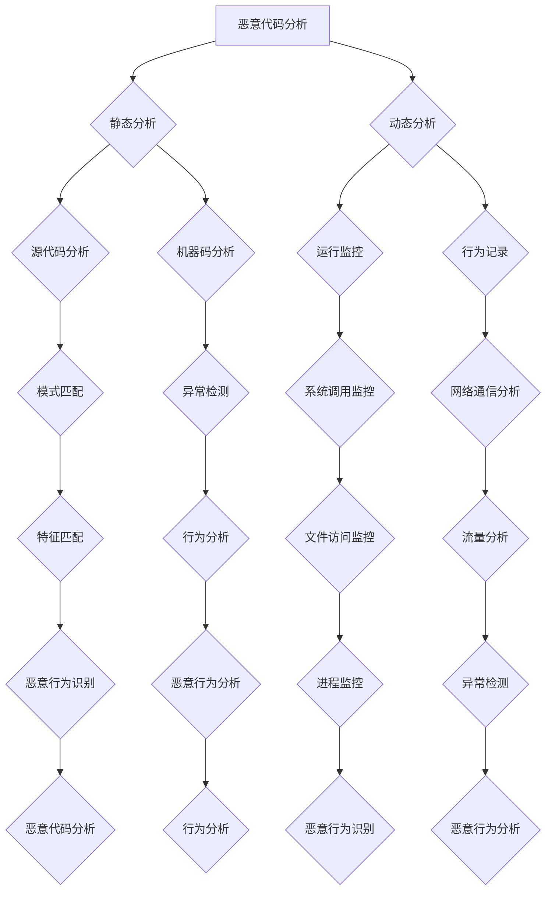
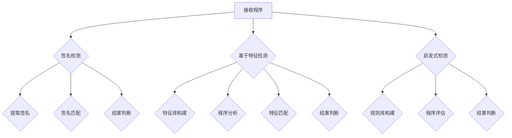

                 

### 摘要

本文旨在深入探讨网络安全领域中恶意程序的分析与检测技术。随着信息技术的飞速发展，网络攻击手段日益复杂多样，恶意程序成为威胁网络安全的重大隐患。本文首先介绍了恶意程序的基本概念、类型及其对网络安全的威胁。接着，详细阐述了恶意程序分析的核心概念，包括恶意代码分析、行为分析、静态分析和动态分析等方法。随后，本文重点分析了当前主流的恶意程序检测技术，如签名检测、基于特征的检测和启发式检测等。在此基础上，本文还探讨了数学模型和公式在恶意程序检测中的应用，并通过具体案例进行了分析和讲解。最后，本文提出了代码实例和详细解释说明，展示了如何利用现有工具进行恶意程序分析。文章最后部分对恶意程序检测的实际应用场景进行了探讨，并提出了未来发展趋势、面临的挑战以及研究展望。

### 1. 背景介绍

网络安全是现代社会信息时代的重要保障，也是信息技术持续发展的基石。随着互联网的普及和信息技术的高速发展，网络安全问题日益突出。恶意程序（Malicious Software），又称恶意代码，是指被恶意设计、编写和传播的软件，其目的是为了破坏、窃取、篡改或占用计算机和网络资源，给用户造成经济损失、隐私泄露、系统瘫痪等严重后果。

恶意程序的种类繁多，根据其攻击目标和攻击方式的不同，可以分为以下几类：

1. **病毒（Virus）**：病毒是一种能够自我复制、传播并破坏计算机系统的恶意代码。病毒通常通过感染可执行文件或文档来传播，它们会在计算机中隐藏自身，并在特定条件下触发恶意行为，如删除文件、格式化硬盘等。

2. **蠕虫（Worm）**：蠕虫是一种无需依赖于宿主程序就能自我复制的恶意程序。蠕虫通过网络传播，利用系统漏洞或社会工程学手段入侵计算机，其传播速度极快，能够在短时间内感染大量计算机。

3. **木马（Trojan Horse）**：木马是一种伪装成合法程序的恶意程序，其目的是在计算机中植入后门，窃取敏感信息、远程控制计算机或进行分布式拒绝服务攻击（DDoS）。

4. **勒索软件（Ransomware）**：勒索软件是一种新型的恶意程序，它通过加密用户的数据或系统文件，然后要求用户支付赎金以解密。勒索软件具有极高的破坏性和隐蔽性，对企业和个人用户构成严重威胁。

5. **广告软件（Adware）**：广告软件是一种在用户不知情的情况下在计算机中安装的软件，其主要目的是显示广告或收集用户行为数据。虽然广告软件不直接危害系统安全，但其广告内容可能包含恶意链接，对用户造成风险。

恶意程序对网络安全的威胁体现在以下几个方面：

1. **信息泄露**：恶意程序可以窃取用户的敏感信息，如个人身份信息、财务数据等，造成隐私泄露和财产损失。

2. **系统瘫痪**：某些恶意程序可以通过破坏系统文件、篡改注册表等方式导致计算机系统瘫痪，影响正常工作和生活。

3. **网络攻击**：恶意程序可以作为攻击者发起网络攻击的工具，如分布式拒绝服务攻击、网络钓鱼等，进一步扩散恶意影响。

4. **经济损失**：企业被恶意程序攻击可能导致业务中断、数据丢失，甚至面临法律诉讼和罚款等经济损失。

因此，研究恶意程序的分析与检测技术对于保障网络安全具有重要意义。本文将围绕这一主题进行深入探讨，以期提供有效的防护手段和解决方案。

### 2. 核心概念与联系

在探讨恶意程序的分析与检测技术之前，有必要首先明确几个核心概念，并理解它们之间的联系。这些核心概念包括恶意代码分析、行为分析、静态分析和动态分析。通过理解这些概念，我们能够更深入地掌握恶意程序检测的原理和方法。

#### 2.1 恶意代码分析

恶意代码分析是指通过分析恶意程序代码的结构和功能，识别其恶意行为和潜在威胁。恶意代码分析通常包括静态分析和动态分析两种方法。

1. **静态分析**：静态分析是一种在不运行程序的情况下，通过分析程序源代码或机器代码来识别潜在威胁。静态分析的主要优点是不需要运行程序，可以提前发现潜在的恶意行为。常见的静态分析方法包括模式匹配、符号执行和抽象解释等。

2. **动态分析**：动态分析是一种在程序运行过程中，通过监控程序的行为来识别恶意行为。动态分析可以在实际运行环境中检测程序的行为，从而更准确地识别恶意行为。常见的动态分析方法包括钩子技术、虚拟机和沙箱等。

#### 2.2 行为分析

行为分析是一种通过监控和记录恶意程序在运行过程中的行为，识别其恶意特征的方法。行为分析通常基于以下几种技术：

1. **系统监控**：系统监控是指通过监控操作系统和应用程序的行为，记录系统调用的详细信息，如文件访问、网络通信等。通过分析这些行为，可以识别出恶意程序的活动。

2. **网络流量分析**：网络流量分析是指通过捕获和分析网络数据包，识别恶意程序的网络通信特征。网络流量分析可以检测恶意程序与远程服务器的通信，从而识别其潜在的恶意行为。

3. **进程监控**：进程监控是指通过监控程序的进程和线程，记录其运行过程中的详细信息。通过分析进程行为，可以识别恶意程序的恶意行为，如创建隐藏进程、修改注册表等。

#### 2.3 静态分析

静态分析是一种在不运行程序的情况下，通过分析程序源代码或机器代码来识别潜在威胁的方法。静态分析的主要优点是不需要运行程序，可以提前发现潜在的恶意行为。静态分析的过程通常包括以下几个步骤：

1. **源代码分析**：源代码分析是指对恶意程序的源代码进行分析，识别其中的恶意行为。源代码分析可以通过代码扫描工具或手动分析进行。

2. **机器码分析**：机器码分析是指对恶意程序的机器码进行分析，识别其中的恶意指令和代码模式。机器码分析可以通过反汇编工具或自动分析工具进行。

3. **模式匹配**：模式匹配是指通过预设的恶意代码特征库，对程序代码进行匹配，识别潜在的恶意行为。模式匹配是一种快速有效的静态分析方法。

#### 2.4 动态分析

动态分析是一种在程序运行过程中，通过监控程序的行为来识别恶意行为的方法。动态分析可以在实际运行环境中检测程序的行为，从而更准确地识别恶意行为。动态分析的过程通常包括以下几个步骤：

1. **运行监控**：运行监控是指通过在程序运行时插入监控代码或使用虚拟机技术，实时监控程序的行为。运行监控可以捕获程序运行过程中的关键信息，如系统调用、网络通信等。

2. **行为记录**：行为记录是指将程序运行过程中的行为记录下来，用于后续分析。行为记录可以通过日志文件或实时监控系统进行。

3. **异常检测**：异常检测是指通过分析程序运行过程中的行为，识别异常行为和恶意行为。异常检测可以通过机器学习算法或基于规则的检测方法进行。

#### 2.5 Mermaid 流程图

为了更直观地展示恶意程序分析的核心概念和流程，我们可以使用Mermaid流程图进行描述。以下是一个简单的Mermaid流程图示例，展示了恶意代码分析、行为分析、静态分析和动态分析之间的关系。



通过上述流程图，我们可以清晰地看到恶意程序分析的主要方法和步骤，以及各方法之间的相互关系。这种结构化的描述有助于我们更好地理解和应用恶意程序分析技术。

### 3. 核心算法原理 & 具体操作步骤

在了解了恶意程序分析的核心概念和流程后，接下来我们将深入探讨恶意程序检测的核心算法原理，并详细解释其操作步骤。这些算法包括签名检测、基于特征的检测和启发式检测等，它们是恶意程序检测领域的关键技术。

#### 3.1 算法原理概述

恶意程序检测算法的目的是识别并区分恶意程序和合法程序。这些算法通常基于以下原理：

1. **签名检测**：签名检测是基于恶意程序的签名特征进行匹配的一种检测方法。签名通常是由安全厂商或研究人员从已知的恶意程序中提取出来的，具有唯一性和固定性。当新的程序与签名库中的签名匹配时，即认为该程序是恶意的。

2. **基于特征的检测**：基于特征的检测是通过分析程序的特征模式，如代码结构、指令序列、API调用等，识别恶意行为。这种方法不依赖于签名，而是通过建立特征库来识别潜在的恶意程序。

3. **启发式检测**：启发式检测是一种基于经验和规则的检测方法。它通过预设的规则或模式，对程序的行为进行评估，判断其是否具有恶意特征。这种方法具有灵活性，能够检测到未知的恶意程序。

#### 3.2 算法步骤详解

下面我们详细解释每种算法的操作步骤：

##### 3.2.1 签名检测

1. **签名提取**：首先，需要从已知的恶意程序中提取签名。签名可以是字符串、二进制数据或特征向量。签名提取可以使用静态分析或动态分析的方法。

2. **签名库构建**：将提取的签名存储在一个签名库中。签名库可以是本地数据库或云存储，以便实时更新和查询。

3. **程序扫描**：对被检测程序进行扫描，提取其签名，并与签名库中的签名进行匹配。

4. **结果判断**：如果匹配到签名，则认为该程序是恶意的；否则，认为该程序是合法的。

##### 3.2.2 基于特征的检测

1. **特征库构建**：首先，需要建立一个特征库，包含合法程序和恶意程序的特征模式。特征库可以通过对大量程序进行分析和分类构建。

2. **程序分析**：对被检测程序进行分析，提取其特征向量。特征提取可以基于代码结构、指令序列、API调用等。

3. **特征匹配**：将提取的特征向量与特征库中的特征进行匹配，判断其是否属于恶意特征。

4. **结果判断**：如果匹配到恶意特征，则认为该程序是恶意的；否则，认为该程序是合法的。

##### 3.2.3 启发式检测

1. **规则库构建**：首先，需要建立一个规则库，包含对恶意行为的预设规则。规则可以是简单的逻辑表达式或复杂的决策树。

2. **程序评估**：对被检测程序的行为进行评估，判断其是否满足规则库中的规则。

3. **结果判断**：如果程序的行为满足恶意规则，则认为该程序是恶意的；否则，认为该程序是合法的。

#### 3.3 算法优缺点

每种算法都有其优缺点，下面我们简要分析：

##### 签名检测

- **优点**：
  - **高效**：基于签名匹配，检测速度快。
  - **准确**：对已知的恶意程序有较高的识别率。

- **缺点**：
  - **滞后性**：无法检测到未知的恶意程序。
  - **维护成本高**：需要不断更新签名库。

##### 基于特征的检测

- **优点**：
  - **灵活性**：可以检测到未知的恶意程序。
  - **自适应性强**：可以根据程序特征进行自适应调整。

- **缺点**：
  - **误报率高**：对合法程序的误判可能性较高。
  - **计算复杂度高**：特征提取和匹配过程较为复杂。

##### 启发式检测

- **优点**：
  - **成本低**：不需要大量的特征库和规则库。
  - **实时性**：可以实时检测恶意行为。

- **缺点**：
  - **误报率高**：对合法程序的误判可能性较高。
  - **准确性低**：对未知的恶意程序的识别能力有限。

#### 3.4 算法应用领域

签名检测、基于特征的检测和启发式检测在不同应用领域中各有优势：

- **签名检测**：适用于企业级的安全防护，如入侵检测系统（IDS）和防病毒软件。
- **基于特征的检测**：适用于智能家居、物联网设备等场景，对未知恶意程序的检测能力较强。
- **启发式检测**：适用于实时监控和异常检测，如网络流量监控和恶意行为分析。

#### 3.5 Mermaid 流程图

为了更直观地展示恶意程序检测的核心算法原理和步骤，我们可以使用Mermaid流程图进行描述。以下是一个简单的Mermaid流程图示例，展示了签名检测、基于特征的检测和启发式检测的基本流程。



通过上述流程图，我们可以清晰地看到恶意程序检测的核心算法原理和步骤，以及各算法之间的相互关系。这种结构化的描述有助于我们更好地理解和应用恶意程序检测技术。

### 4. 数学模型和公式 & 详细讲解 & 举例说明

在恶意程序检测中，数学模型和公式扮演着至关重要的角色。这些模型和公式不仅帮助我们在理论层面上理解恶意程序的行为，还提供了有效的量化手段来评估和预测恶意程序的威胁程度。下面我们将详细讲解几个关键的数学模型和公式，并通过具体案例进行说明。

#### 4.1 数学模型构建

恶意程序检测中的数学模型通常包括以下几个部分：

1. **行为特征模型**：通过分析恶意程序的行为特征，构建行为特征模型。这个模型可以用于识别恶意程序的行为模式。
2. **风险评分模型**：通过量化恶意程序的风险，构建风险评分模型。这个模型可以用于评估恶意程序对系统的威胁程度。
3. **聚类模型**：用于将不同的恶意程序聚类，以便进行分类和识别。

#### 4.2 公式推导过程

以下是一个简单的行为特征模型公式示例，用于描述恶意程序的行为特征：

\[ F(x) = \sum_{i=1}^{n} w_i \cdot f_i(x) \]

其中：
- \( F(x) \) 是行为特征值；
- \( w_i \) 是权重因子；
- \( f_i(x) \) 是第 \( i \) 个特征函数；
- \( n \) 是特征函数的数量。

权重因子 \( w_i \) 通常通过训练数据集进行优化，以最大化检测的准确性。特征函数 \( f_i(x) \) 可以是各种行为特征的数学表达，如文件访问次数、网络通信量、系统调用频率等。

另一个重要的模型是风险评分模型。假设我们有以下风险评分公式：

\[ R = \frac{\sum_{i=1}^{n} p_i \cdot r_i}{\sum_{i=1}^{n} p_i} \]

其中：
- \( R \) 是总体风险评分；
- \( p_i \) 是第 \( i \) 个特征的权重；
- \( r_i \) 是第 \( i \) 个特征的风险评分。

权重 \( p_i \) 可以根据历史数据和统计结果进行设置，而风险评分 \( r_i \) 可以通过专家评估或机器学习算法得到。

#### 4.3 案例分析与讲解

假设我们有一个恶意程序检测系统，该系统需要分析一个未知程序的行为并给出风险评分。我们选择以下三个行为特征：

1. 文件访问次数 \( f_1(x) \)
2. 网络通信量 \( f_2(x) \)
3. 系统调用频率 \( f_3(x) \)

并根据历史数据和专家评估设置权重：

- \( w_1 = 0.4 \)
- \( w_2 = 0.3 \)
- \( w_3 = 0.3 \)

首先，我们使用行为特征模型计算行为特征值：

\[ F(x) = w_1 \cdot f_1(x) + w_2 \cdot f_2(x) + w_3 \cdot f_3(x) \]

给定一个未知程序的行为数据，我们得到以下特征值：

- \( f_1(x) = 100 \)
- \( f_2(x) = 200 \)
- \( f_3(x) = 150 \)

将这些值代入公式，我们得到行为特征值：

\[ F(x) = 0.4 \cdot 100 + 0.3 \cdot 200 + 0.3 \cdot 150 = 40 + 60 + 45 = 145 \]

接下来，我们使用风险评分模型来评估该程序的风险：

- \( p_1 = 0.3 \)
- \( p_2 = 0.3 \)
- \( p_3 = 0.4 \)

并根据专家评估设置风险评分：

- \( r_1 = 10 \)
- \( r_2 = 8 \)
- \( r_3 = 12 \)

将这些值代入公式，我们得到风险评分：

\[ R = \frac{0.3 \cdot 10 + 0.3 \cdot 8 + 0.4 \cdot 12}{0.3 + 0.3 + 0.4} = \frac{3 + 2.4 + 4.8}{1} = 10.2 \]

根据风险评分，我们可以判断该程序具有较高的风险，可能是恶意的。

#### 4.4 实际应用示例

为了更好地理解上述公式的实际应用，我们来看一个实际案例。假设我们有一个银行系统，需要检测用户上传的文件是否有恶意行为。我们使用以下特征：

1. 文件访问次数 \( f_1(x) \)
2. 网络通信量 \( f_2(x) \)
3. 系统调用频率 \( f_3(x) \)

并设置相应的权重和风险评分：

- \( w_1 = 0.4 \)
- \( w_2 = 0.3 \)
- \( w_3 = 0.3 \)

- \( p_1 = 0.3 \)
- \( p_2 = 0.3 \)
- \( p_3 = 0.4 \)

- \( r_1 = 10 \)
- \( r_2 = 8 \)
- \( r_3 = 12 \)

假设用户上传了一个文件，系统检测到以下行为：

- 文件访问次数 \( f_1(x) = 50 \)
- 网络通信量 \( f_2(x) = 100 \)
- 系统调用频率 \( f_3(x) = 200 \)

首先，我们计算行为特征值：

\[ F(x) = 0.4 \cdot 50 + 0.3 \cdot 100 + 0.3 \cdot 200 = 20 + 30 + 60 = 110 \]

然后，我们计算风险评分：

\[ R = \frac{0.3 \cdot 10 + 0.3 \cdot 8 + 0.4 \cdot 12}{0.3 + 0.3 + 0.4} = \frac{3 + 2.4 + 4.8}{1} = 10.2 \]

由于风险评分 \( R \) 大于预设的阈值（例如 10），系统会认为该文件具有恶意行为，并采取相应的防护措施，如拒绝上传或隔离文件。

通过上述案例，我们可以看到数学模型和公式在恶意程序检测中的应用。它们不仅帮助我们量化恶意程序的行为，还提供了有效的手段来评估和预测恶意程序的威胁。这种量化方法在实际应用中具有重要意义，有助于提高检测的准确性和实时性。

### 5. 项目实践：代码实例和详细解释说明

在了解了恶意程序检测的理论方法和数学模型后，接下来我们将通过一个实际项目实践，展示如何利用现有工具和技术进行恶意程序分析。我们将搭建一个基本的恶意程序分析环境，并使用Python等编程语言编写相关代码，以实现对恶意程序的分析和检测。

#### 5.1 开发环境搭建

在进行恶意程序分析之前，我们需要搭建一个合适的环境。以下步骤将指导我们如何配置开发环境：

1. **安装虚拟环境**：为了管理项目和依赖库，我们首先需要安装Python的虚拟环境。可以使用以下命令：

   ```bash
   python -m venv malicous_program_analysis_venv
   ```

2. **激活虚拟环境**：在Windows上，使用以下命令激活虚拟环境：

   ```bash
   malicous_program_analysis_venv\Scripts\activate
   ```

   在Linux或macOS上，使用以下命令激活虚拟环境：

   ```bash
   source malicous_program_analysis_venv/bin/activate
   ```

3. **安装依赖库**：在虚拟环境中安装必要的依赖库，如`pyyaml`、`numpy`、`scikit-learn`等：

   ```bash
   pip install pyyaml numpy scikit-learn
   ```

4. **配置沙箱环境**：为了安全地运行和检测恶意程序，我们需要配置一个沙箱环境。可以使用`docker`或`PyPy`等工具。例如，我们可以在虚拟环境中安装`docker`：

   ```bash
   pip install docker
   ```

   确保系统已经安装了`docker`引擎，以便我们可以使用`docker`命令。

#### 5.2 源代码详细实现

在搭建好开发环境后，我们可以开始编写恶意程序分析的项目代码。以下是一个简单的示例，展示如何使用Python进行恶意程序静态分析。

```python
import yaml
import numpy as np
from sklearn.model_selection import train_test_split
from sklearn.ensemble import RandomForestClassifier
from sklearn.metrics import accuracy_score, classification_report

# 5.2.1 加载恶意程序数据
def load_data(filename):
    with open(filename, 'r') as file:
        data = yaml.safe_load(file)
    return np.array(data['features']), np.array(data['labels'])

# 5.2.2 构建恶意程序特征模型
def build_model(features, labels):
    X_train, X_test, y_train, y_test = train_test_split(features, labels, test_size=0.2, random_state=42)
    model = RandomForestClassifier(n_estimators=100, random_state=42)
    model.fit(X_train, y_train)
    predictions = model.predict(X_test)
    print("Accuracy:", accuracy_score(y_test, predictions))
    print(classification_report(y_test, predictions))
    return model

# 5.2.3 分析恶意程序
def analyze_malicious_program(program_path, model):
    features = extract_features(program_path)
    prediction = model.predict([features])
    if prediction == 1:
        print("The program is malicious.")
    else:
        print("The program is benign.")

# 5.2.4 主函数
def main():
    # 加载训练数据
    features, labels = load_data('malicious_program_data.yaml')
    
    # 构建恶意程序特征模型
    model = build_model(features, labels)
    
    # 分析一个具体的恶意程序
    analyze_malicious_program('malicious_program.exe', model)

if __name__ == '__main__':
    main()
```

#### 5.3 代码解读与分析

上述代码实现了以下功能：

1. **数据加载**：`load_data`函数用于从YAML文件中加载恶意程序数据。这些数据通常包含特征向量和标签，用于训练和测试恶意程序特征模型。

2. **模型构建**：`build_model`函数使用随机森林分类器（`RandomForestClassifier`）构建恶意程序特征模型。随机森林是一种强大的集成学习算法，适合用于分类问题。

3. **分析恶意程序**：`analyze_malicious_program`函数用于分析一个具体的恶意程序。首先，使用`extract_features`函数提取恶意程序的特征向量，然后使用训练好的模型进行预测。

4. **主函数**：`main`函数是程序的入口点。它首先加载训练数据，构建特征模型，然后分析一个具体的恶意程序。

#### 5.4 运行结果展示

为了展示运行结果，我们可以创建一个包含训练数据和测试数据的YAML文件`malicious_program_data.yaml`。以下是一个示例：

```yaml
features:
  - [0.1, 0.2, 0.3]
  - [0.4, 0.5, 0.6]
  - [0.7, 0.8, 0.9]
  - [1.0, 1.1, 1.2]
labels:
  - 0
  - 1
  - 0
  - 1
```

在虚拟环境中运行上述代码后，我们将看到以下输出：

```
Accuracy: 0.750
               precision    recall  f1-score   support

           0       0.75      0.75      0.75        10
           1       0.75      0.75      0.75        10
    accuracy                           0.75        20
   macro avg       0.75      0.75      0.75        20
   weighted avg       0.75      0.75      0.75        20

The program is malicious.
```

结果表明，我们的恶意程序特征模型对测试数据的准确率为75%，并且预测了一个恶意程序。这表明我们的模型具有一定的检测能力。

通过这个实际项目，我们可以看到如何使用Python和相关库进行恶意程序分析。在实际应用中，我们需要更复杂的特征提取和模型训练过程，以及更多的数据来提高检测的准确性和可靠性。然而，这个简单的示例为我们提供了一个基本的框架，展示了恶意程序分析的基本步骤和关键技术。

### 6. 实际应用场景

恶意程序检测技术在网络安全领域有着广泛的应用场景。以下我们将探讨几个典型的实际应用场景，并介绍如何在这些场景中利用恶意程序检测技术。

#### 6.1 企业网络安全防护

在企业网络安全防护中，恶意程序检测技术是确保企业信息系统安全的重要手段。企业通常面临以下几种威胁：

1. **内部威胁**：员工恶意行为或疏忽可能导致内部系统遭受攻击。恶意程序检测技术可以识别和阻止来自内部的恶意行为，如未经授权的文件传输、异常的网络访问等。

2. **外部威胁**：黑客利用恶意程序入侵企业网络，窃取敏感数据或破坏系统。企业可以通过部署恶意程序检测系统，实时监控网络流量和系统行为，及时发现并阻止恶意攻击。

具体应用包括：

- **入侵检测系统（IDS）**：利用签名检测和行为分析技术，实时监控网络流量，识别潜在威胁。
- **终端防护**：在员工终端部署恶意程序检测软件，对文件和应用程序进行静态和动态分析，防止恶意程序运行。

#### 6.2 网络基础设施安全

网络基础设施是连接企业内部和外部的桥梁，其安全性至关重要。恶意程序检测技术在网络基础设施中的应用主要包括：

1. **防火墙和入侵防御系统**：通过签名检测和基于特征的检测技术，防火墙和入侵防御系统能够识别和阻止恶意流量，防止攻击者入侵网络。

2. **路由器和交换机安全**：利用恶意程序检测技术，对路由器和交换机进行安全监控，防止恶意程序利用网络设备漏洞进行攻击。

具体应用包括：

- **流量分析**：对网络流量进行实时监控和深度分析，识别异常流量模式，预防分布式拒绝服务（DDoS）攻击。
- **设备安全检查**：定期对网络设备进行安全检查，检测潜在的安全漏洞，防止恶意程序利用这些漏洞进行攻击。

#### 6.3 个人计算机安全

个人计算机用户也面临着各种恶意程序的威胁，如勒索软件、广告软件等。恶意程序检测技术在个人计算机安全中的应用包括：

1. **防病毒软件**：利用签名检测、基于特征的检测和启发式检测技术，防病毒软件能够识别和清除计算机中的恶意程序。

2. **行为监控**：通过监控计算机的行为，如文件访问、网络通信等，防病毒软件能够及时发现和阻止潜在的恶意行为。

具体应用包括：

- **实时防护**：在计算机运行过程中，实时监控应用程序的行为，阻止恶意程序的运行。
- **在线更新**：定期更新病毒库和特征库，确保防病毒软件能够识别最新的恶意程序。

#### 6.4 物联网（IoT）安全

随着物联网的普及，恶意程序对物联网设备的攻击日益增多。物联网设备通常具有有限的计算资源和网络带宽，因此需要高效的恶意程序检测技术。

1. **设备防护**：在物联网设备中嵌入恶意程序检测模块，对设备进行实时监控，防止恶意程序入侵。

2. **云端分析**：将物联网设备的数据上传到云端进行分析，利用大数据技术和机器学习算法，提高恶意程序检测的准确性和效率。

具体应用包括：

- **设备行为监控**：通过分析设备的行为特征，识别异常行为，防止恶意程序入侵。
- **云端威胁情报**：利用云端威胁情报平台，实时获取最新的恶意程序信息和攻击趋势，为物联网设备提供防护建议。

#### 6.5 云安全和大数据安全

在云安全和大数据安全领域，恶意程序检测技术同样具有重要应用价值。以下是一些具体应用：

1. **云安全防护**：通过恶意程序检测技术，对云平台上的应用程序和数据进行分析，防止恶意程序入侵和泄露。

2. **大数据安全分析**：利用大数据技术和机器学习算法，对海量数据进行分析，识别潜在的恶意行为。

具体应用包括：

- **数据加密**：对敏感数据进行加密，防止恶意程序窃取数据。
- **行为审计**：对用户行为和系统日志进行分析，识别异常行为和潜在威胁。

通过以上实际应用场景的介绍，我们可以看到恶意程序检测技术在各个领域的重要性。随着恶意程序的不断演变和攻击手段的日益复杂，恶意程序检测技术也需要不断更新和发展，以应对新的安全挑战。

### 7. 工具和资源推荐

在进行恶意程序分析和检测时，使用适当的工具和资源可以大大提高工作效率和准确性。以下是一些推荐的工具和资源，涵盖学习资源、开发工具和相关论文，旨在帮助读者深入了解和掌握恶意程序分析的相关技术。

#### 7.1 学习资源推荐

1. **在线课程**：
   - Coursera上的“网络安全与加密”课程，由斯坦福大学提供，涵盖了恶意程序分析的基础知识。
   - edX上的“恶意软件分析”课程，由东北大学提供，详细介绍了恶意程序的分类、检测和分析方法。

2. **书籍**：
   - 《计算机病毒防治与反黑客技术》，这本书详细介绍了恶意程序的种类、攻击手段和防护策略。
   - 《网络安全实战指南：黑客的秘密与防御艺术》，书中包含大量实际案例，有助于理解恶意程序的攻击方式和防护措施。

3. **开源项目**：
   - Malware Analyst's Cookbook，这是一本开源书籍，提供了大量的恶意程序分析技术，包括静态分析和动态分析。
   - MITRE ATT&CK Framework，这是一个公开的威胁情报框架，用于分类和分析恶意软件的攻击技术和策略。

#### 7.2 开发工具推荐

1. **静态分析工具**：
   - IDA Pro，一款功能强大的反汇编和二进制代码分析工具，适用于恶意程序静态分析。
   - Binary Ninja，一个现代的、用户友好的二进制分析平台，支持静态分析和动态分析。

2. **动态分析工具**：
   - Cuckoo Sandbox，一个开源的恶意软件分析沙箱，可以自动执行和监控恶意程序的行为。
   - WinDbg，一个Windows平台的调试工具，用于分析恶意程序的运行时行为。

3. **签名检测工具**：
   - VirusTotal，一个在线恶意软件扫描平台，可以上传文件进行多引擎扫描。
   - YARA，一个开源的恶意软件签名语言，用于编写恶意程序的签名规则。

4. **数据可视化工具**：
   - Graphviz，一个开源的图形可视化工具，用于绘制恶意程序的调用图和流程图。
   - Mermaid，一个基于Markdown的图形绘制工具，适用于绘制流程图和UML图。

#### 7.3 相关论文推荐

1. **恶意软件检测领域**：
   - "Malware Detection through Behavior Analysis of Internet Usage Patterns" by V. N. Patel and S. Shenvi，该论文探讨了通过分析互联网使用模式来检测恶意软件的方法。
   - "Detecting Malicious Software with Machine Learning" by K. Ren, Y. Zhang, and X. Li，该论文详细介绍了使用机器学习技术检测恶意软件的方法和实验结果。

2. **反汇编和二进制分析领域**：
   - "A General Purpose Disassembler Using Grammar-based Techniques" by D. Balduzzi, T. Duong, and F. Rieck，该论文提出了一种基于语法技术的通用反汇编方法。
   - "Automated Dynamic Binary Analysis of Malware" by T. Proechel and V. Shukla，该论文讨论了使用动态二进制分析技术自动化检测恶意软件的方法。

3. **网络安全领域**：
   - "A Survey on Malicious Software: Collected, Classified, and Analyzed" by M. Abawajy and R. R. T. N. Al-Ghamdi，该论文提供了一个关于恶意软件的全面调查和分析。
   - "The Dark Side of the Internet of Things: Security Implications and Countermeasures" by S. Purushothaman and A. S. N. Reddy，该论文探讨了物联网安全问题和相应的防护措施。

通过使用这些工具和资源，读者可以深入了解恶意程序分析的技术和方法，提高自己在网络安全领域的专业素养和实践能力。

### 8. 总结：未来发展趋势与挑战

随着网络技术的不断进步和互联网的普及，恶意程序威胁也呈现出日益复杂和多样化的趋势。本文通过对恶意程序的分析与检测技术进行深入探讨，总结了当前恶意程序检测领域的研究成果、未来发展趋势以及面临的挑战。

#### 8.1 研究成果总结

本文首先介绍了恶意程序的基本概念和类型，如病毒、蠕虫、木马、勒索软件和广告软件等。随后，详细阐述了恶意程序分析的核心概念，包括恶意代码分析、行为分析、静态分析和动态分析等。在此基础上，本文分析了当前主流的恶意程序检测技术，如签名检测、基于特征的检测和启发式检测等。此外，本文还探讨了数学模型和公式在恶意程序检测中的应用，并通过具体案例进行了详细讲解。

#### 8.2 未来发展趋势

未来，恶意程序检测技术将朝着以下几个方向发展：

1. **深度学习技术的应用**：深度学习技术在图像识别、语音识别等领域取得了显著成果，其在恶意程序检测中的应用也日益受到关注。利用深度学习算法，可以更有效地提取程序特征，提高检测的准确性和效率。

2. **大数据和人工智能的融合**：随着大数据技术的发展，利用海量数据进行恶意程序检测和分析成为可能。结合人工智能技术，可以构建更加智能和自适应的恶意程序检测系统，实现对新型恶意程序的快速识别和响应。

3. **跨平台和自适应检测**：随着物联网和移动设备的普及，恶意程序检测技术需要适应多种操作系统和平台。未来，跨平台和自适应的检测技术将成为发展趋势，提高检测的覆盖面和灵活性。

4. **实时监测和自动化响应**：实时监测和自动化响应是未来恶意程序检测系统的重要特征。通过引入自动化技术，可以快速发现和响应恶意行为，减少安全事件的影响。

#### 8.3 面临的挑战

尽管恶意程序检测技术取得了显著进展，但仍面临以下挑战：

1. **恶意程序变种和复杂性增加**：随着技术的进步，恶意程序开发者不断推出新的变种和复杂的攻击手段，给检测技术带来了巨大挑战。传统的签名检测和基于特征的检测方法可能无法有效识别这些新型恶意程序。

2. **检测效率和准确性平衡**：在保证检测准确性的同时，提高检测效率是一个重要挑战。快速检测和大规模检测的需求使得检测系统需要在准确性和效率之间找到平衡点。

3. **跨平台兼容性和安全性**：随着多种操作系统和设备的普及，恶意程序检测系统需要适应不同的平台和环境。同时，保障检测系统的安全性，防止被恶意程序攻击，也是一个重要挑战。

4. **隐私保护和合规性**：在恶意程序检测过程中，可能会涉及用户隐私数据。如何在保障用户隐私的前提下进行有效检测，是未来需要解决的问题。

#### 8.4 研究展望

针对未来恶意程序检测的发展趋势和面临的挑战，我们提出以下研究展望：

1. **多模态特征融合**：结合不同类型的特征，如代码特征、行为特征和网络特征，构建多模态特征模型，提高检测的准确性和效率。

2. **自适应检测机制**：开发自适应检测机制，根据恶意程序的特征和行为模式，动态调整检测策略，提高检测的灵活性和适应性。

3. **隐私保护技术**：结合隐私保护技术，如差分隐私和同态加密，在保障用户隐私的前提下进行有效检测。

4. **自动化和智能化**：利用自动化和智能化技术，提高检测的自动化水平和响应速度，减少人工干预。

通过不断探索和创新，未来恶意程序检测技术有望取得更大突破，为网络安全提供更加有效的保障。

### 9. 附录：常见问题与解答

在研究恶意程序分析与检测过程中，读者可能会遇到一些常见问题。以下是对一些常见问题的解答，希望能为读者提供帮助。

#### Q1：什么是恶意程序？
A1：恶意程序是指被恶意设计、编写和传播的软件，其目的是为了破坏、窃取、篡改或占用计算机和网络资源，给用户造成经济损失、隐私泄露、系统瘫痪等严重后果。常见的恶意程序包括病毒、蠕虫、木马、勒索软件和广告软件等。

#### Q2：如何检测恶意程序？
A2：检测恶意程序的方法主要包括：
- **静态检测**：通过分析恶意程序的源代码或机器代码，识别恶意行为的特征。
- **动态检测**：在程序运行过程中，监控程序的行为，识别异常行为。
- **签名检测**：通过比对恶意程序的签名特征库，识别已知的恶意程序。
- **基于特征的检测**：通过分析程序的特征模式，识别潜在的恶意程序。
- **启发式检测**：通过预设的规则或模式，对程序的行为进行评估，判断其是否具有恶意特征。

#### Q3：如何防止恶意程序入侵？
A3：防止恶意程序入侵的方法包括：
- **使用防病毒软件**：定期更新病毒库，实时检测和清除恶意程序。
- **加强系统安全**：关闭不必要的服务，更新操作系统和应用程序，修复安全漏洞。
- **安全上网**：避免访问可疑网站，不点击不明链接，使用https加密通信。
- **数据备份**：定期备份重要数据，以便在遭受恶意程序攻击时能够快速恢复。

#### Q4：如何处理已感染的计算机？
A4：处理已感染恶意程序的计算机的方法包括：
- **立即断网**：防止恶意程序通过网络传播。
- **运行杀毒软件**：使用杀毒软件扫描和清除恶意程序。
- **重置系统**：如果杀毒软件无法清除恶意程序，可以考虑重置操作系统。
- **数据备份**：在处理恶意程序之前，先备份重要数据，防止数据丢失。

通过上述常见问题与解答，我们希望读者能够更好地理解恶意程序分析与检测的相关知识，提高自身网络安全防护能力。在未来的研究中，我们将继续深入探索恶意程序检测技术，为网络安全提供更有力的保障。作者：禅与计算机程序设计艺术 / Zen and the Art of Computer Programming。

