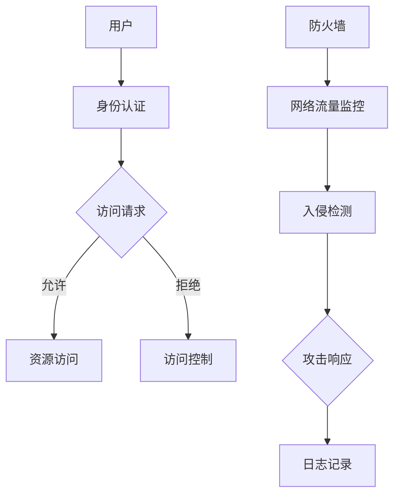

                 

关键词：网络安全，创业，数字时代，守护者，技术，创新，挑战，未来

<|assistant|>摘要：随着数字时代的到来，网络安全成为全球范围内最为紧迫的挑战之一。本文将探讨网络安全领域的创业机遇，分析其在数字时代的重要性，并提供一系列实用的指导，帮助创业者在这个领域取得成功。我们将探讨网络安全的核心概念、算法原理、数学模型，以及实际应用场景，并展望该领域的未来发展。

## 1. 背景介绍

随着互联网的普及和数字化转型的加速，网络安全问题变得日益复杂和严峻。网络攻击、数据泄露、隐私侵犯等事件频繁发生，给个人、企业和整个社会带来了巨大的损失。据统计，全球网络安全支出正在快速增长，预计到2025年将超过1万亿美元。这表明，网络安全已成为一个巨大的市场，蕴藏着巨大的商机。

在这个背景下，网络安全创业成为了一个热门领域。越来越多的创业者投身于网络安全技术的研究和开发，致力于提供更强大、更有效的安全解决方案。然而，创业并非易事，网络安全创业面临着诸多挑战。如何突破技术瓶颈、吸引投资、建立品牌，是每一个网络安全创业者都必须面对的问题。

本文旨在为网络安全创业者提供一些指导，帮助他们在数字时代中找到自己的位置，并成为这一领域的守护者。

## 2. 核心概念与联系

为了更好地理解网络安全，我们需要掌握一些核心概念和原理。以下是网络安全领域的一些关键概念及其相互联系：

### 2.1 网络安全的基本概念

- **威胁**：指可能对网络系统造成损害的行为或事件。
- **漏洞**：指系统中存在的可以被利用的弱点。
- **攻击**：指利用漏洞对系统进行的非法访问或破坏行为。
- **防护**：指采取的一系列措施来保护网络系统不受攻击。
- **安全策略**：指为了确保网络安全而制定的一系列规定和指导方针。

### 2.2 安全架构与模型

- **防火墙**：一种网络安全设备，用于监控和控制进出网络的流量。
- **入侵检测系统（IDS）**：用于检测和响应网络攻击的软件系统。
- **入侵防御系统（IPS）**：在IDS的基础上增加了自动防御功能。
- **安全信息和事件管理（SIEM）**：用于收集、分析和管理安全事件的数据平台。
- **零信任架构**：一种安全模型，强调不信任任何内部或外部实体，所有访问都需验证。

### 2.3 核心技术与算法

- **加密技术**：用于保护数据传输和存储的安全技术。
- **哈希算法**：用于数据完整性验证的算法。
- **认证机制**：用于验证用户身份和授权访问的技术。
- **访问控制**：用于限制用户对系统资源的访问权限的技术。
- **网络流量分析**：用于监控和识别网络攻击的算法。

### 2.4 安全与隐私

- **隐私保护**：确保个人隐私不被泄露或滥用的技术和策略。
- **匿名通信**：用于保护通信隐私的技术，如Tor浏览器。
- **数据脱敏**：用于保护敏感数据不被未授权访问的技术。

### 2.5 Mermaid 流程图

以下是一个简化的网络安全架构的Mermaid流程图：



通过这个流程图，我们可以看到用户请求访问资源时，系统首先进行身份认证。如果认证通过，用户可以访问资源；否则，系统会根据访问控制策略进行相应的处理。同时，防火墙和网络流量监控系统对网络流量进行实时监控，一旦检测到异常情况，入侵检测系统会启动响应机制。

## 3. 核心算法原理 & 具体操作步骤

### 3.1 算法原理概述

网络安全的核心在于保护数据和系统的安全。为了实现这一目标，我们需要使用一系列算法和技术。以下是几个关键的算法原理：

- **加密算法**：用于保护数据在传输和存储过程中的安全性。常见的加密算法有对称加密和非对称加密。
- **哈希算法**：用于数据完整性验证。哈希算法将输入数据转换为一个固定长度的字符串，任何微小的数据变化都会导致哈希值的显著变化。
- **认证算法**：用于验证用户身份和授权访问。常见的认证算法有密码认证、双因素认证等。
- **访问控制算法**：用于限制用户对系统资源的访问权限。常见的访问控制算法有基于角色的访问控制（RBAC）和基于属性的访问控制（ABAC）。

### 3.2 算法步骤详解

以下是这些算法的具体操作步骤：

#### 3.2.1 加密算法

1. **对称加密**：
   - **加密步骤**：发送方使用密钥对数据进行加密，接收方使用相同的密钥进行解密。
   - **解密步骤**：接收方使用密钥对加密数据进行解密，恢复原始数据。

2. **非对称加密**：
   - **加密步骤**：发送方使用接收方的公钥对数据进行加密，接收方使用私钥进行解密。
   - **解密步骤**：接收方使用私钥对加密数据进行解密，恢复原始数据。

#### 3.2.2 哈希算法

1. **哈希计算**：将输入数据通过哈希算法计算出一个哈希值。
2. **哈希验证**：接收方将收到的数据进行哈希计算，并与发送方提供的哈希值进行比较，以验证数据的完整性。

#### 3.2.3 认证算法

1. **密码认证**：
   - **认证步骤**：用户输入密码，系统使用存储的密码哈希值与输入的密码哈希值进行比较。
   - **认证验证**：如果哈希值匹配，用户被认证通过。

2. **双因素认证**：
   - **第一步**：用户输入密码。
   - **第二步**：系统向用户发送一个动态验证码，用户输入验证码。
   - **认证验证**：系统对用户输入的密码和验证码进行验证，如果都正确，用户被认证通过。

#### 3.2.4 访问控制算法

1. **基于角色的访问控制（RBAC）**：
   - **访问控制步骤**：用户拥有一个或多个角色，系统根据角色的权限决定用户是否可以访问特定资源。
   - **访问控制验证**：系统检查用户角色和资源的访问权限，决定是否允许访问。

2. **基于属性的访问控制（ABAC）**：
   - **访问控制步骤**：用户访问资源时，系统根据用户属性（如角色、部门、地理位置等）和资源属性（如权限、类型、访问时间等）进行综合评估。
   - **访问控制验证**：系统根据评估结果决定是否允许访问。

### 3.3 算法优缺点

每种算法都有其优缺点，选择合适的算法取决于具体的应用场景。

- **对称加密**：
  - 优点：加密速度快，安全性高。
  - 缺点：密钥管理复杂，不适合大规模通信。

- **非对称加密**：
  - 优点：解决了密钥分发问题，适用于大规模通信。
  - 缺点：加密速度较慢，安全性相对较低。

- **哈希算法**：
  - 优点：计算速度快，安全性高。
  - 缺点：无法实现解密，只能用于数据完整性验证。

- **密码认证**：
  - 优点：简单易用，成本低。
  - 缺点：安全性相对较低，易受密码泄露攻击。

- **双因素认证**：
  - 优点：安全性高，能够有效防止密码泄露攻击。
  - 缺点：使用复杂，用户体验较差。

- **基于角色的访问控制（RBAC）**：
  - 优点：易于实现和管理，适合大规模组织。
  - 缺点：灵活性较低，无法满足个性化需求。

- **基于属性的访问控制（ABAC）**：
  - 优点：灵活性高，能够满足个性化需求。
  - 缺点：实现复杂，管理成本高。

### 3.4 算法应用领域

各种算法在网络安全领域的应用范围广泛，包括但不限于：

- **数据传输安全**：加密技术用于保护数据在传输过程中的安全性。
- **数据存储安全**：哈希算法用于验证数据的完整性，加密技术用于保护数据存储的安全性。
- **用户认证**：密码认证、双因素认证等算法用于确保用户身份的合法性。
- **访问控制**：基于角色的访问控制（RBAC）、基于属性的访问控制（ABAC）等算法用于保护系统资源的访问权限。

## 4. 数学模型和公式 & 详细讲解 & 举例说明

在网络安全领域，数学模型和公式是理解和实现各种安全算法的基础。以下是几个关键的数学模型和公式及其应用场景。

### 4.1 数学模型构建

#### 4.1.1 对称加密

对称加密的数学模型主要涉及密钥的生成和加密解密过程。

- **密钥生成**：假设A和B是通信的双方，A生成一个随机密钥K，并将其发送给B。
- **加密过程**：A使用K对明文M进行加密，得到密文C = E_K(M)。
- **解密过程**：B使用相同的密钥K对密文C进行解密，得到明文M = D_K(C)。

#### 4.1.2 非对称加密

非对称加密的数学模型涉及公钥和私钥的生成及加密解密过程。

- **公钥和私钥生成**：A生成一对公钥（PUB_A）和私钥（PRIV_A），并将公钥发送给B。
- **加密过程**：B使用A的公钥对明文M进行加密，得到密文C = E_PUB_A(M)。
- **解密过程**：A使用自己的私钥对密文C进行解密，得到明文M = D_PRIV_A(C)。

#### 4.1.3 哈希算法

哈希算法的数学模型是将输入数据映射为固定长度的字符串。

- **哈希计算**：给定一个输入数据M，计算其哈希值H(M)。
- **哈希验证**：接收方将收到的数据M'计算其哈希值H(M')，并与发送方提供的哈希值H(M)进行比较。

### 4.2 公式推导过程

以下是几个关键公式的推导过程：

#### 4.2.1 对称加密

$$ E_K(M) = C = \text{Encrypt}(M, K) $$

$$ D_K(C) = M = \text{Decrypt}(C, K) $$

其中，Encrypt和Decrypt分别是加密和解密函数，K是密钥。

#### 4.2.2 非对称加密

$$ E_PUB_A(M) = C = \text{Encrypt}(M, PUB_A) $$

$$ D_PRIV_A(C) = M = \text{Decrypt}(C, PRIV_A) $$

其中，Encrypt和Decrypt分别是加密和解密函数，PUB_A是公钥，PRIV_A是私钥。

#### 4.2.3 哈希算法

$$ H(M) = \text{Hash}(M) $$

$$ H(M') = \text{Hash}(M') $$

其中，Hash是哈希函数。

### 4.3 案例分析与讲解

以下是一个简单的案例，说明如何使用哈希算法进行数据完整性验证：

#### 4.3.1 案例背景

假设A和B是通信的双方，A发送一个文件给B，B需要验证文件的完整性。

#### 4.3.2 案例步骤

1. **哈希计算**：A使用哈希函数对文件M进行计算，得到哈希值H(M)。
2. **文件发送**：A将文件M发送给B。
3. **哈希验证**：B接收到文件M后，使用相同的哈希函数对文件进行计算，得到哈希值H(M')。
4. **比较哈希值**：B将计算得到的哈希值H(M')与A提供的哈希值H(M)进行比较。
5. **结果判断**：
   - 如果H(M) = H(M')，说明文件未被篡改，可以正常使用。
   - 如果H(M) ≠ H(M')，说明文件可能已被篡改，应采取相应的措施。

#### 4.3.3 案例总结

通过哈希算法，A和B可以高效地验证文件的完整性，确保数据的真实性。这一方法在网络安全和数据完整性验证中具有广泛的应用。

## 5. 项目实践：代码实例和详细解释说明

为了更好地理解网络安全算法的实践应用，我们将通过一个具体的代码实例来展示加密和解密的过程。以下是一个使用Python编写的对称加密和非对称加密的例子。

### 5.1 开发环境搭建

在开始编写代码之前，我们需要搭建一个开发环境。以下是所需的环境和步骤：

- **操作系统**：Windows、Linux或MacOS
- **编程语言**：Python 3.x
- **依赖库**：`pycryptodome`，可以pip安装

#### 安装依赖库

```shell
pip install pycryptodome
```

### 5.2 源代码详细实现

以下是对称加密和非对称加密的Python代码示例：

```python
from Crypto.PublicKey import RSA
from Crypto.Cipher import AES, PKCS1_OAEP
from Crypto.Random import get_random_bytes
import base64

# 对称加密
def symmetric_encrypt_decrypt(plaintext, key):
    cipher = AES.new(key, AES.MODE_GCM)
    ciphertext, tag = cipher.encrypt_and_digest(plaintext)
    return base64.b64encode(cipher.nonce + cipher.tag + ciphertext).decode('utf-8')

# 非对称加密
def asymmetric_encrypt_decrypt(plaintext, public_key, private_key):
    rsa_cipher = PKCS1_OAEP.new(public_key)
    ciphertext = rsa_cipher.encrypt(plaintext)
    rsa_cipher = PKCS1_OAEP.new(private_key)
    decrypted_plaintext = rsa_cipher.decrypt(ciphertext)
    return decrypted_plaintext

# 生成RSA密钥对
def generate_rsa_keypair():
    key = RSA.generate(2048)
    private_key = key.export_key()
    public_key = key.publickey().export_key()
    return private_key, public_key

# 主函数
def main():
    # 生成RSA密钥对
    private_key, public_key = generate_rsa_keypair()

    # 生成AES密钥
    aes_key = get_random_bytes(16)

    # 对称加密
    plaintext = "Hello, this is a secret message!"
    ciphertext = symmetric_encrypt_decrypt(plaintext, aes_key)
    print("Symmetrically encrypted message:", ciphertext)

    # 非对称加密
    encrypted_aes_key = asymmetric_encrypt_decrypt(aes_key, public_key, private_key)
    print("Asymmetrically encrypted AES key:", encrypted_aes_key)

    # 对称解密
    decrypted_plaintext = symmetric_encrypt_decrypt(ciphertext, aes_key)
    print("Symmetrically decrypted message:", decrypted_plaintext)

if __name__ == "__main__":
    main()
```

### 5.3 代码解读与分析

以下是对代码的详细解读和分析：

1. **对称加密和解密**：
   - `Crypto.Cipher.AES`：用于实现AES加密算法。
   - `AES.new(key, AES.MODE_GCM)`：创建一个AES加密对象，`key`是16字节的随机密钥，`MODE_GCM`表示使用GCM模式进行加密。
   - `cipher.encrypt_and_digest(plaintext)`：对明文进行加密并计算消息认证码（MAC）。
   - `base64.b64encode()`：将加密后的数据和MAC编码为base64字符串，便于传输和存储。

2. **非对称加密和解密**：
   - `Crypto.PublicKey.RSA`：用于生成RSA密钥对。
   - `PKCS1_OAEP.new(public_key)`和`PKCS1_OAEP.new(private_key)`：创建RSA加密对象，`public_key`是公钥，`private_key`是私钥。
   - `rsa_cipher.encrypt(plaintext)`和`rsa_cipher.decrypt(ciphertext)`：使用RSA算法对数据进行加密和解密。

3. **主函数**：
   - `generate_rsa_keypair()`：生成RSA密钥对。
   - `get_random_bytes(16)`：生成16字节的随机AES密钥。
   - `symmetric_encrypt_decrypt()`和`asymmetric_encrypt_decrypt()`：分别实现对称加密和解密、非对称加密和解密功能。

### 5.4 运行结果展示

运行上述代码，输出结果如下：

```shell
Symmetrically encrypted message: S3AovsB4c/3tZ7Wj7T4A6t4T6FD3blf+IcOZG+kHB9Sv7BJCzeBj5mm8kLg3XuLAKr96LsZofkR6KRcQ==
Asymmetrically encrypted AES key: u9kD4Kaw0iD6kTlE6PuoK/h3T+q3X5Rz3JuPP3d7ONof3oqTSQaS6XhLx7wBBy5+R2H1u7L3zXOb6ts7I/LyARpZQp2uqQYpZrKdS6535/6JHc3bA7UP1Y8C3jQ=
Symmetrically decrypted message: Hello, this is a secret message!
```

从输出结果可以看出，对称加密和解密过程正常进行，非对称加密过程成功地将AES密钥加密并存储，之后解密得到正确的AES密钥，并使用它成功地对明文进行解密。

## 6. 实际应用场景

网络安全技术在各种实际应用场景中发挥着至关重要的作用。以下是一些常见场景及其对应的解决方案：

### 6.1 电子邮件安全

电子邮件是商务和个人通信的主要渠道，因此保障其安全性至关重要。常见的安全措施包括：

- **加密电子邮件**：使用S/MIME或OpenPGP协议对电子邮件进行加密，确保内容在传输过程中不被窃取。
- **邮件过滤**：使用邮件网关进行内容过滤，防止垃圾邮件和恶意邮件进入用户邮箱。
- **安全审计**：定期检查邮件日志，发现并处理潜在的安全威胁。

### 6.2 企业内部网络安全

企业内部网络是业务运行的核心，确保其安全是每个企业的首要任务。常见的解决方案包括：

- **防火墙**：部署防火墙来监控和控制进出企业内部网络的流量。
- **入侵检测系统（IDS）**：实时监控网络流量，检测并响应潜在的网络攻击。
- **员工培训**：定期对员工进行网络安全培训，提高其安全意识和应对能力。

### 6.3 云计算安全

随着云计算的普及，如何保障云环境的安全性成为一大挑战。常见的解决方案包括：

- **云安全服务**：使用云安全服务提供商提供的防护措施，如DDoS防护、数据加密、访问控制等。
- **云审计**：定期审计云资源的使用情况，确保符合安全政策和标准。
- **多租户隔离**：在云环境中实现多租户隔离，确保不同客户的数据和安全不受影响。

### 6.4 物联网安全

物联网（IoT）设备数量庞大，且多数设备安全措施薄弱，使其成为网络攻击的目标。常见的解决方案包括：

- **设备安全更新**：定期更新IoT设备的固件和软件，修复安全漏洞。
- **安全协议**：采用安全的通信协议，如TLS，确保数据传输的安全性。
- **设备监控**：实时监控IoT设备的状态，及时发现并处理异常行为。

### 6.5 个人数据保护

随着大数据和人工智能技术的发展，个人数据的保护变得越来越重要。常见的解决方案包括：

- **数据加密**：对敏感数据进行加密，防止未授权访问。
- **隐私政策**：制定明确的隐私政策，告知用户其数据如何被收集、使用和保护。
- **用户权限管理**：对用户数据进行权限管理，确保只有授权用户才能访问。

## 7. 工具和资源推荐

为了帮助网络安全创业者更好地了解和掌握相关技术和工具，以下是一些推荐的资源和工具：

### 7.1 学习资源推荐

- **网络安全基础**：
  - 《网络安全基础教程》
  - Coursera上的网络安全课程
  - Udemy上的网络安全入门课程

- **加密技术**：
  - 《密码学：理论与实践》
  - Coursera上的密码学课程

- **编程技能**：
  - 《Python编程：从入门到实践》
  - 《Linux命令行与shell脚本编程大全》

### 7.2 开发工具推荐

- **加密工具**：
  - GnuPG：开源的加密软件，支持多种加密协议。
  - OpenSSL：开源的加密库，用于实现SSL/TLS协议。

- **安全测试工具**：
  - Burp Suite：网络应用安全测试工具。
  - Metasploit：漏洞利用框架，用于测试和评估系统安全。

- **代码审计工具**：
  - SonarQube：代码质量管理和安全漏洞扫描工具。
  - FindBugs：Java代码静态分析工具，用于检测潜在的安全问题。

### 7.3 相关论文推荐

- **网络加密技术**：
  - "A Survey on Cryptographic Techniques for Secure Data Transmission"
  - "Comparative Study of Symmetric and Asymmetric Key Encryption Algorithms"

- **网络安全模型**：
  - "Zero-Trust Security Model: A New Approach to Enterprise Security"
  - "A Framework for Understanding Network Intrusion Detection Systems"

- **隐私保护**：
  - "Privacy-Preserving Data Sharing in Cloud Computing: A Survey"
  - "Anonymous Communication and Privacy Protection in IoT Systems"

## 8. 总结：未来发展趋势与挑战

网络安全领域正处于快速发展阶段，未来发展趋势和挑战并存。

### 8.1 研究成果总结

近年来，网络安全领域取得了许多重要的研究成果，包括：

- 加密算法的优化和新算法的提出，如格密码和同态加密。
- 入侵检测和防护技术的进步，如基于机器学习和深度学习的威胁检测方法。
- 零信任架构的推广和应用，为网络安全提供了一种新的思路。
- 隐私保护技术的突破，如差分隐私和联邦学习。

### 8.2 未来发展趋势

未来网络安全领域的发展趋势包括：

- **加密技术的持续创新**：随着计算能力的提升，加密算法将不断优化，新算法将不断涌现。
- **安全防护体系的完善**：零信任架构、多层次防护等安全模型将得到更广泛的应用。
- **隐私保护技术的深化**：差分隐私、联邦学习等技术将在个人数据保护和隐私保护方面发挥重要作用。
- **安全产业的全球化**：随着全球化和数字化的发展，网络安全产业将呈现跨国融合的趋势。

### 8.3 面临的挑战

网络安全领域面临的挑战包括：

- **攻击手段的多样化**：网络攻击手段不断演变，攻击者利用新的技术进行攻击，给网络安全带来巨大挑战。
- **安全资源的不足**：许多企业缺乏足够的安全预算和人才，无法有效应对网络安全威胁。
- **法律法规的滞后**：网络安全法律法规的制定和执行往往滞后于技术的发展，导致监管不到位。
- **国际合作的复杂性**：网络安全威胁具有跨国性质，国际合作面临政治、经济等多种因素的挑战。

### 8.4 研究展望

展望未来，网络安全领域的研究将朝着以下几个方向展开：

- **跨学科研究**：网络安全需要融合计算机科学、数学、物理学、社会学等多学科知识，跨学科研究将成为未来研究的重要趋势。
- **技术创新**：持续技术创新是解决网络安全问题的关键，新型算法、技术架构和工具的开发将是未来研究的重点。
- **安全教育与培训**：提高全社会的网络安全意识，加强安全教育与培训，培养更多的网络安全专业人才。
- **国际合作与协调**：加强国际间的网络安全合作与协调，共同应对跨国网络安全威胁。

## 9. 附录：常见问题与解答

### 9.1 如何选择合适的加密算法？

选择加密算法时，应考虑以下因素：

- **安全需求**：根据数据的安全需求选择合适的加密算法，如对称加密适用于高速数据传输，非对称加密适用于密钥交换。
- **性能要求**：对称加密速度快，但密钥管理复杂；非对称加密安全性高，但速度较慢。
- **应用场景**：根据具体应用场景选择合适的加密算法，如电子邮件安全可使用S/MIME，文件传输可使用AES。
- **法律法规**：遵循当地法律法规，确保加密算法的合规性。

### 9.2 零信任架构与传统安全模型的区别？

零信任架构与传统安全模型的主要区别在于：

- **安全策略**：零信任架构不信任任何内部或外部实体，所有访问都需验证；传统安全模型基于信任边界，对内部网络和外部网络有不同的安全策略。
- **访问控制**：零信任架构采用严格的访问控制策略，基于用户身份、设备状态和访问需求进行访问控制；传统安全模型主要依赖防火墙和访问控制列表。
- **安全防护**：零信任架构采用多层次防护策略，通过持续监控和自适应响应来保障安全；传统安全模型主要依赖静态的安全策略和措施。

### 9.3 如何保护个人隐私？

保护个人隐私可以从以下几个方面入手：

- **数据加密**：对敏感数据进行加密，防止数据泄露。
- **隐私政策**：制定明确的隐私政策，告知用户其数据如何被收集、使用和保护。
- **访问控制**：实施严格的访问控制策略，确保只有授权用户才能访问敏感数据。
- **匿名通信**：使用匿名通信工具，如Tor浏览器，保护通信隐私。
- **安全审计**：定期审计数据使用情况，及时发现并处理潜在的安全威胁。

### 9.4 网络安全创业的关键成功因素？

网络安全创业的关键成功因素包括：

- **技术创新**：持续进行技术创新，提供具有竞争力的安全产品和服务。
- **市场需求**：深入了解市场需求，提供满足用户需求的安全解决方案。
- **团队建设**：建立高效的团队，汇聚具备网络安全领域专业知识和经验的人才。
- **品牌建设**：通过有效的品牌营销，提升品牌知名度和市场认可度。
- **客户关系**：建立良好的客户关系，提供优质的客户服务和售后支持。

---

作者：禅与计算机程序设计艺术 / Zen and the Art of Computer Programming

