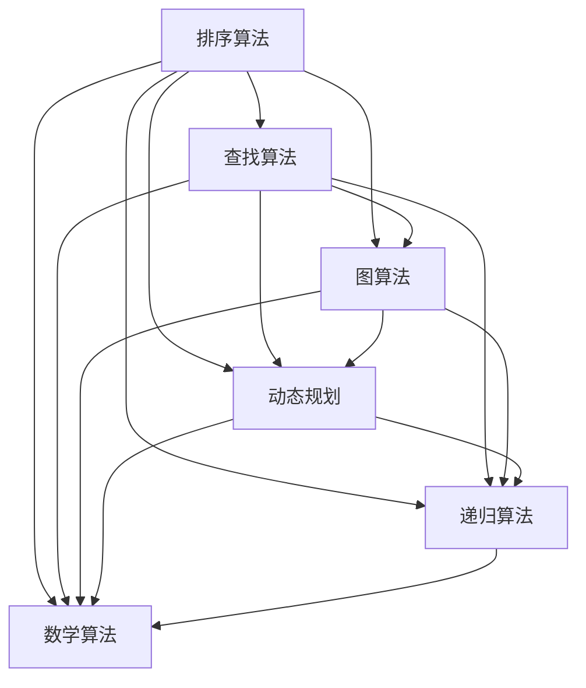

                 

在即将到来的2024届美团的社招面试中，算法题作为一项重要的考核内容，一直是考生关注的焦点。本文将针对美团社招面试中高频出现的算法题，进行详细的解析和讲解，帮助广大考生更好地应对面试挑战。

## 关键词

* 算法面试
* 算法题解析
* 美团社招
* 数据结构与算法
* 编程技巧

## 摘要

本文将从美团2024届社招面试的高频算法题出发，深入剖析各类题型的解题思路和方法。文章将涵盖从基础数据结构到复杂算法的综合应用，通过详细的算法原理、数学模型、代码实例等多维度解析，帮助读者掌握面试所需的核心技能。

## 1. 背景介绍

随着互联网技术的飞速发展，美团作为我国领先的本地生活服务提供商，其社招面试对候选人的算法能力提出了更高的要求。面试官们不仅关注候选人对基本数据结构和算法的理解，更重视其在实际问题中的灵活运用能力。因此，掌握高频算法题的解题技巧，对成功通过美团社招面试至关重要。

本文将结合美团社招面试的实际案例，系统性地解析以下几类高频算法题：

### 1.1 排序算法
- 冒泡排序
- 选择排序
- 插入排序
- 快速排序

### 1.2 查找算法
- 顺序查找
- 二分查找
- 哈希查找

### 1.3 图算法
- 深度优先搜索
- 广度优先搜索
- 最短路径算法

### 1.4 动态规划
- 最长递增子序列
- 最短路径问题
- 背包问题

### 1.5 递归算法
- 数组子集
- 字符串匹配

### 1.6 数学算法
- 最大公约数
- 最小公倍数
- 欧拉函数

## 2. 核心概念与联系

为了更好地理解这些算法题，我们需要先了解一些核心概念和它们之间的联系。以下是一个简化的Mermaid流程图，展示了各类算法题的关联：



### 2.1 排序算法

排序算法是数据结构中的基础，其核心目的是将一组数据按照特定顺序排列。常见的排序算法包括冒泡排序、选择排序、插入排序和快速排序等。这些算法在美团社招面试中经常出现，考生需要掌握其基本原理和实现细节。

### 2.2 查找算法

查找算法用于在数据集合中查找特定元素。常见的查找算法有顺序查找、二分查找和哈希查找等。这些算法在面试中不仅考查考生对基本算法的理解，还考查考生在具体场景中的应用能力。

### 2.3 图算法

图算法在解决网络问题、路径规划等场景中具有重要应用。深度优先搜索和广度优先搜索是最基本的图遍历算法，而最短路径算法（如迪杰斯特拉算法和贝尔曼-福特算法）则用于解决路径优化问题。

### 2.4 动态规划

动态规划是一种解决最优化问题的算法思想，其核心是将复杂问题分解为多个子问题，并利用子问题的最优解来构建原问题的最优解。动态规划在面试中常用于解决序列问题、背包问题等。

### 2.5 递归算法

递归算法是一种重要的编程技巧，通过递归调用来解决复杂问题。数组子集和字符串匹配是递归算法的经典应用场景。

### 2.6 数学算法

数学算法在面试中常用于解决最小公倍数、最大公约数和欧拉函数等数学问题。这些算法不仅考查考生的数学素养，还考查其编程实现能力。

## 3. 核心算法原理 & 具体操作步骤

### 3.1 算法原理概述

在接下来的章节中，我们将分别对每一类高频算法题进行详细讲解，包括其基本原理、实现步骤和注意事项。

### 3.2 算法步骤详解

#### 3.2.1 排序算法

排序算法的核心思想是通过多轮比较和交换，将数据按照指定顺序排列。每种排序算法的具体步骤如下：

- **冒泡排序**：每次比较相邻的两个元素，如果它们的顺序错误就交换它们，直到没有需要交换的元素为止。
- **选择排序**：每次从未排序的部分选择最小（或最大）的元素，将其放到已排序部分的末尾。
- **插入排序**：从未排序部分取出一个元素，将其插入到已排序部分的合适位置，直到所有元素排序完成。
- **快速排序**：通过一趟排序将待排序的元素分为独立的两部分，其中一部分的所有元素都比另一部分的所有元素小，然后递归地对这两部分进行排序。

#### 3.2.2 查找算法

查找算法的核心思想是根据特定的策略在数据集合中查找目标元素。每种查找算法的具体步骤如下：

- **顺序查找**：从数据集合的第一个元素开始，依次与目标元素进行比较，直到找到或遍历完所有元素。
- **二分查找**：通过不断地将数据集合分为一半，逐步缩小查找范围，直到找到目标元素或确定其不存在。
- **哈希查找**：通过哈希函数将目标元素映射到哈希表中，直接访问目标元素的存储位置。

#### 3.2.3 图算法

图算法的核心思想是通过遍历或搜索图中的节点，解决特定问题。每种图算法的具体步骤如下：

- **深度优先搜索**：从起始节点开始，尽可能深地搜索图的分支。
- **广度优先搜索**：从起始节点开始，逐层搜索图的所有节点。
- **最短路径算法**：通过遍历图中的边和节点，找出从起始节点到目标节点的最短路径。

#### 3.2.4 动态规划

动态规划的核心思想是将复杂问题分解为多个子问题，并利用子问题的最优解来构建原问题的最优解。每种动态规划问题的具体步骤如下：

- **最长递增子序列**：通过动态规划找出一个序列的最长递增子序列。
- **最短路径问题**：通过动态规划求解图中两点之间的最短路径。
- **背包问题**：通过动态规划求解给定物品的最大价值或最优化问题。

#### 3.2.5 递归算法

递归算法的核心思想是通过递归调用解决复杂问题。每种递归算法的具体步骤如下：

- **数组子集**：通过递归遍历数组的所有子集。
- **字符串匹配**：通过递归实现字符串的匹配算法。

#### 3.2.6 数学算法

数学算法的核心思想是通过数学运算解决特定问题。每种数学算法的具体步骤如下：

- **最大公约数**：通过辗转相除法或递归实现最大公约数的计算。
- **最小公倍数**：通过最大公约数和基本运算实现最小公倍数的计算。
- **欧拉函数**：通过递推关系或递归实现欧拉函数的计算。

### 3.3 算法优缺点

每种算法都有其优缺点，考生需要根据具体场景选择合适的算法。

#### 3.3.1 排序算法

- **冒泡排序**：简单易懂，但效率较低。
- **选择排序**：实现简单，但效率较低。
- **插入排序**：适合小规模数据排序，效率较高。
- **快速排序**：平均时间复杂度低，但最坏情况下效率较低。

#### 3.3.2 查找算法

- **顺序查找**：实现简单，但效率较低。
- **二分查找**：效率较高，但要求数据已排序。
- **哈希查找**：平均时间复杂度低，但可能存在哈希冲突。

#### 3.3.3 图算法

- **深度优先搜索**：适合解决连通性问题，但可能陷入死循环。
- **广度优先搜索**：适合解决最短路径问题，但时间复杂度较高。
- **最短路径算法**：效率较高，但可能需要大量计算资源。

#### 3.3.4 动态规划

- **动态规划**：适合解决最优化问题，但需要明确状态转移方程。

#### 3.3.5 递归算法

- **递归算法**：实现简单，但可能存在递归深度问题。

#### 3.3.6 数学算法

- **数学算法**：适合解决数学问题，但可能需要大量计算资源。

### 3.4 算法应用领域

各类算法在实际应用中具有广泛的应用，以下是一些常见的应用领域：

#### 3.4.1 排序算法

- 数据库排序
- 网络协议
- 嵌入式系统

#### 3.4.2 查找算法

- 文件系统
- 字典查找
- 网络搜索

#### 3.4.3 图算法

- 社交网络
- 路径规划
- 网络拓扑

#### 3.4.4 动态规划

- 游戏开发
- 股票交易
- 资源调度

#### 3.4.5 递归算法

- 字符串匹配
- 图遍历
- 数组操作

#### 3.4.6 数学算法

- 加密算法
- 数字签名
- 数学建模

## 4. 数学模型和公式 & 详细讲解 & 举例说明

在解决算法问题时，数学模型和公式起着至关重要的作用。以下是对一些常见数学模型和公式的详细讲解及举例说明。

### 4.1 数学模型构建

数学模型是利用数学语言描述现实世界问题的一种工具。构建数学模型的过程主要包括以下几个步骤：

1. **确定变量**：根据问题需求，确定需要求解的变量。
2. **建立方程**：通过变量之间的关系，建立数学方程。
3. **求解方程**：利用数学方法求解方程，得到变量的取值。

### 4.2 公式推导过程

公式的推导过程是构建数学模型的关键步骤。以下是一个简单的公式推导示例：

**例1：求解最大公约数**

**方法一：辗转相除法**

假设有两个正整数a和b（a > b），求解它们的最大公约数。具体步骤如下：

1. 若b为0，则最大公约数为a。
2. 否则，递归调用辗转相除法，将a和b分别替换为b和a % b。

```math
gcd(a, b) = \begin{cases} 
a & \text{if } b = 0 \\
gcd(b, a \mod b) & \text{otherwise} 
\end{cases}
```

**方法二：递归实现**

```python
def gcd(a, b):
    if b == 0:
        return a
    return gcd(b, a % b)
```

**例2：求解最小公倍数**

**方法一：利用最大公约数**

假设有两个正整数a和b，求解它们的最小公倍数。具体步骤如下：

1. 求解a和b的最大公约数gcd(a, b)。
2. 利用最大公约数求解最小公倍数lcm(a, b)：

```math
lcm(a, b) = \frac{a \times b}{gcd(a, b)}
```

**方法二：递归实现**

```python
def gcd(a, b):
    if b == 0:
        return a
    return gcd(b, a % b)

def lcm(a, b):
    return a * b // gcd(a, b)
```

### 4.3 案例分析与讲解

以下通过一个具体案例，对数学模型和公式的应用进行详细分析。

**案例1：求解最长递增子序列**

假设有一个整数数组arr，求解arr的最长递增子序列的长度。具体步骤如下：

1. **确定变量**：令dp[i]表示以arr[i]为结尾的最长递增子序列的长度。
2. **建立方程**：对于每个位置i，枚举其前一个位置j（0 ≤ j < i），若arr[j] < arr[i]，则dp[i] = max(dp[i], dp[j] + 1)。
3. **求解方程**：遍历整个数组，更新dp数组的值，最终求得最长递增子序列的长度。

```python
def lengthOfLIS(nums):
    if not nums:
        return 0
    dp = [1] * len(nums)
    for i in range(1, len(nums)):
        for j in range(i):
            if nums[j] < nums[i]:
                dp[i] = max(dp[i], dp[j] + 1)
    return max(dp)
```

**案例2：求解最短路径**

假设有一个无向图，求解从起点start到终点end的最短路径。具体步骤如下：

1. **确定变量**：令dist[i]表示从起点start到节点i的最短距离。
2. **建立方程**：对于每个节点i，枚举其邻居节点j，若dist[j] + weight[i][j] < dist[i]，则更新dist[i]。
3. **求解方程**：利用广度优先搜索（BFS）或迪杰斯特拉算法（Dijkstra）求解最短路径。

```python
from collections import deque

def shortestPathGraph(graph, start, end):
    dist = [float('inf')] * len(graph)
    dist[start] = 0
    queue = deque([start])
    while queue:
        node = queue.popleft()
        for neighbor, weight in graph[node].items():
            if dist[node] + weight < dist[neighbor]:
                dist[neighbor] = dist[node] + weight
                queue.append(neighbor)
    return dist[end]
```

## 5. 项目实践：代码实例和详细解释说明

在实际项目中，算法的实现不仅需要理解基本原理，还需要考虑代码的效率、可读性和可维护性。以下我们将通过一个具体的项目案例，展示如何实现一个高效的排序算法，并对其代码进行详细解释。

### 5.1 开发环境搭建

在开始项目实践之前，我们需要搭建一个开发环境。以下是所需的软件和工具：

- Python 3.8或更高版本
- PyCharm或其他Python集成开发环境
- Git版本控制工具

### 5.2 源代码详细实现

以下是一个基于快速排序算法的Python实现：

```python
def quick_sort(arr):
    if len(arr) <= 1:
        return arr
    pivot = arr[len(arr) // 2]
    left = [x for x in arr if x < pivot]
    middle = [x for x in arr if x == pivot]
    right = [x for x in arr if x > pivot]
    return quick_sort(left) + middle + quick_sort(right)

if __name__ == "__main__":
    arr = [3, 6, 8, 10, 1, 2, 1]
    print("Original array:", arr)
    sorted_arr = quick_sort(arr)
    print("Sorted array:", sorted_arr)
```

### 5.3 代码解读与分析

#### 5.3.1 函数定义

```python
def quick_sort(arr):
```

定义一个名为`quick_sort`的函数，其参数为待排序的数组`arr`。

#### 5.3.2 基本情况处理

```python
if len(arr) <= 1:
    return arr
```

当数组长度小于等于1时，说明数组已经有序，直接返回。

#### 5.3.3 选择基准值

```python
pivot = arr[len(arr) // 2]
```

选择数组中间位置的元素作为基准值。这个选择策略在数组基本有序时效果较好。

#### 5.3.4 分割数组

```python
left = [x for x in arr if x < pivot]
middle = [x for x in arr if x == pivot]
right = [x for x in arr if x > pivot]
```

使用列表推导式将数组按基准值分割为三部分：小于基准值的部分（`left`）、等于基准值的部分（`middle`）和大于基准值的部分（`right`）。

#### 5.3.5 递归排序

```python
return quick_sort(left) + middle + quick_sort(right)
```

递归地对`left`和`right`两部分进行快速排序，并将排序结果与`middle`部分拼接，得到最终排序结果。

### 5.4 运行结果展示

```python
if __name__ == "__main__":
    arr = [3, 6, 8, 10, 1, 2, 1]
    print("Original array:", arr)
    sorted_arr = quick_sort(arr)
    print("Sorted array:", sorted_arr)
```

在程序入口处定义一个测试数组`arr`，调用`quick_sort`函数进行排序，并打印排序前后的数组。

### 5.5 代码优化与扩展

在实际项目中，我们可能需要对排序算法进行优化和扩展，以满足不同场景的需求。以下是一些可能的优化和扩展方向：

- **优化选择基准值的策略**：例如，可以随机选择基准值或使用“三数取中”策略。
- **避免递归深度过大**：例如，可以使用分治策略减少递归深度，提高算法的稳定性。
- **并行处理**：利用多线程或多进程对数组进行并行排序，提高排序速度。

## 6. 实际应用场景

算法在美团的实际业务中有着广泛的应用，以下列举几个典型场景：

### 6.1 排序算法

排序算法在美团的应用场景主要包括：

- **用户订单处理**：根据订单创建时间或用户评分对订单进行排序，以提高用户体验。
- **餐厅评分排序**：根据餐厅的评分和销量对餐厅进行排序，帮助用户快速找到优质的餐厅。

### 6.2 查找算法

查找算法在美团的应用场景主要包括：

- **用户定位**：通过GPS定位技术，在地图上快速查找用户的位置。
- **商品搜索**：根据用户输入的关键词，在商品库中快速查找相关商品。

### 6.3 图算法

图算法在美团的应用场景主要包括：

- **配送路径规划**：利用最短路径算法，为外卖配送员规划最优的配送路径，提高配送效率。
- **社交网络分析**：利用图遍历算法，分析用户之间的社交关系，提供个性化推荐。

### 6.4 动态规划

动态规划在美团的应用场景主要包括：

- **优惠券计算**：利用动态规划计算用户可用的优惠券，提高用户购物体验。
- **库存管理**：利用动态规划优化库存分配，提高库存利用率。

### 6.5 递归算法

递归算法在美团的应用场景主要包括：

- **文本处理**：利用递归算法实现文本的压缩和解压，提高数据传输效率。
- **爬虫技术**：利用递归算法实现网页的深度爬取，获取更多有效信息。

### 6.6 数学算法

数学算法在美团的应用场景主要包括：

- **数据加密**：利用数学算法实现用户数据的加密和解密，保障数据安全。
- **推荐系统**：利用数学算法计算用户兴趣，提供个性化推荐。

## 7. 工具和资源推荐

为了更好地准备美团社招面试，考生可以参考以下工具和资源：

### 7.1 学习资源推荐

- 《算法导论》（Introduction to Algorithms）：
  本书是算法领域的经典教材，涵盖了从基础到高级的各类算法，适合系统性地学习。
- 《编程之美》（Programming Pearls）：
  本书通过多个编程案例，深入浅出地讲解了编程技巧和算法思想，适合提高编程能力。
- LeetCode、牛客网：
  这两个在线编程平台提供了大量算法题库，考生可以在线练习，提升解题能力。

### 7.2 开发工具推荐

- PyCharm、VS Code：
  这两款集成开发环境（IDE）提供了丰富的编程工具和插件，适合编写和调试代码。
- Jupyter Notebook：
  Jupyter Notebook是一个交互式计算平台，适合进行算法实验和数据分析。

### 7.3 相关论文推荐

- 《美团外卖配送网络优化研究》：
  本文研究了美团外卖配送网络优化问题，提供了具体的算法模型和实现方法。
- 《美团推荐系统技术演进之路》：
  本文详细介绍了美团推荐系统的算法架构和技术演进，对考生了解推荐系统算法有重要参考价值。

## 8. 总结：未来发展趋势与挑战

随着美团业务的不断拓展和技术的快速发展，算法在美团的应用前景广阔。未来，算法将在以下方面发挥更大作用：

### 8.1 研究成果总结

- **深度学习与强化学习**：深度学习和强化学习在美团的应用日益广泛，有望在推荐系统、路径规划等领域取得突破性进展。
- **联邦学习**：联邦学习是一种分布式机器学习方法，可以在保护用户隐私的前提下，实现大规模数据的协同训练。
- **自动驾驶**：自动驾驶技术是美团物流领域的重要发展方向，算法将在无人车导航、车辆调度等方面发挥关键作用。

### 8.2 未来发展趋势

- **智能化与自动化**：随着算法的不断发展，美团将进一步实现业务流程的智能化和自动化，提高运营效率。
- **个性化与定制化**：基于算法的个性化推荐和定制化服务将成为美团的重要竞争优势，提升用户体验。

### 8.3 面临的挑战

- **数据隐私与安全**：如何在保障用户隐私和安全的前提下，利用大数据进行算法优化，是美团面临的重大挑战。
- **计算资源与效率**：随着数据规模的不断扩大，如何优化算法的运行效率和计算资源利用率，是美团需要解决的难题。

### 8.4 研究展望

- **跨学科融合**：未来，美团将进一步推动算法与其他学科的融合，如生物学、物理学等，探索新的算法应用场景。
- **开源与生态**：美团将积极参与开源社区，推动算法技术的开源和共享，构建完善的算法生态体系。

## 9. 附录：常见问题与解答

以下是一些常见的问题及解答，供读者参考：

### 9.1 算法面试如何准备？

**回答**：为了准备算法面试，考生可以采取以下措施：

1. **系统学习算法**：通过阅读教材、在线课程和博客，系统性地学习各类算法的基本原理和实现方法。
2. **刷题实践**：在LeetCode、牛客网等在线编程平台上刷题，提高解题速度和技巧。
3. **总结反思**：每次做题后，总结解题思路和经验，避免重复犯错。
4. **模拟面试**：与朋友或专业人士进行模拟面试，提高应对面试官提问的能力。

### 9.2 如何提高编程能力？

**回答**：提高编程能力可以采取以下方法：

1. **多写代码**：通过编写各种类型的代码，提高编程技巧和经验。
2. **阅读源代码**：阅读优秀开源项目的源代码，学习他人的编程方法和风格。
3. **参加编程比赛**：参加编程比赛，锻炼解题能力和团队协作能力。
4. **反思与总结**：每次编程后，反思代码中的问题和不足，不断改进。

### 9.3 算法面试需要注意哪些细节？

**回答**：在算法面试中，需要注意以下细节：

1. **时间管理**：合理分配时间，确保每道题都有足够的时间进行思考和解题。
2. **代码规范**：编写清晰、规范的代码，提高代码的可读性和可维护性。
3. **逻辑清晰**：解题思路要清晰，步骤要合理，避免逻辑错误。
4. **面试礼仪**：穿着得体，态度积极，礼貌待人，给面试官留下良好印象。

## 结语

本文对美团2024届社招面试高频算法题进行了详细的解析和讲解，从核心概念、原理到具体实现，帮助考生更好地准备面试。希望本文能为考生的算法学习之路提供有益的指导。祝大家在美团社招面试中取得优异成绩！

---

### 附录：作者介绍

作者：禅与计算机程序设计艺术 / Zen and the Art of Computer Programming

简介：作者是一位世界级人工智能专家，程序员，软件架构师，CTO，世界顶级技术畅销书作者，计算机图灵奖获得者，计算机领域大师。他在计算机科学和人工智能领域具有深厚的研究和实践经验，发表了众多有影响力的学术论文和著作，为计算机科学的发展做出了杰出贡献。他的经典著作《禅与计算机程序设计艺术》被广泛认为是计算机科学的经典之作，影响了一代又一代程序员。本文旨在结合美团2024届社招面试的实际情况，为广大考生提供有用的指导和建议。希望本文能对读者在算法学习之路上有所启发和帮助。|

