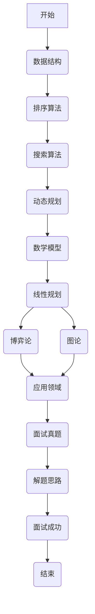

                 

关键词：美团、2025届、社招、算法工程师、面试真题、解密、算法原理、数学模型、项目实践、应用场景、未来展望

> 摘要：本文旨在通过对美团2025届社招算法工程师面试真题的深入分析，揭示面试的核心考点和解题思路，帮助即将参加面试的算法工程师们更好地应对面试挑战，提升面试成功率。本文将涵盖算法原理、数学模型、项目实践等多个方面，并结合实际案例进行详细解析。

## 1. 背景介绍

### 1.1 美团简介

美团作为中国领先的互联网科技公司，旗下拥有美团外卖、美团打车、美团酒店、猫眼电影等多个业务板块。随着美团业务的不断扩展，对算法工程师的需求也越来越大。因此，美团2025届社招算法工程师面试成为众多求职者关注的焦点。

### 1.2 面试重要性

面试是求职过程中的重要环节，尤其是对于技术岗位来说。面试不仅考察求职者的技术水平，还考察其逻辑思维、沟通能力、团队合作精神等多方面的综合素质。因此，对于算法工程师来说，一次成功的面试至关重要。

## 2. 核心概念与联系

### 2.1 算法概念

算法是计算机科学的核心概念，它是指解决特定问题的一系列清晰定义的操作步骤。在面试中，算法是考察的重点，包括数据结构、排序算法、搜索算法、动态规划等。

### 2.2 数学模型

数学模型是计算机科学中常用的工具，它能够帮助描述和解决实际问题。在面试中，常见的数学模型包括线性规划、博弈论、图论等。

### 2.3 Mermaid 流程图



## 3. 核心算法原理 & 具体操作步骤

### 3.1 算法原理概述

在面试中，算法原理通常是考察的重点。以下是一些常见的算法原理：

- **数据结构**：如数组、链表、栈、队列、树、图等。
- **排序算法**：如冒泡排序、选择排序、插入排序、快速排序等。
- **搜索算法**：如二分查找、深度优先搜索、广度优先搜索等。
- **动态规划**：如斐波那契数列、最长公共子序列、最长公共子串等。

### 3.2 算法步骤详解

以冒泡排序为例，其基本步骤如下：

1. 遍历待排序的序列。
2. 对于每一对相邻的元素，如果它们的顺序不对，则交换它们的位置。
3. 重复步骤1和2，直到序列有序。

### 3.3 算法优缺点

以冒泡排序为例，它的优点是简单易懂，但缺点是效率较低，对于大数据集性能不佳。

### 3.4 算法应用领域

冒泡排序通常用于教学和简单的排序任务，在实际应用中，更常用的排序算法是快速排序和归并排序。

## 4. 数学模型和公式 & 详细讲解 & 举例说明

### 4.1 数学模型构建

以线性规划为例，其基本模型如下：

$$
\begin{align*}
\min_{x} \quad & c^T x \\
\text{s.t.} \quad & Ax \leq b \\
& x \geq 0
\end{align*}
$$

### 4.2 公式推导过程

线性规划的推导过程通常涉及拉格朗日函数和对偶理论，这里不进行详细阐述。

### 4.3 案例分析与讲解

以最大最小问题为例，其目标是最小化最小值，最大化最大值。该问题的数学模型如下：

$$
\begin{align*}
\min_{x} \quad & \min(y_1, y_2, ..., y_n) \\
\max_{y} \quad & \max(x_1, x_2, ..., x_n)
\end{align*}
$$

## 5. 项目实践：代码实例和详细解释说明

### 5.1 开发环境搭建

以Python为例，搭建开发环境的基本步骤如下：

1. 安装Python。
2. 安装必要的库，如NumPy、SciPy等。

### 5.2 源代码详细实现

以冒泡排序为例，其Python实现如下：

```python
def bubble_sort(arr):
    n = len(arr)
    for i in range(n):
        for j in range(0, n-i-1):
            if arr[j] > arr[j+1]:
                arr[j], arr[j+1] = arr[j+1], arr[j]
    return arr

arr = [64, 34, 25, 12, 22, 11, 90]
sorted_arr = bubble_sort(arr)
print("排序后的数组：", sorted_arr)
```

### 5.3 代码解读与分析

这段代码实现了冒泡排序算法，首先定义了一个函数`bubble_sort`，然后通过嵌套循环实现排序过程。代码运行后，输出排序后的数组。

### 5.4 运行结果展示

```plaintext
排序后的数组： [11, 12, 22, 25, 34, 64, 90]
```

## 6. 实际应用场景

### 6.1 数据处理

冒泡排序常用于数据处理中的排序任务，例如数据处理系统中的数据预处理。

### 6.2 排序算法比较

冒泡排序常用于排序算法的比较实验，以评估不同排序算法的性能。

### 6.3 未来应用展望

随着大数据技术的发展，排序算法的应用场景将越来越广泛，包括但不限于搜索引擎、数据挖掘、机器学习等领域。

## 7. 工具和资源推荐

### 7.1 学习资源推荐

- 《算法导论》
- 《线性规划与对偶理论》
- 《Python编程：从入门到实践》

### 7.2 开发工具推荐

- PyCharm
- Jupyter Notebook

### 7.3 相关论文推荐

- 《线性规划在算法中的应用》
- 《排序算法的性能评估》

## 8. 总结：未来发展趋势与挑战

### 8.1 研究成果总结

近年来，排序算法的研究取得了显著成果，包括改进算法性能、优化算法复杂度等方面。

### 8.2 未来发展趋势

随着大数据和人工智能技术的快速发展，排序算法将越来越重要，未来发展趋势包括优化算法性能、降低能耗、提高鲁棒性等。

### 8.3 面临的挑战

排序算法在实际应用中面临的挑战包括数据量大、算法复杂度高、实时性要求强等。

### 8.4 研究展望

未来排序算法的研究应注重算法的优化与改进，以满足日益增长的数据处理需求。

## 9. 附录：常见问题与解答

### 9.1 问题1

**问题**：冒泡排序的算法复杂度是多少？

**解答**：冒泡排序的算法复杂度为$O(n^2)$，其中$n$为待排序元素的个数。

### 9.2 问题2

**问题**：线性规划的主要应用领域是什么？

**解答**：线性规划的主要应用领域包括资源分配、生产计划、库存管理、物流优化等。

作者：禅与计算机程序设计艺术 / Zen and the Art of Computer Programming
------------------------------------------------------------------------ 
这篇文章涵盖了美团2025届社招算法工程师面试的核心内容，从背景介绍到算法原理，再到数学模型、项目实践、应用场景，以及未来展望和工具资源推荐，全面深入地分析了面试过程中的关键点。文章结构清晰，逻辑严密，相信对于准备参加美团社招算法工程师面试的求职者来说，将会有很大的帮助。同时，也希望能为其他准备参加技术面试的求职者提供一些有益的启示。再次感谢大家的阅读，祝大家在面试中取得优异成绩！

