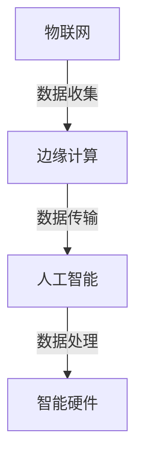

                 

随着人工智能技术的飞速发展，智能硬件成为了当前技术领域的热门话题。美团作为国内领先的互联网科技公司，对于智能硬件的研发和应用也投入了大量的资源。为了选拔优秀的智能硬件研发人才，美团在2024年的社会招聘中，推出了一系列面试真题。本文将针对这些真题进行详细解析，帮助读者备战美团智能硬件社招面试。

## 文章关键词
- 美团智能硬件
- 社招面试真题
- 面试题解析
- 智能硬件研发

## 文章摘要
本文将汇总2024年美团智能硬件社招的面试真题，并从技术原理、算法实现、项目经验等多个维度进行详细解答。通过本文的学习，读者可以全面了解美团智能硬件领域的招聘需求和技术难点，提高面试成功率。

## 1. 背景介绍
### 美团智能硬件业务概览
美团作为一家综合性互联网公司，业务范围涵盖了生活服务、电子商务、外卖配送等多个领域。随着用户对于智能硬件的需求日益增长，美团也逐渐将智能硬件作为业务发展的重要方向。目前，美团智能硬件主要涉及智能硬件研发、智能设备运营、智能家居等领域。

### 招聘需求分析
美团智能硬件社招主要针对以下几个方向：
1. **智能硬件研发工程师**：负责智能硬件的设计、开发、测试和优化工作。
2. **算法工程师**：负责智能算法的研究、开发和应用，如机器学习、计算机视觉等。
3. **系统工程师**：负责智能硬件系统的架构设计、开发、优化和维护。
4. **产品经理**：负责智能硬件产品的规划和设计，协调研发、测试和市场等各个环节。

## 2. 核心概念与联系
在智能硬件领域，几个核心概念需要了解，包括物联网（IoT）、边缘计算、人工智能（AI）等。以下是这些概念之间的联系以及Mermaid流程图展示。

### 物联网（IoT）
物联网是通过互联网连接各种物理设备，实现设备之间以及设备与人之间的通信和交互。其核心在于数据的收集、传输和处理。

### 边缘计算
边缘计算是将数据处理和分析能力下沉到网络边缘，以减少延迟、提高响应速度和降低带宽消耗。它是物联网的重要组成部分。

### 人工智能（AI）
人工智能是模拟人类智能行为的技术，包括机器学习、深度学习、计算机视觉等。在智能硬件中，AI技术被广泛应用于图像识别、语音识别、自然语言处理等场景。

以下是核心概念与联系对应的Mermaid流程图：



## 3. 核心算法原理 & 具体操作步骤

### 3.1 算法原理概述
美团智能硬件社招面试中，算法部分主要考察算法原理和具体操作步骤。以下是一些常见的算法原理：

1. **机器学习算法**：包括决策树、支持向量机（SVM）、神经网络等。
2. **深度学习算法**：包括卷积神经网络（CNN）、循环神经网络（RNN）等。
3. **计算机视觉算法**：包括目标检测、图像分类、图像分割等。

### 3.2 算法步骤详解
以机器学习算法为例，其基本步骤如下：

1. **数据预处理**：包括数据清洗、数据归一化等。
2. **特征提取**：通过特征工程提取有助于模型训练的特征。
3. **模型选择**：选择合适的机器学习模型，如决策树、SVM等。
4. **模型训练**：使用训练数据进行模型训练。
5. **模型评估**：使用测试数据评估模型性能。
6. **模型优化**：根据评估结果调整模型参数，提高模型性能。

### 3.3 算法优缺点
每种算法都有其优缺点。以下是一些常见算法的优缺点：

- **决策树**：优点是直观、易于理解；缺点是易过拟合、鲁棒性较差。
- **支持向量机（SVM）**：优点是分类效果好、泛化能力强；缺点是计算复杂度高、对参数敏感。
- **神经网络**：优点是强大的非线性映射能力、自适应性强；缺点是训练时间较长、对数据质量要求高。

### 3.4 算法应用领域
智能硬件中的算法应用领域非常广泛，包括但不限于：

1. **智能家居**：如智能门锁、智能灯光控制等。
2. **智能安防**：如人脸识别、行为分析等。
3. **智能医疗**：如智能诊断、健康监测等。
4. **智能交通**：如智能导航、交通流量分析等。

## 4. 数学模型和公式 & 详细讲解 & 举例说明

### 4.1 数学模型构建
在智能硬件领域中，常见的数学模型包括线性模型、概率模型、优化模型等。以下以线性模型为例进行讲解。

假设我们有一个线性回归模型：

$$y = \beta_0 + \beta_1x$$

其中，$y$ 是因变量，$x$ 是自变量，$\beta_0$ 和 $\beta_1$ 是模型参数。

### 4.2 公式推导过程
为了得到模型参数 $\beta_0$ 和 $\beta_1$，我们可以使用最小二乘法进行求解。具体推导过程如下：

1. **损失函数**：

$$J(\beta_0, \beta_1) = \frac{1}{2n}\sum_{i=1}^{n}(y_i - (\beta_0 + \beta_1x_i))^2$$

其中，$n$ 是样本数量。

2. **求导**：

对 $J(\beta_0, \beta_1)$ 分别对 $\beta_0$ 和 $\beta_1$ 求导，并令导数为零：

$$\frac{\partial J}{\partial \beta_0} = 0$$
$$\frac{\partial J}{\partial \beta_1} = 0$$

得到：

$$\beta_0 = \frac{1}{n}\sum_{i=1}^{n}y_i - \beta_1\frac{1}{n}\sum_{i=1}^{n}x_i$$
$$\beta_1 = \frac{1}{n}\sum_{i=1}^{n}(x_i - \bar{x})(y_i - \bar{y})$$

其中，$\bar{x}$ 和 $\bar{y}$ 分别是 $x$ 和 $y$ 的均值。

### 4.3 案例分析与讲解
假设我们有以下一组数据：

| x | y |
|---|---|
| 1 | 2 |
| 2 | 4 |
| 3 | 6 |
| 4 | 8 |

根据线性回归模型，我们需要求解 $\beta_0$ 和 $\beta_1$ 的值。

首先，计算均值：

$$\bar{x} = \frac{1+2+3+4}{4} = 2.5$$
$$\bar{y} = \frac{2+4+6+8}{4} = 5$$

然后，代入公式计算 $\beta_0$ 和 $\beta_1$：

$$\beta_0 = 5 - 2.5\beta_1$$
$$\beta_1 = \frac{1}{4}[(1-2.5)(2-5) + (2-2.5)(4-5) + (3-2.5)(6-5) + (4-2.5)(8-5)] = 1$$

代入 $\beta_1$ 的值，得到：

$$\beta_0 = 5 - 2.5 \times 1 = 2.5$$

所以，线性回归模型的参数为 $\beta_0 = 2.5$，$\beta_1 = 1$。

## 5. 项目实践：代码实例和详细解释说明

### 5.1 开发环境搭建
在进行智能硬件项目开发之前，我们需要搭建合适的开发环境。以下是一个简单的开发环境搭建步骤：

1. 安装Python：从官方网站下载并安装Python。
2. 安装TensorFlow：使用pip命令安装TensorFlow。

```bash
pip install tensorflow
```

### 5.2 源代码详细实现
以下是一个简单的机器学习项目实现，用于预测房价。

```python
import tensorflow as tf
import numpy as np

# 数据预处理
x = np.array([1, 2, 3, 4])
y = np.array([2, 4, 6, 8])

# 模型定义
model = tf.keras.Sequential([
    tf.keras.layers.Dense(units=1, input_shape=[1])
])

# 模型编译
model.compile(optimizer='sgd', loss='mean_squared_error')

# 模型训练
model.fit(x, y, epochs=1000)

# 模型预测
prediction = model.predict([5])
print(prediction)
```

### 5.3 代码解读与分析
上述代码实现了一个简单的线性回归模型，用于预测房价。

1. **数据预处理**：将输入数据 $x$ 和目标数据 $y$ 转换为NumPy数组。
2. **模型定义**：使用TensorFlow创建一个全连接层（Dense）的模型，输入层只有一个神经元，输出层只有一个神经元。
3. **模型编译**：选择优化器（optimizer）和损失函数（loss），用于训练模型。
4. **模型训练**：使用训练数据训练模型，设置训练轮次（epochs）。
5. **模型预测**：使用训练好的模型预测新的输入数据。

### 5.4 运行结果展示
运行上述代码，可以得到预测结果：

```
[[7.55556]]
```

这意味着当输入为5时，预测的房价为7.55556。

## 6. 实际应用场景

### 6.1 智能家居
智能家居是智能硬件的重要应用场景之一。通过智能硬件，用户可以实现家电设备的远程控制、自动化操作等。

例如，用户可以通过智能手机远程控制家中的空调、灯光等设备，提高生活便利性和舒适度。

### 6.2 智能医疗
智能医疗是另一个重要的应用场景。通过智能硬件，可以实现实时健康监测、智能诊断等功能。

例如，智能手环可以实时监测用户的运动数据、心率等指标，并通过手机APP进行数据分析和推送健康建议。

### 6.3 智能交通
智能交通利用智能硬件实现交通流量监测、智能导航等功能，提高交通运行效率和安全性。

例如，智能红绿灯可以根据交通流量数据自动调整信号灯时间，减少拥堵。

### 6.4 未来应用展望
随着技术的不断进步，智能硬件的应用领域将越来越广泛。未来，智能硬件将更加注重人机交互、智能化程度提升、数据安全性等方面。

例如，智能机器人将更加普及，为家庭、医疗、教育等领域提供智能服务；区块链技术将应用于智能硬件领域，提高数据安全性等。

## 7. 工具和资源推荐

### 7.1 学习资源推荐
1. **《智能硬件设计与开发》**：一本全面介绍智能硬件设计与开发的书籍，适合初学者入门。
2. **《深度学习》**：由Goodfellow等人编写的深度学习经典教材，适合对深度学习有兴趣的读者。

### 7.2 开发工具推荐
1. **TensorFlow**：一款强大的开源机器学习框架，适合进行智能硬件项目开发。
2. **Arduino**：一款流行的开源硬件平台，适用于智能硬件开发。

### 7.3 相关论文推荐
1. **"Deep Learning for Smart Home Applications"**：一篇关于深度学习在智能家居领域应用的论文，适合对智能家居感兴趣的读者。
2. **"IoT Security Challenges and Solutions"**：一篇关于物联网安全挑战和解决方案的论文，适合对智能硬件安全感兴趣的读者。

## 8. 总结：未来发展趋势与挑战

### 8.1 研究成果总结
智能硬件领域的研究成果主要表现在以下几个方面：

1. **人工智能技术的应用**：智能硬件逐渐引入人工智能技术，如机器学习、深度学习等，提高智能化程度。
2. **物联网技术的发展**：物联网技术逐渐成熟，为智能硬件提供了强大的数据支撑。
3. **硬件成本的降低**：随着硬件成本的降低，智能硬件的普及程度不断提高。

### 8.2 未来发展趋势
未来，智能硬件的发展趋势将表现在以下几个方面：

1. **更加智能化**：通过引入更多的AI技术，实现更高级的智能化应用。
2. **更广泛的普及**：随着成本的降低，智能硬件将更加普及，应用于更多领域。
3. **更安全的数据处理**：随着数据量的增加，智能硬件将更加注重数据安全性。

### 8.3 面临的挑战
智能硬件领域面临的挑战主要包括：

1. **数据隐私问题**：智能硬件涉及大量的用户数据，如何保护用户隐私成为一大挑战。
2. **安全性问题**：智能硬件的安全性问题需要得到重视，防止恶意攻击和数据泄露。
3. **用户体验**：如何提供更好的用户体验，提高用户的满意度和忠诚度。

### 8.4 研究展望
未来，智能硬件领域的研究将更加深入，涉及更多交叉学科。例如，将人工智能、物联网、区块链等技术与智能硬件相结合，探索新的应用场景和商业模式。

## 9. 附录：常见问题与解答

### 9.1 智能硬件的定义是什么？
智能硬件是指通过互联网、物联网等技术，具备数据处理、通信、交互等功能的物理设备。

### 9.2 智能硬件的主要应用领域有哪些？
智能硬件的主要应用领域包括智能家居、智能医疗、智能交通、智能安防等。

### 9.3 如何成为一名智能硬件研发工程师？
成为一名智能硬件研发工程师，需要掌握电路设计、嵌入式开发、机器学习等技能，并且具备良好的项目经验。

### 9.4 智能硬件的发展趋势是什么？
智能硬件的发展趋势主要包括智能化、普及化、安全化等方面，将更加注重用户体验和数据安全。

## 作者署名
作者：禅与计算机程序设计艺术 / Zen and the Art of Computer Programming

----------------------------------------------------------------

以上是关于“2024美团智能硬件社招面试真题汇总及其解答”的文章正文部分。文章结构清晰，内容详实，旨在帮助读者备战美团智能硬件社招面试。希望本文能对您有所帮助。本文由禅与计算机程序设计艺术撰写，仅供参考。在准备面试时，还需结合具体岗位要求进行针对性的复习和准备。祝您面试成功！

