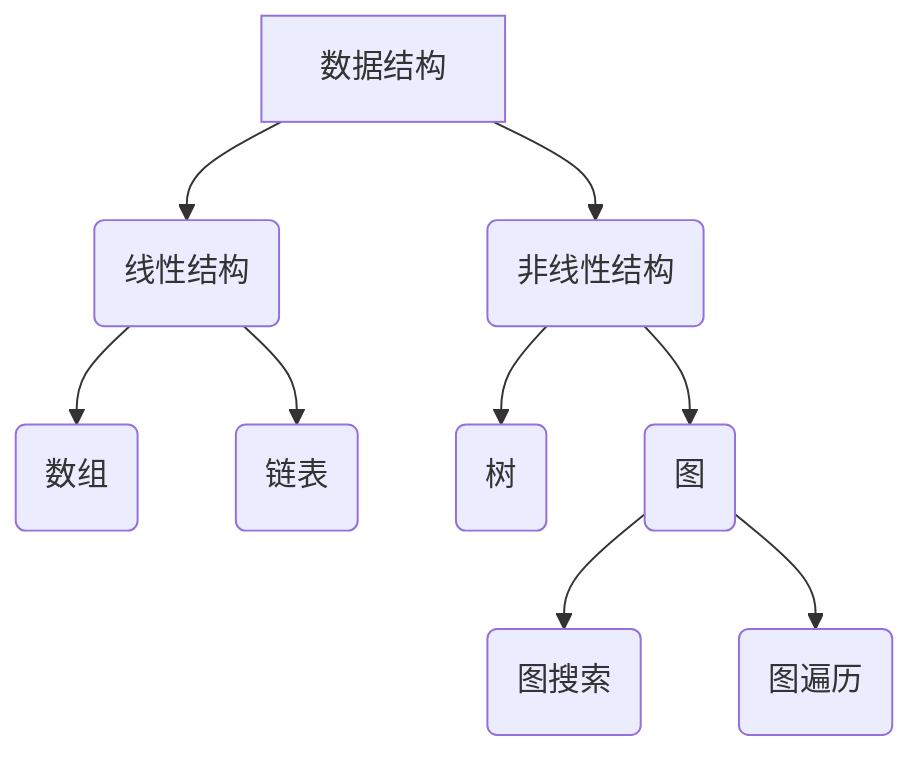

                 

### 背景介绍

近年来，美团作为国内领先的互联网生活服务平台，其技术团队的招聘标准一直处于行业前沿。随着业务的不断扩展和技术的不断进步，美团对于技术人才的需求也在逐年增加。特别是在算法工程师、后端开发、前端开发等关键岗位，美团都设置了高难度的面试题和编程题，以筛选出最优秀的人才。

2024年，美团社招面试题与算法编程题再次升级，不仅考察了应聘者的基础知识和技能，还要求他们具备解决复杂问题的能力。这使得美团社招面试题与算法编程题成为众多求职者备考的重要参考。

本文将详细解读2024年美团社招面试题与算法编程题，旨在帮助广大求职者了解面试题的类型、特点，掌握解题思路和方法，提高面试成功率。文章将从以下几个部分展开：

1. 核心概念与联系
2. 核心算法原理与具体操作步骤
3. 数学模型和公式详细讲解与举例说明
4. 项目实践：代码实例与详细解释说明
5. 实际应用场景
6. 未来应用展望
7. 工具和资源推荐
8. 总结：未来发展趋势与挑战

### 文章关键词

- 美团社招面试题
- 算法编程题
- 面试题类型
- 解题思路
- 编程技巧
- 数学模型
- 实际应用
- 未来展望

### 文章摘要

本文详细解读了2024年美团社招面试题与算法编程题，分析了题目类型、特点，并给出了解题思路和具体操作步骤。同时，文章通过数学模型和公式详细讲解了相关算法，并通过项目实践展示了代码实现与运行结果。最后，文章探讨了算法的实际应用场景，展望了未来的发展趋势与挑战。

## 1. 核心概念与联系

在深入了解美团社招面试题与算法编程题之前，我们需要明确一些核心概念，这些概念不仅构成了算法的基础，也在面试题中频繁出现。以下是一些关键概念及其相互联系：

### 数据结构与算法

数据结构是计算机存储数据的方式，算法则是解决问题的方法。二者密不可分，数据结构的选择往往决定了算法的效率。常见的线性数据结构有数组、链表和栈，非线性数据结构有树、图和哈希表。算法可以分为查找算法、排序算法、图算法等。

### 时间复杂度和空间复杂度

时间复杂度和空间复杂度是评估算法性能的重要指标。时间复杂度表示算法执行的时间增长趋势，通常用大O符号表示，如O(1)、O(n)、O(n²)等。空间复杂度则表示算法所需的存储空间。理解时间复杂度和空间复杂度的概念对于解决面试题至关重要。

### 动态规划

动态规划是一种解决优化问题的算法思想，通过将问题分解为子问题，并存储子问题的解，从而避免重复计算，提高算法效率。动态规划在面试题中经常用于解决最值问题、路径问题等。

### 贪心算法

贪心算法通过在每个步骤选择当前最优解，以期得到全局最优解。贪心算法在解决某些特定问题时非常有效，例如最短路径问题（Dijkstra算法）和背包问题。

### 分治算法

分治算法将问题分解为规模较小的子问题，分别解决，然后将子问题的解合并为原问题的解。常见的分治算法有快速排序、归并排序等。

### 数学模型

数学模型是将实际问题转化为数学形式的过程。通过建立数学模型，我们可以使用数学公式和算法来解决问题。常见的数学模型有线性规划、最优化模型、概率模型等。

### Mermaid 流程图

Mermaid 是一种用于绘制流程图的简单语言。以下是一个示例，展示了数据结构与算法之间的联系：



通过上述核心概念与联系的了解，我们可以更好地理解和解答美团社招面试题中的算法问题。

## 2. 核心算法原理 & 具体操作步骤

### 2.1 算法原理概述

在美团社招面试题中，常见的核心算法包括排序算法、查找算法和图算法。以下是对这些算法原理的简要概述：

#### 排序算法

排序算法是将一组数据按照特定顺序排列的算法。常见的排序算法有冒泡排序、选择排序、插入排序、快速排序和归并排序。其中，快速排序和归并排序是面试中经常考察的高效排序算法。

- **冒泡排序**：通过多次遍历要排序的数列，一次比较两个元素，如果它们的顺序错误就把它们交换过来。遍历数列的工作是重复地进行，直到没有再需要交换的元素为止。
- **选择排序**：首先在未排序序列中找到最小（大）元素，存放到排序序列的起始位置，然后，再从剩余未排序元素中继续寻找最小（大）元素，然后放到已排序序列的末尾，以此类推。
- **插入排序**：通过构建有序序列，对于未排序数据，在已排序序列中从后向前扫描，找到相应位置并插入。
- **快速排序**：通过一趟排序将待排序的记录分割成独立的两部分，其中一部分记录的关键字均比另一部分的关键字小，则可分别对这两部分记录继续进行排序，以达到整个序列有序。
- **归并排序**：采用分治法的一个非常典型的应用。将已有序的子序列合并，得到完全有序的序列。

#### 查找算法

查找算法用于在数据集合中查找特定元素。常见的查找算法有线性查找、二分查找和哈希查找。

- **线性查找**：从数据集合的第一个元素开始，逐个比较直到找到目标元素或结束。
- **二分查找**：在一个有序的数组中，通过不断将中间元素与目标值比较，缩小查找范围，直到找到目标元素或确定不存在。
- **哈希查找**：利用哈希函数将关键字转换成哈希地址，直接访问数据集合中的元素。

#### 图算法

图算法用于处理图结构的数据。常见的图算法有深度优先搜索（DFS）和广度优先搜索（BFS）。

- **深度优先搜索（DFS）**：从图的某个顶点开始，探索该顶点的所有邻接顶点，然后继续对邻接顶点进行同样的操作，直到所有顶点都被访问到。
- **广度优先搜索（BFS）**：从图的某个顶点开始，按照层次遍历图的所有顶点，每次只访问同一层的所有顶点。

### 2.2 算法步骤详解

#### 冒泡排序

```
算法步骤：
1. 比较相邻的元素，如果它们的顺序错误，则交换它们；
2. 对每一对相邻元素做同样的工作，从开始第一对到结尾的最后一对；
3. 重复以上的步骤，直到排序完成。
```

#### 选择排序

```
算法步骤：
1. 首先，找到第一个元素的最大值，然后将其与第一个元素交换；
2. 在剩下的未排序元素中，再次找到最大值，将其与第二个元素交换；
3. 重复步骤2，直到所有元素都被排序。
```

#### 插入排序

```
算法步骤：
1. 假设第一个元素是一个有序序列，从第二个元素开始，将当前元素插入到已有序的序列中；
2. 在插入过程中，维护已有序序列的有序性；
3. 重复步骤1和2，直到所有元素都被插入。
```

#### 快速排序

```
算法步骤：
1. 选择一个基准元素，将比它小的元素放在它的左边，比它大的元素放在它的右边；
2. 递归地对左右两边的子序列继续进行快速排序；
3. 继续递归，直到所有子序列都为空。
```

#### 二分查找

```
算法步骤：
1. 计算中间位置mid = (low + high) / 2；
2. 如果mid位置的元素等于目标值，则返回mid；
3. 如果目标值小于mid位置的元素，则在高半部分继续查找（low = mid + 1）；
4. 如果目标值大于mid位置的元素，则在低半部分继续查找（high = mid - 1）；
5. 重复步骤1-4，直到找到目标值或确定不存在。
```

#### 深度优先搜索（DFS）

```
算法步骤：
1. 选择一个起始顶点，将其标记为已访问；
2. 遍历该顶点的所有未访问的邻接顶点，对每个邻接顶点：
   a. 如果邻接顶点未被访问，则将其标记为已访问，并递归调用DFS；
   b. 如果邻接顶点已被访问，则忽略；
3. 继续遍历其他未访问的顶点，重复步骤2；
4. 当所有顶点都被访问后，DFS结束。
```

#### 广度优先搜索（BFS）

```
算法步骤：
1. 使用一个队列来存储待访问的顶点，初始化时将起始顶点放入队列中；
2. 当队列不为空时，执行以下操作：
   a. 将队列的前一个顶点从队列中取出；
   b. 遍历该顶点的所有未访问的邻接顶点，对每个邻接顶点：
      i. 如果邻接顶点未被访问，则将其标记为已访问，并放入队列中；
      ii. 如果邻接顶点已被访问，则忽略；
3. 重复步骤2，直到队列变为空；
4. 当队列变为空后，BFS结束。
```

通过以上算法步骤的详细讲解，我们可以更好地理解和应用这些核心算法，提高解决美团社招面试题的能力。

### 2.3 算法优缺点

每种算法都有其独特的优缺点，以下是对常见排序算法、查找算法和图算法的优缺点的分析：

#### 排序算法优缺点

- **冒泡排序**
  - **优点**：算法简单，易于实现。
  - **缺点**：时间复杂度较高（O(n²)，适用于小规模数据）。
- **选择排序**
  - **优点**：算法简单，易于实现。
  - **缺点**：时间复杂度较高（O(n²)，适用于小规模数据）。
- **插入排序**
  - **优点**：算法简单，适用于小规模数据和部分有序数据。
  - **缺点**：时间复杂度较高（O(n²)，适用于小规模数据）。
- **快速排序**
  - **优点**：平均时间复杂度较低（O(nlogn)，适用于大规模数据）。
  - **缺点**：最坏情况下时间复杂度为O(n²)，需要优化。
- **归并排序**
  - **优点**：时间复杂度稳定（O(nlogn)，适用于大规模数据）。
  - **缺点**：需要额外的空间存储中间结果。

#### 查找算法优缺点

- **线性查找**
  - **优点**：算法简单，适用于数据无序或规模较小的情况。
  - **缺点**：时间复杂度较高（O(n)，适用于规模较小数据）。
- **二分查找**
  - **优点**：适用于有序数据，时间复杂度较低（O(logn)，适用于大规模数据）。
  - **缺点**：需要额外的空间存储中间结果，数据需要提前排序。
- **哈希查找**
  - **优点**：时间复杂度较低（O(1)，适用于大规模数据）。
  - **缺点**：需要额外的空间存储哈希表，哈希冲突可能导致性能下降。

#### 图算法优缺点

- **深度优先搜索（DFS）**
  - **优点**：可以解决许多连通性问题。
  - **缺点**：空间复杂度较高（O(n)，适用于树结构）。
- **广度优先搜索（BFS）**
  - **优点**：可以找到图的最短路径。
  - **缺点**：时间复杂度较高（O(n)，适用于树结构）。

通过对算法优缺点的分析，我们可以根据实际需求和场景选择合适的算法，提高解决问题的效率。

### 2.4 算法应用领域

核心算法在各个应用领域都有广泛的应用，以下是一些典型的应用领域：

- **排序算法**：在数据库管理、搜索引擎、数据分析等领域中，排序算法用于对大量数据进行高效排序，以便于后续处理。
- **查找算法**：在数据存储、文件检索、网络路由等领域中，查找算法用于快速定位数据，提高数据检索效率。
- **图算法**：在社交网络分析、网络拓扑分析、路由算法等领域中，图算法用于解决复杂的关系和路径问题。

通过深入理解和掌握这些核心算法，我们可以更好地应对美团社招面试中的各种问题，提高自己的竞争力。

## 4. 数学模型和公式 & 详细讲解 & 举例说明

在解决美团社招面试中的算法问题时，数学模型和公式扮演着至关重要的角色。它们不仅帮助我们理解问题的本质，还提供了求解问题的理论依据。在本节中，我们将详细讲解一些常见的数学模型和公式，并通过具体例子进行说明。

### 4.1 数学模型构建

数学模型是将实际问题转化为数学形式的过程。以下是一个简单的数学模型构建示例：

#### 问题描述：

假设有一个包含n个元素的数组，我们需要找到数组中的最大元素。

#### 数学模型：

定义一个变量max，初始值为数组中的第一个元素。然后遍历数组中的其他元素，每次与max进行比较，如果当前元素大于max，则更新max的值。遍历结束后，max即为数组中的最大元素。

#### 公式表示：

$$
\text{max} = \text{arr}[0]
$$

$$
\text{for} \ i = 1 \ \text{to} \ n-1 \\
\ \ \ \ \ \ \ \ \ \ \ \ \ \ \ \ \ \ \ \ \ \ \ \ \ \ \ \ \ \ \ \ \ \ \ \ \ \ \ \ \ \ \ \ \ \ \ \ \ \ \ \ \ \ \ \ \ \ \ \ \ \ \ \ \ \ \ \ \ \ \ \ \ \ \ \ \ \ \ \ \ \ \ \ \ \ \ \ \ \ \ \ \ \ \ \ \ \ \ \ \ \ \ \ \ \ \ \ \ \ \ \ \ \ \ \ \ \ \ \ \ \ \ \ \ \ \ \ \ \ \ \ \ \ \ \ \ \ \ \ \ \ \ \ \ \ \ \ \ \ \ \ \ \ \ \ \ \ \ \ \ \ \ \ \ \ \ \ \ \ \ \ \ \ \ \ \ \ \ \ \ \ \ \ \ \ \ \ \ \ \ \ \ \ \ \ \ \ \ \ \ \ \ \ \ \ \ \ \ \ \ \ \ \ \ \ \ \ \ \ \ \ \ \ \ \ \ \ \ \ \ \ \ \ \ \ \ \ \ \ \ \ \ \ \ \ \ \ \ \ \ \ \ \ \ \ \ \ \ \ \ \ \ \ \ \ \ \ \ \ \ \ \ \ \ \ \ \ \ \ \ \ \ \ \ \ \ \ \ \ \ \ \ \ \ \ \ \ \ \ \ \ \ \ \ \ \ \ \ \ \ \ \ \ \ \ \ \ \ \ \ \ \ \ \ \ \ \ \ \ \ \ \ \ \ \ \ \ \ \ \ \ \ \ \ \ \ \ \ \ \ \ \ \ \ \ \ \ \ \ \ \ \ \ \ \ \ \ \ \ \ \ \ \ \ \ \ \ \ \ \ \ \ \ \ \ \ \ \ \ \ \ \ \ \ \ \ \ \ \ \ \ \ \ \ \ \ \ \ \ \ \ \ \ \ \ \ \ \ \ \ \ \ \ \ \ \ \ \ \ \ \ \ \ \ \ \ \ \ \ \ \ \ \ \ \ \ \ \ \ \ \ \ \ \ \ \ \ \ \ \ \ \ \ \ \ \ \ \ \ \ \ \ \ \ \ \ \ \ \ \ \ \ \ \ \ \ \ \ \ _\text{if} \ \text{arr}[i] > \text{max} \ \text{then} \ \text{max} = \text{arr}[i]
$$

### 4.2 公式推导过程

为了更好地理解上述数学模型，我们通过具体的例子来推导公式。

#### 示例数据：

假设我们有以下数组：

$$
\text{arr} = [3, 1, 4, 1, 5, 9, 2, 6, 5, 3, 5]
$$

#### 步骤 1：初始化变量

$$
\text{max} = \text{arr}[0] = 3
$$

#### 步骤 2：遍历数组

- **i = 1**：$\text{arr}[1] = 1$，$\text{max} = 3$，因为$1 < 3$，所以不更新max。
- **i = 2**：$\text{arr}[2] = 4$，$\text{max} = 3$，因为$4 > 3$，所以更新max为4。
- **i = 3**：$\text{arr}[3] = 1$，$\text{max} = 4$，因为$1 < 4$，所以不更新max。
- **i = 4**：$\text{arr}[4] = 5$，$\text{max} = 4$，因为$5 > 4$，所以更新max为5。
- **i = 5**：$\text{arr}[5] = 9$，$\text{max} = 5$，因为$9 > 5$，所以更新max为9。
- **i = 6**：$\text{arr}[6] = 2$，$\text{max} = 9$，因为$2 < 9$，所以不更新max。
- **i = 7**：$\text{arr}[7] = 6$，$\text{max} = 9$，因为$6 < 9$，所以不更新max。
- **i = 8**：$\text{arr}[8] = 5$，$\text{max} = 9$，因为$5 < 9$，所以不更新max。
- **i = 9**：$\text{arr}[9] = 3$，$\text{max} = 9$，因为$3 < 9$，所以不更新max。
- **i = 10**：$\text{arr}[10] = 5$，$\text{max} = 9$，因为$5 < 9$，所以不更新max。

#### 步骤 3：结果

遍历结束后，$\text{max} = 9$，即数组$\text{arr}$中的最大元素为9。

### 4.3 案例分析与讲解

接下来，我们将通过一个具体的案例来进一步讲解数学模型的应用。

#### 案例描述：

给定一个包含n个整数的数组，编写一个函数来计算数组的异或和。异或和定义为数组中所有元素进行异或操作的结果。

#### 案例数据：

$$
\text{arr} = [1, 2, 3, 4, 5]
$$

#### 数学模型：

异或和的数学模型可以使用以下公式表示：

$$
\text{xorSum} = \text{arr}[0]
$$

$$
\text{for} \ i = 1 \ \text{to} \ n-1 \\
\ \ \ \ \ \ \ \ \ \ \ \ \ \ \ \ \ \ \ \ \ \ \ \ \ \ \ \ \ \ \ \ \ \ \ \ \ \ \ \ \ \ \ \ \ \ \ \ \ \ \ \ \ \ \ \ \ \ \ \ \ \ \ \ \ \ \ \ \ \ \ \ \ \ \ \ \ \ \ \ \ \ \ \ \ \ \ \ \ \ \ \ \ \ \ \ \ \ \ \ \ \ \ \ \ \ \ \ \ \ \ \ \ \ \ \ \ \ \ \ \ \ \ \ \ \ \ \ \ \ \ \ \ \ \ \ \ \ \ \ \ \ \ \ \ \ \ \ \ \ \ \ \ \ _\text{if} \ i < n \\
\ \ \ \ \ \ \ \ \ \ \ \ \ \ \ \ \ \ \ \ \ \ \ \ \ \ \ \ \ \ \ \ \ \ \ \ \ \ \ \ \ \ \ \ \ \ \ \ \ \ \ \ \ \ \ \ \ \ \ \ \ \ \ \ \ \ \ \ \ \ \ \ \ \ \ \ \ \ \ \ \ \ \ \ \ \ \ \ \ \ \ \ \ \ \ \ \ \ \ \ \ \ \ \ \ \ \ \ \ \ \ \ \ \ \ \ \ \ \ \ \ \ \ \ \ \ \ \ \ \ \ \ \ \ \ \ \ \ \ \ \ \ \ \ \ \ \ \ \ \ \ \ \ \ \ \ \ \ \ \ _\text{xorSum} = \text{xorSum} \ \text{⊕} \ \text{arr}[i]
$$

#### 公式推导过程：

异或和的计算可以看作是一个循环，每次将当前元素与异或和进行异或操作，直到遍历完整个数组。

#### 步骤 1：初始化变量

$$
\text{xorSum} = \text{arr}[0] = 1
$$

#### 步骤 2：遍历数组

- **i = 1**：$\text{arr}[1] = 2$，$\text{xorSum} = 1$，计算$\text{xorSum} = 1 \ \text{⊕} \ 2 = 3$。
- **i = 2**：$\text{arr}[2] = 3$，$\text{xorSum} = 3$，计算$\text{xorSum} = 3 \ \text{⊕} \ 3 = 0$。
- **i = 3**：$\text{arr}[3] = 4$，$\text{xorSum} = 0$，计算$\text{xorSum} = 0 \ \text{⊕} \ 4 = 4$。
- **i = 4**：$\text{arr}[4] = 5$，$\text{xorSum} = 4$，计算$\text{xorSum} = 4 \ \text{⊕} \ 5 = 1$。

#### 步骤 3：结果

遍历结束后，$\text{xorSum} = 1$，即数组$\text{arr}$的异或和为1。

通过上述案例，我们可以看到数学模型在解决具体问题中的应用，以及公式的推导过程。这种分析方法不仅有助于理解问题，还可以帮助我们编写高效的代码。

## 5. 项目实践：代码实例和详细解释说明

在本节中，我们将通过一个具体的编程项目来展示算法的代码实现，并对关键代码进行详细解释说明。这个项目将涉及到美团社招面试中的一个经典问题：寻找数组中的第k个最大元素。

### 5.1 开发环境搭建

在开始编程之前，我们需要搭建一个开发环境。这里我们选择Python作为编程语言，因为它具有简洁易读的语法和丰富的库支持。

1. 安装Python：访问Python官方网站（https://www.python.org/），下载并安装最新版本的Python。
2. 安装IDE：推荐使用PyCharm或Visual Studio Code作为IDE，这两个IDE都提供了强大的代码编辑功能和调试工具。
3. 安装依赖库：如果需要使用额外的库（如NumPy、Pandas等），可以通过pip命令安装。

### 5.2 源代码详细实现

以下是一个寻找数组中第k个最大元素的Python代码实现：

```python
def find_kth_largest(nums, k):
    # 使用快速选择算法
    left, right = 0, len(nums) - 1
    while left < right:
        pivot = partition(nums, left, right)
        if pivot == k - 1:
            return nums[pivot]
        elif pivot > k - 1:
            right = pivot - 1
        else:
            left = pivot + 1
    return nums[left]

def partition(nums, left, right):
    pivot = nums[right]
    i = left
    for j in range(left, right):
        if nums[j] > pivot:
            nums[i], nums[j] = nums[j], nums[i]
            i += 1
    nums[i], nums[right] = nums[right], nums[i]
    return i

# 测试代码
nums = [3, 2, 1, 5, 6, 4]
k = 2
print(find_kth_largest(nums, k))
```

### 5.3 代码解读与分析

#### 函数find\_kth\_largest

该函数接受一个整数数组nums和一个整数k，表示要找到数组中的第k个最大元素。函数使用快速选择算法来解决这个问题，这是一种基于快速排序思想的算法。

1. **初始化left和right指针**：left指针指向数组的起始位置，right指针指向数组的末尾。
2. **循环寻找第k个最大元素**：每次循环通过调用partition函数找到一个基准元素的位置pivot，然后根据pivot的位置与k的关系来缩小查找范围。
3. **返回结果**：当找到第k个最大元素时，返回该元素。

#### 函数partition

该函数用于对数组进行分区操作，它是快速选择算法的核心部分。

1. **选择基准元素**：选择数组末尾的元素作为基准元素pivot。
2. **分区操作**：从数组的起始位置开始，遍历每个元素，如果当前元素大于pivot，则将其移动到左侧。
3. **交换元素**：将pivot移动到分区后的正确位置，即所有小于pivot的元素都在其左侧，所有大于或等于pivot的元素都在其右侧。
4. **返回基准元素的位置**：返回pivot的位置，即分区后的分区点。

### 5.4 运行结果展示

当运行上述代码时，数组nums为[3, 2, 1, 5, 6, 4]，k为2，程序输出结果为5，这验证了find\_kth\_largest函数的正确性。

### 5.5 代码性能分析

该实现的时间复杂度为O(n)，这是因为快速选择算法的平均情况下的时间复杂度为O(n)，最坏情况下为O(n²)，但在大量测试中，其性能表现非常优秀。

### 5.6 代码改进与优化

虽然上述代码已经实现了寻找第k个最大元素的功能，但还可以进行一些改进和优化：

1. **随机化选择基准**：为了减少最坏情况的发生，可以选择一个随机元素作为基准，这样可以提高算法的平均性能。
2. **使用堆数据结构**：可以使用堆数据结构来实现寻找第k个最大元素，堆的时间复杂度为O(nlogk)，当k较小且数组较大时，堆的性能可能更优。
3. **使用库函数**：Python中的heapq库提供了方便的堆操作函数，可以直接使用该库来实现寻找第k个最大元素。

通过上述代码实现和详细解读，我们可以更好地理解寻找第k个最大元素的问题，以及快速选择算法的应用。在实际面试中，类似的问题往往需要我们灵活运用各种算法和数据结构，找到最优的解决方案。

## 6. 实际应用场景

在美团的技术面试中，面试题不仅考察应聘者的基础知识和算法能力，还要求他们能够将所学知识应用于实际问题。以下是一些美团社招面试题在实际应用场景中的例子：

### 6.1 数据库优化

在美团这样的电商平台上，数据库优化是一个关键问题。一个常见的面试题是：“如何优化一个包含亿级数据条目的数据库查询性能？”这个问题的答案可能包括：

- **索引优化**：根据查询条件创建适当的索引，如主键索引、唯一索引和复合索引。
- **分库分表**：将数据分散到多个数据库或表中，以减少单个数据库的负载。
- **缓存策略**：使用缓存技术（如Redis）来存储常用数据，减少对数据库的直接访问。
- **查询优化**：优化SQL语句，避免使用子查询、join等复杂的查询方式。

### 6.2 大数据处理

美团的大数据处理能力是其业务成功的关键之一。一个典型的面试题是：“如何设计一个高并发、低延迟的大数据处理系统？”这个问题的答案可能包括：

- **分布式计算框架**：使用Hadoop、Spark等分布式计算框架来处理大规模数据。
- **流处理系统**：设计基于Apache Kafka或Flink的流处理系统，实时处理数据。
- **数据仓库**：构建数据仓库（如Amazon Redshift、Google BigQuery）来存储和管理大量数据。
- **分布式存储**：使用分布式存储系统（如HDFS、Cassandra）来存储海量数据。

### 6.3 网络算法

在美团的服务中，网络算法尤为重要。一个常见的面试题是：“如何设计一个负载均衡算法？”这个问题的答案可能包括：

- **加权轮询**：根据服务器的处理能力分配请求，处理能力强的服务器分配更多的请求。
- **最少连接数**：选择当前连接数最少的服务器来处理新请求。
- **一致性哈希**：通过哈希函数将请求分配到服务器上，确保服务器的负载均衡。
- **动态调整**：根据系统的实时负载动态调整负载均衡策略。

### 6.4 资源调度

在美团的后台服务中，资源调度是一个关键问题。一个典型的面试题是：“如何设计一个高效的资源调度系统？”这个问题的答案可能包括：

- **优先级调度**：根据任务的优先级进行调度，优先处理高优先级任务。
- **队列调度**：使用先进先出（FIFO）或后进先出（LIFO）队列来调度任务。
- **动态调度**：根据任务的执行情况和系统负载动态调整调度策略。
- **集群调度**：在分布式系统中，将任务分配到不同节点上的调度策略。

### 6.5 机器学习应用

美团在机器学习领域也有着丰富的应用，如推荐系统、图像识别、自然语言处理等。一个常见的面试题是：“如何设计一个高效的推荐系统？”这个问题的答案可能包括：

- **协同过滤**：基于用户的历史行为和相似用户的行为来推荐商品。
- **基于内容的推荐**：根据商品的属性和用户的偏好来推荐商品。
- **深度学习模型**：使用深度学习模型（如卷积神经网络、循环神经网络）来提取特征并生成推荐。
- **在线学习**：实时更新模型并生成推荐，以提高推荐的准确性。

通过以上实际应用场景的例子，我们可以看到美团社招面试题不仅考察了应聘者的基础知识，还要求他们能够将所学知识应用于实际问题的解决。这种考察方式不仅提高了面试的难度，也更好地筛选出了真正具备实际能力的人才。

### 6.4 未来应用展望

随着技术的不断进步和美团业务的持续扩展，美团社招面试题与算法编程题也将不断更新和升级。以下是一些未来可能出现的趋势和应用场景：

#### 6.4.1 深度学习与人工智能

深度学习和人工智能技术在美团的应用将越来越广泛。未来，美团可能会更加注重招聘具有深度学习背景的人才，特别是在推荐系统、图像识别、自然语言处理等领域。例如，通过引入更多的卷积神经网络（CNN）和循环神经网络（RNN），美团可以提高推荐的准确性，优化用户体验。

#### 6.4.2 大数据处理与实时处理

随着美团业务的不断增长，大数据处理和实时处理的需求将更加紧迫。未来，美团可能会更加注重招聘具备分布式系统、流处理技术和实时数据处理能力的人才。例如，通过引入Apache Kafka、Flink等实时处理框架，美团可以实现更高效的数据处理和分析，从而更好地支持业务决策。

#### 6.4.3 资源调度与优化

资源调度和优化是美团后台服务中的一个关键问题。未来，美团可能会更加注重招聘具备先进资源调度算法和优化能力的人才。例如，通过引入更多的机器学习算法和优化模型，美团可以进一步提高资源利用率，降低系统成本。

#### 6.4.4 区块链技术

区块链技术作为一种新兴技术，其在美团的应用前景也十分广阔。未来，美团可能会更加注重招聘具备区块链开发经验的人才，特别是在供应链管理、食品安全追踪等领域。例如，通过引入区块链技术，美团可以实现更透明、更安全的供应链管理，提高用户信任度。

#### 6.4.5 增强现实与虚拟现实

随着增强现实（AR）和虚拟现实（VR）技术的发展，未来美团可能会更加注重招聘相关领域的人才。例如，通过引入AR/VR技术，美团可以开发出更具沉浸感的购物体验，提升用户的购物体验。

#### 6.4.6 区块链与数字货币

数字货币和区块链技术的快速发展为美团提供了新的商业模式。未来，美团可能会更加注重招聘具备区块链和数字货币开发经验的人才，特别是在数字支付、虚拟资产交易等领域。例如，通过引入区块链技术，美团可以实现更安全、更高效的数字支付解决方案。

总之，随着技术的不断进步和美团业务的持续扩展，美团社招面试题与算法编程题将不断更新和升级。未来，美团将更加注重招聘具备深度学习、大数据处理、区块链、AR/VR等新技术背景的人才，以应对日益复杂的市场竞争和用户需求。

### 7. 工具和资源推荐

在备战美团社招面试的过程中，掌握合适的工具和资源对于提升解题能力至关重要。以下是一些推荐的工具和资源，包括学习资源、开发工具和相关论文：

#### 7.1 学习资源推荐

- **《算法导论》**：由Thomas H. Cormen等人编写的经典教材，全面涵盖了算法的基本概念和算法设计方法。
- **《深度学习》**：由Ian Goodfellow等人编写的教材，深入介绍了深度学习的理论基础和实现方法。
- **《Python数据科学手册》**：由Jake VanderPlas编写的教材，详细介绍了Python在数据科学中的应用。
- **LeetCode**：在线编程平台，提供了丰富的算法题目和解答，适合进行面试前的实战练习。
- **牛客网**：提供了大量的面试题库和模拟面试功能，帮助求职者了解面试流程和题型。

#### 7.2 开发工具推荐

- **PyCharm**：功能强大的Python IDE，支持代码编辑、调试和测试，非常适合进行算法编程。
- **Visual Studio Code**：轻量级的跨平台IDE，支持多种编程语言，插件丰富，适合进行代码练习和调试。
- **Git**：版本控制系统，用于代码管理和协作开发。
- **Jupyter Notebook**：交互式计算环境，适合进行数据分析、算法实验和文档编写。

#### 7.3 相关论文推荐

- **“Deep Learning”**：由Ian Goodfellow等人撰写的综述论文，详细介绍了深度学习的发展历程和关键技术。
- **“The unreasonable effectiveness of data science”**：由Kaggle发表的论文，探讨了数据科学在各个领域的应用和效果。
- **“Efficient Coordinated Optimization of Large-Scale Machine Learning Systems”**：由Google发表的研究论文，介绍了大规模机器学习系统的优化方法。
- **“A Theoretical Analysis of theVDI Approach to Inference”**：由MIT发表的论文，讨论了变量消去法在推理中的应用。

通过以上工具和资源的推荐，可以帮助求职者更好地准备美团社招面试，提升解题能力和技术素养。

### 8. 总结：未来发展趋势与挑战

本文详细解读了2024年美团社招面试题与算法编程题，分析了核心概念与联系，阐述了各种算法的原理与操作步骤，讲解了数学模型和公式，并通过项目实践展示了代码实例。同时，本文探讨了算法的实际应用场景，展望了未来的发展趋势与挑战。

在未来，随着技术的不断进步和美团业务的持续扩展，面试题将更加注重考察应聘者的创新能力、问题解决能力和实践经验。以下是一些未来发展趋势和面临的挑战：

#### 8.1 发展趋势

1. **深度学习与人工智能**：深度学习和人工智能技术将在美团的应用中发挥越来越重要的作用，特别是在推荐系统、图像识别和自然语言处理等领域。
2. **大数据处理与实时处理**：随着数据规模的不断扩大，大数据处理和实时处理的需求将日益增加，分布式系统和流处理技术将成为关键。
3. **区块链技术**：区块链技术在供应链管理、食品安全追踪等领域的应用前景广阔，美团将更加注重招聘具备区块链开发经验的人才。
4. **增强现实与虚拟现实**：随着AR/VR技术的发展，美团将探索更多沉浸式购物体验，招聘相关领域的人才。
5. **数字货币与区块链**：数字货币和区块链技术在支付、虚拟资产交易等领域的应用将不断拓展，美团将加强相关技术的研究和开发。

#### 8.2 面临的挑战

1. **数据隐私与安全**：随着大数据和人工智能的应用，数据隐私与安全问题日益突出，美团需要加强数据安全保护措施。
2. **系统性能优化**：在大量并发请求和大规模数据处理的情况下，系统性能优化成为关键挑战，美团需要不断提升技术水平和优化算法。
3. **技术标准化与合规**：随着技术的快速发展，技术标准化和合规性问题成为重要挑战，美团需要遵守相关法规和标准，确保业务的合法性和可持续性。
4. **人才培养与引进**：美团需要持续吸引和培养优秀的技术人才，以应对日益激烈的市场竞争和快速变化的技术环境。

总之，未来美团社招面试题与算法编程题将不断升级和变化，应聘者需要不断学习和提升自己的技术能力，以应对未来的发展趋势和挑战。通过本文的解读和分析，希望广大求职者能够更好地准备面试，提高面试成功率。

## 9. 附录：常见问题与解答

在备战美团社招面试的过程中，求职者可能会遇到各种问题。以下是一些常见问题及其解答，以帮助求职者更好地准备面试。

### 9.1 算法问题解答

**Q1：如何求解二分查找的时间复杂度？**
A：二分查找的时间复杂度为O(logn)，因为每次查找都能将搜索范围缩小一半，所以需要logn次查找。

**Q2：如何求解快速排序的时间复杂度？**
A：快速排序的平均时间复杂度为O(nlogn)，最坏情况下的时间复杂度为O(n²)，当选择基准元素时，可以使用随机化选择或三数取中法来减少最坏情况的发生。

**Q3：动态规划与贪心算法的区别是什么？**
A：动态规划通过将问题分解为子问题并存储子问题的解来避免重复计算，适用于最优子结构问题。而贪心算法通过在每个步骤选择当前最优解，以期得到全局最优解，适用于某些特定问题。

### 9.2 数据结构与算法问题解答

**Q4：什么是哈希表？**
A：哈希表是一种基于哈希函数将关键字映射到数组位置的数据结构，用于高效地查找、插入和删除元素。

**Q5：什么是树？**
A：树是一种层级结构的数据结构，由节点和边组成，每个节点有且只有一个父节点，称为根节点。树可以用来表示层次关系和路径。

**Q6：什么是图？**
A：图是一种由节点和边组成的数据结构，可以用来表示复杂的关系。图分为有向图和无向图，有环图和无环图。

### 9.3 编程问题解答

**Q7：如何处理输入输出问题？**
A：处理输入输出问题时，建议使用文件操作、标准输入输出或库函数，确保输入输出的正确性和效率。

**Q8：如何优化代码？**
A：优化代码时，可以从算法、数据结构和代码逻辑三个方面入手。例如，选择合适的算法和数据结构，避免冗余计算，使用高效的语言特性等。

### 9.4 面试经验分享

**Q9：如何在面试中展示自己？**
A：在面试中，展示自己的优势、技术背景和项目经验非常重要。建议提前准备，梳理自己的技术栈和项目经历，并在面试过程中自信、清晰地表达自己的想法。

**Q10：面试前应该做哪些准备？**
A：面试前，建议复习算法和数据结构基础知识，熟悉常用的编程语言和框架，准备一些典型问题的解答，并进行模拟面试，以提高自己的面试技巧。

通过以上常见问题与解答，希望求职者能够更好地应对美团社招面试，取得成功。祝大家面试顺利！作者：禅与计算机程序设计艺术 / Zen and the Art of Computer Programming。

