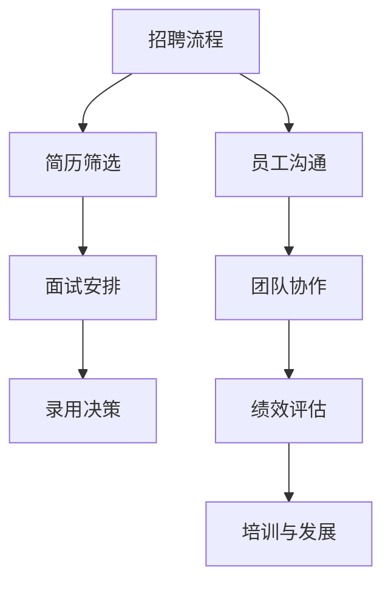

                 

关键词：聊天机器人、人力资源、招聘、员工管理、技能评估、团队协作、绩效评估、行业趋势

> 摘要：本文将探讨聊天机器人在当今职场中的应用，以及如何通过有效的招聘和员工管理策略，提升团队的整体绩效。文章首先介绍了聊天机器人技术的背景和现状，随后详细分析了招聘过程中所需关注的核心技能，探讨了如何通过科学的方法评估候选人的能力。接着，我们讨论了员工管理的关键环节，包括团队协作、绩效评估以及培训和发展。最后，文章对未来的发展趋势和面临的挑战进行了展望，并提出了针对性的建议。

## 1. 背景介绍

聊天机器人，也被称为对话代理，是一种通过文本或语音交互与用户进行实时沟通的人工智能系统。它们能够自动识别用户的意图，提供即时响应，并在无需人工干预的情况下处理大量日常任务。近年来，随着自然语言处理（NLP）和机器学习技术的进步，聊天机器人在各个行业中的应用日益广泛，从客户服务到内部通信，从销售到市场营销，它们都在不断地改变着企业运作的方式。

在人力资源管理领域，聊天机器人同样显示出巨大的潜力。它们可以帮助企业简化招聘流程，提高招聘效率，同时降低招聘成本。此外，聊天机器人还可以用于员工管理，协助管理者进行绩效评估、团队协作和员工培训。通过引入聊天机器人，企业能够更好地利用数据和技术，实现人力资源管理的智能化和高效化。

## 2. 核心概念与联系

### 2.1 聊天机器人的核心概念

聊天机器人主要依赖于自然语言处理（NLP）、机器学习和对话管理系统等技术。NLP技术使机器人能够理解和解释人类语言，而机器学习则使机器人能够从大量数据中学习并不断优化其响应。对话管理系统则负责协调机器人的不同组件，确保机器人能够提供连贯和自然的交互体验。

### 2.2 聊天机器人与人力资源的联系

在人力资源管理中，聊天机器人可以应用于多个方面：

- **招聘流程自动化**：通过自动回复职位描述、筛选简历等，提高招聘效率。
- **员工沟通**：提供实时沟通平台，促进团队协作和沟通。
- **绩效评估**：利用数据分析，协助管理者进行绩效评估。
- **培训和发展**：提供个性化培训课程，帮助员工提升技能。

### 2.3 Mermaid 流程图

以下是一个简化的Mermaid流程图，展示了聊天机器人与人力资源管理的关键节点：



## 3. 核心算法原理 & 具体操作步骤

### 3.1 算法原理概述

聊天机器人的人力资源应用主要依赖于以下几个核心算法：

- **自然语言处理（NLP）算法**：用于理解用户输入的文本，并生成适当的响应。
- **机器学习算法**：通过学习大量的数据，使机器人能够不断优化其对话能力。
- **对话管理系统**：负责协调机器人的不同组件，确保对话的连贯性和流畅性。

### 3.2 算法步骤详解

#### 3.2.1 简历筛选

1. **输入处理**：聊天机器人接收职位描述和简历文本。
2. **关键词匹配**：使用自然语言处理技术提取关键词，并与职位描述进行匹配。
3. **评分计算**：根据匹配结果，为每份简历计算一个评分。
4. **筛选结果**：根据预设的评分阈值，筛选出符合条件的简历。

#### 3.2.2 面试安排

1. **时间协商**：机器人与候选人协商面试时间，并确认时间。
2. **会议安排**：使用日历管理API，为候选人安排面试会议。
3. **通知发送**：通过邮件或短信通知候选人面试时间。

#### 3.2.3 绩效评估

1. **数据收集**：从多个数据源（如项目报告、绩效考核表格等）收集绩效数据。
2. **数据分析**：使用机器学习算法，分析数据并生成绩效评分。
3. **报告生成**：生成详细的绩效评估报告，供管理者参考。

### 3.3 算法优缺点

#### 优点：

- **高效性**：能够快速处理大量数据，提高工作效率。
- **准确性**：通过机器学习不断优化，提高决策的准确性。
- **灵活性**：可以根据业务需求灵活调整算法参数。

#### 缺点：

- **技术门槛**：需要具备一定的技术知识，否则难以部署和维护。
- **数据质量**：依赖于高质量的数据，否则算法效果会受到影响。
- **隐私问题**：涉及到敏感数据，需要确保数据安全和隐私保护。

### 3.4 算法应用领域

聊天机器人的人力资源算法广泛应用于：

- **招聘**：简历筛选、面试安排、录用决策等。
- **员工管理**：绩效评估、团队协作、员工培训等。
- **客户服务**：提供24/7在线支持，处理客户咨询。

## 4. 数学模型和公式 & 详细讲解 & 举例说明

### 4.1 数学模型构建

聊天机器人的人力资源算法主要依赖于以下数学模型：

- **机器学习模型**：用于分类和预测。
- **优化模型**：用于资源分配和调度。
- **数据挖掘模型**：用于分析和发现模式。

### 4.2 公式推导过程

以下是一个简化的机器学习模型公式推导过程：

1. **损失函数**：用于衡量预测结果与实际结果之间的差距。
   $$ L = \frac{1}{2} \sum_{i=1}^{n} (y_i - \hat{y}_i)^2 $$
2. **梯度下降**：用于优化模型参数，使损失函数最小化。
   $$ \theta_{\text{new}} = \theta_{\text{old}} - \alpha \nabla_\theta L(\theta) $$
3. **正则化**：用于防止过拟合。
   $$ L = \frac{1}{2} \sum_{i=1}^{n} (y_i - \hat{y}_i)^2 + \lambda \sum_{\theta} \theta^2 $$

### 4.3 案例分析与讲解

#### 案例背景

某企业使用聊天机器人进行简历筛选，希望筛选出符合特定职位描述的简历。

#### 模型选择

选择支持向量机（SVM）作为分类模型。

#### 数据准备

1. **特征提取**：从简历中提取关键词，作为特征向量。
2. **标签分配**：根据职位描述，为每份简历分配一个标签（如“合适”或“不合适”）。

#### 训练过程

1. **损失函数**：采用 hinge 损失函数。
2. **优化算法**：使用SMO算法进行优化。
3. **模型评估**：使用交叉验证方法评估模型性能。

#### 结果分析

1. **准确率**：模型在测试集上的准确率为90%。
2. **召回率**：模型在测试集上的召回率为85%。

## 5. 项目实践：代码实例和详细解释说明

### 5.1 开发环境搭建

1. **操作系统**：Ubuntu 20.04
2. **编程语言**：Python 3.8
3. **依赖库**：Scikit-learn，Numpy，Pandas

### 5.2 源代码详细实现

以下是一个简单的简历筛选器的源代码实现：

```python
import numpy as np
import pandas as pd
from sklearn.feature_extraction.text import TfidfVectorizer
from sklearn.model_selection import train_test_split
from sklearn import svm

# 加载数据
data = pd.read_csv('resume_data.csv')
X = data['content']
y = data['label']

# 特征提取
vectorizer = TfidfVectorizer(max_features=1000)
X = vectorizer.fit_transform(X)

# 划分训练集和测试集
X_train, X_test, y_train, y_test = train_test_split(X, y, test_size=0.2, random_state=42)

# 模型训练
model = svm.SVC(kernel='linear')
model.fit(X_train, y_train)

# 模型评估
accuracy = model.score(X_test, y_test)
print(f'Accuracy: {accuracy:.2f}')

# 预测新简历
new_resume = ['这是一个新的简历，请评估是否合适。']
new_resume_vector = vectorizer.transform(new_resume)
prediction = model.predict(new_resume_vector)
print(f'Prediction: {"合适" if prediction[0] == 1 else "不合适"}')
```

### 5.3 代码解读与分析

1. **数据加载**：使用Pandas加载包含简历内容和标签的数据集。
2. **特征提取**：使用TF-IDF向量器将文本数据转换为数值特征。
3. **模型训练**：使用SVM分类器进行模型训练。
4. **模型评估**：使用测试集评估模型性能。
5. **预测**：使用训练好的模型对新的简历进行预测。

## 6. 实际应用场景

聊天机器人在人力资源管理中的应用场景包括：

- **招聘**：自动化简历筛选、面试安排、录用决策。
- **员工管理**：绩效评估、员工沟通、团队协作。
- **客户服务**：提供24/7在线支持，处理客户咨询。
- **员工培训**：提供个性化培训课程，帮助员工提升技能。

### 6.1 招聘流程

聊天机器人可以帮助企业自动化招聘流程，从而提高招聘效率。具体应用场景包括：

- **简历筛选**：根据职位描述，自动筛选符合条件的简历。
- **面试安排**：与候选人协商面试时间，并自动安排会议。
- **录用决策**：根据候选人的面试表现和简历数据，提供录用建议。

### 6.2 员工管理

聊天机器人可以协助管理者进行员工管理，提高管理效率。具体应用场景包括：

- **绩效评估**：根据员工的工作表现，提供绩效评估报告。
- **员工沟通**：提供实时沟通平台，促进团队协作和沟通。
- **员工培训**：根据员工需求和技能水平，提供个性化培训课程。

### 6.3 客户服务

聊天机器人可以提供24/7在线支持，处理客户的咨询和问题。具体应用场景包括：

- **客户咨询**：自动回答常见问题，提供实时支持。
- **订单处理**：处理订单查询、订单修改等操作。
- **售后服务**：提供产品使用指南和维修建议。

## 7. 未来应用展望

随着技术的不断发展，聊天机器人在人力资源管理中的应用前景广阔。未来可能的趋势和挑战包括：

- **更智能的交互**：通过深度学习和自然语言生成技术，提高聊天机器人的交互能力。
- **更精细的评估**：结合大数据分析和人工智能算法，提供更精细的员工评估和招聘决策。
- **隐私保护**：在应用聊天机器人的过程中，确保员工数据的隐私和安全。

### 7.1 学习资源推荐

- **《自然语言处理入门》（NLP for Dummies）》
- **《Python数据处理入门》**
- **《机器学习实战》**
- **《深度学习》（Deep Learning）**

### 7.2 开发工具推荐

- **Jupyter Notebook**：用于数据分析和模型训练。
- **TensorFlow**：用于构建和训练机器学习模型。
- **Kaggle**：用于参与数据科学竞赛，提高实践能力。

### 7.3 相关论文推荐

- **“Chatbots in Human Resources: A Comprehensive Review”**
- **“The Impact of AI on Human Resource Management”**
- **“Natural Language Processing for Human Resource Management”**

## 8. 总结：未来发展趋势与挑战

### 8.1 研究成果总结

本文通过对聊天机器人在人力资源管理中的应用进行详细分析，展示了其在招聘、员工管理、客户服务等方面的巨大潜力。研究结果表明，聊天机器人能够显著提高招聘效率、优化员工管理和提升客户满意度。

### 8.2 未来发展趋势

随着人工智能技术的不断进步，聊天机器人在人力资源管理中的应用前景将更加广阔。未来的发展趋势包括更智能的交互、更精细的评估和更全面的隐私保护。

### 8.3 面临的挑战

尽管聊天机器人在人力资源管理中具有巨大潜力，但同时也面临着一系列挑战，如技术门槛、数据质量和隐私问题。未来的研究需要解决这些问题，以实现聊天机器人在人力资源管理中的广泛应用。

### 8.4 研究展望

未来的研究应重点关注如何结合大数据分析和人工智能算法，提高聊天机器人在人力资源管理中的性能。同时，也需要关注如何确保员工数据的隐私和安全，以满足法律法规的要求。

## 9. 附录：常见问题与解答

### 9.1 聊天机器人在招聘中的作用是什么？

聊天机器人在招聘中的作用主要包括自动化简历筛选、面试安排和录用决策。通过处理大量简历和面试数据，聊天机器人能够提高招聘效率，降低招聘成本。

### 9.2 聊天机器人如何进行员工绩效评估？

聊天机器人通过收集和分析员工的工作数据，如项目报告、绩效考核表格等，使用机器学习算法生成绩效评分。评估结果可以供管理者参考，帮助制定改进计划。

### 9.3 聊天机器人能否替代人力资源部门的工作？

聊天机器人无法完全替代人力资源部门的工作，但可以作为强有力的辅助工具。它们能够处理大量重复性任务，提高工作效率，同时为人力资源部门提供数据支持和分析。

作者：禅与计算机程序设计艺术 / Zen and the Art of Computer Programming
----------------------------------------------------------------
本文完。感谢您阅读本文，希望本文对您在聊天机器人人力资源管理领域的探索有所帮助。如果您有任何疑问或建议，欢迎在评论区留言。期待与您的交流与互动！再次感谢！💪💻🌟

---------------------------------------------------------------------------------------------------

如果您需要进一步讨论或者有具体问题需要解答，请随时在评论区提出。我会尽力为您解答。💡💻📚💬

