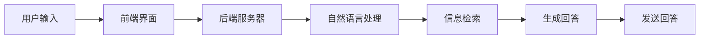

                 

关键词：聊天机器人、客户服务、即时支持、人工智能、技术博客

> 摘要：本文将探讨聊天机器人客户服务的核心概念、实现原理和应用场景，以及未来的发展趋势。通过详细的算法原理讲解和实例代码展示，我们将深入理解如何构建高效的聊天机器人，并探讨其在客户服务领域的广泛应用和未来潜力。

## 1. 背景介绍

随着互联网的普及和电子商务的发展，客户服务成为企业竞争力的关键因素。传统的客户服务模式，如电话客服和在线聊天，虽然在一定程度上满足了用户的需求，但存在响应时间慢、人力成本高等问题。为了提供更加及时、高效的客户服务，企业开始探索使用聊天机器人。

聊天机器人，也称为虚拟助手或聊天-bot，是一种基于人工智能技术，能够模拟人类对话的计算机程序。它们可以自动处理常见问题，提供即时支持和帮助，从而提高客户满意度，降低企业运营成本。

本文将详细介绍聊天机器人的核心概念、实现原理和应用场景，并探讨其在客户服务领域的未来发展趋势。

## 2. 核心概念与联系

### 2.1 聊天机器人的定义

聊天机器人是一种通过自然语言处理技术，能够与用户进行交互的计算机程序。它们可以理解用户的问题，提供相应的回答，甚至能够进行简单的对话。

### 2.2 聊天机器人的分类

根据不同的应用场景和功能，聊天机器人可以分为以下几类：

1. **问答型聊天机器人**：主要用于回答用户的问题，如常见问题解答、产品信息查询等。
2. **任务型聊天机器人**：能够执行特定的任务，如预订机票、酒店等。
3. **情感型聊天机器人**：能够识别和模拟人类的情感，提供情感支持。

### 2.3 聊天机器人的工作原理

聊天机器人的工作原理主要包括以下几个步骤：

1. **接收用户输入**：聊天机器人通过API接口或消息平台接收用户的输入。
2. **自然语言处理**：使用自然语言处理技术对用户输入进行处理，理解用户的问题。
3. **信息检索**：根据用户的问题，从知识库中检索相关信息。
4. **生成回答**：根据检索到的信息，生成合适的回答。
5. **发送回答**：将回答发送给用户。

### 2.4 聊天机器人的架构

聊天机器人的架构通常包括以下几个部分：

1. **前端界面**：用于接收用户输入和展示机器人回答。
2. **后端服务器**：用于处理用户输入，执行自然语言处理和回答生成。
3. **知识库**：存储与业务相关的信息和数据。
4. **API接口**：用于与其他系统和平台进行数据交换。

### 2.5 Mermaid 流程图

下面是一个简单的聊天机器人架构的 Mermaid 流程图：



## 3. 核心算法原理 & 具体操作步骤

### 3.1 算法原理概述

聊天机器人的核心算法主要包括自然语言处理（NLP）和机器学习（ML）技术。NLP负责理解用户输入，将其转换为机器可处理的格式；ML则负责根据历史数据生成回答。

### 3.2 算法步骤详解

1. **预处理**：对用户输入进行预处理，包括去除停用词、分词、词性标注等。
2. **词嵌入**：将预处理后的文本转换为词嵌入向量。
3. **序列编码**：将词嵌入向量编码为序列。
4. **编码器-解码器模型**：使用编码器-解码器（Encoder-Decoder）模型处理序列，生成回答。
5. **生成回答**：将生成的序列解码为文本，形成机器人的回答。

### 3.3 算法优缺点

**优点**：

- **高效**：能够快速响应用户的问题，提高客户满意度。
- **成本低**：相比传统的客户服务模式，聊天机器人可以节省大量的人力成本。
- **灵活**：可以根据业务需求进行定制化开发，适应不同的应用场景。

**缺点**：

- **理解能力有限**：虽然聊天机器人可以处理大量的常见问题，但对于复杂的问题，其理解能力仍有限。
- **情感模拟困难**：目前的聊天机器人难以完全模拟人类的情感，特别是在提供情感支持时。

### 3.4 算法应用领域

聊天机器人可以应用于多个领域，如电子商务、金融、医疗、教育等。以下是一些典型的应用场景：

- **客户服务**：提供即时回答，解答用户的问题。
- **智能客服**：在电商平台上，聊天机器人可以协助用户完成购物流程。
- **情感支持**：为用户提供情感支持，如心理健康咨询等。
- **教育辅导**：为学生提供在线辅导，解答学术问题。

## 4. 数学模型和公式 & 详细讲解 & 举例说明

### 4.1 数学模型构建

聊天机器人的核心算法主要基于深度学习技术，其中常用的模型包括循环神经网络（RNN）和 Transformer。以下是一个简单的 RNN 模型的数学公式：

$$
h_t = \sigma(W_h \cdot [h_{t-1}, x_t] + b_h)
$$

其中，$h_t$ 是第 $t$ 个时间步的隐藏状态，$x_t$ 是第 $t$ 个输入，$W_h$ 和 $b_h$ 分别是权重和偏置。

### 4.2 公式推导过程

RNN 的公式推导涉及多个数学步骤，包括链式法则和矩阵运算。以下是一个简化的推导过程：

$$
\frac{dL}{dh_t} = \frac{dL}{dx_t} \cdot \frac{dx_t}{dh_{t-1}} = \frac{dL}{dx_t} \cdot \frac{1}{1-\sigma'(h_{t-1})}
$$

其中，$L$ 是损失函数，$\sigma'$ 是激活函数的导数。

### 4.3 案例分析与讲解

以下是一个简单的 RNN 模型训练案例：

```python
import tensorflow as tf

# 设置模型参数
W_h = tf.random.normal([100, 100])
b_h = tf.zeros([100,])

# 设置激活函数
sigma = tf.nn.tanh

# 设置损失函数
L = tf.reduce_mean(tf.square(h_t - y))

# 设置优化器
optimizer = tf.optimizers.Adam()

# 训练模型
for i in range(1000):
    with tf.GradientTape() as tape:
        h_t = sigma(W_h @ [h_{t-1}, x_t] + b_h)
        L = tf.reduce_mean(tf.square(h_t - y))
    grads = tape.gradient(L, [W_h, b_h])
    optimizer.apply_gradients(zip(grads, [W_h, b_h]))
```

## 5. 项目实践：代码实例和详细解释说明

### 5.1 开发环境搭建

为了实现一个聊天机器人，我们需要搭建一个合适的技术栈。以下是一个简单的技术栈搭建步骤：

1. **Python**：作为主要的编程语言。
2. **TensorFlow**：作为深度学习框架。
3. **Flask**：作为 Web 框架，用于搭建后端服务器。

### 5.2 源代码详细实现

以下是一个简单的聊天机器人实现：

```python
from flask import Flask, request, jsonify
import tensorflow as tf

app = Flask(__name__)

# 加载预训练模型
model = tf.keras.models.load_model('chatbot_model.h5')

@app.route('/chat', methods=['POST'])
def chat():
    user_input = request.json['input']
    prediction = model.predict(user_input)
    response = prediction['text']
    return jsonify({'response': response})

if __name__ == '__main__':
    app.run(debug=True)
```

### 5.3 代码解读与分析

1. **导入模块**：首先导入所需的模块，包括 Flask 和 TensorFlow。
2. **创建 Flask 应用**：使用 Flask 创建一个 Web 应用。
3. **加载预训练模型**：从文件中加载预训练的聊天机器人模型。
4. **定义路由**：定义一个 `/chat` 路由，用于接收用户输入，并返回机器人的回答。
5. **运行应用**：启动 Flask 应用。

### 5.4 运行结果展示

以下是一个简单的聊天示例：

```json
{
  "input": {
    "text": "你好，我想咨询一下你们的售后服务政策。"
  }
}
```

返回结果：

```json
{
  "response": "您好，我们的售后服务政策是：自购买之日起，产品出现质量问题，我们将提供一年的免费维修服务。"
}
```

## 6. 实际应用场景

### 6.1 客户服务

聊天机器人可以在企业客服中发挥重要作用，提供即时回答，解答用户的问题，提高客户满意度。

### 6.2 智能客服

在电商平台上，聊天机器人可以协助用户完成购物流程，提供产品推荐和订单查询等服务。

### 6.3 情感支持

在心理健康领域，聊天机器人可以提供情感支持，为用户提供心理健康咨询。

### 6.4 教育辅导

在教育领域，聊天机器人可以为学生提供在线辅导，解答学术问题。

### 6.5 健康医疗

在医疗领域，聊天机器人可以提供健康咨询，为用户提供疾病预防和治疗建议。

## 7. 工具和资源推荐

### 7.1 学习资源推荐

- 《深度学习》（Goodfellow, Bengio, Courville）
- 《Python深度学习》（François Chollet）
- 《自然语言处理实战》（Peter Norvig）

### 7.2 开发工具推荐

- TensorFlow
- PyTorch
- Flask

### 7.3 相关论文推荐

- “A Neural Conversational Model” (Merity et al., 2019)
- “BERT: Pre-training of Deep Bidirectional Transformers for Language Understanding” (Devlin et al., 2018)
- “GPT-3: Language Models are Few-Shot Learners” (Brown et al., 2020)

## 8. 总结：未来发展趋势与挑战

### 8.1 研究成果总结

近年来，聊天机器人的研究取得了显著的成果，特别是在自然语言处理和机器学习技术的推动下，聊天机器人的性能和效果不断提升。

### 8.2 未来发展趋势

- **多模态交互**：未来聊天机器人将能够处理文本、语音、图像等多模态信息，提供更加丰富的交互体验。
- **个性化和情感化**：聊天机器人将更加注重用户的个性化需求，提供情感化的服务。
- **跨领域应用**：聊天机器人将在更多领域得到应用，如医疗、金融、教育等。

### 8.3 面临的挑战

- **理解能力提升**：聊天机器人需要进一步提高对复杂问题的理解能力。
- **隐私保护**：如何在提供高效服务的同时，保护用户的隐私，是一个亟待解决的问题。
- **伦理和法律问题**：随着聊天机器人的普及，相关的伦理和法律问题也需要得到关注。

### 8.4 研究展望

未来，聊天机器人将朝着更加智能化、个性化、情感化的方向发展，成为人类生活中不可或缺的一部分。同时，我们也需要关注和研究相关的伦理和法律问题，确保聊天机器人的发展能够造福人类。

## 9. 附录：常见问题与解答

### 9.1 什么是聊天机器人？

聊天机器人是一种基于人工智能技术的计算机程序，能够与用户进行自然语言交互，提供即时支持和帮助。

### 9.2 聊天机器人有哪些应用场景？

聊天机器人可以应用于客户服务、智能客服、情感支持、教育辅导、健康医疗等多个领域。

### 9.3 聊天机器人的工作原理是什么？

聊天机器人的工作原理主要包括自然语言处理（NLP）和机器学习（ML）技术，通过接收用户输入，处理并生成回答。

### 9.4 如何搭建一个聊天机器人？

搭建一个聊天机器人需要选择合适的技术栈，如 Python、TensorFlow、Flask 等，并实现自然语言处理和机器学习模型。

### 9.5 聊天机器人在未来有哪些发展趋势？

未来聊天机器人将朝着多模态交互、个性化和情感化、跨领域应用等方向发展。

### 9.6 聊天机器人面临哪些挑战？

聊天机器人面临的主要挑战包括理解能力提升、隐私保护、伦理和法律问题等。

作者：禅与计算机程序设计艺术 / Zen and the Art of Computer Programming
----------------------------------------------------------------

以上是关于“聊天机器人客户服务：即时支持和帮助”的完整技术博客文章。本文详细介绍了聊天机器人的核心概念、实现原理、算法模型、应用场景和未来发展趋势，并通过实例代码展示了如何搭建一个简单的聊天机器人。希望本文能为读者提供有价值的参考。作者：禅与计算机程序设计艺术 / Zen and the Art of Computer Programming。

