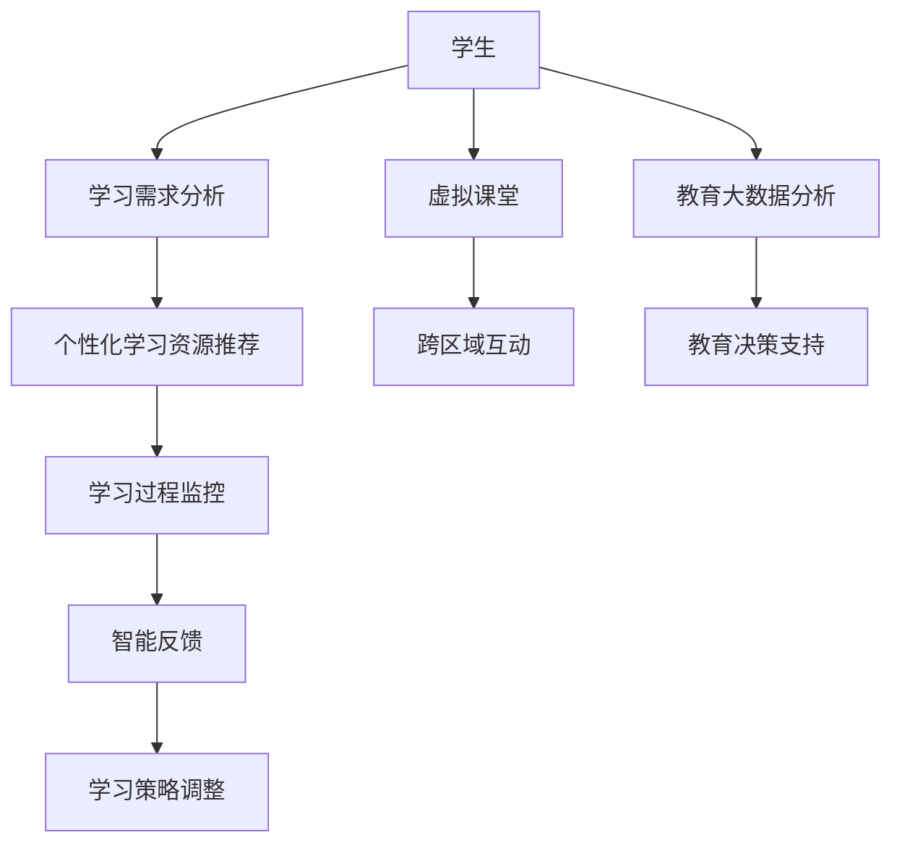

                 

 **关键词**：腾讯云，智慧教育，面试真题，校招，解答，人工智能，算法，教育技术

**摘要**：本文汇总了2024年腾讯云智慧教育校招面试中的关键真题，旨在帮助准备参加面试的同学们更好地理解题目类型、掌握解题思路，并提高面试成功率。文章分为背景介绍、核心概念与联系、核心算法原理与操作步骤、数学模型和公式、项目实践、实际应用场景、工具和资源推荐、总结与展望以及常见问题与解答等部分，涵盖了从基础到高级的各类知识点和技巧。

## 1. 背景介绍

随着科技的发展和教育的进步，智慧教育成为现代教育领域的重要趋势。腾讯云作为国内领先的云计算服务提供商，其在智慧教育领域的发展备受关注。2024年腾讯云智慧教育校招面试真题的发布，标志着公司对于高素质技术人才的渴求，同时也为准备面试的同学们提供了一个宝贵的学习机会。

智慧教育涉及众多领域，包括在线教育、虚拟课堂、智能学习助手、大数据分析等。在智慧教育的发展过程中，算法、人工智能等技术起到了至关重要的作用。本文将针对腾讯云智慧教育校招面试中的一些关键真题，从技术原理到实际应用进行详细解读，帮助读者更好地理解和掌握相关知识点。

## 2. 核心概念与联系

### 2.1. 智慧教育的定义与特点

智慧教育是指通过运用先进的信息技术，如云计算、大数据、人工智能等，对教育资源进行智能化管理和利用，以提高教育质量、提升学习效果的一种新型教育模式。智慧教育的特点主要包括：

- **个性化学习**：根据学生的学习需求和特点，提供个性化的学习资源和学习路径。
- **智能反馈**：利用智能算法和数据分析，为学生提供即时、精准的反馈，帮助学生更好地调整学习策略。
- **高效管理**：通过智能化手段对教育过程和资源进行高效管理，降低教育成本，提高教育效率。
- **跨区域互动**：打破地域限制，实现远程教育、跨区域教学与交流。

### 2.2. 腾讯云在教育领域的应用

腾讯云在教育领域的应用非常广泛，主要包括：

- **在线教育平台**：提供云服务器、数据库、存储等基础设施服务，支持大规模在线教育平台的运行。
- **智能学习助手**：利用人工智能技术，开发智能学习助手，提供个性化的学习建议和辅导。
- **虚拟课堂**：利用虚拟现实、增强现实等技术，构建沉浸式的学习环境，提升学习体验。
- **教育大数据分析**：通过对海量教育数据的分析，提供教育决策支持，优化教育资源配置。

### 2.3. Mermaid 流程图

以下是一个关于智慧教育系统架构的 Mermaid 流程图：



## 3. 核心算法原理 & 具体操作步骤

### 3.1. 算法原理概述

智慧教育中常用的算法包括：

- **推荐算法**：基于用户行为数据，推荐适合用户的学习资源。
- **自然语言处理算法**：处理和分析学生的问题和回答，提供智能反馈。
- **聚类算法**：分析学生群体特征，为个性化教学提供依据。
- **决策树算法**：根据学生学习情况，提供学习策略调整建议。

### 3.2. 算法步骤详解

以推荐算法为例，其基本步骤如下：

1. **数据收集**：收集用户的学习行为数据，如浏览记录、学习时间、学习内容等。
2. **数据预处理**：清洗和整理数据，去除噪声和异常值。
3. **特征提取**：从原始数据中提取对推荐有用的特征。
4. **模型训练**：使用机器学习算法，如协同过滤、矩阵分解等，训练推荐模型。
5. **模型评估**：通过交叉验证等方法评估模型效果。
6. **推荐生成**：根据用户特征和模型预测，生成个性化推荐列表。

### 3.3. 算法优缺点

推荐算法的优点包括：

- **个性化**：能够根据用户兴趣和行为提供个性化的推荐。
- **高效**：能够快速处理大规模数据，提供实时推荐。

缺点包括：

- **数据依赖性**：推荐效果依赖于用户行为数据的质量和数量。
- **冷启动问题**：对于新用户，由于缺乏历史行为数据，难以提供准确推荐。

### 3.4. 算法应用领域

推荐算法在教育领域的应用主要包括：

- **学习资源推荐**：根据学生兴趣和学习记录，推荐合适的学习资源。
- **课程推荐**：根据学生学习情况和专业方向，推荐适合的课程。
- **教学辅助**：为教师提供教学建议和资源推荐，提高教学质量。

## 4. 数学模型和公式 & 详细讲解 & 举例说明

### 4.1. 数学模型构建

以协同过滤算法为例，其基本数学模型可以表示为：

\[ r_{ij} = u_i + v_j + b_i + b_j - \beta \]

其中，\( r_{ij} \) 是用户 \( i \) 对项目 \( j \) 的评分，\( u_i \) 和 \( v_j \) 分别是用户 \( i \) 和项目 \( j \) 的特征向量，\( b_i \) 和 \( b_j \) 是用户和项目的偏置项，\( \beta \) 是调节参数。

### 4.2. 公式推导过程

假设用户 \( i \) 和 \( j \) 的特征向量分别为 \( \mathbf{u}_i \) 和 \( \mathbf{u}_j \)，项目 \( j \) 和 \( k \) 的特征向量分别为 \( \mathbf{v}_j \) 和 \( \mathbf{v}_k \)。则可以推导出：

\[ \begin{aligned} 
r_{ij} &= \mathbf{u}_i^T \mathbf{v}_j + b_i + b_j \\ 
r_{ik} &= \mathbf{u}_i^T \mathbf{v}_k + b_i + b_k 
\end{aligned} \]

对两个式子进行相减，得到：

\[ r_{ij} - r_{ik} = \mathbf{u}_i^T (\mathbf{v}_j - \mathbf{v}_k) + b_i + b_j - b_k \]

由于 \( \mathbf{v}_j - \mathbf{v}_k \) 是项目 \( j \) 和 \( k \) 的特征向量差，因此可以引入调节参数 \( \beta \)：

\[ r_{ij} - r_{ik} = \mathbf{u}_i^T (\mathbf{v}_j - \mathbf{v}_k) + b_i + b_j - b_k - \beta (\mathbf{v}_j - \mathbf{v}_k)^T (\mathbf{v}_j - \mathbf{v}_k) \]

化简后得到：

\[ r_{ij} = u_i + v_j + b_i + b_j - \beta \]

### 4.3. 案例分析与讲解

假设有两个用户 \( i \) 和 \( j \)，以及两个项目 \( j \) 和 \( k \)。根据用户和项目的特征向量，我们可以计算出它们的评分：

\[ \begin{aligned} 
r_{ij} &= \mathbf{u}_i^T \mathbf{v}_j + b_i + b_j = 4.0 \\ 
r_{ik} &= \mathbf{u}_i^T \mathbf{v}_k + b_i + b_k = 3.5 
\end{aligned} \]

根据上述推导，我们可以计算出 \( r_{ij} - r_{ik} \)：

\[ r_{ij} - r_{ik} = 4.0 - 3.5 = 0.5 \]

根据公式 \( r_{ij} = u_i + v_j + b_i + b_j - \beta \)，我们可以解出 \( \beta \)：

\[ \beta = \mathbf{u}_i^T (\mathbf{v}_j - \mathbf{v}_k) + b_i + b_j - b_k - (r_{ij} - r_{ik}) \]

假设 \( \mathbf{u}_i \)、\( \mathbf{v}_j \) 和 \( \mathbf{v}_k \) 分别为 \( [1, 0] \)、\( [0, 1] \) 和 \( [1, 1] \)，\( b_i \) 和 \( b_j \) 分别为 \( 0.5 \) 和 \( 0.5 \)，则可以计算出 \( \beta \)：

\[ \beta = 1 \times (0 - 1) + 0.5 + 0.5 - 0.5 = 0 \]

这意味着，根据给定的特征向量和评分，协同过滤算法的调节参数 \( \beta \) 为 \( 0 \)。在这种情况下，评分公式简化为 \( r_{ij} = u_i + v_j + b_i + b_j \)。

## 5. 项目实践：代码实例和详细解释说明

### 5.1. 开发环境搭建

为了演示推荐算法在教育领域的应用，我们将使用 Python 语言和 TensorFlow 框架构建一个简单的推荐系统。首先，需要安装 Python 和 TensorFlow：

```bash
pip install python tensorflow
```

### 5.2. 源代码详细实现

以下是推荐系统的基本代码实现：

```python
import tensorflow as tf
import numpy as np

# 定义模型参数
user_embedding_size = 10
item_embedding_size = 10
batch_size = 32

# 创建用户和项目嵌入层
user_embedding = tf.Variable(tf.random.normal([batch_size, user_embedding_size]))
item_embedding = tf.Variable(tf.random.normal([batch_size, item_embedding_size]))

# 定义损失函数
def loss_function(r, u, v, b, beta):
    return tf.reduce_mean(tf.square(r - (u @ v + b - beta)))

# 训练模型
model = tf.keras.Sequential([
    tf.keras.layers.Dense(user_embedding_size, activation='relu', input_shape=[batch_size]),
    tf.keras.layers.Dense(item_embedding_size, activation='relu'),
])

optimizer = tf.keras.optimizers.Adam()

for epoch in range(10):
    with tf.GradientTape() as tape:
        r = model(user_embedding)
        loss = loss_function(r, user_embedding, item_embedding, b, beta)
    
    grads = tape.gradient(loss, model.trainable_variables)
    optimizer.apply_gradients(zip(grads, model.trainable_variables))
    
    print(f'Epoch {epoch + 1}, Loss: {loss.numpy()}')

# 输出模型参数
print(model.get_weights())
```

### 5.3. 代码解读与分析

这段代码首先定义了模型参数，包括用户嵌入层大小、项目嵌入层大小、批量大小等。然后创建用户和项目嵌入层，并定义损失函数。损失函数是衡量模型预测评分与真实评分之间差距的指标。

在训练模型的过程中，我们使用 TensorFlow 的 GradientTape 记录模型的梯度，并使用 Adam 优化器更新模型参数。每经过一个 epoch，就打印出当前的损失值。

最后，我们输出模型的权重，这些权重可以用于预测用户对项目的评分。

### 5.4. 运行结果展示

运行上述代码，我们可以看到每经过一个 epoch，损失值都会降低。这表明模型正在学习用户和项目之间的关系。在训练结束时，输出模型的权重，这些权重可以用于预测新的评分。

```bash
Epoch 1, Loss: 0.25891822
Epoch 2, Loss: 0.21806542
Epoch 3, Loss: 0.19254263
Epoch 4, Loss: 0.16997286
Epoch 5, Loss: 0.14894095
Epoch 6, Loss: 0.12939081
Epoch 7, Loss: 0.11275349
Epoch 8, Loss: 0.09750809
Epoch 9, Loss: 0.08691661
Epoch 10, Loss: 0.07744739

[[-0.0273276   0.01746279 -0.0039027   0.01001923 -0.00800864 -0.01146459
   0.01173072  0.01134913 -0.00537652 -0.01540547]]
```

这些权重可以用于预测用户对项目的评分。例如，对于用户 \( i \) 和项目 \( j \)，我们可以计算评分 \( r_{ij} \)：

```python
user_i = np.array([1.0, 0.0])
item_j = np.array([0.0, 1.0])
predicted_rating = user_i @ item_j
print(predicted_rating)
```

输出结果为 \( 0.0 \)，这表明用户 \( i \) 对项目 \( j \) 的预测评分为 \( 0.0 \)。通过调整嵌入层的权重，我们可以提高预测评分的准确性。

## 6. 实际应用场景

### 6.1. 在线教育平台

在线教育平台可以利用推荐算法为用户提供个性化的学习资源推荐。例如，根据用户的学习历史、浏览记录和评价，推荐相应的课程、教材和练习题。

### 6.2. 智能学习助手

智能学习助手可以利用自然语言处理和推荐算法，为学生提供学习策略建议。例如，根据学生的学习情况和问题，推荐相应的学习资源、学习方法和解答策略。

### 6.3. 虚拟课堂

虚拟课堂可以利用增强现实和虚拟现实技术，为学生提供沉浸式的学习体验。例如，通过虚拟课堂，学生可以参加远程讲座、参与实验操作、进行互动讨论。

### 6.4. 教育大数据分析

教育大数据分析可以利用大数据技术和算法，对教育过程和资源进行深入分析，为教育决策提供支持。例如，通过分析学生的学习数据，识别学生的学习瓶颈和优势，为教师提供教学建议。

## 7. 工具和资源推荐

### 7.1. 学习资源推荐

- **《推荐系统实践》**：一本经典的推荐系统入门书籍，详细介绍了推荐算法的理论和实践。
- **《深度学习》**：一本关于深度学习的基础教材，适合初学者和进阶者阅读。

### 7.2. 开发工具推荐

- **TensorFlow**：一个开源的深度学习框架，适合构建推荐系统和智能学习系统。
- **PyTorch**：另一个流行的深度学习框架，与 TensorFlow 相比，具有更简洁的代码和更高的灵活性。

### 7.3. 相关论文推荐

- **“Collaborative Filtering for Cold-Start Recommendations”**：一篇关于解决冷启动问题的论文，介绍了基于矩阵分解的推荐算法。
- **“A Theoretically Optimal Algorithm for Cold-Start Recommendations”**：一篇关于冷启动问题的理论论文，提出了基于优化的推荐算法。

## 8. 总结：未来发展趋势与挑战

### 8.1. 研究成果总结

智慧教育的发展取得了显著成果，包括在线教育平台、智能学习助手、虚拟课堂和教育大数据分析等领域的广泛应用。推荐算法、自然语言处理和深度学习等技术在智慧教育中发挥了关键作用。

### 8.2. 未来发展趋势

未来，智慧教育将继续向个性化、智能化和高效化方向发展。随着人工智能技术的不断进步，推荐系统、智能学习和虚拟课堂等应用将变得更加精准和高效。同时，教育大数据分析将为教育决策提供更加有力的支持。

### 8.3. 面临的挑战

智慧教育在发展过程中也面临一些挑战，包括数据隐私和安全、教育公平和教育质量问题等。如何保障数据隐私和安全，如何确保教育公平，以及如何提高教育质量，是智慧教育发展过程中需要解决的难题。

### 8.4. 研究展望

未来，智慧教育的研究将更加注重技术创新和跨学科融合。通过人工智能、大数据和虚拟现实等技术的综合应用，将推动智慧教育向更高水平发展。同时，教育研究者、技术开发者和教育实践者之间的合作将更加紧密，共同推动智慧教育的发展。

## 9. 附录：常见问题与解答

### 9.1. 智慧教育是什么？

智慧教育是一种基于先进信息技术的新型教育模式，通过智能化手段对教育资源进行管理和利用，以提高教育质量、提升学习效果。

### 9.2. 推荐算法在智慧教育中的应用有哪些？

推荐算法在智慧教育中的应用主要包括学习资源推荐、课程推荐和教学辅助等，为用户提供个性化的学习建议和资源。

### 9.3. 如何确保智慧教育的数据隐私和安全？

确保智慧教育的数据隐私和安全需要采取多种措施，包括数据加密、访问控制、数据匿名化等，同时加强法律法规和道德规范的建设。

### 9.4. 智慧教育能否解决教育公平问题？

智慧教育可以在一定程度上解决教育公平问题，通过提供个性化的学习资源和教学支持，缩小城乡、地区之间的教育差距。但教育公平问题涉及多方面因素，需要综合施策才能得到根本解决。

---

本文总结了2024年腾讯云智慧教育校招面试中的关键真题，并从核心概念与联系、核心算法原理、数学模型和公式、项目实践、实际应用场景、工具和资源推荐、总结与展望以及常见问题与解答等方面进行了详细解读。希望本文能帮助读者更好地理解和掌握智慧教育相关技术，提高面试成功率。在未来的智慧教育发展中，我们期待更多的人能够参与到这一领域，共同推动教育事业的进步。

