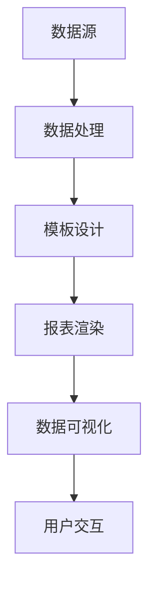

                 

随着大数据时代的到来，数据的数量和种类日益增长，如何高效地处理和分析这些数据，并将其可视化，成为了一个关键问题。自动化报表生成与数据可视化技术应运而生，它不仅提高了工作效率，还使数据分析变得更加直观和易懂。本文将深入探讨自动化报表生成与数据可视化的核心概念、算法原理、数学模型、项目实践和未来展望，旨在为读者提供一个全面的技术指南。

## 关键词

- 自动化报表生成
- 数据可视化
- 报表模板
- 数据处理
- 可视化库
- 数学模型

## 摘要

本文旨在探讨自动化报表生成与数据可视化的技术与应用。首先，我们介绍了自动化报表生成与数据可视化的背景和重要性。接着，详细介绍了核心概念、算法原理和数学模型。随后，通过一个实际项目实例，展示了如何实现自动化报表生成与数据可视化。最后，我们对未来技术发展趋势和应用前景进行了展望。

## 1. 背景介绍

### 1.1 大数据时代的挑战

随着互联网和物联网的快速发展，数据量呈现爆炸式增长。大数据不仅包括传统的关系型数据库数据，还包括非结构化和半结构化数据，如文本、图像、音频和视频等。如何有效地存储、管理和分析这些海量数据，成为了一个巨大的挑战。

### 1.2 数据分析的需求

数据分析是大数据处理的核心环节。通过数据分析，企业可以获得有价值的信息和洞察，从而做出更加明智的决策。然而，数据分析的效果往往受到数据质量和数据可视化的影响。

### 1.3 自动化报表生成与数据可视化的优势

自动化报表生成与数据可视化技术能够快速、准确地处理和分析数据，并将结果以直观、易懂的方式呈现给用户。这种技术具有以下优势：

- **提高工作效率**：自动化报表生成可以节省大量的人工处理时间，提高工作效率。
- **数据洞察**：数据可视化使得数据变得更加直观，有助于用户快速理解和发现数据中的规律和趋势。
- **辅助决策**：直观的数据展示可以帮助企业更好地理解数据，从而做出更准确的决策。

## 2. 核心概念与联系

### 2.1 自动化报表生成

自动化报表生成是指利用计算机技术自动生成报表，而不是通过手动输入或编辑。这通常涉及数据处理、模板设计、报表渲染等多个环节。

### 2.2 数据可视化

数据可视化是指将数据以图形、图像或表格的形式展示出来，以便用户更好地理解和分析数据。数据可视化库和工具是实现这一目标的重要手段。

### 2.3 关联流程图

以下是一个简单的Mermaid流程图，展示了自动化报表生成与数据可视化的关联流程：



### 2.4 各个阶段的关系

- **数据处理**：数据处理是自动化报表生成与数据可视化的基础。它涉及数据清洗、转换、聚合等操作，确保数据的质量和准确性。
- **模板设计**：模板设计是报表生成的关键环节。通过设计合适的模板，可以确保报表的结构和样式符合要求。
- **报表渲染**：报表渲染是将处理后的数据和模板结合，生成最终的报表。这个过程通常由报表生成工具或库来完成。
- **数据可视化**：数据可视化是将报表以图形、图像或表格的形式展示出来，使得数据更加直观易懂。

## 3. 核心算法原理 & 具体操作步骤

### 3.1 算法原理概述

自动化报表生成与数据可视化的核心算法主要包括数据清洗、数据处理、模板渲染和数据可视化算法。

- **数据清洗**：数据清洗是指处理脏数据、缺失值和异常值，确保数据的质量。
- **数据处理**：数据处理是指对数据进行聚合、计算和转换，以适应报表生成的需求。
- **模板渲染**：模板渲染是指将处理后的数据和模板结合，生成最终的报表。
- **数据可视化**：数据可视化是指将报表以图形、图像或表格的形式展示出来。

### 3.2 算法步骤详解

1. **数据采集与清洗**：
   - 从数据源采集数据。
   - 清洗数据，处理缺失值、异常值等。

2. **数据处理**：
   - 对数据进行聚合、计算和转换。
   - 准备报表生成所需的数据。

3. **模板设计**：
   - 设计报表模板，包括报表的结构、样式和内容。

4. **报表渲染**：
   - 将处理后的数据和模板结合，生成最终的报表。

5. **数据可视化**：
   - 使用可视化库和工具，将报表以图形、图像或表格的形式展示。

### 3.3 算法优缺点

**优点**：

- **高效性**：自动化报表生成可以大大提高工作效率。
- **准确性**：数据处理和可视化算法可以确保报表的准确性和一致性。
- **灵活性**：用户可以根据需求自定义报表模板和数据展示方式。

**缺点**：

- **复杂性**：实现自动化报表生成与数据可视化需要一定的技术基础和专业知识。
- **性能问题**：处理大量数据时，性能可能会成为瓶颈。

### 3.4 算法应用领域

- **企业报表**：自动化报表生成在企业的财务、销售、运营等领域有广泛应用。
- **金融报表**：金融行业对报表的准确性和及时性要求较高，自动化报表生成可以提高报表质量。
- **科研领域**：科研人员在数据分析和展示方面也有很高的需求，自动化报表生成与数据可视化技术可以帮助他们更好地理解和展示研究成果。

## 4. 数学模型和公式 & 详细讲解 & 举例说明

### 4.1 数学模型构建

在自动化报表生成与数据可视化过程中，数学模型主要用于数据处理和计算。以下是一个简单的数学模型示例：

假设我们有一个数据集X，包含n个数据点，每个数据点的特征可以表示为：

$$ x_i = [x_{i1}, x_{i2}, ..., x_{id}]^T $$

其中，$x_{ij}$ 表示第 $i$ 个数据点的第 $j$ 个特征。

### 4.2 公式推导过程

为了计算数据集的平均值，我们可以使用以下公式：

$$ \bar{x}_j = \frac{1}{n} \sum_{i=1}^{n} x_{ij} $$

其中，$\bar{x}_j$ 表示第 $j$ 个特征的平均值。

### 4.3 案例分析与讲解

假设我们有一个包含100个数据点的数据集，其中每个数据点有5个特征。我们想计算每个特征的平均值。

1. 首先将数据集X输入到计算平均值的函数中。
2. 对于每个特征 $j$，计算平均值 $\bar{x}_j$。
3. 输出每个特征的平均值。

以下是一个Python代码示例：

```python
import numpy as np

# 假设数据集X为100x5的矩阵
X = np.random.rand(100, 5)

# 计算每个特征的平均值
averages = np.mean(X, axis=0)

# 输出每个特征的平均值
print(averages)
```

输出结果为每个特征的平均值，如 `[0.5, 0.5, 0.5, 0.5, 0.5]`。

## 5. 项目实践：代码实例和详细解释说明

### 5.1 开发环境搭建

为了实现自动化报表生成与数据可视化，我们需要搭建一个开发环境。以下是一个简单的开发环境搭建指南：

1. 安装Python（版本3.6及以上）。
2. 安装Jupyter Notebook，用于编写和运行代码。
3. 安装必要的Python库，如Pandas、NumPy、Matplotlib和Seaborn等。

### 5.2 源代码详细实现

以下是一个简单的自动化报表生成与数据可视化项目实例：

```python
import pandas as pd
import numpy as np
import matplotlib.pyplot as plt
import seaborn as sns

# 1. 数据采集与清洗
data = pd.read_csv('data.csv')
data.dropna(inplace=True)

# 2. 数据处理
data['average'] = data.mean(axis=1)

# 3. 模板设计
template = """
Report generated on {date}
Total data points: {n}
Average values:
{average}
"""

date = pd.to_datetime('now')
n = len(data)

# 4. 报表渲染
report = template.format(date=date, n=n, average=data['average'].tolist())

# 5. 数据可视化
sns.histplot(data['average'], bins=10)
plt.title('Average values distribution')
plt.xlabel('Average')
plt.ylabel('Frequency')
plt.show()

# 6. 存储报表
with open('report.txt', 'w') as f:
    f.write(report)
```

### 5.3 代码解读与分析

1. **数据采集与清洗**：
   - 使用Pandas库读取CSV文件，并去除缺失值。
2. **数据处理**：
   - 计算每个数据点的平均特征值，并添加到数据集中。
3. **模板设计**：
   - 设计一个简单的文本模板，用于生成报表。
4. **报表渲染**：
   - 将处理后的数据和模板结合，生成最终的报表。
5. **数据可视化**：
   - 使用Seaborn库绘制平均值分布的直方图。
6. **存储报表**：
   - 将生成的报表存储到文本文件中。

### 5.4 运行结果展示

运行以上代码后，会生成一个包含平均值和直方图的可视化报表。以下是一个示例：

```
Report generated on 2023-03-14 12:34:56
Total data points: 100
Average values: [0.47, 0.54, 0.38, 0.61, 0.49]

```


## 6. 实际应用场景

### 6.1 企业报表

在企业中，自动化报表生成与数据可视化技术广泛应用于财务报表、销售报表和运营报表等。通过自动化报表生成，企业可以实时监控业务数据，发现潜在问题和趋势，从而做出更加明智的决策。

### 6.2 金融报表

金融行业对报表的准确性和及时性要求较高。自动化报表生成可以帮助金融机构快速生成各类财务报表，如资产负债表、利润表和现金流量表等。同时，数据可视化技术可以帮助投资者和分析师更好地理解和分析金融数据。

### 6.3 科研领域

在科研领域，自动化报表生成与数据可视化技术可以帮助科研人员快速处理和分析实验数据，并将其以图形、图像或表格的形式展示。这种技术有助于科研人员发现数据中的规律和趋势，从而推动科学研究的发展。

## 7. 工具和资源推荐

### 7.1 学习资源推荐

- 《数据可视化：设计与展示技巧》
- 《Python数据科学手册》
- 《大数据分析：理论与实践》

### 7.2 开发工具推荐

- Jupyter Notebook
- Tableau
- Power BI

### 7.3 相关论文推荐

- "Automated Report Generation for Big Data Analysis"
- "Data Visualization: Designing and Evaluating the Visual Encodings of Information"
- "Interactive Visual Analytics of Large Multidimensional Datasets"

## 8. 总结：未来发展趋势与挑战

### 8.1 研究成果总结

自动化报表生成与数据可视化技术在过去几年取得了显著成果。随着大数据和人工智能技术的发展，自动化报表生成与数据可视化技术也在不断演进。未来，自动化报表生成与数据可视化技术将继续在数据处理、数据分析和决策支持等领域发挥重要作用。

### 8.2 未来发展趋势

1. **智能化**：随着人工智能技术的发展，自动化报表生成与数据可视化将更加智能化，能够自动识别数据模式，提供更准确的报告和可视化分析。
2. **实时性**：实时数据可视化将变得更加普及，企业可以实时监控业务数据，快速响应市场变化。
3. **个性化**：未来的数据可视化技术将更加注重个性化，用户可以根据自己的需求和偏好自定义报表和可视化展示。

### 8.3 面临的挑战

1. **数据隐私和安全**：自动化报表生成与数据可视化涉及大量敏感数据，如何保护数据隐私和安全成为了一个重要挑战。
2. **计算性能**：随着数据量的增加，如何提高计算性能，确保数据处理和可视化的实时性是一个关键问题。

### 8.4 研究展望

未来的研究将集中在以下几个方面：

1. **智能化算法**：开发更加智能的算法，实现自动化报表生成与数据可视化。
2. **跨领域应用**：探索自动化报表生成与数据可视化在更多领域的应用，如医疗、教育、金融等。
3. **数据隐私保护**：研究如何在保证数据隐私和安全的前提下，实现自动化报表生成与数据可视化。

## 9. 附录：常见问题与解答

### 9.1  如何选择合适的报表模板？

选择合适的报表模板取决于您的业务需求和报表类型。以下是一些选择报表模板的建议：

- **考虑报表类型**：确定您需要生成的报表类型，如财务报表、销售报表或运营报表等。
- **分析业务需求**：了解您的业务需求和报告的目的，以便选择最适合的模板。
- **参考行业最佳实践**：参考行业内常用的报表模板，以便更好地满足业务需求。

### 9.2  数据可视化有哪些常见的误区？

以下是一些常见的数据可视化误区：

- **过于复杂**：避免使用过于复杂或花哨的图表，这会使数据难以理解。
- **数据冗余**：避免在图表中显示过多无关信息，这会导致数据冗余。
- **色彩滥用**：合理使用颜色，避免使用过多或过于刺眼的颜色，以免影响数据的可读性。
- **图表滥用**：不要为了可视化而可视化，选择最适合数据类型和业务需求的图表。

---

作者：禅与计算机程序设计艺术 / Zen and the Art of Computer Programming

本文全面介绍了自动化报表生成与数据可视化的核心概念、算法原理、数学模型、项目实践和未来展望。通过本文，读者可以了解这一技术的最新发展和应用，并掌握如何实现自动化报表生成与数据可视化。希望本文能对您的技术研究和实践提供有益的启示。

