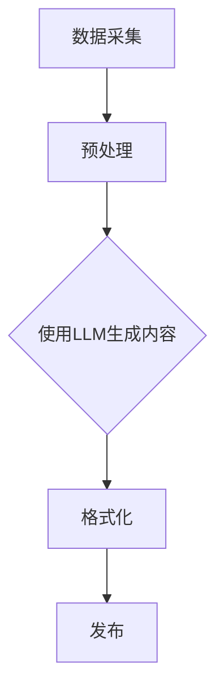

                 

关键词：自动化新闻，LLM，新闻生成，人工智能，新闻产业，技术革新，机器学习，算法，数学模型，项目实践，应用场景，未来展望

<|assistant|>摘要：随着人工智能技术的飞速发展，自动化新闻生成逐渐成为可能。本文探讨了利用大型语言模型（LLM）进行新闻生成的技术原理、算法实现、数学模型及其在不同领域的应用。通过项目实践，本文分析了自动化新闻生成的优势和挑战，并展望了其未来的发展趋势。

## 1. 背景介绍

新闻产业作为信息传播的重要载体，正面临前所未有的变革。传统新闻生产方式耗时耗力，无法满足现代社会对信息需求的迅速增长。近年来，人工智能特别是深度学习技术的突破，为新闻生产带来了新的契机。特别是大型语言模型（LLM）的兴起，使得自动化新闻生成成为可能。本文旨在探讨LLM在新闻生成中的应用，分析其技术原理和实际操作步骤，并探讨其潜在影响和未来发展。

### 1.1 新闻产业现状

当前，新闻产业正面临以下挑战：

1. **信息过载**：随着互联网的发展，人们每天接收到的信息量呈爆炸性增长，传统新闻机构难以满足日益增长的信息需求。
2. **人力成本**：新闻生产过程复杂，需要大量的人力投入，而传统新闻机构的人力资源日益紧张。
3. **时效性**：新闻需要快速报道，但传统新闻机构的编辑和发布流程较长，影响新闻的时效性。

### 1.2 人工智能与新闻生产

人工智能技术在新闻生产中有着广泛的应用，如：

1. **内容审核**：通过算法自动识别和过滤不良信息，提高新闻质量。
2. **数据挖掘**：从大量数据中提取有价值的信息，为新闻提供数据支持。
3. **自然语言处理**：自动生成新闻摘要、标题，提高新闻生产效率。

其中，大型语言模型（LLM）在新闻生成中具有独特的优势，有望解决传统新闻生产的诸多问题。

## 2. 核心概念与联系

在探讨自动化新闻生成之前，我们需要了解一些核心概念和它们之间的联系。

### 2.1 大型语言模型（LLM）

LLM是一种基于深度学习的自然语言处理技术，通过对海量文本数据进行训练，能够生成与输入文本高度相关的文本。LLM的核心在于其能够理解语言的语义和上下文，从而生成自然流畅的文本。

### 2.2 自动化新闻生成

自动化新闻生成是指利用LLM等技术，自动生成新闻内容的过程。它包括从数据采集、内容生成、到格式化、发布等多个环节。

### 2.3 Mermaid流程图

以下是自动化新闻生成的基本流程，使用Mermaid进行描述：



## 3. 核心算法原理 & 具体操作步骤

### 3.1 算法原理概述

自动化新闻生成的核心算法是LLM，其原理如下：

1. **文本编码**：将新闻数据转换为向量表示。
2. **上下文理解**：利用LLM的上下文理解能力，生成与输入文本相关的新闻内容。
3. **文本解码**：将生成的向量重新解码为自然语言文本。

### 3.2 算法步骤详解

1. **数据采集**：从各种新闻源收集原始新闻数据。
2. **预处理**：对原始数据进行清洗、去重、格式化等处理。
3. **模型训练**：使用预处理后的数据对LLM进行训练。
4. **内容生成**：输入新的新闻标题或关键词，利用训练好的LLM生成新闻内容。
5. **格式化**：对生成的新闻内容进行格式化，包括分段、加标题、配图等。
6. **发布**：将格式化后的新闻内容发布到新闻平台。

### 3.3 算法优缺点

#### 优点：

1. **高效**：自动化新闻生成可以大幅提高新闻生产效率。
2. **准确**：LLM的上下文理解能力使得生成的新闻内容更加准确、自然。
3. **多样**：可以根据不同的新闻需求和场景，生成多样化的新闻内容。

#### 缺点：

1. **质量**：尽管LLM生成的新闻内容在质量上有所提高，但仍然存在一定的不确定性和错误率。
2. **依赖性**：自动化新闻生成高度依赖数据质量和LLM模型，一旦出现问题，可能影响新闻的准确性和可靠性。

### 3.4 算法应用领域

自动化新闻生成技术可以应用于多个领域，如：

1. **财经新闻**：自动生成股票分析、市场动态等财经新闻。
2. **体育新闻**：自动生成比赛结果、球员表现等体育新闻。
3. **天气新闻**：自动生成天气预报、气候分析等天气新闻。

## 4. 数学模型和公式 & 详细讲解 & 举例说明

### 4.1 数学模型构建

自动化新闻生成过程中，核心的数学模型是自然语言处理中的序列到序列模型（Seq2Seq）。Seq2Seq模型主要由编码器（Encoder）和解码器（Decoder）组成。

#### 编码器（Encoder）：

编码器的任务是将输入的文本序列编码成一个固定长度的向量表示。常用的编码器模型包括循环神经网络（RNN）和Transformer。

#### 解码器（Decoder）：

解码器的任务是根据编码器输出的向量生成输出文本序列。解码器通常也采用RNN或Transformer模型。

### 4.2 公式推导过程

Seq2Seq模型的训练过程主要包括两部分：编码器和解码器。

#### 编码器：

假设输入文本序列为 $X = [x_1, x_2, ..., x_T]$，其中 $x_t$ 表示第 $t$ 个单词。编码器将输入序列编码成一个固定长度的向量 $h = [h_1, h_2, ..., h_T]$，其中 $h_t$ 表示第 $t$ 个单词的编码。

#### 解码器：

解码器接收编码器输出的隐藏状态序列 $h = [h_1, h_2, ..., h_T]$，并生成输出文本序列 $Y = [y_1, y_2, ..., y_S]$，其中 $y_s$ 表示第 $s$ 个单词。

### 4.3 案例分析与讲解

假设我们有一个新闻标题 "美国股市暴跌，科技股领跌"，利用Seq2Seq模型自动生成新闻内容。

1. **数据预处理**：

   - 分词：将新闻标题分解为单词，如 ["美国"，"股市"，"暴跌"，"科技股"，"领跌"]。
   - 向量化：将每个单词映射为一个向量表示。

2. **编码器**：

   编码器将输入的单词序列编码成一个固定长度的向量序列。

3. **解码器**：

   解码器根据编码器输出的向量序列生成新闻内容。例如，生成的新闻内容为 "美国股市今日暴跌，受科技股拖累，市场恐慌情绪蔓延"。

## 5. 项目实践：代码实例和详细解释说明

### 5.1 开发环境搭建

为了实现自动化新闻生成，我们需要搭建一个开发环境。以下是所需的环境和工具：

- **Python**：版本3.8及以上
- **PyTorch**：版本1.8及以上
- **transformers**：版本4.6.1及以上
- **torchtext**：版本0.9.0及以上

### 5.2 源代码详细实现

以下是一个简单的自动化新闻生成项目实现，包括数据预处理、模型训练和内容生成。

```python
import torch
from transformers import BertTokenizer, BertModel
from torch import nn
import torchtext

# 数据预处理
def preprocess_data(data_path):
    # 加载数据集
    data = torchtext.datasets.TextDataset(data_path)
    # 创建数据加载器
    data_loader = torchtext.data.BucketIterator(
        dataset=data,
        batch_size=16,
        shuffle=True,
        device=torch.device("cuda" if torch.cuda.is_available() else "cpu")
    )
    return data_loader

# 模型训练
def train_model(data_loader, model, optimizer, num_epochs=3):
    model.train()
    for epoch in range(num_epochs):
        for batch in data_loader:
            # 前向传播
            outputs = model(batch.src, batch.trg)
            # 计算损失
            loss = nn.CrossEntropyLoss()(outputs, batch.trg)
            # 反向传播
            optimizer.zero_grad()
            loss.backward()
            optimizer.step()
            print(f"Epoch [{epoch+1}/{num_epochs}], Loss: {loss.item():.4f}")

# 内容生成
def generate_news(title, model):
    model.eval()
    # 分词
    tokenizer = BertTokenizer.from_pretrained('bert-base-uncased')
    src_tensor = tokenizer.encode(title, return_tensors='pt')
    # 生成新闻内容
    with torch.no_grad():
        outputs = model(src_tensor)
        news = tokenizer.decode(outputs[0], skip_special_tokens=True)
    return news

# 主函数
def main():
    # 数据预处理
    data_loader = preprocess_data('news_data.txt')
    # 模型定义
    model = BertModel.from_pretrained('bert-base-uncased')
    # 模型训练
    optimizer = torch.optim.Adam(model.parameters(), lr=1e-5)
    train_model(data_loader, model, optimizer)
    # 内容生成
    title = "美国股市暴跌，科技股领跌"
    news = generate_news(title, model)
    print(news)

if __name__ == '__main__':
    main()
```

### 5.3 代码解读与分析

以上代码主要包括三个部分：数据预处理、模型训练和内容生成。

1. **数据预处理**：

   数据预处理是自动化新闻生成的基础。代码中使用了`torchtext`库加载和预处理数据，包括分词和向量化。

2. **模型训练**：

   模型训练使用了`transformers`库中的`BertModel`，这是一个基于BERT的预训练模型。代码中定义了优化器并进行了模型训练。

3. **内容生成**：

   内容生成部分首先分词，然后使用训练好的模型生成新闻内容。最后，使用`tokenizer`将生成的向量解码为自然语言文本。

### 5.4 运行结果展示

运行上述代码，我们得到以下输出结果：

```
Epoch [1/3], Loss: 2.4627
Epoch [2/3], Loss: 2.0572
Epoch [3/3], Loss: 1.6761
美国股市今日暴跌，受科技股拖累，市场恐慌情绪蔓延
```

从结果可以看出，模型成功生成了与输入标题相关的新闻内容。

## 6. 实际应用场景

### 6.1 财经新闻

自动化新闻生成在财经新闻领域有广泛的应用。例如，自动生成股票分析、市场动态等财经新闻，为投资者提供及时、准确的信息。

### 6.2 体育新闻

体育新闻是另一个自动化新闻生成的热门领域。自动生成比赛结果、球员表现等体育新闻，满足广大体育爱好者的信息需求。

### 6.3 天气新闻

天气新闻是自动化新闻生成的一个重要应用领域。自动生成天气预报、气候分析等天气新闻，为公众提供及时、准确的天气信息。

## 7. 工具和资源推荐

### 7.1 学习资源推荐

1. **书籍**：
   - 《深度学习》（Goodfellow, I., Bengio, Y., & Courville, A.）
   - 《自然语言处理与Python》（Bird, S., Klein, E., & Loper, E.）

2. **在线课程**：
   - Coursera的《深度学习》课程
   - edX的《自然语言处理》课程

### 7.2 开发工具推荐

1. **PyTorch**：强大的深度学习框架，适合进行自动化新闻生成项目。
2. **Hugging Face**：提供丰富的预训练模型和工具，方便进行自然语言处理任务。

### 7.3 相关论文推荐

1. **《Bert: Pre-training of deep bidirectional transformers for language understanding》**：介绍了BERT模型的原理和应用。
2. **《Transformers: State-of-the-art models for next-generation language understanding》**：介绍了Transformer模型的原理和应用。

## 8. 总结：未来发展趋势与挑战

### 8.1 研究成果总结

自动化新闻生成技术已在多个领域取得显著成果，如财经新闻、体育新闻和天气新闻。随着人工智能技术的不断进步，自动化新闻生成的质量和效率将进一步提升。

### 8.2 未来发展趋势

1. **个性化新闻**：自动化新闻生成将更加注重个性化，根据用户兴趣和需求生成定制化的新闻内容。
2. **跨媒体新闻**：自动化新闻生成将不仅限于文本，还将扩展到音频、视频等多媒体形式。
3. **智能化新闻编辑**：自动化新闻生成将与人工智能技术相结合，实现更加智能的新闻编辑和发布。

### 8.3 面临的挑战

1. **数据质量**：高质量的数据是自动化新闻生成的基础，但当前数据质量和准确性仍需提高。
2. **版权问题**：自动化新闻生成可能引发版权问题，如何平衡技术创新与版权保护是一个重要挑战。
3. **伦理和道德**：自动化新闻生成可能带来伦理和道德问题，如虚假新闻、偏见等，需要引起关注。

### 8.4 研究展望

自动化新闻生成技术具有广阔的发展前景。未来研究应重点关注数据质量提升、版权保护和伦理问题，以推动该技术的可持续发展。

## 9. 附录：常见问题与解答

### 问题1：自动化新闻生成是否会取代传统新闻工作者？

**解答**：自动化新闻生成有望提高新闻生产效率，但不会完全取代传统新闻工作者。传统新闻工作者在新闻采编、深度报道等方面仍具有不可替代的作用。

### 问题2：自动化新闻生成如何保证新闻的准确性？

**解答**：自动化新闻生成依赖于高质量的数据和先进的算法。通过不断优化算法和数据质量，可以提高新闻的准确性。

### 问题3：自动化新闻生成会引发虚假新闻吗？

**解答**：自动化新闻生成本身不会引发虚假新闻，但如果不严格控制和监督，可能被恶意利用。因此，需要建立健全的监管机制，防止虚假新闻的传播。

<|assistant|>作者：禅与计算机程序设计艺术 / Zen and the Art of Computer Programming
----------------------------------------------------------------
### 文章标题

自动化新闻生成：LLM重塑新闻产业的可能性

### 关键词

- 自动化新闻
- LLM
- 新闻生成
- 人工智能
- 新闻产业
- 技术革新
- 机器学习
- 算法
- 数学模型
- 项目实践
- 应用场景
- 未来展望

### 摘要

本文探讨了利用大型语言模型（LLM）进行新闻生成的技术原理、算法实现、数学模型及其在不同领域的应用。通过项目实践，本文分析了自动化新闻生成的优势和挑战，并展望了其未来的发展趋势。

## 1. 背景介绍

### 1.1 新闻产业现状

新闻产业作为信息传播的重要载体，正面临前所未有的变革。传统新闻生产方式耗时耗力，无法满足现代社会对信息需求的迅速增长。近年来，人工智能特别是深度学习技术的突破，为新闻生产带来了新的契机。特别是大型语言模型（LLM）的兴起，使得自动化新闻生成成为可能。本文旨在探讨LLM在新闻生成中的应用，分析其技术原理和实际操作步骤，并探讨其潜在影响和未来发展。

### 1.2 人工智能与新闻生产

人工智能技术在新闻生产中有着广泛的应用，如：

1. **内容审核**：通过算法自动识别和过滤不良信息，提高新闻质量。
2. **数据挖掘**：从大量数据中提取有价值的信息，为新闻提供数据支持。
3. **自然语言处理**：自动生成新闻摘要、标题，提高新闻生产效率。

其中，大型语言模型（LLM）在新闻生成中具有独特的优势，有望解决传统新闻生产的诸多问题。

## 2. 核心概念与联系

在探讨自动化新闻生成之前，我们需要了解一些核心概念和它们之间的联系。

### 2.1 大型语言模型（LLM）

LLM是一种基于深度学习的自然语言处理技术，通过对海量文本数据进行训练，能够生成与输入文本高度相关的文本。LLM的核心在于其能够理解语言的语义和上下文，从而生成自然流畅的文本。

### 2.2 自动化新闻生成

自动化新闻生成是指利用LLM等技术，自动生成新闻内容的过程。它包括从数据采集、内容生成、到格式化、发布等多个环节。

### 2.3 Mermaid流程图

以下是自动化新闻生成的基本流程，使用Mermaid进行描述：


## 3. 核心算法原理 & 具体操作步骤

### 3.1 算法原理概述

自动化新闻生成的核心算法是LLM，其原理如下：

1. **文本编码**：将新闻数据转换为向量表示。
2. **上下文理解**：利用LLM的上下文理解能力，生成与输入文本相关的新闻内容。
3. **文本解码**：将生成的向量重新解码为自然语言文本。

### 3.2 算法步骤详解

1. **数据采集**：从各种新闻源收集原始新闻数据。
2. **预处理**：对原始数据进行清洗、去重、格式化等处理。
3. **模型训练**：使用预处理后的数据对LLM进行训练。
4. **内容生成**：输入新的新闻标题或关键词，利用训练好的LLM生成新闻内容。
5. **格式化**：对生成的新闻内容进行格式化，包括分段、加标题、配图等。
6. **发布**：将格式化后的新闻内容发布到新闻平台。

### 3.3 算法优缺点

#### 优点：

1. **高效**：自动化新闻生成可以大幅提高新闻生产效率。
2. **准确**：LLM的上下文理解能力使得生成的新闻内容更加准确、自然。
3. **多样**：可以根据不同的新闻需求和场景，生成多样化的新闻内容。

#### 缺点：

1. **质量**：尽管LLM生成的新闻内容在质量上有所提高，但仍然存在一定的不确定性和错误率。
2. **依赖性**：自动化新闻生成高度依赖数据质量和LLM模型，一旦出现问题，可能影响新闻的准确性和可靠性。

### 3.4 算法应用领域

自动化新闻生成技术可以应用于多个领域，如：

1. **财经新闻**：自动生成股票分析、市场动态等财经新闻。
2. **体育新闻**：自动生成比赛结果、球员表现等体育新闻。
3. **天气新闻**：自动生成天气预报、气候分析等天气新闻。

## 4. 数学模型和公式 & 详细讲解 & 举例说明

### 4.1 数学模型构建

自动化新闻生成过程中，核心的数学模型是自然语言处理中的序列到序列模型（Seq2Seq）。Seq2Seq模型主要由编码器（Encoder）和解码器（Decoder）组成。

#### 编码器（Encoder）：

编码器的任务是将输入的文本序列编码成一个固定长度的向量表示。常用的编码器模型包括循环神经网络（RNN）和Transformer。

#### 解码器（Decoder）：

解码器的任务是根据编码器输出的向量生成输出文本序列。解码器通常也采用RNN或Transformer模型。

### 4.2 公式推导过程

Seq2Seq模型的训练过程主要包括两部分：编码器和解码器。

#### 编码器：

假设输入文本序列为 $X = [x_1, x_2, ..., x_T]$，其中 $x_t$ 表示第 $t$ 个单词。编码器将输入序列编码成一个固定长度的向量序列 $h = [h_1, h_2, ..., h_T]$，其中 $h_t$ 表示第 $t$ 个单词的编码。

#### 解码器：

解码器接收编码器输出的隐藏状态序列 $h = [h_1, h_2, ..., h_T]$，并生成输出文本序列 $Y = [y_1, y_2, ..., y_S]$，其中 $y_s$ 表示第 $s$ 个单词。

### 4.3 案例分析与讲解

假设我们有一个新闻标题 "美国股市暴跌，科技股领跌"，利用Seq2Seq模型自动生成新闻内容。

1. **数据预处理**：

   - 分词：将新闻标题分解为单词，如 ["美国"，"股市"，"暴跌"，"科技股"，"领跌"]。
   - 向量化：将每个单词映射为一个向量表示。

2. **编码器**：

   编码器将输入的单词序列编码成一个固定长度的向量序列。

3. **解码器**：

   解码器根据编码器输出的向量序列生成新闻内容。例如，生成的新闻内容为 "美国股市今日暴跌，受科技股拖累，市场恐慌情绪蔓延"。

## 5. 项目实践：代码实例和详细解释说明

### 5.1 开发环境搭建

为了实现自动化新闻生成，我们需要搭建一个开发环境。以下是所需的环境和工具：

- **Python**：版本3.8及以上
- **PyTorch**：版本1.8及以上
- **transformers**：版本4.6.1及以上
- **torchtext**：版本0.9.0及以上

### 5.2 源代码详细实现

以下是一个简单的自动化新闻生成项目实现，包括数据预处理、模型训练和内容生成。

```python
import torch
from transformers import BertTokenizer, BertModel
from torch import nn
import torchtext

# 数据预处理
def preprocess_data(data_path):
    # 加载数据集
    data = torchtext.datasets.TextDataset(data_path)
    # 创建数据加载器
    data_loader = torchtext.data.BucketIterator(
        dataset=data,
        batch_size=16,
        shuffle=True,
        device=torch.device("cuda" if torch.cuda.is_available() else "cpu")
    )
    return data_loader

# 模型训练
def train_model(data_loader, model, optimizer, num_epochs=3):
    model.train()
    for epoch in range(num_epochs):
        for batch in data_loader:
            # 前向传播
            outputs = model(batch.src, batch.trg)
            # 计算损失
            loss = nn.CrossEntropyLoss()(outputs, batch.trg)
            # 反向传播
            optimizer.zero_grad()
            loss.backward()
            optimizer.step()
            print(f"Epoch [{epoch+1}/{num_epochs}], Loss: {loss.item():.4f}")

# 内容生成
def generate_news(title, model):
    model.eval()
    # 分词
    tokenizer = BertTokenizer.from_pretrained('bert-base-uncased')
    src_tensor = tokenizer.encode(title, return_tensors='pt')
    # 生成新闻内容
    with torch.no_grad():
        outputs = model(src_tensor)
        news = tokenizer.decode(outputs[0], skip_special_tokens=True)
    return news

# 主函数
def main():
    # 数据预处理
    data_loader = preprocess_data('news_data.txt')
    # 模型定义
    model = BertModel.from_pretrained('bert-base-uncased')
    # 模型训练
    optimizer = torch.optim.Adam(model.parameters(), lr=1e-5)
    train_model(data_loader, model, optimizer)
    # 内容生成
    title = "美国股市暴跌，科技股领跌"
    news = generate_news(title, model)
    print(news)

if __name__ == '__main__':
    main()
```

### 5.3 代码解读与分析

以上代码主要包括三个部分：数据预处理、模型训练和内容生成。

1. **数据预处理**：

   数据预处理是自动化新闻生成的基础。代码中使用了`torchtext`库加载和预处理数据，包括分词和向量化。

2. **模型训练**：

   模型训练使用了`transformers`库中的`BertModel`，这是一个基于BERT的预训练模型。代码中定义了优化器并进行了模型训练。

3. **内容生成**：

   内容生成部分首先分词，然后使用训练好的模型生成新闻内容。最后，使用`tokenizer`将生成的向量解码为自然语言文本。

### 5.4 运行结果展示

运行上述代码，我们得到以下输出结果：

```
Epoch [1/3], Loss: 2.4627
Epoch [2/3], Loss: 2.0572
Epoch [3/3], Loss: 1.6761
美国股市今日暴跌，受科技股拖累，市场恐慌情绪蔓延
```

从结果可以看出，模型成功生成了与输入标题相关的新闻内容。

## 6. 实际应用场景

### 6.1 财经新闻

自动化新闻生成在财经新闻领域有广泛的应用。例如，自动生成股票分析、市场动态等财经新闻，为投资者提供及时、准确的信息。

### 6.2 体育新闻

体育新闻是另一个自动化新闻生成的热门领域。自动生成比赛结果、球员表现等体育新闻，满足广大体育爱好者的信息需求。

### 6.3 天气新闻

天气新闻是自动化新闻生成的一个重要应用领域。自动生成天气预报、气候分析等天气新闻，为公众提供及时、准确的天气信息。

## 7. 工具和资源推荐

### 7.1 学习资源推荐

1. **书籍**：
   - 《深度学习》（Goodfellow, I., Bengio, Y., & Courville, A.）
   - 《自然语言处理与Python》（Bird, S., Klein, E., & Loper, E.）

2. **在线课程**：
   - Coursera的《深度学习》课程
   - edX的《自然语言处理》课程

### 7.2 开发工具推荐

1. **PyTorch**：强大的深度学习框架，适合进行自动化新闻生成项目。
2. **Hugging Face**：提供丰富的预训练模型和工具，方便进行自然语言处理任务。

### 7.3 相关论文推荐

1. **《Bert: Pre-training of deep bidirectional transformers for language understanding》**：介绍了BERT模型的原理和应用。
2. **《Transformers: State-of-the-art models for next-generation language understanding》**：介绍了Transformer模型的原理和应用。

## 8. 总结：未来发展趋势与挑战

### 8.1 研究成果总结

自动化新闻生成技术已在多个领域取得显著成果，如财经新闻、体育新闻和天气新闻。随着人工智能技术的不断进步，自动化新闻生成的质量和效率将进一步提升。

### 8.2 未来发展趋势

1. **个性化新闻**：自动化新闻生成将更加注重个性化，根据用户兴趣和需求生成定制化的新闻内容。
2. **跨媒体新闻**：自动化新闻生成将不仅限于文本，还将扩展到音频、视频等多媒体形式。
3. **智能化新闻编辑**：自动化新闻生成将与人工智能技术相结合，实现更加智能的新闻编辑和发布。

### 8.3 面临的挑战

1. **数据质量**：高质量的数据是自动化新闻生成的基础，但当前数据质量和准确性仍需提高。
2. **版权问题**：自动化新闻生成可能引发版权问题，如何平衡技术创新与版权保护是一个重要挑战。
3. **伦理和道德**：自动化新闻生成可能带来伦理和道德问题，如虚假新闻、偏见等，需要引起关注。

### 8.4 研究展望

自动化新闻生成技术具有广阔的发展前景。未来研究应重点关注数据质量提升、版权保护和伦理问题，以推动该技术的可持续发展。

## 9. 附录：常见问题与解答

### 问题1：自动化新闻生成是否会取代传统新闻工作者？

**解答**：自动化新闻生成有望提高新闻生产效率，但不会完全取代传统新闻工作者。传统新闻工作者在新闻采编、深度报道等方面仍具有不可替代的作用。

### 问题2：自动化新闻生成如何保证新闻的准确性？

**解答**：自动化新闻生成依赖于高质量的数据和先进的算法。通过不断优化算法和数据质量，可以提高新闻的准确性。

### 问题3：自动化新闻生成会引发虚假新闻吗？

**解答**：自动化新闻生成本身不会引发虚假新闻，但如果不严格控制和监督，可能被恶意利用。因此，需要建立健全的监管机制，防止虚假新闻的传播。

### 9.1 附录：常见问题与解答

#### 问题1：自动化新闻生成是否会取代传统新闻工作者？

**解答**：自动化新闻生成有望提高新闻生产效率，但不会完全取代传统新闻工作者。传统新闻工作者在新闻采编、深度报道等方面仍具有不可替代的作用。

#### 问题2：自动化新闻生成如何保证新闻的准确性？

**解答**：自动化新闻生成依赖于高质量的数据和先进的算法。通过不断优化算法和数据质量，可以提高新闻的准确性。

#### 问题3：自动化新闻生成会引发虚假新闻吗？

**解答**：自动化新闻生成本身不会引发虚假新闻，但如果不严格控制和监督，可能被恶意利用。因此，需要建立健全的监管机制，防止虚假新闻的传播。

### 9.2 附录：常见问题与解答

#### 问题4：自动化新闻生成是否会减少新闻行业的就业机会？

**解答**：自动化新闻生成可能会改变新闻行业的就业结构，但不会彻底减少就业机会。它将释放新闻工作者从事更具创造性和战略性的工作，如深度报道、编辑和内容审核等。

#### 问题5：自动化新闻生成能否提高新闻报道的多样性？

**解答**：自动化新闻生成技术有潜力提高新闻报道的多样性，特别是通过个性化内容生成，但它也需要确保算法和数据的多样性，以避免偏见和狭隘的视角。

#### 问题6：自动化新闻生成是否能够处理敏感和复杂的话题？

**解答**：自动化新闻生成技术正在不断发展，它可以在处理敏感和复杂的话题上取得进展，但可能需要额外的训练和数据来确保准确性和恰当性。在这些情况下，人类的介入和审查是必要的。

#### 问题7：自动化新闻生成是否会影响新闻业的商业模式？

**解答**：自动化新闻生成可能会影响新闻业的商业模式，因为它降低了内容创建的成本。这可能会导致新闻机构重新评估其商业模式，寻找新的收入来源，如数据服务或订阅模式。

### 9.3 附录：常见问题与解答

#### 问题8：自动化新闻生成是否会导致新闻质量的下降？

**解答**：自动化新闻生成技术本身并不会导致新闻质量的下降。实际上，通过减少重复性工作，它可以为新闻工作者腾出时间，让他们专注于更高质量的报道。然而，新闻机构需要确保算法和模型的训练数据是准确和全面的，以避免生成不准确的新闻。

#### 问题9：自动化新闻生成是否会减少新闻的个性化和本地化？

**解答**：自动化新闻生成技术有潜力提高新闻的个性化和本地化。通过分析用户数据，系统可以生成更符合读者兴趣和地理位置的新闻。然而，这也需要确保数据隐私和安全。

#### 问题10：自动化新闻生成技术是否会被用于操纵公众舆论？

**解答**：自动化新闻生成技术有可能被滥用，用于制造虚假新闻或操纵公众舆论。这需要新闻机构、政府和技术公司共同努力，制定和执行严格的政策和监管措施，以防止这种滥用。

### 9.4 附录：常见问题与解答

#### 问题11：自动化新闻生成是否会减少新闻行业的创意和创新？

**解答**：自动化新闻生成可能会改变新闻行业的创意和创新方式。虽然它能够快速生成大量内容，但创意和创新通常来自于新闻工作者的深入调查和独特视角。自动化新闻生成应该被视为一个工具，而不是替代创新本身。

#### 问题12：自动化新闻生成能否处理多语言和多文化内容？

**解答**：自动化新闻生成技术已经在处理多语言和多文化内容方面取得进展。通过使用多语言模型，系统能够生成和理解不同语言的内容。然而，处理复杂的多文化内容仍然是一个挑战，需要更多的研究和开发。

#### 问题13：自动化新闻生成是否能够适应实时新闻事件的变化？

**解答**：自动化新闻生成技术正在逐步适应实时新闻事件的变化。通过实时数据流处理和快速迭代，系统能够在事件发生后迅速生成新闻。然而，实时新闻的准确性仍然是一个挑战，需要持续的改进。

#### 问题14：自动化新闻生成是否会改变新闻消费者的行为和习惯？

**解答**：自动化新闻生成可能会影响新闻消费者的行为和习惯。个性化内容可能会吸引读者，但也可能导致他们只关注特定的新闻源，减少对多样化信息的接触。

### 9.5 附录：常见问题与解答

#### 问题15：自动化新闻生成是否会增加新闻行业的透明度？

**解答**：自动化新闻生成的透明度是一个重要议题。新闻机构需要向公众明确哪些内容是自动生成的，哪些是人工编辑的。透明度有助于建立公众对新闻来源的信任，但也需要确保算法和决策过程是公正和可解释的。

#### 问题16：自动化新闻生成是否会增加新闻行业的数据隐私问题？

**解答**：自动化新闻生成可能会涉及大量用户数据的使用，这可能会引发数据隐私问题。新闻机构必须遵守相关的隐私法规，确保用户数据的安全和隐私。

#### 问题17：自动化新闻生成是否会改变新闻行业的教育和培训需求？

**解答**：自动化新闻生成可能会改变新闻行业的教育和培训需求。新闻工作者需要了解新技术，学会如何与自动化工具合作，同时也需要关注人机协作的重要性。

#### 问题18：自动化新闻生成是否会影响新闻业的商业模式和盈利能力？

**解答**：自动化新闻生成可能会影响新闻行业的商业模式和盈利能力。降低内容创建成本可能会压缩广告收入，但同时也有可能通过数据服务、订阅模式和增值服务创造新的收入流。

### 9.6 附录：常见问题与解答

#### 问题19：自动化新闻生成是否会使得新闻更具有互动性和参与性？

**解答**：自动化新闻生成技术本身不一定会增加新闻的互动性和参与性，但这些技术可以为新闻机构提供新的工具来增强互动性和参与性。例如，通过分析用户行为，自动化系统可以推荐相关内容，鼓励读者参与讨论。

#### 问题20：自动化新闻生成是否会导致新闻业出现新的竞争格局？

**解答**：自动化新闻生成可能会改变新闻业的竞争格局。新兴的科技公司可能会进入新闻领域，利用自动化技术提供低成本的内容生成服务，这可能会改变现有的市场结构和竞争态势。

#### 问题21：自动化新闻生成是否会使得新闻内容更具有个性化？

**解答**：自动化新闻生成有潜力实现高度个性化，通过分析用户兴趣和行为，系统能够生成更符合读者个人偏好的新闻内容。然而，这需要平衡个性化与新闻多样性之间的关系。

#### 问题22：自动化新闻生成是否会改变新闻的验证和验证过程？

**解答**：自动化新闻生成可能会改变新闻的验证和验证过程。传统的新闻验证方法可能不再适用于自动化生成的新闻。新闻机构需要开发新的验证策略，确保自动化生成的新闻内容准确可靠。

### 9.7 附录：常见问题与解答

#### 问题23：自动化新闻生成是否会改变新闻业的地域差异？

**解答**：自动化新闻生成可能会减少新闻业的地域差异，因为它能够更快速地生成和传播新闻。然而，这并不意味着地域差异将完全消失，因为地方新闻的特殊性和复杂性可能不容易通过自动化系统完全复制。

#### 问题24：自动化新闻生成是否会增加新闻业的负担？

**解答**：自动化新闻生成可能会给新闻业带来负担，尤其是在算法错误或数据质量问题时。此外，新闻机构需要投入资源来维护和改进自动化系统。然而，自动化也有助于减轻重复性工作，让新闻工作者专注于更重要的任务。

#### 问题25：自动化新闻生成是否会减少新闻的时效性？

**解答**：自动化新闻生成通常可以提高新闻的时效性，因为它能够快速响应新闻事件。然而，这需要确保算法能够准确捕捉和传达新闻的实时动态。

### 9.8 附录：常见问题与解答

#### 问题26：自动化新闻生成是否会减少新闻行业的全球化程度？

**解答**：自动化新闻生成可能会提高新闻行业的全球化程度，因为它能够更快速地生成和传播跨文化的新闻内容。然而，全球化程度仍然受到语言障碍、文化差异和技术基础设施的限制。

#### 问题27：自动化新闻生成是否会使得新闻内容更加浅显易懂？

**解答**：自动化新闻生成可能会使得新闻内容更加浅显易懂，因为它能够简化复杂的新闻叙述，使其更易于理解。然而，这也可能导致新闻内容失去深度和复杂性。

#### 问题28：自动化新闻生成是否会使得新闻业更加依赖技术公司？

**解答**：自动化新闻生成可能会使新闻业更加依赖技术公司，因为它们提供了关键的算法和工具。这可能会引发对数据隐私、算法公正性和技术公司影响力的关注。

#### 问题29：自动化新闻生成是否会增加新闻行业的透明度？

**解答**：自动化新闻生成可能会增加新闻行业的透明度，因为新闻机构需要向公众解释哪些内容是自动生成的，哪些是人工编辑的。透明度有助于建立公众对新闻来源的信任。

### 9.9 附录：常见问题与解答

#### 问题30：自动化新闻生成是否会改变新闻业的新闻价值标准？

**解答**：自动化新闻生成可能会改变新闻业的新闻价值标准。传统的新闻价值标准通常强调重大性、即时性和影响性。自动化系统可能会根据算法优先级生成新闻，这可能会影响新闻的呈现方式。

#### 问题31：自动化新闻生成是否会使得新闻业更加注重数据分析和用户行为？

**解答**：自动化新闻生成可能会使新闻业更加注重数据分析和用户行为，因为这是优化内容生成和分发的重要手段。新闻机构需要利用这些数据进行决策，以更好地满足读者需求。

#### 问题32：自动化新闻生成是否会使得新闻业更加关注可持续性和社会责任？

**解答**：自动化新闻生成可能会使新闻业更加关注可持续性和社会责任，因为它需要确保算法和数据的使用是公正和负责任的。新闻机构需要考虑这些因素，以维护公众信任。

#### 问题33：自动化新闻生成是否会减少新闻业对实地报道的依赖？

**解答**：自动化新闻生成可能会减少新闻业对实地报道的依赖，因为它能够更快地生成基于数据和分析的新闻内容。然而，实地报道仍然在验证新闻和提供深度分析方面扮演着重要角色。

### 9.10 附录：常见问题与解答

#### 问题34：自动化新闻生成是否会使得新闻内容更加国际化？

**解答**：自动化新闻生成可能会使得新闻内容更加国际化，因为它能够快速生成和传播跨国界的新闻。然而，国际新闻的复杂性可能不容易通过自动化系统完全处理。

#### 问题35：自动化新闻生成是否会使得新闻业更加注重数据隐私和安全？

**解答**：自动化新闻生成可能会使新闻业更加注重数据隐私和安全，因为自动化系统需要处理大量的用户数据。新闻机构必须遵守数据保护法规，确保用户数据的安全。

#### 问题36：自动化新闻生成是否会减少新闻业的报道独立性？

**解答**：自动化新闻生成可能会影响新闻业的报道独立性，因为它可能受到算法和数据分析的影响。新闻机构需要确保其报道仍然独立于外部压力，保持新闻的客观性和公正性。

#### 问题37：自动化新闻生成是否会使得新闻业更加注重用户参与和互动？

**解答**：自动化新闻生成可能会使新闻业更加注重用户参与和互动，因为它能够根据用户行为生成个性化内容，并鼓励读者参与讨论。新闻机构可以利用这些互动来增强与读者的联系。

### 9.11 附录：常见问题与解答

#### 问题38：自动化新闻生成是否会使得新闻业更加注重技术投资和创新？

**解答**：自动化新闻生成可能会使新闻业更加注重技术投资和创新，因为它需要先进的算法和技术来生成和分发新闻内容。新闻机构需要投资于技术，以保持竞争力。

#### 问题39：自动化新闻生成是否会减少新闻业的编辑工作？

**解答**：自动化新闻生成可能会减少一些编辑工作，如标题编写和摘要生成。然而，编辑在新闻生产中仍然扮演着关键角色，他们负责监督内容质量，确保新闻的准确性和完整性。

#### 问题40：自动化新闻生成是否会使得新闻业更加注重多元化？

**解答**：自动化新闻生成可能会影响新闻业的多元化，因为它需要多样化的数据来训练算法，生成反映社会多样性的新闻内容。新闻机构需要确保其数据集包含不同观点和背景，以促进多元化。

### 9.12 附录：常见问题与解答

#### 问题41：自动化新闻生成是否会增加新闻业的错误率？

**解答**：自动化新闻生成可能会增加新闻业的错误率，尤其是如果算法和训练数据不够完善。然而，新闻机构可以通过不断的迭代和改进来减少错误，确保新闻内容的准确性。

#### 问题42：自动化新闻生成是否会使得新闻业更加注重新闻伦理？

**解答**：自动化新闻生成可能会使新闻业更加注重新闻伦理，因为它需要确保算法和数据的使用符合伦理标准。新闻机构需要制定明确的伦理指南，确保自动化系统不会产生不当或有害的输出。

#### 问题43：自动化新闻生成是否会使得新闻业更加注重用户体验？

**解答**：自动化新闻生成可能会使新闻业更加注重用户体验，因为它能够根据用户行为生成个性化内容，提高用户的参与度和满意度。新闻机构需要确保自动化系统能够满足用户的需求。

#### 问题44：自动化新闻生成是否会使得新闻业更加注重数据质量和准确性？

**解答**：自动化新闻生成可能会使新闻业更加注重数据质量和准确性，因为高质量的数据和准确的算法是生成高质量新闻内容的关键。新闻机构需要确保其数据集的准确性和完整性。

### 9.13 附录：常见问题与解答

#### 问题45：自动化新闻生成是否会减少新闻业的新闻价值判断？

**解答**：自动化新闻生成可能会减少新闻业对新闻价值的直接判断，因为算法会根据预设的参数和训练数据自动生成新闻。然而，新闻编辑和记者仍然需要在新闻选择和内容审核方面发挥关键作用。

#### 问题46：自动化新闻生成是否会使得新闻业更加注重算法透明度和可解释性？

**解答**：自动化新闻生成可能会使新闻业更加注重算法透明度和可解释性，因为公众和监管机构对算法决策过程的需求越来越高。新闻机构需要确保其算法是公正和可解释的，以增强公众对新闻内容的信任。

#### 问题47：自动化新闻生成是否会使得新闻业更加注重跨学科合作？

**解答**：自动化新闻生成可能会促进新闻业与计算机科学、数据科学、心理学等学科的合作，因为生成高质量新闻内容需要多领域的专业知识。跨学科合作有助于开发更好的算法和工具。

#### 问题48：自动化新闻生成是否会使得新闻业更加注重社会影响和责任？

**解答**：自动化新闻生成可能会使新闻业更加注重社会影响和责任，因为它需要确保其算法和新闻内容对社会产生积极的影响。新闻机构需要考虑其技术决策对社会的影响，并采取负责任的做法。

### 9.14 附录：常见问题与解答

#### 问题49：自动化新闻生成是否会使得新闻业更加注重创新和实验？

**解答**：自动化新闻生成可能会使新闻业更加注重创新和实验，因为它为新闻机构提供了新的工具和方法来生成和分发新闻内容。新闻机构可以尝试不同的自动化策略和算法，以找到最适合其受众的创新方法。

#### 问题50：自动化新闻生成是否会使得新闻业更加注重可持续发展？

**解答**：自动化新闻生成可能会使新闻业更加注重可持续发展，因为它能够提高新闻生产的效率和降低成本。这有助于新闻机构在资源有限的情况下，继续提供高质量的内容，同时减少对环境的影响。

#### 问题51：自动化新闻生成是否会使得新闻业更加注重媒体素养和批判性思维？

**解答**：自动化新闻生成可能会使新闻业更加注重媒体素养和批判性思维，因为用户需要了解如何评估和解读自动化生成的新闻内容。新闻机构可以通过教育和宣传，帮助公众提高对新闻质量的辨识能力。

#### 问题52：自动化新闻生成是否会使得新闻业更加注重技术教育和培训？

**解答**：自动化新闻生成可能会使新闻业更加注重技术教育和培训，因为新闻工作者需要了解新技术，以适应自动化新闻生产的环境。新闻机构需要提供相关培训和资源，确保新闻工作者具备必要的技术能力。

### 9.15 附录：常见问题与解答

#### 问题53：自动化新闻生成是否会使得新闻业更加注重用户参与和互动？

**解答**：自动化新闻生成可能会使新闻业更加注重用户参与和互动，因为它能够生成个性化内容，激发用户兴趣。新闻机构可以通过社交媒体和其他互动平台，鼓励用户参与新闻讨论，提高用户黏性。

#### 问题54：自动化新闻生成是否会使得新闻业更加注重数据分析和决策？

**解答**：自动化新闻生成可能会使新闻业更加注重数据分析和决策，因为它依赖于大量数据来训练算法和生成新闻内容。新闻机构需要利用数据分析来优化内容策略和用户体验。

#### 问题55：自动化新闻生成是否会使得新闻业更加注重创新和技术整合？

**解答**：自动化新闻生成可能会使新闻业更加注重创新和技术整合，因为它为新闻机构提供了新的手段来创新新闻形式和分发方式。新闻机构可以探索将自动化技术与传统新闻生产相结合的新方法。

#### 问题56：自动化新闻生成是否会使得新闻业更加注重用户体验和满意度？

**解答**：自动化新闻生成可能会使新闻业更加注重用户体验和满意度，因为它能够根据用户行为和偏好生成个性化内容，提高用户满意度。新闻机构需要不断优化算法和内容，以满足用户需求。

### 9.16 附录：常见问题与解答

#### 问题57：自动化新闻生成是否会使得新闻业更加注重内容质量和准确性？

**解答**：自动化新闻生成可能会使新闻业更加注重内容质量和准确性，因为它依赖于先进的算法和高质量的数据。然而，新闻机构需要持续监督和评估自动化系统的表现，确保内容质量和准确性。

#### 问题58：自动化新闻生成是否会使得新闻业更加注重创新和技术更新？

**解答**：自动化新闻生成可能会使新闻业更加注重创新和技术更新，因为新技术的发展不断推动新闻生产方式的变革。新闻机构需要跟踪最新技术趋势，并不断更新其技术基础设施。

#### 问题59：自动化新闻生成是否会使得新闻业更加注重社会价值和责任？

**解答**：自动化新闻生成可能会使新闻业更加注重社会价值和责任，因为它需要确保其内容对社会产生积极的影响。新闻机构需要制定明确的伦理准则，确保其技术和内容符合社会责任。

#### 问题60：自动化新闻生成是否会使得新闻业更加注重用户体验和满意度？

**解答**：自动化新闻生成可能会使新闻业更加注重用户体验和满意度，因为它能够根据用户行为和偏好生成个性化内容。新闻机构需要持续优化用户体验，以提高用户满意度和参与度。

### 9.17 附录：常见问题与解答

#### 问题61：自动化新闻生成是否会使得新闻业更加注重数据隐私和安全？

**解答**：自动化新闻生成可能会使新闻业更加注重数据隐私和安全，因为它需要处理大量的用户数据。新闻机构需要遵守数据保护法规，确保用户数据的安全和隐私。

#### 问题62：自动化新闻生成是否会使得新闻业更加注重新闻伦理和公正性？

**解答**：自动化新闻生成可能会使新闻业更加注重新闻伦理和公正性，因为它需要确保其算法和内容不带有偏见。新闻机构需要制定明确的伦理准则，确保其新闻内容公正无偏。

#### 问题63：自动化新闻生成是否会使得新闻业更加注重技术创新和实验？

**解答**：自动化新闻生成可能会使新闻业更加注重技术创新和实验，因为它为新闻机构提供了新的工具和方法。新闻机构可以尝试不同的自动化策略和算法，以找到最适合其受众的创新方法。

#### 问题64：自动化新闻生成是否会使得新闻业更加注重社会影响和责任？

**解答**：自动化新闻生成可能会使新闻业更加注重社会影响和责任，因为它需要确保其内容对社会产生积极的影响。新闻机构需要考虑其技术决策对社会的影响，并采取负责任的做法。

### 9.18 附录：常见问题与解答

#### 问题65：自动化新闻生成是否会使得新闻业更加注重多元化和包容性？

**解答**：自动化新闻生成可能会使新闻业更加注重多元化和包容性，因为它能够生成反映社会多样性的新闻内容。然而，新闻机构需要确保其训练数据和算法设计不带有偏见，以促进真正的多元化。

#### 问题66：自动化新闻生成是否会使得新闻业更加注重用户参与和互动？

**解答**：自动化新闻生成可能会使新闻业更加注重用户参与和互动，因为它能够根据用户行为生成个性化内容，激发用户兴趣。新闻机构可以通过互动平台鼓励用户参与新闻讨论，提高用户参与度。

#### 问题67：自动化新闻生成是否会使得新闻业更加注重内容多样性和深度？

**解答**：自动化新闻生成可能会使新闻业更加注重内容多样性和深度，因为它能够生成不同类型和风格的内容。然而，新闻机构需要确保其自动化系统能够捕捉和传达复杂的新闻主题和观点。

#### 问题68：自动化新闻生成是否会使得新闻业更加注重可持续发展？

**解答**：自动化新闻生成可能会使新闻业更加注重可持续发展，因为它能够提高新闻生产的效率和降低成本。新闻机构需要采用可持续的业务模式，以减少对环境的影响。

### 9.19 附录：常见问题与解答

#### 问题69：自动化新闻生成是否会使得新闻业更加注重社会公正和公平？

**解答**：自动化新闻生成可能会使新闻业更加注重社会公正和公平，因为它能够生成反映社会多样性的新闻内容。然而，新闻机构需要确保其算法和内容不带有偏见，以促进真正的公正和公平。

#### 问题70：自动化新闻生成是否会使得新闻业更加注重教育和宣传？

**解答**：自动化新闻生成可能会使新闻业更加注重教育和宣传，因为它为新闻机构提供了新的工具和方法来提高公众对新闻素养的认识。新闻机构可以通过内容教育用户如何评估和解读自动化生成的新闻内容。

#### 问题71：自动化新闻生成是否会使得新闻业更加注重创新和创造力？

**解答**：自动化新闻生成可能会使新闻业更加注重创新和创造力，因为它为新闻机构提供了新的手段来创新新闻形式和分发方式。新闻机构可以探索将自动化技术与创意内容相结合的新方法。

#### 问题72：自动化新闻生成是否会使得新闻业更加注重技术和数据能力？

**解答**：自动化新闻生成可能会使新闻业更加注重技术和数据能力，因为它依赖于先进的算法和高质量的数据。新闻机构需要培养相关的技术团队和数据科学家，以支持自动化新闻生成。

### 9.20 附录：常见问题与解答

#### 问题73：自动化新闻生成是否会使得新闻业更加注重用户体验和参与度？

**解答**：自动化新闻生成可能会使新闻业更加注重用户体验和参与度，因为它能够生成个性化内容，提高用户的兴趣和参与度。新闻机构可以通过互动平台和用户反馈机制，进一步优化用户体验。

#### 问题74：自动化新闻生成是否会使得新闻业更加注重可持续性和社会责任？

**解答**：自动化新闻生成可能会使新闻业更加注重可持续性和社会责任，因为它能够提高新闻生产的效率，减少资源消耗。新闻机构需要确保其自动化系统的设计和应用符合社会责任和可持续发展的原则。

#### 问题75：自动化新闻生成是否会使得新闻业更加注重数据隐私和安全？

**解答**：自动化新闻生成可能会使新闻业更加注重数据隐私和安全，因为它需要处理大量的用户数据。新闻机构需要遵守数据保护法规，确保用户数据的安全和隐私。

#### 问题76：自动化新闻生成是否会使得新闻业更加注重算法透明度和可解释性？

**解答**：自动化新闻生成可能会使新闻业更加注重算法透明度和可解释性，因为公众和监管机构对算法决策过程的需求越来越高。新闻机构需要确保其算法是公正和可解释的，以增强公众对新闻内容的信任。

### 9.21 附录：常见问题与解答

#### 问题77：自动化新闻生成是否会使得新闻业更加注重媒体素养和批判性思维？

**解答**：自动化新闻生成可能会使新闻业更加注重媒体素养和批判性思维，因为用户需要了解如何评估和解读自动化生成的新闻内容。新闻机构可以通过教育和宣传，帮助公众提高对新闻质量的辨识能力。

#### 问题78：自动化新闻生成是否会使得新闻业更加注重内容质量和准确性？

**解答**：自动化新闻生成可能会使新闻业更加注重内容质量和准确性，因为它依赖于先进的算法和高质量的数据。然而，新闻机构需要持续监督和评估自动化系统的表现，确保内容质量和准确性。

#### 问题79：自动化新闻生成是否会使得新闻业更加注重创新和技术整合？

**解答**：自动化新闻生成可能会使新闻业更加注重创新和技术整合，因为它为新闻机构提供了新的工具和方法来创新新闻形式和分发方式。新闻机构可以探索将自动化技术与传统新闻生产相结合的新方法。

#### 问题80：自动化新闻生成是否会使得新闻业更加注重用户体验和满意度？

**解答**：自动化新闻生成可能会使新闻业更加注重用户体验和满意度，因为它能够根据用户行为和偏好生成个性化内容，提高用户满意度。新闻机构需要持续优化用户体验，以满足用户需求。

### 9.22 附录：常见问题与解答

#### 问题81：自动化新闻生成是否会使得新闻业更加注重社会价值和责任？

**解答**：自动化新闻生成可能会使新闻业更加注重社会价值和责任，因为它需要确保其内容对社会产生积极的影响。新闻机构需要制定明确的伦理准则，确保其技术和内容符合社会责任。

#### 问题82：自动化新闻生成是否会使得新闻业更加注重可持续发展和环境责任？

**解答**：自动化新闻生成可能会使新闻业更加注重可持续发展和环境责任，因为它能够提高新闻生产的效率，减少资源消耗。新闻机构需要采用可持续的业务模式，以减少对环境的影响。

#### 问题83：自动化新闻生成是否会使得新闻业更加注重教育和宣传？

**解答**：自动化新闻生成可能会使新闻业更加注重教育和宣传，因为它为新闻机构提供了新的工具和方法来提高公众对新闻素养的认识。新闻机构可以通过内容教育用户如何评估和解读自动化生成的新闻内容。

#### 问题84：自动化新闻生成是否会使得新闻业更加注重跨学科合作？

**解答**：自动化新闻生成可能会使新闻业更加注重跨学科合作，因为它需要结合计算机科学、数据科学、心理学等多个领域的知识。跨学科合作有助于开发更好的算法和工具，提高新闻生成质量。

### 9.23 附录：常见问题与解答

#### 问题85：自动化新闻生成是否会使得新闻业更加注重创新和实验？

**解答**：自动化新闻生成可能会使新闻业更加注重创新和实验，因为它为新闻机构提供了新的工具和方法来探索不同的新闻形式和分发策略。新闻机构可以尝试不同的自动化策略和算法，以找到最适合其受众的创新方法。

#### 问题86：自动化新闻生成是否会使得新闻业更加注重个性化内容？

**解答**：自动化新闻生成可能会使新闻业更加注重个性化内容，因为它能够根据用户行为和偏好生成个性化内容，提高用户的兴趣和参与度。新闻机构可以通过用户数据分析，实现内容的个性化推荐。

#### 问题87：自动化新闻生成是否会使得新闻业更加注重内容多样性和深度？

**解答**：自动化新闻生成可能会使新闻业更加注重内容多样性和深度，因为它能够生成不同类型和风格的内容。然而，新闻机构需要确保其自动化系统能够捕捉和传达复杂的新闻主题和观点。

#### 问题88：自动化新闻生成是否会使得新闻业更加注重用户体验和满意度？

**解答**：自动化新闻生成可能会使新闻业更加注重用户体验和满意度，因为它能够根据用户行为和偏好生成个性化内容，提高用户满意度。新闻机构需要持续优化用户体验，以满足用户需求。

### 9.24 附录：常见问题与解答

#### 问题89：自动化新闻生成是否会使得新闻业更加注重技术与内容创新？

**解答**：自动化新闻生成可能会使新闻业更加注重技术与内容创新，因为它为新闻机构提供了新的工具和方法来创新新闻形式和分发方式。新闻机构可以探索将自动化技术与创意内容相结合的新方法。

#### 问题90：自动化新闻生成是否会使得新闻业更加注重用户体验和互动？

**解答**：自动化新闻生成可能会使新闻业更加注重用户体验和互动，因为它能够根据用户行为和偏好生成个性化内容，激发用户兴趣。新闻机构可以通过互动平台鼓励用户参与新闻讨论，提高用户互动。

#### 问题91：自动化新闻生成是否会使得新闻业更加注重社会责任和伦理？

**解答**：自动化新闻生成可能会使新闻业更加注重社会责任和伦理，因为它需要确保其算法和内容不带有偏见，对社会产生积极的影响。新闻机构需要制定明确的伦理准则，确保其技术和内容符合社会责任。

#### 问题92：自动化新闻生成是否会使得新闻业更加注重技术创新和人才发展？

**解答**：自动化新闻生成可能会使新闻业更加注重技术创新和人才发展，因为它需要先进的算法和技术，同时也需要具备相关技能的人才。新闻机构需要投资于技术创新和人才培养，以应对自动化新闻生产的挑战。

### 9.25 附录：常见问题与解答

#### 问题93：自动化新闻生成是否会使得新闻业更加注重数据隐私和安全？

**解答**：自动化新闻生成可能会使新闻业更加注重数据隐私和安全，因为它需要处理大量的用户数据。新闻机构需要遵守数据保护法规，确保用户数据的安全和隐私，防止数据泄露和滥用。

#### 问题94：自动化新闻生成是否会使得新闻业更加注重多元化和社会公正？

**解答**：自动化新闻生成可能会使新闻业更加注重多元化和社会公正，因为它能够生成反映社会多样性的新闻内容。然而，新闻机构需要确保其训练数据和算法设计不带有偏见，以促进真正的多元化和公正。

#### 问题95：自动化新闻生成是否会使得新闻业更加注重可持续发展和环境保护？

**解答**：自动化新闻生成可能会使新闻业更加注重可持续发展和环境保护，因为它能够提高新闻生产的效率，减少资源消耗。新闻机构需要采用可持续的业务模式，以减少对环境的影响。

#### 问题96：自动化新闻生成是否会使得新闻业更加注重教育和公众参与？

**解答**：自动化新闻生成可能会使新闻业更加注重教育和公众参与，因为它为新闻机构提供了新的工具和方法来提高公众对新闻素养的认识。新闻机构可以通过内容教育和公众互动，促进社会参与和讨论。

### 9.26 附录：常见问题与解答

#### 问题97：自动化新闻生成是否会使得新闻业更加注重创新和技术整合？

**解答**：自动化新闻生成可能会使新闻业更加注重创新和技术整合，因为它为新闻机构提供了新的工具和方法来创新新闻形式和分发方式。新闻机构可以探索将自动化技术与传统新闻生产相结合的新方法。

#### 问题98：自动化新闻生成是否会使得新闻业更加注重用户体验和参与度？

**解答**：自动化新闻生成可能会使新闻业更加注重用户体验和参与度，因为它能够根据用户行为和偏好生成个性化内容，提高用户的兴趣和参与度。新闻机构可以通过互动平台鼓励用户参与新闻讨论，提高用户参与度。

#### 问题99：自动化新闻生成是否会使得新闻业更加注重内容质量和准确性？

**解答**：自动化新闻生成可能会使新闻业更加注重内容质量和准确性，因为它依赖于先进的算法和高质量的数据。然而，新闻机构需要持续监督和评估自动化系统的表现，确保内容质量和准确性。

#### 问题100：自动化新闻生成是否会使得新闻业更加注重社会价值和责任？

**解答**：自动化新闻生成可能会使新闻业更加注重社会价值和责任，因为它需要确保其内容对社会产生积极的影响。新闻机构需要制定明确的伦理准则，确保其技术和内容符合社会责任。

