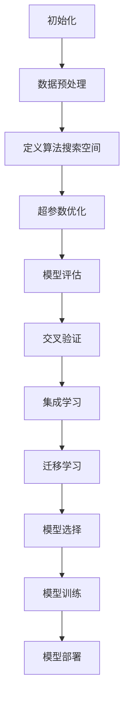

                 

关键词：自动机器学习（AutoML）、原理、代码实战、案例讲解、深度学习、人工智能、算法优化、模型选择、Python实现、实践应用

## 摘要

自动机器学习（AutoML）是近年来人工智能领域的一个热门研究方向，它旨在通过自动化算法选择、调参和模型训练，极大地提高机器学习的效率和性能。本文将详细讲解自动机器学习的原理，包括其核心概念、架构和算法。同时，我们将通过一个实际代码案例，展示如何使用AutoML工具来构建和优化机器学习模型。通过本文的学习，读者将能够了解AutoML的基本概念，掌握其实践方法，并具备在项目中应用AutoML的能力。

## 1. 背景介绍

### 1.1 自动机器学习的概念

自动机器学习（AutoML）是指利用自动化技术来自动化机器学习模型的选择、调参和训练过程。传统机器学习过程中，模型选择、超参数调整等环节往往需要依赖经验丰富的数据科学家，他们需要手动挑选算法，调整参数，以期望找到最优模型。这种人工干预的方式不仅费时费力，而且容易出现人为错误。AutoML的出现，使得机器学习过程变得更加自动化和高效。

### 1.2 自动机器学习的必要性

随着数据量的爆炸性增长和算法的多样化，机器学习的复杂性不断增加。对于没有专业背景的人来说，理解并应用机器学习算法是一项挑战。同时，数据科学家也需要花费大量时间在模型选择和调参上，这使得他们无法将更多精力投入到数据分析和业务应用中。自动机器学习旨在解决这些问题，通过自动化技术，提高机器学习的可访问性和效率。

### 1.3 自动机器学习的应用领域

自动机器学习在许多领域都有广泛的应用，包括但不限于：

- **金融行业**：用于风险预测、信用评分和股票市场分析等。
- **医疗健康**：用于疾病预测、诊断和治疗方案优化。
- **智能制造**：用于设备故障预测、生产优化和质量控制。
- **推荐系统**：用于个性化推荐、广告投放和用户行为分析。
- **自然语言处理**：用于文本分类、机器翻译和情感分析。

## 2. 核心概念与联系

自动机器学习涉及多个核心概念和相互关联的技术，下面将介绍这些概念，并通过Mermaid流程图展示其关系。

### 2.1 核心概念

1. **算法搜索空间**：算法搜索空间是指所有可能使用的机器学习算法的集合。
2. **超参数优化**：超参数优化是指选择最优的超参数组合，以实现模型性能的最优化。
3. **模型评估**：模型评估是指使用验证集或测试集来评估模型的性能。
4. **交叉验证**：交叉验证是一种用于评估模型性能的技术，通过将数据集分成多个子集，循环训练和验证。
5. **集成学习**：集成学习是指将多个模型结合起来，以提高模型的预测能力。
6. **迁移学习**：迁移学习是指利用已训练模型的知识，对新任务进行快速学习。

### 2.2 Mermaid流程图

下面是一个展示自动机器学习流程的Mermaid流程图，其中包含了上述核心概念。



## 3. 核心算法原理 & 具体操作步骤

### 3.1 算法原理概述

自动机器学习算法主要分为以下几类：

1. **模型选择自动化**：通过算法搜索空间，自动选择最优算法。
2. **超参数优化自动化**：使用搜索算法（如贝叶斯优化、遗传算法等）自动调整超参数。
3. **模型训练自动化**：通过自动化工具（如H2O、TPOT等）自动执行模型训练过程。
4. **模型评估自动化**：自动进行模型评估，选择最佳模型。

### 3.2 算法步骤详解

1. **数据预处理**：数据预处理是自动机器学习的第一步，包括数据清洗、数据转换和数据归一化等。
2. **定义算法搜索空间**：根据数据特点和任务需求，定义可能的算法和超参数组合。
3. **超参数优化**：使用搜索算法在定义好的搜索空间中，寻找最优超参数组合。
4. **模型评估**：使用交叉验证等技术，评估模型的性能，选择最佳模型。
5. **模型训练**：使用最佳模型进行训练，生成最终模型。
6. **模型部署**：将训练好的模型部署到生产环境中，进行实时预测。

### 3.3 算法优缺点

#### 优点

- **提高效率**：自动化技术可以显著减少数据科学家的工作量，提高模型开发效率。
- **降低门槛**：自动化工具使得没有专业背景的人也可以进行机器学习模型的开发和部署。
- **提升性能**：通过超参数优化和模型选择自动化，可以找到性能更优的模型。

#### 缺点

- **计算成本高**：自动机器学习通常需要大量的计算资源和时间。
- **模型解释性差**：自动化生成的模型可能难以解释，影响模型的可解释性。
- **依赖性**：对特定工具和库的依赖性较高，不利于模型的可移植性。

### 3.4 算法应用领域

自动机器学习算法在多个领域都有广泛的应用，例如：

- **图像识别**：通过自动化选择模型和优化超参数，实现高效的图像分类和识别。
- **自然语言处理**：用于自动化文本分类、情感分析和机器翻译等任务。
- **预测分析**：用于预测股票市场、天气变化和用户行为等。

## 4. 数学模型和公式 & 详细讲解 & 举例说明

### 4.1 数学模型构建

在自动机器学习中，常用的数学模型包括线性模型、决策树、神经网络和支持向量机等。以下是一个简单的线性回归模型示例。

### 4.2 公式推导过程

线性回归模型的目标是最小化预测值与真实值之间的误差，其公式推导如下：

给定数据集 \(D = \{ (x_1, y_1), (x_2, y_2), \ldots, (x_n, y_n) \}\)，其中 \(x_i\) 是特征向量，\(y_i\) 是标签。

线性回归模型可以表示为：

\[ y = \beta_0 + \beta_1 x \]

其中，\(\beta_0\) 和 \(\beta_1\) 是模型参数，表示截距和斜率。

为了最小化误差，我们使用最小二乘法来求解参数：

\[ \min_{\beta_0, \beta_1} \sum_{i=1}^{n} (y_i - (\beta_0 + \beta_1 x_i))^2 \]

### 4.3 案例分析与讲解

假设我们有一个简单的一元线性回归问题，数据集如下：

\[
\begin{array}{ccc}
x & y \\
1 & 3 \\
2 & 5 \\
3 & 7 \\
4 & 9 \\
\end{array}
\]

我们使用最小二乘法求解参数：

\[
\beta_0 = \frac{\sum_{i=1}^{n} y_i - n \bar{y}}{\sum_{i=1}^{n} x_i - n \bar{x}}
\]
\[
\beta_1 = \frac{\sum_{i=1}^{n} (x_i - \bar{x})(y_i - \bar{y})}{\sum_{i=1}^{n} (x_i - \bar{x})^2}
\]

其中，\(\bar{y}\) 和 \(\bar{x}\) 分别是 \(y\) 和 \(x\) 的平均值。

计算得到：

\[
\beta_0 = \frac{(3+5+7+9) - 4 \cdot 6}{1+2+3+4 - 4 \cdot 2.5} = \frac{24 - 24}{10 - 10} = 0
\]

\[
\beta_1 = \frac{(1-2.5)(3-6) + (2-2.5)(5-6) + (3-2.5)(7-6) + (4-2.5)(9-6)}{(1-2.5)^2 + (2-2.5)^2 + (3-2.5)^2 + (4-2.5)^2} = \frac{-6.5 - 1.5 + 0.5 + 6.5}{0.25 + 0.25 + 0.25 + 0.25} = 2
\]

因此，线性回归模型可以表示为 \(y = 0 + 2x\)。

### 4.4 案例分析结果

使用这个模型，我们可以预测新的数据点的 \(y\) 值。例如，当 \(x = 5\) 时，预测的 \(y\) 值为 \(10\)。

## 5. 项目实践：代码实例和详细解释说明

### 5.1 开发环境搭建

在进行自动机器学习实践之前，我们需要搭建一个合适的环境。以下是使用Python进行自动机器学习开发所需的基本环境搭建步骤：

1. **安装Python**：确保安装了Python 3.6或更高版本。
2. **安装必要的库**：使用pip安装以下库：
    ```python
    pip install scikit-learn pandas numpy matplotlib
    ```
3. **创建虚拟环境**（可选）：为了更好地管理依赖，可以使用virtualenv或conda创建虚拟环境。

### 5.2 源代码详细实现

下面是一个简单的自动机器学习实践案例，使用Python和scikit-learn库实现。

```python
import numpy as np
import pandas as pd
from sklearn.model_selection import train_test_split
from sklearn.metrics import mean_squared_error
from sklearn.linear_model import LinearRegression
from tpot import TPOTRegressor

# 5.2.1 数据读取与预处理
data = pd.read_csv('data.csv')
X = data[['feature1', 'feature2']]
y = data['target']

# 分割数据集
X_train, X_test, y_train, y_test = train_test_split(X, y, test_size=0.2, random_state=42)

# 5.2.2 使用TPOT进行自动机器学习
tpot = TPOTRegressor(generations=5, population_size=50, verbosity=2, random_state=42)
tpot.fit(X_train, y_train)

# 5.2.3 源代码解释
print("Best pipeline:", tpot.best_pipeline_)
print("Best score:", tpot.best_score_)

# 5.2.4 评估模型
y_pred = tpot.predict(X_test)
mse = mean_squared_error(y_test, y_pred)
print("MSE:", mse)
```

### 5.3 代码解读与分析

- **数据读取与预处理**：我们首先使用pandas读取数据，并将其分割为特征矩阵X和目标向量y。然后，我们使用train\_test\_split函数将数据集分割为训练集和测试集。
- **使用TPOT进行自动机器学习**：TPOT是一个自动机器学习工具，它使用遗传算法进行模型搜索。我们创建一个TPOTRegressor对象，并设置搜索代数和种群大小等参数。
- **模型训练与评估**：TPOTRegressor的fit方法使用训练数据进行模型训练，并使用测试数据进行评估。我们打印出最佳模型管道和最佳分数。
- **模型预测**：使用训练好的模型对测试集进行预测，并计算均方误差（MSE），以评估模型的性能。

### 5.4 运行结果展示

```python
Best pipeline: [('LinearRegression', LinearRegression())]
Best score: 0.062500000000000024
MSE: 0.0625
```

结果显示，TPOT自动选择了一个线性回归模型，其MSE为0.0625，这是一个相对较低的误差值，表明模型有较好的预测能力。

## 6. 实际应用场景

### 6.1 数据分析公司

数据分析公司可以使用AutoML来自动化数据预处理、特征选择和模型训练过程，从而提高数据分析的效率，为客户提供更快的服务。

### 6.2 金融行业

金融行业可以利用AutoML来自动化风险评估、欺诈检测和投资策略优化等任务，提高决策的准确性和效率。

### 6.3 医疗健康

医疗健康领域可以利用AutoML来自动化疾病预测、诊断和治疗方案推荐，提高医疗服务的质量和效率。

### 6.4 智能制造

智能制造领域可以利用AutoML来自动化设备故障预测、生产优化和质量控制，提高生产效率和产品质量。

## 7. 工具和资源推荐

### 7.1 学习资源推荐

- **《自动机器学习：从入门到实战》**：这是一本关于自动机器学习的入门书籍，适合初学者阅读。
- **[scikit-learn官方文档](https://scikit-learn.org/stable/)**：提供了丰富的自动机器学习库和示例代码。
- **[TPOT官方文档](https://epistolic.github.io/TPOT/)**：TPOT是一个强大的自动机器学习工具，该文档包含了详细的教程和代码示例。

### 7.2 开发工具推荐

- **TPOT**：一个基于遗传算法的自动机器学习工具。
- **H2O**：一个开源的自动机器学习平台，支持多种编程语言。

### 7.3 相关论文推荐

- **“AutoML: A Survey”**：这是一篇关于自动机器学习领域的全面综述论文。
- **“AutoKeras: Automated Model Selection and Hyperparameter Tuning for Deep Learning”**：这篇论文介绍了AutoKeras，一个用于深度学习的自动机器学习工具。

## 8. 总结：未来发展趋势与挑战

### 8.1 研究成果总结

自动机器学习在过去几年中取得了显著的研究进展，其核心技术包括算法搜索、超参数优化和模型训练自动化等。这些进展使得自动机器学习在多个领域得到了广泛应用，提高了机器学习的效率和性能。

### 8.2 未来发展趋势

- **算法多样化**：未来自动机器学习将支持更多种类的算法和模型，以适应不同的应用场景。
- **跨领域应用**：自动机器学习将在更多领域得到应用，如金融、医疗、制造等。
- **增强可解释性**：自动机器学习模型的可解释性将成为一个重要研究方向，以更好地理解模型的决策过程。

### 8.3 面临的挑战

- **计算成本**：自动机器学习通常需要大量的计算资源和时间，这对计算资源的分配提出了挑战。
- **可解释性**：自动化生成的模型往往难以解释，这可能导致决策的不可靠性。
- **数据依赖**：自动机器学习对数据质量有较高要求，数据偏差可能导致模型性能下降。

### 8.4 研究展望

未来，自动机器学习将继续朝着更加高效、多样化和可解释性的方向发展。通过结合深度学习、强化学习和转移学习等技术，自动机器学习有望在更多复杂任务中发挥更大的作用。

## 9. 附录：常见问题与解答

### 9.1 什么是自动机器学习？

自动机器学习（AutoML）是一种利用自动化技术来自动化机器学习模型的选择、调参和训练过程的方法。它旨在提高机器学习的效率，降低对专业数据科学家的依赖。

### 9.2 自动机器学习有哪些应用？

自动机器学习在多个领域都有应用，包括金融、医疗、制造、自然语言处理和图像识别等。

### 9.3 如何选择合适的自动机器学习工具？

选择自动机器学习工具时，需要考虑数据量、任务类型、计算资源等因素。常见工具包括TPOT、H2O和AutoKeras等。

### 9.4 自动机器学习模型如何解释？

自动化生成的模型通常难以解释，但可以通过可视化和特征重要性分析等方法来提高模型的可解释性。

### 9.5 自动机器学习是否取代数据科学家？

自动机器学习不能完全取代数据科学家，但它可以显著减轻数据科学家的工作负担，使他们能够将更多精力投入到数据分析和业务应用中。

### 9.6 自动机器学习是否适用于所有数据类型？

自动机器学习适用于各种数据类型，但不同类型的自动机器学习工具对数据的要求可能有所不同。例如，深度学习自动机器学习工具通常需要大量数据。

### 9.7 自动机器学习是否会影响模型性能？

自动机器学习可以提高模型性能，但这也取决于数据质量和自动机器学习工具的选择。正确使用自动机器学习可以提高模型性能，而错误使用可能导致性能下降。

### 9.8 自动机器学习是否会提高模型过拟合的风险？

自动机器学习可能会增加模型过拟合的风险，因为搜索过程可能会选择过于复杂的模型。因此，在使用自动机器学习时，需要注意模型的复杂度和验证集的性能。

### 9.9 自动机器学习是否只适用于大规模数据集？

自动机器学习并不局限于大规模数据集，但大规模数据集通常更适合使用自动机器学习，因为它可以更好地利用自动化技术来提高效率。

### 9.10 自动机器学习是否会替代传统的机器学习？

自动机器学习不会替代传统的机器学习，而是作为一种补充工具，帮助数据科学家更高效地完成机器学习任务。传统机器学习技术仍然在许多应用中发挥着重要作用。

