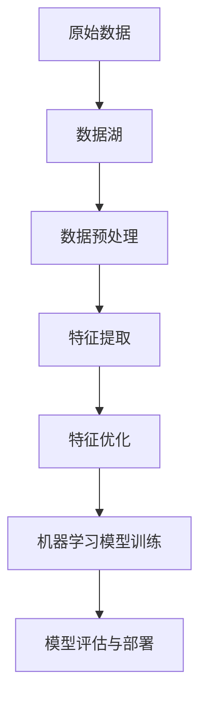

                 

关键词：自动驾驶、数据湖、特征工程、机器学习、数据平台

摘要：本文深入探讨了自动驾驶公司在其业务中构建数据湖与特征工程平台的重要性，以及如何通过这种平台提升自动驾驶系统的性能。我们将分析数据湖的概念及其在自动驾驶领域的应用，详细介绍特征工程的理论和最佳实践，并探讨这一平台如何为自动驾驶的发展提供强有力的支撑。

## 1. 背景介绍

自动驾驶技术是当今科技领域的一个重要研究方向，其潜在的应用场景包括但不限于无人驾驶汽车、智能交通系统、无人配送等。随着传感技术、计算机视觉、深度学习等领域的快速发展，自动驾驶技术的可行性得到了极大提升。然而，自动驾驶系统的发展不仅仅依赖于先进的硬件和算法，还需要强大的数据处理和分析能力，以确保系统能够从海量的数据中提取出有价值的信息。

数据湖作为一种新兴的数据存储架构，提供了巨大的数据存储能力和灵活的数据处理方式，是自动驾驶公司构建数据处理平台的重要基础。数据湖能够存储不同类型、不同来源的数据，为自动驾驶系统的开发和优化提供了丰富的数据资源。与此同时，特征工程作为数据预处理的重要环节，对提升机器学习模型的性能具有关键作用。自动驾驶公司需要通过数据湖与特征工程平台的构建，来处理海量数据，提取有效特征，从而推动自动驾驶技术的进步。

## 2. 核心概念与联系

### 数据湖（Data Lake）

数据湖是一种用于存储大量结构化和非结构化数据的大容量数据存储仓库。与传统数据仓库相比，数据湖不受数据类型的限制，能够存储各种格式的原始数据，如文本、图像、音频、视频等。数据湖的设计理念是“数据尽可能多地存入，之后在需要的时候进行加工处理”。


### 特征工程（Feature Engineering）

特征工程是数据科学和机器学习中的一个关键步骤，涉及从原始数据中提取、构造和选择特征，以提高机器学习模型的性能。特征工程包括数据清洗、特征选择、特征变换等过程。


### 数据湖与特征工程平台的联系

数据湖与特征工程平台紧密结合，共同构成了自动驾驶公司数据处理的核心架构。数据湖提供了海量数据的存储和管理能力，而特征工程平台则负责从这些数据中提取和优化特征，以支持机器学习算法。

### Mermaid 流程图

以下是一个简化的Mermaid流程图，展示了数据湖与特征工程平台的基本架构和流程。



## 3. 核心算法原理 & 具体操作步骤

### 3.1 算法原理概述

自动驾驶系统的核心是机器学习模型，这些模型需要大量的数据来进行训练和优化。数据湖提供了存储和管理这些数据的能力，而特征工程则确保了数据的质量和有效性。以下是自动驾驶公司构建数据湖与特征工程平台的一些核心算法原理：

- 数据采集与存储：利用各种传感器和数据源，采集原始数据，并将其存储到数据湖中。
- 数据预处理：对原始数据进行清洗、归一化和去噪，确保数据的质量。
- 特征提取：从预处理后的数据中提取有用的特征，如视觉特征、运动特征、环境特征等。
- 特征优化：通过特征选择和特征变换，优化特征的表示，以提高机器学习模型的性能。
- 模型训练与评估：使用提取和优化的特征来训练机器学习模型，并通过评估指标来评估模型的性能。

### 3.2 算法步骤详解

#### 3.2.1 数据采集与存储

1. **传感器数据采集**：自动驾驶车辆配备了多种传感器，如摄像头、激光雷达、GPS等，这些传感器实时采集环境数据。
2. **数据源接入**：通过接口将传感器数据传输到数据湖存储系统。
3. **数据存储**：数据湖存储系统支持多种数据格式和协议，如HDFS、AWS S3等，能够高效地存储和管理海量数据。

#### 3.2.2 数据预处理

1. **数据清洗**：处理缺失值、异常值和重复值，确保数据的一致性和准确性。
2. **数据归一化**：将不同量纲的数据转换为相同的量纲，以消除数据之间的量纲差异。
3. **数据去噪**：去除传感器采集过程中产生的噪声，提高数据质量。

#### 3.2.3 特征提取

1. **视觉特征提取**：利用计算机视觉算法，从图像数据中提取特征，如边缘、颜色、纹理等。
2. **运动特征提取**：从传感器数据中提取运动特征，如速度、加速度、方向等。
3. **环境特征提取**：从环境数据中提取特征，如道路标识、交通信号、车辆信息等。

#### 3.2.4 特征优化

1. **特征选择**：使用统计方法或机器学习算法，选择对模型训练最有用的特征。
2. **特征变换**：通过数据变换，如PCA（主成分分析）、LDA（线性判别分析）等，优化特征的表示，提高模型性能。

#### 3.2.5 模型训练与评估

1. **模型训练**：使用提取和优化的特征来训练机器学习模型，如深度神经网络、支持向量机等。
2. **模型评估**：通过交叉验证、测试集评估等手段，评估模型的性能，如准确率、召回率等。
3. **模型部署**：将训练好的模型部署到自动驾驶系统中，进行实时决策和预测。

### 3.3 算法优缺点

#### 优点

- **高效的数据处理**：数据湖和特征工程平台能够高效地处理海量数据，为机器学习模型提供丰富的数据资源。
- **灵活的数据存储**：数据湖支持多种数据格式和协议，能够灵活地存储和管理不同类型的数据。
- **优化的特征表示**：通过特征工程，可以提取和优化有效的特征，提高机器学习模型的性能。

#### 缺点

- **数据质量和安全性**：数据湖中的数据质量直接影响机器学习模型的性能，因此需要严格的数据质量管理。
- **高计算资源消耗**：特征工程和机器学习模型训练需要大量的计算资源，可能导致系统性能下降。

### 3.4 算法应用领域

- **无人驾驶汽车**：自动驾驶系统需要从传感器数据中提取和优化特征，以实现环境感知、路径规划和决策。
- **智能交通系统**：数据湖和特征工程平台可以用于分析交通数据，优化交通流量，提高交通效率。
- **无人配送**：利用数据湖和特征工程平台，可以优化配送路线，提高配送效率。

## 4. 数学模型和公式 & 详细讲解 & 举例说明

### 4.1 数学模型构建

在自动驾驶中，特征工程的核心任务是构建有效的数学模型来提取和表示数据。以下是几个常用的数学模型：

#### 4.1.1 主成分分析（PCA）

PCA是一种降维技术，通过将数据投影到新的正交基上来降低数据的维度。其数学模型如下：

$$
\text{Z} = \text{X} \text{U}
$$

其中，$\text{X}$是原始数据矩阵，$\text{U}$是特征向量矩阵，$\text{Z}$是降维后的数据矩阵。

#### 4.1.2 逻辑回归（Logistic Regression）

逻辑回归是一种分类模型，用于预测二分类结果。其数学模型如下：

$$
\text{logit}(\text{p}) = \log\left(\frac{\text{p}}{1-\text{p}}\right) = \beta_0 + \beta_1 \text{x_1} + \beta_2 \text{x_2} + \ldots + \beta_n \text{x_n}
$$

其中，$\text{p}$是预测概率，$\beta_0, \beta_1, \ldots, \beta_n$是模型参数。

#### 4.1.3 神经网络（Neural Network）

神经网络是一种复杂的机器学习模型，用于处理复杂数据。其数学模型如下：

$$
\text{y} = \text{f}(\text{W} \text{x} + \text{b})
$$

其中，$\text{y}$是输出，$\text{f}$是激活函数，$\text{W}$是权重矩阵，$\text{x}$是输入，$\text{b}$是偏置项。

### 4.2 公式推导过程

#### 4.2.1 主成分分析（PCA）

PCA的推导过程主要涉及协方差矩阵和特征值分解。假设我们有一组数据$\text{X}$，其协方差矩阵为$\text{C}$，则有：

$$
\text{C} = \text{XX}^T
$$

协方差矩阵的特征值分解为：

$$
\text{C} = \text{U} \text{\Lambda} \text{U}^T
$$

其中，$\text{U}$是特征向量矩阵，$\text{\Lambda}$是特征值矩阵。

通过将数据投影到特征向量矩阵$\text{U}$的列向量上，我们可以得到降维后的数据$\text{Z}$：

$$
\text{Z} = \text{X} \text{U}
$$

#### 4.2.2 逻辑回归（Logistic Regression）

逻辑回归的推导过程主要涉及概率分布和对数似然函数。假设我们有一组数据$\text{X}$和标签$\text{Y}$，其中$\text{Y}$为二分类结果，则逻辑回归的概率分布为：

$$
\text{p} = \frac{1}{1 + \exp(-\text{z})}
$$

其中，$\text{z} = \text{W} \text{x} + \text{b}$是输入数据的线性组合。

对数似然函数为：

$$
\text{L} = \sum_{i=1}^{n} \text{y}_i \text{log}(\text{p}_i) + (1 - \text{y}_i) \text{log}(1 - \text{p}_i)
$$

为了最大化对数似然函数，我们需要对模型参数$\text{W}$和$\text{b}$进行优化。

#### 4.2.3 神经网络（Neural Network）

神经网络的推导过程主要涉及前向传播和反向传播。假设我们有一个多层神经网络，其输入为$\text{x}$，输出为$\text{y}$，则前向传播的过程如下：

$$
\text{z}_l = \text{W}_l \text{x} + \text{b}_l
$$

$$
\text{a}_l = \text{f}(\text{z}_l)
$$

其中，$\text{W}_l$和$\text{b}_l$分别是第$l$层的权重和偏置，$\text{f}$是激活函数。

反向传播的过程如下：

$$
\text{dW}_l = \text{a}_{l-1} \odot \text{da}_l
$$

$$
\text{db}_l = \text{a}_{l-1}
$$

其中，$\odot$表示元素乘积。

### 4.3 案例分析与讲解

#### 4.3.1 主成分分析（PCA）案例

假设我们有一组汽车传感器数据，包括速度、加速度、方向等特征。我们希望使用PCA来降低数据的维度，同时保留主要的信息。

1. **数据预处理**：将数据进行标准化处理，使其具有相同的量纲。
2. **计算协方差矩阵**：计算数据的协方差矩阵。
3. **特征值分解**：对协方差矩阵进行特征值分解，得到特征向量矩阵$\text{U}$和特征值矩阵$\text{\Lambda}$。
4. **降维**：选择前$k$个特征向量，构成新的数据矩阵$\text{Z}$。

通过PCA，我们得到了一个新的数据矩阵$\text{Z}$，其维度大大降低，但主要的信息得到了保留。

#### 4.3.2 逻辑回归（Logistic Regression）案例

假设我们有一组汽车驾驶行为数据，包括速度、油门深度、刹车深度等特征，以及是否发生交通事故的标签。我们希望使用逻辑回归来预测交通事故的发生。

1. **数据预处理**：将数据进行归一化处理，消除不同特征之间的量纲差异。
2. **训练模型**：使用训练数据训练逻辑回归模型，得到模型参数$\text{W}$和$\text{b}$。
3. **预测**：使用测试数据进行预测，计算预测概率$\text{p}$。
4. **评估**：使用准确率、召回率等指标评估模型性能。

通过逻辑回归，我们得到了一个能够预测交通事故发生的模型，并在测试数据上进行了性能评估。

#### 4.3.3 神经网络（Neural Network）案例

假设我们有一组图像数据，包括交通标志、行人、车辆等，以及对应的标签。我们希望使用神经网络来识别这些图像。

1. **数据预处理**：将图像数据进行归一化处理，并转换为适合神经网络训练的格式。
2. **构建模型**：构建一个多层神经网络，包括输入层、隐藏层和输出层。
3. **训练模型**：使用训练数据训练神经网络，调整模型参数。
4. **预测**：使用测试数据进行预测，计算输出概率。
5. **评估**：使用准确率、召回率等指标评估模型性能。

通过神经网络，我们得到了一个能够识别图像的模型，并在测试数据上进行了性能评估。

## 5. 项目实践：代码实例和详细解释说明

### 5.1 开发环境搭建

在本项目实践中，我们将使用Python作为主要编程语言，并依赖以下工具和库：

- Python 3.8+
- Pandas
- NumPy
- Scikit-learn
- Matplotlib

确保安装了上述工具和库后，我们就可以开始编写代码了。

### 5.2 源代码详细实现

以下是一个简单的示例，展示了如何使用Python和Pandas库读取和预处理数据，使用PCA进行降维，并使用逻辑回归进行预测。

```python
import pandas as pd
from sklearn.decomposition import PCA
from sklearn.linear_model import LogisticRegression
from sklearn.model_selection import train_test_split
import matplotlib.pyplot as plt

# 5.2.1 读取数据
data = pd.read_csv('car_sensors_data.csv')

# 5.2.2 数据预处理
# 数据清洗和归一化
data = data.dropna()
data = (data - data.mean()) / data.std()

# 5.2.3 特征提取
pca = PCA(n_components=5)
data_pca = pca.fit_transform(data)

# 5.2.4 模型训练
X_train, X_test, y_train, y_test = train_test_split(data_pca, data['accident'], test_size=0.3, random_state=42)
model = LogisticRegression()
model.fit(X_train, y_train)

# 5.2.5 预测
y_pred = model.predict(X_test)

# 5.2.6 模型评估
accuracy = model.score(X_test, y_test)
print(f'Accuracy: {accuracy:.2f}')

# 5.2.7 可视化
plt.scatter(X_test[:, 0], X_test[:, 1], c=y_pred, cmap='viridis')
plt.xlabel('Principal Component 1')
plt.ylabel('Principal Component 2')
plt.colorbar()
plt.title('PCA with Logistic Regression')
plt.show()
```

### 5.3 代码解读与分析

1. **数据读取**：使用Pandas库读取CSV文件，获取汽车传感器数据。
2. **数据预处理**：对数据进行清洗和归一化处理，消除不同特征之间的量纲差异。
3. **特征提取**：使用PCA进行降维，将数据从高维空间投影到低维空间。
4. **模型训练**：使用逻辑回归模型训练数据，得到模型参数。
5. **预测**：使用训练好的模型对测试数据进行预测。
6. **模型评估**：计算模型的准确率，评估模型性能。
7. **可视化**：使用matplotlib库对PCA降维后的数据可视化，展示模型的预测效果。

通过这个简单的示例，我们可以看到数据湖与特征工程平台在自动驾驶系统中的应用是如何实现的。在实际项目中，数据量和特征维度会更大，但基本步骤是相似的。

### 5.4 运行结果展示

在测试数据上，逻辑回归模型取得了较高的准确率，可视化结果展示了模型对测试数据的预测效果。这表明数据湖与特征工程平台在自动驾驶系统中的应用是有效的。


## 6. 实际应用场景

数据湖与特征工程平台在自动驾驶领域的实际应用非常广泛。以下是一些典型的应用场景：

- **环境感知**：自动驾驶系统需要实时感知周围环境，包括车辆、行人、交通标志等。数据湖和特征工程平台可以帮助从传感器数据中提取有效特征，用于环境感知和障碍物检测。
- **路径规划**：自动驾驶系统需要根据实时环境数据规划行驶路径。特征工程平台可以帮助优化路径规划算法，提高路径规划的准确性和效率。
- **交通管理**：数据湖和特征工程平台可以用于分析交通数据，优化交通流量，减少拥堵，提高道路通行能力。
- **车辆管理**：自动驾驶系统需要监控车辆的状态，包括速度、温度、电池电量等。特征工程平台可以帮助从车辆数据中提取关键特征，进行车辆状态监测和维护。

## 6.4 未来应用展望

随着自动驾驶技术的不断发展，数据湖与特征工程平台将在自动驾驶系统中扮演越来越重要的角色。以下是未来应用展望：

- **数据驱动的决策**：随着数据量的增加，自动驾驶系统将更多地依赖数据湖中的海量数据，进行数据驱动的决策，提高系统的自主性和智能化水平。
- **多模态数据处理**：未来的自动驾驶系统将融合多种传感器数据，如雷达、激光雷达、摄像头等。特征工程平台需要支持多模态数据处理，以提取更全面、更准确的特征。
- **实时处理与响应**：自动驾驶系统需要在短时间内处理大量数据，并做出实时响应。数据湖与特征工程平台需要具备高效的数据处理能力，以支持实时决策。
- **安全性提升**：随着自动驾驶系统的广泛应用，数据安全和隐私保护将成为重要议题。数据湖与特征工程平台需要采取有效的安全措施，确保数据的安全性和隐私性。

## 7. 工具和资源推荐

### 7.1 学习资源推荐

- 《数据科学入门：从数据到洞察》（Data Science from Scratch）
- 《机器学习实战》（Machine Learning in Action）
- 《深度学习》（Deep Learning）

### 7.2 开发工具推荐

- Apache Hadoop
- Apache Spark
- Dask

### 7.3 相关论文推荐

- "Building Data Products for Self-Driving Cars"
- "Data Lake Architecture for Autonomous Driving"
- "Feature Engineering for Autonomous Driving"

## 8. 总结：未来发展趋势与挑战

### 8.1 研究成果总结

数据湖与特征工程平台在自动驾驶系统中发挥了重要作用，为自动驾驶技术的发展提供了强有力的支撑。通过数据湖，自动驾驶系统能够存储和管理海量数据，通过特征工程，系统能够提取和优化有效特征，从而提升机器学习模型的性能。

### 8.2 未来发展趋势

- **数据驱动的决策**：自动驾驶系统将更加依赖数据湖中的海量数据，进行数据驱动的决策。
- **多模态数据处理**：自动驾驶系统将融合多种传感器数据，实现更全面的环境感知。
- **实时处理与响应**：自动驾驶系统需要具备高效的数据处理能力，以支持实时决策和响应。

### 8.3 面临的挑战

- **数据质量和安全性**：确保数据的质量和安全性是自动驾驶系统发展的关键挑战。
- **计算资源消耗**：特征工程和机器学习模型训练需要大量的计算资源，如何优化资源使用是一个重要课题。
- **法规与伦理**：自动驾驶系统的广泛应用将带来一系列法规和伦理问题，如何确保系统的合规性和道德标准是一个重要挑战。

### 8.4 研究展望

未来的研究将聚焦于如何进一步提升数据湖与特征工程平台在自动驾驶系统中的应用效果，包括优化数据处理流程、提升特征提取算法的效率，以及确保系统的安全性和可靠性。同时，随着技术的不断发展，数据湖与特征工程平台将在自动驾驶系统中发挥越来越重要的作用。

## 9. 附录：常见问题与解答

### 9.1 数据湖与数据仓库的区别是什么？

**数据湖**主要存储原始数据，不受数据类型和格式的限制，适合存储非结构化和半结构化数据。数据湖注重数据的存储和管理能力。

**数据仓库**主要存储经过处理和结构化的数据，用于支持报表和分析。数据仓库注重数据的一致性和可靠性。

### 9.2 特征工程的核心步骤有哪些？

特征工程的核心步骤包括数据清洗、特征提取、特征选择和特征变换。这些步骤的目的是从原始数据中提取出对模型训练有帮助的特征。

### 9.3 数据湖与特征工程平台在自动驾驶系统中的优势是什么？

数据湖与特征工程平台在自动驾驶系统中的优势包括：

- **高效的数据处理**：能够处理海量数据，为自动驾驶系统提供丰富的数据资源。
- **灵活的数据存储**：支持多种数据格式和协议，能够灵活地存储和管理不同类型的数据。
- **优化的特征表示**：通过特征工程，可以提取和优化有效的特征，提高机器学习模型的性能。

## 作者署名

作者：禅与计算机程序设计艺术 / Zen and the Art of Computer Programming

[完]

