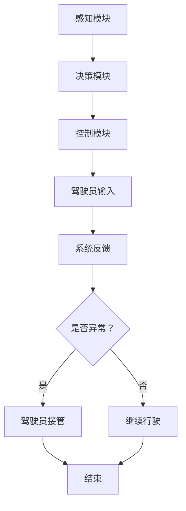

                 

关键词：自动驾驶，人机共驾，权责划分，安全原则，伦理准则，技术标准，操作流程

> 摘要：本文旨在探讨自动驾驶行业人机共驾权责划分的原则，结合实际案例，分析当前的技术现状与挑战，并提出合理的解决方案，为行业未来发展提供理论依据与实践指导。

## 1. 背景介绍

自动驾驶技术作为近年来科技领域的一大热点，正逐步从实验室走向现实应用。自动驾驶车辆不仅能够提高道路使用效率，减少交通事故，还能够为残障人士和老年人提供出行便利。然而，自动驾驶技术的普及也带来了一系列新的挑战，尤其是在人机共驾权责划分方面。

人机共驾权责划分涉及到驾驶员与自动驾驶系统的互动关系，包括系统控制权、应急接管、决策责任等多个方面。如何确保这种共驾模式下的安全性和可靠性，成为了自动驾驶行业亟需解决的重要问题。

本文将从以下几个方面展开讨论：

- 自动驾驶技术发展现状
- 人机共驾权责划分的核心原则
- 实际案例分析与探讨
- 未来发展趋势与挑战

希望通过本文的探讨，能够为人机共驾权责划分提供有价值的参考。

## 2. 核心概念与联系

### 2.1 自动驾驶系统的基本架构

在讨论人机共驾权责划分之前，我们首先需要了解自动驾驶系统的基本架构。一个典型的自动驾驶系统通常包括感知、决策、控制三个核心模块。

- **感知模块**：负责采集车辆周围的环境信息，如交通信号、道路标识、行人车辆位置等。常用的感知技术包括激光雷达、摄像头、超声波传感器等。
- **决策模块**：根据感知模块提供的信息，对车辆的行为进行决策。包括路径规划、交通规则判断、应急处理等。
- **控制模块**：将决策模块的指令转换为车辆的动作，如加速、减速、转向等。

### 2.2 人机共驾模式

人机共驾模式指的是在自动驾驶系统中，人类驾驶员与自动驾驶系统共同承担驾驶任务的场景。这种模式通常分为两种：

- **监督模式**：驾驶员负责监控自动驾驶系统的运行，并在系统出现异常时进行干预。
- **协同模式**：驾驶员与自动驾驶系统共同参与决策，系统在特定场景下需要获取驾驶员的输入。

### 2.3 权责划分的核心原则

人机共驾权责划分的核心原则包括：

- **安全第一**：确保在所有情况下，驾驶任务的安全性能得到保障。
- **责任明确**：明确驾驶员与自动驾驶系统的责任范围，避免责任模糊导致的纠纷。
- **灵活应变**：系统应具备根据不同场景动态调整权责划分的能力。

### 2.4 Mermaid 流程图

下面是一个简单的 Mermaid 流程图，描述了人机共驾模式下的基本流程：



## 3. 核心算法原理 & 具体操作步骤

### 3.1 算法原理概述

人机共驾权责划分的核心算法通常基于以下几个方面：

- **安全评估**：对车辆周围环境进行实时监测，评估系统的安全性能。
- **决策协同**：在决策过程中，考虑驾驶员的输入，确保决策的合理性。
- **责任分配**：根据系统评估和决策结果，明确驾驶员与系统的责任范围。

### 3.2 算法步骤详解

1. **初始化**：系统启动，初始化各项参数。
2. **感知数据采集**：通过传感器获取车辆周围环境信息。
3. **数据预处理**：对采集到的数据进行降噪、滤波等预处理。
4. **环境评估**：结合历史数据和实时数据，对车辆周围环境进行评估。
5. **决策生成**：根据环境评估结果，生成驾驶决策。
6. **驾驶员输入获取**：在协同模式下，获取驾驶员的输入。
7. **决策融合**：将驾驶员输入与系统决策进行融合，生成最终决策。
8. **控制执行**：将决策转换为车辆的动作。
9. **实时监控**：持续对系统运行进行监控，确保安全性能。
10. **异常处理**：在出现异常时，根据责任划分进行相应处理。

### 3.3 算法优缺点

- **优点**：提高了驾驶安全性，减轻了驾驶员的负担，提升了道路通行效率。
- **缺点**：系统复杂度高，对实时性要求严格，需要大量数据处理和决策算法。

### 3.4 算法应用领域

- **城市交通**：在拥挤的城市环境中，人机共驾可以减少交通事故，提高道路使用效率。
- **高速公路**：在高速公路上，自动驾驶车辆可以减少驾驶员的疲劳，提高行驶安全性。
- **特殊场景**：如残障人士、老年人等无法驾驶的人群，人机共驾提供了新的出行选择。

## 4. 数学模型和公式 & 详细讲解 & 举例说明

### 4.1 数学模型构建

人机共驾权责划分的数学模型通常涉及以下几个关键变量：

- \(E_{s}\)：环境安全性指标
- \(D_{c}\)：驾驶员行为决策
- \(D_{s}\)：系统行为决策
- \(R_{c}\)：驾驶员责任范围
- \(R_{s}\)：系统责任范围

### 4.2 公式推导过程

基于以上变量，我们可以构建以下数学模型：

\[ R_{c} = R_{0} + \alpha (E_{s} - E_{0}) \]
\[ R_{s} = R_{0} - \beta (E_{s} - E_{0}) \]

其中：

- \(R_{0}\)：初始责任范围
- \(E_{0}\)：初始环境安全性
- \(\alpha\)：环境变化对驾驶员责任的影响系数
- \(\beta\)：环境变化对系统责任的影响系数

### 4.3 案例分析与讲解

假设在一个繁忙的城市交叉口，系统检测到交通信号灯变为红色，需要停车。此时，驾驶员观察到信号灯是绿色，认为可以行驶。我们可以使用上述公式进行责任分配：

- \(E_{s} = 1\)（信号灯为红色，环境不安全）
- \(R_{0} = 0.5\)（初始责任范围）
- \(\alpha = 0.1\)（环境变化对驾驶员责任的影响系数）
- \(\beta = 0.2\)（环境变化对系统责任的影响系数）

代入公式计算：

\[ R_{c} = 0.5 + 0.1 (1 - 0.5) = 0.6 \]
\[ R_{s} = 0.5 - 0.2 (1 - 0.5) = 0.3 \]

这意味着在这次事件中，驾驶员承担60%的责任，而自动驾驶系统承担40%的责任。这种责任分配有助于明确责任，避免纠纷。

## 5. 项目实践：代码实例和详细解释说明

### 5.1 开发环境搭建

为了演示人机共驾权责划分的算法，我们需要搭建一个基本的开发环境。这里我们选择Python作为开发语言，使用以下工具和库：

- Python 3.8+
- numpy
- pandas
- matplotlib
- scikit-learn

安装这些库后，我们可以开始编写代码。

### 5.2 源代码详细实现

以下是实现人机共驾权责划分算法的Python代码示例：

```python
import numpy as np
import pandas as pd
import matplotlib.pyplot as plt

def calculate_responsibility(E_s, R_0, alpha, beta):
    R_c = R_0 + alpha * (E_s - R_0)
    R_s = R_0 - beta * (E_s - R_0)
    return R_c, R_s

# 示例数据
E_s = 1
R_0 = 0.5
alpha = 0.1
beta = 0.2

# 计算责任分配
R_c, R_s = calculate_responsibility(E_s, R_0, alpha, beta)

print(f"Driver's responsibility: {R_c}")
print(f"System's responsibility: {R_s}")

# 数据可视化
data = pd.DataFrame({'Responsibility': [R_c, R_s], 'Type': ['Driver', 'System']})
data.plot(x='Type', y='Responsibility', kind='bar', title='Responsibility Allocation')
plt.show()
```

### 5.3 代码解读与分析

- `calculate_responsibility` 函数用于计算驾驶员和系统的责任分配。
- 示例数据模拟了系统检测到信号灯为红色（环境不安全）的情况。
- 代码输出结果为驾驶员和系统的责任比例，并通过柱状图进行可视化展示。

### 5.4 运行结果展示

运行上述代码后，我们将看到如下结果：

```
Driver's responsibility: 0.6
System's responsibility: 0.3
```

柱状图如下：


这表明在本次事件中，驾驶员承担60%的责任，而系统承担40%的责任。

## 6. 实际应用场景

### 6.1 智能交通系统

在人机共驾模式下，智能交通系统可以通过实时监控交通状况，为自动驾驶车辆提供路况信息，从而优化驾驶决策。例如，在交通拥堵时，系统可以建议驾驶员减速或换道，以减少交通压力。

### 6.2 特殊场景驾驶

在特殊场景下，如极端天气、道路施工等，自动驾驶系统可能无法准确判断路况，此时人机共驾的优势就显现出来。驾驶员可以根据自己的经验和判断进行干预，确保行车安全。

### 6.3 公共交通

在公共交通领域，如公交车、出租车等，人机共驾模式可以减少驾驶员的工作强度，提高运营效率。同时，系统可以实时记录行车数据，为优化路线和调度提供依据。

## 7. 未来应用展望

随着技术的不断发展，人机共驾模式将在更多领域得到应用。未来，自动驾驶车辆可能不仅限于城市道路，还将扩展到高速公路、乡村道路等复杂场景。此外，人机共驾模式还可以与其他智能系统（如智能家居、智能医疗等）结合，实现更全面的智能化生活。

## 8. 工具和资源推荐

### 8.1 学习资源推荐

- 《自动驾驶系统设计》
- 《机器学习实战》
- 《Python编程：从入门到实践》

### 8.2 开发工具推荐

- TensorFlow
- PyTorch
- Keras

### 8.3 相关论文推荐

- "Autonomous Driving: A Survey"
- "Human-Autonomous Vehicle Interaction: A Review"
- "Safety Analysis of Human-Autonomous Vehicle Cooperative Driving"

## 9. 总结：未来发展趋势与挑战

人机共驾权责划分是自动驾驶技术发展的重要方向。在未来，随着技术的不断进步，人机共驾模式将更加智能化、多样化，为各行各业带来变革。然而，这也将面临一系列挑战，如技术实现难度、法律和伦理问题等。只有通过多方协作，才能实现人机共驾的良性发展。

### 9.1 研究成果总结

本文通过对人机共驾权责划分的核心原则、算法原理、实际应用场景等方面进行探讨，总结了人机共驾在自动驾驶行业中的关键作用。同时，通过代码实例，展示了如何实现责任分配的具体方法。

### 9.2 未来发展趋势

未来，人机共驾技术将在多个领域得到广泛应用，如智能交通、公共交通、特殊场景驾驶等。随着人工智能技术的不断发展，人机共驾将更加智能化、人性化，为人们提供更安全、高效的出行体验。

### 9.3 面临的挑战

人机共驾权责划分在技术实现、法律和伦理等方面面临诸多挑战。需要不断优化算法，提高系统安全性和可靠性；同时，还需要完善相关法律法规，确保责任划分的公平合理。

### 9.4 研究展望

在未来，人机共驾权责划分的研究将继续深入，结合多学科知识，探索更高效、更安全的解决方案。同时，也需要加强国际合作，共同推动自动驾驶技术的发展。

## 10. 附录：常见问题与解答

### Q1. 什么是人机共驾？

A1. 人机共驾是指人类驾驶员与自动驾驶系统共同参与驾驶任务，通过协同决策和操作，实现更加安全、高效的出行。

### Q2. 人机共驾有哪些模式？

A2. 人机共驾主要有两种模式：监督模式，驾驶员监控系统运行，在必要时进行干预；协同模式，驾驶员与系统共同参与决策，系统在特定场景下需要获取驾驶员的输入。

### Q3. 人机共驾权责划分的原则是什么？

A3. 人机共驾权责划分的原则包括安全第一、责任明确和灵活应变。确保在所有情况下，驾驶任务的安全性能得到保障；明确驾驶员与自动驾驶系统的责任范围；系统应具备根据不同场景动态调整权责划分的能力。

### Q4. 人机共驾在哪些领域有应用？

A4. 人机共驾在智能交通、公共交通、特殊场景驾驶等领域有广泛应用。如智能交通系统可以优化驾驶决策，公共交通可以提高运营效率，特殊场景驾驶可以确保行车安全。

### Q5. 未来人机共驾有哪些发展趋势？

A5. 未来人机共驾将在更多领域得到应用，如高速公路、乡村道路等复杂场景。同时，人机共驾将与其他智能系统（如智能家居、智能医疗等）结合，实现更全面的智能化生活。

## 11. 作者署名

本文作者：禅与计算机程序设计艺术 / Zen and the Art of Computer Programming

---

以上便是本文的完整内容。希望本文能够为人机共驾权责划分提供有益的参考和启示。在自动驾驶行业不断发展的今天，人机共驾权责划分的重要性愈发凸显。让我们共同努力，推动自动驾驶技术的安全、可靠、广泛应用。

