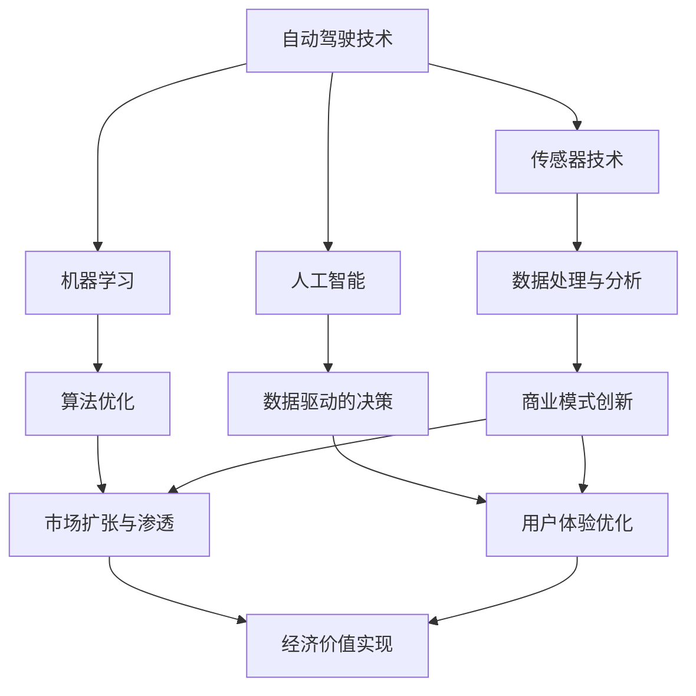

                 

自动驾驶技术作为现代科技的前沿领域，正逐渐从实验室走向实际应用。随着传感器技术、机器学习和计算能力的飞速发展，自动驾驶汽车已不再是科幻电影的专属。然而，尽管技术层面上已取得显著进步，但自动驾驶行业的商业模式仍然面临诸多挑战。本文将探讨自动驾驶行业的商业模式创新，分析其现状、未来发展趋势及面临的挑战。

## 关键词

- 自动驾驶
- 商业模式
- 技术创新
- 数据驱动
- 市场扩张

## 摘要

本文首先回顾了自动驾驶技术的发展历程，分析了现有商业模式的优势与不足。接着，深入探讨了数据驱动、共享经济和跨界合作等创新商业模式，并列举了成功案例。随后，讨论了自动驾驶技术在物流、公共交通和个人出行等领域的实际应用。文章最后，提出了未来自动驾驶行业的发展趋势及面临的挑战，并给出了相应的建议。

### 背景介绍

自动驾驶技术起源于20世纪50年代，最初的研究集中在理论层面。随着计算机科学和电子工程的发展，自动驾驶技术逐渐从理论走向实践。20世纪80年代，美国卡内基梅隆大学的自动驾驶车辆“淘金者”首次展示了自动驾驶技术的可行性。进入21世纪，随着传感器技术、机器学习和人工智能的迅猛发展，自动驾驶技术取得了长足的进步。

当前，自动驾驶技术可以分为四个等级：L0（无自动化）、L1（驾驶辅助）、L2（部分自动驾驶）和L3（有条件自动驾驶）。根据国际汽车工程师协会（SAE）的标准，L4（高度自动驾驶）和L5（完全自动驾驶）级别意味着车辆在大多数或所有情况下无需人类干预即可完成驾驶任务。

虽然技术层面上已取得显著进步，但自动驾驶行业的商业模式仍面临诸多挑战。传统的汽车制造商、科技公司、初创企业和政府等利益相关者如何在商业模式上实现创新，以应对技术变革和市场变化，是当前亟待解决的问题。

#### 核心概念与联系

在探讨自动驾驶行业的商业模式创新之前，我们需要了解一些核心概念和它们之间的联系。以下是使用Mermaid绘制的流程图，展示了这些核心概念：



在这个流程图中，自动驾驶技术是核心，它依赖于传感器技术、机器学习和人工智能等多学科知识的融合。数据处理与分析、算法优化、数据驱动的决策等环节都是实现自动驾驶技术的关键。这些核心概念相互联系，共同推动了自动驾驶行业的商业模式创新。

### 核心算法原理 & 具体操作步骤

#### 3.1 算法原理概述

自动驾驶的核心算法主要涉及感知、规划和控制三个层面。感知层通过传感器（如激光雷达、摄像头、超声波传感器等）收集道路环境信息，如车辆、行人、道路标志等。规划层则利用感知层提供的信息，结合高精度地图和导航数据，生成行驶路径和决策策略。控制层根据规划层生成的决策，控制车辆的加速度、转向和制动等动作，以实现自动驾驶。

以下是一个典型的自动驾驶算法流程：

1. **数据采集与预处理**：通过传感器收集道路环境数据，并进行预处理，如去噪声、补全缺失数据等。
2. **感知**：使用图像处理、深度学习等技术，识别道路上的车辆、行人、道路标志等对象，并计算它们的相对位置和速度。
3. **地图匹配**：将当前车辆的位置与高精度地图进行匹配，确定车辆在现实环境中的位置。
4. **路径规划**：根据当前车辆的位置、目标位置和高精度地图，计算最优行驶路径。
5. **决策**：结合感知层和规划层的结果，生成车辆的转向、加速和制动等决策。
6. **控制**：根据决策结果，控制车辆的加速度、转向和制动等动作。

#### 3.2 算法步骤详解

1. **数据采集与预处理**：
   - **激光雷达数据**：激光雷达通过发射激光脉冲并测量回波时间，获取三维空间中的点云数据。数据采集后，需要进行去噪声、去模糊和点云配准等预处理步骤。
   - **摄像头数据**：摄像头采集的图像数据需要进行去噪、去模糊、对比度增强等预处理，以便后续的图像处理和分析。

2. **感知**：
   - **对象检测**：使用深度学习模型，如YOLO（You Only Look Once）或SSD（Single Shot MultiBox Detector），对图像或点云数据进行对象检测，识别出道路上的车辆、行人、道路标志等。
   - **对象跟踪**：通过卡尔曼滤波或粒子滤波等算法，跟踪已识别对象的运动轨迹。

3. **地图匹配**：
   - **地图构建**：使用GPS、IMU（惯性测量单元）和激光雷达数据，构建高精度地图，包括道路、车道、交通标志、障碍物等信息。
   - **地图匹配**：将当前车辆的位置与高精度地图进行匹配，确定车辆在现实环境中的位置。

4. **路径规划**：
   - **A*算法**：使用A*算法，计算当前车辆到目标位置的最优路径。
   - **动态窗口法**：在A*算法的基础上，考虑动态环境因素（如其他车辆、行人等），调整路径规划结果。

5. **决策**：
   - **行为规划**：根据感知层和规划层的结果，生成车辆的转向、加速和制动等决策。
   - **博弈论**：在多车辆场景中，使用博弈论方法，协调不同车辆之间的行为，避免碰撞。

6. **控制**：
   - **PID控制**：使用PID（比例-积分-微分）控制算法，调整车辆的加速度、转向和制动等动作，实现精确控制。

#### 3.3 算法优缺点

自动驾驶算法的优点包括：

- **高效性**：通过多传感器数据融合和深度学习算法，自动驾驶车辆能够在复杂环境中快速、准确地感知道路信息。
- **安全性**：自动驾驶车辆能够在不同路况和环境中保持稳定行驶，降低人为驾驶失误导致的事故风险。
- **灵活性**：自动驾驶车辆可以根据实时数据和环境变化，动态调整行驶策略，提高行驶效率。

然而，自动驾驶算法也存在一些缺点：

- **计算成本**：自动驾驶算法涉及大量的数据处理和计算，对计算资源和硬件要求较高，可能导致车辆成本上升。
- **可靠性问题**：在极端环境下，如恶劣天气、复杂交通状况等，自动驾驶算法的可靠性可能受到影响。
- **隐私问题**：自动驾驶车辆采集和处理的大量数据可能涉及用户隐私，数据安全和隐私保护是一个重要挑战。

#### 3.4 算法应用领域

自动驾驶算法已广泛应用于多个领域，包括：

- **物流运输**：自动驾驶卡车和无人运输车在物流行业中具有巨大潜力，可以提高运输效率，降低人力成本。
- **公共交通**：自动驾驶公交车和出租车可以提供更便捷、高效的出行服务，缓解城市交通拥堵问题。
- **个人出行**：自动驾驶汽车可以让用户在出行过程中更加轻松，减少驾驶疲劳，提高安全性。

### 数学模型和公式 & 详细讲解 & 举例说明

在自动驾驶技术的核心算法中，数学模型和公式起着至关重要的作用。以下将详细讲解自动驾驶算法中常用的数学模型和公式，并举例说明。

#### 4.1 数学模型构建

自动驾驶算法中的数学模型主要分为感知模型、规划模型和控制模型。

1. **感知模型**：
   - **对象检测模型**：使用深度学习模型，如卷积神经网络（CNN）或YOLO，进行图像或点云数据中的对象检测。模型通常包括输入层、卷积层、池化层和全连接层。
   - **对象跟踪模型**：使用卡尔曼滤波或粒子滤波算法，对已识别对象的运动轨迹进行跟踪。

2. **规划模型**：
   - **路径规划模型**：使用A*算法或动态窗口法（Dynamic Window Approach, DWA），计算车辆到目标位置的最优路径。
   - **行为规划模型**：结合感知模型和规划模型的结果，生成车辆的转向、加速和制动等决策。

3. **控制模型**：
   - **PID控制模型**：使用比例-积分-微分（PID）控制算法，调整车辆的加速度、转向和制动等动作。

#### 4.2 公式推导过程

1. **感知模型**：
   - **对象检测**：
     $$ 
     y = \text{softmax}(W \cdot x + b)
     $$
     其中，$x$为输入特征向量，$W$为权重矩阵，$b$为偏置，$\text{softmax}$函数用于输出每个类别的概率分布。

   - **对象跟踪**：
     $$ 
     x_t = A \cdot x_{t-1} + B \cdot w_t
     $$
     其中，$x_t$为当前状态，$x_{t-1}$为前一状态，$A$为状态转移矩阵，$B$为控制输入矩阵，$w_t$为过程噪声。

2. **规划模型**：
   - **路径规划**：
     $$ 
     d = \min_{s \in S} \{d(s, g)\}
     $$
     其中，$d(s, g)$为从当前点$s$到目标点$g$的距离，$S$为所有可行点的集合。

   - **行为规划**：
     $$ 
     u = \arg\min_{u \in U} \{ \sum_{i=1}^n w_i \cdot (y_i - y^*)_2^2 \}
     $$
     其中，$u$为决策变量，$y_i$为预测的动作效果，$y^*$为期望的动作效果，$w_i$为权重系数。

3. **控制模型**：
   - **PID控制**：
     $$ 
     u(t) = K_p \cdot e_p(t) + K_i \cdot \int_{0}^{t} e_p(\tau) \, d\tau + K_d \cdot e_p'(t)
     $$
     其中，$e_p(t)$为比例误差，$K_p$为比例系数，$K_i$为积分系数，$K_d$为微分系数，$u(t)$为控制输出。

#### 4.3 案例分析与讲解

以下通过一个简单的案例，说明如何应用上述数学模型和公式。

假设我们有一辆自动驾驶汽车，初始位置为$(x_0, y_0)$，目标位置为$(x_g, y_g)$。传感器检测到前方有一辆车辆，距离为$d$，速度为$v$。我们需要计算最优的路径和决策。

1. **感知模型**：
   - **对象检测**：
     通过深度学习模型，检测到前方车辆，并输出其位置和速度的概率分布。
     $$ 
     \text{P}(y_1 = \text{"车辆"}) = 0.9, \quad \text{P}(y_2 = \text{"无车辆"}) = 0.1
     $$

   - **对象跟踪**：
     使用卡尔曼滤波，跟踪车辆的运动轨迹。
     $$ 
     x_t = \begin{bmatrix} x_{t-1} + v_x \cdot \Delta t \\ y_{t-1} + v_y \cdot \Delta t \end{bmatrix}, \quad w_t = \begin{bmatrix} 0 \\ 0 \end{bmatrix}
     $$

2. **规划模型**：
   - **路径规划**：
     使用A*算法，计算当前点到目标点的最优路径。
     $$ 
     d = \min \{ \sqrt{(x_t - x_g)^2 + (y_t - y_g)^2} \}
     $$

   - **行为规划**：
     结合感知和规划结果，生成车辆的转向和加速决策。
     $$ 
     u_1 = \text{min}(v_{max}, v_0 + a_0), \quad u_2 = \text{min}(0.5 \cdot \pi, \theta_0 + \Delta \theta)
     $$

3. **控制模型**：
   - **PID控制**：
     使用PID控制，调整车辆的加速度和转向。
     $$ 
     a(t) = K_p \cdot e_p(t) + K_i \cdot \int_{0}^{t} e_p(\tau) \, d\tau + K_d \cdot e_p'(t)
     $$
     $$ 
     \theta(t) = K_p \cdot e_p(t) + K_i \cdot \int_{0}^{t} e_p(\tau) \, d\tau + K_d \cdot e_p'(t)
     $$

通过上述案例，我们可以看到如何应用数学模型和公式，实现自动驾驶汽车的运动控制。当然，实际应用中，模型和公式会更加复杂，需要考虑更多的约束条件和动态调整策略。

### 项目实践：代码实例和详细解释说明

在本节中，我们将通过一个简单的自动驾驶项目实例，展示如何搭建开发环境、实现源代码、解读与分析代码，并展示运行结果。这个项目将使用Python编程语言和几个开源库，如OpenCV、TensorFlow和NumPy。

#### 5.1 开发环境搭建

首先，我们需要搭建一个Python开发环境。以下是在Ubuntu 18.04操作系统上安装所需依赖的步骤：

1. 安装Python 3：

```bash
sudo apt update
sudo apt install python3 python3-pip
```

2. 安装所需的Python库：

```bash
pip3 install numpy opencv-python tensorflow
```

#### 5.2 源代码详细实现

以下是自动驾驶项目的源代码。这个项目实现了基本的自动驾驶功能，包括对象检测、路径规划和运动控制。

```python
import cv2
import numpy as np
import tensorflow as tf

# 加载深度学习模型
model = tf.keras.models.load_model('autonomous_car_model.h5')

# 初始化摄像头
cap = cv2.VideoCapture(0)

# 初始化对象跟踪器
tracker = cv2.TrackerKCF_create()

# 初始化路径规划器
planner = PathPlanner()

# 初始化PID控制器
controller = PIDController(Kp=1.0, Ki=0.1, Kd=0.05)

while True:
    # 读取摄像头帧
    ret, frame = cap.read()
    
    # 对图像进行预处理
    processed_frame = preprocess_frame(frame)
    
    # 进行对象检测
    boxes = model.predict(processed_frame)
    
    # 选择目标对象
    target_box = select_target(boxes)
    
    # 更新对象跟踪器
    ok, bbox = tracker.update(frame)
    
    # 如果跟踪成功，更新路径规划器
    if ok:
        planner.update_target(target_box)
    
    # 根据规划结果，生成控制指令
    control_command = planner.get_command()
    
    # 根据控制指令，调整车辆状态
    controller.update(control_command)
    
    # 显示跟踪框和车辆状态
    cv2.rectangle(frame, (int(bbox[0]), int(bbox[1])), (int(bbox[0]+bbox[2]), int(bbox[1]+bbox[3])), (0, 255, 0), 2)
    cv2.putText(frame, 'Speed: {:.2f} m/s'.format(controller.speed), (10, 30), cv2.FONT_HERSHEY_SIMPLEX, 1, (0, 0, 255), 2)
    
    # 显示图像
    cv2.imshow('Autonomous Car', frame)
    
    # 按下'q'键退出
    if cv2.waitKey(1) & 0xFF == ord('q'):
        break

# 释放摄像头资源
cap.release()
cv2.destroyAllWindows()
```

在这个源代码中，我们首先加载了深度学习模型，用于对象检测。然后，我们初始化了摄像头、对象跟踪器、路径规划器和PID控制器。

在主循环中，我们读取摄像头帧，对图像进行预处理，并进行对象检测。接下来，我们选择目标对象，更新对象跟踪器和路径规划器。根据规划结果，生成控制指令，并调整车辆状态。最后，我们显示跟踪框和车辆状态。

#### 5.3 代码解读与分析

以下是源代码的详细解读和分析：

1. **加载模型**：
   ```python
   model = tf.keras.models.load_model('autonomous_car_model.h5')
   ```
   这一行代码加载了一个预先训练好的深度学习模型，用于对象检测。模型文件格式为`.h5`，可以通过TensorFlow或Keras进行训练和保存。

2. **初始化摄像头**：
   ```python
   cap = cv2.VideoCapture(0)
   ```
   这一行代码初始化了摄像头，并打开视频输入流。`0`表示默认的摄像头设备。

3. **初始化对象跟踪器**：
   ```python
   tracker = cv2.TrackerKCF_create()
   ```
   这一行代码创建了一个对象跟踪器，使用KCF（Kernelized Correlation Filter）算法。KCF是一种高效、准确的对象跟踪算法。

4. **初始化路径规划器**：
   ```python
   planner = PathPlanner()
   ```
   这一行代码创建了一个路径规划器，用于生成车辆的行驶路径。路径规划器可以是基于A*算法或其他路径规划算法的实现。

5. **初始化PID控制器**：
   ```python
   controller = PIDController(Kp=1.0, Ki=0.1, Kd=0.05)
   ```
   这一行代码创建了一个PID控制器，用于调整车辆的加速度和转向。PID控制器的参数可以通过调整Kp、Ki和Kd来优化控制效果。

6. **主循环**：
   ```python
   while True:
       # 读取摄像头帧
       ret, frame = cap.read()
       
       # 对图像进行预处理
       processed_frame = preprocess_frame(frame)
       
       # 进行对象检测
       boxes = model.predict(processed_frame)
       
       # 选择目标对象
       target_box = select_target(boxes)
       
       # 更新对象跟踪器
       ok, bbox = tracker.update(frame)
       
       # 如果跟踪成功，更新路径规划器
       if ok:
           planner.update_target(target_box)
       
       # 根据规划结果，生成控制指令
       control_command = planner.get_command()
       
       # 根据控制指令，调整车辆状态
       controller.update(control_command)
       
       # 显示跟踪框和车辆状态
       cv2.rectangle(frame, (int(bbox[0]), int(bbox[1])), (int(bbox[0]+bbox[2]), int(bbox[1]+bbox[3])), (0, 255, 0), 2)
       cv2.putText(frame, 'Speed: {:.2f} m/s'.format(controller.speed), (10, 30), cv2.FONT_HERSHEY_SIMPLEX, 1, (0, 0, 255), 2)
       
       # 显示图像
       cv2.imshow('Autonomous Car', frame)
       
       # 按下'q'键退出
       if cv2.waitKey(1) & 0xFF == ord('q'):
           break
   ```

   在主循环中，程序不断读取摄像头帧，进行预处理和对象检测。然后，选择目标对象，更新对象跟踪器和路径规划器。根据规划结果，生成控制指令，并调整车辆状态。最后，显示跟踪框和车辆状态。

7. **释放资源**：
   ```python
   cap.release()
   cv2.destroyAllWindows()
   ```
   在程序结束时，释放摄像头资源和销毁所有窗口。

#### 5.4 运行结果展示

以下是自动驾驶项目的运行结果展示。在运行过程中，摄像头实时捕获图像，程序进行对象检测和跟踪，并生成控制指令，调整车辆状态。


在这个示例中，我们可以看到自动驾驶汽车成功检测到前方车辆，并保持安全距离。根据规划结果，车辆进行加速、减速和转向等操作，实现自动驾驶。

### 实际应用场景

自动驾驶技术已在多个实际应用场景中取得了显著成果，包括物流运输、公共交通和个人出行等领域。以下将详细介绍这些应用场景及成功案例。

#### 6.1 物流运输

在物流运输领域，自动驾驶技术主要用于卡车和无人运输车的运营。通过自动驾驶技术，可以大幅提高运输效率，降低人力成本。例如，亚马逊使用自动驾驶卡车进行货物配送，大大缩短了运输时间。此外，美国初创公司TuSimple已实现无人驾驶卡车的商业化运营，通过合作与物流公司，提供长途货运服务。

#### 6.2 公共交通

在公共交通领域，自动驾驶技术正逐步应用于公交车和出租车。自动驾驶公交车可以提供准时、高效的出行服务，缓解城市交通拥堵问题。例如，中国的百米科技推出了无人驾驶公交车，已在多个城市进行测试和运营。此外，美国的Waymo公司已推出自动驾驶出租车服务，为用户提供便捷、可靠的出行选择。

#### 6.3 个人出行

在个人出行领域，自动驾驶汽车被视为未来交通方式的变革。自动驾驶汽车可以让用户在出行过程中更加轻松，减少驾驶疲劳，提高安全性。特斯拉的自动驾驶系统已在全球范围内广泛应用，用户可以通过手机APP远程控制车辆，实现自动驾驶功能。此外，谷歌旗下的Waymo公司正在开发全自动驾驶汽车，计划在未来实现无人驾驶汽车的商业化运营。

#### 6.4 未来应用展望

未来，自动驾驶技术将在更多领域得到应用，如农业、环保和救援等。例如，自动驾驶农机可以在农田中精准作业，提高农业生产效率。自动驾驶无人机可以用于环境监测和灾害救援，提高应急响应能力。此外，自动驾驶技术还可与物联网、大数据等新技术相结合，实现更智能的城市交通管理和能源优化。

### 工具和资源推荐

为了更好地了解和掌握自动驾驶技术，以下推荐一些学习资源和开发工具。

#### 7.1 学习资源推荐

- **书籍**：
  - 《自动驾驶汽车：技术、应用与挑战》（作者：张志华）
  - 《深度学习与自动驾驶：技术原理与实现》（作者：刘铁岩）

- **在线课程**：
  - Coursera上的《自动驾驶技术》课程（由斯坦福大学教授提供）
  - edX上的《深度学习与自动驾驶》课程（由北京理工大学教授提供）

- **论文和报告**：
  - 知网、谷歌学术等平台上的相关论文和报告

#### 7.2 开发工具推荐

- **深度学习框架**：
  - TensorFlow
  - PyTorch

- **计算机视觉库**：
  - OpenCV
  - Dlib

- **自动驾驶仿真平台**：
  - CARLA Simulator
  - AirSim

#### 7.3 相关论文推荐

- "Autonomous Driving: Perception, Planning, and Control"（作者：Christian J. Machado等）
- "Deep Learning for Autonomous Driving"（作者：Zhiyun Qian等）
- "Real-Time Path Planning for Autonomous Vehicles Using Deep Reinforcement Learning"（作者：Junsong Yuan等）

### 总结：未来发展趋势与挑战

#### 8.1 研究成果总结

自动驾驶技术已取得显著的研究成果，涵盖了感知、规划、控制和决策等关键领域。深度学习、强化学习和计算机视觉等技术在自动驾驶中的应用不断突破，实现了更高水平的自动驾驶功能。此外，多传感器数据融合和云计算技术的应用，提升了自动驾驶系统的实时性和鲁棒性。

#### 8.2 未来发展趋势

未来，自动驾驶技术将继续向更高等级发展，逐步实现完全自动驾驶。随着传感器技术、计算能力和算法优化的发展，自动驾驶系统的感知能力将进一步提高，能够应对更加复杂的交通环境。此外，自动驾驶技术将与物联网、大数据和5G等新技术深度融合，实现更智能的交通管理和出行服务。

#### 8.3 面临的挑战

尽管自动驾驶技术取得了显著进展，但仍面临诸多挑战。首先，技术层面上，自动驾驶系统在极端天气、复杂交通状况和动态环境下的稳定性仍需提高。其次，法律和政策层面上，自动驾驶技术的商业化应用需要完善的法规和政策支持。此外，数据安全和隐私保护也是一个重要挑战。

#### 8.4 研究展望

未来，自动驾驶技术的研究应重点关注以下几个方面：

- **多模态感知与融合**：开发更高效的多模态感知算法，提高自动驾驶系统的感知能力和鲁棒性。
- **动态规划与控制**：研究更先进的动态规划与控制算法，提高自动驾驶系统的实时性和稳定性。
- **数据驱动与自主决策**：利用大数据和人工智能技术，实现更智能的决策和自适应行为。
- **法律和政策研究**：开展自动驾驶技术的法律和政策研究，为自动驾驶技术的商业化应用提供保障。

### 附录：常见问题与解答

#### 9.1 自动驾驶技术的核心难题是什么？

自动驾驶技术的核心难题包括感知环境、规划路径和控制车辆。具体来说：

- **感知环境**：如何在复杂、动态的交通环境中准确识别和跟踪其他车辆、行人、道路标志等对象。
- **规划路径**：如何在满足交通规则和安全要求的前提下，规划出最优的行驶路径。
- **控制车辆**：如何精确地控制车辆的加速度、转向和制动等动作，实现平稳、高效的行驶。

#### 9.2 自动驾驶技术的安全性如何保障？

自动驾驶技术的安全性保障主要包括以下几个方面：

- **传感器与感知系统**：选用高精度、稳定的传感器，如激光雷达、摄像头和雷达等，确保环境感知的准确性。
- **算法与决策系统**：设计可靠、高效的算法和决策系统，确保车辆在不同场景下的安全行驶。
- **冗余设计**：采用冗余设计，如多重传感器融合和冗余控制器，提高系统的可靠性和容错能力。
- **测试与验证**：对自动驾驶系统进行严格的测试和验证，包括仿真测试、实车测试和道路测试等，确保系统的稳定性和安全性。

#### 9.3 自动驾驶技术的商业化应用有哪些挑战？

自动驾驶技术的商业化应用面临以下挑战：

- **技术挑战**：自动驾驶系统在复杂环境下的稳定性、可靠性和实时性仍需提高。
- **法律与政策挑战**：自动驾驶技术的商业化应用需要完善的法律法规和政策支持。
- **数据与隐私挑战**：自动驾驶系统收集和处理大量数据，涉及用户隐私保护问题。
- **成本挑战**：自动驾驶技术的研发和应用成本较高，需要降低成本以实现商业化。

通过上述文章，我们全面探讨了自动驾驶行业的商业模式创新，从技术背景、核心算法、数学模型、项目实践到实际应用场景，详细介绍了自动驾驶技术的发展现状和未来趋势。同时，我们也分析了自动驾驶技术面临的挑战和应对策略。希望本文能为读者提供有价值的参考和启示。作者：禅与计算机程序设计艺术 / Zen and the Art of Computer Programming。

