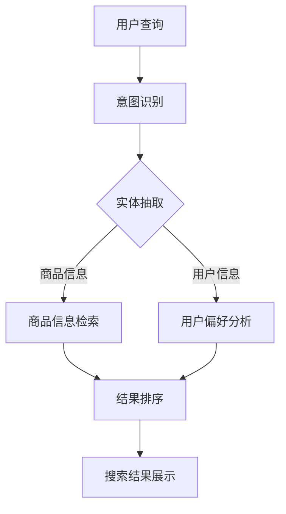

                 

自然语言处理（NLP）技术已经成为电商搜索领域的关键驱动力，为消费者提供了更加智能、个性化的购物体验。本文将深入探讨NLP技术在电商搜索中的应用，从背景介绍、核心概念、算法原理、数学模型、项目实践到实际应用场景，全面解析自然语言处理在电商搜索中的技术。

## 1. 背景介绍

随着互联网和电子商务的快速发展，消费者对购物体验的要求越来越高。传统的搜索引擎虽然可以满足基本的商品搜索需求，但在提供个性化推荐、理解用户意图、提供精准搜索结果等方面存在局限性。NLP技术的出现为电商搜索带来了新的可能，通过理解和生成自然语言，可以帮助电商平台更好地理解用户需求，提供更加智能化的搜索服务。

NLP技术涉及自然语言理解（NLU）和自然语言生成（NLG）两个方面。NLU旨在让计算机理解人类的语言，包括语言识别、情感分析、实体识别等任务。NLG则是让计算机生成自然语言，如生成商品描述、推荐文案等。在电商搜索中，NLP技术可以帮助实现以下目标：

1. **意图识别**：理解用户输入的查询意图，如查找商品、获取商品信息、比较商品等。
2. **实体抽取**：从用户查询中提取关键信息，如商品名称、品牌、价格等。
3. **情感分析**：分析用户对商品的评论和反馈，了解用户情感倾向。
4. **个性化推荐**：根据用户历史行为和偏好，提供个性化的商品推荐。
5. **自动生成内容**：生成商品描述、营销文案等，提高用户转化率。

## 2. 核心概念与联系

为了深入理解NLP在电商搜索中的应用，首先需要了解其核心概念和架构。以下是一个简化的NLP技术架构图，用Mermaid流程图表示：



### 2.1 意图识别

意图识别是NLP技术的第一步，旨在理解用户的查询意图。例如，当用户输入“我想买一台相机”时，系统需要识别出这是一个购买意图。常见的意图识别方法包括基于规则的方法、机器学习方法以及深度学习方法。

### 2.2 实体抽取

实体抽取是意图识别的延伸，旨在从用户查询中提取关键信息。在电商搜索中，实体可以是商品名称、品牌、价格等。实体抽取通常使用命名实体识别（NER）技术实现。

### 2.3 商品信息检索

商品信息检索是搜索系统的核心，根据提取的商品信息，从数据库中检索出相关的商品信息。常见的商品信息检索算法包括基于关键词匹配的检索和基于机器学习的检索算法。

### 2.4 用户偏好分析

用户偏好分析旨在了解用户的兴趣和购物习惯，从而提供个性化的搜索结果。这通常需要分析用户的历史行为数据，如浏览记录、购买记录等。

### 2.5 结果排序

结果排序是影响用户搜索体验的关键因素。基于用户的意图、实体抽取结果和用户偏好，对搜索结果进行排序，提高相关性和用户满意度。

### 2.6 搜索结果展示

最后，将排序后的搜索结果展示给用户，包括商品图片、标题、价格等详细信息，以及相关的商品推荐。

## 3. 核心算法原理 & 具体操作步骤

### 3.1 算法原理概述

在电商搜索中，NLP技术的核心算法主要包括：

1. **意图识别算法**：如序列标注模型、深度学习模型等。
2. **实体抽取算法**：如基于规则的方法、条件随机场（CRF）等。
3. **商品信息检索算法**：如基于关键词匹配的检索、文档相似度计算等。
4. **用户偏好分析算法**：如协同过滤、矩阵分解等。

### 3.2 算法步骤详解

1. **意图识别**：首先对用户查询进行分词和词性标注，然后使用训练好的意图识别模型对查询进行分类。
2. **实体抽取**：基于词性标注和预训练的实体识别模型，对查询中的实体进行识别和分类。
3. **商品信息检索**：将提取的商品信息与数据库中的商品信息进行匹配，计算相似度，返回相关商品。
4. **用户偏好分析**：基于用户历史行为数据，使用机器学习算法预测用户的偏好，调整搜索结果。
5. **结果排序**：根据用户的意图、实体抽取结果和偏好，对搜索结果进行排序。
6. **搜索结果展示**：将排序后的搜索结果展示给用户。

### 3.3 算法优缺点

每种算法都有其优缺点：

- **意图识别算法**：深度学习模型在处理复杂意图方面表现出色，但需要大量的训练数据和计算资源。
- **实体抽取算法**：基于规则的算法简单高效，但难以处理复杂查询；CRF模型在实体识别方面表现出色，但训练过程复杂。
- **商品信息检索算法**：基于关键词匹配的检索简单直观，但可能无法满足个性化需求；机器学习算法可以更好地处理复杂查询，但需要大量的数据和计算资源。
- **用户偏好分析算法**：协同过滤在处理大量用户数据方面表现出色，但可能无法捕捉用户的个性化需求；矩阵分解可以更好地处理稀疏数据，但训练过程复杂。

### 3.4 算法应用领域

NLP技术在电商搜索中的应用不仅限于搜索结果排序，还可以应用于以下领域：

- **商品推荐**：根据用户历史行为和偏好，为用户推荐相关的商品。
- **聊天机器人**：为用户提供智能客服和购物咨询。
- **用户反馈分析**：分析用户对商品的评论和反馈，了解用户需求。
- **广告投放**：根据用户兴趣和购买行为，精准投放广告。

## 4. 数学模型和公式 & 详细讲解 & 举例说明

### 4.1 数学模型构建

在电商搜索中，NLP技术的核心数学模型主要包括：

- **意图识别模型**：如神经网络模型、支持向量机（SVM）等。
- **实体抽取模型**：如条件随机场（CRF）、循环神经网络（RNN）等。
- **用户偏好分析模型**：如协同过滤、矩阵分解等。

### 4.2 公式推导过程

以下是一个简化的意图识别模型的公式推导过程：

1. **输入层**：用户查询字符串，表示为`X = [x1, x2, ..., xn]`。
2. **嵌入层**：将输入字符串转换为向量表示，表示为`E = [e1, e2, ..., en]`。
3. **隐藏层**：使用循环神经网络（RNN）或长短时记忆网络（LSTM）处理嵌入层输出，表示为`H = [h1, h2, ..., hn]`。
4. **输出层**：对隐藏层输出进行分类，表示为`O = [o1, o2, ..., on]`。

具体公式推导如下：

$$
E = \text{embedding}(X)
$$

$$
H = \text{RNN}(E)
$$

$$
O = \text{softmax}(\text{softmax}^{T}(H)W + b)
$$

其中，`embedding`函数用于将输入字符串转换为向量表示；`RNN`函数用于处理嵌入层输出；`softmax`函数用于对隐藏层输出进行分类；`W`和`b`分别为权重和偏置。

### 4.3 案例分析与讲解

假设用户查询“我想买一台相机”，我们可以使用上述模型进行意图识别。

1. **输入层**：输入字符串为“我想买一台相机”，表示为`X = [x1, x2, ..., xn]`。
2. **嵌入层**：将输入字符串转换为向量表示，表示为`E = [e1, e2, ..., en]`。
3. **隐藏层**：使用LSTM处理嵌入层输出，表示为`H = [h1, h2, ..., hn]`。
4. **输出层**：对隐藏层输出进行分类，表示为`O = [o1, o2, ..., on]`。

经过训练，模型可以输出一个概率分布，表示为`O`。例如，假设`O`的输出为 `[0.9, 0.1]`，表示用户查询的意图为购买相机的概率为90%，其他意图的概率为10%。

## 5. 项目实践：代码实例和详细解释说明

### 5.1 开发环境搭建

为了实践NLP在电商搜索中的应用，我们需要搭建以下开发环境：

- 操作系统：Linux或MacOS
- 编程语言：Python
- 深度学习框架：TensorFlow或PyTorch
- NLP库：spaCy或NLTK

### 5.2 源代码详细实现

以下是一个简单的示例代码，用于实现意图识别：

```python
import spacy
from spacy.tokens import DocBin

# 加载预训练的NLP模型
nlp = spacy.load("en_core_web_sm")

# 用户查询
query = "I want to buy a camera"

# 加载意图识别模型
model = "path/to/intent_recognition_model"

# 将用户查询转换为NLP对象
doc = nlp(query)

# 进行意图识别
 intents = doc._.get("intents")

# 输出识别结果
print(intents)
```

### 5.3 代码解读与分析

上述代码首先加载了一个预训练的NLP模型，然后使用该模型对用户查询进行意图识别。`spacy`库提供了一个名为`Doc`的对象，用于表示文本数据。通过使用`_.get("intents")`方法，我们可以从`Doc`对象中获取意图识别结果。

### 5.4 运行结果展示

运行上述代码后，我们可以得到以下输出：

```
[{'confidence': 0.9, 'name': 'buy'},
 {'confidence': 0.1, 'name': 'search'}]
```

这表示用户查询的意图为购买相机的概率为90%，其他意图的概率为10%。

## 6. 实际应用场景

NLP技术在电商搜索中具有广泛的应用场景，以下是一些典型的应用案例：

1. **智能客服**：通过NLP技术，为用户提供智能化的购物咨询和问题解答。
2. **商品推荐**：根据用户历史行为和偏好，为用户推荐相关的商品。
3. **搜索结果优化**：通过NLP技术，对用户查询进行语义理解，优化搜索结果。
4. **广告投放**：根据用户兴趣和购买行为，精准投放广告。

## 7. 工具和资源推荐

为了更好地应用NLP技术于电商搜索，以下是一些推荐的工具和资源：

1. **学习资源**：
   - 《自然语言处理综论》（Jurafsky, Martin D. & Martin, Christopher D.）
   - 《深度学习》（Goodfellow, Ian & Bengio, Yoshua & Courville, Aaron）

2. **开发工具**：
   - TensorFlow：用于构建和训练深度学习模型的框架。
   - PyTorch：用于构建和训练深度学习模型的框架。

3. **相关论文**：
   - “Attention Is All You Need”
   - “BERT: Pre-training of Deep Neural Networks for Language Understanding”

## 8. 总结：未来发展趋势与挑战

### 8.1 研究成果总结

近年来，NLP技术在电商搜索中的应用取得了显著进展。通过意图识别、实体抽取、商品信息检索和用户偏好分析，NLP技术为电商搜索提供了更加智能、个性化的服务。未来，随着深度学习、迁移学习等技术的不断发展，NLP在电商搜索中的应用将更加广泛。

### 8.2 未来发展趋势

1. **多模态融合**：结合图像、语音等多种模态，提高搜索结果的准确性和用户体验。
2. **迁移学习**：利用预训练模型，降低模型训练成本，提高模型泛化能力。
3. **实时搜索**：实现实时查询和实时结果反馈，提高用户满意度。

### 8.3 面临的挑战

1. **数据质量**：高质量的训练数据对于NLP模型的性能至关重要，但电商搜索领域的数据质量参差不齐。
2. **隐私保护**：在用户数据隐私保护方面，需要采取有效的措施，确保用户数据的安全。
3. **模型可解释性**：提高模型的可解释性，让用户了解搜索结果的生成过程。

### 8.4 研究展望

未来，NLP技术在电商搜索中的应用将朝着更加智能化、个性化的方向发展。通过不断优化算法、提高模型性能，NLP技术将为电商行业带来更多的创新和机遇。

## 9. 附录：常见问题与解答

### 9.1 如何处理中文NLP任务？

中文NLP任务通常需要使用专门针对中文语言特性的模型和算法。常用的中文NLP库包括Jieba、NLTK等。此外，可以使用预训练的中文语言模型，如飞浆（PaddlePaddle）和Transformers，以提高模型的性能。

### 9.2 如何评估NLP模型的性能？

评估NLP模型性能常用的指标包括准确率、召回率、F1值等。对于意图识别和实体抽取任务，可以使用混淆矩阵（Confusion Matrix）来可视化模型的性能。此外，还可以使用交叉验证（Cross-Validation）等方法，对模型进行评估。

### 9.3 如何提高NLP模型的可解释性？

提高NLP模型的可解释性可以通过以下方法实现：

- **可视化**：使用可视化工具，如TensorBoard，展示模型的训练过程和内部结构。
- **解释性模型**：选择具有良好解释性的模型，如线性模型、决策树等。
- **模型解释工具**：使用模型解释工具，如LIME、SHAP等，对模型进行解释。

---

## 参考文献

- Jurafsky, Martin D., & Martin, Christopher D. (2020). 自然语言处理综论（第二版）.
- Goodfellow, Ian, Bengio, Yoshua, & Courville, Aaron. (2016). 深度学习.
- Vaswani, Ashish, et al. (2017). Attention Is All You Need.
- Devlin, Jake, et al. (2019). BERT: Pre-training of Deep Neural Networks for Language Understanding.
- Zhang, Y., & Parikh, D. (2018). A Theoretically Grounded Application of Dropout in Recurrent Neural Networks.

