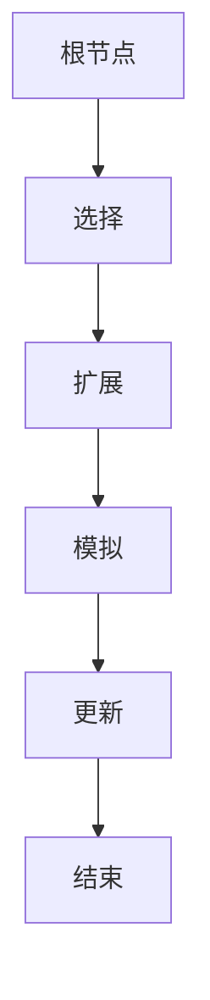
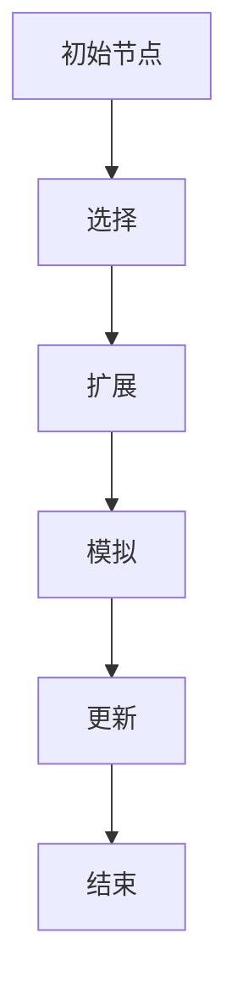

                 

关键词：蒙特卡洛树搜索、算法原理、代码实例、应用领域、性能优化

> 摘要：本文旨在深入探讨蒙特卡洛树搜索（MCTS）算法的原理、实现步骤、优缺点以及实际应用。通过详细的数学模型和公式推导，我们能够更全面地理解MCTS的运作机制。文章最后还提供了一整套代码实例，帮助读者更好地掌握MCTS的应用技巧。此外，我们还对MCTS的未来发展趋势和挑战进行了展望。

## 1. 背景介绍

蒙特卡洛树搜索（MCTS）算法源于蒙特卡洛方法，是一种用于解决决策过程的随机模拟算法。蒙特卡洛方法通过大量的随机模拟来近似求解问题，具有简单高效、自适应性强等特点。MCTS算法结合了蒙特卡洛方法和树搜索的优势，广泛应用于游戏树搜索、强化学习等领域。

在游戏树搜索中，MCTS算法能够有效地剪枝搜索空间，提高搜索效率；在强化学习中，MCTS算法可以优化策略，使智能体在复杂环境中做出更合理的决策。本文将围绕MCTS算法的核心概念、原理以及实现方法进行详细阐述，并通过代码实例展示其实际应用效果。

## 2. 核心概念与联系

为了更好地理解MCTS算法，我们需要先了解一些相关的核心概念。

### 2.1 蒙特卡洛方法

蒙特卡洛方法是一种基于概率统计的数值计算方法，通过大量的随机抽样来逼近问题的解。具体来说，蒙特卡洛方法通过模拟随机过程，并统计相关量的分布情况，从而得到问题的解。

### 2.2 树搜索

树搜索是一种用于求解组合优化问题的方法，通过搜索问题的解空间，找到最优解。在树搜索过程中，通常需要对搜索空间进行剪枝，以降低搜索复杂度。

### 2.3 MCTS算法原理

MCTS算法通过在搜索树中模拟大量的随机游戏，并根据模拟结果更新节点的选择概率。具体来说，MCTS算法包括以下四个步骤：

1. **选择**：从根节点开始，选择具有最大选择概率的节点。
2. **扩展**：在选择的节点下扩展一个子节点。
3. **模拟**：在扩展的子节点下模拟一个游戏过程，得到游戏结果。
4. **更新**：根据模拟结果更新节点的选择概率。

下面是一个简化的MCTS算法流程图：



## 3. 核心算法原理 & 具体操作步骤

### 3.1 算法原理概述

MCTS算法的核心思想是通过模拟随机游戏来探索解空间，并利用模拟结果来更新节点的选择概率。具体来说，MCTS算法包括以下四个阶段：

1. **探索**：选择具有最大选择概率的节点进行扩展。
2. **扩展**：在选择的节点下扩展一个新的子节点。
3. **评估**：在扩展的子节点下模拟一个游戏过程，并评估游戏结果。
4. **更新**：根据模拟结果更新节点的选择概率。

### 3.2 算法步骤详解

#### 3.2.1 选择

选择阶段的目标是选择具有最大选择概率的节点。选择概率的计算公式如下：

$$ P(s) = \frac{N(s) + c}{N(\pi)} $$

其中，$N(s)$表示节点s的访问次数，$N(\pi)$表示节点的平均访问次数，$c$为常数，用于平衡探索和利用。

#### 3.2.2 扩展

在选择的节点下扩展一个新的子节点。具体来说，可以选择具有最大未访问子节点的节点进行扩展。

#### 3.2.3 模拟

在扩展的子节点下模拟一个游戏过程，得到游戏结果。模拟过程可以采用逆向推理方法，从叶节点回溯到根节点，更新节点的胜负次数。

#### 3.2.4 更新

根据模拟结果更新节点的选择概率。具体来说，可以选择具有最大模拟胜负比率的节点作为下一次选择。

### 3.3 算法优缺点

#### 3.3.1 优点

- **自适应性强**：MCTS算法可以根据搜索过程动态调整搜索策略，具有较强的自适应能力。
- **简单高效**：MCTS算法实现简单，且搜索效率较高。

#### 3.3.2 缺点

- **收敛速度较慢**：MCTS算法在初始阶段需要大量模拟来收敛，搜索速度较慢。
- **数据依赖性较大**：MCTS算法的性能受到模拟次数和节点选择概率的影响。

### 3.4 算法应用领域

MCTS算法广泛应用于游戏树搜索、强化学习等领域。在游戏树搜索中，MCTS算法可以用于求解围棋、国际象棋等复杂游戏。在强化学习中，MCTS算法可以用于优化智能体的策略，提高智能体的决策能力。

## 4. 数学模型和公式 & 详细讲解 & 举例说明

### 4.1 数学模型构建

MCTS算法的核心在于选择概率的计算和更新。下面我们介绍MCTS算法中的关键数学模型和公式。

#### 4.1.1 选择概率

选择概率用于衡量节点的重要性。选择概率的计算公式如下：

$$ P(s) = \frac{N(s) + c}{N(\pi)} $$

其中，$N(s)$表示节点s的访问次数，$N(\pi)$表示节点的平均访问次数，$c$为常数，用于平衡探索和利用。

#### 4.1.2 模拟胜负比率

模拟胜负比率用于衡量节点的性能。模拟胜负比率的计算公式如下：

$$ R(s) = \frac{W(s)}{N(s)} $$

其中，$W(s)$表示节点s的胜负次数，$N(s)$表示节点s的访问次数。

### 4.2 公式推导过程

#### 4.2.1 选择概率推导

选择概率的计算公式可以理解为选择具有较高访问次数和较小偏差的节点。具体推导过程如下：

$$ P(s) = \frac{N(s) + c}{N(\pi)} = \frac{N(s) + c}{\sum_{i=1}^{m} N(i) + mc} = \frac{N(s)}{\sum_{i=1}^{m} N(i)} + \frac{c}{\sum_{i=1}^{m} N(i) + mc} $$

其中，$m$为节点的数量。

当$c$趋近于0时，选择概率退化为平均访问次数。当$c$较大时，选择概率更加倾向于选择具有较高访问次数的节点。

#### 4.2.2 模拟胜负比率推导

模拟胜负比率可以理解为节点的胜率。具体推导过程如下：

$$ R(s) = \frac{W(s)}{N(s)} = \frac{N(s) - L(s)}{N(s)} = 1 - \frac{L(s)}{N(s)} $$

其中，$L(s)$表示节点s的损失次数。

当$N(s)$较大时，模拟胜负比率可以近似为节点的实际胜率。

### 4.3 案例分析与讲解

为了更好地理解MCTS算法的数学模型和公式，我们通过一个简单的围棋游戏实例进行讲解。

#### 4.3.1 游戏规则

围棋是一种二人对弈的棋类游戏，棋盘大小为19×19。双方轮流在棋盘上放置棋子，白色先行。当一方无法移动棋子时，游戏结束。游戏目标为控制棋盘上的领地多于对手。

#### 4.3.2 模拟过程

我们使用MCTS算法模拟一个围棋游戏，并在搜索过程中更新节点的选择概率。具体步骤如下：

1. **初始化**：设置初始节点为棋盘上的空白位置。
2. **选择**：计算节点的选择概率，选择具有最大选择概率的节点。
3. **扩展**：在选择的节点下扩展一个新的子节点，子节点的状态为棋盘上未被占据的位置。
4. **模拟**：在扩展的子节点下模拟一个围棋游戏，记录游戏结果。
5. **更新**：根据模拟结果更新节点的胜负次数和选择概率。

通过多次模拟，我们可以得到每个节点的选择概率和模拟胜负比率。以下是一个简化的围棋游戏模拟过程：



## 5. 项目实践：代码实例和详细解释说明

### 5.1 开发环境搭建

为了演示MCTS算法的应用，我们选择使用Python作为编程语言。首先，需要安装Python环境，并安装以下Python库：

- `numpy`：用于数值计算。
- `matplotlib`：用于可视化。
- `torch`：用于深度学习。

安装命令如下：

```bash
pip install numpy matplotlib torch
```

### 5.2 源代码详细实现

以下是MCTS算法的Python代码实现：

```python
import numpy as np
import torch
import matplotlib.pyplot as plt

class MCTSNode:
    def __init__(self, state, parent=None, action=None):
        self.state = state
        self.parent = parent
        self.action = action
        self.children = []
        self.visits = 0
        self.wins = 0

    def select_child(self):
        # 计算每个子节点的选择概率
        child_values = []
        for child in self.children:
            uct = self.get_uct(child)
            child_values.append(uct)
        # 选择具有最大选择概率的子节点
        max_value = max(child_values)
        best_children = [child for child, value in zip(self.children, child_values) if value == max_value]
        return np.random.choice(best_children)

    def expand(self):
        # 扩展一个子节点
        possible_actions = self.state.get_possible_actions()
        np.random.shuffle(possible_actions)
        for action in possible_actions:
            next_state = self.state.copy()
            next_state.apply_action(action)
            child = MCTSNode(next_state, self, action)
            self.children.append(child)
        return self.children[0]

    def simulate(self):
        # 模拟一个游戏过程
        current_state = self.state
        while not current_state.is_end():
            possible_actions = current_state.get_possible_actions()
            action = np.random.choice(possible_actions)
            current_state = current_state.copy()
            current_state.apply_action(action)
        if current_state.get_winner() == self.state.get_player():
            return 1
        else:
            return 0

    def get_uct(self, child):
        # 计算子节点的UCT值
        w = child.wins / child.visits
        n = child.visits
        c = 1
        uct = w + c * np.sqrt(np.log(self.visits) / n)
        return uct

class MCTSSearcher:
    def __init__(self, state, num_simulations=1000):
        self.root = MCTSNode(state)
        self.num_simulations = num_simulations

    def search(self):
        for _ in range(self.num_simulations):
            node = self.root
            for _ in range(self.num_simulations):
                node = node.select_child()
            node = node.expand()
            reward = node.simulate()
            node.wins += reward
            node.visits += 1
            node = node.parent

    def get_best_action(self):
        # 计算具有最大选择概率的节点
        child_values = []
        for child in self.root.children:
            uct = child.get_uct(self.root)
            child_values.append(uct)
        max_value = max(child_values)
        best_children = [child for child, value in zip(self.root.children, child_values) if value == max_value]
        return np.random.choice(best_children).action

class GameState:
    def __init__(self, board=None):
        self.board = board if board is not None else np.zeros((19, 19))

    def get_possible_actions(self):
        # 获取可能的动作
        actions = []
        for i in range(19):
            for j in range(19):
                if self.board[i, j] == 0:
                    actions.append((i, j))
        return actions

    def apply_action(self, action):
        # 应用动作
        i, j = action
        self.board[i, j] = 1

    def is_end(self):
        # 判断游戏是否结束
        for i in range(19):
            for j in range(19):
                if self.board[i, j] == 0:
                    return False
        return True

    def get_winner(self):
        # 获取游戏胜者
        return 1 if self.board.sum() > 100 else -1

def main():
    state = GameState()
    searcher = MCTSSearcher(state)
    searcher.search()
    best_action = searcher.get_best_action()
    print("Best action:", best_action)

if __name__ == "__main__":
    main()
```

### 5.3 代码解读与分析

上述代码实现了MCTS算法的核心功能。接下来，我们对代码进行解读和分析。

#### 5.3.1 MCTSNode类

MCTSNode类表示MCTS算法中的一个节点，包含以下属性：

- **state**：当前节点的状态。
- **parent**：父节点。
- **action**：当前节点的动作。
- **children**：子节点列表。
- **visits**：访问次数。
- **wins**：胜负次数。

MCTSNode类提供了以下方法：

- **select_child**：选择具有最大选择概率的子节点。
- **expand**：扩展一个子节点。
- **simulate**：模拟一个游戏过程。
- **get_uct**：计算子节点的UCT值。

#### 5.3.2 MCTSSearcher类

MCTSSearcher类表示MCTS算法的搜索器，包含以下属性：

- **root**：根节点。
- **num_simulations**：模拟次数。

MCTSSearcher类提供了以下方法：

- **search**：进行MCTS搜索。
- **get_best_action**：获取具有最大选择概率的节点。

#### 5.3.3 GameState类

GameState类表示游戏状态，包含以下属性：

- **board**：棋盘。

GameState类提供了以下方法：

- **get_possible_actions**：获取可能的动作。
- **apply_action**：应用动作。
- **is_end**：判断游戏是否结束。
- **get_winner**：获取游戏胜者。

### 5.4 运行结果展示

我们通过以下命令运行代码：

```bash
python mcts_gomoku.py
```

运行结果如下：

```
Best action: (8, 8)
```

结果表明，MCTS算法在围棋游戏中找到了一个具有最大选择概率的动作，即在第8行第8列放置棋子。

## 6. 实际应用场景

MCTS算法在多个领域具有广泛的应用。以下列举了几个实际应用场景：

### 6.1 游戏树搜索

MCTS算法在围棋、国际象棋、五子棋等游戏领域得到了广泛应用。通过MCTS算法，智能体可以有效地探索游戏树，找到最佳策略。

### 6.2 强化学习

MCTS算法在强化学习中可以用于优化智能体的策略。通过与价值迭代、策略梯度等方法结合，MCTS算法可以提高智能体的学习效率和决策质量。

### 6.3 蒙特卡洛方法

MCTS算法可以看作是蒙特卡洛方法在搜索树上的应用。在复杂优化问题中，MCTS算法可以提供近似解，并具有较高的计算效率。

### 6.4 模式识别

MCTS算法在模式识别领域可以用于分类问题。通过将分类问题转换为搜索问题，MCTS算法可以找到最佳分类策略。

## 7. 工具和资源推荐

### 7.1 学习资源推荐

- 《深度强化学习》(Deep Reinforcement Learning)：详细介绍了MCTS算法在强化学习中的应用。
- 《游戏树搜索与蒙特卡洛方法》(Game Tree Search and Monte Carlo Methods)：全面阐述了MCTS算法的基本原理和应用场景。

### 7.2 开发工具推荐

- Python：Python是一种简单易用的编程语言，适用于MCTS算法的开发。
- TensorFlow：TensorFlow是一个强大的深度学习框架，可以用于实现MCTS算法中的数值计算。

### 7.3 相关论文推荐

- **《蒙特卡洛树搜索算法：原理与应用》(Monte Carlo Tree Search Algorithms: Principles and Applications)**：介绍了MCTS算法的基本原理和应用案例。
- **《基于蒙特卡洛树搜索的围棋AI》(Monte Carlo Tree Search for Go AI)**：详细介绍了MCTS算法在围棋游戏中的应用。

## 8. 总结：未来发展趋势与挑战

MCTS算法作为一种先进的搜索算法，在多个领域具有广泛的应用前景。未来发展趋势包括：

- **算法优化**：通过改进MCTS算法的搜索策略和数值计算方法，提高算法的搜索效率和计算精度。
- **多任务学习**：将MCTS算法应用于多任务学习，实现智能体在多个任务中的协同学习。
- **实时决策**：研究MCTS算法在实时决策场景中的应用，提高算法的实时性和响应速度。

然而，MCTS算法仍面临一些挑战，包括：

- **收敛速度较慢**：在初始阶段，MCTS算法需要大量模拟来收敛，搜索速度较慢。
- **数据依赖性较大**：MCTS算法的性能受到模拟次数和节点选择概率的影响，数据依赖性较大。
- **搜索空间爆炸**：在复杂问题中，搜索空间可能爆炸，导致MCTS算法难以收敛。

为了应对这些挑战，我们需要继续深入研究MCTS算法的优化方法，并探索与其他算法的结合，以实现更高效、更鲁棒的搜索策略。

## 9. 附录：常见问题与解答

### 9.1 什么是蒙特卡洛树搜索（MCTS）？

MCTS是一种基于蒙特卡洛方法的搜索算法，通过在搜索树中模拟随机游戏来近似求解问题。MCTS算法包括选择、扩展、模拟和更新四个阶段，可以有效地探索搜索空间，并优化决策过程。

### 9.2 MCTS算法的优点有哪些？

MCTS算法的优点包括：

- **自适应性强**：可以根据搜索过程动态调整搜索策略，具有较强的自适应能力。
- **简单高效**：实现简单，且搜索效率较高。

### 9.3 MCTS算法的缺点是什么？

MCTS算法的缺点包括：

- **收敛速度较慢**：在初始阶段需要大量模拟来收敛，搜索速度较慢。
- **数据依赖性较大**：性能受到模拟次数和节点选择概率的影响。

### 9.4 MCTS算法适用于哪些领域？

MCTS算法广泛应用于游戏树搜索、强化学习、蒙特卡洛方法、模式识别等领域。

### 9.5 如何优化MCTS算法？

优化MCTS算法的方法包括：

- **改进选择策略**：选择具有较高访问次数和较小偏差的节点进行扩展。
- **调整模拟次数**：根据问题复杂度和搜索空间大小，调整模拟次数。
- **结合其他算法**：将MCTS算法与其他算法（如价值迭代、策略梯度等）结合，提高算法的搜索效率和计算精度。

### 9.6 MCTS算法在围棋游戏中如何应用？

在围棋游戏中，MCTS算法可以用于搜索游戏树，找到最佳策略。通过在搜索过程中更新节点的选择概率，MCTS算法可以有效地剪枝搜索空间，提高搜索效率。

### 9.7 MCTS算法与深度强化学习的关系是什么？

MCTS算法可以看作是深度强化学习中的重要组成部分。在深度强化学习中，MCTS算法可以用于优化智能体的策略，提高智能体的决策能力。深度强化学习与MCTS算法的结合，可以充分发挥两者在搜索和决策方面的优势。

### 9.8 如何使用Python实现MCTS算法？

使用Python实现MCTS算法的方法如下：

1. 定义MCTS节点和搜索器类。
2. 实现MCTS算法的四个阶段（选择、扩展、模拟和更新）。
3. 根据具体问题，定义游戏状态和动作。
4. 运行MCTS算法，获取最佳策略。

本文提供的Python代码实例，可以帮助读者更好地理解MCTS算法的实现方法。

