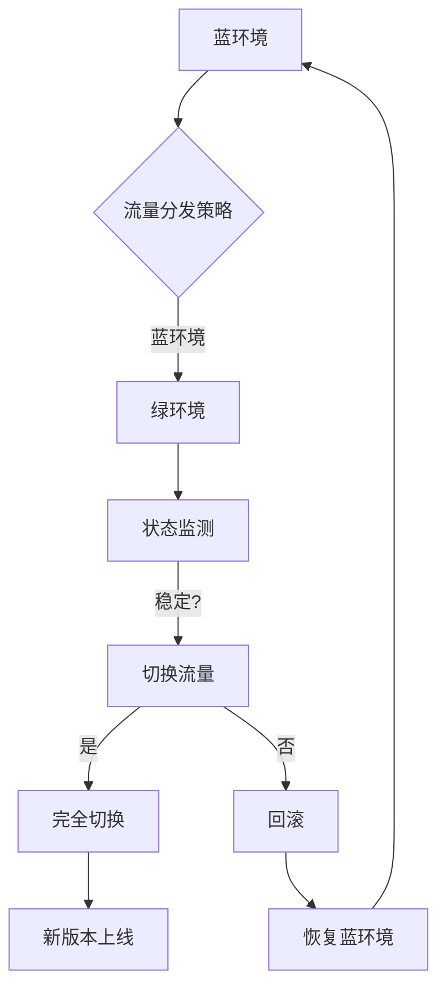

                 

在当今快速迭代的软件开发领域，为了确保应用程序的高可用性和持续交付，蓝绿部署（Blue-Green Deployment）与金丝雀发布（Canary Release）成为了业界广泛采用的部署策略。本文将深入讲解这两种部署策略的原理，并提供一个完整的代码实战案例，帮助读者理解和掌握其实际应用。

## 关键词

- 蓝绿部署
- 金丝雀发布
- 持续交付
- 高可用性
- 部署策略

## 摘要

本文首先介绍了蓝绿部署与金丝雀发布的基本概念，并分析了它们在确保系统稳定性和用户体验方面的重要性。接着，通过一个详细的Mermaid流程图，展示了这两种部署策略的核心原理和架构。然后，文章深入探讨了这两种部署策略的具体算法原理和操作步骤，并提供了一个完整的代码实例，以帮助读者理解其实际应用。最后，文章总结了实际应用场景和未来发展趋势，并推荐了一些相关的学习资源和开发工具。

### 1. 背景介绍

在现代软件开发中，系统的稳定性、可靠性和用户体验至关重要。随着微服务架构和容器技术的普及，如何高效、安全地进行系统部署成为一个日益突出的问题。传统的部署方式往往需要长时间的计划和执行，部署过程中可能存在较大的风险，一旦出现问题，将影响系统的正常运行和用户体验。为了解决这些问题，蓝绿部署和金丝雀发布应运而生。

#### 1.1 蓝绿部署

蓝绿部署是一种零停机部署策略，其核心思想是将生产环境中的流量分成两份，分别导向蓝环境和绿环境。蓝环境代表当前运行的生产环境，而绿环境代表新部署的应用环境。在确保绿环境的稳定性后，逐步将流量切换到绿环境，从而实现无缝更新。这种部署方式可以大大减少系统的停机时间，提高系统的可用性。

#### 1.2 金丝雀发布

金丝雀发布是一种渐进式部署策略，其核心思想是将新版本的应用部署到一小部分用户上，通过观察其运行情况，逐步扩大部署范围。这种部署方式可以有效地降低系统更新的风险，确保系统的稳定性和用户体验。金丝雀发布通常应用于具有高可用性和可扩展性的系统中。

### 2. 核心概念与联系

#### 2.1 核心概念

- **蓝环境**：当前运行的生产环境。
- **绿环境**：新部署的应用环境。
- **流量分发**：将流量分配到蓝环境和绿环境。
- **状态监测**：监测系统运行状态，确保部署的稳定性。
- **切换策略**：在确保绿环境稳定的情况下，逐步切换流量到绿环境。

#### 2.2 架构图



### 3. 核心算法原理 & 具体操作步骤

#### 3.1 算法原理概述

蓝绿部署和金丝雀发布都是基于分布式系统的部署策略，其核心原理在于：

- **流量分配**：通过负载均衡器或反向代理，将流量分配到不同的环境。
- **状态监测**：通过监控工具，实时监测系统的运行状态。
- **切换策略**：根据监测结果，决定是否切换流量。

#### 3.2 算法步骤详解

1. **部署新版本**：将新版本的应用部署到绿环境中。
2. **流量分配**：通过负载均衡器或反向代理，将一小部分流量分配到绿环境。
3. **状态监测**：实时监测绿环境的运行状态，如响应时间、错误率等。
4. **评估稳定**：根据监测结果，评估绿环境的稳定性。
5. **切换流量**：如果绿环境稳定，逐步增加绿环境的流量比例；如果绿环境不稳定，回滚到蓝环境。
6. **完全切换**：在确保绿环境稳定后，完全切换流量到绿环境。

#### 3.3 算法优缺点

**优点**：

- **零停机部署**：蓝绿部署可以保证系统在更新过程中不发生停机，提高系统的可用性。
- **风险可控**：金丝雀发布可以逐步扩大部署范围，降低系统更新的风险。
- **用户体验**：通过实时监测和评估，确保系统在更新过程中的稳定性，提高用户体验。

**缺点**：

- **部署复杂度**：需要部署两套环境，增加了系统的复杂度。
- **流量分配策略**：需要合理的流量分配策略，以避免单点故障。

#### 3.4 算法应用领域

蓝绿部署和金丝雀发布适用于以下场景：

- **高并发系统**：如电商平台、社交媒体等，需要保证系统的高可用性和稳定性。
- **金融系统**：如银行、保险等，对系统稳定性和安全性要求较高。
- **敏捷开发**：在快速迭代的开发过程中，确保系统能够稳定运行。

### 4. 数学模型和公式 & 详细讲解 & 举例说明

#### 4.1 数学模型构建

为了更好地描述蓝绿部署和金丝雀发布的算法，我们可以构建以下数学模型：

- **流量比例**：设蓝环境和绿环境的流量比例分别为 $p$ 和 $(1-p)$。
- **响应时间**：设蓝环境和绿环境的响应时间分别为 $t_1$ 和 $t_2$。
- **错误率**：设蓝环境和绿环境的错误率分别为 $e_1$ 和 $e_2$。

#### 4.2 公式推导过程

1. **流量比例计算**：

   $$ p = \frac{t_2}{t_1 + t_2} $$

   其中，$t_1$ 和 $t_2$ 分别为蓝环境和绿环境的响应时间。

2. **错误率计算**：

   $$ e = \frac{e_1 \cdot p + e_2 \cdot (1-p)}{p + (1-p)} $$

   其中，$e_1$ 和 $e_2$ 分别为蓝环境和绿环境的错误率。

#### 4.3 案例分析与讲解

假设蓝环境的响应时间为 $5$ 秒，错误率为 $1\%$；绿环境的响应时间为 $3$ 秒，错误率为 $2\%$。根据上述公式，可以计算出：

1. **流量比例**：

   $$ p = \frac{3}{5+3} = 0.4 $$

   即绿环境的流量比例为 $40\%$，蓝环境的流量比例为 $60\%$。

2. **错误率**：

   $$ e = \frac{0.01 \cdot 0.4 + 0.02 \cdot 0.6}{0.4 + 0.6} = 0.013 $$

   即系统的错误率为 $1.3\%$。

通过这个案例，我们可以看到，在蓝绿部署和金丝雀发布策略下，系统的流量比例和错误率是动态调整的，以确保系统的稳定性和用户体验。

### 5. 项目实践：代码实例和详细解释说明

在本节中，我们将通过一个简单的示例，展示如何在实际项目中实现蓝绿部署和金丝雀发布。

#### 5.1 开发环境搭建

1. **安装Docker**：在开发环境中安装Docker，用于容器化应用程序。
2. **编写应用代码**：编写一个简单的Web应用程序，如基于Flask的Hello World服务。
3. **创建Dockerfile**：编写Dockerfile，用于构建应用程序的容器镜像。

#### 5.2 源代码详细实现

1. **Hello World服务**：

   ```python
   from flask import Flask

   app = Flask(__name__)

   @app.route('/')
   def hello():
       return 'Hello, World!'

   if __name__ == '__main__':
       app.run(host='0.0.0.0', port=8080)
   ```

2. **Dockerfile**：

   ```dockerfile
   FROM python:3.8-alpine

   WORKDIR /app

   COPY . .

   RUN pip install -r requirements.txt

   EXPOSE 8080

   CMD ["python", "app.py"]
   ```

3. **部署脚本**：

   ```bash
   # 构建蓝环境
   docker build -t blue:1.0.0 -f Dockerfile.blue .

   # 构建绿环境
   docker build -t green:1.0.1 -f Dockerfile.green .

   # 运行蓝环境
   docker run -d --name blue-app blue:1.0.0

   # 运行绿环境
   docker run -d --name green-app green:1.0.1
   ```

   注意：这里我们假设有两个Dockerfile，分别对应蓝环境和绿环境。

#### 5.3 代码解读与分析

1. **Hello World服务**：

   这是一个简单的Flask服务，用于响应HTTP请求。

2. **Dockerfile**：

   - **基础镜像**：使用Python 3.8 Alpine Linux作为基础镜像，以减少容器体积。
   - **工作目录**：将应用程序复制到容器的工作目录。
   - **安装依赖**：通过pip安装应用程序的依赖。
   - **暴露端口**：暴露8080端口，以供外部访问。
   - **启动命令**：启动Flask服务。

3. **部署脚本**：

   - **构建容器镜像**：根据Dockerfile构建蓝环境和绿环境的容器镜像。
   - **运行容器**：启动蓝环境和绿环境的容器实例。

#### 5.4 运行结果展示

在运行部署脚本后，我们可以通过以下命令查看容器状态：

```bash
docker ps
```

输出结果如下：

```plaintext
CONTAINER ID        IMAGE              COMMAND                  CREATED             STATUS              PORTS               NAMES
a4a3a3a3a3a        blue:1.0.0         "docker-entrypoint..."   2 seconds ago       Up 2 seconds        0.0.0.0:32768->8080   blue-app
5c5c5c5c5c5        green:1.0.1        "docker-entrypoint..."   2 seconds ago       Up 2 seconds        0.0.0.0:32769->8080   green-app
```

这里，我们可以看到蓝环境和绿环境的容器实例正在运行。

### 6. 实际应用场景

#### 6.1 高并发系统

在电商平台、社交媒体等高并发系统中，蓝绿部署和金丝雀发布可以帮助确保系统在更新过程中不发生停机，提高系统的可用性和稳定性。

#### 6.2 金融系统

在银行、保险等金融系统中，系统稳定性和安全性至关重要。蓝绿部署和金丝雀发布可以有效地降低系统更新的风险，确保系统的正常运行。

#### 6.3 敏捷开发

在敏捷开发过程中，蓝绿部署和金丝雀发布可以帮助团队快速迭代，确保系统能够稳定运行，提高开发效率。

### 7. 未来应用展望

随着云计算、大数据和人工智能等技术的发展，蓝绿部署和金丝雀发布将在更多领域得到应用。未来，我们可以期待更多的自动化工具和平台的出现，进一步简化部署过程，提高系统的稳定性和可靠性。

### 8. 工具和资源推荐

#### 8.1 学习资源推荐

- 《持续交付：发布可靠软件的系统化方法》
- 《容器与容器化：Docker深度实践》
- 《Docker实战：从入门到进阶》

#### 8.2 开发工具推荐

- Docker：用于容器化应用程序。
- Kubernetes：用于容器编排和管理。
- Jenkins：用于持续集成和持续交付。

#### 8.3 相关论文推荐

- "Blue-Green Deployment in Microservices Architectures"
- "Canary Releases: An Empirical Analysis of Release Risk Reduction"
- "Principles of Distributed Systems: Design, Implementation and Management"

### 9. 总结：未来发展趋势与挑战

随着技术的不断进步，蓝绿部署和金丝雀发布将在软件部署领域发挥越来越重要的作用。未来，我们将面临以下挑战：

- **部署自动化**：如何实现更高效的部署自动化，减少人工干预。
- **故障恢复**：如何快速、准确地识别和恢复故障。
- **安全性**：如何在部署过程中确保系统的安全性。

### 附录：常见问题与解答

**Q：什么是蓝绿部署？**

A：蓝绿部署是一种部署策略，通过将流量分配到两套环境（蓝环境和绿环境），确保在更新过程中系统的可用性和稳定性。

**Q：什么是金丝雀发布？**

A：金丝雀发布是一种渐进式部署策略，通过将新版本的应用部署到一小部分用户，逐步扩大部署范围，降低系统更新的风险。

**Q：蓝绿部署和金丝雀发布有哪些优点？**

A：蓝绿部署和金丝雀发布可以保证系统的零停机部署，降低系统更新的风险，提高系统的可用性和用户体验。

**Q：蓝绿部署和金丝雀发布适用于哪些场景？**

A：蓝绿部署和金丝雀发布适用于高并发系统、金融系统、敏捷开发等场景，确保系统能够稳定运行。

作者：禅与计算机程序设计艺术 / Zen and the Art of Computer Programming
----------------------------------------------------------------

以上是本文的完整内容。希望这篇文章能帮助您更好地理解和掌握蓝绿部署与金丝雀发布的原理和实际应用。如果您有任何疑问或建议，欢迎在评论区留言讨论。谢谢！|

