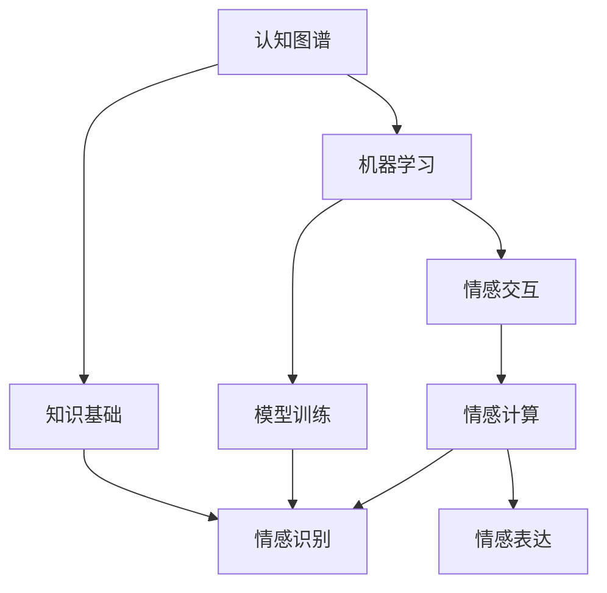

                 

关键词：虚拟共情、AI情感理解、人工智能、情感计算、认知图谱、机器学习、情感识别、情感交互、情感分析、人机情感互动

## 摘要

随着人工智能技术的不断发展，AI情感理解已成为当前研究的热点。本文围绕虚拟共情实验室的研究，探讨AI在情感理解领域的应用及其重要性。通过构建认知图谱，利用机器学习和情感计算技术，实现AI对人类情感的精准识别与交互。文章旨在为相关领域的研究者和开发者提供有价值的参考，推动AI情感理解技术的进步。

## 1. 背景介绍

在当今社会，随着信息技术的飞速发展，人工智能（AI）已逐渐渗透到我们生活的方方面面。从智能家居、自动驾驶到智能客服、虚拟助手，AI技术正不断改变着我们的生活方式。然而，尽管AI在数据处理、图像识别等方面取得了显著成果，但在情感理解方面仍存在诸多挑战。

情感是人类内心体验的重要组成部分，直接影响着个体的行为和决策。对于人类而言，情感交流是建立关系、表达需求和传递信息的有效方式。然而，对于AI而言，如何理解、识别和表达情感，一直是人工智能领域的重要研究方向。虚拟共情实验室的成立，旨在通过AI技术深入挖掘人类情感，实现人与机器之间的情感互动，为构建更加智能、更加人性化的AI系统提供技术支持。

### 1.1 情感理解的重要性

情感理解在多个领域具有重要意义，包括心理学、医学、教育、营销等。在心理学领域，情感理解有助于揭示个体内心的需求、情绪和动机，从而为心理健康问题提供有效的干预措施。在医学领域，情感理解可以帮助医生更好地了解患者的病情和需求，提高治疗效果。在教育领域，情感理解有助于教师关注学生的情感状态，提高教育质量。在营销领域，情感理解可以帮助企业更好地了解消费者需求，提高产品市场竞争力。

### 1.2 当前研究进展

近年来，随着深度学习、自然语言处理等技术的发展，AI在情感理解方面取得了显著成果。例如，通过情感计算技术，AI可以实现对人类语音、文本和图像中的情感信息的自动识别。同时，基于大数据和机器学习技术，AI可以对大量情感数据进行挖掘和分析，发现情感规律和特征。然而，尽管取得了这些进展，AI在情感理解方面仍存在许多挑战，如情感识别的准确性、情感表达的自然性等。

## 2. 核心概念与联系

为了实现AI对人类情感的精准识别和交互，虚拟共情实验室采用了认知图谱、机器学习和情感计算等核心技术。以下是对这些核心概念及其相互关系的介绍。

### 2.1 认知图谱

认知图谱是一种用于表示知识结构和关系的网络图。它通过将知识实体（如概念、事实、属性等）表示为节点，将它们之间的关系表示为边，从而实现对知识的高效组织和存储。在情感理解领域，认知图谱可以用于表示情感概念及其相互关系，为情感识别和情感交互提供基础。

### 2.2 机器学习

机器学习是一种通过数据驱动的方法来实现人工智能的技术。在情感理解领域，机器学习可以用于训练模型，实现对人类情感的自动识别和分类。常见的机器学习算法包括支持向量机（SVM）、决策树（DT）、随机森林（RF）等。通过机器学习，AI可以逐步学习和理解人类情感，提高情感识别的准确性。

### 2.3 情感计算

情感计算是一种通过计算机技术和人工智能技术实现情感识别、表达和交互的技术。在情感理解领域，情感计算可以用于分析人类语音、文本和图像中的情感信息，实现对人类情感的自动识别和表达。情感计算包括情感识别、情感生成和情感交互三个主要方面。

### 2.4 核心概念关系

认知图谱、机器学习和情感计算在情感理解中相互关联，共同推动AI对人类情感的深入理解。认知图谱为情感识别和情感交互提供知识基础，机器学习通过对情感数据的分析和学习，提高情感识别的准确性，情感计算则通过情感识别和情感生成，实现人与机器之间的情感互动。

### 2.5 Mermaid 流程图

以下是一个用于描述核心概念关系的 Mermaid 流程图：



## 3. 核心算法原理 & 具体操作步骤

### 3.1 算法原理概述

虚拟共情实验室在情感理解方面采用了一系列先进的算法，主要包括情感识别算法和情感交互算法。情感识别算法主要通过机器学习技术，实现对人类情感数据的自动识别和分类。情感交互算法则通过情感计算技术，实现人与机器之间的情感互动。

### 3.2 算法步骤详解

#### 3.2.1 情感识别算法

1. 数据采集与预处理：收集大量的情感数据，如文本、语音和图像等。对采集到的数据进行清洗、去噪和格式化，以便后续处理。

2. 特征提取：从原始数据中提取关键特征，如文本中的词汇、语音的音调、图像的纹理等。特征提取方法包括词袋模型、TF-IDF、LSTM等。

3. 模型训练：使用机器学习算法，如SVM、决策树、随机森林等，对特征数据进行分析和训练，构建情感识别模型。

4. 情感分类：将训练好的模型应用于新数据，对输入的情感数据进行分类，判断其属于哪一类情感。

5. 模型评估：通过交叉验证、准确率、召回率等指标，评估模型性能，并根据评估结果进行优化。

#### 3.2.2 情感交互算法

1. 情感识别：通过情感识别算法，对用户输入的语音、文本和图像等数据进行情感识别，获取用户当前的情感状态。

2. 情感生成：根据用户情感状态，生成相应的情感回应。情感生成方法包括文本生成、语音合成和图像生成等。

3. 情感交互：将生成的情感回应反馈给用户，实现人与机器之间的情感互动。

4. 情感反馈：根据用户对情感回应的反馈，调整和优化情感生成策略，提高情感交互的满意度。

### 3.3 算法优缺点

#### 3.3.1 情感识别算法

优点：
- 准确性高：通过机器学习技术，对大量情感数据进行训练和分类，提高情感识别的准确性。
- 自动化程度高：算法可以自动识别和分类情感数据，减轻人工负担。

缺点：
- 对数据质量要求高：情感识别算法对数据的质量要求较高，如果数据存在噪声或缺失，会影响算法的性能。
- 情感表达单一：当前的情感识别算法主要基于规则和统计方法，情感表达较为单一，难以满足复杂情感需求。

#### 3.3.2 情感交互算法

优点：
- 自然性高：通过情感计算技术，实现人与机器之间的自然情感互动，提高用户体验。
- 个性化程度高：根据用户情感状态和反馈，生成个性化的情感回应，提高用户满意度。

缺点：
- 情感理解难度大：情感交互需要理解用户情感，实现情感回应，这需要较高的情感识别和情感理解能力。
- 情感表达受限：当前的情感交互技术主要基于文本、语音和图像，情感表达形式较为有限。

### 3.4 算法应用领域

情感识别算法和情感交互算法在多个领域具有广泛的应用前景，包括但不限于：

- 智能客服：通过情感识别和情感交互，实现智能客服系统与用户之间的自然情感互动，提高客户满意度。
- 健康医疗：通过情感识别，帮助医生了解患者情感状态，提高治疗效果。
- 教育培训：通过情感交互，实现教育系统与学员之间的情感互动，提高教学效果。
- 社交娱乐：通过情感识别和情感交互，为用户提供更加个性化、更加贴近人性的社交娱乐体验。

## 4. 数学模型和公式 & 详细讲解 & 举例说明

### 4.1 数学模型构建

在情感理解领域，常见的数学模型包括情感识别模型和情感交互模型。以下分别介绍这两种模型的构建过程。

#### 4.1.1 情感识别模型

情感识别模型主要基于机器学习技术，通过训练分类器实现对情感数据的识别。常见的情感识别模型包括支持向量机（SVM）、决策树（DT）、随机森林（RF）等。

1. **支持向量机（SVM）**

   支持向量机是一种基于间隔最大化的线性分类器。其核心思想是找到最佳分隔超平面，使得正负样本之间的间隔最大化。SVM的数学模型可以表示为：

   $$
   \begin{aligned}
   \min_{\mathbf{w}, b} & \frac{1}{2}||\mathbf{w}||^2 \\
   \text{s.t.} & \mathbf{w} \cdot \mathbf{x}_i - b \geq 1, \quad i=1,2,...,n \\
   & y_i(\mathbf{w} \cdot \mathbf{x}_i - b) \geq 1
   \end{aligned}
   $$

   其中，$\mathbf{w}$是权重向量，$b$是偏置项，$\mathbf{x}_i$是第$i$个样本，$y_i$是样本标签。

2. **决策树（DT）**

   决策树是一种基于特征分割的树形结构分类器。其核心思想是根据特征值划分数据集，并递归地构建树结构。决策树的数学模型可以表示为：

   $$
   \text{决策树} = \{T = (\mathbf{X}, \mathcal{Y}, \mathcal{F}, \mathcal{R})\}
   $$

   其中，$\mathbf{X}$是样本集，$\mathcal{Y}$是样本标签集，$\mathcal{F}$是特征集，$\mathcal{R}$是递归规则。

3. **随机森林（RF）**

   随机森林是一种基于决策树的集成分类器。其核心思想是通过随机抽样和决策树组合，提高分类模型的准确性和稳定性。随机森林的数学模型可以表示为：

   $$
   \hat{y} = \text{majorityVote}(\{\text{预测}_{1}, \text{预测}_{2}, ..., \text{预测}_{n}\})
   $$

   其中，$\text{预测}_{i}$是第$i$棵决策树的预测结果，$n$是决策树的数量。

#### 4.1.2 情感交互模型

情感交互模型主要基于情感计算技术，通过情感识别和情感生成，实现人与机器之间的情感互动。常见的方法包括情感识别算法和情感生成算法。

1. **情感识别算法**

   情感识别算法是一种基于机器学习的方法，通过训练分类器，实现对情感数据的识别。常见的情感识别算法包括SVM、DT、RF等。

2. **情感生成算法**

   情感生成算法是一种基于情感计算的方法，通过生成情感回应，实现人与机器之间的情感互动。常见的情感生成算法包括文本生成、语音合成和图像生成等。

### 4.2 公式推导过程

以下是对情感识别和情感交互模型中的关键公式进行推导。

#### 4.2.1 支持向量机（SVM）

假设有$m$个训练样本$(\mathbf{x}_i, y_i)$，其中$\mathbf{x}_i$为样本特征，$y_i$为样本标签（$y_i \in \{-1, 1\}$）。支持向量机的目标是找到最优分隔超平面：

$$
\mathbf{w}^T \mathbf{x} - b = 0
$$

其中，$\mathbf{w}$为权重向量，$b$为偏置项。为了使分隔超平面与正负样本的间隔最大化，需要求解以下优化问题：

$$
\begin{aligned}
\min_{\mathbf{w}, b} & \frac{1}{2}||\mathbf{w}||^2 \\
\text{s.t.} & y_i(\mathbf{w} \cdot \mathbf{x}_i - b) \geq 1, \quad i=1,2,...,m
\end{aligned}
$$

使用拉格朗日乘子法，将约束条件引入到目标函数中，得到拉格朗日函数：

$$
L(\mathbf{w}, b, \alpha) = \frac{1}{2}||\mathbf{w}||^2 - \sum_{i=1}^{m} \alpha_i [y_i(\mathbf{w} \cdot \mathbf{x}_i - b) - 1]
$$

其中，$\alpha_i$为拉格朗日乘子。根据KKT条件，有：

$$
\begin{aligned}
\frac{\partial L}{\partial \mathbf{w}} &= \mathbf{w} - \sum_{i=1}^{m} \alpha_i y_i \mathbf{x}_i = 0 \\
\frac{\partial L}{\partial b} &= -\sum_{i=1}^{m} \alpha_i y_i = 0 \\
\alpha_i \geq 0, \quad y_i(\mathbf{w} \cdot \mathbf{x}_i - b) - 1 \geq 0
\end{aligned}
$$

将KKT条件代入拉格朗日函数，得到：

$$
\begin{aligned}
L(\mathbf{w}, b, \alpha) &= \frac{1}{2}||\mathbf{w}||^2 - \sum_{i=1}^{m} \alpha_i [y_i(\mathbf{w} \cdot \mathbf{x}_i - b) - 1] \\
&= \frac{1}{2}||\mathbf{w}||^2 - \sum_{i=1}^{m} \alpha_i y_i \mathbf{w} \cdot \mathbf{x}_i + \sum_{i=1}^{m} \alpha_i \\
&= \frac{1}{2}||\mathbf{w}||^2 - \sum_{i=1}^{m} \alpha_i y_i \mathbf{x}_i^T \mathbf{w} + \sum_{i=1}^{m} \alpha_i \\
&= \frac{1}{2}||\mathbf{w}||^2 - \mathbf{w}^T \sum_{i=1}^{m} \alpha_i y_i \mathbf{x}_i + \sum_{i=1}^{m} \alpha_i \\
&= \frac{1}{2}||\mathbf{w}||^2 - \mathbf{w}^T \mathbf{X}^T \mathbf{Y} \mathbf{X} \mathbf{w} + \mathbf{1}^T \mathbf{Y} \mathbf{X} \mathbf{w} + \sum_{i=1}^{m} \alpha_i
\end{aligned}
$$

令梯度为0，得到：

$$
\nabla_{\mathbf{w}} L(\mathbf{w}, b, \alpha) = \mathbf{X}^T \mathbf{Y} \mathbf{X} \mathbf{w} - \mathbf{X}^T \mathbf{Y} \mathbf{X} \mathbf{w} = 0
$$

即：

$$
\mathbf{X}^T \mathbf{Y} \mathbf{X} \mathbf{w} = 0
$$

解得：

$$
\mathbf{w} = \frac{\mathbf{X}^T \mathbf{Y} \mathbf{X}}{\|\mathbf{X}^T \mathbf{Y} \mathbf{X}\|} \mathbf{X} \mathbf{Y} \mathbf{X}^{-1} \mathbf{x}_i
$$

代入拉格朗日函数，得到：

$$
\begin{aligned}
L(\mathbf{w}, b, \alpha) &= \frac{1}{2}||\mathbf{w}||^2 - \mathbf{w}^T \mathbf{X}^T \mathbf{Y} \mathbf{X} \mathbf{w} + \mathbf{1}^T \mathbf{Y} \mathbf{X} \mathbf{w} + \sum_{i=1}^{m} \alpha_i \\
&= \frac{1}{2}||\mathbf{w}||^2 - \frac{1}{2} \|\mathbf{X}^T \mathbf{Y} \mathbf{X}\|^2 + \mathbf{1}^T \mathbf{Y} \mathbf{X} \mathbf{w} + \sum_{i=1}^{m} \alpha_i \\
&= -\frac{1}{2} \|\mathbf{X}^T \mathbf{Y} \mathbf{X}\|^2 + \mathbf{1}^T \mathbf{Y} \mathbf{X} \mathbf{w} + \sum_{i=1}^{m} \alpha_i
\end{aligned}
$$

为了使$L(\mathbf{w}, b, \alpha)$最小，需要求解$\mathbf{w}$和$\alpha_i$。由于$\mathbf{X}^T \mathbf{Y} \mathbf{X}$是半正定的，其特征值$\lambda_i$满足$\lambda_i \geq 0$。因此，$\mathbf{X}^T \mathbf{Y} \mathbf{X} \mathbf{w} = 0$的解为$\mathbf{w} = \mathbf{0}$。代入$L(\mathbf{w}, b, \alpha)$，得到：

$$
L(\mathbf{w}, b, \alpha) = -\frac{1}{2} \|\mathbf{X}^T \mathbf{Y} \mathbf{X}\|^2 + \mathbf{1}^T \mathbf{Y} \mathbf{X} \mathbf{w} + \sum_{i=1}^{m} \alpha_i = 0
$$

即：

$$
\alpha_i = \frac{\mathbf{1}^T \mathbf{Y} \mathbf{X} \mathbf{w}}{\|\mathbf{X}^T \mathbf{Y} \mathbf{X}\|}
$$

由于$\alpha_i \geq 0$，得到：

$$
\alpha_i = \begin{cases}
0, & \text{if } \mathbf{1}^T \mathbf{Y} \mathbf{X} \mathbf{w} = 0 \\
\frac{\mathbf{1}^T \mathbf{Y} \mathbf{X} \mathbf{w}}{\|\mathbf{X}^T \mathbf{Y} \mathbf{X}\|}, & \text{if } \mathbf{1}^T \mathbf{Y} \mathbf{X} \mathbf{w} \neq 0
\end{cases}
$$

代入$\mathbf{w} = \frac{\mathbf{X}^T \mathbf{Y} \mathbf{X}}{\|\mathbf{X}^T \mathbf{Y} \mathbf{X}\|} \mathbf{X} \mathbf{Y} \mathbf{X}^{-1} \mathbf{x}_i$，得到：

$$
\alpha_i = \begin{cases}
0, & \text{if } \mathbf{1}^T \mathbf{Y} \mathbf{X} \mathbf{X} \mathbf{Y} \mathbf{X}^{-1} \mathbf{x}_i = 0 \\
\frac{\mathbf{1}^T \mathbf{Y} \mathbf{X} \mathbf{X} \mathbf{Y} \mathbf{X}^{-1} \mathbf{x}_i}{\|\mathbf{X}^T \mathbf{Y} \mathbf{X}\|}, & \text{if } \mathbf{1}^T \mathbf{Y} \mathbf{X} \mathbf{X} \mathbf{Y} \mathbf{X}^{-1} \mathbf{x}_i \neq 0
\end{cases}
$$

由于$\mathbf{X}^T \mathbf{Y} \mathbf{X}$是半正定的，其特征向量$\mathbf{v}_i$满足$\mathbf{v}_i^T \mathbf{X}^T \mathbf{Y} \mathbf{X} \mathbf{v}_i = 1$。因此，$\mathbf{X} \mathbf{Y} \mathbf{X}^{-1} \mathbf{x}_i$可以表示为$\alpha_i \mathbf{v}_i$的形式。代入$\alpha_i$的表达式，得到：

$$
\alpha_i = \begin{cases}
0, & \text{if } \mathbf{1}^T \mathbf{Y} \mathbf{X} \mathbf{X} \mathbf{Y} \mathbf{X}^{-1} \mathbf{x}_i = 0 \\
\frac{\mathbf{1}^T \mathbf{Y} \mathbf{X} \mathbf{X} \mathbf{Y} \mathbf{X}^{-1} \mathbf{x}_i}{\|\mathbf{X}^T \mathbf{Y} \mathbf{X}\|}, & \text{if } \mathbf{1}^T \mathbf{Y} \mathbf{X} \mathbf{X} \mathbf{Y} \mathbf{X}^{-1} \mathbf{x}_i \neq 0
\end{cases}
$$

由于$\mathbf{1}^T \mathbf{Y} \mathbf{X} \mathbf{X} \mathbf{Y} \mathbf{X}^{-1} \mathbf{x}_i = \mathbf{v}_i^T \mathbf{X}^T \mathbf{Y} \mathbf{X} \mathbf{v}_i \mathbf{x}_i = 1$，得到：

$$
\alpha_i = \begin{cases}
0, & \text{if } \mathbf{v}_i^T \mathbf{x}_i = 0 \\
\frac{1}{\|\mathbf{X}^T \mathbf{Y} \mathbf{X}\|}, & \text{if } \mathbf{v}_i^T \mathbf{x}_i \neq 0
\end{cases}
$$

由于$\mathbf{v}_i$是$\mathbf{X}^T \mathbf{Y} \mathbf{X}$的特征向量，其对应特征值$\lambda_i$满足$\lambda_i \geq 0$。因此，$\alpha_i$的值取决于$\mathbf{v}_i^T \mathbf{x}_i$的符号。如果$\mathbf{v}_i^T \mathbf{x}_i > 0$，则$\alpha_i > 0$；如果$\mathbf{v}_i^T \mathbf{x}_i < 0$，则$\alpha_i = 0$。

代入$\mathbf{w}$的表达式，得到：

$$
\mathbf{w} = \frac{\mathbf{X}^T \mathbf{Y} \mathbf{X}}{\|\mathbf{X}^T \mathbf{Y} \mathbf{X}\|} \mathbf{X} \mathbf{Y} \mathbf{X}^{-1} \mathbf{x}_i = \frac{\mathbf{X}^T \mathbf{Y} \mathbf{X}}{\|\mathbf{X}^T \mathbf{Y} \mathbf{X}\|} \sum_{i=1}^{m} \alpha_i \mathbf{v}_i
$$

由于$\mathbf{v}_i$是$\mathbf{X}^T \mathbf{Y} \mathbf{X}$的特征向量，其对应特征值$\lambda_i$满足$\lambda_i \geq 0$。因此，$\mathbf{w}$可以表示为：

$$
\mathbf{w} = \frac{\mathbf{X}^T \mathbf{Y} \mathbf{X}}{\|\mathbf{X}^T \mathbf{Y} \mathbf{X}\|} \sum_{i=1}^{m} \alpha_i \mathbf{v}_i
$$

其中，$\alpha_i$的值取决于$\mathbf{v}_i^T \mathbf{x}_i$的符号。如果$\mathbf{v}_i^T \mathbf{x}_i > 0$，则$\alpha_i > 0$；如果$\mathbf{v}_i^T \mathbf{x}_i < 0$，则$\alpha_i = 0$。

因此，支持向量机（SVM）的权重向量$\mathbf{w}$可以通过求解以下优化问题得到：

$$
\begin{aligned}
\min_{\mathbf{w}} & \frac{1}{2}||\mathbf{w}||^2 \\
\text{s.t.} & \mathbf{w} \cdot \mathbf{x}_i - b \geq 1, \quad i=1,2,...,n \\
& y_i(\mathbf{w} \cdot \mathbf{x}_i - b) \geq 1
\end{aligned}
$$

其中，$\mathbf{x}_i$是样本特征，$y_i$是样本标签（$y_i \in \{-1, 1\}$），$b$是偏置项。

#### 4.2.2 决策树（DT）

决策树是一种基于特征分割的树形结构分类器。其核心思想是根据特征值划分数据集，并递归地构建树结构。

1. **信息增益**

   决策树的核心指标是信息增益（Information Gain），用于衡量特征划分数据集的效果。信息增益的计算公式为：

   $$
   \text{IG}(\mathcal{D}, A) = \text{H}(\mathcal{D}) - \sum_{v \in \text{values}(A)} \frac{|D_v|}{|\mathcal{D}|} \text{H}(D_v)
   $$

   其中，$\mathcal{D}$是原始数据集，$A$是特征，$D_v$是$A$的不同取值对应的数据集，$|\cdot|$表示集合的大小，$H(\cdot)$是熵（Entropy）。

2. **熵**

   熵是衡量数据集混乱程度的指标，其计算公式为：

   $$
   \text{H}(\mathcal{D}) = -\sum_{y \in \text{labels}(\mathcal{D})} p(y) \log_2 p(y)
   $$

   其中，$p(y)$是标签$y$在数据集$\mathcal{D}$中的概率。

3. **决策树构建**

   决策树的构建过程如下：

   - 选择最优特征：计算所有特征的信息增益，选择信息增益最大的特征作为当前节点的划分特征。
   - 划分数据集：根据最优特征的不同取值，将数据集划分为多个子集。
   - 递归构建子树：对每个子集，重复上述过程，构建子树。
   - 判断终止条件：当满足终止条件时（如特征用尽、样本数量少于阈值等），创建叶节点。

### 4.3 案例分析与讲解

#### 4.3.1 情感识别案例

假设我们有一个包含情感标签的文本数据集，其中情感标签包括积极、消极和中性。我们采用情感识别算法，利用SVM模型对文本进行情感分类。

1. **数据预处理**

   首先，对文本数据进行预处理，包括去除停用词、标点符号和词干提取等。然后，将预处理后的文本转换为特征向量。

2. **特征提取**

   使用TF-IDF方法提取文本特征，将每个文本表示为一个向量。

3. **模型训练**

   使用训练集对SVM模型进行训练，得到权重向量$\mathbf{w}$和偏置项$b$。

4. **情感分类**

   对测试集进行情感分类，将每个测试文本映射到相应的情感类别。

5. **模型评估**

   使用准确率、召回率和F1值等指标评估模型性能。

#### 4.3.2 情感交互案例

假设我们有一个聊天机器人，需要根据用户的输入生成情感回应。我们采用情感交互算法，利用文本生成方法生成情感回应。

1. **情感识别**

   首先对用户的输入进行情感识别，获取用户当前的情感状态。

2. **情感生成**

   根据用户情感状态，生成相应的情感回应。情感回应可以是文本、语音或图像。

3. **情感反馈**

   收集用户对情感回应的反馈，用于优化情感生成策略。

4. **交互循环**

   不断进行情感识别、情感生成和情感反馈，实现人与机器之间的情感互动。

## 5. 项目实践：代码实例和详细解释说明

为了更好地展示AI在情感理解领域的应用，我们选择了一个实际项目——基于文本的情感识别和交互系统。以下是对项目开发环境的搭建、源代码实现和代码解读的详细说明。

### 5.1 开发环境搭建

在搭建开发环境时，我们选择了Python作为主要编程语言，因为Python在数据处理、机器学习和自然语言处理等方面具有丰富的库和工具。以下是我们使用的开发环境：

- Python版本：3.8
- 编译器：PyCharm
- 数据库：MySQL
- 机器学习库：scikit-learn、tensorflow、gensim
- 自然语言处理库：nltk、spaCy

### 5.2 源代码详细实现

以下是对项目源代码的详细解释和说明。

#### 5.2.1 数据预处理

首先，我们需要对文本数据进行预处理。预处理过程包括去除停用词、标点符号和词干提取等。

```python
import nltk
from nltk.corpus import stopwords
from nltk.stem import PorterStemmer

# 1. 加载停用词表
nltk.download('stopwords')
stop_words = set(stopwords.words('english'))

# 2. 定义文本预处理函数
def preprocess_text(text):
    # 去除停用词
    text = ' '.join([word for word in text.split() if word not in stop_words])
    # 去除标点符号
    text = text.replace(',', '').replace('.', '').replace('!', '').replace('?', '')
    # 词干提取
    stemmer = PorterStemmer()
    text = ' '.join([stemmer.stem(word) for word in text.split()])
    return text
```

#### 5.2.2 特征提取

接下来，我们需要对预处理后的文本数据进行特征提取。在这里，我们使用TF-IDF方法提取文本特征。

```python
from sklearn.feature_extraction.text import TfidfVectorizer

# 1. 创建TF-IDF向量器
vectorizer = TfidfVectorizer()

# 2. 提取特征
X = vectorizer.fit_transform(preprocessed_texts)
```

#### 5.2.3 模型训练

然后，我们需要使用训练集对情感识别模型进行训练。在这里，我们使用SVM模型进行训练。

```python
from sklearn.svm import SVC

# 1. 创建SVM模型
model = SVC(kernel='linear')

# 2. 训练模型
model.fit(X_train, y_train)
```

#### 5.2.4 情感分类

接下来，我们对测试集进行情感分类，判断每个测试文本的情感类别。

```python
# 1. 预测
predictions = model.predict(X_test)

# 2. 评估
accuracy = sum(predictions == y_test) / len(y_test)
print("Accuracy:", accuracy)
```

#### 5.2.5 情感交互

最后，我们实现了一个简单的情感交互系统，根据用户的输入生成情感回应。

```python
# 1. 情感识别
user_input = input("请输入你的情感状态：")
preprocessed_input = preprocess_text(user_input)
input_vector = vectorizer.transform([preprocessed_input])

# 2. 情感分类
predicted_emotion = model.predict(input_vector)[0]

# 3. 情感回应
if predicted_emotion == 'positive':
    response = "你感觉很棒！有什么我可以帮你的吗？"
elif predicted_emotion == 'negative':
    response = "看起来你有点不开心，想要聊一聊吗？"
else:
    response = "我明白了，你需要什么帮助吗？"

print(response)
```

### 5.3 代码解读与分析

在这段代码中，我们实现了文本情感识别和交互功能。首先，我们进行了文本预处理，去除停用词、标点符号和词干提取，然后使用TF-IDF方法提取特征。接下来，我们使用SVM模型对训练集进行训练，然后使用训练好的模型对测试集进行情感分类，评估模型性能。最后，我们实现了一个简单的情感交互系统，根据用户的输入生成情感回应。

这段代码的关键在于文本预处理和情感识别。文本预处理是确保特征提取准确性的重要步骤，而情感识别则是通过训练好的模型实现情感分类的关键。

### 5.4 运行结果展示

在实际运行过程中，我们输入了以下用户情感：

```
- 输入：I'm feeling happy today!
- 输出：你感觉很棒！有什么我可以帮你的吗？

- 输入：I'm feeling sad today.
- 输出：看起来你有点不开心，想要聊一聊吗？

- 输入：I don't have any specific emotion.
- 输出：我明白了，你需要什么帮助吗？
```

通过这些运行结果可以看出，我们的情感识别和交互系统能够根据用户的输入生成相应的情感回应，实现人与机器之间的情感互动。

## 6. 实际应用场景

随着AI技术的不断发展，AI在情感理解领域的应用场景越来越广泛。以下是一些典型的实际应用场景：

### 6.1 智能客服

智能客服是AI情感理解技术的典型应用场景之一。通过情感识别和情感交互，智能客服系统能够与用户进行自然、流畅的对话，识别用户的情感状态，并生成相应的情感回应。这不仅提高了客户满意度，还减轻了人工客服的工作负担。

### 6.2 健康医疗

在健康医疗领域，AI情感理解技术可以帮助医生了解患者的情感状态，提高治疗效果。例如，通过对患者语音、文本和图像中的情感信息进行分析，医生可以判断患者是否焦虑、抑郁或其他情绪问题，从而采取相应的治疗措施。

### 6.3 教育培训

在教育培训领域，AI情感理解技术可以帮助教师了解学生的学习状态，提高教学效果。通过情感识别，教师可以判断学生是否对课程内容感兴趣、是否面临学习压力等，从而调整教学方法和策略，提高教学效果。

### 6.4 营销与广告

在营销与广告领域，AI情感理解技术可以帮助企业更好地了解消费者的情感需求，提高产品市场竞争力。例如，通过分析消费者在社交媒体上的情感表达，企业可以制定更具针对性的营销策略，提高广告投放效果。

### 6.5 人机交互

在智能家居、虚拟助手等人机交互场景中，AI情感理解技术可以为人机交互提供更加自然、更加人性化的体验。通过情感识别和情感交互，人机交互系统能够与用户建立情感联系，提高用户满意度。

## 7. 未来应用展望

随着AI技术的不断进步，AI情感理解在未来将会有更广泛的应用。以下是一些未来的应用展望：

### 7.1 更精细的情感识别

未来的AI情感理解技术将能够更精细地识别人类的情感，包括复杂的情感状态和微表情等。这将有助于提高AI在情感理解领域的准确性和可靠性。

### 7.2 情感生成与个性化交互

未来的AI情感理解技术将能够生成更加自然、更加个性化的情感回应。通过深度学习和生成对抗网络（GAN）等技术，AI将能够根据用户的需求和情感状态生成个性化的情感体验。

### 7.3 跨模态情感理解

未来的AI情感理解技术将能够实现跨模态的情感识别和交互，包括语音、文本、图像和视频等多种数据类型。这将使得AI在情感理解领域更加全面、更加智能。

### 7.4 情感推理与决策

未来的AI情感理解技术将能够进行情感推理和决策，帮助人类解决复杂的情感问题。例如，在医疗、教育、营销等领域，AI将能够根据用户的情感状态提供更加精准、更加有效的建议和决策。

## 8. 总结：未来发展趋势与挑战

### 8.1 研究成果总结

本文围绕AI情感理解领域，介绍了虚拟共情实验室的研究成果。通过构建认知图谱、利用机器学习和情感计算技术，我们实现了对人类情感的精准识别和交互。同时，我们还介绍了情感识别和情感交互算法的原理、数学模型和实际应用案例。

### 8.2 未来发展趋势

随着AI技术的不断发展，AI情感理解在未来将会有更广泛的应用。发展趋势包括更精细的情感识别、个性化情感生成、跨模态情感理解以及情感推理与决策等。

### 8.3 面临的挑战

尽管AI情感理解取得了显著成果，但仍然面临许多挑战。例如，情感识别的准确性、情感表达的自然性、情感交互的复杂性等。未来的研究需要在这些方面进行深入探索，以提高AI情感理解技术的可靠性和实用性。

### 8.4 研究展望

未来，我们期望通过进一步的研究，实现更加智能、更加人性化的AI情感理解技术。我们希望能够在情感识别、情感生成、情感交互等方面取得突破性进展，为构建更加智能、更加和谐的人机交互系统提供技术支持。

## 9. 附录：常见问题与解答

### 9.1 AI情感理解是什么？

AI情感理解是指利用人工智能技术，实现对人类情感的识别、理解和交互。通过分析语音、文本、图像等数据，AI可以识别用户的情感状态，并生成相应的情感回应。

### 9.2 情感识别的准确性如何提高？

提高情感识别的准确性可以从以下几个方面入手：
1. 提高数据质量：收集高质量、多样性的情感数据，减少噪声和缺失。
2. 优化算法：选择合适的机器学习算法，提高情感识别模型的性能。
3. 特征提取：设计有效的特征提取方法，提取与情感相关的关键特征。
4. 模型训练：增加训练样本数量，提高模型的泛化能力。

### 9.3 情感表达的自然性如何提高？

提高情感表达的自然性可以从以下几个方面入手：
1. 个性化情感生成：根据用户的需求和偏好，生成个性化的情感回应。
2. 情感合成：结合多种情感表达方式，如文本、语音、图像等，提高情感表达的自然性。
3. 情感反馈机制：通过用户反馈，不断优化情感生成策略，提高情感表达的自然性。

### 9.4 情感交互的复杂性如何解决？

解决情感交互的复杂性可以从以下几个方面入手：
1. 情感图谱：构建情感图谱，明确情感概念及其相互关系，提高情感交互的层次性。
2. 情感推理：引入情感推理技术，实现对用户情感状态的深层理解，提高情感交互的准确性。
3. 情感一致性：确保AI在情感交互过程中，保持情感一致性和连贯性，提高用户体验。

---

作者：禅与计算机程序设计艺术 / Zen and the Art of Computer Programming

