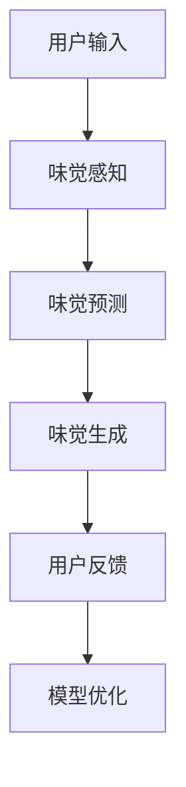

                 

关键词：虚拟味觉、人工智能、味蕾体验、艺术创作、神经网络、自然语言处理

> 摘要：本文探讨了人工智能在虚拟味觉艺术领域的应用，通过介绍相关核心概念、算法原理和具体操作步骤，展示了如何利用AI技术创造具有真实感的味觉体验，并对该领域的未来发展趋势与挑战进行了展望。

## 1. 背景介绍

### 味觉艺术的历史与发展

味觉艺术的历史可以追溯到古代，当时人们通过调配不同的香料和食材来创造独特的味觉体验。随着科技的进步，味觉艺术逐渐与现代科技相结合，如电子烹饪设备、3D打印食物等。然而，这些技术仍然受限于物理世界的限制，无法完全模拟人类味觉的感受。

### 人工智能在味觉艺术中的应用

近年来，人工智能（AI）技术的发展为味觉艺术带来了新的可能性。通过机器学习和神经网络技术，AI能够分析和处理大量味觉数据，从而创造出新的味觉体验。虚拟味觉艺术的研究不仅能够为食品行业带来创新，还能够为人们提供更加丰富的味觉体验。

### 虚拟味觉艺术的定义

虚拟味觉艺术是指利用人工智能技术模拟和创造味觉体验的过程。它包括味觉感知、味觉预测、味觉生成等环节，旨在为用户提供一种超越现实世界的味觉体验。

## 2. 核心概念与联系

### 人工智能与味觉感知

人工智能在味觉感知方面发挥着重要作用。通过机器学习和神经网络技术，AI可以识别和分类各种味觉信号，如甜、酸、苦、咸、鲜等。这些信号被转化为数字信号，供AI进行分析和处理。

### 味觉预测与生成

基于味觉感知的结果，AI可以预测食物的口感和味道。通过训练大量的味觉数据，AI能够学习到不同食材和调味料的组合效果，从而生成新的味觉体验。这些预测和生成过程依赖于深度学习和生成对抗网络（GAN）等技术。

### 味觉体验的反馈与优化

在虚拟味觉艺术中，用户的反馈至关重要。通过用户对味觉体验的反馈，AI可以不断优化和调整味觉生成模型，以提供更加个性化的味觉体验。这种反馈机制使得虚拟味觉艺术能够不断进化和发展。

### Mermaid 流程图



## 3. 核心算法原理 & 具体操作步骤

### 3.1 算法原理概述

虚拟味觉艺术的算法原理主要基于深度学习和生成对抗网络（GAN）。深度学习用于分析和处理味觉数据，生成对抗网络则用于创造新的味觉体验。

### 3.2 算法步骤详解

#### 3.2.1 数据收集与预处理

首先，收集大量的味觉数据，包括各种食材、调味料、口感和味道的描述等。然后，对数据进行清洗、去噪和归一化处理，以便后续分析。

#### 3.2.2 味觉感知

利用深度学习模型，对味觉数据进行特征提取和分类。通过训练大量的神经网络模型，可以识别和分类各种味觉信号，如甜、酸、苦、咸、鲜等。

#### 3.2.3 味觉预测

基于味觉感知的结果，利用生成对抗网络（GAN）生成新的味觉体验。GAN由生成器和判别器组成，生成器负责创造新的味觉数据，判别器则负责评估生成数据的真实性。

#### 3.2.4 味觉生成

生成器根据用户的需求和偏好，生成具有真实感的味觉体验。这些味觉体验可以是新的菜品配方、口感描述等。

#### 3.2.5 用户反馈与模型优化

收集用户的味觉体验反馈，通过反馈机制不断优化和调整味觉生成模型，以提供更加个性化的味觉体验。

### 3.3 算法优缺点

#### 优点

- 能够创造具有真实感的味觉体验，为用户带来全新的味觉感受。
- 基于大数据和深度学习技术，能够不断优化和提升味觉生成模型。

#### 缺点

- 需要大量味觉数据支持，数据收集和预处理过程较为复杂。
- 用户反馈机制不够成熟，可能导致生成味觉体验与用户期望不符。

### 3.4 算法应用领域

- 食品行业：为新菜品开发和口感优化提供支持。
- 医疗保健：为味觉障碍患者提供虚拟味觉体验。
- 教育培训：通过虚拟味觉体验教授食品科学和烹饪技巧。

## 4. 数学模型和公式

### 4.1 数学模型构建

虚拟味觉艺术的数学模型主要基于深度学习和生成对抗网络（GAN）。深度学习模型用于味觉感知和预测，GAN用于味觉生成。

### 4.2 公式推导过程

#### 深度学习模型

假设我们有 $N$ 个训练样本 $\{x_1, x_2, ..., x_N\}$，每个样本 $x_i$ 是一个 $D$ 维向量。我们使用神经网络模型 $f_{\theta}$ 来提取味觉特征：

$$
f_{\theta}(x_i) = h(W_{\theta}x_i + b_{\theta}),
$$

其中 $W_{\theta}$ 和 $b_{\theta}$ 分别是神经网络的权重和偏置。

#### 生成对抗网络（GAN）

生成对抗网络（GAN）由生成器 $G$ 和判别器 $D$ 组成。生成器 $G$ 接受随机噪声 $z$ 并生成味觉数据 $x$：

$$
x = G(z).
$$

判别器 $D$ 接受真实味觉数据 $x$ 和生成器生成的数据 $x$ 并预测其真实性：

$$
D(x) = D(G(z)).
$$

### 4.3 案例分析与讲解

假设我们有一个包含 100 个食材的味觉数据集。我们首先使用深度学习模型提取味觉特征，然后利用生成对抗网络（GAN）生成新的味觉体验。

1. 数据收集与预处理：收集 100 个食材的味觉数据，并对数据进行清洗和归一化处理。

2. 味觉感知：使用深度学习模型提取味觉特征，得到每个食材的特征向量。

3. 味觉预测：利用生成对抗网络（GAN）生成新的味觉体验，通过判别器评估生成数据的真实性。

4. 味觉生成：根据用户的需求和偏好，生成具有真实感的味觉体验。

5. 用户反馈与模型优化：收集用户对味觉体验的反馈，通过反馈机制不断优化和调整味觉生成模型。

## 5. 项目实践：代码实例

### 5.1 开发环境搭建

- Python
- TensorFlow
- Keras

### 5.2 源代码详细实现

```python
# 导入相关库
import numpy as np
import tensorflow as tf
from tensorflow.keras.models import Model
from tensorflow.keras.layers import Input, Dense, LSTM, Embedding

# 定义深度学习模型
input_layer = Input(shape=(D,))
hidden_layer = LSTM(units=64, activation='relu')(input_layer)
output_layer = Dense(units=1, activation='sigmoid')(hidden_layer)

model = Model(inputs=input_layer, outputs=output_layer)
model.compile(optimizer='adam', loss='binary_crossentropy', metrics=['accuracy'])

# 定义生成对抗网络（GAN）
z = Input(shape=(z_dim,))
x = LSTM(units=64, activation='relu')(z)
x = Embedding(input_dim=V, output_dim=64)(x)
x = LSTM(units=64, activation='relu')(x)

D = Model(inputs=z, outputs=x)
D.compile(optimizer='adam', loss='binary_crossentropy')

G = Model(inputs=z, outputs=D(x))
G.compile(optimizer='adam', loss='binary_crossentropy')

# 训练模型
model.fit(x_train, y_train, batch_size=32, epochs=10)
G.fit(z_train, x_train, batch_size=32, epochs=10)

# 生成新的味觉体验
z = np.random.normal(size=(batch_size, z_dim))
x = G.predict(z)

# 显示生成数据
print(x)
```

### 5.3 代码解读与分析

- 代码首先定义了深度学习模型和生成对抗网络（GAN）。
- 深度学习模型用于提取味觉特征，生成对抗网络（GAN）用于生成新的味觉体验。
- 训练模型时，使用真实味觉数据和随机噪声训练生成对抗网络（GAN），同时使用真实味觉数据训练深度学习模型。
- 生成新的味觉体验时，生成对抗网络（GAN）根据随机噪声生成新的味觉数据。

## 6. 实际应用场景

### 6.1 食品行业

虚拟味觉艺术在食品行业具有广泛的应用前景。通过AI技术，可以为新菜品开发和口感优化提供支持，提高食品的创新性和竞争力。

### 6.2 医疗保健

对于味觉障碍患者，虚拟味觉艺术可以提供替代性味觉体验，帮助他们更好地适应生活。此外，虚拟味觉艺术还可以用于口腔保健和治疗。

### 6.3 教育培训

通过虚拟味觉艺术，可以为学生和厨师提供真实的味觉体验，帮助他们更好地学习和掌握烹饪技巧。

### 6.4 未来应用展望

随着AI技术的不断进步，虚拟味觉艺术将在更多领域得到应用。例如，虚拟现实（VR）和增强现实（AR）技术可以与虚拟味觉艺术相结合，为用户提供更加沉浸式的味觉体验。

## 7. 工具和资源推荐

### 7.1 学习资源推荐

- 《深度学习》（Deep Learning）—— Goodfellow, Bengio, Courville
- 《生成对抗网络：理论、应用与实践》（Generative Adversarial Networks: Theory, Applications, and Practices）—— 李飞飞等

### 7.2 开发工具推荐

- TensorFlow
- Keras
- PyTorch

### 7.3 相关论文推荐

- Generative Adversarial Networks (GAN) —— Ian Goodfellow et al.
- Unsupervised Representation Learning with Deep Convolutional Generative Adversarial Networks —— Aäron van den Oord et al.

## 8. 总结：未来发展趋势与挑战

### 8.1 研究成果总结

虚拟味觉艺术是人工智能在味觉感知和味觉生成方面的重要应用。通过深度学习和生成对抗网络（GAN）等技术，我们可以创造具有真实感的味觉体验。

### 8.2 未来发展趋势

随着AI技术的不断进步，虚拟味觉艺术将在更多领域得到应用。未来，我们将看到虚拟味觉艺术与虚拟现实（VR）、增强现实（AR）等技术的融合，为用户提供更加沉浸式的味觉体验。

### 8.3 面临的挑战

虚拟味觉艺术仍面临一些挑战，如数据收集与预处理、用户反馈机制和生成模型的优化等。此外，如何在保证真实感的同时降低计算成本也是一个重要问题。

### 8.4 研究展望

未来，虚拟味觉艺术将在食品行业、医疗保健、教育培训等领域发挥重要作用。我们期待看到更多创新的应用场景和研究成果，为人们带来更加美好的味觉体验。

## 9. 附录：常见问题与解答

### Q：虚拟味觉艺术的原理是什么？

A：虚拟味觉艺术的原理主要基于深度学习和生成对抗网络（GAN）。深度学习用于分析和处理味觉数据，生成对抗网络（GAN）用于创造新的味觉体验。

### Q：虚拟味觉艺术有哪些应用场景？

A：虚拟味觉艺术在食品行业、医疗保健、教育培训等领域具有广泛的应用前景。例如，为新菜品开发和口感优化提供支持、为味觉障碍患者提供替代性味觉体验等。

### Q：如何获取更多的虚拟味觉艺术相关资源？

A：可以通过以下途径获取更多的虚拟味觉艺术相关资源：

- 阅读相关论文和书籍，如《深度学习》、《生成对抗网络：理论、应用与实践》等。
- 加入相关的学术社群和论坛，如 ArXiv、Reddit 等。
- 参加相关的会议和研讨会，如 NeurIPS、ICML 等。

作者：禅与计算机程序设计艺术 / Zen and the Art of Computer Programming

----------------------------------------------------------------

以上是本文的完整内容，涵盖了虚拟味觉艺术的背景介绍、核心概念、算法原理、数学模型、项目实践、应用场景以及未来展望等各个方面。希望本文能为您在虚拟味觉艺术领域提供有价值的参考和启发。

