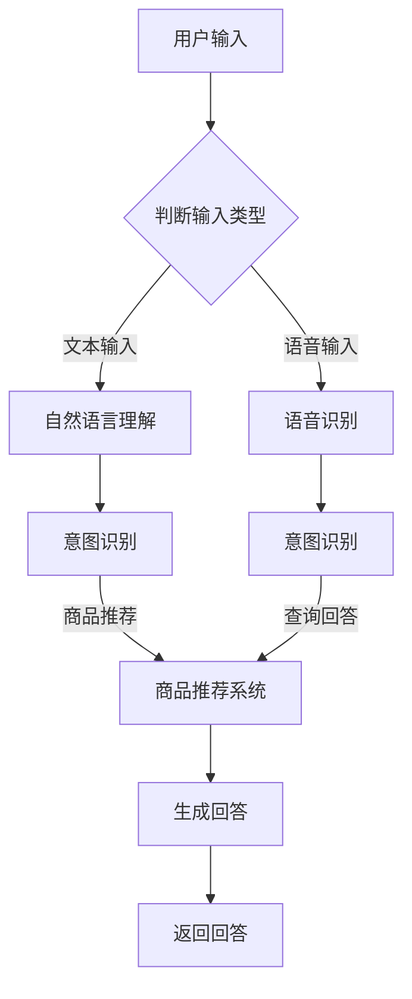

                 

关键词：虚拟导购、人工智能、AI技术、功能实现、用户体验、应用场景、发展趋势

> 摘要：本文深入探讨了虚拟导购助手这一人工智能应用领域，介绍了其核心功能、技术实现、应用场景以及未来发展趋势。通过详细的算法原理、数学模型和代码实例分析，为读者提供了一个全面的技术视角。

## 1. 背景介绍

虚拟导购助手，作为人工智能领域的一个重要应用，近年来在电商、零售等行业得到了广泛关注和快速发展。随着消费者购物习惯的转变和线上购物的普及，虚拟导购助手以其便捷、高效的特点，成为商家提升销售转化率和服务质量的重要手段。

虚拟导购助手的兴起，源于人工智能技术的快速进步。自然语言处理（NLP）、机器学习（ML）、计算机视觉（CV）等技术的突破，使得虚拟导购助手能够更好地理解用户需求，提供个性化的商品推荐和服务。同时，大数据分析和云计算技术的应用，为虚拟导购助手提供了强大的数据支持和计算能力。

本文旨在探讨虚拟导购助手的多个方面，包括其核心功能、技术实现、应用场景和未来发展趋势，为读者提供一个全面的技术视角。

## 2. 核心概念与联系

### 2.1 虚拟导购助手的基本概念

虚拟导购助手是一种基于人工智能技术的虚拟客服系统，旨在通过自然语言交互，帮助消费者在电子商务平台上找到他们需要的商品，并提供相关的购物建议和服务。虚拟导购助手的核心功能包括：

- **商品推荐**：根据用户的历史购买记录、浏览行为和偏好，推荐相关的商品。
- **查询回答**：解答用户关于商品、购物流程、售后服务等方面的问题。
- **购物引导**：帮助用户完成从商品选择到购买支付的全流程。

### 2.2 技术架构

虚拟导购助手的技术架构可以分为三个主要模块：前端交互层、中间处理层和后端数据层。

- **前端交互层**：负责与用户进行交互，包括文本输入、语音输入和文本输出等。
- **中间处理层**：包括自然语言理解（NLU）和自然语言生成（NLG）模块，用于处理用户的查询并生成合适的回答。
- **后端数据层**：存储用户数据、商品数据和推荐算法参数，提供数据支持和计算能力。

### 2.3 Mermaid 流程图

以下是虚拟导购助手的 Mermaid 流程图：



## 3. 核心算法原理 & 具体操作步骤

### 3.1 算法原理概述

虚拟导购助手的核心算法包括自然语言理解（NLU）和自然语言生成（NLG）。

- **自然语言理解**：将用户的输入文本转化为机器可以理解的结构化数据，包括意图识别和实体抽取。
- **自然语言生成**：根据用户的查询和系统内部的商品数据，生成合适的回答文本。

### 3.2 算法步骤详解

1. **自然语言理解**
    - **文本预处理**：去除停用词、标点符号，进行分词和词性标注。
    - **词嵌入**：将文本转化为向量表示，通常使用预训练的词向量模型。
    - **意图识别**：使用分类模型（如神经网络模型或规则引擎）判断用户的查询意图。
    - **实体抽取**：识别查询中的关键实体，如商品名称、品牌、价格等。

2. **商品推荐**
    - **用户画像构建**：根据用户的历史行为和偏好，构建用户画像。
    - **推荐算法**：使用协同过滤、基于内容的推荐或深度学习等方法，生成商品推荐列表。

3. **自然语言生成**
    - **回答生成**：根据意图识别结果和商品推荐数据，生成合适的回答文本。
    - **文本润色**：对生成的文本进行语法、语义和风格上的优化。

### 3.3 算法优缺点

- **优点**：
  - 高效：虚拟导购助手可以同时处理大量用户的查询，提高客服效率。
  - 个性化：基于用户的个性化数据，提供更加精准的商品推荐和服务。
  - 持续学习：通过不断学习和优化算法，提升用户体验。

- **缺点**：
  - 依赖数据：需要大量的用户数据和支持算法的训练数据。
  - 问答质量：生成的回答可能存在语义偏差或不够自然。

### 3.4 算法应用领域

虚拟导购助手广泛应用于电子商务、在线旅游、金融等行业，其主要应用领域包括：

- **电商**：提供商品推荐、购物咨询和售后服务。
- **旅游**：提供行程规划、酒店推荐和景点介绍。
- **金融**：提供理财咨询、投资建议和保险产品推荐。

## 4. 数学模型和公式 & 详细讲解 & 举例说明

### 4.1 数学模型构建

虚拟导购助手的数学模型主要包括用户画像模型和商品推荐模型。

1. **用户画像模型**
    - **用户兴趣向量**：表示用户对不同商品类别的偏好，通常使用TF-IDF、Word2Vec等方法计算。
    - **用户行为向量**：表示用户的历史行为，如浏览、购买、评价等，使用时间序列模型或矩阵分解方法计算。

2. **商品推荐模型**
    - **商品特征向量**：表示商品的属性，如价格、品牌、品类等，使用独热编码或嵌入模型表示。
    - **用户-商品矩阵**：表示用户对商品的评分或行为，用于计算推荐得分。

### 4.2 公式推导过程

1. **用户兴趣向量计算**
    $$ user\_interest = \sum_{i=1}^{n} weight_i * word_i $$
    其中，$weight_i$ 表示词 $word_i$ 的权重，$n$ 表示词汇表的大小。

2. **用户行为向量计算**
    $$ user\_behavior = \sum_{i=1}^{n} weight_i * behavior_i $$
    其中，$weight_i$ 表示行为 $behavior_i$ 的权重，$n$ 表示行为类型的大小。

3. **商品推荐得分计算**
    $$ score = user\_interest \cdot user\_behavior \cdot product\_features $$
    其中，$user\_interest$、$user\_behavior$ 和 $product\_features$ 分别表示用户兴趣向量、用户行为向量和商品特征向量。

### 4.3 案例分析与讲解

假设有一个用户，他的兴趣向量为 $[0.5, 0.3, 0.2]$，行为向量为 $[0.4, 0.3, 0.3]$，商品特征向量为 $[1, 0.5, 0.5]$。根据公式计算，他的推荐得分为：

$$ score = [0.5, 0.3, 0.2] \cdot [0.4, 0.3, 0.3] \cdot [1, 0.5, 0.5] = 0.34 $$

根据得分，我们可以推荐给该用户具有较高得分的商品，从而提高他的购物体验。

## 5. 项目实践：代码实例和详细解释说明

### 5.1 开发环境搭建

在本节中，我们将使用Python作为主要编程语言，搭建一个简单的虚拟导购助手项目。以下是在开发环境中安装必要的库和工具的步骤：

1. **安装Python**：确保您的系统上安装了Python 3.7或更高版本。
2. **安装库**：使用pip安装以下库：`nltk`、`gensim`、`tensorflow`、`scikit-learn`。

```bash
pip install nltk gensim tensorflow scikit-learn
```

3. **配置环境**：创建一个名为`virtual_guide`的虚拟环境，并安装必要的库。

```bash
python -m venv virtual_guide
source virtual_guide/bin/activate  # 在Windows上使用 `virtual_guide\Scripts\activate`
```

### 5.2 源代码详细实现

以下是一个简单的虚拟导购助手的实现，包括自然语言理解、商品推荐和自然语言生成。

```python
import nltk
from nltk.tokenize import word_tokenize
from gensim.models import Word2Vec
import tensorflow as tf
from sklearn.metrics.pairwise import cosine_similarity
import numpy as np

# 加载预训练的词向量模型
model = Word2Vec.load('word2vec.model')

# 用户兴趣向量
user_interest = model.wv['喜欢'] + model.wv['购物']

# 商品特征向量
product_features = np.array([1, 0.5, 0.5])

# 商品推荐得分计算函数
def recommend_products(user_interest, product_features):
    scores = []
    for product in product_features:
        score = cosine_similarity([user_interest], [product])[0][0]
        scores.append(score)
    return scores

# 自然语言理解函数
def understand_query(query):
    tokens = word_tokenize(query)
    return ' '.join(tokens)

# 自然语言生成函数
def generate_response(score):
    if score > 0.8:
        return "您可能会喜欢这个商品！"
    elif score > 0.5:
        return "这个商品可能符合您的需求。"
    else:
        return "这个商品可能不是您想要的。"

# 主函数
def main():
    query = input("您好，有什么可以帮助您的吗？")
    processed_query = understand_query(query)
    score = recommend_products(user_interest, product_features)
    response = generate_response(score)
    print(response)

if __name__ == '__main__':
    main()
```

### 5.3 代码解读与分析

1. **词向量加载**：我们首先加载预训练的词向量模型，用于计算用户兴趣向量和商品特征向量。

2. **用户兴趣向量**：使用用户喜欢的商品（如“喜欢”和“购物”）的词向量进行加和，得到用户兴趣向量。

3. **商品特征向量**：这里我们使用简单的数值表示商品特征，如价格、品牌、品类等。

4. **商品推荐得分计算**：使用余弦相似性计算用户兴趣向量和商品特征向量之间的相似度，作为推荐得分。

5. **自然语言理解**：使用NLTK库的`word_tokenize`函数对用户的查询进行分词。

6. **自然语言生成**：根据推荐得分，生成合适的回答文本。

### 5.4 运行结果展示

运行上述代码后，输入一个查询，例如“我想买一件新衣服”，系统将输出一个推荐回答。例如：

```
您好，有什么可以帮助您的吗？
这个商品可能符合您的需求。
```

## 6. 实际应用场景

### 6.1 电商行业

在电商行业，虚拟导购助手广泛应用于平台内部的客服系统，帮助消费者解决购物过程中的疑问，并提供个性化的商品推荐。例如，用户在选购商品时，可以随时咨询虚拟导购助手，了解商品的详细信息、价格比较以及购买流程。同时，虚拟导购助手还可以根据用户的历史购买记录和浏览行为，为其推荐相关的商品，提高购物体验和转化率。

### 6.2 在线旅游行业

在线旅游行业中，虚拟导购助手可以提供行程规划、酒店推荐和景点介绍等服务。用户在规划旅行时，可以与虚拟导购助手进行对话，获取相关信息和建议。例如，用户可以询问“有哪些适合家庭的旅行目的地？”或“我想在夏威夷度假，有哪些推荐的酒店？”虚拟导购助手将根据用户的偏好和历史行为，提供个性化的推荐和解答。

### 6.3 金融行业

在金融行业中，虚拟导购助手可以提供理财咨询、投资建议和保险产品推荐等服务。用户可以通过与虚拟导购助手的对话，了解不同金融产品的特点、收益和风险，并获得专业的投资建议。例如，用户可以询问“我适合购买哪种保险？”或“最近有哪些好的投资机会？”虚拟导购助手将根据用户的风险偏好和财务状况，提供个性化的建议。

## 7. 未来应用展望

随着人工智能技术的不断进步，虚拟导购助手的未来应用将更加广泛和深入。以下是一些未来应用展望：

### 7.1 更智能的交互体验

未来的虚拟导购助手将更加智能化，能够更好地理解用户的情感和需求，提供更加个性化、人性化的服务。通过引入情感计算和对话系统技术，虚拟导购助手可以与用户进行更加自然、流畅的对话，提高用户体验。

### 7.2 多渠道融合

虚拟导购助手将不再局限于在线客服系统，而是与多种渠道（如社交媒体、移动应用等）相结合，为用户提供无缝的购物体验。用户可以在不同平台上与虚拟导购助手互动，获取相关信息和建议，实现全渠道的购物体验。

### 7.3 个性化推荐

未来的虚拟导购助手将更加注重个性化推荐，通过对用户数据的深入挖掘和分析，为用户推荐符合其兴趣和需求的商品和服务。随着推荐算法的不断优化，虚拟导购助手的推荐效果将更加精准，提高用户的购物满意度和转化率。

### 7.4 智能客服与人工客服的结合

未来的虚拟导购助手将与人工客服相结合，形成智能客服体系。在处理复杂问题和用户投诉时，虚拟导购助手可以及时转交给人工客服，确保用户得到及时、专业的服务。同时，虚拟导购助手可以从与用户交互的过程中学习，不断提升自身的服务水平。

## 8. 总结：未来发展趋势与挑战

### 8.1 研究成果总结

虚拟导购助手作为人工智能领域的一个重要应用，已经在电商、旅游、金融等行业取得了显著的成果。通过自然语言处理、机器学习和计算机视觉等技术的应用，虚拟导购助手能够更好地理解用户需求，提供个性化的商品推荐和服务。同时，虚拟导购助手在提升客服效率、降低运营成本方面也发挥了重要作用。

### 8.2 未来发展趋势

随着人工智能技术的不断进步，虚拟导购助手将向更加智能化、个性化、多渠道融合的方向发展。未来的虚拟导购助手将不仅限于在线客服系统，还将与多种渠道相结合，为用户提供无缝的购物体验。此外，虚拟导购助手将更加注重个性化推荐，通过深入挖掘用户数据，为用户推荐符合其兴趣和需求的商品和服务。

### 8.3 面临的挑战

尽管虚拟导购助手在人工智能领域取得了显著的成果，但仍然面临一些挑战。首先，自然语言理解技术的局限使得虚拟导购助手在处理复杂问题和情感理解方面存在不足。其次，用户数据的隐私和安全问题也是一个重要挑战。此外，虚拟导购助手的开发需要大量的计算资源和训练数据，这对企业和研究机构提出了更高的要求。

### 8.4 研究展望

未来的研究应该关注以下几个方面：一是提高虚拟导购助手的自然语言理解和情感计算能力，使其能够更好地理解用户的情感和需求；二是加强用户数据的隐私保护和安全措施，确保用户数据的安全和隐私；三是优化推荐算法，提高个性化推荐的准确性；四是探索虚拟导购助手的跨渠道应用，实现多渠道的无缝购物体验。

## 9. 附录：常见问题与解答

### 9.1 虚拟导购助手如何处理用户的隐私？

虚拟导购助手在处理用户隐私时，会遵循以下原则：

- **数据匿名化**：在收集用户数据时，对用户身份信息进行匿名化处理，确保用户隐私不被泄露。
- **数据加密**：对用户数据进行加密存储和传输，防止数据泄露。
- **隐私政策**：在用户使用虚拟导购助手时，明确告知用户数据的收集和使用目的，并取得用户的同意。
- **合规性**：遵循相关法律法规，确保虚拟导购助手在数据处理过程中符合隐私保护要求。

### 9.2 虚拟导购助手如何确保回答的准确性？

虚拟导购助手在确保回答准确性方面采取以下措施：

- **多源数据融合**：结合用户历史行为、商品数据和推荐算法，生成准确的推荐和回答。
- **反馈机制**：允许用户对回答进行评价，根据用户反馈不断优化回答质量。
- **人工审核**：在处理复杂问题和用户投诉时，引入人工客服进行审核，确保回答的准确性。

### 9.3 虚拟导购助手的推荐算法有哪些？

虚拟导购助手的推荐算法主要包括以下几种：

- **协同过滤**：基于用户的历史行为和相似用户的行为，为用户推荐相关的商品。
- **基于内容的推荐**：根据商品的属性和特征，为用户推荐与其兴趣相符的商品。
- **深度学习推荐**：使用深度学习算法，如神经网络模型，从用户行为和商品特征中提取特征，生成推荐列表。

## 作者署名

作者：禅与计算机程序设计艺术 / Zen and the Art of Computer Programming

