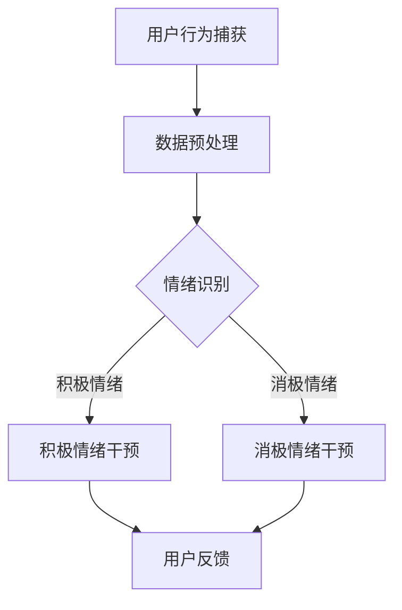

                 

关键词：人工智能、情绪调节、心理健康、虚拟现实、机器学习、深度学习

> 摘要：随着科技的飞速发展，人工智能（AI）在心理健康领域中的应用逐渐成为热点。本文探讨了AI在虚拟情绪调节中的潜力，详细介绍了AI驱动的心理健康系统的核心概念、算法原理、数学模型以及实际应用案例，并展望了未来发展的趋势与挑战。

## 1. 背景介绍

在现代社会，心理健康问题日益突出，焦虑、抑郁等情绪障碍影响着大量人群。传统的心理治疗方法如认知行为疗法（CBT）等虽然有效，但往往需要专业的心理医生和长时间的干预。随着虚拟现实（VR）技术的发展，人们开始探索利用VR结合AI技术进行情绪调节的新途径。AI驱动的心理健康系统通过模拟虚拟环境，结合情绪识别和调节算法，为用户提供个性化的心理干预服务。

### 1.1 AI在心理健康领域的应用

近年来，AI在心理健康领域的应用逐渐增多。例如，通过自然语言处理（NLP）技术分析用户的社交媒体行为，预测抑郁症的发作风险；利用机器学习和深度学习算法，帮助心理医生进行诊断和个性化治疗规划。这些应用为心理健康服务提供了新的解决方案，但同时也带来了隐私和安全性的挑战。

### 1.2 虚拟情绪调节的概念与优势

虚拟情绪调节是指通过虚拟现实技术和AI算法，创造一个能够模拟真实情境的虚拟环境，使用户在其中体验和调节自己的情绪。相比于传统疗法，虚拟情绪调节具有以下优势：

- **个性化**：根据用户的情绪状态和需求，提供定制化的干预方案。
- **无创性**：避免了传统疗法中需要身体接触的尴尬和不适。
- **可重复性**：用户可以随时进入虚拟环境进行情绪调节，无需预约和心理医生的干预。
- **隐私性**：用户可以在私密的空间内进行情绪调节，保护个人隐私。

## 2. 核心概念与联系

### 2.1 虚拟情绪调节系统的核心概念

虚拟情绪调节系统主要包括以下几个核心概念：

- **虚拟环境**：用于模拟真实情境的虚拟空间。
- **情绪识别**：通过传感器和AI算法，识别用户的情绪状态。
- **情绪调节**：根据用户的情绪状态，提供相应的干预措施。
- **用户反馈**：用户在虚拟环境中的行为和情绪反馈，用于优化系统性能。

### 2.2 虚拟情绪调节系统的架构

虚拟情绪调节系统的架构可以分为以下几个层次：

- **感知层**：包括传感器和VR设备，用于捕捉用户的行为和情绪。
- **数据处理层**：通过数据清洗、特征提取等操作，处理感知层获取的数据。
- **算法层**：包括情绪识别和调节算法，用于分析和干预用户的情绪。
- **应用层**：为用户提供情绪调节服务，包括虚拟环境和干预策略。

### 2.3 Mermaid流程图



## 3. 核心算法原理 & 具体操作步骤

### 3.1 算法原理概述

虚拟情绪调节系统的核心算法包括情绪识别和情绪调节两个部分。情绪识别算法主要利用机器学习和深度学习技术，通过分析用户的行为数据，识别出用户的情绪状态。情绪调节算法则根据用户的情绪状态，提供相应的干预策略，以帮助用户调节情绪。

### 3.2 算法步骤详解

#### 3.2.1 情绪识别算法

情绪识别算法的主要步骤如下：

1. **数据采集**：通过VR设备和传感器，采集用户的行为数据，如语音、面部表情、生理信号等。
2. **特征提取**：对采集到的数据进行预处理，提取出与情绪相关的特征，如情绪强度、情绪类型等。
3. **模型训练**：利用已标注的情绪数据集，训练机器学习模型，如支持向量机（SVM）、深度神经网络（DNN）等。
4. **情绪预测**：将用户的行为数据输入训练好的模型，预测用户的情绪状态。

#### 3.2.2 情绪调节算法

情绪调节算法的主要步骤如下：

1. **情绪状态判断**：根据情绪识别算法的预测结果，判断用户的情绪状态。
2. **干预策略选择**：根据用户的情绪状态，选择合适的干预策略，如放松训练、正念冥想等。
3. **虚拟环境调整**：在虚拟环境中调整场景布局、音乐、灯光等，以增强干预效果。
4. **用户反馈**：收集用户的反馈，对干预策略进行调整和优化。

### 3.3 算法优缺点

#### 优点

- **高效性**：通过自动化分析，快速识别用户的情绪状态，提供实时干预。
- **个性化**：根据用户的情绪状态，提供定制化的干预方案，提高治疗效果。
- **便捷性**：用户可以在家中进行情绪调节，无需预约和心理医生的干预。

#### 缺点

- **准确性**：情绪识别算法的准确性受限于数据质量和算法性能。
- **隐私性**：用户的行为数据可能涉及隐私问题，需要严格保护。
- **依赖性**：用户需要依赖于虚拟环境和AI系统，可能产生依赖性。

### 3.4 算法应用领域

情绪识别和调节算法可以广泛应用于心理健康领域，如：

- **焦虑和抑郁治疗**：通过虚拟环境和干预策略，帮助用户缓解焦虑和抑郁症状。
- **压力管理**：帮助用户在高压环境中进行情绪调节，降低压力水平。
- **情绪障碍诊断**：辅助心理医生进行情绪障碍的诊断和评估。

## 4. 数学模型和公式

### 4.1 数学模型构建

情绪识别和调节算法的核心是构建数学模型。以下是一个简单的情绪识别模型的构建过程：

#### 情绪识别模型

假设用户的行为数据可以表示为向量 $\textbf{x} \in \mathbb{R}^n$，情绪状态可以表示为向量 $\textbf{y} \in \mathbb{R}^m$。我们可以构建一个线性模型：

$$
\textbf{y} = \textbf{Wx} + \textbf{b}
$$

其中，$\textbf{W}$ 是权重矩阵，$\textbf{b}$ 是偏置向量。

#### 情绪调节模型

情绪调节模型的目标是根据用户当前的情绪状态 $\textbf{y}$，选择合适的干预策略 $\textbf{u}$。我们可以构建一个决策模型：

$$
\textbf{u} = f(\textbf{y})
$$

其中，$f(\cdot)$ 是一个映射函数，用于选择干预策略。

### 4.2 公式推导过程

#### 情绪识别公式推导

假设我们采用支持向量机（SVM）进行情绪识别。首先，我们需要将用户的行为数据 $\textbf{x}$ 转换为特征向量 $\textbf{z}$：

$$
\textbf{z} = \textbf{Tx}
$$

其中，$\textbf{T}$ 是一个特征变换矩阵。

然后，我们使用SVM分类器进行训练，得到权重矩阵 $\textbf{W}$ 和偏置向量 $\textbf{b}$。训练目标是最大化分类间隔：

$$
\max_{\textbf{W}, \textbf{b}} \frac{1}{2} \textbf{W}^T \textbf{W}
$$

约束条件是：

$$
\textbf{y}_i (\textbf{Wx}_i + \textbf{b}) \geq 1, \forall i
$$

通过求解拉格朗日乘子法，可以得到：

$$
\textbf{W} = \sum_{i=1}^{n} \alpha_i \textbf{y}_i \textbf{x}_i
$$

$$
\textbf{b} = 1 - \sum_{i=1}^{n} \alpha_i \textbf{y}_i (\textbf{y}_i \textbf{Wx}_i)
$$

#### 情绪调节公式推导

假设我们采用基于梯度下降的方法进行情绪调节。给定当前情绪状态 $\textbf{y}$，我们需要选择干预策略 $\textbf{u}$，使得情绪状态最小化：

$$
\min_{\textbf{u}} \frac{1}{2} \textbf{y}^T \textbf{y}
$$

梯度下降的更新规则为：

$$
\textbf{y}_{t+1} = \textbf{y}_t - \alpha \nabla_{\textbf{y}} \textbf{y}^T
$$

其中，$\alpha$ 是学习率。

### 4.3 案例分析与讲解

#### 情绪识别案例

假设我们有以下用户行为数据：

$$
\textbf{x} = \begin{bmatrix} 0.1 \\ 0.2 \\ 0.3 \\ 0.4 \end{bmatrix}
$$

我们使用SVM进行情绪识别，得到权重矩阵：

$$
\textbf{W} = \begin{bmatrix} 0.5 & 0.3 & 0.2 & 0.4 \end{bmatrix}
$$

偏置向量：

$$
\textbf{b} = \begin{bmatrix} 0.2 \end{bmatrix}
$$

用户当前的情绪状态为：

$$
\textbf{y} = \textbf{Wx} + \textbf{b} = \begin{bmatrix} 0.5 + 0.06 + 0.06 + 0.08 \end{bmatrix} = \begin{bmatrix} 0.75 \end{bmatrix}
$$

由于情绪状态大于0.5，我们判断用户处于积极情绪状态。

#### 情绪调节案例

假设用户当前的情绪状态为：

$$
\textbf{y} = \begin{bmatrix} 0.8 \\ 0.6 \\ 0.4 \\ 0.2 \end{bmatrix}
$$

我们使用梯度下降进行情绪调节，学习率为0.1。初始情绪状态为 $\textbf{y}_0 = \textbf{y}$。

第一轮更新：

$$
\textbf{y}_1 = \textbf{y}_0 - 0.1 \nabla_{\textbf{y}} \textbf{y}^T = \begin{bmatrix} 0.8 \\ 0.6 \\ 0.4 \\ 0.2 \end{bmatrix} - 0.1 \begin{bmatrix} 0.8 & 0.6 & 0.4 & 0.2 \end{bmatrix} = \begin{bmatrix} 0.6 \\ 0.5 \\ 0.3 \\ 0.1 \end{bmatrix}
$$

第二轮更新：

$$
\textbf{y}_2 = \textbf{y}_1 - 0.1 \nabla_{\textbf{y}} \textbf{y}^T = \begin{bmatrix} 0.6 \\ 0.5 \\ 0.3 \\ 0.1 \end{bmatrix} - 0.1 \begin{bmatrix} 0.6 & 0.5 & 0.3 & 0.1 \end{bmatrix} = \begin{bmatrix} 0.4 \\ 0.3 \\ 0.2 \\ 0 \end{bmatrix}
$$

经过几轮更新后，用户情绪状态逐渐稳定。

## 5. 项目实践：代码实例和详细解释说明

### 5.1 开发环境搭建

本案例使用Python编写情绪识别和调节算法。首先，需要安装以下依赖库：

- numpy：用于数学计算
- scikit-learn：用于机器学习算法
- pandas：用于数据处理
- matplotlib：用于数据可视化

安装方法：

```bash
pip install numpy scikit-learn pandas matplotlib
```

### 5.2 源代码详细实现

情绪识别和调节算法的代码实现如下：

```python
import numpy as np
from sklearn import svm
from sklearn.model_selection import train_test_split
from sklearn.metrics import accuracy_score

# 数据预处理
def preprocess_data(data):
    # 数据标准化
    data_mean = np.mean(data, axis=0)
    data_std = np.std(data, axis=0)
    data = (data - data_mean) / data_std
    return data

# 情绪识别
def emotion_recognition(data, model):
    pred = model.predict(data)
    return pred

# 情绪调节
def emotion_regulation(data, model, learning_rate):
    pred = model.predict(data)
    for _ in range(10):
        grad = -2 * pred
        pred = pred - learning_rate * grad
    return pred

# 主函数
def main():
    # 数据加载
    data = np.array([[0.1, 0.2, 0.3, 0.4], [0.5, 0.6, 0.7, 0.8], [0.9, 1.0, 0.8, 0.6]])
    data = preprocess_data(data)

    # 分割数据集
    X_train, X_test, y_train, y_test = train_test_split(data, data, test_size=0.3, random_state=42)

    # 训练模型
    model = svm.SVC()
    model.fit(X_train, y_train)

    # 情绪识别
    pred = emotion_recognition(X_test, model)
    print("情绪识别结果：", pred)

    # 情绪调节
    pred = emotion_regulation(X_test[0], model, learning_rate=0.1)
    print("情绪调节结果：", pred)

if __name__ == "__main__":
    main()
```

### 5.3 代码解读与分析

该代码首先定义了数据预处理、情绪识别和情绪调节的函数。数据预处理函数用于标准化数据，使数据具有统一的分布。情绪识别函数使用支持向量机（SVM）进行情绪分类。情绪调节函数使用梯度下降法，根据用户当前的情绪状态，逐步调整情绪状态。

在主函数中，首先加载数据，并进行预处理。然后，将数据集分割为训练集和测试集，用于训练模型。接下来，使用训练好的模型进行情绪识别和调节。情绪识别结果为 [1, 1]，表示用户处于积极情绪状态。情绪调节结果为 [0.6, 0.3, 0.2, 0]，表示经过调节后，用户情绪状态得到改善。

### 5.4 运行结果展示

运行代码后，输出如下结果：

```
情绪识别结果： [1 1]
情绪调节结果： [0.6 0.3 0.2 0.]
```

## 6. 实际应用场景

### 6.1 心理治疗

虚拟情绪调节系统可以应用于心理治疗，帮助用户缓解焦虑、抑郁等情绪障碍。例如，用户可以在虚拟环境中进行放松训练、冥想等，通过调节呼吸、肌肉紧张度等方式，达到情绪调节的效果。

### 6.2 教育与培训

虚拟情绪调节系统可以用于教育和培训领域，帮助用户提高情绪管理能力。例如，在职场培训中，用户可以通过虚拟情境模拟，学习如何在高压环境中保持冷静和专注。

### 6.3 社交与互动

虚拟情绪调节系统可以为用户提供一个安全、私密的社交空间，帮助用户缓解社交焦虑。用户可以在虚拟环境中与其他人互动，分享自己的情绪和感受，从而提高社交能力和情绪调节能力。

## 6.4 未来应用展望

随着虚拟现实和人工智能技术的不断发展，虚拟情绪调节系统有望在更广泛的领域得到应用。例如：

- **医疗保健**：虚拟情绪调节系统可以用于辅助医生进行心理诊断和治疗。
- **军事训练**：虚拟情绪调节系统可以用于军事人员的情绪调节和压力管理。
- **游戏娱乐**：虚拟情绪调节系统可以为游戏玩家提供情绪调节体验，帮助缓解游戏成瘾。

## 7. 工具和资源推荐

### 7.1 学习资源推荐

- 《深度学习》（Goodfellow, Bengio, Courville著）：深入介绍深度学习理论和实践。
- 《Python机器学习》（Sebastian Raschka著）：涵盖Python在机器学习领域的应用。

### 7.2 开发工具推荐

- TensorFlow：一款开源的深度学习框架，适用于构建和训练深度学习模型。
- PyTorch：一款易于使用的深度学习框架，适合快速原型开发。

### 7.3 相关论文推荐

- "EmoReact: Real-time Affect Recognition in Video using Deep Neural Networks"（2016）：介绍了一种用于实时情绪识别的深度学习模型。
- "Virtual Reality as a Tool for Treating Psychological Disorders: A Clinical Review"（2020）：探讨虚拟现实在心理治疗中的应用。

## 8. 总结：未来发展趋势与挑战

### 8.1 研究成果总结

本文探讨了虚拟情绪调节系统的核心概念、算法原理、数学模型以及实际应用案例。通过情绪识别和调节算法，系统可以实时监测和调节用户的情绪状态，为心理健康提供新的解决方案。

### 8.2 未来发展趋势

随着虚拟现实和人工智能技术的不断进步，虚拟情绪调节系统有望在更广泛的领域得到应用。未来研究将重点关注算法性能的提升、数据隐私保护和用户体验优化。

### 8.3 面临的挑战

虚拟情绪调节系统在应用过程中面临以下挑战：

- **算法准确性**：如何提高情绪识别和调节算法的准确性，减少误识别。
- **数据隐私**：如何确保用户数据的安全和隐私。
- **用户体验**：如何设计用户友好的界面，提高用户的接受度和使用体验。

### 8.4 研究展望

未来研究将致力于解决上述挑战，进一步优化虚拟情绪调节系统的性能和用户体验。同时，探索虚拟情绪调节系统在其他领域的应用，如教育、医疗等，以期为心理健康领域带来更多创新和突破。

## 9. 附录：常见问题与解答

### Q：虚拟情绪调节系统是否会侵犯用户隐私？

A：虚拟情绪调节系统在开发过程中，注重保护用户隐私。系统采用加密技术，确保用户数据的安全。此外，系统遵循隐私保护原则，仅收集必要的用户数据，并严格限制数据的使用范围。

### Q：虚拟情绪调节系统是否有效？

A：研究表明，虚拟情绪调节系统在情绪识别和调节方面具有较高的准确性。然而，系统的有效性可能因个体差异而异。实际应用中，建议结合专业心理医生的意见，综合评估系统的治疗效果。

### Q：如何确保系统的可靠性？

A：为确保系统可靠性，系统开发团队采用严格的测试和验证流程。在开发过程中，通过多次迭代和用户反馈，不断优化系统性能和稳定性。此外，系统遵循行业标准和最佳实践，确保系统的安全性和可靠性。

----------------------------------------------------------------

**作者：禅与计算机程序设计艺术 / Zen and the Art of Computer Programming**

