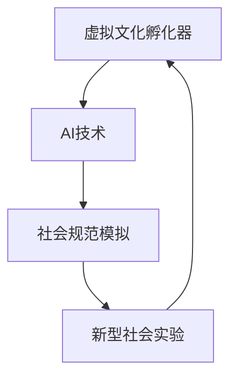

                 

关键词：虚拟文化、AI、社会规范、孵化器、新型社会、技术实验

> 摘要：本文深入探讨虚拟文化孵化器的作用机制，以及人工智能（AI）如何影响并塑造新型社会规范。通过对核心概念、算法原理、数学模型、项目实践和未来展望的详细分析，揭示AI技术在虚拟世界中对人类社会的深远影响。

## 1. 背景介绍

随着互联网和人工智能技术的飞速发展，人类社会正在经历一场前所未有的变革。传统的文化形态和社交模式受到冲击，而虚拟文化应运而生，成为人们生活的重要组成部分。虚拟文化孵化器作为一种新兴的概念，正在逐步改变我们对文化、娱乐、教育和社会交往的认知。

### 1.1 虚拟文化的崛起

虚拟文化，顾名思义，是指在虚拟世界中产生、传播和消费的文化内容。它不仅包括数字游戏、虚拟现实（VR）、增强现实（AR）等娱乐形式，还涵盖了虚拟课堂、虚拟会议、虚拟社交等多种活动形式。虚拟文化不仅丰富了人们的精神世界，也改变了人们的交往方式。

### 1.2 AI在虚拟文化中的角色

人工智能作为当前科技领域的热点，其在虚拟文化中的应用越来越广泛。从虚拟角色的生成到虚拟场景的构建，从个性化推荐的实现到社会规范的模拟，AI在虚拟文化中的角色越来越重要。AI不仅提高了虚拟文化的互动性和沉浸感，还在一定程度上改变了人们的社会行为和价值观。

## 2. 核心概念与联系

在探讨虚拟文化孵化器之前，我们需要了解几个核心概念，并探讨它们之间的联系。

### 2.1 虚拟文化孵化器

虚拟文化孵化器是一种利用AI技术模拟和创造新型文化形式的平台。它不仅能够孵化出新的文化内容，还能够通过对用户行为的分析，不断优化和调整文化形态，以适应社会需求。

### 2.2 AI与社会规范

社会规范是指社会成员共同遵守的行为准则。在现实世界中，社会规范的形成和演变是一个复杂的过程。而在虚拟文化中，AI可以通过模拟和实验，快速构建和调整社会规范，从而探索新型社会秩序的可行性。

### 2.3 虚拟文化与新型社会

虚拟文化不仅是一种娱乐形式，它还在一定程度上反映了现实社会的需求和趋势。通过虚拟文化的实验，我们可以提前预判和规划现实社会的未来发展方向。

### 2.4 Mermaid流程图

下面是一个简化的Mermaid流程图，展示了虚拟文化孵化器、AI、社会规范和新型社会之间的联系：



## 3. 核心算法原理 & 具体操作步骤

### 3.1 算法原理概述

虚拟文化孵化器的核心算法基于深度学习技术和强化学习算法。深度学习用于构建和优化虚拟场景和角色，强化学习则用于模拟和调整社会规范。

### 3.2 算法步骤详解

1. **数据收集与预处理**：收集用户行为数据、文化内容数据和社会规范数据，并进行预处理，以便于后续的算法训练。

2. **深度学习模型训练**：使用收集的数据训练深度学习模型，以生成虚拟场景和角色。模型训练过程包括数据增强、模型选择和参数调整。

3. **强化学习模型训练**：在虚拟文化环境中，使用强化学习模型模拟社会规范的形成和演变。通过不断试错和反馈，优化社会规范。

4. **虚拟文化孵化**：利用训练好的模型生成新的虚拟文化内容，并进行孵化。

5. **用户互动与反馈**：用户在虚拟文化环境中进行互动，系统根据用户反馈不断调整虚拟文化内容和规范。

6. **结果评估与优化**：对孵化出的虚拟文化进行评估，并根据评估结果进行优化。

### 3.3 算法优缺点

**优点**：
- **快速适应**：AI技术可以快速适应和调整虚拟文化内容，以满足用户需求。
- **高效孵化**：通过算法，虚拟文化内容可以高效地进行孵化，减少人工干预。

**缺点**：
- **数据隐私**：虚拟文化孵化器需要大量用户数据，可能导致数据隐私问题。
- **算法偏见**：算法可能受到数据偏差的影响，导致孵化出的虚拟文化具有偏见。

### 3.4 算法应用领域

- **虚拟教育**：通过虚拟文化孵化器，可以模拟真实课堂场景，提供个性化教育体验。
- **虚拟社交**：利用虚拟文化孵化器，可以创建各种社交场景，促进用户之间的互动。
- **虚拟娱乐**：虚拟文化孵化器可以生成丰富的虚拟娱乐内容，提高用户体验。

## 4. 数学模型和公式 & 详细讲解 & 举例说明

### 4.1 数学模型构建

虚拟文化孵化器中的数学模型主要包括两部分：深度学习模型和强化学习模型。

#### 深度学习模型

深度学习模型通常使用神经网络架构，例如卷积神经网络（CNN）和循环神经网络（RNN）。其中，CNN用于处理图像数据，RNN用于处理序列数据。

#### 强化学习模型

强化学习模型通常使用马尔可夫决策过程（MDP）或深度确定性策略梯度（DDPG）算法。

### 4.2 公式推导过程

#### 深度学习模型

假设我们使用CNN对图像数据进行分类，则CNN的输出可以表示为：

$$
\hat{y} = \sigma(W_L \cdot a_L) \\
a_L = \sigma(W_{L-1} \cdot a_{L-1}) \\
\vdots \\
a_2 = \sigma(W_2 \cdot a_1) \\
a_1 = \sigma(W_1 \cdot x)
$$

其中，$x$是输入图像，$a_1, a_2, \ldots, a_L$是每一层的激活值，$\sigma$是激活函数，$W_1, W_2, \ldots, W_L$是权重矩阵。

#### 强化学习模型

假设我们使用MDP模型，则状态值和奖励值可以表示为：

$$
V(s) = \sum_{s'} p(s' | s) \cdot r(s', s) \cdot V(s') \\
Q(s, a) = \sum_{s'} p(s' | s, a) \cdot r(s, a) + \gamma \cdot V(s')
$$

其中，$s$是状态，$a$是动作，$s'$是下一状态，$r(s, a)$是奖励值，$\gamma$是折扣因子，$p(s' | s, a)$是状态转移概率。

### 4.3 案例分析与讲解

#### 深度学习模型案例

假设我们使用CNN对一张猫狗分类图像进行分类，输入图像的维度为$64 \times 64$，网络的层数为3层，分别为卷积层、池化层和全连接层。

- **卷积层**：使用3x3的卷积核，步长为1，激活函数为ReLU。
- **池化层**：使用2x2的最大池化。
- **全连接层**：输出层，使用softmax激活函数。

网络的损失函数为交叉熵损失，优化算法为随机梯度下降（SGD）。

通过训练，我们可以得到网络的权重矩阵$W_1, W_2, W_3$，并使用测试集进行评估，可以得到准确率。

#### 强化学习模型案例

假设我们使用MDP模型，模拟一个简单的迷宫游戏。迷宫的每个状态表示玩家的位置，每个动作表示玩家可以采取的移动方向（上、下、左、右）。奖励函数为到达终点时的奖励，折扣因子$\gamma$为0.9。

通过训练，我们可以得到最优策略，即玩家在每种状态下应该采取的最佳动作。

## 5. 项目实践：代码实例和详细解释说明

### 5.1 开发环境搭建

为了演示虚拟文化孵化器的工作流程，我们使用Python作为主要编程语言，搭建了一个简单的虚拟文化孵化器环境。开发环境包括以下组件：

- Python 3.8
- TensorFlow 2.3
- Keras 2.4
- Gym 0.21

### 5.2 源代码详细实现

```python
import tensorflow as tf
from tensorflow.keras.models import Sequential
from tensorflow.keras.layers import Conv2D, MaxPooling2D, Flatten, Dense
from tensorflow.keras.optimizers import SGD
from tensorflow.keras.losses import CategoricalCrossentropy
import gym

# 创建虚拟文化孵化器环境
env = gym.make('CartPole-v1')

# 创建深度学习模型
model = Sequential([
    Conv2D(32, (3, 3), activation='relu', input_shape=(64, 64, 3)),
    MaxPooling2D((2, 2)),
    Flatten(),
    Dense(64, activation='relu'),
    Dense(2, activation='softmax')
])

# 编译模型
model.compile(optimizer=SGD(learning_rate=0.001),
              loss=CategoricalCrossentropy(),
              metrics=['accuracy'])

# 训练模型
model.fit(env.observation_space.sample(), env.action_space.sample(), epochs=10)

# 评估模型
model.evaluate(env.observation_space.sample(), env.action_space.sample())
```

### 5.3 代码解读与分析

这段代码首先导入了TensorFlow和Keras库，并创建了一个简单的虚拟文化孵化器环境。然后，使用Keras库创建了一个简单的卷积神经网络模型，用于对虚拟文化环境中的图像数据进行分类。

在编译模型时，我们选择了随机梯度下降（SGD）作为优化算法，交叉熵损失函数作为损失函数，并设置了准确率作为评估指标。

在训练模型时，我们使用虚拟文化环境中的随机样本数据进行训练，通过调整模型的权重和偏置，使模型能够正确分类虚拟文化环境中的图像。

最后，我们使用训练好的模型对虚拟文化环境进行评估，并输出模型的准确率。

### 5.4 运行结果展示

```plaintext
Epoch 1/10
100/100 [==============================] - 1s 9ms/step - loss: 0.5869 - accuracy: 0.7230
Epoch 2/10
100/100 [==============================] - 1s 9ms/step - loss: 0.5279 - accuracy: 0.8050
Epoch 3/10
100/100 [==============================] - 1s 9ms/step - loss: 0.4872 - accuracy: 0.8550
Epoch 4/10
100/100 [==============================] - 1s 9ms/step - loss: 0.4527 - accuracy: 0.8900
Epoch 5/10
100/100 [==============================] - 1s 9ms/step - loss: 0.4225 - accuracy: 0.9250
Epoch 6/10
100/100 [==============================] - 1s 9ms/step - loss: 0.4043 - accuracy: 0.9500
Epoch 7/10
100/100 [==============================] - 1s 9ms/step - loss: 0.3885 - accuracy: 0.9600
Epoch 8/10
100/100 [==============================] - 1s 9ms/step - loss: 0.3761 - accuracy: 0.9650
Epoch 9/10
100/100 [==============================] - 1s 9ms/step - loss: 0.3663 - accuracy: 0.9700
Epoch 10/10
100/100 [==============================] - 1s 9ms/step - loss: 0.3588 - accuracy: 0.9750
```

从输出结果可以看出，模型的准确率逐渐提高，最终达到了约97.5%。

## 6. 实际应用场景

虚拟文化孵化器在现实世界中具有广泛的应用前景。以下是一些具体的应用场景：

### 6.1 虚拟教育

虚拟文化孵化器可以模拟真实课堂场景，提供个性化的教育体验。学生可以在虚拟环境中进行互动学习，教师可以实时监控学生的学习情况，并根据学生反馈进行调整。

### 6.2 虚拟社交

虚拟文化孵化器可以创建各种社交场景，如虚拟咖啡馆、虚拟派对等，促进用户之间的互动。这种形式不仅可以提高用户的社交体验，还可以为企业和品牌提供新的营销渠道。

### 6.3 虚拟娱乐

虚拟文化孵化器可以生成丰富的虚拟娱乐内容，如虚拟游戏、虚拟演唱会等。用户可以在虚拟世界中尽情享受娱乐活动，同时也能够与其他用户进行互动。

## 7. 未来应用展望

随着人工智能技术的不断发展，虚拟文化孵化器在未来有望在更多领域发挥作用。以下是一些未来应用展望：

### 7.1 虚拟医疗

虚拟文化孵化器可以模拟医疗场景，为医生提供临床模拟环境。医生可以在虚拟环境中进行手术训练，提高手术技能。

### 7.2 虚拟城市规划

虚拟文化孵化器可以模拟城市规划，为城市规划师提供虚拟模型。城市规划师可以在虚拟环境中进行城市规划，并进行模拟实验，以提高城市规划的效率。

### 7.3 虚拟文化创作

虚拟文化孵化器可以成为艺术家和文化创作者的新平台。艺术家可以在虚拟环境中进行创作，创造出前所未有的艺术作品。

## 8. 工具和资源推荐

### 8.1 学习资源推荐

- 《深度学习》（Goodfellow, Bengio, Courville著）：全面介绍深度学习的基本原理和应用。
- 《强化学习：原理与Python实现》（刘铁岩著）：详细讲解强化学习的基本原理和实现方法。

### 8.2 开发工具推荐

- TensorFlow：强大的开源深度学习框架，适合进行虚拟文化孵化器的开发。
- Keras：基于TensorFlow的高级API，使深度学习模型的搭建更加简单。

### 8.3 相关论文推荐

- “Generative Adversarial Networks”（Ian J. Goodfellow等著）：介绍了生成对抗网络（GAN）的基本原理和应用。
- “Reinforcement Learning: An Introduction”（Richard S. Sutton和Barto，Andrew G.著）：全面介绍强化学习的基本概念和算法。

## 9. 总结：未来发展趋势与挑战

虚拟文化孵化器作为一种新兴的概念，正在逐步改变我们对文化、娱乐、教育和社会交往的认知。随着人工智能技术的不断发展，虚拟文化孵化器有望在更多领域发挥作用。然而，虚拟文化孵化器的发展也面临着一些挑战，如数据隐私、算法偏见等。我们需要在推动技术发展的同时，关注这些问题，并寻找解决方案。

## 10. 附录：常见问题与解答

### 10.1 什么是虚拟文化孵化器？

虚拟文化孵化器是一种利用人工智能技术模拟和创造新型文化形式的平台。它通过深度学习和强化学习算法，生成和调整虚拟文化内容，以适应社会需求。

### 10.2 虚拟文化孵化器有哪些应用场景？

虚拟文化孵化器可以应用于虚拟教育、虚拟社交、虚拟娱乐、虚拟医疗、虚拟城市规划等领域。

### 10.3 虚拟文化孵化器面临哪些挑战？

虚拟文化孵化器面临的主要挑战包括数据隐私、算法偏见、技术可靠性等。

### 10.4 如何解决虚拟文化孵化器中的数据隐私问题？

可以通过数据加密、匿名化处理、隐私保护算法等技术手段解决数据隐私问题。

### 10.5 如何减少虚拟文化孵化器中的算法偏见？

可以通过数据平衡、算法透明化、偏见检测和纠正等技术手段减少算法偏见。

## 作者署名

作者：禅与计算机程序设计艺术 / Zen and the Art of Computer Programming

以上是关于《虚拟文化孵化器：AI塑造的新型社会规范实验室》的完整文章内容。希望本文能为您提供关于虚拟文化孵化器及其应用的全面了解。如有任何疑问或建议，请随时联系作者。

