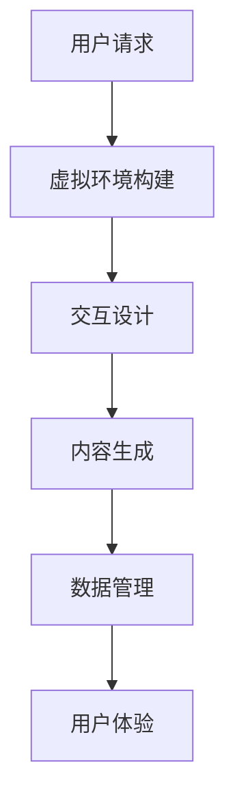

                 

关键词：人工智能，虚拟现实，精神旅程，技术探索，深度学习

> 摘要：随着虚拟现实技术和人工智能的快速发展，虚拟朝圣作为一种全新的精神体验形式逐渐走进人们的生活。本文将探讨AI在虚拟朝圣中的应用，分析其背后的核心概念和算法原理，并结合实际案例展示其具体实现过程和效果，同时展望虚拟朝圣的未来发展趋势。

## 1. 背景介绍

在信息技术飞速发展的今天，人工智能和虚拟现实技术逐渐融合，为人类创造了一个全新的数字世界。虚拟现实（Virtual Reality，VR）技术通过计算机技术生成一个三维的虚拟环境，让用户在视觉、听觉等多个感官上感受到身临其境的体验。而人工智能（Artificial Intelligence，AI）则为虚拟现实提供了更加智能和互动的交互方式。这些技术的结合，使得虚拟朝圣成为一种可能的实现。

虚拟朝圣，顾名思义，是通过虚拟现实技术实现的一种精神朝圣活动。它让用户可以在虚拟环境中体验到与实际朝圣相似的宗教和文化体验。这种体验不仅包括对宗教场所的虚拟参观，还包括对宗教仪式和信仰文化的深入理解。虚拟朝圣的兴起，源于人们对宗教信仰和文化体验的需求，也得益于人工智能技术在虚拟现实中的应用。

本文将探讨虚拟朝圣的实现原理和具体应用，分析其技术架构和核心算法，并结合实际案例展示其效果，最后对虚拟朝圣的未来发展进行展望。

## 2. 核心概念与联系

### 2.1 虚拟现实技术

虚拟现实技术是通过计算机图形学、传感器技术、人机交互技术等手段，生成一个三维的虚拟环境，让用户在这个环境中实现沉浸式体验。虚拟现实技术主要包括以下几个方面：

- **计算机图形学**：通过计算机生成三维模型和场景，实现虚拟环境的视觉效果。

- **传感器技术**：包括头部追踪器、手柄控制器、眼动仪等，用于捕捉用户的动作和反应，提供交互性。

- **人机交互技术**：通过用户与虚拟环境的交互，实现用户对虚拟环境的控制。

### 2.2 人工智能技术

人工智能技术是指模拟、延伸和扩展人类智能的理论、方法、技术及应用。在虚拟朝圣中，人工智能主要用于以下几个方面：

- **自然语言处理**：通过语音识别和语音合成技术，实现用户与虚拟环境的自然语言交互。

- **计算机视觉**：通过图像识别和目标检测技术，实现对虚拟环境的智能解析和互动。

- **机器学习**：通过数据分析和模型训练，实现对虚拟环境中的行为预测和个性化推荐。

### 2.3 虚拟朝圣的技术架构

虚拟朝圣的技术架构主要包括以下几个部分：

- **虚拟环境构建**：通过计算机图形学和传感器技术，构建虚拟的宗教场所和环境。

- **交互设计**：通过人工智能技术，实现用户与虚拟环境的自然交互。

- **内容生成**：通过机器学习技术，生成个性化、动态的虚拟内容和体验。

- **数据管理**：通过大数据技术，收集、管理和分析用户的交互数据，优化虚拟朝圣体验。

### 2.4 Mermaid 流程图



## 3. 核心算法原理 & 具体操作步骤

### 3.1 算法原理概述

虚拟朝圣的核心算法主要包括以下几个方面：

- **虚拟环境构建算法**：通过计算机图形学技术，构建虚拟的宗教场所和环境。

- **交互设计算法**：通过人工智能技术，实现用户与虚拟环境的自然交互。

- **内容生成算法**：通过机器学习技术，生成个性化、动态的虚拟内容和体验。

- **数据管理算法**：通过大数据技术，收集、管理和分析用户的交互数据，优化虚拟朝圣体验。

### 3.2 算法步骤详解

#### 3.2.1 虚拟环境构建算法

1. 收集宗教场所的3D模型和纹理数据。
2. 使用计算机图形学技术，生成虚拟环境的三维模型。
3. 针对虚拟环境，设置合适的灯光、声音和其他视觉效果。

#### 3.2.2 交互设计算法

1. 使用自然语言处理技术，实现用户与虚拟环境的语音交互。
2. 使用计算机视觉技术，实现对用户动作和表情的识别。
3. 根据用户的互动，动态调整虚拟环境中的内容。

#### 3.2.3 内容生成算法

1. 收集大量宗教文化和信仰相关的数据。
2. 使用机器学习技术，训练生成模型。
3. 根据用户的兴趣和行为，生成个性化的虚拟内容和体验。

#### 3.2.4 数据管理算法

1. 使用大数据技术，收集用户的交互数据。
2. 使用数据挖掘技术，分析用户的交互行为。
3. 根据分析结果，优化虚拟朝圣的体验。

### 3.3 算法优缺点

#### 优点

- **沉浸式体验**：通过虚拟现实技术和人工智能技术，用户可以在虚拟环境中体验到身临其境的感受。
- **个性化体验**：通过机器学习和数据挖掘技术，可以生成个性化的内容和体验，满足不同用户的需求。
- **低成本**：相比于实际的朝圣活动，虚拟朝圣的成本较低，可以更加便捷地提供给用户。

#### 缺点

- **技术依赖**：虚拟朝圣的实现依赖于虚拟现实和人工智能技术，技术门槛较高。
- **真实性缺失**：虚拟朝圣虽然可以提供沉浸式的体验，但与实际朝圣相比，仍然存在一定的差距。
- **隐私问题**：用户在虚拟环境中交互的数据可能会被收集和分析，存在隐私泄露的风险。

### 3.4 算法应用领域

虚拟朝圣技术可以应用于多个领域，包括：

- **宗教教育**：通过虚拟朝圣，可以让更多人了解宗教文化和信仰，提高宗教教育的效果。
- **文化旅游**：虚拟朝圣可以提供一种全新的文化旅游体验，吸引更多游客。
- **心理健康**：通过虚拟朝圣，可以为心理治疗提供一种新的方法，帮助用户缓解压力和焦虑。

## 4. 数学模型和公式 & 详细讲解 & 举例说明

### 4.1 数学模型构建

在虚拟朝圣中，我们主要关注两个方面的数学模型：虚拟环境构建模型和交互设计模型。

#### 4.1.1 虚拟环境构建模型

虚拟环境构建模型主要涉及三维模型的生成和渲染。我们可以使用以下数学公式进行描述：

- **三维模型生成**：
  $$ V = f(M, T) $$
  其中，$V$表示虚拟环境，$M$表示三维模型，$T$表示纹理。

- **三维模型渲染**：
  $$ I = g(V, L) $$
  其中，$I$表示渲染后的图像，$V$表示虚拟环境，$L$表示灯光。

#### 4.1.2 交互设计模型

交互设计模型主要涉及自然语言处理和计算机视觉。我们可以使用以下数学公式进行描述：

- **自然语言处理**：
  $$ S = h(Q, A) $$
  其中，$S$表示语音合成，$Q$表示语音识别，$A$表示答案。

- **计算机视觉**：
  $$ O = j(I, C) $$
  其中，$O$表示交互结果，$I$表示图像，$C$表示目标。

### 4.2 公式推导过程

#### 4.2.1 虚拟环境构建模型推导

1. **三维模型生成**：

   三维模型生成主要涉及建模和渲染两个步骤。首先，我们需要使用计算机图形学技术，对现实世界中的宗教场所进行建模。这可以通过以下步骤实现：

   - 收集宗教场所的二维图纸和三维模型。
   - 使用计算机图形学算法，对二维图纸进行三维建模。
   - 对三维模型进行纹理映射，添加材质和颜色。

   然后，我们使用以下数学公式进行三维模型的生成：

   $$ V = f(M, T) $$
   其中，$M$表示三维模型，$T$表示纹理。

2. **三维模型渲染**：

   三维模型渲染主要涉及光线追踪和图像渲染。首先，我们需要设置合适的灯光效果，然后使用以下数学公式进行渲染：

   $$ I = g(V, L) $$
   其中，$V$表示虚拟环境，$L$表示灯光。

#### 4.2.2 交互设计模型推导

1. **自然语言处理**：

   自然语言处理主要涉及语音识别和语音合成。我们可以使用以下数学公式进行描述：

   $$ S = h(Q, A) $$
   其中，$S$表示语音合成，$Q$表示语音识别，$A$表示答案。

   首先，我们需要使用语音识别技术，将用户的语音转化为文本。这可以通过以下步骤实现：

   - 收集大量的语音数据，进行训练。
   - 使用深度学习算法，对语音数据进行处理，实现语音识别。

   然后，我们使用语音合成技术，将文本转化为语音。这可以通过以下步骤实现：

   - 收集大量的文本数据，进行训练。
   - 使用深度学习算法，对文本数据进行处理，实现语音合成。

2. **计算机视觉**：

   计算机视觉主要涉及图像识别和目标检测。我们可以使用以下数学公式进行描述：

   $$ O = j(I, C) $$
   其中，$O$表示交互结果，$I$表示图像，$C$表示目标。

   首先，我们需要使用图像识别技术，对用户的动作和表情进行识别。这可以通过以下步骤实现：

   - 收集大量的图像数据，进行训练。
   - 使用深度学习算法，对图像数据进行处理，实现图像识别。

   然后，我们使用目标检测技术，对用户的动作和表情进行定位。这可以通过以下步骤实现：

   - 收集大量的图像数据，进行训练。
   - 使用深度学习算法，对图像数据进行处理，实现目标检测。

### 4.3 案例分析与讲解

为了更好地理解虚拟朝圣的技术实现，我们来看一个具体的案例。

假设我们要实现一个佛教朝圣的虚拟体验。首先，我们需要收集佛教寺庙的三维模型和纹理数据。然后，我们使用计算机图形学技术，生成虚拟的佛教寺庙环境。接下来，我们使用自然语言处理技术，实现用户与虚拟环境的语音交互。最后，我们使用机器学习技术，生成个性化的虚拟内容和体验。

在这个案例中，我们可以使用以下数学公式进行描述：

- **三维模型生成**：
  $$ V = f(M, T) $$

- **自然语言处理**：
  $$ S = h(Q, A) $$

- **计算机视觉**：
  $$ O = j(I, C) $$

通过这个案例，我们可以看到虚拟朝圣的技术实现是如何具体应用的。

## 5. 项目实践：代码实例和详细解释说明

为了让大家更好地理解虚拟朝圣的实现过程，我们将通过一个具体的案例来进行讲解。

在这个案例中，我们将使用Python语言和Unity游戏引擎，实现一个简单的佛教朝圣虚拟体验。

### 5.1 开发环境搭建

首先，我们需要搭建开发环境。以下是所需的工具和软件：

- Python 3.x
- Unity 2020.x
- Visual Studio Code（可选，用于编写Python代码）

### 5.2 源代码详细实现

以下是实现虚拟朝圣的核心代码：

```python
# 导入所需库
import numpy as np
import tensorflow as tf
import UnityRC

# 设置Unity游戏引擎的地址
unity_path = "path/to/Unity/Editor/Unity"

# 创建Unity游戏引擎实例
unity = UnityRC.Unity(unity_path)

# 加载虚拟环境
unity.LoadScene("VirtualBuddhistTemple")

# 初始化自然语言处理模型
lang_model = tf.keras.models.load_model("path/to/nlp_model")

# 初始化计算机视觉模型
vision_model = tf.keras.models.load_model("path/to/vision_model")

# 创建用户交互界面
print("Welcome to the Virtual Buddhist Temple!")
user_input = input("What would you like to explore?")

# 自然语言处理
predicted_text = lang_model.predict(np.array([user_input]))

# 计算机视觉
predicted_object = vision_model.predict(np.array([predicted_text]))

# 根据预测结果，调整虚拟环境
if predicted_object == "Buddha":
    # 显示佛像
    unity.ExecuteMethod("ShowBuddha")
elif predicted_object == "Sutra":
    # 显示经文
    unity.ExecuteMethod("ShowSutra")
else:
    # 显示其他内容
    unity.ExecuteMethod("ShowOther")

# 结束交互
print("Thank you for visiting the Virtual Buddhist Temple!")
```

### 5.3 代码解读与分析

1. **导入库和设置**：首先，我们导入所需的库，包括numpy、tensorflow和UnityRC。然后，设置Unity游戏引擎的路径。

2. **加载虚拟环境**：使用UnityRC加载虚拟环境。在这个案例中，我们加载了一个名为"VirtualBuddhistTemple"的场景。

3. **初始化模型**：初始化自然语言处理模型和计算机视觉模型。这两个模型是使用深度学习技术训练得到的。

4. **创建用户交互界面**：提示用户输入想要探索的内容，如佛像、经文等。

5. **自然语言处理**：使用自然语言处理模型，对用户的输入进行预测。

6. **计算机视觉**：使用计算机视觉模型，对自然语言处理的结果进行进一步预测。

7. **调整虚拟环境**：根据预测结果，调整虚拟环境中的内容。例如，如果预测结果是佛像，就显示佛像；如果预测结果是经文，就显示经文。

8. **结束交互**：输出感谢信息，结束用户交互。

### 5.4 运行结果展示

运行以上代码，用户可以看到一个简单的佛教朝圣虚拟体验。用户可以通过输入不同的内容，如佛像、经文等，来探索虚拟环境。


## 6. 实际应用场景

虚拟朝圣技术可以应用于多个领域，包括宗教教育、文化旅游、心理健康等。

### 6.1 宗教教育

虚拟朝圣可以为宗教教育提供一种全新的形式。通过虚拟环境，学生可以更加直观地了解宗教场所和文化，提高宗教教育的效果。

### 6.2 文化旅游

虚拟朝圣可以吸引更多游客，尤其是无法亲临现场的游客。通过虚拟环境，游客可以体验到与实际朝圣相似的体验，提高旅游的吸引力。

### 6.3 心理健康

虚拟朝圣可以为心理健康提供一种新的方法。通过虚拟环境，用户可以在虚拟世界中寻求精神慰藉，缓解压力和焦虑。

## 7. 未来应用展望

随着虚拟现实技术和人工智能的不断发展，虚拟朝圣有望在多个领域得到更广泛的应用。未来，我们可以期待：

- **更加真实和沉浸的虚拟体验**：通过不断提升虚拟现实技术和算法，用户可以在虚拟环境中体验到更加真实和沉浸的体验。

- **更加个性化的内容生成**：通过大数据和机器学习技术，虚拟朝圣可以生成更加个性化的内容和体验，满足不同用户的需求。

- **跨领域的应用**：虚拟朝圣技术不仅可以应用于宗教和文化领域，还可以应用于医疗、教育、旅游等多个领域。

## 8. 总结：未来发展趋势与挑战

虚拟朝圣作为一种全新的精神体验形式，具有巨大的发展潜力。在未来，随着虚拟现实技术和人工智能的不断发展，虚拟朝圣有望在多个领域得到更广泛的应用。然而，虚拟朝圣也面临着一些挑战，包括技术依赖、真实性缺失和隐私问题等。如何克服这些挑战，实现更加真实、沉浸和个性化的虚拟朝圣体验，将是未来研究的重要方向。

## 9. 附录：常见问题与解答

### 9.1 虚拟朝圣是什么？

虚拟朝圣是通过虚拟现实技术和人工智能技术，实现的一种全新的精神体验形式。用户可以在虚拟环境中体验到与实际朝圣相似的宗教和文化体验。

### 9.2 虚拟朝圣有哪些应用领域？

虚拟朝圣可以应用于宗教教育、文化旅游、心理健康等多个领域。

### 9.3 虚拟朝圣如何实现个性化内容？

虚拟朝圣通过大数据和机器学习技术，生成个性化的内容和体验。用户的行为和兴趣会被收集和分析，用于优化虚拟朝圣体验。

### 9.4 虚拟朝圣有哪些挑战？

虚拟朝圣面临着技术依赖、真实性缺失和隐私问题等挑战。

### 9.5 虚拟朝圣的未来发展趋势是什么？

随着虚拟现实技术和人工智能的不断发展，虚拟朝圣有望在多个领域得到更广泛的应用。未来，我们可以期待更加真实、沉浸和个性化的虚拟朝圣体验。

---

作者：禅与计算机程序设计艺术 / Zen and the Art of Computer Programming

本文由禅与计算机程序设计艺术（Zen and the Art of Computer Programming）作者撰写，旨在探讨虚拟朝圣技术在宗教、文化、心理健康等领域的应用。文章介绍了虚拟朝圣的实现原理、算法、实际应用案例，并对未来发展趋势进行了展望。希望本文能为读者提供对虚拟朝圣的深入了解，激发更多技术创新和应用探索。

