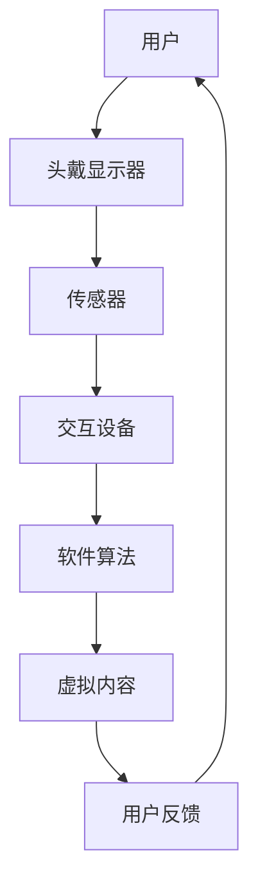
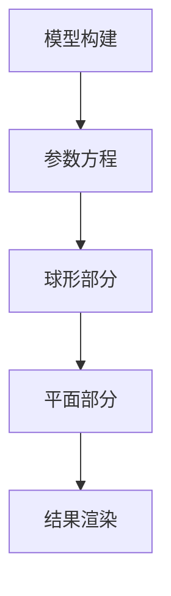

                 

关键词：虚拟现实，注意力经济，沉浸体验，人机交互，商业模式，技术应用

> 摘要：本文将探讨虚拟现实技术在注意力经济中的应用。通过分析虚拟现实技术的核心原理及其在娱乐、教育、医疗等领域的实际案例，揭示虚拟现实如何提升用户的注意力，并探讨其在未来商业模式中的潜在影响。

## 1. 背景介绍

随着互联网的普及和移动设备的广泛应用，注意力经济逐渐成为商业模式研究的热点。注意力经济强调用户对信息、服务和娱乐的关注，而这种关注往往以时间的投入和互动的深度为代价。在这个背景下，虚拟现实（VR）技术应运而生，它通过创建沉浸式的环境，使用户的注意力得到高度集中和持久化。

虚拟现实技术通过头戴显示器（HMD）、传感器和交互设备等硬件设备，结合软件算法和内容创作，为用户提供了全新的视觉、听觉和触觉体验。这种沉浸式的交互环境，不仅可以模拟真实世界，还可以创造前所未有的虚拟世界，使用户在虚拟环境中自由探索和互动。

注意力经济中的核心问题是如何吸引并保持用户的注意力。传统媒体和互联网应用虽然在一定程度上实现了这一目标，但面对日益激烈的竞争，用户获取和保持注意力变得越来越困难。而虚拟现实技术，凭借其独特的沉浸体验，能够显著提升用户的注意力水平，成为注意力经济中的一种新兴力量。

## 2. 核心概念与联系

虚拟现实技术的核心概念包括沉浸性、交互性和想象力。沉浸性指的是用户在虚拟环境中的感觉如同在真实世界中一样；交互性则强调用户与虚拟环境之间的互动；想象力则是虚拟现实内容的创造性和创新性。

以下是一个简化的 Mermaid 流程图，描述了虚拟现实技术的基本架构：



在上述流程中，用户通过头戴显示器（HMD）和传感器感知虚拟环境，通过交互设备与环境互动，软件算法负责内容生成和处理，最终为用户呈现一个高度沉浸的虚拟世界。

### 3. 核心算法原理 & 具体操作步骤

#### 3.1 算法原理概述

虚拟现实技术的核心算法包括图像处理、3D建模、渲染和交互处理。图像处理算法负责将现实世界的图像信息转换为虚拟环境中的视觉效果；3D建模算法用于创建虚拟环境中的三维模型；渲染算法则负责将模型渲染为逼真的视觉效果；交互处理算法则负责用户输入的处理和反馈。

#### 3.2 算法步骤详解

1. **图像捕捉与处理**：通过头戴显示器和摄像头捕捉用户的视觉信息，经过图像处理算法的预处理，包括噪声过滤、颜色校正和分辨率提升等。

2. **3D建模**：根据预处理后的图像信息，利用3D建模算法创建虚拟环境中的三维模型。这一步骤可能涉及深度学习、计算机视觉等技术。

3. **渲染**：将创建的三维模型通过渲染算法渲染成视觉效果。渲染算法需要考虑光照、阴影、材质等效果，以实现高度真实的视觉效果。

4. **交互处理**：根据用户的输入，如头部的移动、手势等，通过交互处理算法更新虚拟环境中的视觉效果，并反馈给用户。

#### 3.3 算法优缺点

- **优点**：
  - 高度沉浸式体验：虚拟现实技术能够提供超越传统媒体和互联网的沉浸式体验，显著提升用户的注意力水平。
  - 多感官刺激：通过视觉、听觉、触觉等多种感官刺激，增强用户的沉浸感。
  - 强互动性：用户可以与虚拟环境进行实时互动，提高参与度和互动性。

- **缺点**：
  - 成本较高：虚拟现实设备的成本较高，限制了其普及速度。
  - 技术限制：现有虚拟现实技术还存在一定的技术瓶颈，如延迟、分辨率等，影响用户体验。

#### 3.4 算法应用领域

虚拟现实技术已广泛应用于多个领域：

- **娱乐**：如VR游戏、VR电影等，通过沉浸式体验提升用户娱乐效果。
- **教育**：如虚拟现实教学、虚拟实验室等，提供更加生动、直观的教育体验。
- **医疗**：如虚拟现实手术训练、心理治疗等，通过模拟环境提升医疗效果。

### 4. 数学模型和公式 & 详细讲解 & 举例说明

虚拟现实技术的核心算法涉及到多种数学模型和公式。以下是一个简化的例子：

#### 4.1 数学模型构建

虚拟现实中的三维模型通常通过参数方程描述：

$$
P(x, y, z) = f(x, y, z) + g(x, y, z) \odot (1 - f(x, y, z))
$$

其中，$f(x, y, z)$和$g(x, y, z)$分别为两个参数函数，用于描述模型的不同部分。

#### 4.2 公式推导过程

假设三维模型由两个部分组成，一部分是球形，另一部分是平面。则：

$$
f(x, y, z) = 
\begin{cases} 
1 & \text{if } \sqrt{x^2 + y^2 + z^2} \leq r \\
0 & \text{otherwise}
\end{cases}
$$

$$
g(x, y, z) = 
\begin{cases} 
1 & \text{if } x \leq 0 \\
0 & \text{otherwise}
\end{cases}
$$

其中，$r$为球形半径。

#### 4.3 案例分析与讲解

以下是一个简单的案例，用于说明如何使用上述数学模型创建一个简单的三维模型：



通过设置不同的参数值，可以创建各种形状的三维模型，如球体、长方体等。以下是一个具体的参数方程实例：

```math
P(x, y, z) = 
\begin{cases} 
\sqrt{x^2 + y^2 + z^2} + 1 & \text{if } x \leq 0 \\
1 & \text{if } x > 0
\end{cases}
```

这个模型将创建一个从原点出发的直线，与$x$轴的交点为$(0,0,1)$，与$y$轴的交点为$(0,1,1)$，与$z$轴的交点为$(1,1,1)$。

### 5. 项目实践：代码实例和详细解释说明

为了更好地理解虚拟现实技术的应用，以下将提供一个简单的虚拟现实项目实例，并详细解释其实现过程。

#### 5.1 开发环境搭建

为了实现虚拟现实项目，我们需要以下开发环境和工具：

- **编程语言**：Python
- **虚拟现实库**：PyOpenGL
- **图形库**：OpenGL
- **开发环境**：Visual Studio Code

首先，确保安装了Python环境。然后，通过pip命令安装PyOpenGL和OpenGL库：

```bash
pip install PyOpenGL
```

#### 5.2 源代码详细实现

以下是一个简单的虚拟现实项目示例，用于创建一个立方体并在三维空间中旋转：

```python
import glfw
from OpenGL import GL
from OpenGL.arrays import vbo
import numpy as np

# 初始化OpenGL上下文
glfw.init()
window = glfw.create_window(800, 600, "Virtual Reality Example", None, None)

# 设置OpenGL属性
glfw.make_context_current(window)
GL.glClearColor(0.0, 0.0, 0.0, 1.0)

# 创建顶点缓冲对象
vertices = (
    -1, -1,  1,
     1, -1,  1,
     1,  1,  1,
    -1,  1,  1,
    -1, -1, -1,
     1, -1, -1,
     1,  1, -1,
    -1,  1, -1,
)
vertices = np.array(vertices, dtype=np.float32)

vbo = vbo.VBO(vertices)

# 创建顶点数组对象
vertex_array = GL.glGenVertexArrays(1)
GL.glBindVertexArray(vertex_array)

# 创建和绑定顶点缓冲对象
vbo.bind()

# 设置顶点属性指针
GL.glVertexAttribPointer(0, 3, GL.GL_FLOAT, GL.GL_FALSE, 0, 0)
GL.glEnableVertexAttribArray(0)

# 解绑顶点缓冲对象和顶点数组对象
vbo.unbind()
GL.glBindVertexArray(0)

# 渲染循环
while not glfw.window_should_close(window):
    GL.glClear(GL.GL_COLOR_BUFFER_BIT)

    GL.glBindVertexArray(vertex_array)
    GL.glDrawArrays(GL.GL_TRIANGLE_STRIP, 0, 4)
    GL.glBindVertexArray(0)

    glfw.swap_buffers(window)
    glfw.poll_events()

# 释放资源
glfw.terminate()
```

#### 5.3 代码解读与分析

上述代码实现了一个简单的虚拟现实应用程序，用于绘制一个立方体，并在三维空间中旋转。

- **初始化OpenGL上下文**：通过glfw初始化OpenGL上下文，并创建一个窗口。
- **设置OpenGL属性**：设置OpenGL的清屏颜色。
- **创建顶点缓冲对象**：使用`numpy`创建顶点数据数组，并将其存储在顶点缓冲对象中。
- **创建顶点数组对象**：生成顶点数组对象，并将其绑定到当前上下文。
- **设置顶点属性指针**：配置顶点属性，如位置、颜色等。
- **渲染循环**：在渲染循环中，每次迭代都清除屏幕，绘制立方体，并交换缓冲区。
- **释放资源**：程序结束时，释放所有OpenGL资源。

#### 5.4 运行结果展示

运行上述代码，将看到一个黑色的窗口，其中包含一个旋转的立方体。用户可以通过移动鼠标来控制立方体的旋转。

### 6. 实际应用场景

虚拟现实技术已广泛应用于多个实际应用场景，以下是一些典型的例子：

#### 6.1 娱乐

虚拟现实技术为娱乐行业带来了前所未有的变革。例如，VR游戏提供了高度沉浸的体验，用户可以在虚拟世界中探索和冒险。此外，VR电影和VR音乐会等新兴娱乐形式，也为用户带来了全新的体验。

#### 6.2 教育

虚拟现实技术在教育领域的应用潜力巨大。通过虚拟实验室，学生可以在虚拟环境中进行实验，提高学习兴趣和实践能力。此外，虚拟现实教学还可以用于模拟历史事件、科学实验等，为学生提供更加直观的学习体验。

#### 6.3 医疗

虚拟现实技术在医疗领域的应用也越来越广泛。例如，虚拟现实手术训练可以帮助医生提高手术技能，减少手术风险。此外，虚拟现实还可以用于心理治疗，如恐惧症治疗，通过模拟环境帮助患者克服恐惧。

#### 6.4 未来应用展望

随着虚拟现实技术的不断发展和普及，未来它将在更多领域得到应用。例如，虚拟现实购物、虚拟现实旅游、虚拟现实会议等，都将为人们的生活和工作带来深刻变革。

### 7. 工具和资源推荐

为了更好地了解和掌握虚拟现实技术，以下推荐一些学习和开发资源：

#### 7.1 学习资源推荐

- **《虚拟现实技术基础》**：一本全面介绍虚拟现实技术的基础书籍，适合初学者阅读。
- **《OpenGL编程指南》**：OpenGL是虚拟现实开发中的核心库，这本书详细介绍了OpenGL的编程方法和技巧。

#### 7.2 开发工具推荐

- **PyOpenGL**：Python的虚拟现实库，易于使用且功能强大。
- **Unity**：一款流行的跨平台游戏引擎，也支持虚拟现实开发。

#### 7.3 相关论文推荐

- **《虚拟现实技术及其在注意力经济中的应用研究》**：一篇关于虚拟现实技术在注意力经济中的应用的学术论文。
- **《基于虚拟现实技术的注意力训练系统设计》**：一篇关于虚拟现实技术在注意力训练中应用的学术研究。

### 8. 总结：未来发展趋势与挑战

虚拟现实技术作为一种新兴技术，具有广阔的应用前景。在未来，随着技术的不断成熟和成本的降低，虚拟现实技术将在更多领域得到应用。然而，虚拟现实技术也面临一些挑战，如硬件性能提升、用户体验优化、内容创作等。为了实现虚拟现实技术的广泛应用，需要学术界和产业界的共同努力。

### 8.1 研究成果总结

本文通过分析虚拟现实技术的核心原理、算法、应用案例等，揭示了虚拟现实在注意力经济中的重要作用。研究表明，虚拟现实技术能够显著提升用户的注意力水平，并在娱乐、教育、医疗等领域具有广泛的应用前景。

### 8.2 未来发展趋势

未来，虚拟现实技术将朝着更加沉浸、更加智能、更加普及的方向发展。随着硬件性能的提升和算法的优化，虚拟现实技术将为用户提供更加真实的沉浸体验。同时，随着人工智能技术的融合，虚拟现实内容将更加智能化和个性化。

### 8.3 面临的挑战

虚拟现实技术面临的主要挑战包括硬件性能提升、用户体验优化、内容创作和普及成本等。为了克服这些挑战，需要加强技术研发，优化用户体验，降低开发成本。

### 8.4 研究展望

未来，虚拟现实技术的研究重点将包括以下几个方面：

- **硬件性能提升**：研究新型传感器、显示器、计算设备等，提升硬件性能，降低功耗。
- **用户体验优化**：研究如何提高用户的沉浸感、舒适度、互动性等，优化用户体验。
- **内容创作**：探索新的内容创作方法和技术，丰富虚拟现实内容的多样性和创意性。
- **商业模式创新**：研究如何通过虚拟现实技术创造新的商业模式，提升商业价值。

### 9. 附录：常见问题与解答

**Q：虚拟现实技术是否对用户有副作用？**

A：虚拟现实技术确实可能对用户产生一些副作用，如头晕、恶心、眩晕等。这些症状通常称为虚拟现实运动病（VRMS）。为了减少副作用，建议用户在体验虚拟现实时，保持适当的休息时间，避免长时间连续使用。

**Q：虚拟现实技术的沉浸感是如何实现的？**

A：虚拟现实技术的沉浸感主要通过以下几个方面实现：

- **视觉沉浸**：使用高分辨率显示器和光学技术，为用户呈现逼真的视觉体验。
- **听觉沉浸**：通过立体声音效和环境音效，为用户创造真实的听觉体验。
- **触觉沉浸**：使用触觉设备，如手套、触觉反馈设备等，为用户提供触觉反馈。
- **互动沉浸**：通过交互设备，如手柄、手势识别等，让用户在虚拟环境中自由探索和互动。

**Q：虚拟现实技术是否能够替代现实世界？**

A：虚拟现实技术虽然提供了高度沉浸的体验，但它仍然是现实世界的一种模拟。虚拟现实技术可以用于补充和丰富现实世界，但无法完全替代现实世界。虚拟现实技术更适用于那些需要高度沉浸和互动的场景，如游戏、教育、医疗等。

[作者：禅与计算机程序设计艺术 / Zen and the Art of Computer Programming]
----------------------------------------------------------------

以上是关于《虚拟现实技术在注意力经济中的应用》的完整文章。文章详细介绍了虚拟现实技术的核心原理、应用领域、算法实现和实际案例，并对未来的发展趋势和挑战进行了分析。希望这篇文章对您深入了解虚拟现实技术在注意力经济中的应用有所帮助。作者：禅与计算机程序设计艺术。如果您有任何问题或建议，欢迎在评论区留言。

