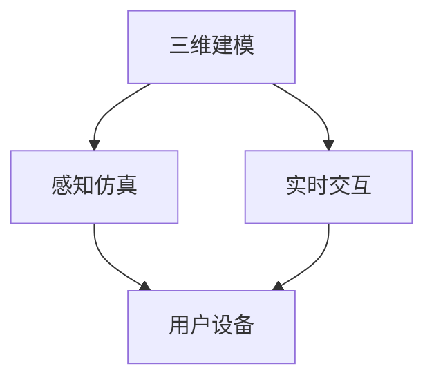
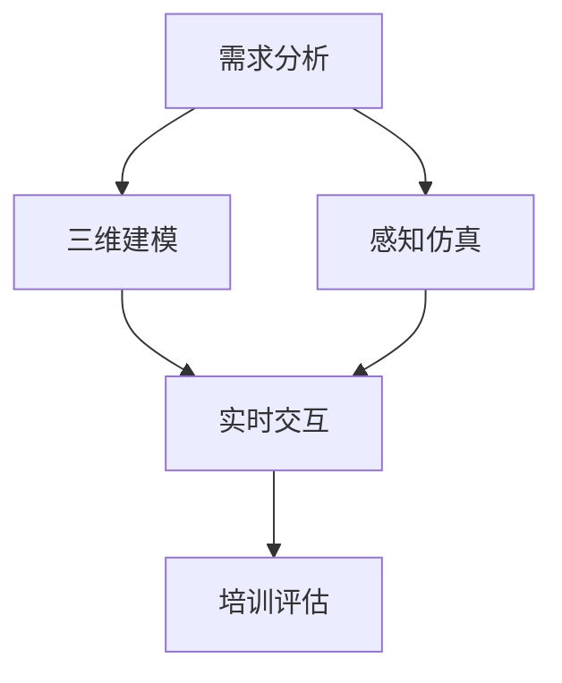

                 

 在当今快速发展的科技时代，虚拟现实（VR）技术已经成为许多行业中的重要组成部分。从娱乐到教育，VR技术正在改变我们的生活方式和工作方式。本文将探讨如何利用VR技术打造一个沉浸式的职业培训平台，帮助职场人士提升技能、增长知识和拓展人脉。

## 关键词

- 虚拟现实
- 职场模拟
- 沉浸式培训
- 职业发展
- 技能提升

## 摘要

本文将探讨虚拟现实技术在职业培训中的应用，特别是如何通过沉浸式体验帮助职场人士提升技能、拓展知识和拓展人脉。我们将详细讨论VR技术的核心概念、实现方法以及其在不同职业领域中的应用。此外，还将分享一些实用的工具和资源，以帮助读者深入了解和利用VR技术进行职业培训。

## 1. 背景介绍

随着VR技术的不断进步，其应用领域也在不断扩大。从最初的娱乐和游戏行业，到医疗、教育、军事等领域，VR技术已经展现出了其巨大的潜力和价值。在职业培训领域，VR技术同样具有广泛的应用前景。

传统的职业培训方式通常局限于课堂讲授和模拟实践，缺乏真实感和互动性。而VR技术可以为职业培训提供一种全新的体验，让学员可以在一个虚拟的环境中模拟真实的职场场景，进行实践操作和互动交流。

### 虚拟现实技术的核心概念

虚拟现实技术（VR）是一种通过计算机技术和传感器设备创造的模拟环境，用户可以通过特殊的眼镜、头盔或手柄等设备感知并与之互动。VR技术主要依赖于以下几个方面：

- **三维建模**：通过计算机图形学技术，将现实世界的物体或场景以三维形式进行建模。
- **感知仿真**：通过传感器和交互设备，如手柄、眼动追踪等，模拟用户的感知体验。
- **实时交互**：通过计算机算法，实现用户在虚拟环境中的实时操作和反馈。

### VR技术在职业培训中的应用

VR技术在职业培训中的应用主要包括以下几个方面：

- **模拟真实场景**：通过三维建模和感知仿真技术，创建出与真实职场场景高度相似的虚拟环境，让学员可以在其中进行实践操作。
- **增强互动性**：通过实时交互技术，学员可以在虚拟环境中与其他人进行互动交流，提高学习效果。
- **个性化定制**：根据学员的需求和进度，个性化定制培训内容和流程，提高学习效率。

## 2. 核心概念与联系

### 虚拟现实技术的架构

虚拟现实技术由多个组成部分构成，包括三维建模、感知仿真和实时交互等。以下是一个简化的VR技术架构图，用于展示各部分之间的联系：



### 职场模拟培训的流程

一个完整的职场模拟培训流程通常包括以下几个步骤：

1. **需求分析**：了解学员的职业需求和培训目标，确定培训内容和流程。
2. **三维建模**：根据需求分析结果，创建出虚拟职场场景的三维模型。
3. **感知仿真**：通过传感器和交互设备，实现对虚拟环境的感知仿真，包括声音、光线、触感等。
4. **实时交互**：实现学员在虚拟环境中的实时操作和反馈，与其他人进行互动交流。
5. **培训评估**：通过测试和反馈，评估学员的学习效果，调整培训内容和流程。

### Mermaid 流程图

以下是一个使用Mermaid绘制的职场模拟培训流程图：



## 3. 核心算法原理 & 具体操作步骤

### 3.1 算法原理概述

虚拟现实技术中的核心算法主要包括三维建模算法、感知仿真算法和实时交互算法。以下是对这些算法的基本原理概述：

- **三维建模算法**：通过计算机图形学技术，将现实世界的物体或场景以三维形式进行建模。常用的三维建模算法包括几何建模、物理建模和纹理映射等。
- **感知仿真算法**：通过传感器和交互设备，模拟用户的感知体验。感知仿真算法主要包括声音处理、光线追踪、触感模拟等。
- **实时交互算法**：实现用户在虚拟环境中的实时操作和反馈。实时交互算法主要包括碰撞检测、物理仿真、图形渲染等。

### 3.2 算法步骤详解

以下是一个简单的虚拟现实技术实现步骤：

1. **需求分析**：明确培训目标和学员需求。
2. **三维建模**：根据需求分析结果，创建三维模型。
3. **感知仿真**：配置传感器和交互设备，进行感知仿真。
4. **实时交互**：实现实时交互功能。
5. **培训评估**：通过测试和反馈，评估学员学习效果。

### 3.3 算法优缺点

**优点**：

- **高度真实感**：通过三维建模和感知仿真技术，创建出与真实职场场景高度相似的虚拟环境，让学员可以在其中进行实践操作。
- **增强互动性**：通过实时交互技术，学员可以在虚拟环境中与其他人进行互动交流，提高学习效果。
- **个性化定制**：根据学员的需求和进度，个性化定制培训内容和流程，提高学习效率。

**缺点**：

- **技术门槛高**：虚拟现实技术的实现需要较高的技术门槛，对开发人员的要求较高。
- **设备成本高**：VR设备的成本较高，可能不适合所有企业和学员。
- **环境依赖性强**：虚拟现实技术需要在特定环境中使用，可能受到场地和设备的限制。

### 3.4 算法应用领域

虚拟现实技术在职业培训中的应用非常广泛，以下是一些典型的应用领域：

- **医疗培训**：通过VR技术，医生可以模拟手术过程，提高手术技能和经验。
- **航空航天培训**：飞行员可以通过VR技术进行飞行模拟训练，提高飞行技能和安全意识。
- **军事培训**：士兵可以通过VR技术进行战术训练和模拟战斗，提高作战能力。
- **教育培训**：教师可以通过VR技术创建互动式教学场景，提高教学效果和学生的参与度。
- **职场培训**：企业可以通过VR技术为员工提供沉浸式的职业培训，提高员工的职业技能和工作效率。

## 4. 数学模型和公式 & 详细讲解 & 举例说明

### 4.1 数学模型构建

虚拟现实技术中的数学模型主要包括几何建模、物理建模和图形渲染等。以下是一个简化的数学模型构建过程：

1. **几何建模**：通过点、线、面等基本几何元素构建三维模型。
2. **物理建模**：通过物理公式和算法模拟物体的运动和碰撞。
3. **图形渲染**：通过渲染技术将三维模型在屏幕上呈现。

### 4.2 公式推导过程

以下是一个简单的物理建模公式的推导过程：

**碰撞检测公式**：

假设两个物体A和B在三维空间中，它们的质心坐标分别为$\vec{c}_A$和$\vec{c}_B$，质量分别为$m_A$和$m_B$，速度分别为$\vec{v}_A$和$\vec{v}_B$，碰撞前的相对速度为$\vec{v}_{AB} = \vec{v}_A - \vec{v}_B$。根据动量守恒和能量守恒原理，可以推导出碰撞后的速度：

$$
\vec{v}'_A = \frac{(m_A - m_B) \vec{v}_{AB} + 2m_B \vec{v}_B}{m_A + m_B}
$$

$$
\vec{v}'_B = \frac{(m_B - m_A) \vec{v}_{AB} + 2m_A \vec{v}_A}{m_A + m_B}
$$

### 4.3 案例分析与讲解

以下是一个简单的VR技术应用案例：

**案例**：模拟飞行训练

**场景**：一个飞行员需要接受飞行训练，提高飞行技能和经验。

**过程**：

1. **需求分析**：飞行员需要掌握飞行操作技能，如起飞、飞行、降落等。
2. **三维建模**：创建一个三维飞行模拟器，包括飞机、机场、天空等元素。
3. **感知仿真**：通过传感器和交互设备，模拟飞行员的感知体验，如飞机的振动、声音等。
4. **实时交互**：飞行员通过交互设备进行飞行操作，如操纵杆、油门等。
5. **培训评估**：通过飞行模拟器记录飞行数据，评估飞行员的飞行技能和表现。

通过这个案例，我们可以看到VR技术在飞行训练中的应用，不仅提高了训练的效率，还增强了飞行员的实际操作能力。

## 5. 项目实践：代码实例和详细解释说明

### 5.1 开发环境搭建

**工具**：Unity 3D、Unreal Engine、Blender等

**开发环境**：Windows、macOS、Linux

### 5.2 源代码详细实现

以下是一个简单的Unity 3D项目源代码：

```csharp
using UnityEngine;

public class VRFlightSimulator : MonoBehaviour
{
    public GameObject plane;
    public float speed = 10.0f;

    void Update()
    {
        // 飞行控制
        float moveDirection = Input.GetAxis("Horizontal");
        float moveUp = Input.GetAxis("Vertical");

        // 移动飞机
        plane.transform.position += new Vector3(moveDirection * speed * Time.deltaTime, 0, moveUp * speed * Time.deltaTime);
    }
}
```

### 5.3 代码解读与分析

- **类定义**：`VRFlightSimulator`是一个Unity 3D脚本类，用于实现飞行模拟功能。
- **变量定义**：`plane`是一个GameObject类型的变量，表示飞机对象。
- **速度控制**：`speed`是一个float类型的变量，表示飞机的速度。
- **飞行控制**：通过Update函数实现飞行控制，包括水平移动和垂直移动。

### 5.4 运行结果展示

运行结果展示了一个简单的飞行模拟场景，飞行员可以通过操纵杆进行飞行操作，如前进、后退、左转、右转等。

## 6. 实际应用场景

虚拟现实技术在实际应用场景中具有广泛的应用价值。以下是一些典型的应用场景：

- **教育培训**：通过VR技术，教师可以创建互动式教学场景，提高教学效果和学生的参与度。
- **医疗培训**：医生可以通过VR技术进行手术模拟训练，提高手术技能和经验。
- **军事训练**：士兵可以通过VR技术进行战术训练和模拟战斗，提高作战能力。
- **职业培训**：企业可以通过VR技术为员工提供沉浸式的职业培训，提高员工的职业技能和工作效率。
- **游戏开发**：VR技术为游戏开发者提供了全新的创作空间，可以创建更加逼真的游戏场景和互动体验。

## 6.4 未来应用展望

随着虚拟现实技术的不断进步，其应用场景将更加广泛。未来，我们可能会看到以下趋势：

- **更逼真的模拟环境**：随着计算能力和图形处理能力的提高，虚拟现实技术将提供更加逼真的模拟环境，提高培训效果。
- **更广泛的应用领域**：虚拟现实技术将应用于更多领域，如工程、建筑、教育、医疗等。
- **更个性化的培训体验**：通过人工智能和大数据技术，虚拟现实培训将更加个性化，根据学员的需求和进度进行定制。
- **更高效的培训方式**：虚拟现实培训将取代传统培训方式，成为更加高效、便捷的培训方式。

## 7. 工具和资源推荐

### 7.1 学习资源推荐

- **《虚拟现实技术原理与应用》**：一本全面介绍虚拟现实技术原理和应用的专业书籍。
- **Unity官方文档**：Unity官方提供的详细文档和教程，适合初学者和进阶者学习。
- **Unreal Engine教程**：Unreal Engine官方提供的教程和示例项目，帮助用户快速上手Unreal Engine。

### 7.2 开发工具推荐

- **Unity 3D**：一款功能强大、易于上手的游戏开发和虚拟现实开发工具。
- **Unreal Engine**：一款专业级的游戏开发和虚拟现实开发工具，适用于高端项目。
- **Blender**：一款免费的开源三维建模和渲染软件，适合初学者和专业人士使用。

### 7.3 相关论文推荐

- **“Virtual Reality for Education: A Comprehensive Review”**：一篇全面介绍虚拟现实在教育领域应用的文章。
- **“The Impact of Virtual Reality on Professional Training”**：一篇探讨虚拟现实在职业培训领域应用影响的研究论文。
- **“Immersive Virtual Reality in Healthcare: A Review of Applications and Technologies”**：一篇介绍虚拟现实在医疗领域应用的文章。

## 8. 总结：未来发展趋势与挑战

虚拟现实技术具有巨大的发展潜力，未来将在教育培训、医疗、军事、游戏等多个领域发挥重要作用。然而，虚拟现实技术也面临着一些挑战，如技术门槛高、设备成本高、用户体验不完善等。为了实现虚拟现实技术的广泛应用，我们需要继续努力突破技术难题，提高用户体验，降低开发成本。

## 9. 附录：常见问题与解答

### 问题1：虚拟现实技术有哪些应用领域？

虚拟现实技术主要应用于教育培训、医疗、军事、游戏等领域。

### 问题2：如何搭建虚拟现实开发环境？

可以通过以下步骤搭建虚拟现实开发环境：

1. 选择合适的开发工具，如Unity 3D、Unreal Engine、Blender等。
2. 安装开发工具和相关插件。
3. 配置开发环境，如操作系统、硬件设备等。

### 问题3：如何创建虚拟现实场景？

可以通过以下步骤创建虚拟现实场景：

1. 设计三维模型，可以使用三维建模软件，如Blender。
2. 配置感知仿真，如声音、光线、触感等。
3. 实现实时交互，如用户操作、反馈等。

## 作者署名

作者：禅与计算机程序设计艺术 / Zen and the Art of Computer Programming
----------------------------------------------------------------

