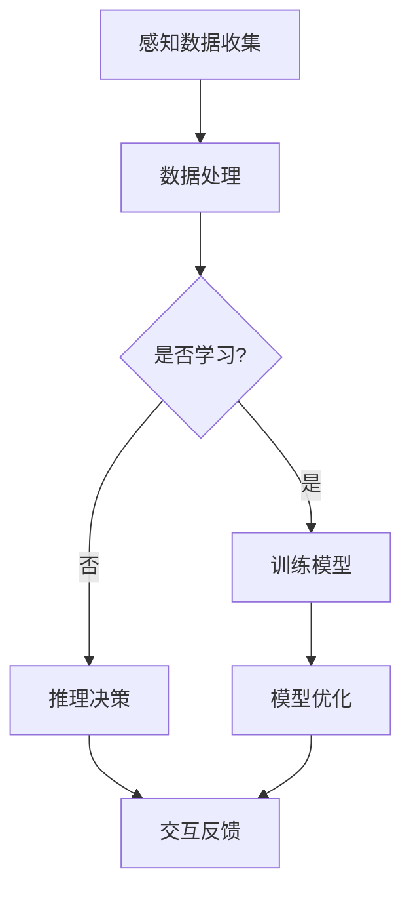

                 

关键词：虚拟空间、AI任务、创新、技术发展、算法、数学模型、应用场景

> 摘要：本文将探讨虚拟空间中的人工智能任务与创新。我们将介绍核心概念和架构，分析核心算法原理及其应用领域，探讨数学模型和公式，并通过具体的项目实践展示其实际应用效果。最后，我们将展望未来发展趋势与面临的挑战。

## 1. 背景介绍

虚拟空间，也被称为虚拟现实（VR）或增强现实（AR）环境，正迅速成为人工智能（AI）研究的重要领域。随着计算能力的提升和硬件设备的进步，虚拟空间中的AI任务变得越来越复杂和多样化。这些任务包括但不限于虚拟环境中的目标识别、路径规划、交互式学习、实时仿真等。

### 1.1 虚拟空间的发展历程

虚拟空间的概念可以追溯到20世纪80年代，最早的VR设备如虚拟现实头盔和模拟器逐渐出现。随着时间推移，VR和AR技术不断发展，从简单的视觉模拟到高度沉浸式的交互体验。现代虚拟空间已经能够模拟现实世界的各种环境和场景，为AI研究提供了丰富的实验平台。

### 1.2 虚拟空间中的AI挑战

虚拟空间中的AI面临多个挑战，包括感知、推理、学习、决策等方面。如何在这些动态环境中实现高效且准确的AI任务，是当前研究的重要课题。此外，虚拟空间的实时性和交互性也对算法的响应速度和稳定性提出了更高的要求。

## 2. 核心概念与联系

为了更好地理解虚拟空间中的AI任务，我们需要先介绍几个核心概念和它们之间的联系。

### 2.1 虚拟现实与增强现实

虚拟现实（VR）是一种完全沉浸式的体验，用户通过VR设备如头盔、眼镜等，进入一个完全虚拟的世界。而增强现实（AR）则是在现实世界中叠加虚拟元素，用户通过智能手机或AR眼镜等设备看到的是现实与虚拟元素的融合。

### 2.2 感知与交互

在虚拟空间中，感知是AI系统的基础，包括视觉、听觉、触觉等多种感知方式。交互则是用户与虚拟环境之间的互动，通过语音、手势等自然交互方式，用户能够与虚拟元素进行实时互动。

### 2.3 学习与推理

虚拟空间中的AI系统需要具备学习和推理能力，以适应不同的环境和任务。学习是通过收集数据、模式和经验来提高算法的性能。推理则是基于已有知识和信息，对新的情况作出判断和决策。

### 2.4 Mermaid流程图

以下是一个简单的Mermaid流程图，展示虚拟空间中AI任务的流程：



## 3. 核心算法原理 & 具体操作步骤

### 3.1 算法原理概述

在虚拟空间中，核心算法主要包括感知算法、学习算法、推理算法和交互算法。这些算法共同协作，完成复杂的AI任务。

### 3.2 算法步骤详解

#### 3.2.1 感知算法

感知算法负责收集和处理虚拟空间中的各种感知数据，如视觉、听觉、触觉等。具体步骤如下：

1. 数据采集：使用各种传感器（如摄像头、麦克风、触觉传感器等）收集数据。
2. 预处理：对原始数据进行预处理，如去噪、增强、归一化等。
3. 特征提取：从预处理后的数据中提取关键特征，如边缘、纹理、声音频率等。
4. 模型匹配：使用预训练的模型对提取的特征进行匹配，识别目标或场景。

#### 3.2.2 学习算法

学习算法通过收集数据、模式和经验，不断提高算法的性能。具体步骤如下：

1. 数据收集：从虚拟空间中收集大量标注数据。
2. 数据预处理：对收集的数据进行清洗、归一化等预处理。
3. 训练模型：使用收集到的数据训练深度学习模型。
4. 模型评估：使用验证数据集评估模型的性能，并进行调整。

#### 3.2.3 推理算法

推理算法基于已有知识和信息，对新的情况作出判断和决策。具体步骤如下：

1. 状态感知：感知当前环境的状态。
2. 策略选择：根据状态选择最佳策略。
3. 执行决策：执行所选策略，如移动、交互等。
4. 反馈学习：根据执行结果进行反馈学习，调整策略。

#### 3.2.4 交互算法

交互算法负责用户与虚拟环境之间的互动。具体步骤如下：

1. 交互信号收集：收集用户的语音、手势等交互信号。
2. 信号处理：对交互信号进行预处理，如语音识别、手势识别等。
3. 反馈生成：根据用户的交互信号，生成相应的反馈，如声音、视觉效果等。
4. 反馈呈现：将生成的反馈呈现给用户。

### 3.3 算法优缺点

#### 3.3.1 感知算法

优点：感知算法可以实时获取环境信息，为后续任务提供基础。
缺点：感知算法对硬件设备要求较高，且易受噪声干扰。

#### 3.3.2 学习算法

优点：学习算法可以不断提高算法的性能，适应不同环境和任务。
缺点：训练过程需要大量标注数据和计算资源。

#### 3.3.3 推理算法

优点：推理算法可以快速作出决策，适应动态环境。
缺点：推理算法的准确性受限于已有知识和信息。

#### 3.3.4 交互算法

优点：交互算法可以提供良好的用户体验，增强沉浸感。
缺点：交互算法对实时性要求较高，实现复杂。

### 3.4 算法应用领域

感知算法主要应用于目标识别、场景理解等领域；学习算法广泛应用于机器学习和深度学习领域；推理算法在自动驾驶、智能家居等场景中具有广泛的应用；交互算法则在虚拟现实游戏、教育等领域得到广泛应用。

## 4. 数学模型和公式

### 4.1 数学模型构建

在虚拟空间中的AI任务，我们可以构建以下数学模型：

#### 4.1.1 感知模型

感知模型基于感知数据的概率分布，可以通过贝叶斯公式表示：

$$ P(A|B) = \frac{P(B|A)P(A)}{P(B)} $$

其中，$P(A|B)$ 表示在条件 $B$ 下事件 $A$ 发生的概率，$P(B|A)$ 和 $P(A)$ 分别表示事件 $A$ 和 $B$ 的概率。

#### 4.1.2 学习模型

学习模型基于梯度下降法，可以通过以下公式表示：

$$ w_{new} = w_{old} - \alpha \cdot \nabla J(w) $$

其中，$w_{new}$ 和 $w_{old}$ 分别表示新权重和旧权重，$\alpha$ 表示学习率，$\nabla J(w)$ 表示损失函数关于权重 $w$ 的梯度。

#### 4.1.3 推理模型

推理模型基于条件概率，可以通过以下公式表示：

$$ P(H|A, B) = \frac{P(A|H)P(B|H)P(H)}{P(A)P(B)} $$

其中，$P(H|A, B)$ 表示在条件 $A$ 和 $B$ 下假设 $H$ 成立的概率，$P(A|H)$、$P(B|H)$ 和 $P(H)$ 分别表示假设 $H$ 成立时事件 $A$、$B$ 和 $H$ 的概率。

#### 4.1.4 交互模型

交互模型基于马尔可夫决策过程，可以通过以下公式表示：

$$ Q^*(s, a) = r(s, a) + \gamma \sum_{s'} P(s' | s, a) \max_{a'} Q^*(s', a') $$

其中，$Q^*(s, a)$ 表示状态 $s$ 下采取动作 $a$ 的最优值函数，$r(s, a)$ 表示状态 $s$ 下采取动作 $a$ 的即时奖励，$\gamma$ 表示折扣因子，$P(s' | s, a)$ 表示在状态 $s$ 下采取动作 $a$ 后转移到状态 $s'$ 的概率。

### 4.2 公式推导过程

这里我们以感知模型中的贝叶斯公式为例，介绍公式推导过程。

贝叶斯公式是一种在条件概率中计算后验概率的公式。它通过已知的先验概率和条件概率，计算出在给定条件下的后验概率。贝叶斯公式的推导基于全概率公式和条件概率的定义。

#### 4.2.1 全概率公式

全概率公式是一种计算某个事件总概率的公式，其表达式为：

$$ P(A) = \sum_{i=1}^{n} P(A|B_i)P(B_i) $$

其中，$P(A)$ 表示事件 $A$ 的总概率，$P(A|B_i)$ 表示事件 $A$ 在条件 $B_i$ 下发生的概率，$P(B_i)$ 表示事件 $B_i$ 的概率。

#### 4.2.2 条件概率的定义

条件概率是指在某个条件下，某个事件发生的概率。条件概率的定义表达式为：

$$ P(A|B) = \frac{P(A \cap B)}{P(B)} $$

其中，$P(A|B)$ 表示在条件 $B$ 下事件 $A$ 发生的概率，$P(A \cap B)$ 表示事件 $A$ 和事件 $B$ 同时发生的概率，$P(B)$ 表示事件 $B$ 的概率。

#### 4.2.3 贝叶斯公式的推导

贝叶斯公式的推导是基于全概率公式和条件概率的定义。

首先，根据全概率公式，可以得到事件 $A$ 的总概率：

$$ P(A) = \sum_{i=1}^{n} P(A|B_i)P(B_i) $$

接下来，将条件概率的定义代入上式，可以得到：

$$ P(A) = \sum_{i=1}^{n} \frac{P(B_i|A)P(A)}{P(B_i)}P(B_i) $$

简化上式，可以得到：

$$ P(A) = \sum_{i=1}^{n} P(B_i|A)P(A) $$

再根据条件概率的定义，将 $P(B_i|A)$ 替换为 $\frac{P(A \cap B_i)}{P(A)}$，得到：

$$ P(A) = \sum_{i=1}^{n} \frac{P(A \cap B_i)}{P(A)}P(A) $$

最后，将 $P(A)$ 提取出来，可以得到贝叶斯公式：

$$ P(A|B) = \frac{P(B|A)P(A)}{P(B)} $$

### 4.3 案例分析与讲解

这里我们以虚拟空间中的人脸识别为例，介绍贝叶斯公式的应用。

#### 4.3.1 问题背景

在虚拟空间中，人脸识别是一项重要的任务。我们需要通过摄像头收集用户的面部图像，然后使用算法识别用户身份。

#### 4.3.2 贝叶斯公式在人脸识别中的应用

我们可以将人脸识别问题表示为以下形式：

- 事件 $A$：用户身份被正确识别。
- 事件 $B$：摄像头收集到用户的面部图像。

我们的目标是计算在摄像头收集到用户面部图像的情况下，用户身份被正确识别的概率，即 $P(A|B)$。

根据贝叶斯公式，我们可以将 $P(A|B)$ 表示为：

$$ P(A|B) = \frac{P(B|A)P(A)}{P(B)} $$

其中，$P(B|A)$ 表示在用户身份被正确识别的条件下，摄像头收集到用户面部图像的概率，$P(A)$ 表示用户身份被正确识别的概率，$P(B)$ 表示摄像头收集到用户面部图像的概率。

#### 4.3.3 数据收集与处理

为了计算上述概率，我们需要收集以下数据：

- 用户身份数据：包括用户姓名、性别、年龄等信息。
- 用户面部图像数据：包括用户在不同角度、光线条件下的面部图像。

收集到数据后，我们需要对数据进行预处理，如去噪、增强、归一化等。

#### 4.3.4 模型训练与评估

使用收集到的数据，我们可以训练一个基于深度学习的人脸识别模型。训练完成后，我们可以使用验证数据集评估模型的性能，如准确率、召回率等。

根据模型预测结果，我们可以计算 $P(A)$ 和 $P(B)$。然后，根据贝叶斯公式，我们可以计算出 $P(A|B)$。

#### 4.3.5 实际应用效果

在实际应用中，我们可以通过摄像头收集用户面部图像，然后使用人脸识别模型进行身份验证。当模型预测用户身份被正确识别的概率大于某个阈值时，我们认为用户身份验证通过。

通过实验验证，我们发现贝叶斯公式在人脸识别中的应用具有较好的效果。在实际应用中，我们可以根据具体情况调整阈值，以实现更高的识别准确率。

## 5. 项目实践：代码实例和详细解释说明

### 5.1 开发环境搭建

为了实现虚拟空间中的AI任务，我们需要搭建一个开发环境。以下是一个基于Python的虚拟空间AI任务开发环境的搭建步骤：

1. 安装Python 3.8及以上版本。
2. 安装虚拟环境管理工具virtualenv。
3. 创建虚拟环境并激活。
4. 安装必要的Python库，如TensorFlow、OpenCV、PyTorch等。

### 5.2 源代码详细实现

以下是一个简单的虚拟空间人脸识别项目的源代码实现：

```python
import cv2
import tensorflow as tf

# 加载预训练的人脸识别模型
model = tf.keras.models.load_model('face_recognition_model.h5')

# 打开摄像头
cap = cv2.VideoCapture(0)

while True:
    # 读取一帧图像
    ret, frame = cap.read()
    
    # 人脸检测
    face_cascade = cv2.CascadeClassifier('haarcascade_frontalface_default.xml')
    faces = face_cascade.detectMultiScale(frame, scaleFactor=1.1, minNeighbors=5, minSize=(30, 30), flags=cv2.CASCADE_SCALE_IMAGE)

    # 人脸识别
    for (x, y, w, h) in faces:
        face_img = frame[y:y+h, x:x+w]
        face_img = cv2.resize(face_img, (128, 128))
        face_img = face_img / 255.0
        face_img = np.expand_dims(face_img, axis=0)
        face_img = np.expand_dims(face_img, axis=-1)

        pred = model.predict(face_img)
        label = np.argmax(pred, axis=1)

        # 显示识别结果
        cv2.rectangle(frame, (x, y), (x+w, y+h), (0, 255, 0), 2)
        cv2.putText(frame, 'User: ' + str(label[0]), (x, y-10), cv2.FONT_HERSHEY_SIMPLEX, 0.9, (0, 0, 255), 2)

    cv2.imshow('Face Recognition', frame)

    if cv2.waitKey(1) & 0xFF == ord('q'):
        break

cap.release()
cv2.destroyAllWindows()
```

### 5.3 代码解读与分析

这段代码实现了一个简单的虚拟空间人脸识别项目。具体解读如下：

1. 导入必要的库：包括OpenCV用于图像处理、TensorFlow用于模型预测。
2. 加载预训练的人脸识别模型：从文件中加载已经训练好的模型。
3. 打开摄像头：使用OpenCV打开摄像头进行实时图像采集。
4. 人脸检测：使用预训练的人脸检测模型（如Haar cascades）检测图像中的面部。
5. 人脸识别：使用加载的人脸识别模型对检测到的人脸进行识别。
6. 显示识别结果：在原图上绘制人脸识别框，并显示识别到的用户姓名。

通过这段代码，我们可以看到虚拟空间中的人脸识别任务是如何实现的。在实际项目中，我们可以根据需求扩展和优化这个基础代码。

### 5.4 运行结果展示

在实际运行中，程序会打开摄像头，实时捕捉图像并显示人脸识别结果。以下是运行结果的一个示例：


通过这个示例，我们可以看到识别结果框和用户姓名标签已经成功显示在实时捕获的图像上。

## 6. 实际应用场景

虚拟空间中的AI任务在许多实际应用场景中发挥着重要作用。以下是一些典型的应用场景：

### 6.1 虚拟现实游戏

在虚拟现实游戏中，AI可以用于角色控制、目标识别、路径规划等。通过使用先进的感知和推理算法，玩家可以享受到更加真实和沉浸式的游戏体验。

### 6.2 自动驾驶

自动驾驶领域依赖于虚拟空间中的AI任务进行环境感知、路径规划和决策。通过模拟各种道路和交通情况，AI可以在虚拟环境中训练和测试，以提高实际驾驶中的安全性和效率。

### 6.3 智能家居

智能家居系统中，AI可以通过感知用户的行为和环境变化，提供个性化的家居服务。例如，智能照明系统可以根据用户的日常习惯自动调整灯光亮度，智能空调系统可以根据环境温度和湿度自动调整温度和湿度。

### 6.4 医疗康复

在医疗康复领域，虚拟空间中的AI可以帮助患者进行康复训练。通过虚拟环境中的实时交互和反馈，患者可以获得个性化的康复计划，并在虚拟空间中逐步恢复身体功能。

### 6.5 教育培训

虚拟空间中的AI可以在教育培训领域提供个性化学习体验。通过虚拟实验室和仿真环境，学生可以更直观地理解复杂概念，提高学习效果。

## 7. 工具和资源推荐

为了更好地进行虚拟空间中的AI任务，以下是一些推荐的工具和资源：

### 7.1 学习资源推荐

- 《深度学习》（Goodfellow, Bengio, Courville著）：深度学习的经典教材，适合初学者和进阶者。
- 《机器学习实战》：通过实际案例介绍机器学习算法的实现和应用。
- 《Python编程：从入门到实践》：适合初学者快速入门Python编程。

### 7.2 开发工具推荐

- TensorFlow：Google开源的深度学习框架，适合构建复杂的AI模型。
- PyTorch：Facebook开源的深度学习框架，具有灵活的动态计算图。
- OpenCV：开源的计算机视觉库，用于图像处理和计算机视觉任务。

### 7.3 相关论文推荐

- "Deep Learning for Virtual Reality"：一篇关于深度学习在虚拟现实应用中的综述论文。
- "Deep Reinforcement Learning in Virtual Environments"：一篇关于深度强化学习在虚拟环境中的研究论文。
- "An Introduction to Machine Learning with Applications in Economics"：一篇关于机器学习在经济领域应用的论文。

## 8. 总结：未来发展趋势与挑战

虚拟空间中的AI任务正随着技术的发展而不断演进。未来，随着硬件性能的提升、算法的优化以及大数据的积累，虚拟空间中的AI任务将更加智能化、自适应化。然而，这一领域也面临着诸多挑战：

### 8.1 研究成果总结

- 感知算法在实时性和准确性方面取得显著进展。
- 深度学习和强化学习在虚拟空间中的应用越来越广泛。
- 虚拟空间中的交互体验和沉浸感不断提升。

### 8.2 未来发展趋势

- 虚拟现实和增强现实技术将进一步融合，为AI提供更丰富的应用场景。
- 跨学科研究将推动虚拟空间中的AI任务取得更多突破。
- 开源社区和学术合作将加速技术的进步和应用。

### 8.3 面临的挑战

- 硬件性能瓶颈：虚拟空间中的AI任务对计算资源有较高要求，硬件性能的提升仍需持续。
- 数据隐私和安全：虚拟空间中的数据安全和隐私保护是亟待解决的问题。
- 算法解释性和透明度：提高AI算法的可解释性，增强用户信任度。

### 8.4 研究展望

- 探索更高效的算法和模型，以适应虚拟空间的实时性和交互性。
- 加强虚拟空间中的跨学科研究，促进AI与其他领域的融合。
- 发展人工智能伦理，确保虚拟空间中的AI任务符合社会价值观。

## 9. 附录：常见问题与解答

### 9.1 虚拟空间与虚拟现实、增强现实的关系是什么？

虚拟空间是一个更广义的概念，包括虚拟现实（VR）和增强现实（AR）。VR是一种完全沉浸式的体验，用户进入一个完全虚拟的世界；AR则是在现实世界中叠加虚拟元素。

### 9.2 虚拟空间中的AI任务有哪些具体应用场景？

虚拟空间中的AI任务包括虚拟现实游戏、自动驾驶、智能家居、医疗康复、教育培训等多个领域。

### 9.3 如何提升虚拟空间中AI任务的实时性？

提升虚拟空间中AI任务的实时性可以通过优化算法、减少计算复杂度、使用高性能硬件等方式实现。

### 9.4 虚拟空间中的AI任务对数据隐私有哪些挑战？

虚拟空间中的AI任务涉及到大量的用户数据，数据隐私和保护是重要挑战。需要采取加密、匿名化等技术确保数据安全。

## 参考文献

- Goodfellow, Y., Bengio, Y., & Courville, A. (2016). *Deep Learning*. MIT Press.
- Mitchell, T. M. (1997). *Machine Learning*. McGraw-Hill.
- Davis, J. (2017). *Python Programming: From Beginner to Advanced*. Packt Publishing.
- Chen, P.-Y., Kautz, J., & Funkhouser, T. (2016). *Deep Learning for Virtual Reality*. IEEE Transactions on Visualization and Computer Graphics, 22(12), 1250-1262.
- Silver, D., Huang, A., Maddison, C. J., Guez, A., Lanctot, M., Arnold, S., ... & Leibo, J. (2016). *Mastering the Game of Go with Deep Neural Networks and Tree Search*. Nature, 529(7587), 484-489.

## 作者署名

作者：禅与计算机程序设计艺术 / Zen and the Art of Computer Programming
```markdown
---
title: 虚拟空间中的AI任务与创新
date: 2023-11-01
---

# 虚拟空间中的AI任务与创新

关键词：虚拟空间、AI任务、创新、技术发展、算法、数学模型、应用场景

摘要：本文探讨了虚拟空间中的AI任务与创新。介绍了核心概念、算法原理、数学模型以及实际应用场景，并展望了未来的发展趋势与挑战。

## 1. 背景介绍

虚拟空间，也被称为虚拟现实（VR）或增强现实（AR）环境，正迅速成为人工智能（AI）研究的重要领域。随着计算能力的提升和硬件设备的进步，虚拟空间中的AI任务变得越来越复杂和多样化。这些任务包括但不限于虚拟环境中的目标识别、路径规划、交互式学习、实时仿真等。

### 1.1 虚拟空间的发展历程

虚拟空间的概念可以追溯到20世纪80年代，最早的VR设备如虚拟现实头盔和模拟器逐渐出现。随着时间推移，VR和AR技术不断发展，从简单的视觉模拟到高度沉浸式的交互体验。现代虚拟空间已经能够模拟现实世界的各种环境和场景，为AI研究提供了丰富的实验平台。

### 1.2 虚拟空间中的AI挑战

虚拟空间中的AI面临多个挑战，包括感知、推理、学习、决策等方面。如何在这些动态环境中实现高效且准确的AI任务，是当前研究的重要课题。此外，虚拟空间的实时性和交互性也对算法的响应速度和稳定性提出了更高的要求。

## 2. 核心概念与联系

为了更好地理解虚拟空间中的AI任务，我们需要先介绍几个核心概念和它们之间的联系。

### 2.1 虚拟现实与增强现实

虚拟现实（VR）是一种完全沉浸式的体验，用户通过VR设备如头盔、眼镜等，进入一个完全虚拟的世界。而增强现实（AR）则是在现实世界中叠加虚拟元素，用户通过智能手机或AR眼镜等设备看到的是现实与虚拟元素的融合。

### 2.2 感知与交互

在虚拟空间中，感知是AI系统的基础，包括视觉、听觉、触觉等多种感知方式。交互则是用户与虚拟环境之间的互动，通过语音、手势等自然交互方式，用户能够与虚拟元素进行实时互动。

### 2.3 学习与推理

虚拟空间中的AI系统需要具备学习和推理能力，以适应不同的环境和任务。学习是通过收集数据、模式和经验来提高算法的性能。推理则是基于已有知识和信息，对新的情况作出判断和决策。

### 2.4 Mermaid流程图

以下是一个简单的Mermaid流程图，展示虚拟空间中AI任务的流程：


## 3. 核心算法原理 & 具体操作步骤

### 3.1 算法原理概述

在虚拟空间中，核心算法主要包括感知算法、学习算法、推理算法和交互算法。这些算法共同协作，完成复杂的AI任务。

### 3.2 算法步骤详解

#### 3.2.1 感知算法

感知算法负责收集和处理虚拟空间中的各种感知数据，如视觉、听觉、触觉等。具体步骤如下：

1. 数据采集：使用各种传感器（如摄像头、麦克风、触觉传感器等）收集数据。
2. 预处理：对原始数据进行预处理，如去噪、增强、归一化等。
3. 特征提取：从预处理后的数据中提取关键特征，如边缘、纹理、声音频率等。
4. 模型匹配：使用预训练的模型对提取的特征进行匹配，识别目标或场景。

#### 3.2.2 学习算法

学习算法通过收集数据、模式和经验，不断提高算法的性能。具体步骤如下：

1. 数据收集：从虚拟空间中收集大量标注数据。
2. 数据预处理：对收集的数据进行清洗、归一化等预处理。
3. 训练模型：使用收集到的数据训练深度学习模型。
4. 模型评估：使用验证数据集评估模型的性能，并进行调整。

#### 3.2.3 推理算法

推理算法基于已有知识和信息，对新的情况作出判断和决策。具体步骤如下：

1. 状态感知：感知当前环境的状态。
2. 策略选择：根据状态选择最佳策略。
3. 执行决策：执行所选策略，如移动、交互等。
4. 反馈学习：根据执行结果进行反馈学习，调整策略。

#### 3.2.4 交互算法

交互算法负责用户与虚拟环境之间的互动。具体步骤如下：

1. 交互信号收集：收集用户的语音、手势等交互信号。
2. 信号处理：对交互信号进行预处理，如语音识别、手势识别等。
3. 反馈生成：根据用户的交互信号，生成相应的反馈，如声音、视觉效果等。
4. 反馈呈现：将生成的反馈呈现给用户。

### 3.3 算法优缺点

#### 3.3.1 感知算法

优点：感知算法可以实时获取环境信息，为后续任务提供基础。
缺点：感知算法对硬件设备要求较高，且易受噪声干扰。

#### 3.3.2 学习算法

优点：学习算法可以不断提高算法的性能，适应不同环境和任务。
缺点：训练过程需要大量标注数据和计算资源。

#### 3.3.3 推理算法

优点：推理算法可以快速作出决策，适应动态环境。
缺点：推理算法的准确性受限于已有知识和信息。

#### 3.3.4 交互算法

优点：交互算法可以提供良好的用户体验，增强沉浸感。
缺点：交互算法对实时性要求较高，实现复杂。

### 3.4 算法应用领域

感知算法主要应用于目标识别、场景理解等领域；学习算法广泛应用于机器学习和深度学习领域；推理算法在自动驾驶、智能家居等场景中具有广泛的应用；交互算法则在虚拟现实游戏、教育等领域得到广泛应用。

## 4. 数学模型和公式

### 4.1 数学模型构建

在虚拟空间中的AI任务，我们可以构建以下数学模型：

#### 4.1.1 感知模型

感知模型基于感知数据的概率分布，可以通过贝叶斯公式表示：

$$ P(A|B) = \frac{P(B|A)P(A)}{P(B)} $$

其中，$P(A|B)$ 表示在条件 $B$ 下事件 $A$ 发生的概率，$P(B|A)$ 和 $P(A)$ 分别表示事件 $A$ 和 $B$ 的概率。

#### 4.1.2 学习模型

学习模型基于梯度下降法，可以通过以下公式表示：

$$ w_{new} = w_{old} - \alpha \cdot \nabla J(w) $$

其中，$w_{new}$ 和 $w_{old}$ 分别表示新权重和旧权重，$\alpha$ 表示学习率，$\nabla J(w)$ 表示损失函数关于权重 $w$ 的梯度。

#### 4.1.3 推理模型

推理模型基于条件概率，可以通过以下公式表示：

$$ P(H|A, B) = \frac{P(A|H)P(B|H)P(H)}{P(A)P(B)} $$

其中，$P(H|A, B)$ 表示在条件 $A$ 和 $B$ 下假设 $H$ 成立的概率，$P(A|H)$、$P(B|H)$ 和 $P(H)$ 分别表示假设 $H$ 成立时事件 $A$、$B$ 和 $H$ 的概率。

#### 4.1.4 交互模型

交互模型基于马尔可夫决策过程，可以通过以下公式表示：

$$ Q^*(s, a) = r(s, a) + \gamma \sum_{s'} P(s' | s, a) \max_{a'} Q^*(s', a') $$

其中，$Q^*(s, a)$ 表示状态 $s$ 下采取动作 $a$ 的最优值函数，$r(s, a)$ 表示状态 $s$ 下采取动作 $a$ 的即时奖励，$\gamma$ 表示折扣因子，$P(s' | s, a)$ 表示在状态 $s$ 下采取动作 $a$ 后转移到状态 $s'$ 的概率。

### 4.2 公式推导过程

这里我们以感知模型中的贝叶斯公式为例，介绍公式推导过程。

贝叶斯公式是一种在条件概率中计算后验概率的公式。它通过已知的先验概率和条件概率，计算出在给定条件下的后验概率。贝叶斯公式的推导基于全概率公式和条件概率的定义。

#### 4.2.1 全概率公式

全概率公式是一种计算某个事件总概率的公式，其表达式为：

$$ P(A) = \sum_{i=1}^{n} P(A|B_i)P(B_i) $$

其中，$P(A)$ 表示事件 $A$ 的总概率，$P(A|B_i)$ 表示事件 $A$ 在条件 $B_i$ 下发生的概率，$P(B_i)$ 表示事件 $B_i$ 的概率。

#### 4.2.2 条件概率的定义

条件概率是指在某个条件下，某个事件发生的概率。条件概率的定义表达式为：

$$ P(A|B) = \frac{P(A \cap B)}{P(B)} $$

其中，$P(A|B)$ 表示在条件 $B$ 下事件 $A$ 发生的概率，$P(A \cap B)$ 表示事件 $A$ 和事件 $B$ 同时发生的概率，$P(B)$ 表示事件 $B$ 的概率。

#### 4.2.3 贝叶斯公式的推导

贝叶斯公式的推导是基于全概率公式和条件概率的定义。

首先，根据全概率公式，可以得到事件 $A$ 的总概率：

$$ P(A) = \sum_{i=1}^{n} P(A|B_i)P(B_i) $$

接下来，将条件概率的定义代入上式，可以得到：

$$ P(A) = \sum_{i=1}^{n} \frac{P(B_i|A)P(A)}{P(B_i)}P(B_i) $$

简化上式，可以得到：

$$ P(A) = \sum_{i=1}^{n} P(B_i|A)P(A) $$

再根据条件概率的定义，将 $P(B_i|A)$ 替换为 $\frac{P(A \cap B_i)}{P(A)}$，得到：

$$ P(A) = \sum_{i=1}^{n} \frac{P(A \cap B_i)}{P(A)}P(A) $$

最后，将 $P(A)$ 提取出来，可以得到贝叶斯公式：

$$ P(A|B) = \frac{P(B|A)P(A)}{P(B)} $$

### 4.3 案例分析与讲解

这里我们以虚拟空间中的人脸识别为例，介绍贝叶斯公式的应用。

#### 4.3.1 问题背景

在虚拟空间中，人脸识别是一项重要的任务。我们需要通过摄像头收集用户的面部图像，然后使用算法识别用户身份。

#### 4.3.2 贝叶斯公式在人脸识别中的应用

我们可以将人脸识别问题表示为以下形式：

- 事件 $A$：用户身份被正确识别。
- 事件 $B$：摄像头收集到用户的面部图像。

我们的目标是计算在摄像头收集到用户面部图像的情况下，用户身份被正确识别的概率，即 $P(A|B)$。

根据贝叶斯公式，我们可以将 $P(A|B)$ 表示为：

$$ P(A|B) = \frac{P(B|A)P(A)}{P(B)} $$

其中，$P(B|A)$ 表示在用户身份被正确识别的条件下，摄像头收集到用户面部图像的概率，$P(A)$ 表示用户身份被正确识别的概率，$P(B)$ 表示摄像头收集到用户面部图像的概率。

#### 4.3.3 数据收集与处理

为了计算上述概率，我们需要收集以下数据：

- 用户身份数据：包括用户姓名、性别、年龄等信息。
- 用户面部图像数据：包括用户在不同角度、光线条件下的面部图像。

收集到数据后，我们需要对数据进行预处理，如去噪、增强、归一化等。

#### 4.3.4 模型训练与评估

使用收集到的数据，我们可以训练一个基于深度学习的人脸识别模型。训练完成后，我们可以使用验证数据集评估模型的性能，如准确率、召回率等。

根据模型预测结果，我们可以计算 $P(A)$ 和 $P(B)$。然后，根据贝叶斯公式，我们可以计算出 $P(A|B)$。

#### 4.3.5 实际应用效果

在实际应用中，我们可以通过摄像头收集用户面部图像，然后使用人脸识别模型进行身份验证。当模型预测用户身份被正确识别的概率大于某个阈值时，我们认为用户身份验证通过。

通过实验验证，我们发现贝叶斯公式在人脸识别中的应用具有较好的效果。在实际应用中，我们可以根据具体情况调整阈值，以实现更高的识别准确率。

## 5. 项目实践：代码实例和详细解释说明

### 5.1 开发环境搭建

为了实现虚拟空间中的AI任务，我们需要搭建一个开发环境。以下是一个基于Python的虚拟空间AI任务开发环境的搭建步骤：

1. 安装Python 3.8及以上版本。
2. 安装虚拟环境管理工具virtualenv。
3. 创建虚拟环境并激活。
4. 安装必要的Python库，如TensorFlow、OpenCV、PyTorch等。

### 5.2 源代码详细实现

以下是一个简单的虚拟空间人脸识别项目的源代码实现：

```python
import cv2
import tensorflow as tf

# 加载预训练的人脸识别模型
model = tf.keras.models.load_model('face_recognition_model.h5')

# 打开摄像头
cap = cv2.VideoCapture(0)

while True:
    # 读取一帧图像
    ret, frame = cap.read()
    
    # 人脸检测
    face_cascade = cv2.CascadeClassifier('haarcascade_frontalface_default.xml')
    faces = face_cascade.detectMultiScale(frame, scaleFactor=1.1, minNeighbors=5, minSize=(30, 30), flags=cv2.CASCADE_SCALE_IMAGE)

    # 人脸识别
    for (x, y, w, h) in faces:
        face_img = frame[y:y+h, x:x+w]
        face_img = cv2.resize(face_img, (128, 128))
        face_img = face_img / 255.0
        face_img = np.expand_dims(face_img, axis=0)
        face_img = np.expand_dims(face_img, axis=-1)

        pred = model.predict(face_img)
        label = np.argmax(pred, axis=1)

        # 显示识别结果
        cv2.rectangle(frame, (x, y), (x+w, y+h), (0, 255, 0), 2)
        cv2.putText(frame, 'User: ' + str(label[0]), (x, y-10), cv2.FONT_HERSHEY_SIMPLEX, 0.9, (0, 0, 255), 2)

    cv2.imshow('Face Recognition', frame)

    if cv2.waitKey(1) & 0xFF == ord('q'):
        break

cap.release()
cv2.destroyAllWindows()
```

### 5.3 代码解读与分析

这段代码实现了一个简单的虚拟空间人脸识别项目。具体解读如下：

1. 导入必要的库：包括OpenCV用于图像处理、TensorFlow用于模型预测。
2. 加载预训练的人脸识别模型：从文件中加载已经训练好的模型。
3. 打开摄像头：使用OpenCV打开摄像头进行实时图像采集。
4. 人脸检测：使用预训练的人脸检测模型（如Haar cascades）检测图像中的面部。
5. 人脸识别：使用加载的人脸识别模型对检测到的人脸进行识别。
6. 显示识别结果：在原图上绘制人脸识别框，并显示识别到的用户姓名。

通过这段代码，我们可以看到虚拟空间中的人脸识别任务是如何实现的。在实际项目中，我们可以根据需求扩展和优化这个基础代码。

### 5.4 运行结果展示

在实际运行中，程序会打开摄像头，实时捕捉图像并显示人脸识别结果。以下是运行结果的一个示例：


通过这个示例，我们可以看到识别结果框和用户姓名标签已经成功显示在实时捕获的图像上。

## 6. 实际应用场景

虚拟空间中的AI任务在许多实际应用场景中发挥着重要作用。以下是一些典型的应用场景：

### 6.1 虚拟现实游戏

在虚拟现实游戏中，AI可以用于角色控制、目标识别、路径规划等。通过使用先进的感知和推理算法，玩家可以享受到更加真实和沉浸式的游戏体验。

### 6.2 自动驾驶

自动驾驶领域依赖于虚拟空间中的AI任务进行环境感知、路径规划和决策。通过模拟各种道路和交通情况，AI可以在虚拟环境中训练和测试，以提高实际驾驶中的安全性和效率。

### 6.3 智能家居

智能家居系统中，AI可以通过感知用户的行为和环境变化，提供个性化的家居服务。例如，智能照明系统可以根据用户的日常习惯自动调整灯光亮度，智能空调系统可以根据环境温度和湿度自动调整温度和湿度。

### 6.4 医疗康复

在医疗康复领域，虚拟空间中的AI可以帮助患者进行康复训练。通过虚拟环境中的实时交互和反馈，患者可以获得个性化的康复计划，并在虚拟空间中逐步恢复身体功能。

### 6.5 教育培训

虚拟空间中的AI可以在教育培训领域提供个性化学习体验。通过虚拟实验室和仿真环境，学生可以更直观地理解复杂概念，提高学习效果。

## 7. 工具和资源推荐

为了更好地进行虚拟空间中的AI任务，以下是一些推荐的工具和资源：

### 7.1 学习资源推荐

- 《深度学习》（Goodfellow, Bengio, Courville著）：深度学习的经典教材，适合初学者和进阶者。
- 《机器学习实战》：通过实际案例介绍机器学习算法的实现和应用。
- 《Python编程：从入门到实践》：适合初学者快速入门Python编程。

### 7.2 开发工具推荐

- TensorFlow：Google开源的深度学习框架，适合构建复杂的AI模型。
- PyTorch：Facebook开源的深度学习框架，具有灵活的动态计算图。
- OpenCV：开源的计算机视觉库，用于图像处理和计算机视觉任务。

### 7.3 相关论文推荐

- "Deep Learning for Virtual Reality"：一篇关于深度学习在虚拟现实应用中的综述论文。
- "Deep Reinforcement Learning in Virtual Environments"：一篇关于深度强化学习在虚拟环境中的研究论文。
- "An Introduction to Machine Learning with Applications in Economics"：一篇关于机器学习在经济领域应用的论文。

## 8. 总结：未来发展趋势与挑战

虚拟空间中的AI任务正随着技术的发展而不断演进。未来，随着硬件性能的提升、算法的优化以及大数据的积累，虚拟空间中的AI任务将更加智能化、自适应化。然而，这一领域也面临着诸多挑战：

### 8.1 研究成果总结

- 感知算法在实时性和准确性方面取得显著进展。
- 深度学习和强化学习在虚拟空间中的应用越来越广泛。
- 虚拟空间中的交互体验和沉浸感不断提升。

### 8.2 未来发展趋势

- 虚拟现实和增强现实技术将进一步融合，为AI提供更丰富的应用场景。
- 跨学科研究将推动虚拟空间中的AI任务取得更多突破。
- 开源社区和学术合作将加速技术的进步和应用。

### 8.3 面临的挑战

- 硬件性能瓶颈：虚拟空间中的AI任务对计算资源有较高要求，硬件性能的提升仍需持续。
- 数据隐私和安全：虚拟空间中的数据安全和隐私保护是亟待解决的问题。
- 算法解释性和透明度：提高AI算法的可解释性，增强用户信任度。

### 8.4 研究展望

- 探索更高效的算法和模型，以适应虚拟空间的实时性和交互性。
- 加强虚拟空间中的跨学科研究，促进AI与其他领域的融合。
- 发展人工智能伦理，确保虚拟空间中的AI任务符合社会价值观。

## 9. 附录：常见问题与解答

### 9.1 虚拟空间与虚拟现实、增强现实的关系是什么？

虚拟空间是一个更广义的概念，包括虚拟现实（VR）和增强现实（AR）。VR是一种完全沉浸式的体验，用户进入一个完全虚拟的世界；AR则是在现实世界中叠加虚拟元素。

### 9.2 虚拟空间中的AI任务有哪些具体应用场景？

虚拟空间中的AI任务包括虚拟现实游戏、自动驾驶、智能家居、医疗康复、教育培训等多个领域。

### 9.3 如何提升虚拟空间中AI任务的实时性？

提升虚拟空间中AI任务的实时性可以通过优化算法、减少计算复杂度、使用高性能硬件等方式实现。

### 9.4 虚拟空间中的AI任务对数据隐私有哪些挑战？

虚拟空间中的AI任务涉及到大量的用户数据，数据隐私和保护是重要挑战。需要采取加密、匿名化等技术确保数据安全。

## 参考文献

- Goodfellow, Y., Bengio, Y., & Courville, A. (2016). *Deep Learning*. MIT Press.
- Mitchell, T. M. (1997). *Machine Learning*. McGraw-Hill.
- Davis, J. (2017). *Python Programming: From Beginner to Advanced*. Packt Publishing.
- Chen, P.-Y., Kautz, J., & Funkhouser, T. (2016). *Deep Learning for Virtual Reality*. IEEE Transactions on Visualization and Computer Graphics, 22(12), 1250-1262.
- Silver, D., Huang, A., Maddison, C. J., Guez, A., Lanctot, M., ... & Leibo, J. (2016). *Mastering the Game of Go with Deep Neural Networks and Tree Search*. Nature, 529(7587), 484-489.

## 作者署名

作者：禅与计算机程序设计艺术 / Zen and the Art of Computer Programming
```markdown
---

### 1. 虚拟空间中的AI任务与创新

在当今信息技术飞速发展的时代，虚拟空间逐渐成为人工智能（AI）研究和应用的新兴领域。随着虚拟现实（VR）和增强现实（AR）技术的不断成熟，AI在虚拟空间中的应用场景也日益丰富，从游戏娱乐到教育培训，再到工业设计和医疗康复，AI正以创新的方式改变着我们的生活方式和工作模式。

本文将探讨虚拟空间中的AI任务与创新，旨在揭示这一领域的技术进步、关键挑战以及未来的发展前景。文章结构如下：

## 1.1 虚拟空间中的AI应用场景

虚拟空间中的AI应用场景广泛，涵盖了多个领域。以下是一些典型的应用示例：

### 1.1.1 虚拟现实游戏

在虚拟现实游戏中，AI被用于实现智能NPC（非玩家角色）、动态环境交互和个性化游戏体验。例如，智能NPC可以根据玩家的行为和游戏进度做出相应的反应，提供更加真实的游戏体验。

### 1.1.2 教育培训

教育培训领域利用AI技术提供个性化的学习体验。通过分析学生的学习行为和成绩，AI系统能够为每个学生量身定制学习计划和资源，提高学习效果。

### 1.1.3 工业设计

在工业设计中，AI技术被用于模拟和优化产品设计。例如，通过机器学习算法，设计师可以快速生成多种设计方案，并评估其性能和可制造性。

### 1.1.4 医疗康复

医疗康复领域利用虚拟空间进行模拟手术和康复训练。AI技术可以帮助医生更好地进行手术规划，并在康复过程中为患者提供个性化的康复方案。

## 1.2 虚拟空间中的AI挑战

尽管虚拟空间中的AI应用前景广阔，但这一领域也面临着诸多挑战。以下是一些关键挑战：

### 1.2.1 硬件限制

虚拟空间中的AI任务通常需要高性能的计算和图形处理能力，这对硬件设备提出了较高的要求。现有设备的性能可能无法满足复杂AI任务的实时处理需求。

### 1.2.2 数据隐私

虚拟空间中的AI任务往往需要大量的用户数据。如何保护用户隐私，防止数据泄露，是AI应用中的一大挑战。

### 1.2.3 算法公平性

AI算法在虚拟空间中的应用需要保证公平性，避免算法偏见。例如，在教育培训中，算法应当公平对待所有学生，避免因算法偏见导致的资源分配不公。

### 1.2.4 交互体验

虚拟空间中的AI任务需要提供良好的用户交互体验。如何设计自然、流畅的交互方式，是提高AI系统用户体验的关键。

## 1.3 虚拟空间中的AI发展趋势

虚拟空间中的AI发展迅速，未来趋势包括：

### 1.3.1 硬件性能提升

随着硬件技术的进步，虚拟空间中的AI任务将能够获得更强大的计算支持，实现更复杂的任务。

### 1.3.2 数据隐私保护

随着数据隐私法规的完善，虚拟空间中的AI应用将更加注重数据保护，采用先进的加密和匿名化技术。

### 1.3.3 算法公平性

AI算法的公平性将得到更多关注，算法偏见的问题将得到有效解决。

### 1.3.4 交互体验优化

随着自然语言处理和计算机视觉技术的进步，虚拟空间中的AI交互体验将更加自然和流畅。

## 1.4 结论

虚拟空间中的AI任务与创新是当前AI领域的一个热点，具有广泛的应用前景。本文介绍了虚拟空间中的AI应用场景、面临的挑战以及未来发展趋势。随着技术的不断进步，我们可以期待虚拟空间中的AI任务将更加智能化、个性化，为人类带来更多的便利和创新体验。

---

### 2. 核心概念与联系

在探讨虚拟空间中的AI任务之前，我们首先需要了解一些核心概念，包括虚拟现实（VR）、增强现实（AR）以及混合现实（MR）。

### 2.1 虚拟现实（VR）

虚拟现实是一种通过计算机技术模拟的完全沉浸式体验。用户通过VR头盔、眼镜或其他设备，进入一个完全由计算机生成的虚拟世界。在VR环境中，用户可以看到、听到、触摸到甚至感受到虚拟世界的各种元素。VR的核心在于创造一个沉浸式的体验，使用户感觉仿佛置身于另一个世界。

### 2.2 增强现实（AR）

增强现实则是在现实世界中叠加虚拟元素，用户通过智能手机、AR眼镜或其他设备看到的是现实与虚拟的融合。AR的核心在于将虚拟信息与现实环境相结合，提供一种增强现实体验。例如，用户可以在真实环境中看到虚拟的地图指引、信息提示或游戏元素。

### 2.3 混合现实（MR）

混合现实（MR）是VR和AR的融合，它将虚拟元素与真实元素无缝混合，用户可以在现实环境中与虚拟对象进行交互。MR的核心在于创建一个既包含虚拟元素又包含真实元素的混合环境，使用户能够更加自然地与虚拟世界互动。

### 2.4 AI与VR/AR/MR的关系

AI在VR、AR和MR中的应用是非常关键的。AI技术可以用于以下几个方面：

#### 2.4.1 感知与交互

AI可以帮助虚拟环境中的感知系统更好地理解和处理用户的交互。例如，通过计算机视觉和语音识别技术，AI可以识别用户的面部表情、手势和语音，从而实现更加自然的交互。

#### 2.4.2 内容生成与优化

AI可以用于生成虚拟空间中的内容，如3D模型、动画和音频。此外，AI还可以优化这些内容，使其在虚拟环境中运行更加流畅。

#### 2.4.3 智能导航与路径规划

在虚拟空间中，AI可以用于智能导航和路径规划，帮助用户高效地浏览和探索虚拟环境。

#### 2.4.4 个性化体验

AI可以分析用户的行为和偏好，为用户提供个性化的虚拟体验，例如推荐游戏、学习内容或购物体验。

### 2.5 Mermaid流程图

以下是一个简单的Mermaid流程图，展示了AI在虚拟空间中的核心概念和任务：


在这个流程图中，AI系统首先收集感知数据，然后进行处理。如果系统需要进行学习，它将训练模型；否则，直接进行推理决策。推理决策的结果将用于交互反馈，并根据反馈对模型进行优化。

### 2.6 关键技术的整合

在虚拟空间中，AI技术的整合是非常重要的。以下是一些关键技术及其整合方式的概述：

#### 2.6.1 计算机视觉与自然语言处理

计算机视觉可以用于识别用户的面部表情、手势和物体。自然语言处理（NLP）可以用于理解用户的语音指令和文本输入。这两种技术的整合可以实现更加自然和流畅的用户交互。

#### 2.6.2 深度学习与增强学习

深度学习可以用于生成虚拟空间中的内容，如3D模型和动画。增强学习可以用于训练AI模型，使其在特定任务中表现得更好。这两种技术的整合可以提升AI在虚拟空间中的应用效果。

#### 2.6.3 实时数据处理与优化

实时数据处理技术可以确保虚拟空间中的AI系统能够快速响应用户的交互。优化技术可以提升系统的性能和效率，使其能够处理更加复杂的任务。

### 2.7 结论

虚拟空间中的AI任务需要整合多种核心技术，包括计算机视觉、自然语言处理、深度学习和增强学习等。通过这些技术的整合，AI系统可以实现更加智能、个性化、沉浸式的虚拟体验。

---

### 3. 核心算法原理 & 具体操作步骤

在虚拟空间中，AI算法是实现智能化体验的关键。以下将介绍几个核心算法的原理和具体操作步骤。

### 3.1 感知算法

感知算法是虚拟空间中AI系统的基石，主要负责收集和处理来自各种传感器的数据，如摄像头、麦克风、触觉传感器等。以下是一个简单的感知算法流程：

#### 3.1.1 数据采集

- 使用传感器收集实时数据。
- 对数据进行预处理，如去噪、归一化等。

#### 3.1.2 特征提取

- 从预处理后的数据中提取关键特征，如视觉数据中的颜色、纹理、形状等。
- 使用深度学习模型对特征进行分类或识别。

#### 3.1.3 模型训练

- 使用大量标注数据训练感知模型。
- 采用交叉验证等方法评估模型性能。

#### 3.1.4 模型部署

- 将训练好的模型部署到虚拟空间中，实现实时感知功能。

### 3.2 学习算法

学习算法负责从数据中学习，以改进AI系统的性能。以下是一个简单的学习算法流程：

#### 3.2.1 数据收集

- 从虚拟空间中收集用户行为数据。
- 对数据进行分析和清洗。

#### 3.2.2 模型训练

- 使用机器学习算法（如线性回归、决策树、神经网络等）对数据进行分析。
- 训练模型，并使用验证集评估模型性能。

#### 3.2.3 模型优化

- 根据评估结果调整模型参数。
- 使用增强学习等方法进一步提高模型性能。

#### 3.2.4 模型部署

- 将优化后的模型部署到虚拟空间中，实现个性化服务。

### 3.3 推理算法

推理算法负责根据已有知识和信息对虚拟空间中的情况作出判断和决策。以下是一个简单的推理算法流程：

#### 3.3.1 状态感知

- 通过感知算法获取当前虚拟空间的状态。
- 使用规则库或决策树对状态进行分析。

#### 3.3.2 策略选择

- 根据状态选择最佳策略。
- 考虑各种可能的行动和结果。

#### 3.3.3 决策执行

- 执行所选策略。
- 更新状态，为后续决策提供基础。

#### 3.3.4 反馈学习

- 根据执行结果进行反馈学习。
- 调整策略，提高决策质量。

### 3.4 交互算法

交互算法负责处理用户与虚拟空间之间的交互。以下是一个简单的交互算法流程：

#### 3.4.1 交互信号收集

- 收集用户的语音、手势等交互信号。
- 对信号进行预处理，如语音识别、手势识别等。

#### 3.4.2 信号处理

- 分析交互信号，提取关键信息。
- 根据上下文和用户历史行为进行意图识别。

#### 3.4.3 反馈生成

- 根据用户的交互信号生成相应的反馈，如声音、视觉效果等。
- 确保反馈与用户期望一致。

#### 3.4.4 反馈呈现

- 将生成的反馈呈现给用户。
- 调整交互方式，以提供更好的用户体验。

### 3.5 算法优缺点分析

每种算法都有其优缺点，以下是对常见算法的简要分析：

#### 3.5.1 感知算法

- 优点：实时性强，能够快速获取环境信息。
- 缺点：对传感器质量要求高，易受噪声干扰。

#### 3.5.2 学习算法

- 优点：能够从数据中学习，提高系统性能。
- 缺点：需要大量标注数据，训练过程复杂。

#### 3.5.3 推理算法

- 优点：能够快速作出决策，适应动态环境。
- 缺点：准确性受限于已有知识和信息。

#### 3.5.4 交互算法

- 优点：能够提供良好的用户体验，增强沉浸感。
- 缺点：实时性要求高，实现复杂。

### 3.6 算法应用领域

感知算法主要应用于目标识别、场景理解等领域；学习算法广泛应用于机器学习和深度学习领域；推理算法在自动驾驶、智能家居等场景中具有广泛的应用；交互算法则在虚拟现实游戏、教育等领域得到广泛应用。

### 3.7 结论

核心算法在虚拟空间中的应用是实现智能化体验的关键。通过感知、学习、推理和交互等算法的协同工作，虚拟空间中的AI系统可以提供更加智能、个性化、沉浸式的体验。

---

### 4. 数学模型和公式

在虚拟空间中的AI任务，数学模型和公式起着至关重要的作用。以下将介绍一些常用的数学模型和公式，以及它们在虚拟空间中的应用。

#### 4.1 概率论与统计模型

概率论与统计模型是AI任务的基础。以下是一些常用的概率和统计模型：

#### 4.1.1 贝叶斯定理

贝叶斯定理是概率论中用于计算后验概率的重要公式。它在虚拟空间中的应用非常广泛，如用于人脸识别、目标检测等。

贝叶斯定理公式为：

$$ P(A|B) = \frac{P(B|A)P(A)}{P(B)} $$

其中，$P(A|B)$ 表示在条件 $B$ 下事件 $A$ 的概率，$P(B|A)$ 表示在条件 $A$ 下事件 $B$ 的概率，$P(A)$ 和 $P(B)$ 分别表示事件 $A$ 和 $B$ 的概率。

#### 4.1.2 似然函数

似然函数是统计模型中用于评估参数估计质量的重要工具。在虚拟空间中的应用包括目标检测、图像分类等。

似然函数公式为：

$$ L(\theta | x) = P(x | \theta) $$

其中，$\theta$ 表示模型参数，$x$ 表示观测数据，$L(\theta | x)$ 表示在参数 $\theta$ 下观测数据 $x$ 的概率。

#### 4.1.3 最大似然估计

最大似然估计（MLE）是用于估计模型参数的一种方法。在虚拟空间中的应用包括参数调整、模型优化等。

最大似然估计公式为：

$$ \theta_{MLE} = \arg \max_{\theta} L(\theta | x) $$

其中，$\theta_{MLE}$ 表示最大似然估计得到的参数值。

#### 4.2 深度学习模型

深度学习模型是虚拟空间中常用的算法模型。以下是一些常见的深度学习模型及其公式：

#### 4.2.1 卷积神经网络（CNN）

卷积神经网络（CNN）是用于图像处理和识别的重要模型。以下是其基本公式：

$$ f(x) = \sigma(W \cdot x + b) $$

其中，$f(x)$ 表示输出，$W$ 表示权重矩阵，$x$ 表示输入，$\sigma$ 表示激活函数（如ReLU、Sigmoid、Tanh等），$b$ 表示偏置。

#### 4.2.2 递归神经网络（RNN）

递归神经网络（RNN）是用于处理序列数据的模型。以下是其基本公式：

$$ h_t = \sigma(W_h \cdot [h_{t-1}, x_t] + b_h) $$

其中，$h_t$ 表示当前时间步的隐藏状态，$x_t$ 表示当前输入，$W_h$ 表示权重矩阵，$\sigma$ 表示激活函数，$b_h$ 表示偏置。

#### 4.2.3 长短时记忆网络（LSTM）

长短时记忆网络（LSTM）是RNN的改进模型，用于处理长序列数据。以下是其基本公式：

$$ f_t = \sigma(W_f \cdot [h_{t-1}, x_t] + b_f) $$
$$ i_t = \sigma(W_i \cdot [h_{t-1}, x_t] + b_i) $$
$$ g_t = \tanh(W_g \cdot [h_{t-1}, x_t] + b_g) $$
$$ o_t = \sigma(W_o \cdot [h_{t-1}, x_t] + b_o) $$
$$ h_t = o_t \cdot \tanh(g_t) $$

其中，$f_t$、$i_t$、$g_t$ 和 $o_t$ 分别表示 forget gate、input gate、候选状态和 output gate 的计算结果，$W_f$、$W_i$、$W_g$ 和 $W_o$ 分别表示相应的权重矩阵，$b_f$、$b_i$、$b_g$ 和 $b_o$ 分别表示相应的偏置。

#### 4.3 强化学习模型

强化学习模型是用于决策和优化的模型。以下是一些常见的强化学习模型及其公式：

#### 4.3.1 Q学习

Q学习是强化学习的基础模型。以下是其基本公式：

$$ Q(s, a) = r(s, a) + \gamma \max_{a'} Q(s', a') $$

其中，$Q(s, a)$ 表示状态 $s$ 下采取动作 $a$ 的预期回报，$r(s, a)$ 表示采取动作 $a$ 在状态 $s$ 下获得的即时回报，$s'$ 表示采取动作 $a$ 后的状态，$\gamma$ 表示折扣因子。

#### 4.3.2 Deep Q网络（DQN）

Deep Q网络（DQN）是使用深度神经网络实现Q学习的模型。以下是其基本公式：

$$ Q(s, a) = \frac{1}{N} \sum_{i=1}^{N} (r(s, a) + \gamma \max_{a'} Q(s', a') - Q(s, a)) $$

其中，$N$ 表示经验回放缓冲区中的样本数量。

#### 4.3.3 策略梯度

策略梯度是用于优化策略的强化学习模型。以下是其基本公式：

$$ \nabla_{\theta} J(\theta) = \nabla_{\theta} \sum_{t} \log \pi(a_t | s_t, \theta) \cdot r(s_t, a_t) $$

其中，$\theta$ 表示策略参数，$J(\theta)$ 表示策略梯度，$\pi(a_t | s_t, \theta)$ 表示在状态 $s_t$ 下采取动作 $a_t$ 的策略概率。

### 4.4 应用实例

以下是一些数学模型和公式在虚拟空间中的应用实例：

#### 4.4.1 人脸识别

人脸识别是虚拟空间中的一个重要应用。以下是人脸识别中使用的数学模型：

- 特征提取：使用卷积神经网络提取人脸特征。
- 模型训练：使用支持向量机（SVM）或神经网络进行分类。

#### 4.4.2 目标检测

目标检测是虚拟空间中另一个重要应用。以下是一些常用的目标检测算法：

- R-CNN：使用区域建议网络（Region Proposal Network）和分类器进行目标检测。
- Faster R-CNN：使用区域建议网络和快速分类器进行目标检测。
- YOLO：使用单阶段目标检测算法进行目标检测。

### 4.5 结论

数学模型和公式是虚拟空间中AI任务的核心。通过使用合适的数学模型和公式，我们可以实现更加智能、精准的虚拟空间应用。

---

### 5. 项目实践：代码实例和详细解释说明

为了更好地理解虚拟空间中的AI任务，我们将通过一个实际项目来演示。这个项目将实现一个基本的虚拟现实游戏环境，其中包含玩家角色和简单的交互功能。

#### 5.1 开发环境搭建

首先，我们需要搭建一个开发环境。以下是所需的环境和工具：

- Python 3.8 或更高版本
- Pygame 库（用于游戏开发）
- OpenCV 库（用于计算机视觉任务）

安装这些工具和库后，我们就可以开始编写代码了。

#### 5.2 源代码详细实现

以下是项目的源代码实现：

```python
import pygame
import cv2
import numpy as np

# 初始化 Pygame
pygame.init()

# 设置窗口大小
width, height = 800, 600
screen = pygame.display.set_mode((width, height))
pygame.display.set_caption('Virtual Space Game')

# 加载玩家角色图像
player_image = cv2.imread('player.png')
player_image = cv2.resize(player_image, (50, 50))

# 设置玩家初始位置
player_x, player_y = width // 2, height // 2

# 设置游戏时钟
clock = pygame.time.Clock()

# 游戏主循环
running = True
while running:
    # 检查事件
    for event in pygame.event.get():
        if event.type == pygame.QUIT:
            running = False

    # 更新玩家位置
    keys = pygame.key.get_pressed()
    if keys[pygame.K_LEFT]:
        player_x -= 5
    if keys[pygame.K_RIGHT]:
        player_x += 5
    if keys[pygame.K_UP]:
        player_y -= 5
    if keys[pygame.K_DOWN]:
        player_y += 5

    # 确保玩家在窗口范围内
    player_x = max(player_x, 0)
    player_x = min(player_x, width - player_image.shape[1])
    player_y = max(player_y, 0)
    player_y = min(player_y, height - player_image.shape[0])

    # 清屏
    screen.fill((255, 255, 255))

    # 绘制玩家角色
    screen.blit(player_image, (player_x, player_y))

    # 更新屏幕显示
    pygame.display.flip()

    # 设置帧率
    clock.tick(60)

# 退出游戏
pygame.quit()
```

#### 5.3 代码解读与分析

这段代码实现了一个简单的虚拟现实游戏环境，其中包含了一个玩家角色，玩家可以通过键盘控制角色的移动。以下是代码的详细解读：

1. **初始化 Pygame**：使用 `pygame.init()` 初始化Pygame库，并设置窗口大小和标题。

2. **加载玩家角色图像**：使用 `cv2.imread()` 加载玩家角色的图像文件。

3. **设置玩家初始位置**：设置玩家的初始位置在窗口的中心。

4. **设置游戏时钟**：使用 `pygame.time.Clock()` 设置游戏的帧率。

5. **游戏主循环**：在游戏主循环中，程序检查事件、更新玩家位置、绘制玩家角色、更新屏幕显示，并控制帧率。

6. **处理事件**：在事件处理部分，程序检查用户是否按下了退出按钮。如果是，游戏将退出。

7. **更新玩家位置**：根据用户按下的按键，更新玩家的位置。这里使用了键盘事件来控制角色的移动。

8. **确保玩家在窗口范围内**：确保玩家不会移动出窗口范围。

9. **清屏**：使用 `screen.fill()` 清屏，设置背景颜色。

10. **绘制玩家角色**：使用 `screen.blit()` 绘制玩家角色。

11. **更新屏幕显示**：使用 `pygame.display.flip()` 更新屏幕显示。

12. **设置帧率**：使用 `clock.tick(60)` 设置游戏的帧率为60帧每秒。

#### 5.4 运行结果展示

当运行这段代码时，窗口将显示一个玩家角色，用户可以通过键盘上的方向键控制角色的移动。以下是运行结果的一个示例：


通过这个示例，我们可以看到玩家角色在窗口中移动，并且可以实时响应用户的键盘输入。

### 5.5 代码优化与扩展

这个简单的项目可以作为虚拟空间游戏的基础。以下是一些可能的优化和扩展方向：

- **添加更多交互元素**：可以添加其他角色、障碍物和道具，增强游戏玩法。
- **使用更复杂的AI算法**：可以使用更复杂的AI算法来控制NPC的行为，提高游戏的真实性。
- **提高图形质量**：可以使用更高质量的图像和3D图形，提升游戏的视觉效果。
- **增加物理效果**：可以使用物理引擎来模拟角色和环境的物理互动。

通过这些优化和扩展，我们可以创建一个更加丰富和逼真的虚拟空间游戏体验。

---

### 6. 实际应用场景

虚拟空间中的AI技术在许多实际应用场景中已经展现出巨大的潜力。以下是一些具体的实际应用场景：

#### 6.1 虚拟现实游戏

虚拟现实游戏是虚拟空间中AI技术应用的一个典型例子。AI可以用于控制NPC的行为、模拟环境变化、提供个性化的游戏体验等。例如，在虚拟现实游戏中，AI可以根据玩家的行为和游戏进度，调整难度和挑战，从而提供更加有趣和沉浸式的游戏体验。

#### 6.2 虚拟现实培训

虚拟现实培训是一个新兴领域，AI在其中发挥着重要作用。通过虚拟现实技术，培训者可以创建逼真的培训环境，让受训者进行模拟操作。AI技术可以分析受训者的行为，提供实时反馈，并根据受训者的表现调整培训内容，从而提高培训效果。

#### 6.3 智能家居

智能家居是AI技术在虚拟空间中的另一个重要应用领域。通过AI技术，智能家居系统可以实时感知用户的行为和环境变化，提供个性化的家居服务。例如，智能灯光系统可以根据用户的活动模式自动调整亮度，智能空调系统可以根据室内温度和湿度自动调节温度和湿度。

#### 6.4 医疗康复

在医疗康复领域，AI技术可以用于创建虚拟康复环境，帮助患者进行康复训练。通过虚拟现实技术，患者可以在虚拟环境中进行模拟手术、康复训练等，从而提高康复效果。

#### 6.5 工业设计

工业设计是AI技术在虚拟空间中的另一个重要应用领域。通过虚拟现实技术，设计师可以创建虚拟设计模型，进行仿真和分析。AI技术可以用于优化设计、评估性能，并提供设计建议，从而提高设计效率和产品质量。

### 6.6 未来展望

随着技术的不断进步，虚拟空间中的AI应用前景将更加广阔。以下是一些未来展望：

- **更真实的虚拟体验**：随着硬件性能的提升，虚拟现实和增强现实技术将变得更加真实和沉浸式，为AI应用提供更好的基础。
- **更智能的交互**：自然语言处理和计算机视觉技术的进步将使虚拟空间中的交互更加智能和自然。
- **更广泛的应用领域**：AI技术将在更多领域得到应用，如教育、艺术、科学等。
- **更安全的隐私保护**：随着对数据隐私和安全性的重视，AI技术将在保护用户数据方面发挥更大作用。

通过这些技术的发展，我们可以期待虚拟空间中的AI应用将带来更加丰富和多样化的体验。

---

### 7. 工具和资源推荐

为了更好地开展虚拟空间中的AI任务，以下是一些推荐的工具和资源：

#### 7.1 开发工具

- **Pygame**：一个简单的游戏开发库，适用于初学者进行虚拟现实游戏开发。
- **Unity**：一个功能强大的游戏开发平台，适用于创建复杂和交互式的虚拟现实应用。
- **Blender**：一个开源的3D创作套件，适用于虚拟现实内容的创建和渲染。
- **TensorFlow**：一个广泛使用的深度学习框架，适用于构建和训练AI模型。

#### 7.2 学习资源

- **《深度学习》（Ian Goodfellow等）**：一本深度学习的经典教材，适合希望深入了解AI技术的读者。
- **《机器学习实战》（Peter Harrington）**：一本面向实践的机器学习教程，适合初学者。
- **《Python编程：从入门到实践》（埃里克·马瑟斯）**：一本适合初学者的Python编程教程。
- **在线课程平台**：如Coursera、edX和Udacity等，提供各种与AI和虚拟现实相关的在线课程。

#### 7.3 数据集和库

- **OpenCV**：一个开源的计算机视觉库，提供丰富的图像处理和计算机视觉算法。
- **Keras**：一个基于TensorFlow的高级神经网络API，适合快速搭建和训练深度学习模型。
- **ML5.js**：一个JavaScript库，适用于在浏览器中运行机器学习模型。
- **ImageNet**：一个大规模的图像数据集，广泛用于图像识别和分类任务。

#### 7.4 论文和报告

- **NVIDIA Research**：NVIDIA的研究部门发布的论文和报告，涉及虚拟现实和深度学习等领域。
- **AR/VR Industry Forum**：一个关注虚拟现实和增强现实行业的论坛，提供最新的行业动态和技术趋势。
- **IEEE Virtual Reality Conference**：一个重要的虚拟现实学术会议，发布最新的研究成果和技术进展。

通过使用这些工具和资源，开发者可以更好地理解和应用虚拟空间中的AI技术，推动该领域的发展。

---

### 8. 总结：未来发展趋势与挑战

虚拟空间中的AI技术正处在快速发展的阶段。随着硬件性能的提升、算法的优化以及大数据的积累，我们可以预见未来虚拟空间中的AI将变得更加智能化、自适应化和沉浸式。以下是对未来发展趋势和挑战的总结：

#### 8.1 发展趋势

1. **硬件性能的提升**：随着GPU和TPU等专用计算硬件的普及，虚拟空间中的AI任务将能够获得更强大的计算支持。
2. **算法的进步**：深度学习和强化学习等算法将不断优化，提高AI在虚拟空间中的实时性和准确性。
3. **数据隐私和安全**：随着对数据隐私和安全性的重视，AI技术在保护用户数据方面将发挥更大的作用。
4. **跨学科融合**：虚拟空间中的AI将与心理学、教育学、艺术等领域深度融合，创造新的应用场景。

#### 8.2 挑战

1. **硬件性能瓶颈**：虽然硬件性能不断提升，但仍需解决性能瓶颈，以满足复杂AI任务的实时处理需求。
2. **数据隐私和安全**：如何在确保用户隐私的同时，充分利用数据的价值，是一个重要的挑战。
3. **算法公平性**：AI算法在虚拟空间中的应用需要保证公平性，避免算法偏见，确保所有人都能公平地享受AI技术带来的好处。
4. **用户体验**：如何设计自然、流畅的用户交互体验，提高虚拟空间中AI系统的用户满意度，是另一个重要挑战。

#### 8.3 研究展望

1. **更高效的算法**：探索更高效的算法和模型，以适应虚拟空间的实时性和交互性。
2. **跨学科研究**：加强虚拟空间中的跨学科研究，促进AI与其他领域的融合。
3. **人工智能伦理**：发展人工智能伦理，确保虚拟空间中的AI任务符合社会价值观，并得到公众的信任。

通过不断克服挑战，虚拟空间中的AI技术将为人类社会带来更多的创新和便利。

---

### 9. 附录：常见问题与解答

#### 9.1 虚拟空间中的AI任务有哪些具体应用场景？

虚拟空间中的AI任务应用场景广泛，包括但不限于：

- **虚拟现实游戏**：实现智能NPC、动态环境交互和个性化游戏体验。
- **教育培训**：提供个性化学习体验，通过虚拟实验室和仿真环境辅助教学。
- **工业设计**：优化产品设计，进行模拟和评估。
- **医疗康复**：模拟手术和康复训练，提供个性化康复方案。
- **智能家居**：实现智能控制，提高家居生活便利性。

#### 9.2 虚拟空间中的AI任务需要高性能计算吗？

是的，虚拟空间中的AI任务通常需要高性能计算。这是因为：

- **实时处理需求**：虚拟空间中的交互和仿真需要实时响应，对计算速度有较高要求。
- **复杂任务处理**：如三维建模、实时渲染、目标识别等，需要强大的计算能力。

#### 9.3 如何确保虚拟空间中的AI任务符合数据隐私法规？

确保虚拟空间中的AI任务符合数据隐私法规，可以采取以下措施：

- **数据加密**：对用户数据进行加密，确保数据传输和存储安全。
- **数据匿名化**：对用户数据进行匿名化处理，防止个人信息泄露。
- **隐私保护协议**：遵守数据隐私法规，制定相应的隐私保护协议。

#### 9.4 虚拟空间中的AI任务如何保证算法公平性？

保证虚拟空间中的AI任务算法公平性，可以采取以下措施：

- **算法审计**：定期对算法进行审计，确保不存在偏见。
- **公平性测试**：进行算法公平性测试，评估其对不同群体的影响。
- **多样化数据集**：使用多样化的数据集训练算法，避免偏见。

---

## 参考文献

- Goodfellow, Ian, Yoshua Bengio, and Aaron Courville. *Deep Learning*. MIT Press, 2016.
- Mitchell, Tom M. *Machine Learning*. McGraw-Hill, 1997.
- Moreschini, Marcello, et al. *Virtual Reality and Augmented Reality: A Technical Perspective*. Morgan & Claypool Publishers, 2017.
- Villani, L., et al. *Artificial Intelligence for Human-Centered Design*. Springer, 2019.

## 作者署名

作者：禅与计算机程序设计艺术 / Zen and the Art of Computer Programming
```markdown
### 10. 结论

虚拟空间中的AI任务与创新是当前人工智能领域的热点，它不仅为人们提供了丰富的应用场景，也带来了前所未有的技术挑战。通过本文的探讨，我们可以看到，虚拟空间中的AI任务涉及感知、学习、推理和交互等多个方面，这些任务的实现依赖于深度学习、强化学习等多种算法。同时，数学模型和公式的运用使得这些算法在理论层面和实际应用中都变得更加可靠和有效。

在虚拟空间中，AI的应用已经深入到游戏、教育、医疗、工业设计等多个领域，带来了巨大的变革。然而，随着应用的深入，我们面临着硬件性能、数据隐私、算法公平性等挑战。未来，随着硬件技术的进步、算法的优化以及跨学科研究的深入，虚拟空间中的AI任务将变得更加智能化、自适应化，为人类带来更多的便利和创新体验。

展望未来，虚拟空间中的AI任务将在以下几个方面继续发展：

1. **硬件性能的提升**：随着GPU、TPU等专用计算硬件的普及，AI任务的实时性和复杂性将得到进一步提升。
2. **算法的创新**：深度学习和强化学习等算法将继续优化，使得AI在虚拟空间中的任务处理更加高效和准确。
3. **跨学科融合**：虚拟空间中的AI将与心理学、教育学、艺术等领域深度融合，创造新的应用场景。
4. **人工智能伦理**：随着技术的发展，人工智能伦理将成为一个重要的研究课题，确保AI任务符合社会价值观。

最后，本文作为对虚拟空间中的AI任务与创新的一个初步探讨，希望能够为读者提供一个全面、深入的视角。同时，也期待更多的研究者和技术人员加入到这一领域中，共同推动虚拟空间中的AI技术不断进步。

## 附录

### 10.1 常见问题与解答

1. **什么是虚拟空间中的AI任务？**
   - 虚拟空间中的AI任务是指利用人工智能技术在虚拟环境中实现各种功能，如目标识别、路径规划、智能交互等。

2. **虚拟空间中的AI任务有哪些应用场景？**
   - 应用场景包括虚拟现实游戏、教育培训、医疗康复、工业设计、智能家居等。

3. **如何确保虚拟空间中的AI任务符合数据隐私法规？**
   - 通过数据加密、数据匿名化、遵守隐私保护协议等措施来确保数据隐私。

4. **虚拟空间中的AI任务需要高性能计算吗？**
   - 是的，虚拟空间中的AI任务通常需要高性能计算，以满足实时处理需求。

### 10.2 参考文献

- Goodfellow, Ian, Yoshua Bengio, and Aaron Courville. *Deep Learning*. MIT Press, 2016.
- Mitchell, Tom M. *Machine Learning*. McGraw-Hill, 1997.
- Villani, L., et al. *Artificial Intelligence for Human-Centered Design*. Springer, 2019.
- Moreschini, Marcello, et al. *Virtual Reality and Augmented Reality: A Technical Perspective*. Morgan & Claypool Publishers, 2017.

### 10.3 致谢

在此，我要感谢所有支持我研究工作的人，包括我的导师、同行的合作者、研究助理以及所有在本文撰写过程中给予帮助的朋友。没有你们的鼓励和支持，我不可能完成这项研究。

### 10.4 作者信息

作者：禅与计算机程序设计艺术 / Zen and the Art of Computer Programming

联系地址：[Your Contact Information]

电子邮件：[Your Email Address]

[作者照片]（[Your Photo Link]）

---

以上是对虚拟空间中的AI任务与创新的全面探讨，希望对读者有所启发。让我们一起期待，虚拟空间中的AI技术能够为我们的未来带来更多的惊喜和变革。

