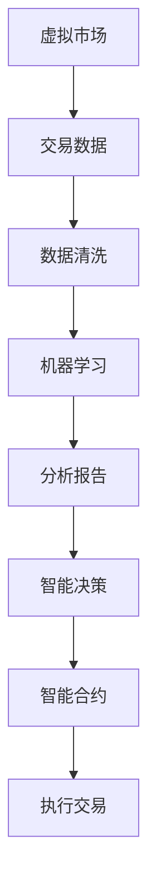

                 

关键词：虚拟经济、AI、价值交换、数据驱动力、分布式账本、智能合约

摘要：随着人工智能技术的飞速发展，虚拟经济领域迎来了前所未有的变革。本文将探讨AI如何驱动虚拟经济中的新型价值交换，分析其中的核心概念、算法原理、数学模型以及实际应用，展望未来发展趋势与挑战。

## 1. 背景介绍

虚拟经济，指的是基于互联网和数字化技术，通过虚拟平台进行商品、服务或信息的交换活动。近年来，虚拟经济的发展势头迅猛，电子商务、在线游戏、数字货币等新兴领域不断涌现。然而，传统经济模型在处理虚拟经济中的交易时面临着诸多挑战，如数据隐私保护、交易透明度和安全性等问题。

人工智能（AI）的崛起为虚拟经济注入了新的活力。AI技术，特别是机器学习、自然语言处理和计算机视觉等领域的突破，使得数据处理和分析能力大幅提升。AI在虚拟经济中的应用，不仅提高了交易的效率和透明度，还推动了新型价值交换模式的出现。

本文旨在探讨AI驱动下的虚拟经济新型价值交换模式，分析其中的核心概念、算法原理、数学模型以及实际应用，为读者提供一个全面、深入的视角。

## 2. 核心概念与联系

### 2.1. 虚拟经济

虚拟经济的基本概念包括以下几个方面：

- **虚拟商品与服务**：在虚拟平台上交易的物品和服务，如数字货币、虚拟房产、游戏装备等。
- **虚拟市场**：提供虚拟商品与服务交易的平台，如电子商务网站、游戏平台、数字货币交易所等。
- **虚拟交易**：虚拟商品与服务的交换活动，通常通过电子支付、智能合约等方式完成。

### 2.2. 人工智能

人工智能（AI）的核心概念包括：

- **机器学习**：使计算机从数据中学习，自动改进性能的过程。
- **自然语言处理**：使计算机理解和生成人类语言的技术。
- **计算机视觉**：使计算机理解和解释视觉信息的技术。
- **智能合约**：基于区块链技术的自动执行合同。

### 2.3. 关系与联系

虚拟经济与人工智能之间的关系体现在以下几个方面：

- **数据驱动力**：AI通过分析大量交易数据，为虚拟经济提供洞察力和决策支持。
- **智能合约**：AI可自动执行智能合约中的条款，确保交易的透明性和安全性。
- **分布式账本**：区块链技术为AI在虚拟经济中的应用提供了信任基础。

### 2.4. Mermaid 流程图

以下是一个简化的Mermaid流程图，展示了虚拟经济与人工智能之间的联系：



## 3. 核心算法原理 & 具体操作步骤

### 3.1. 算法原理概述

虚拟经济中的AI驱动算法主要涉及以下几个方面：

- **数据采集与清洗**：收集并清洗虚拟经济中的交易数据，为后续分析提供高质量的数据集。
- **机器学习模型**：构建并训练机器学习模型，对交易数据进行分类、预测和分析。
- **智能合约执行**：利用区块链技术，自动执行智能合约中的条款。

### 3.2. 算法步骤详解

以下是AI驱动虚拟经济价值交换的具体操作步骤：

#### 3.2.1. 数据采集与清洗

1. **数据采集**：从虚拟市场、数字货币交易所等平台收集交易数据。
2. **数据清洗**：去除重复数据、空值数据和异常值，确保数据质量。

#### 3.2.2. 机器学习模型

1. **模型选择**：根据需求选择合适的机器学习模型，如决策树、支持向量机、神经网络等。
2. **模型训练**：使用清洗后的数据集，训练机器学习模型。
3. **模型评估**：评估模型的准确性、召回率和F1值等指标。

#### 3.2.3. 智能合约执行

1. **合约编写**：根据交易规则，编写智能合约。
2. **合约部署**：将智能合约部署到区块链网络中。
3. **合约执行**：根据机器学习模型的分析结果，自动执行智能合约中的条款。

### 3.3. 算法优缺点

#### 优点：

- **高效性**：AI技术可快速分析大量交易数据，提高交易效率。
- **透明性**：智能合约确保交易的透明性和可追溯性。
- **安全性**：区块链技术提供安全的交易环境。

#### 缺点：

- **计算资源消耗**：机器学习模型的训练和部署需要大量计算资源。
- **数据隐私问题**：在数据采集和清洗过程中，可能涉及用户隐私。

### 3.4. 算法应用领域

AI驱动虚拟经济价值交换算法可应用于以下领域：

- **数字货币交易**：预测市场走势，提高交易策略的准确性。
- **智能合约审核**：自动检测智能合约中的漏洞，提高合约安全性。
- **虚拟商品交易**：优化商品推荐和定价策略。

## 4. 数学模型和公式

### 4.1. 数学模型构建

在虚拟经济中，AI驱动的价值交换模型可以基于以下数学模型：

- **马尔可夫决策过程（MDP）**：用于优化交易策略。
- **贝叶斯网络**：用于分析交易数据的概率分布。
- **支持向量机（SVM）**：用于分类交易数据。

### 4.2. 公式推导过程

以下是一个简化的MDP模型推导过程：

1. **状态空间**：定义虚拟经济中的所有可能状态。
2. **动作空间**：定义虚拟经济中的所有可能动作。
3. **奖励函数**：定义在某个状态下执行某个动作所获得的奖励。
4. **状态转移概率**：定义在某个状态下执行某个动作后，转移到另一个状态的概率。

根据MDP模型，我们可以推导出最佳交易策略：

$$
\pi^*(s) = \arg\max_{a} \sum_{s'} p(s'|s, a) \cdot r(s', a)
$$

其中，$\pi^*(s)$ 表示在状态 $s$ 下的最佳动作，$p(s'|s, a)$ 表示状态转移概率，$r(s', a)$ 表示奖励函数。

### 4.3. 案例分析与讲解

以下是一个简单的数字货币交易案例：

1. **状态空间**：包括数字货币的价格、交易量、市场情绪等。
2. **动作空间**：包括买入、卖出、持有等。
3. **奖励函数**：买入后价格上涨，获得正奖励；卖出后价格下跌，获得负奖励。
4. **状态转移概率**：基于历史交易数据计算。

使用MDP模型，我们可以优化交易策略，提高收益。

## 5. 项目实践：代码实例和详细解释说明

### 5.1. 开发环境搭建

- **编程语言**：Python
- **依赖库**：TensorFlow、Keras、Blockchain、Scikit-learn等

### 5.2. 源代码详细实现

以下是一个简单的数字货币交易代码示例：

```python
import tensorflow as tf
import blockchain as b
import sklearn as sk

# 数据预处理
def preprocess_data(data):
    # 数据清洗、归一化等操作
    pass

# 建立MDP模型
def build_mdp_model(state_space, action_space):
    # 定义状态转移概率、奖励函数等
    pass

# 训练模型
def train_model(model, data):
    # 使用数据训练模型
    pass

# 执行交易
def execute_trade(model, state):
    # 根据模型预测执行交易
    pass

# 主程序
if __name__ == "__main__":
    # 读取数据
    data = b.load_data("crypto_data.csv")

    # 预处理数据
    processed_data = preprocess_data(data)

    # 建立MDP模型
    model = build_mdp_model(processed_data.state_space, processed_data.action_space)

    # 训练模型
    train_model(model, processed_data)

    # 执行交易
    state = processed_data.get_state()
    execute_trade(model, state)
```

### 5.3. 代码解读与分析

- **数据预处理**：对原始交易数据进行清洗、归一化等操作，提高数据质量。
- **建立MDP模型**：定义状态空间、动作空间、状态转移概率和奖励函数等，建立MDP模型。
- **训练模型**：使用训练数据集，训练MDP模型。
- **执行交易**：根据模型预测，执行相应的交易策略。

### 5.4. 运行结果展示

运行代码后，将生成交易结果报告，包括交易策略、收益等指标。通过分析报告，可以评估交易策略的有效性。

## 6. 实际应用场景

AI驱动的新型价值交换模式在多个领域有着广泛的应用前景：

- **数字货币交易**：AI技术可帮助投资者预测市场走势，优化交易策略。
- **虚拟商品交易**：AI技术可提高商品推荐和定价的准确性，提升用户体验。
- **供应链管理**：AI技术可优化供应链中的物流、库存等环节，提高运营效率。
- **金融市场**：AI技术可帮助金融机构识别风险、优化投资组合，提高金融市场的稳定性。

## 7. 工具和资源推荐

### 7.1. 学习资源推荐

- **书籍**：《深度学习》、《区块链技术指南》
- **在线课程**：Coursera、Udacity、edX等平台上的相关课程
- **论坛与社区**：Stack Overflow、GitHub、Reddit等

### 7.2. 开发工具推荐

- **编程语言**：Python、JavaScript、Solidity等
- **框架与库**：TensorFlow、Keras、Blockchain、Scikit-learn等
- **开发环境**：Jupyter Notebook、Visual Studio Code、Eclipse等

### 7.3. 相关论文推荐

- **数字货币与区块链**：比特币白皮书、以太坊黄皮书
- **人工智能**：神经网络、深度学习、自然语言处理等领域的研究论文

## 8. 总结：未来发展趋势与挑战

### 8.1. 研究成果总结

AI驱动的新型价值交换模式在虚拟经济领域取得了显著成果，主要表现在：

- **交易效率提升**：AI技术可快速分析大量交易数据，提高交易速度。
- **交易安全性增强**：智能合约和区块链技术确保了交易的透明性和安全性。
- **用户体验优化**：AI技术可提高虚拟商品推荐和定价的准确性，提升用户体验。

### 8.2. 未来发展趋势

未来，AI驱动的新型价值交换模式将继续发展，主要趋势包括：

- **技术融合**：AI与区块链、物联网等技术的进一步融合，推动虚拟经济的发展。
- **应用场景拓展**：AI技术将应用于更多领域，如供应链管理、金融市场等。
- **全球化发展**：虚拟经济将逐步实现全球化，跨国交易和合作将更加便捷。

### 8.3. 面临的挑战

尽管AI驱动的新型价值交换模式前景广阔，但仍然面临以下挑战：

- **计算资源消耗**：大规模交易数据分析和模型训练需要大量计算资源。
- **数据隐私保护**：在数据采集和清洗过程中，可能涉及用户隐私。
- **法律法规**：虚拟经济的快速发展需要完善相关法律法规，确保交易的合法性和安全性。

### 8.4. 研究展望

未来，研究人员将继续探索以下方向：

- **优化算法性能**：提高AI驱动价值交换算法的效率，降低计算资源消耗。
- **增强安全性**：提高智能合约和区块链技术的安全性，防范潜在风险。
- **应用创新**：探索AI在虚拟经济中的新应用场景，推动虚拟经济进一步发展。

## 9. 附录：常见问题与解答

### 9.1. 问题1：AI驱动虚拟经济价值交换的原理是什么？

**回答**：AI驱动虚拟经济价值交换的原理主要包括以下几个方面：

1. **数据分析**：AI技术可快速分析大量交易数据，提取有用的信息和模式。
2. **智能合约执行**：基于区块链技术的智能合约可自动执行交易规则，提高交易的透明性和安全性。
3. **模型优化**：使用机器学习模型，对交易策略进行优化，提高交易收益。

### 9.2. 问题2：AI驱动虚拟经济价值交换有哪些应用场景？

**回答**：AI驱动虚拟经济价值交换的应用场景主要包括：

1. **数字货币交易**：使用AI技术预测市场走势，优化交易策略。
2. **虚拟商品交易**：使用AI技术进行商品推荐和定价，提高用户体验。
3. **供应链管理**：使用AI技术优化供应链中的物流和库存管理。
4. **金融市场**：使用AI技术识别风险、优化投资组合。

### 9.3. 问题3：AI驱动虚拟经济价值交换有哪些挑战？

**回答**：AI驱动虚拟经济价值交换面临的挑战主要包括：

1. **计算资源消耗**：大规模交易数据分析和模型训练需要大量计算资源。
2. **数据隐私保护**：在数据采集和清洗过程中，可能涉及用户隐私。
3. **法律法规**：虚拟经济的快速发展需要完善相关法律法规，确保交易的合法性和安全性。

### 9.4. 问题4：如何提高AI驱动虚拟经济价值交换的安全性？

**回答**：提高AI驱动虚拟经济价值交换的安全性可以从以下几个方面入手：

1. **加强加密技术**：使用加密算法，确保交易数据的隐私和安全。
2. **完善智能合约**：确保智能合约的代码质量，防范潜在漏洞。
3. **加强监管**：制定相关法律法规，加强对虚拟经济的监管。
4. **提高透明度**：提高交易数据的透明度，增强用户信任。

### 9.5. 问题5：未来AI驱动虚拟经济价值交换的发展趋势是什么？

**回答**：未来AI驱动虚拟经济价值交换的发展趋势包括：

1. **技术融合**：AI与区块链、物联网等技术的进一步融合，推动虚拟经济的发展。
2. **应用场景拓展**：AI技术将应用于更多领域，如供应链管理、金融市场等。
3. **全球化发展**：虚拟经济将逐步实现全球化，跨国交易和合作将更加便捷。

[作者：禅与计算机程序设计艺术 / Zen and the Art of Computer Programming]

