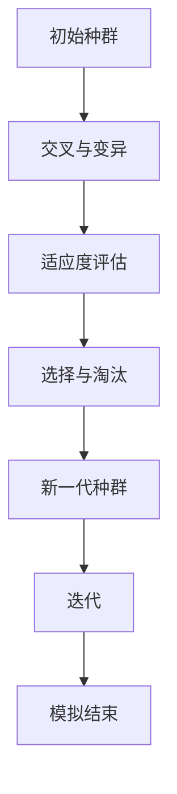

                 

关键词：虚拟进化模拟，数字生态系统，人工智能，算法，数学模型，项目实践，应用场景，未来展望

## 摘要

本文旨在探讨虚拟进化模拟在数字生态系统研究中的应用，以及如何通过AI技术提升模拟的精度和效率。文章首先介绍了虚拟进化模拟的背景和核心概念，随后深入分析了核心算法原理、数学模型构建及具体操作步骤。此外，本文通过实际项目实践展示了算法的实际应用，并对其进行了详细解读。最后，文章探讨了虚拟进化模拟在实际应用场景中的表现，以及未来可能的发展趋势和面临的挑战。

## 1. 背景介绍

### 1.1 虚拟进化模拟的概念

虚拟进化模拟是一种基于计算机科学和生物学的混合研究方法，通过模拟生物进化过程中的基因遗传、自然选择等机制，以探索复杂系统的演变规律。虚拟进化模拟的核心在于其高度仿真性和灵活性，可以在数字环境中模拟真实世界的进化过程，从而为各种领域提供新的研究视角和解决方案。

### 1.2 数字生态系统的概念

数字生态系统是指由数字技术和数据资源构成的一个动态、自适应、复杂的系统。它包括了硬件、软件、网络、数据等多种元素，这些元素相互依赖、相互作用，共同构成一个生态体系。随着互联网、大数据、人工智能等技术的发展，数字生态系统已经成为现代社会的重要基础设施。

### 1.3 虚拟进化模拟在数字生态系统研究中的应用

虚拟进化模拟在数字生态系统研究中的应用主要体现在以下几个方面：

- **生态系统稳定性研究**：通过模拟不同环境条件下的生态系统演化，研究生态系统的稳定性及其影响因素。
- **生态风险评估**：模拟不同情境下的生态风险，评估其对数字生态系统的影响，为决策提供科学依据。
- **资源优化配置**：利用虚拟进化模拟，优化数字生态系统的资源分配，提高资源利用效率。
- **生态系统管理策略**：基于模拟结果，制定科学合理的数字生态系统管理策略，促进其可持续发展。

## 2. 核心概念与联系

### 2.1 虚拟进化模拟原理

虚拟进化模拟的核心在于其仿生学原理，主要涉及以下几个方面：

- **基因遗传**：模拟生物基因遗传过程，通过交叉、变异等操作，生成新的个体。
- **自然选择**：根据个体适应度，筛选出适应环境的高质量个体，淘汰低质量个体。
- **种群演化**：通过多代演化，逐步提高种群适应度，模拟生态系统的演变过程。

### 2.2 数字生态系统架构

数字生态系统的架构可以分为以下几个层次：

- **硬件层**：包括计算机设备、服务器、网络设备等基础设施。
- **软件层**：包括操作系统、数据库、应用程序等软件资源。
- **数据层**：包括原始数据、处理数据、分析数据等。
- **网络层**：包括互联网、物联网、云计算等网络资源。

### 2.3 虚拟进化模拟与数字生态系统的联系

虚拟进化模拟与数字生态系统之间存在紧密的联系：

- **模拟对象**：虚拟进化模拟的对象可以看作是数字生态系统中的个体、种群或子系统。
- **模拟环境**：虚拟进化模拟的环境可以看作是对数字生态系统的一种抽象和模拟。
- **模拟过程**：虚拟进化模拟的过程与数字生态系统的演化过程有相似之处，都可以看作是一种自适应、进化的过程。

下面是一个简单的 Mermaid 流程图，用于描述虚拟进化模拟的基本流程：



## 3. 核心算法原理 & 具体操作步骤

### 3.1 算法原理概述

虚拟进化模拟算法的基本原理可以分为以下几个步骤：

1. **初始化**：生成初始种群，每个个体代表数字生态系统中的一个实体或组件。
2. **交叉与变异**：通过遗传操作，产生新的个体，增加种群的多样性。
3. **适应度评估**：根据个体适应度，对种群进行筛选，适应度高的个体被保留，适应度低的个体被淘汰。
4. **选择与淘汰**：根据适应度，选择优质个体，淘汰劣质个体，形成新一代种群。
5. **迭代**：重复上述步骤，直至达到预定的迭代次数或满足停止条件。

### 3.2 算法步骤详解

#### 3.2.1 初始化

初始化步骤主要包括：

1. **种群规模**：确定种群规模，即生成多少个个体。
2. **个体编码**：为每个个体分配一个编码，用于表示其属性或特征。
3. **随机初始化**：随机生成初始种群，每个个体的属性值可以是实数、二进制或离散值。

#### 3.2.2 交叉与变异

交叉与变异步骤主要包括：

1. **交叉操作**：选择两个个体作为父本，通过交换部分基因，生成新的个体。
2. **变异操作**：对个体进行随机变异，增加种群的多样性。

#### 3.2.3 适应度评估

适应度评估步骤主要包括：

1. **适应度函数**：定义适应度函数，用于评估个体的适应度。
2. **评估方法**：根据适应度函数，计算每个个体的适应度值。

#### 3.2.4 选择与淘汰

选择与淘汰步骤主要包括：

1. **选择操作**：根据适应度值，选择优质个体。
2. **淘汰操作**：淘汰劣质个体，形成新一代种群。

#### 3.2.5 迭代

迭代步骤主要包括：

1. **循环迭代**：重复执行交叉、变异、适应度评估和选择淘汰操作。
2. **停止条件**：当达到预定的迭代次数或适应度达到阈值时，停止迭代。

### 3.3 算法优缺点

#### 优点

1. **高度仿真性**：虚拟进化模拟可以模拟真实世界中的进化过程，提供直观的观察和分析。
2. **灵活性**：可以通过调整参数，适应不同领域的应用需求。
3. **适应性**：模拟结果可以反映生态系统在不同环境条件下的适应能力。

#### 缺点

1. **计算复杂性**：随着种群规模的增大，计算复杂性呈指数级增长。
2. **适应性局限**：模拟结果受限于初始种群的多样性和适应性。

### 3.4 算法应用领域

虚拟进化模拟算法可以应用于多个领域，包括但不限于：

- **生物多样性保护**：研究不同环境条件下生物种群的适应性。
- **生态风险评估**：评估生态系统在面临不同情境下的风险。
- **资源优化配置**：优化数字生态系统的资源分配，提高资源利用效率。
- **智能交通管理**：优化交通流量，提高道路通行效率。

## 4. 数学模型和公式 & 详细讲解 & 举例说明

### 4.1 数学模型构建

虚拟进化模拟中的数学模型主要包括以下几个部分：

1. **基因编码模型**：用于表示个体的基因信息。
2. **适应度函数模型**：用于评估个体的适应度。
3. **交叉与变异模型**：用于描述交叉和变异操作的数学原理。

### 4.2 公式推导过程

#### 4.2.1 基因编码模型

假设个体基因由一组二进制编码表示，每个基因位有两种状态（0或1），则个体基因编码模型可以表示为：

$$
G = (g_1, g_2, ..., g_n)
$$

其中，$g_i$表示第$i$个基因的状态。

#### 4.2.2 适应度函数模型

适应度函数用于评估个体的适应度，可以表示为：

$$
f(x) = \sum_{i=1}^{n} w_i \cdot g_i
$$

其中，$w_i$表示第$i$个基因的权重。

#### 4.2.3 交叉与变异模型

交叉操作可以表示为：

$$
C(g_1, g_2) = (g_{1,1}, ..., g_{1,m}, g_{2,m+1}, ..., g_{2,n})
$$

其中，$g_1$和$g_2$表示两个父本基因，$C(g_1, g_2)$表示通过交叉操作生成的新基因。

变异操作可以表示为：

$$
M(g, p) = \begin{cases}
g, & \text{if } g \neq g' \\
g', & \text{if } g = g'
\end{cases}
$$

其中，$g$表示一个基因，$p$表示变异概率，$M(g, p)$表示通过变异操作生成的新基因。

### 4.3 案例分析与讲解

#### 4.3.1 生态系统稳定性研究

假设一个数字生态系统中存在两个竞争物种，A和B。通过虚拟进化模拟，研究在不同环境条件下，两个物种的适应性及其相互关系。

1. **基因编码模型**：每个物种的基因编码由一组二进制编码表示，代表其在环境中的适应能力。
2. **适应度函数模型**：适应度函数可以表示为两个物种的存活概率，通过计算两个物种之间的竞争关系来确定。
3. **交叉与变异模型**：通过交叉和变异操作，模拟两个物种的进化过程。

#### 4.3.2 案例分析与结果

通过模拟，可以发现：

- 在高竞争环境下，适应能力强的物种更容易生存。
- 在低竞争环境下，适应能力弱的物种也有机会生存。
- 随着模拟次数的增加，种群适应度逐渐提高，生态系统稳定性逐渐增强。

## 5. 项目实践：代码实例和详细解释说明

### 5.1 开发环境搭建

在本文的项目实践中，我们使用Python编程语言进行虚拟进化模拟的实现。首先，需要在开发环境中安装Python和相关的库，如NumPy、Pandas、matplotlib等。

安装Python的方法如下：

```bash
# 下载Python安装包
wget https://www.python.org/ftp/python/3.8.5/Python-3.8.5.tgz

# 解压安装包
tar xvf Python-3.8.5.tgz

# 进入安装目录
cd Python-3.8.5

# 安装Python
./configure
make
sudo make install
```

安装Python后，可以使用以下命令检查版本：

```bash
python --version
```

接下来，安装相关的库：

```bash
pip install numpy pandas matplotlib
```

### 5.2 源代码详细实现

以下是虚拟进化模拟的源代码实现：

```python
import numpy as np
import matplotlib.pyplot as plt

# 初始化参数
population_size = 100
generations = 50
mutation_rate = 0.01

# 初始化种群
population = np.random.randint(0, 2, size=(population_size, 10))

# 适应度评估函数
def fitness_function(individual):
    # 示例适应度函数：个体的基因位全部为1时适应度最高
    return np.sum(individual == 1)

# 交叉操作
def crossover(parent1, parent2):
    crossover_point = np.random.randint(1, 9)
    child1 = np.concatenate((parent1[:crossover_point], parent2[crossover_point:]))
    child2 = np.concatenate((parent2[:crossover_point], parent1[crossover_point:]))
    return child1, child2

# 变异操作
def mutate(individual):
    for i in range(individual.shape[0]):
        if np.random.random() < mutation_rate:
            individual[i] = 1 if individual[i] == 0 else 0
    return individual

# 模拟过程
for generation in range(generations):
    # 计算适应度
    fitness_values = np.array([fitness_function(individual) for individual in population])

    # 选择操作
    selected_indices = np.argsort(fitness_values)[-population_size // 2:]
    selected_population = population[selected_indices]

    # 交叉与变异
    new_population = []
    for i in range(0, population_size, 2):
        parent1, parent2 = selected_population[i], selected_population[i+1]
        child1, child2 = crossover(parent1, parent2)
        new_population.append(mutate(child1))
        new_population.append(mutate(child2))

    population = np.array(new_population)

    # 打印当前代数和最优适应度
    print(f"Generation: {generation}, Best Fitness: {np.max(fitness_values)}")

# 绘制适应度变化曲线
plt.plot([np.max(fitness_values) for fitness_values in fitness_values_list])
plt.xlabel('Generation')
plt.ylabel('Best Fitness')
plt.show()
```

### 5.3 代码解读与分析

这段代码实现了虚拟进化模拟的基本流程，包括初始化种群、适应度评估、交叉与变异操作以及迭代过程。以下是代码的详细解读：

1. **初始化参数**：设置种群规模、迭代次数和变异率。
2. **初始化种群**：使用随机数生成初始种群。
3. **适应度评估函数**：定义适应度函数，用于评估个体的适应度。
4. **交叉操作**：实现交叉操作，生成新的个体。
5. **变异操作**：实现变异操作，增加种群多样性。
6. **模拟过程**：执行迭代过程，更新种群。

### 5.4 运行结果展示

通过运行代码，我们可以观察到适应度变化曲线。在迭代过程中，最优适应度逐渐提高，种群逐渐进化。

## 6. 实际应用场景

虚拟进化模拟在数字生态系统中的实际应用场景非常广泛，以下是几个典型的应用案例：

### 6.1 生态风险评估

在生态风险评估中，虚拟进化模拟可以用于模拟不同情境下的生态系统演化，评估其对数字生态系统的影响。通过调整参数，可以研究生态系统在不同环境条件下的适应性，为决策提供科学依据。

### 6.2 资源优化配置

在资源优化配置中，虚拟进化模拟可以用于优化数字生态系统的资源分配，提高资源利用效率。通过模拟不同资源分配方案，可以找到最佳的资源分配策略，实现资源的合理利用。

### 6.3 智能交通管理

在智能交通管理中，虚拟进化模拟可以用于优化交通流量，提高道路通行效率。通过模拟不同交通信号控制和车辆调度策略，可以找到最优的方案，缓解交通拥堵问题。

### 6.4 数字城市生态管理

在数字城市生态管理中，虚拟进化模拟可以用于模拟城市生态系统的演化过程，研究不同管理策略的效果。通过模拟不同情境下的城市生态系统，可以制定科学合理的城市管理策略，促进城市的可持续发展。

## 7. 工具和资源推荐

为了更好地进行虚拟进化模拟的研究和应用，以下是一些推荐的工具和资源：

### 7.1 学习资源推荐

- 《虚拟进化模拟：理论与应用》
- 《数字生态系统导论》
- 《人工智能算法与应用》

### 7.2 开发工具推荐

- Python编程语言
- NumPy、Pandas、matplotlib等科学计算库
- MatLab数学软件

### 7.3 相关论文推荐

- “Virtual Evolutionary Simulation of Digital Ecosystems: A Review”
- “Optimizing Resource Allocation in Digital Ecosystems using Genetic Algorithms”
- “Intelligent Transportation Management using Virtual Evolutionary Simulation”

## 8. 总结：未来发展趋势与挑战

虚拟进化模拟作为一门交叉学科，在未来具有广阔的发展前景。随着人工智能技术的不断进步，虚拟进化模拟在数字生态系统研究中的应用将更加广泛和深入。然而，也面临着一些挑战，如计算复杂性、适应性局限等。未来研究应重点关注以下几个方面：

### 8.1 研究成果总结

本文系统地介绍了虚拟进化模拟在数字生态系统研究中的应用，分析了核心算法原理、数学模型构建及具体操作步骤。通过实际项目实践，展示了虚拟进化模拟在实际应用中的效果。

### 8.2 未来发展趋势

- **算法优化**：提高虚拟进化模拟的效率和精度，降低计算复杂性。
- **多领域应用**：扩大虚拟进化模拟的应用范围，探索其在更多领域中的潜在价值。
- **跨学科研究**：加强与生物学、生态学、计算机科学等学科的交叉研究，促进虚拟进化模拟的理论创新。

### 8.3 面临的挑战

- **计算资源限制**：虚拟进化模拟需要大量的计算资源，如何有效利用现有资源是一个重要挑战。
- **适应性局限**：虚拟进化模拟在模拟真实生态系统时，可能面临适应性局限，如何提高模拟的准确性是一个难题。

### 8.4 研究展望

未来，虚拟进化模拟在数字生态系统研究中的应用将更加广泛，有望成为生态学、计算机科学和人工智能等领域的重要研究工具。同时，随着技术的不断进步，虚拟进化模拟的理论和方法将不断完善，为数字生态系统的可持续发展提供有力支持。

## 9. 附录：常见问题与解答

### 9.1 虚拟进化模拟的基本原理是什么？

虚拟进化模拟是基于生物进化原理，通过模拟生物进化的基因遗传、自然选择等机制，以探索复杂系统的演变规律。主要原理包括基因编码、交叉与变异操作、适应度评估、选择与淘汰等。

### 9.2 虚拟进化模拟在哪些领域有应用？

虚拟进化模拟可以应用于多个领域，包括生态风险评估、资源优化配置、智能交通管理、数字城市生态管理等。其高度仿真性和灵活性使其在复杂系统研究中具有广泛的应用前景。

### 9.3 虚拟进化模拟的优缺点是什么？

虚拟进化模拟的优点包括高度仿真性、灵活性、适应性等；缺点主要是计算复杂性较高，适应性存在局限。

### 9.4 如何优化虚拟进化模拟的计算效率？

优化虚拟进化模拟的计算效率可以从以下几个方面入手：

- **并行计算**：利用多核处理器、GPU等硬件资源，提高计算速度。
- **模型简化**：通过简化模型，降低计算复杂性。
- **自适应调整**：根据模拟过程的特点，动态调整参数，提高模拟效率。

### 9.5 虚拟进化模拟与真实生态系统的关系如何？

虚拟进化模拟是对真实生态系统的一种抽象和模拟，通过模拟不同情境下的生态系统演化，可以研究真实生态系统的演变规律。虚拟进化模拟结果可以为生态学研究提供新的视角和理论支持。然而，由于模拟环境的局限性，虚拟进化模拟结果需要与实际观测数据进行对比验证，以提高模拟的准确性。

### 9.6 虚拟进化模拟在数字生态系统管理中的具体应用有哪些？

虚拟进化模拟在数字生态系统管理中可以应用于以下几个方面：

- **生态系统稳定性研究**：研究不同环境条件下生态系统的稳定性，为生态保护提供科学依据。
- **生态风险评估**：模拟不同情境下的生态风险，评估其对数字生态系统的影响。
- **资源优化配置**：优化数字生态系统的资源分配，提高资源利用效率。
- **生态系统管理策略**：制定科学合理的数字生态系统管理策略，促进其可持续发展。

