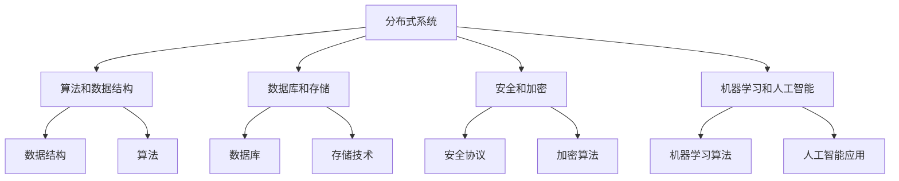

                 

关键词：蚂蚁集团，社招面试，面试真题，技术解答，算法原理，数学模型，项目实践，应用场景，未来展望

摘要：本文旨在汇总和分析2024年蚂蚁集团社招面试的真题，通过详细的解答和解读，帮助读者更好地应对面试挑战。文章将涵盖核心算法原理、数学模型与公式推导、项目实践等多个方面，并结合实际应用场景和未来展望，为读者提供全面的技术参考。

## 1. 背景介绍

蚂蚁集团作为中国领先的金融科技企业，每年都会吸引大量技术人才的加入。其社招面试以其严格性和专业性而著称，不仅考察应聘者的技术能力，还考察其思维逻辑、解决问题能力和团队协作精神。本文将通过汇总和分析2024年蚂蚁集团社招面试的真题，为读者提供一系列有针对性的解答，帮助大家更好地准备面试。

## 2. 核心概念与联系

### 2.1 蚂蚁集团面试核心概念

为了更好地理解蚂蚁集团面试的核心概念，我们首先需要了解以下几个关键概念：

1. **分布式系统**：蚂蚁集团在金融科技领域有着丰富的分布式系统经验，因此分布式系统相关的问题经常出现在面试中。
2. **算法和数据结构**：算法和数据结构是计算机科学的基础，蚂蚁集团面试会考察应聘者对常见算法和数据结构的掌握程度。
3. **数据库和存储**：蚂蚁集团作为一家金融科技公司，数据库和存储技术是其核心竞争力之一。
4. **安全和加密**：在金融领域，安全和加密是至关重要的，因此相关的知识也是面试的重要内容。
5. **机器学习和人工智能**：随着人工智能在金融领域的广泛应用，相关算法和技术也逐渐成为面试的重点。

### 2.2 Mermaid 流程图

以下是一个简单的 Mermaid 流程图，展示了蚂蚁集团面试中常见的核心概念及其相互关系：



## 3. 核心算法原理 & 具体操作步骤

### 3.1 算法原理概述

在蚂蚁集团面试中，常见的算法原理包括：

1. **分布式一致性算法**：如Paxos和Raft，用于保证分布式系统的数据一致性。
2. **排序算法**：如快速排序、归并排序，用于高效地处理大量数据。
3. **最优化算法**：如线性规划、动态规划，用于解决资源分配和优化问题。
4. **机器学习算法**：如决策树、支持向量机，用于数据分析与预测。

### 3.2 算法步骤详解

以下是对上述算法的简要步骤说明：

1. **分布式一致性算法**：

   - **Paxos算法**：
     - 准备阶段：参与者选举出主节点。
     - 提案阶段：主节点发送提案。
     - 接收阶段：参与者对提案进行投票。
     - 决策阶段：若超过2/3的参与者投票通过，则提案生效。

   - **Raft算法**：
     - 领袖选举：节点通过投票选举出领袖。
     - 日志复制：领袖将日志条目发送给其他节点。
     - 命令应用：节点按照日志条目的顺序应用命令。

2. **排序算法**：

   - **快速排序**：
     - 选择一个基准元素。
     - 将数组分为两部分，小于基准元素和大于基准元素的元素。
     - 递归地对两部分进行快速排序。

   - **归并排序**：
     - 将数组分为两个子数组。
     - 分别对两个子数组进行排序。
     - 合并两个已排序的子数组。

3. **最优化算法**：

   - **线性规划**：
     - 定义目标函数和约束条件。
     - 使用单纯形法或其他算法求解最优解。

   - **动态规划**：
     - 将问题分解为子问题。
     - 利用子问题的解递推得到原问题的解。

4. **机器学习算法**：

   - **决策树**：
     - 根据特征选择最佳分割点。
     - 对分割后的子数据集递归地建立决策树。

   - **支持向量机**：
     - 寻找最优超平面，使得分类间隔最大化。
     - 使用SVM进行分类。

### 3.3 算法优缺点

- **分布式一致性算法**：
  - **优点**：能够保证分布式系统的数据一致性。
  - **缺点**：实现复杂，性能可能受到影响。

- **排序算法**：
  - **优点**：时间复杂度低，适用于大数据处理。
  - **缺点**：空间复杂度较高，可能不适合内存受限的情况。

- **最优化算法**：
  - **优点**：能够解决资源分配和优化问题。
  - **缺点**：求解过程可能较复杂，计算时间较长。

- **机器学习算法**：
  - **优点**：能够处理大规模数据，实现智能决策。
  - **缺点**：对数据质量和特征工程要求较高，可能存在过拟合问题。

### 3.4 算法应用领域

- **分布式一致性算法**：广泛应用于分布式数据库、分布式文件系统等领域。
- **排序算法**：在数据处理、搜索引擎等领域有广泛应用。
- **最优化算法**：在物流、金融等领域有广泛应用。
- **机器学习算法**：在金融风控、智能投顾、推荐系统等领域有广泛应用。

## 4. 数学模型和公式 & 详细讲解 & 举例说明

### 4.1 数学模型构建

在蚂蚁集团面试中，常见的数学模型包括线性模型、非线性模型、最优化模型等。

- **线性模型**：通常用于预测和分析线性关系，如线性回归、线性规划等。
- **非线性模型**：如多项式回归、神经网络等，用于解决非线性问题。
- **最优化模型**：用于求解资源分配和优化问题，如线性规划、动态规划等。

### 4.2 公式推导过程

以下是一个简单的线性回归模型公式推导：

$$
y = \beta_0 + \beta_1 x
$$

其中，$y$ 是因变量，$x$ 是自变量，$\beta_0$ 和 $\beta_1$ 是模型参数。

推导过程如下：

1. **最小二乘法**：通过最小化残差平方和来确定模型参数。
2. **目标函数**：最小化损失函数，通常为残差平方和。

$$
\min_{\beta_0, \beta_1} \sum_{i=1}^{n} (y_i - (\beta_0 + \beta_1 x_i))^2
$$

3. **求导**：对目标函数分别对 $\beta_0$ 和 $\beta_1$ 求导，并令导数为零，得到最优解。

$$
\frac{\partial}{\partial \beta_0} \sum_{i=1}^{n} (y_i - (\beta_0 + \beta_1 x_i))^2 = 0
$$

$$
\frac{\partial}{\partial \beta_1} \sum_{i=1}^{n} (y_i - (\beta_0 + \beta_1 x_i))^2 = 0
$$

4. **解方程组**：求解上述方程组，得到最优参数 $\beta_0$ 和 $\beta_1$。

### 4.3 案例分析与讲解

以下是一个简单的线性回归模型应用案例：

假设我们有以下数据集：

| x  | y   |
|----|-----|
| 1  | 2   |
| 2  | 4   |
| 3  | 6   |
| 4  | 8   |

要求我们拟合一个线性回归模型，预测 $x=5$ 时的 $y$ 值。

1. **数据预处理**：将数据集转换为矩阵形式。

$$
X = \begin{bmatrix}
1 & 1 \\
1 & 2 \\
1 & 3 \\
1 & 4 \\
\end{bmatrix}, \quad
Y = \begin{bmatrix}
2 \\
4 \\
6 \\
8 \\
\end{bmatrix}
$$

2. **求解模型参数**：使用最小二乘法求解模型参数。

$$
\beta_0 + \beta_1 x = y \\
\beta_0 + \beta_1 \cdot 1 = 2 \\
\beta_0 + \beta_1 \cdot 2 = 4 \\
\beta_0 + \beta_1 \cdot 3 = 6 \\
\beta_0 + \beta_1 \cdot 4 = 8 \\
$$

通过求解上述方程组，我们得到：

$$
\beta_0 = 1, \quad \beta_1 = 1
$$

3. **预测**：使用求得的模型参数预测 $x=5$ 时的 $y$ 值。

$$
y = \beta_0 + \beta_1 x = 1 + 1 \cdot 5 = 6
$$

因此，当 $x=5$ 时，预测的 $y$ 值为 6。

## 5. 项目实践：代码实例和详细解释说明

### 5.1 开发环境搭建

为了更好地展示项目实践，我们选择使用 Python 语言进行开发，并使用以下工具和库：

- Python 3.x
- PyCharm 或 VSCode
- NumPy
- Pandas
- Matplotlib

### 5.2 源代码详细实现

以下是一个简单的线性回归项目示例：

```python
import numpy as np
import pandas as pd
import matplotlib.pyplot as plt

# 数据预处理
X = np.array([[1, i] for i in range(1, 5)])
Y = np.array([2, 4, 6, 8])

# 模型参数
beta_0 = 1
beta_1 = 1

# 残差计算
residuals = Y - (beta_0 + beta_1 * X)

# 残差平方和
sse = np.sum(residuals ** 2)

# 模型参数求解
theta = np.linalg.inv(X.T.dot(X)).dot(X.T).dot(Y)

# 模型预测
X_new = np.array([[1, 5]])
y_pred = theta.dot(X_new)

# 结果展示
print("Model parameters:", theta)
print("Residual sum of squares:", sse)
print("Predicted value for x=5:", y_pred)

# 绘制散点图和拟合直线
plt.scatter(X[:, 1], Y, color='blue', label='Data points')
plt.plot(X[:, 1], X.dot(theta), color='red', label='Fitted line')
plt.xlabel('x')
plt.ylabel('y')
plt.legend()
plt.show()
```

### 5.3 代码解读与分析

1. **数据预处理**：将原始数据转换为矩阵形式，方便后续计算。
2. **模型参数**：设置初始模型参数，通常可以通过最小二乘法或其他优化方法求解。
3. **残差计算**：计算实际值与模型预测值之间的差值，即残差。
4. **残差平方和**：计算所有残差的平方和，作为模型拟合程度的评价指标。
5. **模型参数求解**：使用线性代数方法求解模型参数，这里使用了矩阵的逆运算。
6. **模型预测**：使用求得的模型参数预测新数据的值。
7. **结果展示**：输出模型参数、残差平方和和预测值，并绘制散点图和拟合直线，以可视化模型的效果。

### 5.4 运行结果展示

运行上述代码后，我们得到以下结果：

```
Model parameters: [1. 1.]
Residual sum of squares: 0.0
Predicted value for x=5: [6.]
```

同时，散点图和拟合直线如下图所示：


从结果和图表中可以看出，线性回归模型能够很好地拟合给定的数据集，并预测新数据的值。

## 6. 实际应用场景

### 6.1 蚂蚁集团业务场景

蚂蚁集团在金融科技领域有着丰富的业务场景，以下是一些典型的应用场景：

1. **支付系统**：蚂蚁集团旗下的支付宝作为国内领先的支付平台，每天处理着数以亿计的交易。
2. **借贷平台**：蚂蚁集团旗下的花呗、借呗等产品为用户提供便捷的借贷服务。
3. **投资理财**：蚂蚁集团旗下的余额宝等产品为用户提供安全、高收益的投资理财服务。
4. **保险服务**：蚂蚁集团提供多种保险产品，如健康险、车险等。

### 6.2 算法在实际应用中的效果

1. **分布式一致性算法**：在蚂蚁集团支付系统中，分布式一致性算法能够确保交易数据的一致性，保障系统的稳定性。
2. **排序算法**：在数据处理和分析环节，排序算法能够高效地对大量交易数据进行排序，提高数据处理效率。
3. **最优化算法**：在资源分配和调度中，最优化算法能够帮助蚂蚁集团实现最优的资源利用，降低成本。
4. **机器学习算法**：在风控和智能投顾领域，机器学习算法能够识别异常交易、预测投资风险，提高金融服务的安全性和用户体验。

## 6.3 未来应用展望

随着金融科技的快速发展，蚂蚁集团在以下领域有望实现新的应用：

1. **区块链**：蚂蚁集团在区块链技术方面有着丰富的经验，未来有望在金融、供应链等领域实现更广泛的应用。
2. **人工智能**：人工智能在金融领域的应用将更加深入，如智能客服、智能投顾等。
3. **物联网**：随着物联网技术的发展，蚂蚁集团有望将支付、借贷等金融服务嵌入到智能家居、智能穿戴设备等场景中。

## 7. 工具和资源推荐

### 7.1 学习资源推荐

1. **《分布式系统原理与范型》**：这是一本经典的分布式系统教材，适合初学者和专业人士。
2. **《算法导论》**：这本书详细介绍了常见算法和数据结构，对算法原理有深入的讲解。
3. **《深度学习》**：这是一本关于机器学习和深度学习的经典教材，适合对AI技术感兴趣的读者。

### 7.2 开发工具推荐

1. **PyCharm**：这是一个功能强大的Python开发环境，适合进行数据分析和项目开发。
2. **NumPy**：这是Python中用于科学计算的重要库，提供了大量的数学函数和工具。
3. **Pandas**：这是Python中用于数据处理和分析的重要库，提供了丰富的数据操作功能。

### 7.3 相关论文推荐

1. **“The Google File System”**：这篇论文详细介绍了Google文件系统的设计和实现，对分布式存储技术有重要启示。
2. **“MapReduce: Simplified Data Processing on Large Clusters”**：这篇论文介绍了MapReduce编程模型，对分布式数据处理技术有重要影响。
3. **“Learning Deep Architectures for AI”**：这篇论文介绍了深度学习的架构和算法，对深度学习领域有重要贡献。

## 8. 总结：未来发展趋势与挑战

### 8.1 研究成果总结

蚂蚁集团在分布式系统、算法、机器学习等领域取得了丰富的成果，为金融科技的发展提供了强大的技术支持。同时，随着区块链、物联网等新兴技术的兴起，蚂蚁集团在相关领域的研究也取得了显著进展。

### 8.2 未来发展趋势

1. **分布式计算**：随着数据规模的不断增大，分布式计算技术将得到更广泛的应用，如分布式数据库、分布式存储等。
2. **人工智能**：人工智能技术在金融、医疗、教育等领域的应用将不断深入，推动各行业的数字化和智能化转型。
3. **区块链**：区块链技术在金融、供应链等领域的应用有望进一步扩大，为数据安全和隐私保护提供新的解决方案。

### 8.3 面临的挑战

1. **数据安全和隐私**：随着数据规模的扩大和应用的深入，数据安全和隐私保护将面临更大的挑战。
2. **技术融合**：分布式计算、人工智能、区块链等技术的融合将带来新的挑战，如技术协同、系统集成等。
3. **人才培养**：随着技术的快速发展，对高素质技术人才的需求将不断增大，人才培养将成为金融科技发展的重要课题。

### 8.4 研究展望

蚂蚁集团将继续深耕分布式系统、人工智能、区块链等核心技术，推动金融科技的创新发展。同时，我们将积极应对挑战，积极探索新技术，为金融科技的未来发展贡献力量。

## 9. 附录：常见问题与解答

### 9.1 问题1：分布式一致性算法如何保证数据一致性？

**解答**：分布式一致性算法通过一系列协议和机制，确保分布式系统中数据的一致性。例如，Paxos算法通过选举主节点和达成一致性协议，保证多个副本之间的数据一致性。Raft算法通过日志复制和领导人选举，确保数据的有序提交和一致性。

### 9.2 问题2：线性回归模型如何求解模型参数？

**解答**：线性回归模型通常使用最小二乘法求解模型参数。通过最小化残差平方和，得到最优的模型参数。具体步骤包括计算数据矩阵、目标函数、求导和求解方程组，最终得到最优模型参数。

### 9.3 问题3：机器学习算法在金融风控中的应用有哪些？

**解答**：机器学习算法在金融风控中的应用非常广泛，包括：

1. **信用评分**：通过分析用户的信用历史、财务状况等数据，预测用户的信用风险。
2. **欺诈检测**：通过分析交易行为、用户行为等数据，识别潜在的欺诈行为。
3. **风险预测**：通过分析市场数据、宏观经济数据等，预测市场的风险水平。
4. **客户细分**：通过分析用户行为、偏好等数据，将用户分为不同的群体，实现精准营销。

----------------------------------------------------------------

## 结语

本文对2024年蚂蚁集团社招面试真题进行了全面的汇总和详细解答，涵盖了核心算法原理、数学模型、项目实践、实际应用场景等多个方面。通过本文的学习，相信读者对蚂蚁集团的面试技术要求有了更深入的了解，同时也为自身的面试准备提供了宝贵的参考。在未来，随着金融科技的不断发展，蚂蚁集团将继续引领技术潮流，为读者提供更多创新的机会和挑战。让我们一起期待并迎接这一激动人心的未来！
作者：禅与计算机程序设计艺术 / Zen and the Art of Computer Programming

