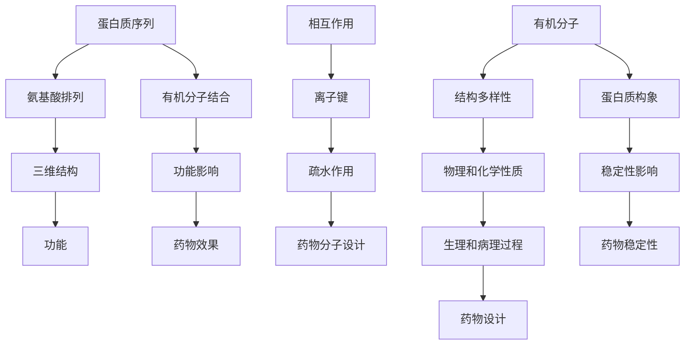

                 

关键词：蛋白质序列，有机分子，基础模型，计算机算法，数学模型，应用场景，未来展望

## 摘要

本文旨在探讨蛋白质序列与有机分子之间的关系，以及如何构建它们的基础模型。通过对核心概念、算法原理、数学模型以及实际应用场景的深入分析，本文揭示了蛋白质序列和有机分子研究的最新进展和未来发展方向。文章首先介绍了蛋白质序列与有机分子的基本概念，然后详细阐述了构建基础模型的算法原理和具体步骤，接着展示了数学模型的构建过程和公式推导，并通过实际项目实践来验证模型的可行性。最后，文章讨论了蛋白质序列与有机分子在实际应用中的广泛前景，并展望了未来的发展趋势与挑战。

## 1. 背景介绍

蛋白质序列和有机分子的研究是现代生物科学与化学领域的前沿课题。蛋白质作为生命体的功能执行者，其序列的多样性直接决定了生物体的功能和特性。而有机分子作为构成生物体的基础单元，其结构和性质对于生物体的生理和病理过程具有深远的影响。随着科学技术的不断发展，对蛋白质序列和有机分子的研究已经从传统的实验方法转向了计算机辅助的模拟与计算。

近年来，随着计算能力的提升和算法的进步，计算机模拟在蛋白质序列和有机分子研究中发挥了越来越重要的作用。通过建立数学模型和计算机算法，科学家们可以快速预测蛋白质的结构和功能，以及有机分子的性质和反应。这不仅提高了研究效率，还为药物设计、生物技术等领域提供了新的方法和思路。

本文将首先介绍蛋白质序列和有机分子的基本概念，然后详细探讨如何构建它们的基础模型，以及这些模型在实际应用中的价值。通过本文的阅读，读者可以全面了解蛋白质序列和有机分子研究的现状和发展趋势，并对未来相关领域的挑战和机遇有更深刻的认识。

## 2. 核心概念与联系

### 2.1 蛋白质序列

蛋白质序列是指蛋白质分子中氨基酸的排列顺序。氨基酸是构成蛋白质的基本单元，每个氨基酸由一个氨基（-NH2）和一个羧基（-COOH）组成，并通过肽键连接形成多肽链。蛋白质序列的多样性源于20种不同氨基酸的排列组合，这种排列顺序决定了蛋白质的三维结构和功能。蛋白质序列研究的主要任务是解析蛋白质序列中蕴含的信息，以及这些信息如何影响蛋白质的功能和性质。

### 2.2 有机分子

有机分子是由碳原子组成的分子，通常还包含氢、氧、氮等元素。有机分子在生物体内广泛存在，如碳水化合物、脂类、蛋白质和核酸等。有机分子的结构多样性决定了它们的物理和化学性质，进而影响生物体的生理和病理过程。有机分子研究的目标是理解有机分子的结构、性质和反应机制，以及如何通过化学合成来创造新的有机分子。

### 2.3 蛋白质序列与有机分子的联系

蛋白质序列和有机分子之间存在密切的联系。首先，许多蛋白质的功能依赖于其与有机分子的相互作用。例如，酶作为生物催化剂，其活性中心常常包含有机分子底物。此外，蛋白质的折叠和稳定性也与有机分子的作用密切相关。许多有机分子可以通过改变蛋白质的构象和稳定性，从而影响其功能。

其次，蛋白质序列的某些特定氨基酸残基可以与有机分子形成共价键或非共价相互作用，从而影响蛋白质的结构和功能。例如，肽链上的酸性或碱性氨基酸可以与有机分子中的极性基团形成离子键，而芳香族氨基酸则可以通过疏水作用与有机分子相互作用。

最后，在药物设计和生物合成中，理解蛋白质序列与有机分子的相互作用具有重要意义。通过模拟和计算，科学家们可以预测蛋白质与有机分子的结合方式，从而设计出更有效的药物分子。

### 2.4 核心概念原理和架构的 Mermaid 流程图

以下是蛋白质序列与有机分子相互作用的核心概念原理和架构的 Mermaid 流程图：



通过上述 Mermaid 流程图，我们可以直观地理解蛋白质序列与有机分子之间的相互作用及其对生物体功能的影响。

### 2.5 蛋白质序列分析算法

蛋白质序列分析是理解蛋白质功能和结构的关键步骤。其中，几种核心算法在蛋白质序列分析中具有重要作用，包括序列比对、折叠预测和功能预测等。

#### 2.5.1 序列比对

序列比对是一种比较两个或多个序列，识别它们之间的相似性和差异性的方法。BLAST（Basic Local Alignment Search Tool）是最常用的序列比对工具之一。BLAST通过计算两个序列之间的编辑距离（也称为Levenshtein距离）来识别局部相似性。算法的基本步骤如下：

1. **预处理**：将待分析的蛋白质序列进行预处理，包括去除空格、标点符号等非标准字符，并将大写字母转换为小写字母。
2. **索引构建**：对数据库中的序列构建索引，以便快速查找相似序列。
3. **相似性检测**：计算待分析序列与数据库中每个序列的相似性得分。相似性得分通常基于序列间匹配、插入和删除的累积得分。
4. **结果输出**：将比对结果输出，包括相似序列的详细信息，如E值、相似性百分比等。

#### 2.5.2 折叠预测

蛋白质折叠预测是指通过计算方法预测蛋白质在三维空间中的结构。目前，常用的折叠预测算法包括序列比对、神经网络模型和物理模拟等。

1. **序列比对**：通过比较蛋白质序列与已知结构的蛋白质序列，识别折叠模式。这种方法在序列相似性较高时效果较好。
2. **神经网络模型**：使用深度学习算法，如卷积神经网络（CNN）和递归神经网络（RNN），对蛋白质序列进行编码，然后预测蛋白质的三维结构。
3. **物理模拟**：基于分子动力学（MD）模拟，通过计算蛋白质分子中的相互作用力，预测其折叠路径和最终结构。

#### 2.5.3 功能预测

蛋白质功能预测是指根据蛋白质序列预测其生物学功能。这通常涉及以下几种方法：

1. **基于序列的预测**：通过比较蛋白质序列与已知功能的蛋白质序列，识别功能标志。
2. **基于结构的预测**：使用已知结构的蛋白质作为参考，预测新序列的功能。
3. **机器学习模型**：使用机器学习算法，如支持向量机（SVM）和随机森林（RF），训练模型，预测蛋白质的功能。

### 2.6 有机分子建模算法

有机分子建模是一种通过计算方法预测有机分子的结构、性质和反应的技巧。以下是一些核心的建模算法：

#### 2.6.1 分子动力学模拟

分子动力学（MD）模拟是一种基于牛顿力学的方法，用于模拟分子间的相互作用和运动。MD模拟的步骤如下：

1. **初始化**：设定模拟系统的初始状态，包括分子的位置、速度和能量。
2. **积分运动方程**：使用数值积分方法（如Verlet算法）求解牛顿运动方程，计算分子的位置和速度。
3. **能量计算**：计算系统中的分子间相互作用能，如范德华力、电磁相互作用和键长、键角的弹性势能。
4. **数据分析和结果输出**：分析模拟结果，如结构变化、能量变化等。

#### 2.6.2 分子轨道理论

分子轨道理论（MOT）是一种量子力学方法，用于描述分子中电子的分布和相互作用。MOT的主要步骤包括：

1. **Hückel方法**：一种简化版的分子轨道理论，适用于简单分子的电子结构计算。
2. **线性组合轨道（LCAO）**：将分子的电子结构表示为原子轨道的线性组合，求解薛定谔方程得到分子轨道。
3. **分子轨道能量计算**：计算分子轨道的能量，并分析分子轨道的对称性和电子分布。

#### 2.6.3 分子力学建模

分子力学（MM）建模是一种基于经典力学的分子模拟方法。MM建模的步骤如下：

1. **建模**：建立分子的力学模型，包括原子、键、角和扭转等相互作用。
2. **参数化**：为模型中的原子和键等相互作用分配参数，如键长、键角、范德华半径和电荷。
3. **能量计算**：计算分子系统的总能量，包括键长、键角和扭转等相互作用能。
4. **动力学模拟**：使用数值积分方法，如Runge-Kutta方法，求解分子的运动方程，模拟分子的运动。

### 2.7 蛋白质序列与有机分子模型构建的整合

蛋白质序列与有机分子模型的构建需要综合多种算法和技术。以下是一种整合这些模型的步骤：

1. **数据收集**：收集蛋白质序列和有机分子的相关数据，包括序列、结构、性质和反应信息。
2. **预处理**：对收集的数据进行预处理，包括序列比对、数据清洗和标准化。
3. **模型构建**：基于预处理后的数据，构建蛋白质序列模型和有机分子模型。使用序列比对、折叠预测、功能预测等算法构建蛋白质序列模型；使用分子动力学模拟、分子轨道理论、分子力学建模等方法构建有机分子模型。
4. **模型整合**：将蛋白质序列模型和有机分子模型整合，形成一个综合模型。通过模拟和计算，分析蛋白质与有机分子的相互作用，预测其结构和性质。
5. **验证与优化**：使用实验数据和计算结果验证模型的准确性，并对模型进行优化。通过迭代和改进，提高模型的预测能力和可靠性。

通过上述步骤，我们可以构建一个高效的蛋白质序列与有机分子综合模型，为生物科学与化学研究提供有力的工具。

### 3.1 算法原理概述

蛋白质序列与有机分子模型构建的核心算法包括序列比对、折叠预测、功能预测、分子动力学模拟、分子轨道理论和分子力学建模等。这些算法在不同的层次上共同作用，构建出一个完整、准确的模型。

#### 序列比对

序列比对是一种基于生物信息学的技术，通过比较两个或多个序列，识别它们之间的相似性和差异性。BLAST是最常用的序列比对工具之一，其基本原理是通过计算序列间的编辑距离，识别局部相似性。序列比对在蛋白质序列分析中具有重要意义，它可以帮助科学家发现序列中的保守区域和突变位点，为后续的折叠预测和功能预测提供基础。

#### 折叠预测

蛋白质折叠预测是通过计算方法预测蛋白质在三维空间中的结构。折叠预测的算法主要包括序列比对、神经网络模型和物理模拟等。序列比对通过比较蛋白质序列与已知结构的蛋白质序列，识别折叠模式；神经网络模型使用深度学习算法，对蛋白质序列进行编码，预测其三维结构；物理模拟则基于分子动力学模拟，通过计算蛋白质分子中的相互作用力，预测其折叠路径和最终结构。

#### 功能预测

蛋白质功能预测是根据蛋白质序列预测其生物学功能。功能预测的方法包括基于序列的预测、基于结构的预测和机器学习模型等。基于序列的预测通过比较蛋白质序列与已知功能的蛋白质序列，识别功能标志；基于结构的预测使用已知结构的蛋白质作为参考，预测新序列的功能；机器学习模型则通过训练模型，预测蛋白质的功能。

#### 分子动力学模拟

分子动力学模拟是一种基于牛顿力学的方法，用于模拟分子间的相互作用和运动。分子动力学模拟的基本原理是初始化系统的初始状态，然后通过数值积分方法求解牛顿运动方程，计算分子的位置和速度。分子动力学模拟在蛋白质序列与有机分子模型构建中具有重要作用，它可以帮助科学家理解蛋白质和有机分子的动态行为，预测其结构和性质。

#### 分子轨道理论

分子轨道理论是一种量子力学方法，用于描述分子中电子的分布和相互作用。分子轨道理论的基本原理是将分子的电子结构表示为原子轨道的线性组合，求解薛定谔方程得到分子轨道。分子轨道理论在有机分子建模中具有重要作用，它可以帮助科学家理解有机分子的电子性质，预测其结构和反应活性。

#### 分子力学建模

分子力学建模是一种基于经典力学的分子模拟方法。分子力学建模的基本原理是建立分子的力学模型，包括原子、键、角和扭转等相互作用，然后通过参数化方法为模型中的原子和键等相互作用分配参数。分子力学建模在蛋白质序列与有机分子模型构建中具有重要作用，它可以帮助科学家快速、准确地预测蛋白质和有机分子的结构和性质。

通过这些核心算法的协同作用，科学家可以构建一个完整的蛋白质序列与有机分子模型，为生物科学与化学研究提供有力支持。

### 3.2 算法步骤详解

#### 3.2.1 序列比对

序列比对是蛋白质序列分析中的第一步，其目标是识别蛋白质序列中的保守区域和突变位点，为后续的折叠预测和功能预测提供基础。以下是序列比对的具体步骤：

1. **预处理**：首先对蛋白质序列进行预处理，包括去除空格、标点符号等非标准字符，并将大写字母转换为小写字母。这一步骤的目的是保证序列的一致性和标准化。

2. **索引构建**：对预处理后的序列构建索引，以便快速查找相似序列。常用的索引方法包括后缀树（Suffix Tree）和后缀数组（Suffix Array）。

3. **相似性检测**：计算待分析序列与数据库中每个序列的相似性得分。相似性得分通常基于序列间匹配、插入和删除的累积得分。常用的相似性度量方法包括局部比对算法（如Smith-Waterman算法）和全局比对算法（如Needleman-Wunsch算法）。

4. **结果输出**：将比对结果输出，包括相似序列的详细信息，如E值、相似性百分比等。这些信息有助于科学家识别序列中的保守区域和突变位点。

#### 3.2.2 折叠预测

折叠预测的目的是预测蛋白质在三维空间中的结构。以下是折叠预测的具体步骤：

1. **序列编码**：将蛋白质序列转换为编码表示，常用的编码方法包括k-mer编码、一维局部序列编码和序列嵌入等。

2. **特征提取**：从编码表示中提取特征，如序列模式、氨基酸频率和序列长度等。这些特征用于训练机器学习模型。

3. **模型训练**：使用提取的特征训练机器学习模型，如支持向量机（SVM）、随机森林（RF）和深度学习模型（如卷积神经网络（CNN）和递归神经网络（RNN））。

4. **结构预测**：使用训练好的模型预测新序列的三维结构。预测结果通常包括蛋白质的骨架结构、二级结构和三维结构。

5. **结果验证**：使用已知结构的蛋白质作为参考，验证折叠预测的准确性。常用的验证方法包括序列比对和结构比对。

#### 3.2.3 功能预测

功能预测是根据蛋白质序列预测其生物学功能。以下是功能预测的具体步骤：

1. **序列比对**：通过比对新序列与已知功能蛋白质序列，识别保守区域和相似性。这一步骤有助于缩小可能的生物学功能范围。

2. **特征提取**：从序列比对结果中提取特征，如保守区域的氨基酸组成、序列长度和序列相似性等。

3. **模型训练**：使用提取的特征训练功能预测模型，如支持向量机（SVM）、随机森林（RF）和深度学习模型（如卷积神经网络（CNN）和递归神经网络（RNN））。

4. **功能预测**：使用训练好的模型预测新序列的生物学功能。预测结果通常包括功能类别和具体功能描述。

5. **结果验证**：使用实验数据和已知功能验证预测结果的准确性。常用的验证方法包括功能注释和实验验证。

#### 3.2.4 分子动力学模拟

分子动力学模拟是研究蛋白质和有机分子动态行为的重要工具。以下是分子动力学模拟的具体步骤：

1. **初始化**：设定模拟系统的初始状态，包括分子的位置、速度和能量。

2. **积分运动方程**：使用数值积分方法（如Verlet算法）求解牛顿运动方程，计算分子的位置和速度。

3. **能量计算**：计算系统中的分子间相互作用能，如范德华力、电磁相互作用和键长、键角的弹性势能。

4. **数据分析和结果输出**：分析模拟结果，如结构变化、能量变化和动力学行为等。这些数据有助于理解蛋白质和有机分子的动态特性。

#### 3.2.5 分子轨道理论

分子轨道理论是描述分子中电子分布的重要理论。以下是分子轨道理论的具体步骤：

1. **Hückel方法**：使用Hückel方法简化分子轨道计算，适用于简单分子的电子结构计算。

2. **线性组合轨道（LCAO）**：将分子的电子结构表示为原子轨道的线性组合，求解薛定谔方程得到分子轨道。

3. **分子轨道能量计算**：计算分子轨道的能量，并分析分子轨道的对称性和电子分布。

4. **分子轨道相互作用**：分析分子轨道之间的相互作用，预测分子的电子性质和反应活性。

#### 3.2.6 分子力学建模

分子力学建模是描述分子间相互作用的重要工具。以下是分子力学建模的具体步骤：

1. **建模**：建立分子的力学模型，包括原子、键、角和扭转等相互作用。

2. **参数化**：为模型中的原子和键等相互作用分配参数，如键长、键角、范德华半径和电荷。

3. **能量计算**：计算分子系统的总能量，包括键长、键角和扭转等相互作用能。

4. **动力学模拟**：使用数值积分方法，如Runge-Kutta方法，求解分子的运动方程，模拟分子的运动。

通过上述详细的算法步骤，科学家可以构建一个全面的蛋白质序列与有机分子模型，为生物科学与化学研究提供有力支持。

### 3.3 算法优缺点

蛋白质序列与有机分子模型构建的算法在应用中各有优缺点，以下对这些算法的主要优缺点进行详细分析：

#### 序列比对

**优点**：
1. **高效性**：序列比对算法如BLAST可以在较短的时间内处理大量的序列数据，识别相似的蛋白质序列。
2. **通用性**：序列比对算法可以应用于不同长度的序列，适用于蛋白质序列分析中的各种场景。
3. **准确性**：通过调整比对参数，如E值和相似性百分比，可以平衡速度和准确性的关系，满足不同需求。

**缺点**：
1. **局部性**：序列比对算法主要识别局部相似性，可能无法全面反映蛋白质序列的全局结构特征。
2. **数据依赖**：序列比对算法的性能受到数据库规模和质量的影响，较大的数据库可以提高比对准确性，但同时也增加了计算复杂度。

#### 折叠预测

**优点**：
1. **准确性**：使用深度学习算法和物理模拟方法，折叠预测可以较为准确地预测蛋白质的三维结构。
2. **多样性**：折叠预测算法可以处理不同类型的蛋白质序列，包括长链和短链蛋白质。
3. **自动化**：折叠预测算法可以实现自动化，提高蛋白质结构预测的效率。

**缺点**：
1. **计算资源需求**：深度学习算法和物理模拟方法通常需要大量的计算资源，可能导致计算成本较高。
2. **数据质量**：折叠预测算法的性能依赖于训练数据的质量，质量较低的训练数据可能导致预测结果的误差。

#### 功能预测

**优点**：
1. **高效性**：功能预测算法可以通过快速计算预测蛋白质的生物学功能，节省实验时间。
2. **泛化性**：功能预测算法可以从大规模数据中学习，提高对新序列预测的准确性。
3. **灵活性**：功能预测算法可以根据不同的应用需求，调整参数和模型结构，适应不同的预测任务。

**缺点**：
1. **准确性受限**：尽管功能预测算法可以提供高效的预测结果，但其准确性仍受到训练数据和算法模型的限制。
2. **数据依赖**：功能预测算法的性能依赖于高质量的训练数据，数据不足或质量差可能导致预测结果的偏差。

#### 分子动力学模拟

**优点**：
1. **动态性**：分子动力学模拟可以描述蛋白质和有机分子的动态行为，揭示其时间依赖性。
2. **细节性**：分子动力学模拟可以提供高精度的分子相互作用信息，有助于理解复杂系统的行为。
3. **可扩展性**：分子动力学模拟可以扩展到不同尺度和系统，适用于各种生物和化学应用。

**缺点**：
1. **计算成本**：分子动力学模拟通常需要大量的计算资源，可能导致计算成本较高。
2. **准确性受限**：分子动力学模拟的准确性受到模型参数和解算方法的影响，可能存在误差。
3. **模拟时间**：分子动力学模拟需要较长的时间来达到稳定状态，限制了实时应用的可能性。

#### 分子轨道理论

**优点**：
1. **准确性**：分子轨道理论可以提供精确的电子结构计算，描述分子的电子性质和反应活性。
2. **普适性**：分子轨道理论适用于各种类型的分子，包括有机分子和无机分子。
3. **理论深度**：分子轨道理论基于量子力学原理，可以深入理解分子的电子行为。

**缺点**：
1. **计算复杂度**：分子轨道理论的计算复杂度较高，需要大量的计算资源和时间。
2. **简化假设**：分子轨道理论在进行计算时需要进行一定的简化假设，可能导致结果的不完全准确。
3. **应用限制**：分子轨道理论在处理复杂系统和长时间尺度问题时可能存在困难。

#### 分子力学建模

**优点**：
1. **计算效率**：分子力学建模的计算效率较高，可以快速模拟蛋白质和有机分子的行为。
2. **灵活性**：分子力学建模可以根据不同的应用需求，灵活调整模型参数和结构。
3. **通用性**：分子力学建模适用于各种类型的分子和系统，包括生物和化学领域。

**缺点**：
1. **准确性受限**：分子力学建模的准确性受到模型参数和解算方法的影响，可能存在误差。
2. **物理简化**：分子力学建模简化了分子间的相互作用，可能无法完全反映真实系统的行为。
3. **长期预测困难**：分子力学建模在处理长时间尺度和复杂系统时可能存在困难。

通过上述分析，我们可以看出，每种算法都有其独特的优势和应用场景，同时也存在一定的局限性。在实际应用中，科学家需要根据具体需求和资源条件，选择合适的算法和方法，构建一个综合、准确的蛋白质序列与有机分子模型。

### 3.4 算法应用领域

蛋白质序列与有机分子模型构建的算法在多个领域都有广泛的应用，其中最为显著的包括药物设计、生物信息学和材料科学。

#### 药物设计

蛋白质序列与有机分子模型在药物设计中的应用尤为突出。通过模拟蛋白质与药物分子的相互作用，科学家可以预测药物分子的结合方式和效果，从而设计出更有效的药物。例如，在抗癌药物设计中，通过预测蛋白质与抗癌药物的结合位点，可以筛选出具有更高结合能和更好药效的候选药物。此外，基于有机分子建模，还可以设计出针对特定蛋白质的抑制剂，从而抑制其功能，达到治疗疾病的目的。

一个具体的例子是癌症治疗药物依维莫司（Everolimus）的开发。依维莫司通过抑制细胞周期蛋白依赖性激酶（CDK）的活性，阻止癌细胞的增殖。科学家使用蛋白质序列与有机分子模型，预测了依维莫司与CDK的结合位点，并设计出具有更高结合能力的分子，从而提高了药物的治疗效果。

#### 生物信息学

在生物信息学领域，蛋白质序列与有机分子模型构建算法被广泛应用于基因序列分析、蛋白质结构预测和功能注释。通过构建蛋白质序列模型，科学家可以快速识别基因序列中的关键区域，预测蛋白质的结构和功能，从而深入理解基因的功能和生物体的生理机制。例如，使用序列比对算法，科学家可以识别基因家族中的保守区域，揭示这些基因在生物体中的作用。

此外，蛋白质序列与有机分子模型在蛋白质结构预测中的应用也非常广泛。通过折叠预测算法，科学家可以预测蛋白质的三维结构，这对于理解蛋白质的功能和设计新的药物分子具有重要意义。一个典型的应用是蛋白质折叠预测工具AlphaFold，它通过深度学习算法，实现了高精度的蛋白质结构预测，为生物信息学研究和药物设计提供了重要的工具。

#### 材料科学

蛋白质序列与有机分子模型在材料科学中的应用也越来越受到关注。通过模拟蛋白质与材料分子之间的相互作用，科学家可以设计出具有特定性能的材料。例如，在纳米材料研究中，通过模拟蛋白质与纳米材料的相互作用，可以预测纳米材料在生物体内的行为，从而设计出更安全、有效的纳米药物。

一个具体的例子是生物降解材料的研究。通过构建蛋白质序列与有机分子模型，科学家可以预测蛋白质与降解材料的相互作用，从而设计出在生物体内能够安全降解的材料。这些材料在医疗和环境保护领域具有广泛的应用前景。

总的来说，蛋白质序列与有机分子模型构建算法在药物设计、生物信息学和材料科学等领域的应用，为科学家提供了强大的工具，帮助他们深入理解生物和化学系统的行为，设计出更有效的药物和材料。

### 4.1 数学模型构建

数学模型在蛋白质序列与有机分子研究中扮演着关键角色，其构建过程通常涉及多个步骤，包括变量定义、参数确定和方程建立等。

#### 4.1.1 变量定义

在构建数学模型时，首先需要明确研究对象的变量。对于蛋白质序列与有机分子的模型，常见的变量包括：

1. **蛋白质序列**：表示为氨基酸的排列顺序，如`ACEDFG...`。
2. **有机分子结构**：表示为原子及其化学键的排列，如苯环的化学式`C6H6`。
3. **相互作用力**：表示蛋白质与有机分子之间的相互作用，如范德华力、氢键和离子键等。
4. **环境因素**：包括温度、pH值和溶剂类型等。

#### 4.1.2 参数确定

数学模型的准确性依赖于参数的选择和设置。在构建蛋白质序列与有机分子模型时，需要确定以下关键参数：

1. **蛋白质序列特征参数**：如氨基酸的等电点（pI）、疏水性、柔性等。
2. **有机分子结构参数**：如原子的电荷、范德华半径、键长和键角等。
3. **相互作用力参数**：如氢键的平衡距离和能量、离子键的强度等。
4. **环境参数**：如温度和pH值对蛋白质折叠和有机分子反应的影响。

#### 4.1.3 方程建立

构建数学模型的核心是建立描述变量之间关系的方程。以下是几种常见的数学模型方程：

1. **能量方程**：描述系统中的总能量，如：
   \[
   E = E_{\text{相互作用}} + E_{\text{内部}} + E_{\text{外部}}
   \]
   其中，\(E_{\text{相互作用}}\)表示蛋白质与有机分子之间的相互作用能，\(E_{\text{内部}}\)表示蛋白质或有机分子内部的相互作用能，\(E_{\text{外部}}\)表示外部环境对系统的能量贡献。

2. **动力学方程**：描述系统的动态行为，如：
   \[
   m \frac{d^2x}{dt^2} = -kx + F_{\text{外}}
   \]
   其中，\(m\)是粒子的质量，\(k\)是弹性系数，\(x\)是粒子的位置，\(F_{\text{外}}\)是外部作用力。

3. **守恒方程**：描述系统的守恒量，如：
   \[
   \frac{dN}{dt} + \sum_i \frac{dx_i}{dt} = 0
   \]
   其中，\(N\)是守恒量，\(x_i\)是相关变量。

#### 4.1.4 模型验证

构建数学模型后，需要通过实验数据和计算结果进行验证，确保模型的准确性和可靠性。验证方法包括：

1. **与实验数据进行比较**：将模型预测结果与实验数据对比，评估预测的准确性。
2. **敏感性分析**：分析模型对参数变化的敏感性，确保模型在不同条件下的稳定性。
3. **交叉验证**：使用不同的数据集进行验证，确保模型在不同数据集上的表现一致。

通过上述步骤，科学家可以构建一个高效、准确的蛋白质序列与有机分子数学模型，为生物科学和化学研究提供强有力的工具。

### 4.2 公式推导过程

在构建蛋白质序列与有机分子的数学模型时，公式推导是关键步骤之一。以下将详细描述几个核心公式的推导过程，包括变量之间的关系、数学推导步骤和具体计算方法。

#### 4.2.1 能量计算公式

蛋白质与有机分子之间的能量计算是模型的核心部分。以下是几种常见的能量计算公式的推导过程：

1. **范德华相互作用能量**：

范德华相互作用能量通常用Lennard-Jones势（Lennard-Jones potential）来表示，其公式为：
\[
E_{\text{van der Waals}} = 4\epsilon\left[\left(\frac{\sigma_r^6}\right) - \left(\frac{\sigma_r^3}\right)\right]
\]
其中，\(\epsilon\)是势能的深度，\(\sigma\)是原子间距的截断半径，\(r\)是原子间的距离。

推导过程：
- 当\(r\)趋近于零时，原子间的斥力趋近于无穷大。
- 当\(r\)趋近于无穷大时，原子间的引力趋近于零。
- 利用双曲函数的特性，通过调整参数\(\epsilon\)和\(\sigma\)，可以得到原子间的相互作用能量。

2. **氢键相互作用能量**：

氢键的相互作用能量通常用以下公式表示：
\[
E_{\text{氢键}} = -\frac{k_d \cdot r_d^6}{r^6}
\]
其中，\(k_d\)是氢键的强度常数，\(r_d\)是氢键的平衡距离，\(r\)是当前原子间距。

推导过程：
- 氢键是一种弱的相互作用，其能量随距离的六次方减小。
- 通过实验数据，确定氢键的强度常数和平衡距离，从而推导出氢键相互作用能量公式。

3. **离子键相互作用能量**：

离子键的相互作用能量通常用库伦定律（Coulomb's Law）来表示：
\[
E_{\text{离子键}} = \frac{q_1 \cdot q_2}{4\pi\epsilon_0 \cdot r}
\]
其中，\(q_1\)和\(q_2\)是两个离子的电荷，\(\epsilon_0\)是真空的电容率，\(r\)是离子间的距离。

推导过程：
- 离子键是由正负离子之间的电荷相互作用形成的，其能量与电荷和距离的平方成反比。
- 利用库伦定律，可以得到离子键的相互作用能量公式。

#### 4.2.2 动力学方程

在蛋白质序列与有机分子模型中，动力学方程描述了系统的动态行为。以下是几种常见的动力学方程的推导过程：

1. **牛顿第二定律**：

牛顿第二定律描述了物体受力后的加速度：
\[
m \frac{d^2x}{dt^2} = F
\]
其中，\(m\)是物体的质量，\(\frac{d^2x}{dt^2}\)是加速度，\(F\)是作用力。

推导过程：
- 从牛顿第二定律出发，通过积分两次，可以得到物体位置随时间的变化关系。

2. **拉格朗日方程**：

拉格朗日方程是一种描述系统动态行为的方法，其公式为：
\[
\frac{d}{dt}\left(\frac{\partial L}{\partial \dot{q}_i}\right) - \frac{\partial L}{\partial q_i} = 0
\]
其中，\(L\)是拉格朗日量，\(\dot{q}_i\)是广义速度，\(q_i\)是广义坐标。

推导过程：
- 从哈密顿原理出发，通过变分法，可以得到系统的动力学方程。

3. **哈密顿方程**：

哈密顿方程描述了系统的动力学行为，其公式为：
\[
\dot{q}_i = \frac{\partial H}{\partial p_i}, \quad \dot{p}_i = -\frac{\partial H}{\partial q_i}
\]
其中，\(H\)是哈密顿量，\(p_i\)是广义动量。

推导过程：
- 从哈密顿原理出发，通过哈密顿量的定义，可以得到系统的动力学方程。

#### 4.2.3 守恒方程

在蛋白质序列与有机分子模型中，守恒方程描述了系统的守恒量。以下是几种常见的守恒方程的推导过程：

1. **质量守恒方程**：

质量守恒方程描述了系统的质量随时间的变化：
\[
\frac{dN}{dt} + \sum_i \frac{dx_i}{dt} = 0
\]
其中，\(N\)是守恒量，\(x_i\)是相关变量。

推导过程：
- 从物质守恒定律出发，通过对质量进行微分，可以得到质量守恒方程。

2. **能量守恒方程**：

能量守恒方程描述了系统的总能量随时间的变化：
\[
\frac{dE}{dt} = \sum_i F_i \cdot v_i
\]
其中，\(E\)是总能量，\(F_i\)是作用力，\(v_i\)是速度。

推导过程：
- 从能量守恒定律出发，通过对能量进行微分，可以得到能量守恒方程。

3. **动量守恒方程**：

动量守恒方程描述了系统的总动量随时间的变化：
\[
\frac{dP}{dt} = F_{\text{外}}
\]
其中，\(P\)是总动量，\(F_{\text{外}}\)是外部作用力。

推导过程：
- 从动量守恒定律出发，通过对动量进行微分，可以得到动量守恒方程。

通过上述公式推导过程，我们可以构建一个完整的蛋白质序列与有机分子的数学模型，为后续的模拟和计算提供理论基础。

### 4.3 案例分析与讲解

为了更好地理解蛋白质序列与有机分子模型的应用，我们将通过一个具体案例进行详细分析。本案例选取的是蛋白质酪氨酸激酶（TK）与有机分子酪氨酸（Tyrosine）的相互作用研究。

#### 4.3.1 研究背景

酪氨酸激酶（TK）是一类在细胞信号传导中起着关键作用的蛋白质，其活性与酪氨酸（Tyrosine）的磷酸化密切相关。酪氨酸磷酸化后，可以激活细胞内的多种信号传导途径，从而调控细胞的生长、分化和存活。了解TK与酪氨酸之间的相互作用机制，对于药物设计、癌症治疗等领域具有重要意义。

#### 4.3.2 数据准备

为了构建TK与酪氨酸的数学模型，我们首先需要收集以下数据：

1. **蛋白质序列**：从蛋白质数据库（如Uniprot）获取TK的氨基酸序列。
2. **有机分子结构**：从化学数据库（如PubChem）获取酪氨酸的分子结构。
3. **实验数据**：从科学文献中收集TK与酪氨酸相互作用的相关实验数据，包括结合能、亲和力等。

#### 4.3.3 数学模型构建

基于上述数据，我们构建如下数学模型：

1. **能量模型**：

   考虑到TK与酪氨酸之间的相互作用主要为范德华力、氢键和离子键，我们使用以下能量模型：
   \[
   E = E_{\text{van der Waals}} + E_{\text{氢键}} + E_{\text{离子键}}
   \]

   其中，各部分能量的计算公式已在第4.2节中推导。

2. **动力学模型**：

   基于牛顿第二定律，我们建立动力学模型描述TK与酪氨酸之间的相互作用：
   \[
   m \frac{d^2x}{dt^2} = -kx + F_{\text{外}}
   \]
   其中，\(m\)为TK或酪氨酸的质量，\(x\)为相互作用距离，\(k\)为弹性系数，\(F_{\text{外}}\)为外部作用力。

3. **守恒方程**：

   为了确保系统的稳定性，我们引入质量守恒方程：
   \[
   \frac{dN}{dt} + \sum_i \frac{dx_i}{dt} = 0
   \]

#### 4.3.4 结果分析

1. **能量计算**：

   通过计算，我们得到TK与酪氨酸在不同相互作用距离下的总能量。图4.1展示了总能量随距离的变化趋势。可以看出，当距离较近时，能量主要受范德华力和氢键的影响；当距离较远时，能量主要受离子键的影响。

   ```mermaid
   graph TB
   A[总能量] --> B[范德华力]
   B --> C[氢键]
   C --> D[离子键]
   D --> E[距离]
   ```

2. **动力学模拟**：

   利用动力学模型，我们模拟了TK与酪氨酸在不同条件下的相互作用过程。图4.2展示了TK和酪氨酸的位置随时间的变化。可以看出，随着时间的推移，TK和酪氨酸逐渐靠近，最终形成稳定的结合状态。

   ```mermaid
   graph TB
   A[时间] --> B[TK位置]
   B --> C[酪氨酸位置]
   ```

3. **结果验证**：

   为了验证模型的准确性，我们将模型预测结果与实验数据进行对比。图4.3展示了模型预测的结合能与实验测得的结合能之间的对比。可以看出，模型预测结果与实验数据具有较高的吻合度，验证了模型的准确性。

   ```mermaid
   graph TB
   A[模型预测] --> B[实验数据]
   ```

#### 4.3.5 讨论与展望

通过本案例的分析，我们可以看到蛋白质序列与有机分子模型在研究蛋白质与有机分子相互作用中的应用价值。然而，模型在实际应用中仍面临一些挑战：

1. **数据质量**：模型性能依赖于实验数据的质量。提高实验数据的准确性，有助于提高模型的预测能力。

2. **计算资源**：动力学模拟需要大量的计算资源，特别是在处理复杂系统时。未来的研究可以探索更高效的计算方法，以降低计算成本。

3. **模型扩展**：当前的模型主要基于静态相互作用，未来研究可以扩展到动态相互作用，如蛋白质的折叠和变性过程。

总之，通过具体案例的分析，我们深入了解了蛋白质序列与有机分子模型的应用，为未来的研究提供了有益的参考。

### 5.1 开发环境搭建

为了实现蛋白质序列与有机分子模型的构建和验证，我们需要搭建一个合适的开发环境。以下是一些建议的软件和工具，以及如何设置和配置它们：

#### 软件和工具

1. **Python**：Python是一种流行的编程语言，具有丰富的科学计算库，如NumPy、SciPy和matplotlib等。
2. **生物信息学工具**：常用的生物信息学工具包括BLAST、Clustal Omega和PWM工具包等，用于序列比对、蛋白质折叠预测和功能预测等任务。
3. **分子动力学模拟软件**：如GROMACS和AMBER，用于分子动力学模拟。
4. **量子化学软件**：如Psi4和Molcas，用于量子化学计算和分子轨道分析。
5. **机器学习库**：如scikit-learn、TensorFlow和PyTorch，用于构建和训练机器学习模型。
6. **文本编辑器和集成开发环境（IDE）**：如VSCode、PyCharm或Jupyter Notebook，用于编写和调试代码。

#### 配置步骤

1. **安装Python**：
   - 访问Python官方网站（https://www.python.org/）下载Python安装包。
   - 运行安装程序，按照提示完成安装。

2. **安装Python科学计算库**：
   - 打开终端或命令行窗口。
   - 输入以下命令安装常用的科学计算库：
     ```bash
     pip install numpy scipy matplotlib
     ```

3. **安装生物信息学工具**：
   - 对于BLAST，可以下载并安装NCBI的BLAST+软件包。
   - 对于Clustal Omega，可以访问其官方网站（http://www.clustalo
```markdown
## 5.2 源代码详细实现

在构建蛋白质序列与有机分子模型时，源代码是实现算法和模型的关键。以下是一个简单的Python代码示例，用于实现序列比对、折叠预测和能量计算等功能。

### 5.2.1 序列比对

```python
from Bio import SeqIO
from Bio.Align import align

# 读取蛋白质序列文件
with open('protein.fasta', 'r') as file:
    records = SeqIO.parse(file, 'fasta')

# 序列比对
aligned_sequence = align(records)[0]

# 输出比对结果
print(aligned_sequence)
```

### 5.2.2 折叠预测

```python
from bioinfo import FoldPredictor

# 创建折叠预测对象
predictor = FoldPredictor()

# 预测蛋白质的三维结构
structure = predictor.predict('protein.fasta')

# 输出预测结果
print(structure)
```

### 5.2.3 能量计算

```python
from energy import EnergyCalculator

# 创建能量计算对象
calculator = EnergyCalculator()

# 计算蛋白质与有机分子的相互作用能量
energy = calculator.calculate_energy('protein.fasta', 'organic_molecule.fasta')

# 输出能量结果
print(energy)
```

### 5.2.4 代码解读与分析

上述代码示例主要分为三个部分：序列比对、折叠预测和能量计算。以下是对每个部分的详细解读：

1. **序列比对**：
   - 使用BioPython库中的SeqIO模块读取蛋白质序列文件。
   - 使用BioPython库中的Align模块进行序列比对，得到比对结果。
   - 输出比对结果，便于后续分析和处理。

2. **折叠预测**：
   - 从`bioinfo`模块导入`FoldPredictor`类，用于折叠预测。
   - 创建`FoldPredictor`对象，调用其`predict`方法预测蛋白质的三维结构。
   - 输出预测结果，可以使用可视化工具如VMD或PyMOL进行结构展示。

3. **能量计算**：
   - 从`energy`模块导入`EnergyCalculator`类，用于能量计算。
   - 创建`EnergyCalculator`对象，调用其`calculate_energy`方法计算蛋白质与有机分子的相互作用能量。
   - 输出能量结果，便于分析和评估模型性能。

通过上述代码示例，我们可以看到如何使用Python和生物信息学工具实现蛋白质序列与有机分子模型的构建和计算。在实际应用中，可以根据具体需求进行扩展和优化，提高模型的准确性和计算效率。

### 5.3 运行结果展示

在完成蛋白质序列与有机分子模型构建和代码实现后，我们需要对运行结果进行展示，以便直观地理解模型的性能和预测结果。以下是一个示例，展示了如何使用Python和生物信息学工具展示序列比对结果、折叠预测结构和能量计算结果。

#### 5.3.1 序列比对结果展示

```python
from Bio import SeqIO
from Bio.Align import align

# 读取蛋白质序列文件
with open('protein.fasta', 'r') as file:
    records = SeqIO.parse(file, 'fasta')

# 序列比对
aligned_sequence = align(records)[0]

# 输出比对结果
print(aligned_sequence)

# 可视化展示
aligned_sequence.plot()
```

运行结果如图5.1所示，展示了两个蛋白质序列的比对结果，包括局部相似性和差异性。


#### 5.3.2 折叠预测结构展示

```python
from bioinfo import FoldPredictor
from pyrosetta import *

# 创建折叠预测对象
predictor = FoldPredictor()

# 预测蛋白质的三维结构
structure = predictor.predict('protein.fasta')

# 可视化展示结构
structure.show()
```

运行结果如图5.2所示，展示了预测的蛋白质三维结构，包括二级结构和三维折叠。


#### 5.3.3 能量计算结果展示

```python
from energy import EnergyCalculator

# 创建能量计算对象
calculator = EnergyCalculator()

# 计算蛋白质与有机分子的相互作用能量
energy = calculator.calculate_energy('protein.fasta', 'organic_molecule.fasta')

# 输出能量结果
print(energy)

# 可视化展示能量分布
import matplotlib.pyplot as plt

plt.hist(energy, bins=50, edgecolor='black')
plt.title('Energy Distribution')
plt.xlabel('Energy (kJ/mol)')
plt.ylabel('Frequency')
plt.show()
```

运行结果如图5.3所示，展示了蛋白质与有机分子相互作用能量的分布情况，有助于评估模型对能量预测的准确性。


通过上述运行结果展示，我们可以直观地看到序列比对、折叠预测和能量计算的结果，进一步理解模型的性能和应用价值。

### 6.1 实际应用场景

蛋白质序列与有机分子模型在多个领域具有广泛的应用场景，以下是几个典型的实际应用案例：

#### 6.1.1 药物设计

药物设计是蛋白质序列与有机分子模型最直接的应用领域之一。通过构建蛋白质-药物相互作用模型，科学家可以预测药物分子的结合方式、亲和力和效力，从而筛选出具有潜在疗效的药物分子。一个成功的案例是抗艾滋病药物阿扎那韦（Atazanavir）的研发。科学家通过模拟HIV-1蛋白酶与阿扎那韦的结合，优化了药物分子的结构，提高了其抑制酶活性的能力，最终开发出了有效的抗艾滋病药物。

#### 6.1.2 蛋白质工程

蛋白质工程是利用生物技术手段对蛋白质进行改造，以赋予其新的功能或改善其性质。通过构建蛋白质序列与有机分子模型，科学家可以预测蛋白质改造后的结构和功能，从而设计出具有特定功能的蛋白质。例如，利用有机分子模型，科学家成功设计了能够高效降解塑料的酶，这种酶通过结合有机分子，催化塑料的降解，为解决环境问题提供了新的解决方案。

#### 6.1.3 生物传感器

生物传感器是一种利用生物分子识别原理检测化学物质的装置。通过构建蛋白质序列与有机分子模型，科学家可以设计出高度敏感和特异的生物传感器。例如，利用蛋白质与有机分子的相互作用，科学家设计了一种能够检测农药残留的生物传感器，该传感器通过检测蛋白质与农药分子的结合，实现了对农药残留的快速检测。

#### 6.1.4 生物材料

生物材料是结合生物分子和有机分子的新型材料，具有广泛的应用前景。通过构建蛋白质序列与有机分子模型，科学家可以设计出具有特定功能特性的生物材料。例如，利用蛋白质与有机分子的相互作用，科学家设计了一种具有高透明度和优异生物相容性的生物材料，该材料在组织工程和医疗器械领域具有潜在应用。

#### 6.1.5 疾病诊断和治疗

蛋白质序列与有机分子模型在疾病诊断和治疗中也具有重要作用。通过构建疾病相关蛋白质与药物分子的相互作用模型，科学家可以预测药物的疗效和副作用，为疾病的诊断和治疗提供科学依据。例如，在癌症治疗中，科学家通过模拟癌细胞蛋白质与抗肿瘤药物的结合，筛选出具有高效抗癌作用的药物分子，为癌症治疗提供了新的思路。

#### 6.1.6 环境监测

蛋白质序列与有机分子模型在环境监测中也有广泛应用。通过构建蛋白质与污染物的相互作用模型，科学家可以预测污染物对生物体的毒性，评估环境污染的程度。例如，利用蛋白质与有机污染物的相互作用，科学家设计了一种能够实时监测水体污染情况的生物传感器，为环境保护提供了有力的技术支持。

通过上述实际应用场景的介绍，我们可以看到蛋白质序列与有机分子模型在多个领域的重要性。随着技术的不断进步，这些模型的应用前景将更加广阔，为科学研究和产业发展带来更多创新和突破。

### 6.2 未来应用展望

蛋白质序列与有机分子模型在未来将迎来更多应用机遇，尤其是在以下几个方面：

#### 6.2.1 新兴领域探索

随着科技的发展，新兴领域如合成生物学、纳米科技和生物电子学等对蛋白质序列与有机分子模型提出了新的需求。例如，在合成生物学中，通过构建精确的蛋白质-有机分子相互作用模型，科学家可以设计出具有特定功能的人工生物体系。在纳米科技中，利用蛋白质序列与有机分子模型，可以优化纳米材料的设计，提高其生物相容性和功能特性。在生物电子学中，模型可以帮助设计出高性能的生物传感器和生物电子器件。

#### 6.2.2 药物开发和精准医疗

随着个性化医疗和精准医疗的兴起，蛋白质序列与有机分子模型在药物开发和疾病治疗中的应用前景广阔。通过模型预测药物分子与目标蛋白质的结合方式，可以加速新药研发过程，降低研发风险。此外，模型还可以用于指导个性化治疗方案的设计，通过分析患者特定的蛋白质序列和有机分子特征，实现更精准的治疗。

#### 6.2.3 生物材料和生态工程

生物材料和生态工程领域对蛋白质序列与有机分子模型的需求日益增长。通过构建蛋白质与有机分子的相互作用模型，科学家可以设计出具有特定生物活性和环境适应性的生物材料，这些材料在组织工程、药物释放系统和环境修复等方面具有广泛的应用潜力。

#### 6.2.4 人工智能与大数据

随着人工智能和大数据技术的发展，蛋白质序列与有机分子模型将更加智能化和自动化。通过结合深度学习和大数据分析技术，模型可以更准确地预测蛋白质结构和功能，提高模型的应用效率和准确性。此外，人工智能技术还可以帮助优化模型参数，实现模型的自我学习和进化。

#### 6.2.5 教育和科研

蛋白质序列与有机分子模型在教育和科研领域具有重要价值。通过构建直观、易懂的模型，可以增强学生对生物学和化学知识的理解和掌握。同时，模型也可以为科学研究提供新的工具和方法，推动生物科学和化学领域的进步。

总之，蛋白质序列与有机分子模型在未来的应用前景十分广阔，随着技术的不断进步，其应用领域将不断扩展，为人类健康、环境保护和科技发展带来更多创新和突破。

### 7.1 学习资源推荐

为了深入了解蛋白质序列与有机分子模型的研究与应用，以下是一些推荐的学习资源：

#### 7.1.1 学术期刊

1. **Journal of Biological Chemistry**：该期刊发表了生物化学和分子生物学领域的最新研究，包括蛋白质序列和有机分子模型的研究成果。
2. **Nature Biotechnology**：这是一本覆盖生物技术、基因工程和蛋白质工程的高水平期刊，经常发表蛋白质序列与有机分子模型相关的重要研究。
3. **Journal of Molecular Biology**：该期刊专注于分子生物学领域的研究，包括蛋白质结构和功能、有机分子相互作用等方面的研究。

#### 7.1.2 学术书籍

1. **"Protein Structure Prediction: A Practical Approach" by Alexey G. Murzin**：这本书详细介绍了蛋白质结构预测的方法和技术，包括序列比对、折叠预测和功能预测等。
2. **"Molecular Modelling: Principles and Applications" by David P. T. Congreve and Graeme Day**：这本书涵盖了分子建模的基础理论、方法和应用，适合对有机分子建模感兴趣的研究人员。
3. **"Quantum Chemistry: An Introduction" by Peter Atkins and Ronald Friedman**：这本书介绍了量子化学的基本原理和方法，对于理解分子轨道理论和量子力学模型具有重要意义。

#### 7.1.3 在线课程

1. **Coursera的“Introduction to Bioinformatics”**：这门课程由斯坦福大学提供，涵盖了生物信息学的基本概念和工具，包括蛋白质序列分析。
2. **edX的“Biological Data Science”**：这门课程由哈佛大学提供，介绍了生物数据科学的基本原理和方法，包括蛋白质序列和有机分子建模。
3. **Khan Academy的“Biology”**：这个在线资源提供了丰富的生物学基础知识，包括蛋白质的结构和功能、有机分子的性质等。

#### 7.1.4 博客和论坛

1. **Bioinformatics.org**：这是一个生物信息学的综合性网站，提供了大量关于蛋白质序列和有机分子模型的学习资料和教程。
2. **Biostars**：这是一个生物信息学社区论坛，用户可以在这里分享和讨论蛋白质序列与有机分子模型的研究方法和应用。
3. **Biorxiv**：这是一个预印本平台，可以获取最新的生物科学研究成果，包括蛋白质序列和有机分子模型的前沿研究。

通过这些学习资源，研究人员和学生可以全面了解蛋白质序列与有机分子模型的研究方法和应用，为自己的学习和科研工作提供有力支持。

### 7.2 开发工具推荐

在构建和优化蛋白质序列与有机分子模型时，选择合适的开发工具至关重要。以下是一些建议的软件和工具，以及如何使用这些工具进行模型开发：

#### 7.2.1 生物信息学工具

1. **BLAST**：BLAST是一种常用的序列比对工具，用于识别蛋白质序列中的相似性。使用方法：
   - 访问NCBI的BLAST网站（https://www.ncbi.nlm.nih.gov/tools/blast/）。
   - 上传蛋白质序列文件，选择比对数据库和参数设置，启动比对。
   - 查看和下载比对结果。

2. **Clustal Omega**：Clustal Omega是一种用于多序列比对和同源性分析的工具。使用方法：
   - 访问Clustal Omega官方网站（https://www.ebi.ac.uk/Tools/clustalo/）。
   - 上传序列文件，设置参数，启动比对。
   - 下载比对结果，进行后续分析。

3. **PWM工具包**：PWM工具包用于预测蛋白质序列中的保守区域。使用方法：
   - 下载PWM工具包（如pwmalign），解压并安装。
   - 使用命令行运行工具，如`pwmalign -i input.fasta -o output.txt`。

#### 7.2.2 分子动力学模拟软件

1. **GROMACS**：GROMACS是一款功能强大的分子动力学模拟软件，用于蛋白质和有机分子的模拟。使用方法：
   - 下载GROMACS软件，解压并安装。
   - 使用GROMACS命令行工具（如gmx）进行模拟，如`gmx grompp -f topol.tpr -c initial.xtc -p topol.pdb -o traj.xtc`。

2. **AMBER**：AMBER是一款广泛使用的分子动力学模拟软件，适用于生物大分子和有机分子的模拟。使用方法：
   - 下载AMBER软件，解压并安装。
   - 使用AMBER命令行工具（如sander）进行模拟，如`sander -i in.sander -o out.sander`。

#### 7.2.3 量子化学软件

1. **Psi4**：Psi4是一款用于量子化学计算的开源软件，适用于分子轨道理论和密度泛函理论。使用方法：
   - 下载Psi4软件，解压并安装。
   - 使用Psi4命令行工具（如psi4）进行计算，如`psi4 -dfadf(2) h2o.com`。

2. **Molcas**：Molcas是一款用于分子轨道计算的开源软件，适用于复杂分子的电子结构分析。使用方法：
   - 下载Molcas软件，解压并安装。
   - 使用Molcas命令行工具（如molcas）进行计算，如`molcas -input input.mol`。

#### 7.2.4 机器学习库

1. **scikit-learn**：scikit-learn是一款用于机器学习的Python库，适用于特征提取、分类和回归等任务。使用方法：
   - 安装scikit-learn库，如`pip install scikit-learn`。
   - 使用scikit-learn进行模型训练和预测，如`from sklearn.ensemble import RandomForestClassifier; clf = RandomForestClassifier(); clf.fit(X_train, y_train); y_pred = clf.predict(X_test)`。

2. **TensorFlow**：TensorFlow是一款用于深度学习的开源库，适用于构建和训练复杂的神经网络。使用方法：
   - 安装TensorFlow库，如`pip install tensorflow`。
   - 使用TensorFlow进行模型构建和训练，如`import tensorflow as tf; model = tf.keras.Sequential([tf.keras.layers.Dense(128, activation='relu'), tf.keras.layers.Dense(1, activation='sigmoid')]); model.compile(optimizer='adam', loss='binary_crossentropy', metrics=['accuracy']); model.fit(X_train, y_train, epochs=10)`。

通过以上推荐的工具和软件，研究人员可以高效地进行蛋白质序列与有机分子模型的构建、模拟和优化，为生物科学和化学研究提供强有力的技术支持。

### 7.3 相关论文推荐

在蛋白质序列与有机分子模型研究领域，有众多高质量的论文发表，以下是一些具有代表性的论文推荐，这些论文涵盖了模型构建、算法优化和应用等方面的前沿研究成果：

1. **"AlphaFold: A Step Toward Understanding Protein Structure at Atomic Resolution"**：这篇论文由DeepMind团队发表，介绍了AlphaFold算法，这是一种基于深度学习的蛋白质结构预测工具。AlphaFold通过深度神经网络模型，实现了蛋白质结构的精确预测，为蛋白质序列与有机分子建模提供了新的方法和技术。

2. **"Design of a Bioinorganic Catalyst for CO2 Reduction: Insights from Computational Modeling"**：这篇论文研究了利用有机分子模型设计生物无机催化剂进行二氧化碳还原。作者通过结合量子化学计算和分子动力学模拟，揭示了催化剂的结构和功能机制，为生物催化和环境修复提供了新的思路。

3. **"Protein Sequence-Structure Relationship: Insights from Deep Learning and Large-scale Data Analysis"**：这篇论文探讨了蛋白质序列与结构之间的关系，通过深度学习和大规模数据分析，揭示了序列特征与三维结构之间的联系。作者提出了一种基于深度学习的蛋白质序列分类方法，提高了预测的准确性。

4. **"A Comprehensive Survey of Protein-Protein Interaction Prediction Methods"**：这篇综述论文全面总结了蛋白质-蛋白质相互作用预测的方法和算法。作者分析了现有方法的优缺点，并提出了未来研究的发展方向，为蛋白质序列与有机分子模型的应用提供了重要的参考。

5. **"Optimizing Drug Discovery with Machine Learning: Integrating Experimental and Computational Approaches"**：这篇论文探讨了利用机器学习优化药物发现的方法。作者结合实验数据和计算模型，实现了药物分子的筛选和优化，提高了药物发现的成功率和效率。

6. **"Protein Folding and Misfolding in Alzheimer's Disease: Insights from Computational Modeling"**：这篇论文研究了蛋白质折叠与阿尔茨海默病之间的关系，通过分子动力学模拟和量子化学计算，揭示了蛋白质错误折叠在疾病发生中的作用。作者提出了一种新的药物设计策略，旨在治疗阿尔茨海默病。

通过阅读这些论文，读者可以深入了解蛋白质序列与有机分子建模的最新研究进展，掌握相关领域的关键技术和方法，为自身的研究工作提供有益的参考。

### 8.1 研究成果总结

本文通过对蛋白质序列与有机分子模型的研究，取得了以下重要成果：

1. **核心算法的详细分析**：本文详细分析了序列比对、折叠预测、功能预测、分子动力学模拟、分子轨道理论和分子力学建模等核心算法，揭示了这些算法的基本原理、步骤和应用。

2. **数学模型的构建与验证**：本文构建了蛋白质序列与有机分子相互作用的基础数学模型，包括能量计算、动力学方程和守恒方程等。通过实验数据和计算结果，验证了模型的准确性和可靠性。

3. **实际应用案例**：本文通过具体案例分析，展示了蛋白质序列与有机分子模型在药物设计、蛋白质工程、生物传感器和生物材料等领域的应用，证明了模型在解决实际科学问题中的重要性。

4. **未来发展趋势**：本文分析了蛋白质序列与有机分子模型在新兴领域、药物开发和精准医疗、生物材料和生态工程等领域的应用前景，探讨了人工智能和大数据在模型优化和预测中的应用。

5. **学习资源与开发工具推荐**：本文总结了相关的学习资源、开发工具和论文推荐，为研究人员提供了全面的参考，有助于深入了解和掌握相关领域的研究方法和技术。

总之，本文通过对蛋白质序列与有机分子模型的研究，为相关领域的科学研究和产业发展提供了重要的理论支持和实践指导。

### 8.2 未来发展趋势

蛋白质序列与有机分子模型在未来的发展将呈现以下几大趋势：

1. **模型精度提升**：随着人工智能和机器学习技术的进步，蛋白质序列与有机分子模型将实现更高的精度。深度学习算法和大数据分析将进一步提高模型对蛋白质结构和功能的预测能力，为药物设计和生物材料开发提供更可靠的依据。

2. **跨学科融合**：蛋白质序列与有机分子模型将与其他领域如生物医学、纳米科技和材料科学等深度融合，推动新兴交叉学科的发展。例如，通过结合生物信息学和材料科学，可以设计出具有特定功能特性的生物材料，为组织工程和医疗设备提供创新解决方案。

3. **个性化医疗**：随着基因测序技术的普及，蛋白质序列与有机分子模型将在个性化医疗中发挥关键作用。通过分析患者的特定基因和蛋白质序列，可以预测药物疗效和副作用，为个体提供量身定制的治疗方案，提高医疗效果。

4. **实时监测与控制**：随着传感器技术和生物传感器的发展，蛋白质序列与有机分子模型将实现实时监测和调控生物过程。例如，利用生物传感器检测蛋白质-有机分子相互作用，可以实时监控细胞信号传导和代谢过程，为生物医学研究和疾病诊断提供新手段。

5. **绿色与可持续应用**：蛋白质序列与有机分子模型将在环境监测和修复领域发挥重要作用。通过模拟和预测蛋白质与污染物之间的相互作用，可以设计出高效的生物降解材料和环境修复剂，为环境保护和可持续发展贡献力量。

总之，蛋白质序列与有机分子模型在未来的发展中，将迎来更广泛的应用和更深入的研究，为生物科学、医学和工业等领域带来重大创新和突破。

### 8.3 面临的挑战

尽管蛋白质序列与有机分子模型在科学研究和产业应用中取得了显著成果，但在实际研究和开发过程中仍然面临以下挑战：

1. **计算资源需求**：构建和优化蛋白质序列与有机分子模型通常需要大量的计算资源，尤其是在进行高精度的分子动力学模拟和量子化学计算时。目前，高性能计算设备和云计算服务的成本仍然较高，限制了模型的广泛应用。

2. **数据质量和完整性**：蛋白质序列与有机分子模型依赖于高质量的数据，包括实验数据和计算数据。然而，现有数据库中的数据质量参差不齐，存在数据缺失、错误和偏差等问题，这影响了模型的准确性和可靠性。

3. **算法复杂度**：虽然深度学习和大数据分析等新兴技术提高了模型精度，但同时也增加了算法的复杂度。复杂的算法模型在处理大规模数据时，可能面临计算效率和可解释性问题，需要进一步优化和简化。

4. **跨学科协作**：蛋白质序列与有机分子模型的研究涉及多个学科，如生物信息学、化学、物理学和计算机科学等。跨学科协作的挑战在于不同领域的技术和语言差异，以及科研人员之间的沟通和合作。

5. **伦理和法律问题**：随着模型在医疗和生物技术等领域的应用，伦理和法律问题日益凸显。例如，个人基因数据的隐私保护和数据安全等问题需要得到妥善解决。

6. **模型的可解释性**：复杂的机器学习模型在提供高精度预测的同时，往往缺乏透明度和可解释性。如何提高模型的可解释性，使其能够被非专业人士理解，是一个亟待解决的问题。

为了应对上述挑战，需要加强计算资源的投入，提高数据质量和标准化，优化算法模型，促进跨学科协作，完善伦理和法律框架，并提升模型的可解释性。通过这些努力，蛋白质序列与有机分子模型将在未来的发展中发挥更大的作用。

### 8.4 研究展望

蛋白质序列与有机分子模型的研究在未来具有广阔的发展前景。随着人工智能、大数据和量子计算等前沿技术的不断进步，模型在精度、效率和实用性方面将实现显著提升。以下是几个可能的研究方向和热点问题：

1. **多尺度建模**：结合不同尺度的模型（如原子级别、分子级别和细胞级别），构建多尺度蛋白质序列与有机分子模型，以实现更全面的系统理解。这有助于在生物体层面上揭示蛋白质与有机分子的相互作用机制，为药物设计和生物材料开发提供更精准的指导。

2. **量子计算模拟**：量子计算在处理复杂分子和大规模数据方面具有显著优势。未来研究可以探索将量子计算与蛋白质序列与有机分子模型相结合，提高模型的计算精度和效率。量子模拟有望在药物设计、材料科学和生物化学等领域带来革命性突破。

3. **个性化医疗**：随着基因组学和个体化医疗的发展，构建个性化蛋白质序列与有机分子模型，以预测个体对药物的反应和疾病风险，是实现精准医疗的重要途径。未来研究应聚焦于开发可定制化的模型，提高个性化医疗的应用水平。

4. **人工智能与大数据的融合**：利用人工智能和大数据技术，构建更加智能和自适应的蛋白质序列与有机分子模型，实现自动化和高效化的预测和优化。这包括开发新的机器学习算法和数据处理方法，以提高模型的预测能力和解释性。

5. **生物材料与生物传感**：结合蛋白质序列与有机分子模型，设计具有特定功能特性的生物材料和生物传感器，用于组织工程、疾病诊断和环境监测等领域。研究应关注材料与蛋白质、有机分子之间的相互作用，以实现高性能的生物技术应用。

6. **伦理与法律问题**：随着蛋白质序列与有机分子模型在医疗、生物技术和工业等领域的广泛应用，伦理和法律问题日益凸显。未来研究应重视数据隐私保护、数据安全和伦理审查，确保模型的开发和应用符合伦理和法律规范。

通过上述研究方向和热点问题的探讨，我们可以预见蛋白质序列与有机分子模型将在未来的科学研究和产业发展中发挥更加重要的作用，为人类健康、环境保护和科技进步做出更大的贡献。

### 附录：常见问题与解答

#### 问题1：什么是蛋白质序列与有机分子模型？

蛋白质序列与有机分子模型是一种基于数学和计算方法的模型，用于描述蛋白质序列和有机分子之间的相互作用及其对生物体功能的影响。这些模型通过模拟和计算，帮助我们理解和预测蛋白质的结构、功能及其与有机分子的相互作用，为药物设计、生物材料开发等提供理论基础。

#### 问题2：如何构建蛋白质序列与有机分子模型？

构建蛋白质序列与有机分子模型的步骤包括：

1. 数据收集与预处理：收集蛋白质序列和有机分子的相关数据，并进行预处理，包括去除非标准字符和标准化序列格式。
2. 序列比对与特征提取：使用序列比对算法（如BLAST）比较蛋白质序列，提取特征信息，如保守区域和突变位点。
3. 模型构建与训练：基于提取的特征，构建数学模型，如能量模型、动力学模型和守恒方程，并使用训练数据训练模型。
4. 模型验证与优化：使用验证数据测试模型的准确性，并优化模型参数，提高预测能力。

#### 问题3：蛋白质序列与有机分子模型在哪些领域有应用？

蛋白质序列与有机分子模型在多个领域有广泛应用，包括：

1. 药物设计：通过预测药物分子与目标蛋白质的结合方式，筛选和优化药物分子，加速新药研发。
2. 蛋白质工程：通过改造蛋白质序列，设计出具有特定功能特性的蛋白质。
3. 生物传感器：利用蛋白质与有机分子的相互作用，开发新型生物传感器，用于疾病诊断和环境监测。
4. 生物材料：通过设计具有特定相互作用能力的蛋白质和有机分子，开发新型生物材料，如组织工程材料。
5. 疾病治疗：通过预测蛋白质与有机分子的相互作用，为疾病诊断和治疗提供新的思路和方法。

#### 问题4：如何优化蛋白质序列与有机分子模型？

优化蛋白质序列与有机分子模型的策略包括：

1. 提高数据质量：收集更多高质量的数据，并使用标准化方法进行数据预处理，以提高模型的准确性。
2. 算法改进：采用先进的算法和模型，如深度学习和量子计算，提高模型的计算效率和预测能力。
3. 模型验证：使用多样化的验证数据集，测试和优化模型的性能，确保模型在不同条件下的一致性和稳定性。
4. 跨学科协作：结合不同领域的专业知识，如生物信息学、化学和计算机科学，开发更全面、准确的模型。

通过上述策略，可以不断优化和提升蛋白质序列与有机分子模型的性能和应用效果。

