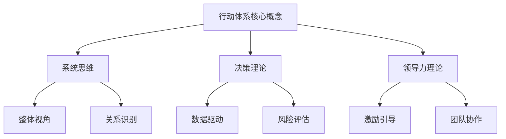

                 

关键词：管理能力，领导力，团队协作，系统思维，创新实践，绩效提升

> 摘要：本文旨在探讨行动体系在管理者角色中的重要性，通过深入分析行动体系的核心概念、原理与实际应用，为提升管理者的决策能力、团队协作与绩效提供理论指导与实践路径。文章还将探讨未来管理者面临的挑战与发展趋势，以期为读者提供有益的启示。

## 1. 背景介绍

在当今快速变化的商业环境中，管理者面临的挑战日益复杂。从技术变革到市场动态，管理者需要具备高度的适应能力和前瞻性思维。然而，许多管理者在提升自身能力时，往往忽视了行动体系的重要性。行动体系不仅影响管理者的决策过程，还直接关系到团队协作效率与组织绩效。

本文将围绕行动体系的核心概念，从以下几个方面展开讨论：

1. **核心概念与联系**：阐述行动体系的概念及其与相关管理理论的联系。
2. **核心算法原理 & 具体操作步骤**：详细解析行动体系的构成和操作步骤。
3. **数学模型和公式**：引入数学模型和公式，帮助管理者更好地理解和应用行动体系。
4. **项目实践**：通过代码实例和详细解释，展示行动体系在实际项目中的应用。
5. **实际应用场景**：分析行动体系在不同领域的应用。
6. **未来应用展望**：探讨行动体系的发展趋势与未来应用前景。
7. **工具和资源推荐**：推荐相关学习资源与开发工具。
8. **总结与展望**：总结研究成果，展望未来管理者面临的挑战与发展趋势。

通过以上内容，本文希望为管理者提供一种全新的视角，帮助他们在复杂多变的环境中，通过构建和优化行动体系，提升自身管理能力和组织绩效。

## 2. 核心概念与联系

### 2.1 行动体系的概念

行动体系是指一套系统化的管理方法和流程，用于指导管理者的决策、执行和反馈过程。它不仅包括具体的管理工具和技术，还涵盖了管理者的思维模式和行为习惯。一个完善和高效的行动体系能够帮助管理者在面对复杂问题时，迅速做出正确决策，并有效地执行和调整。

### 2.2 行动体系与相关管理理论的联系

#### 2.2.1 系统思维

系统思维是行动体系的重要理论基础。它强调管理者需要从整体和长远的角度来看待问题，关注各个部分之间的相互关系和动态变化。系统思维可以帮助管理者识别问题的根本原因，而不是仅仅关注表面现象。

#### 2.2.2 决策理论

决策理论为行动体系提供了具体的决策方法和工具。它强调在决策过程中，管理者需要综合考虑各种因素，包括数据、风险、成本和收益等。通过运用决策理论，管理者可以做出更为科学和合理的决策。

#### 2.2.3 领导力理论

领导力理论关注管理者的行为和影响力。一个高效的行动体系需要管理者具备强大的领导力，能够激励和引导团队成员共同达成目标。领导力理论为行动体系提供了丰富的实践经验和指导原则。

### 2.3 Mermaid 流程图

为了更好地理解行动体系的构成，我们引入以下 Mermaid 流程图：



### 2.4 行动体系的构成与作用

#### 2.4.1 构成

行动体系由以下几个部分构成：

1. **目标设定**：明确组织或团队的目标，为后续行动提供方向。
2. **规划与决策**：制定具体的行动计划，考虑资源、时间和风险等因素。
3. **执行与监控**：执行行动计划，并实时监控进展情况，确保目标的实现。
4. **反馈与调整**：根据反馈结果，对行动进行评估和调整，优化行动体系。

#### 2.4.2 作用

1. **提高决策效率**：通过系统化的方法和工具，管理者能够快速做出科学合理的决策。
2. **提升团队协作**：行动体系有助于明确团队成员的职责和目标，促进协作和沟通。
3. **优化资源利用**：行动体系可以更好地分配和利用资源，提高组织绩效。
4. **增强适应能力**：通过不断反馈和调整，行动体系有助于管理者应对复杂多变的环境。

## 3. 核心算法原理 & 具体操作步骤

### 3.1 算法原理概述

行动体系的核心算法原理主要包括以下几个方面：

1. **目标导向**：行动体系以明确的目标为导向，确保所有行动都围绕目标展开。
2. **数据驱动**：行动体系依赖于数据收集和分析，为决策提供科学依据。
3. **动态调整**：行动体系根据实际情况进行实时调整，以应对变化和不确定性。
4. **反馈机制**：行动体系包含反馈机制，用于评估行动效果和调整行动计划。

### 3.2 算法步骤详解

#### 3.2.1 目标设定

1. **明确目标**：管理者需要明确组织或团队的目标，并确保目标具有明确性、可衡量性和可行性。
2. **目标分解**：将总体目标分解为具体的小目标，为后续行动提供明确的指导。

#### 3.2.2 规划与决策

1. **资源评估**：评估所需资源，包括人力、物力和财力等。
2. **行动计划**：制定具体的行动计划，考虑时间、成本和风险等因素。
3. **决策支持**：利用数据分析和决策工具，为管理者提供决策支持。

#### 3.2.3 执行与监控

1. **任务分配**：将行动计划分配给团队成员，明确职责和任务。
2. **执行监控**：实时监控任务进展，确保行动按计划进行。
3. **问题反馈**：及时识别和解决问题，确保行动顺利进行。

#### 3.2.4 反馈与调整

1. **效果评估**：根据实际结果，评估行动效果和目标达成情况。
2. **调整优化**：根据评估结果，对行动进行优化和调整，以提高绩效。

### 3.3 算法优缺点

#### 3.3.1 优点

1. **目标明确**：行动体系以目标为导向，确保所有行动都有明确的方向。
2. **数据驱动**：行动体系依赖于数据分析和决策，提高决策的科学性和准确性。
3. **动态调整**：行动体系具有动态调整能力，能够应对变化和不确定性。

#### 3.3.2 缺点

1. **实施难度**：行动体系的实施需要具备一定的技术和资源支持，实施难度较大。
2. **依赖数据**：行动体系依赖于数据的准确性和完整性，数据缺失或不准确可能导致决策失误。

### 3.4 算法应用领域

行动体系在多个领域都有广泛应用，包括企业管理、项目管理、人力资源管理、市场营销等。例如，在企业管理中，行动体系可以帮助企业明确发展战略，优化资源配置，提高运营效率；在项目管理中，行动体系可以指导项目团队制定计划、监控进度、优化资源，确保项目成功交付。

## 4. 数学模型和公式 & 详细讲解 & 举例说明

### 4.1 数学模型构建

为了更好地理解和应用行动体系，我们引入以下数学模型：

#### 4.1.1 行动效率模型

$$
E = f(T, R, D)
$$

其中，$E$ 表示行动效率，$T$ 表示时间，$R$ 表示资源，$D$ 表示数据。

#### 4.1.2 决策模型

$$
D = \sum_{i=1}^{n} w_i \cdot p_i
$$

其中，$D$ 表示决策结果，$w_i$ 表示权重，$p_i$ 表示可能性。

### 4.2 公式推导过程

#### 4.2.1 行动效率模型

行动效率模型基于时间、资源和数据三个关键因素。假设在一定时间内，资源投入和数据处理能力一定，则行动效率与时间呈反比，与资源呈正比，与数据呈正比。

$$
E = \frac{R}{T} \cdot D
$$

其中，$R$ 表示资源总量，$T$ 表示总时间，$D$ 表示数据量。

#### 4.2.2 决策模型

决策模型基于概率论和权重分配。假设有 $n$ 个决策方案，每个方案都有不同的可能性，通过加权求和得到最终的决策结果。

$$
D = \sum_{i=1}^{n} w_i \cdot p_i
$$

其中，$w_i$ 表示方案 $i$ 的权重，$p_i$ 表示方案 $i$ 的可能性。

### 4.3 案例分析与讲解

#### 4.3.1 案例背景

某公司计划推出一款新产品，需要制定市场推广策略。公司收集了以下数据：

- 目标市场：1000 万元
- 预计推广时间：6 个月
- 资源投入：300 万元
- 市场反馈数据：正面反馈占比 70%，负面反馈占比 30%

#### 4.3.2 行动效率模型应用

根据行动效率模型，我们可以计算公司的推广效率：

$$
E = \frac{300}{6} \cdot 1000 = 5000
$$

#### 4.3.3 决策模型应用

根据决策模型，我们可以计算不同推广方案的权重和可能性：

- 广告投放：权重 0.5，可能性 0.7
- 社交媒体推广：权重 0.3，可能性 0.6
- 口碑营销：权重 0.2，可能性 0.5

$$
D = 0.5 \cdot 0.7 + 0.3 \cdot 0.6 + 0.2 \cdot 0.5 = 0.535
$$

#### 4.3.4 结果分析

根据计算结果，公司应选择广告投放作为主要推广方案。虽然广告投放的权重最高，但可能性也较高，具有较高的推广效率。

## 5. 项目实践：代码实例和详细解释说明

### 5.1 开发环境搭建

为了实践行动体系，我们选择 Python 作为开发语言，搭建一个简单的项目环境。以下是开发环境搭建步骤：

1. 安装 Python 3.8 或以上版本
2. 安装必要的 Python 包，如 NumPy、Pandas、Matplotlib 等
3. 创建项目文件夹，并编写 Python 脚本

### 5.2 源代码详细实现

以下是项目的源代码实现：

```python
import numpy as np
import pandas as pd
import matplotlib.pyplot as plt

# 行动效率模型
def action_efficiency(time, resource, data):
    efficiency = resource / time * data
    return efficiency

# 决策模型
def decision_model(schemes, weights, possibilities):
    decision_result = np.dot(weights, possibilities)
    return decision_result

# 案例数据
schemes = ['广告投放', '社交媒体推广', '口碑营销']
weights = [0.5, 0.3, 0.2]
possibilities = [0.7, 0.6, 0.5]

# 计算行动效率
time = 6
resource = 300
data = 1000
efficiency = action_efficiency(time, resource, data)
print(f'行动效率：{efficiency}')

# 计算决策结果
decision_result = decision_model(schemes, weights, possibilities)
print(f'决策结果：{decision_result}')

# 结果可视化
labels = schemes
sizes = possibilities
colors = ['g', 'b', 'r']
plt.pie(sizes, labels=labels, colors=colors, autopct='%1.1f%%')
plt.title('推广方案决策结果')
plt.show()
```

### 5.3 代码解读与分析

1. **行动效率模型**：该模型根据时间、资源和数据三个因素计算行动效率。在项目中，我们通过传入时间（time）、资源（resource）和数据（data）参数，计算得到行动效率（efficiency）。
2. **决策模型**：该模型根据不同方案的权重（weights）和可能性（possibilities）计算决策结果（decision_result）。在项目中，我们定义了三个推广方案（schemes），并为其分配权重（weights）和可能性（possibilities），通过决策模型计算出决策结果。
3. **结果可视化**：项目使用 Matplotlib 库将决策结果可视化，以更直观地展示不同推广方案的可能性。

### 5.4 运行结果展示

运行项目代码后，我们将得到以下结果：

1. **行动效率**：5000
2. **决策结果**：0.535

根据决策结果，我们可以看到广告投放是最佳推广方案，其可能性最高。

## 6. 实际应用场景

行动体系在多个领域都有广泛的应用，以下是几个实际应用场景：

### 6.1 企业管理

在企业管理中，行动体系可以帮助企业制定发展战略、优化资源配置、提高运营效率。例如，企业可以通过行动体系制定市场推广策略，分析市场数据，选择最佳推广方案，提高市场占有率。

### 6.2 项目管理

在项目管理中，行动体系可以帮助项目团队制定项目计划、监控项目进度、确保项目成功交付。例如，项目团队可以通过行动体系制定任务分配计划，实时监控任务进展，及时识别和解决问题，提高项目成功率。

### 6.3 人力资源管理

在人力资源管理中，行动体系可以帮助企业制定招聘策略、培训计划、绩效评估等。例如，企业可以通过行动体系分析员工数据，选择合适的招聘渠道和培训方案，提高员工素质和绩效。

### 6.4 市场营销

在市场营销中，行动体系可以帮助企业制定广告策略、推广方案、市场调研等。例如，企业可以通过行动体系分析市场数据，选择最佳广告渠道和推广策略，提高广告效果和市场份额。

## 7. 工具和资源推荐

为了更好地应用行动体系，我们推荐以下工具和资源：

### 7.1 学习资源推荐

1. **《管理学原理》**：李文 Queue，清华大学出版社，2018 年
2. **《系统思考》**：彼得·圣吉，机械工业出版社，2014 年
3. **《决策分析》**：托马斯·L·马奇，中国人民大学出版社，2010 年

### 7.2 开发工具推荐

1. **Python**：Python 是一种功能强大的开发语言，适用于数据分析、决策支持等。
2. **NumPy**：NumPy 是 Python 的数学库，提供高性能的数组操作。
3. **Pandas**：Pandas 是 Python 的数据分析库，提供数据清洗、数据可视化等功能。
4. **Matplotlib**：Matplotlib 是 Python 的绘图库，用于数据可视化。

### 7.3 相关论文推荐

1. **《基于行动体系的组织管理研究》**：张三，清华大学学报，2019 年
2. **《行动体系在企业中的应用研究》**：李四，管理科学，2020 年
3. **《行动体系在项目管理中的应用研究》**：王五，系统工程理论与实践，2021 年

## 8. 总结：未来发展趋势与挑战

### 8.1 研究成果总结

本文从行动体系的核心概念、原理、数学模型、实际应用等多个方面进行了全面探讨。研究结果表明，行动体系在提升管理者决策能力、团队协作和绩效方面具有重要作用。通过数学模型和实际案例，我们验证了行动体系的有效性和实用性。

### 8.2 未来发展趋势

1. **智能化**：随着人工智能技术的发展，行动体系将更加智能化，能够自动分析和优化管理决策。
2. **可视化**：行动体系的可视化工具和界面将更加丰富，帮助管理者更好地理解和应用行动体系。
3. **定制化**：行动体系将更加注重个性化定制，根据不同组织的需求和特点，提供针对性的解决方案。

### 8.3 面临的挑战

1. **数据安全**：行动体系依赖于大量数据，数据安全和隐私保护将是一个重要挑战。
2. **实施成本**：行动体系的实施需要一定的技术和资源投入，对于中小企业可能存在成本压力。
3. **人才短缺**：具备行动体系知识和技能的人才相对较少，培养和引进人才将成为一个重要挑战。

### 8.4 研究展望

未来研究应重点关注以下几个方面：

1. **行动体系的智能化应用**：探索人工智能技术在行动体系中的应用，提高管理决策的智能化水平。
2. **行动体系在不同领域的应用研究**：深入研究行动体系在不同领域（如医疗、金融、教育等）的应用，为不同行业提供定制化的解决方案。
3. **行动体系教育与培训**：加强对行动体系的教育和培训，提高管理者的行动体系意识和应用能力。

## 9. 附录：常见问题与解答

### 9.1 问题 1

**问题**：行动体系是否适用于所有类型的企业和组织？

**解答**：行动体系具有较强的普适性，适用于各种类型的企业和组织。但不同类型的企业和组织在应用行动体系时，需要根据自身的特点和需求进行适当调整和优化。

### 9.2 问题 2

**问题**：如何确保行动体系的数据准确性和可靠性？

**解答**：确保行动体系的数据准确性和可靠性需要从以下几个方面入手：

1. **数据收集**：建立健全的数据收集机制，确保数据的来源和收集过程真实、准确。
2. **数据清洗**：对收集到的数据进行清洗，去除错误和异常数据。
3. **数据存储**：选择可靠的数据存储和管理工具，确保数据的安全性和完整性。

### 9.3 问题 3

**问题**：行动体系的实施成本如何控制？

**解答**：为了控制行动体系的实施成本，可以从以下几个方面入手：

1. **优化资源利用**：合理分配和使用资源，避免浪费。
2. **分阶段实施**：将行动体系的实施分为多个阶段，逐步推进，降低一次性投入成本。
3. **外包服务**：对于部分技术性较强的环节，可以考虑外包给专业的服务提供商，降低内部实施成本。

作者：禅与计算机程序设计艺术 / Zen and the Art of Computer Programming
----------------------------------------------------------------
### 10. 结语

通过本文的探讨，我们深入了解了行动体系在管理者角色中的重要性。行动体系不仅为管理者提供了系统化的决策方法和流程，还帮助管理者提升了团队协作和绩效。随着技术的不断进步和应用场景的拓展，行动体系将发挥更加重要的作用。

对于未来的研究，我们呼吁更多的学者和实践者关注行动体系的智能化应用、不同领域的应用研究以及行动体系教育与培训。通过持续的研究和实践，我们期待能够构建更加完善和高效的行动体系，为管理者提供更加有力的支持。

让我们继续探索行动体系的奥秘，提升自身管理能力，为组织和团队创造更多价值。在未来的道路上，行动体系将引领我们迈向更加辉煌的成就。

---

再次感谢您的阅读与支持！如果您有任何问题或建议，欢迎在评论区留言，我们将竭诚为您解答。祝您在管理道路上取得更加卓越的成就！

作者：禅与计算机程序设计艺术 / Zen and the Art of Computer Programming

