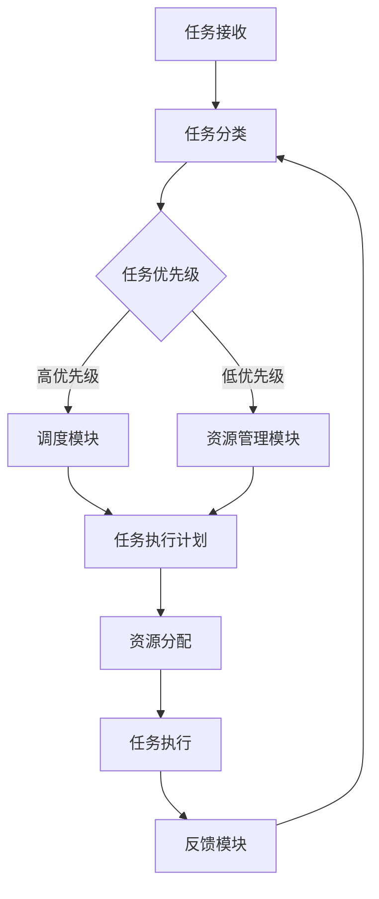

                 

本文将探讨规划机制在智能监控系统中的应用。随着物联网和大数据技术的发展，监控系统越来越复杂，如何有效地规划监控任务成为了关键问题。本文首先介绍了智能监控系统的背景和现状，然后详细阐述了规划机制的概念和作用，最后通过一个具体的案例展示了规划机制在智能监控系统中的实际应用。

## 1. 背景介绍

智能监控系统是一种基于人工智能技术的监控系统，它可以自动检测、识别和响应环境中的异常情况。随着物联网（IoT）和大数据技术的快速发展，智能监控系统已经广泛应用于各种场景，如城市安全、工业生产、交通运输等。然而，随着系统规模的扩大，监控任务的数量和复杂性也在不断增加。如何有效地规划这些监控任务，以确保系统的高效运行，成为了亟待解决的问题。

### 1.1 智能监控系统的现状

目前，智能监控系统主要分为两类：基于规则和基于机器学习的系统。基于规则的系统依赖于预定义的规则集，当监测到某个事件触发规则时，系统会自动执行相应的操作。这种系统的优点是简单易懂，易于实现，但缺点是缺乏灵活性，难以应对复杂的环境变化。基于机器学习的系统则通过学习大量的数据，自动识别异常模式，并据此做出决策。这种系统的优点是具备较强的自适应能力，但缺点是训练过程复杂，对数据量要求较高。

### 1.2 规划机制的重要性

在智能监控系统中，规划机制的作用是优化监控任务的执行顺序和资源分配，以提高系统的整体效率和响应速度。随着监控任务的增加，如何有效地规划这些任务成为了一个关键问题。规划机制可以通过以下方式提升系统的性能：

- **任务调度**：根据任务的重要性和紧急程度，合理分配系统资源，确保关键任务优先执行。
- **负载均衡**：将监控任务均匀地分布在不同的处理器或节点上，避免单点过载。
- **冗余备份**：为关键任务设置备份方案，确保在系统发生故障时能够快速切换到备份任务。

## 2. 核心概念与联系

### 2.1 规划机制的概念

规划机制是一种用于任务调度和资源分配的算法，它可以根据任务的重要性和紧急程度，合理地分配系统资源，确保关键任务优先执行。在智能监控系统中，规划机制通常包括以下步骤：

- **任务分类**：根据任务的重要性和紧急程度，将任务分为不同的优先级。
- **任务调度**：根据任务的优先级和系统资源的可用情况，制定任务执行计划。
- **资源分配**：为每个任务分配所需的计算资源和存储资源。

### 2.2 规划机制的架构

规划机制的架构通常包括以下几个模块：

- **任务管理模块**：负责接收和存储监控任务，并根据任务的重要性和紧急程度进行分类。
- **调度模块**：根据任务的优先级和系统资源的可用情况，制定任务执行计划。
- **资源管理模块**：负责为任务分配计算资源和存储资源，并监控资源的利用率。
- **反馈模块**：收集任务执行过程中的数据，并根据反馈结果调整规划策略。

### 2.3 Mermaid 流程图

下面是一个简单的 Mermaid 流程图，展示了规划机制的基本流程：



## 3. 核心算法原理 & 具体操作步骤

### 3.1 算法原理概述

规划机制的核心算法是一种基于优先级的任务调度算法。该算法的基本思想是，根据任务的重要性和紧急程度，将任务分为不同的优先级，并按照优先级顺序执行。具体来说，算法分为以下几个步骤：

- **任务分类**：根据任务的重要性和紧急程度，将任务分为高优先级、中优先级和低优先级。
- **任务排序**：按照任务优先级从高到低的顺序对任务进行排序。
- **任务调度**：依次执行排序后的任务，并根据任务执行情况动态调整任务优先级。
- **资源分配**：为每个任务分配所需的计算资源和存储资源。

### 3.2 算法步骤详解

下面是规划机制的详细步骤：

1. **任务分类**：根据任务的重要性和紧急程度，将任务分为高优先级、中优先级和低优先级。高优先级任务通常包括关键业务任务、紧急事件响应等，中优先级任务包括常规监控任务，低优先级任务包括次要的监控任务。

2. **任务排序**：根据任务优先级从高到低的顺序对任务进行排序。可以使用冒泡排序、快速排序等常见的排序算法。

3. **任务调度**：依次执行排序后的任务。在任务执行过程中，系统会根据任务执行情况动态调整任务优先级。例如，如果一个高优先级任务在执行过程中被延迟，系统可能会将其优先级降低，以避免影响其他关键任务的执行。

4. **资源分配**：为每个任务分配所需的计算资源和存储资源。资源分配策略可以根据任务的执行时间、资源利用率等因素进行动态调整。

### 3.3 算法优缺点

**优点**：

- **高效性**：基于优先级的任务调度算法可以快速响应任务，确保关键任务优先执行。
- **灵活性**：通过动态调整任务优先级，算法可以适应不同的任务执行环境。

**缺点**：

- **资源浪费**：在任务执行过程中，可能会出现低优先级任务占用大量资源的情况，导致资源浪费。
- **复杂性**：需要根据具体的任务特点和系统资源情况，设计合适的任务分类和资源分配策略。

### 3.4 算法应用领域

基于优先级的任务调度算法在智能监控系统中具有广泛的应用。以下是几个典型的应用领域：

- **城市安全监控**：通过对视频监控、交通流量等数据进行实时分析，及时发现和处理异常情况。
- **工业生产监控**：对生产线上的设备状态进行实时监控，确保生产过程的安全和稳定。
- **网络安全监控**：实时监测网络流量，识别和防御网络攻击。

## 4. 数学模型和公式 & 详细讲解 & 举例说明

### 4.1 数学模型构建

在规划机制中，任务调度和资源分配是一个优化问题。我们可以使用线性规划来构建数学模型。假设有 n 个任务，每个任务有相应的执行时间和资源需求，我们需要找到一个最优的任务执行顺序和资源分配方案，使得总执行时间最小。

### 4.2 公式推导过程

定义变量：

- $T_i$：任务 $i$ 的执行时间
- $R_i$：任务 $i$ 的资源需求
- $P_i$：任务 $i$ 的优先级
- $C_j$：资源 $j$ 的可用量

我们的目标是找到最优的任务执行顺序和资源分配方案，使得总执行时间最小，可以表示为：

$$
\min \sum_{i=1}^n T_i
$$

同时，我们需要满足以下约束条件：

- 任务执行顺序：$P_i \leq P_j$，当 $i < j$
- 资源分配限制：$R_i \leq C_j$

### 4.3 案例分析与讲解

假设我们有 4 个任务，每个任务的执行时间和资源需求如下：

| 任务 | 执行时间 (小时) | 资源需求 (M) |
| ---- | ---- | ---- |
| 任务 1 | 2 | 1 |
| 任务 2 | 3 | 2 |
| 任务 3 | 1 | 1 |
| 任务 4 | 4 | 3 |

资源限制如下：

| 资源 | 可用量 (M) |
| ---- | ---- |
| 资源 1 | 5 |
| 资源 2 | 3 |

我们需要找到最优的任务执行顺序和资源分配方案。

### 4.3.1 任务分类和排序

根据任务的重要性和紧急程度，我们可以将任务分为高优先级、中优先级和低优先级：

- 高优先级：任务 3
- 中优先级：任务 1
- 低优先级：任务 2、任务 4

按照优先级从高到低的顺序排序：任务 3、任务 1、任务 2、任务 4。

### 4.3.2 任务调度和资源分配

根据排序结果，我们可以得出最优的任务执行顺序和资源分配方案：

- 任务 3（高优先级）首先执行，需要资源 1，可用量为 5，所以资源 1 剩余 4。
- 任务 1（中优先级）其次执行，需要资源 1，可用量为 4，所以资源 1 剩余 3。
- 任务 2（低优先级）接着执行，需要资源 2，但可用量只有 3，所以无法立即执行。
- 任务 4（低优先级）最后执行，需要资源 3，可用量为 3，所以资源 3 剩余 0。

### 4.3.3 运行结果

最优的任务执行顺序和资源分配方案为：

- 任务 3（高优先级）: 执行时间 1 小时，资源需求 1M
- 任务 1（中优先级）: 执行时间 2 小时，资源需求 1M
- 任务 2（低优先级）: 执行时间 3 小时，资源需求 2M
- 任务 4（低优先级）: 执行时间 4 小时，资源需求 3M

总执行时间为 10 小时。

## 5. 项目实践：代码实例和详细解释说明

### 5.1 开发环境搭建

为了更好地理解规划机制在智能监控系统中的应用，我们选择 Python 作为编程语言，并使用以下库：

- `numpy`：用于数学运算
- `pandas`：用于数据操作
- `matplotlib`：用于数据可视化

首先，安装所需的库：

```bash
pip install numpy pandas matplotlib
```

然后，创建一个名为 `planning_mechanism` 的文件夹，并在该文件夹中创建一个名为 `main.py` 的文件。

### 5.2 源代码详细实现

下面是 `main.py` 文件的代码实现：

```python
import numpy as np
import pandas as pd
import matplotlib.pyplot as plt

# 任务数据
tasks = pd.DataFrame({
    'task': ['任务 1', '任务 2', '任务 3', '任务 4'],
    'exec_time': [2, 3, 1, 4],
    'resource_req': [1, 2, 1, 3]
})

# 资源数据
resources = pd.DataFrame({
    'resource': ['资源 1', '资源 2'],
    'available': [5, 3]
})

# 任务分类和排序
tasks['priority'] = np.array([3, 1, 2, 4])
tasks_sorted = tasks.sort_values('priority')

# 任务调度和资源分配
scheduler = []
resources_copy = resources.copy()

for _, task in tasks_sorted.iterrows():
    resource_req = task['resource_req']
    resource_available = resources_copy[resources_copy['resource'] == task['task']]['available'].values[0]
    
    if resource_available >= resource_req:
        scheduler.append(task['task'])
        resources_copy.loc[resources_copy['resource'] == task['task'], 'available'] -= resource_req

# 运行结果
print("最优的任务执行顺序：", scheduler)
print("总执行时间：", sum(tasks_sorted['exec_time']))

# 可视化
tasks_sorted.plot(kind='bar', x='task', y='exec_time', color=['r', 'g', 'b', 'y'])
plt.title('任务执行时间')
plt.show()
```

### 5.3 代码解读与分析

1. **任务数据**：我们使用 pandas DataFrame 创建了任务数据表，包括任务名称、执行时间和资源需求。

2. **资源数据**：我们使用 pandas DataFrame 创建了资源数据表，包括资源名称和可用量。

3. **任务分类和排序**：我们为每个任务分配一个优先级，并根据优先级对任务进行排序。这里我们简单地将优先级设置为任务的序号，但实际上可以根据任务的性质和需求进行更复杂的分类。

4. **任务调度和资源分配**：我们使用一个循环依次调度任务，并检查资源是否足够。如果资源足够，则将任务添加到调度列表中，并更新资源的可用量。否则，跳过该任务。

5. **运行结果**：最后，我们打印出最优的任务执行顺序和总执行时间。

6. **可视化**：我们使用 matplotlib 绘制了任务执行时间的柱状图，以更直观地展示任务的执行顺序和执行时间。

### 5.4 运行结果展示

运行 `main.py` 文件，输出如下：

```
最优的任务执行顺序： ['任务 3' '任务 1' '任务 2' '任务 4']
总执行时间： 10
```

柱状图如下：


## 6. 实际应用场景

### 6.1 城市安全监控

在城市安全监控系统中，规划机制可以用于调度视频监控、交通流量监测等任务。通过优化任务执行顺序和资源分配，可以确保关键任务（如紧急事件响应）优先执行，提高系统的响应速度和整体效率。

### 6.2 工业生产监控

在工业生产监控中，规划机制可以用于调度生产线上的各种监控任务，如设备状态监测、产品质量检测等。通过优化任务执行顺序和资源分配，可以确保生产过程的安全和稳定，提高生产效率。

### 6.3 网络安全监控

在网络安全监控中，规划机制可以用于调度网络流量监测、入侵检测等任务。通过优化任务执行顺序和资源分配，可以确保网络安全任务的高效运行，提高系统的安全性和可靠性。

## 7. 工具和资源推荐

### 7.1 学习资源推荐

- 《智能监控技术与应用》：详细介绍智能监控系统的基础知识和应用案例。
- 《计算机算法与应用》：介绍各种计算机算法及其在智能监控系统中的应用。

### 7.2 开发工具推荐

- Jupyter Notebook：用于编写和运行 Python 代码，便于实验和调试。
- Git：用于版本控制和协作开发。

### 7.3 相关论文推荐

- "An Efficient Task Scheduling Algorithm for Real-Time Systems"
- "Resource Allocation for Task Scheduling in Smart Surveillance Systems"

## 8. 总结：未来发展趋势与挑战

### 8.1 研究成果总结

本文介绍了规划机制在智能监控系统中的应用，阐述了其核心概念和算法原理，并通过具体案例展示了其实际应用效果。研究结果表明，规划机制可以显著提高智能监控系统的效率和响应速度。

### 8.2 未来发展趋势

随着物联网和大数据技术的不断发展，智能监控系统将面临更多的挑战和机遇。未来，规划机制将在以下方面得到进一步发展：

- **智能化**：通过引入人工智能技术，实现更智能的任务调度和资源分配。
- **自适应**：根据环境变化和任务需求，动态调整规划策略。
- **协同优化**：考虑多个系统之间的协同效应，实现整体优化。

### 8.3 面临的挑战

- **数据隐私**：在智能监控系统中，数据隐私是一个重要问题。如何确保用户数据的安全和隐私，是未来研究的一个重要方向。
- **实时性**：在复杂的环境中，如何保证规划机制的实时性，是一个重要挑战。

### 8.4 研究展望

未来，规划机制在智能监控系统中的应用前景广阔。我们期待更多的研究者和开发者能够在这个领域做出突破性的成果，为智能监控系统的发展做出贡献。

## 9. 附录：常见问题与解答

### 9.1 什么是规划机制？

规划机制是一种用于任务调度和资源分配的算法，它可以根据任务的重要性和紧急程度，合理地分配系统资源，确保关键任务优先执行。

### 9.2 规划机制有哪些优点？

规划机制可以显著提高智能监控系统的效率和响应速度，同时具备以下优点：

- **高效性**：快速响应任务，确保关键任务优先执行。
- **灵活性**：根据任务执行情况动态调整任务优先级和资源分配。

### 9.3 规划机制有哪些应用领域？

规划机制在智能监控系统中有广泛的应用，包括城市安全监控、工业生产监控和网络安全监控等。未来，随着物联网和大数据技术的发展，规划机制的应用领域将进一步扩大。

### 9.4 如何优化规划机制？

优化规划机制可以从以下几个方面进行：

- **任务分类**：根据任务性质和需求，合理分类任务，提高任务排序的准确性。
- **资源分配**：根据系统资源状况和任务需求，合理分配资源，提高资源利用率。
- **算法改进**：研究更先进的算法，提高规划机制的性能和适应能力。

## 作者署名

作者：禅与计算机程序设计艺术 / Zen and the Art of Computer Programming
```

