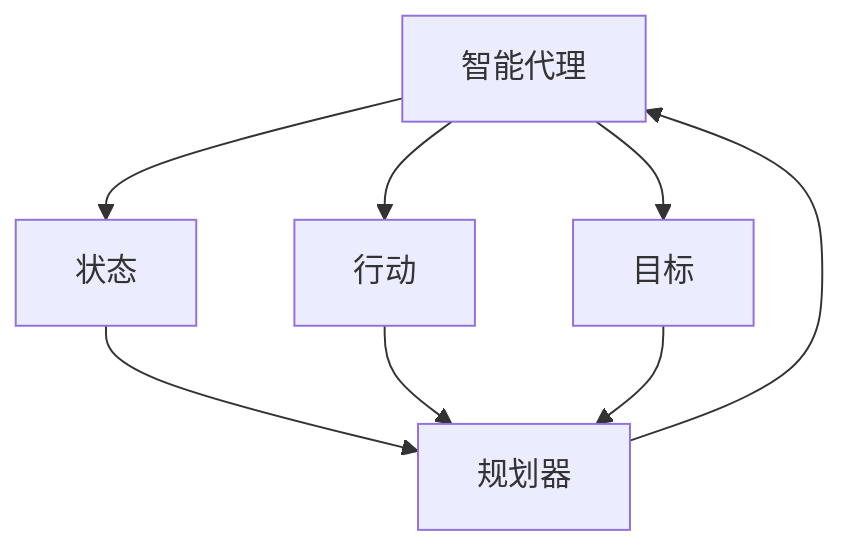
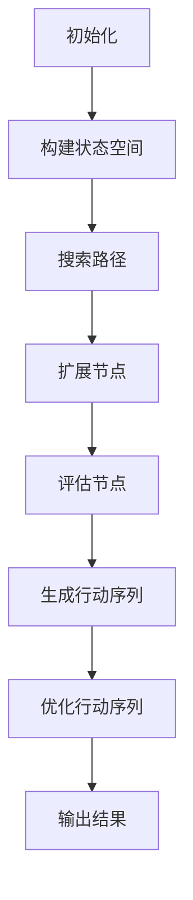

                 

关键词：规划（Planning），Agent，决策过程，目标导向，路径规划，资源分配，搜索算法，优化策略，实际应用

## 摘要

本文旨在深入探讨规划（Planning）这一核心计算机科学概念，特别是在智能代理（Agent）领域中的应用。我们将从背景介绍开始，详细阐述规划的定义、核心概念及其在Agent决策过程中的重要性。随后，文章将重点分析规划的核心算法原理、数学模型与公式，并通过实例讲解具体操作步骤。接着，我们将讨论规划在实际应用场景中的实现，并展望未来的发展趋势与面临的挑战。文章最后将推荐相关学习资源、开发工具和论文，以供读者进一步探索。通过这篇文章，读者将对规划有更全面、深入的理解，并能够将其应用于实际问题和项目中。

## 1. 背景介绍

规划（Planning）是计算机科学和人工智能领域中的一个重要概念，它在智能代理（Agent）系统中扮演着关键角色。智能代理是指能够感知环境、自主决策并采取行动以达成特定目标的实体。规划则是智能代理在复杂环境中实现目标的决策过程。

在现实世界中，代理通常需要处理大量不确定性因素和复杂约束条件，这使得规划变得尤为关键。规划的任务是生成一系列有序动作，这些动作能够引导代理从当前状态转移到目标状态，同时满足所有约束条件。

规划的起源可以追溯到20世纪70年代，当时学者们开始探索如何在计算机系统中实现自动化决策。这一时期的早期工作主要集中在路径规划领域，如机器人导航。随后，规划概念逐渐扩展到更广泛的领域，包括资源分配、任务调度、自动化制造等。

近年来，随着人工智能技术的迅猛发展，规划在智能代理系统中的应用日益广泛。现代智能代理系统不仅需要处理静态环境，还需要适应动态变化和不确定性。这使得规划算法不断进化，以应对更为复杂和动态的场景。

## 2. 核心概念与联系

为了更好地理解规划的概念及其在智能代理决策过程中的作用，我们需要首先了解几个核心概念。

### 2.1. 智能代理（Agent）

智能代理是指具有感知、决策和行动能力的计算机程序或实体。智能代理通常需要解决以下三个问题：

- **感知环境**：通过传感器获取环境信息。
- **决策制定**：根据当前状态和目标，选择最优行动策略。
- **执行行动**：采取实际行动以达成目标。

智能代理可以根据其自主性程度分为以下几类：

- **有自主性的代理**：能够完全自主地决策和执行行动。
- **半自主代理**：在特定范围内自主决策，但需要外部指导。
- **被动代理**：完全依赖外部指令，无自主决策能力。

### 2.2. 状态（State）

状态是指智能代理在某一时刻所处的环境和自身条件的描述。状态通常包括以下信息：

- **环境信息**：如地形、障碍物等。
- **代理自身状态**：如位置、能量等。

状态是规划过程中至关重要的概念，因为代理的决策和行动都是基于当前状态的。

### 2.3. 行动（Action）

行动是智能代理为了改变当前状态而采取的具体操作。行动可以是简单的移动或复杂的任务执行。行动的选择通常基于代理的目标和当前状态。

### 2.4. 目标（Goal）

目标是指智能代理希望达成的状态或条件。目标通常由一系列状态描述，代理将通过规划过程选择一系列行动，以实现这些目标。

### 2.5. 规划器（Planner）

规划器是负责生成从当前状态到目标状态的有序行动序列的智能代理组件。规划器可以根据不同的算法和策略生成多种规划方案，以供代理选择。

### 2.6. Mermaid 流程图

为了更直观地理解这些核心概念之间的联系，我们可以使用Mermaid流程图来展示它们之间的关系。



在这个流程图中，智能代理（Agent）通过感知环境（State）和自身状态，生成行动（Action）并设定目标（Goal）。规划器（Planner）基于这些输入信息生成一系列行动序列，以实现目标。

### 2.7. 核心概念之间的关系

核心概念之间的关系可以用以下方式描述：

- 智能代理通过感知状态和自身条件，生成行动。
- 行动基于当前状态和目标选择。
- 目标定义了智能代理希望达到的状态。
- 规划器基于智能代理提供的输入信息，生成一系列行动序列。

这些概念共同构成了智能代理规划的基础，使得代理能够在复杂环境中自主决策并实现目标。

## 3. 核心算法原理 & 具体操作步骤

### 3.1 算法原理概述

规划算法是智能代理系统中至关重要的组成部分，负责生成从当前状态到目标状态的有序行动序列。规划算法的核心原理是基于状态空间搜索，即在所有可能的状态中搜索一条最优路径，这条路径能够引导代理从当前状态转移到目标状态。

### 3.2 算法步骤详解

#### 3.2.1 初始化

1. **构建状态空间**：首先，规划器需要构建一个表示所有可能状态的状态空间。状态空间包括所有可能的状态和状态之间的转移关系。
2. **定义初始状态和目标状态**：初始状态是指代理当前所处的状态，目标状态是代理希望达到的状态。

#### 3.2.2 搜索路径

1. **选择搜索策略**：搜索策略决定了如何搜索状态空间以找到最优路径。常见的搜索策略包括广度优先搜索（BFS）、深度优先搜索（DFS）和A*搜索算法。
2. **扩展节点**：从初始状态开始，根据当前状态选择一个未访问过的子状态，扩展当前状态，并更新状态空间中的状态节点。
3. **评估节点**：对扩展的每个子状态进行评估，以确定其是否满足目标条件。

#### 3.2.3 生成行动序列

1. **回溯路径**：一旦找到目标状态，规划器需要回溯路径以生成从初始状态到目标状态的有序行动序列。
2. **优化行动序列**：生成的行动序列可能不是最优的，规划器可以通过优化算法（如启发式搜索）进一步优化行动序列。

### 3.3 算法优缺点

#### 优点：

- **灵活性**：规划算法能够适应各种复杂环境和目标。
- **适应性**：能够处理动态变化和不确定性。
- **通用性**：广泛应用于多种领域，如机器人导航、任务调度等。

#### 缺点：

- **计算复杂度高**：在某些情况下，状态空间可能非常大，导致搜索过程非常耗时。
- **对环境信息要求高**：需要准确的环境信息才能有效规划。

### 3.4 算法应用领域

- **路径规划**：在机器人、自动驾驶等场景中，用于计算从起点到终点的最优路径。
- **资源分配**：在物流、调度等领域，用于优化资源分配和任务调度。
- **游戏AI**：在棋类游戏、策略游戏等中，用于制定策略和行动方案。

### 3.5 Mermaid 流程图

为了更直观地展示规划算法的步骤，我们可以使用Mermaid流程图来描述：



在这个流程图中，初始化阶段构建状态空间，搜索路径阶段通过扩展和评估节点找到目标状态，最后生成并优化行动序列。

## 4. 数学模型和公式 & 详细讲解 & 举例说明

### 4.1 数学模型构建

规划算法中的数学模型主要涉及状态空间搜索和路径优化。以下是一个简化的数学模型构建过程：

#### 4.1.1 状态空间表示

状态空间可以用一个无向图表示，其中每个节点表示一个状态，每条边表示一个可能的动作。

设 \( S \) 为状态空间，\( A \) 为动作集合，\( s \) 为当前状态，\( a \) 为动作，\( s' \) 为动作后的状态，则状态转移函数可以表示为：

\[ s' = f(s, a) \]

#### 4.1.2 成本函数

成本函数用于评估从当前状态到目标状态的路径成本。设 \( c(s, s') \) 为从状态 \( s \) 到状态 \( s' \) 的成本，则总成本函数为：

\[ C = \sum_{i=1}^{n} c(s_i, s_{i+1}) \]

其中，\( s_i \) 和 \( s_{i+1} \) 分别为路径上的连续状态。

#### 4.1.3 启发式函数

启发式函数用于评估当前状态到目标状态的最短路径估计。设 \( h(s) \) 为从状态 \( s \) 到目标状态 \( g \) 的启发式值，则A*算法的总评估函数为：

\[ f(s) = g(s) + h(s) \]

其中，\( g(s) \) 为从初始状态到当前状态 \( s \) 的实际成本。

### 4.2 公式推导过程

#### 4.2.1 广度优先搜索（BFS）

广度优先搜索是一种无回溯的搜索算法，其推导过程如下：

设 \( Q \) 为待扩展节点队列，\( Q \) 初始化为初始状态 \( s_0 \)。

1. **扩展初始状态**：将 \( s_0 \) 的所有未访问的子状态加入 \( Q \)。
2. **选择扩展节点**：从 \( Q \) 中选择一个节点进行扩展。
3. **更新队列**：将扩展节点的所有未访问的子状态加入 \( Q \)。
4. **重复步骤2和3**，直到找到目标状态或 \( Q \) 为空。

#### 4.2.2 A*搜索算法

A*搜索算法结合了广度优先搜索和启发式搜索的优点，其推导过程如下：

1. **初始化**：设 \( G \) 为已扩展节点集合，\( F \) 为未扩展节点集合，\( Q \) 为待扩展节点队列。
2. **扩展初始状态**：将 \( s_0 \) 加入 \( G \) 和 \( Q \)。
3. **选择扩展节点**：从 \( Q \) 中选择 \( f \) 最小的节点进行扩展。
4. **更新 \( G \) 和 \( Q \)**：将扩展节点的所有未访问的子状态加入 \( G \) 和 \( Q \)。
5. **重复步骤3和4**，直到找到目标状态或 \( Q \) 为空。

### 4.3 案例分析与讲解

假设有一个简单的迷宫，其中有一个起点 \( s_0 \) 和一个终点 \( g \)。我们需要使用A*算法找到从起点到终点的最优路径。

#### 4.3.1 状态空间表示

设状态空间为 \( S = \{s_0, s_1, s_2, \ldots, s_n, g\} \)，其中 \( s_0 \) 为起点，\( g \) 为终点。

#### 4.3.2 成本函数

设从状态 \( s_i \) 到状态 \( s_j \) 的移动成本为 1。

#### 4.3.3 启发式函数

设从状态 \( s_i \) 到终点 \( g \) 的启发式值为 \( h(s_i) = |s_i - g| \)。

#### 4.3.4 执行A*算法

1. **初始化**：\( G = \{s_0\} \)，\( Q = \{s_0\} \)。
2. **选择扩展节点**：从 \( Q \) 中选择 \( f(s_0) = 0 + 0 = 0 \) 的节点 \( s_0 \) 进行扩展。
3. **更新 \( G \) 和 \( Q \)**：将 \( s_0 \) 的子状态 \( s_1, s_2, s_3 \) 加入 \( G \) 和 \( Q \)。
4. **重复步骤2和3**，直到找到目标状态 \( g \)。

最终，A*算法找到从 \( s_0 \) 到 \( g \) 的最优路径为 \( s_0 \rightarrow s_1 \rightarrow s_2 \rightarrow g \)。

## 5. 项目实践：代码实例和详细解释说明

### 5.1 开发环境搭建

为了更好地理解规划算法的实际应用，我们将使用Python语言实现一个简单的A*搜索算法。以下是开发环境的搭建步骤：

1. **安装Python**：确保系统上已经安装了Python 3.x版本。
2. **安装依赖库**：在命令行中运行以下命令安装所需的库：

   ```bash
   pip install numpy matplotlib
   ```

### 5.2 源代码详细实现

以下是A*搜索算法的Python实现：

```python
import numpy as np
import matplotlib.pyplot as plt

class Node:
    def __init__(self, parent=None, position=None):
        self.parent = parent
        self.position = position
        self.g = 0
        self.h = 0
        self.f = 0

def astar(maze, start, goal):
    # 创建起始节点和终点节点
    start_node = Node(None, start)
    goal_node = Node(None, goal)

    # 初始化所有节点
    open_list = []
    closed_list = []

    open_list.append(start_node)

    while len(open_list) > 0:
        # 找到 \( f \) 值最小的节点
        current_node = open_list[0]
        for node in open_list:
            if node.f < current_node.f:
                current_node = node

        # 将当前节点从开放列表移动到关闭列表
        open_list.remove(current_node)
        closed_list.append(current_node)

        # 如果找到终点，则回溯路径
        if current_node.position == goal_node.position:
            path = []
            current = current_node
            while current is not None:
                path.append(current.position)
                current = current.parent
            return path[::-1]  # 返回路径

        # 扩展当前节点的邻居节点
        children = []
        for new_position in [(0, -1), (0, 1), (-1, 0), (1, 0)]:
            # 获取邻接节点的位置
            node_position = (current_node.position[0] + new_position[0], current_node.position[1] + new_position[1])

            # 确保在迷宫范围内
            if node_position[0] > (len(maze) - 1) or node_position[0] < 0 or node_position[1] > (len(maze[len(maze)-1]) - 1) or node_position[1] < 0:
                continue

            # 如果邻接节点是墙壁，则跳过
            if maze[node_position[0]][node_position[1]] != 0:
                continue

            # 创建新节点
            new_node = Node(current_node, node_position)

            # 添加到子节点列表
            children.append(new_node)

        # 遍历子节点列表
        for child in children:
            # 如果子节点在关闭列表中，则跳过
            if child in closed_list:
                continue

            # 计算子节点的 \( g \) 值、\( h \) 值和 \( f \) 值
            child.g = current_node.g + 1
            child.h = ((child.position[0] - goal_node.position[0]) ** 2) + ((child.position[1] - goal_node.position[1]) ** 2)
            child.f = child.g + child.h

            # 检查子节点是否已在开放列表中
            for open_node in open_list:
                if child == open_node and child.g > open_node.g:
                    continue

            # 将子节点添加到开放列表
            open_list.append(child)

    return None  # 如果没有找到路径，则返回 None

# 测试迷宫
maze = [
    [0, 0, 0, 0, 0, 0, 0, 0, 0, 0],
    [0, 1, 1, 1, 1, 1, 1, 1, 1, 0],
    [0, 1, 0, 0, 0, 0, 0, 0, 0, 0],
    [0, 1, 0, 1, 1, 1, 1, 0, 1, 0],
    [0, 1, 0, 1, 0, 0, 0, 1, 0, 0],
    [0, 1, 0, 1, 1, 1, 1, 0, 1, 0],
    [0, 1, 0, 0, 0, 0, 0, 0, 0, 0],
    [0, 1, 1, 1, 1, 1, 1, 1, 1, 0],
    [0, 0, 0, 0, 0, 0, 0, 0, 0, 0]
]

start = (0, 0)
goal = (8, 8)

path = astar(maze, start, goal)

# 绘制路径
plt.imshow(maze, cmap="gray")
if path:
    for point in path:
        maze[point[0]][point[1]] = 3

plt.imshow(maze, cmap="gray")
plt.show()
```

### 5.3 代码解读与分析

#### 5.3.1 Node类

Node类用于表示状态节点，包括父节点、位置、\( g \) 值、\( h \) 值和\( f \) 值。

```python
class Node:
    def __init__(self, parent=None, position=None):
        self.parent = parent
        self.position = position
        self.g = 0
        self.h = 0
        self.f = 0
```

#### 5.3.2 astar函数

astar函数实现A*搜索算法，接收迷宫、起始点和终点作为输入参数。

```python
def astar(maze, start, goal):
    # 创建起始节点和终点节点
    start_node = Node(None, start)
    goal_node = Node(None, goal)

    # 初始化所有节点
    open_list = []
    closed_list = []

    open_list.append(start_node)

    while len(open_list) > 0:
        # 找到 \( f \) 值最小的节点
        current_node = open_list[0]
        for node in open_list:
            if node.f < current_node.f:
                current_node = node

        # 将当前节点从开放列表移动到关闭列表
        open_list.remove(current_node)
        closed_list.append(current_node)

        # 如果找到终点，则回溯路径
        if current_node.position == goal_node.position:
            path = []
            current = current_node
            while current is not None:
                path.append(current.position)
                current = current.parent
            return path[::-1]  # 返回路径

        # 扩展当前节点的邻居节点
        children = []
        for new_position in [(0, -1), (0, 1), (-1, 0), (1, 0)]:
            # 获取邻接节点的位置
            node_position = (current_node.position[0] + new_position[0], current_node.position[1] + new_position[1])

            # 确保在迷宫范围内
            if node_position[0] > (len(maze) - 1) or node_position[0] < 0 or node_position[1] > (len(maze[len(maze)-1]) - 1) or node_position[1] < 0:
                continue

            # 如果邻接节点是墙壁，则跳过
            if maze[node_position[0]][node_position[1]] != 0:
                continue

            # 创建新节点
            new_node = Node(current_node, node_position)

            # 添加到子节点列表
            children.append(new_node)

        # 遍历子节点列表
        for child in children:
            # 如果子节点在关闭列表中，则跳过
            if child in closed_list:
                continue

            # 计算子节点的 \( g \) 值、\( h \) 值和 \( f \) 值
            child.g = current_node.g + 1
            child.h = ((child.position[0] - goal_node.position[0]) ** 2) + ((child.position[1] - goal_node.position[1]) ** 2)
            child.f = child.g + child.h

            # 检查子节点是否已在开放列表中
            for open_node in open_list:
                if child == open_node and child.g > open_node.g:
                    continue

            # 将子节点添加到开放列表
            open_list.append(child)

    return None  # 如果没有找到路径，则返回 None
```

#### 5.3.3 测试迷宫

测试迷宫是一个10x10的矩阵，其中0表示可通行区域，1表示墙壁。

```python
maze = [
    [0, 0, 0, 0, 0, 0, 0, 0, 0, 0],
    [0, 1, 1, 1, 1, 1, 1, 1, 1, 0],
    [0, 1, 0, 0, 0, 0, 0, 0, 0, 0],
    [0, 1, 0, 1, 1, 1, 1, 0, 1, 0],
    [0, 1, 0, 1, 0, 0, 0, 1, 0, 0],
    [0, 1, 0, 1, 1, 1, 1, 0, 1, 0],
    [0, 1, 0, 0, 0, 0, 0, 0, 0, 0],
    [0, 1, 1, 1, 1, 1, 1, 1, 1, 0],
    [0, 0, 0, 0, 0, 0, 0, 0, 0, 0]
]

start = (0, 0)
goal = (8, 8)
```

### 5.4 运行结果展示

运行代码后，将显示一个图形化的迷宫，其中绿色路径表示A*算法找到的最优路径。


## 6. 实际应用场景

规划（Planning）技术在实际应用中具有广泛的应用，以下是一些典型的应用场景：

### 6.1 自动驾驶

自动驾驶汽车需要实时规划行驶路径，以避免障碍物、遵守交通规则，并优化行驶效率。自动驾驶系统使用规划算法，如路径规划和动态规划，以生成从当前位置到目标位置的行驶路径。

### 6.2 机器人导航

机器人导航是规划技术的另一个重要应用领域。例如，家用机器人清洁机器人需要规划清扫路径，以高效地覆盖整个房间。机器人使用如A*搜索算法等规划算法来找到从起点到终点的最短路径。

### 6.3 任务调度

在工业制造和物流领域，规划算法用于优化任务调度和资源分配。例如，物流公司可以使用规划算法优化运输路线，以减少运输时间和成本。

### 6.4 游戏AI

游戏AI使用规划算法来生成智能对手的策略。例如，在棋类游戏中，AI使用规划算法来计算最佳棋步，以赢得游戏。

### 6.5 自动化制造

自动化制造系统使用规划算法来优化生产流程。例如，工业机器人可以规划最优的装配顺序，以提高生产效率和降低成本。

### 6.6 家居自动化

智能家居系统可以使用规划算法来优化家庭设备的运行。例如，智能恒温器可以根据家庭成员的日常活动规划温度设置，以提高舒适度和节能。

### 6.7 城市规划

城市规划者可以使用规划算法来优化城市交通网络、基础设施布局和公共服务。例如，智能交通系统可以使用规划算法来优化交通流量，减少拥堵和交通事故。

### 6.8 医疗

在医疗领域，规划算法用于优化手术流程和医疗资源的分配。例如，医院可以使用规划算法来安排手术时间表，以确保手术资源的高效利用。

## 7. 未来应用展望

随着人工智能和计算机技术的不断进步，规划（Planning）技术在未来的应用将更加广泛和深入。以下是几个未来的应用展望：

### 7.1 新兴领域探索

规划技术在新兴领域，如虚拟现实（VR）和增强现实（AR），将发挥重要作用。虚拟现实和增强现实场景中的代理需要实时规划行动，以提供更加沉浸式的用户体验。

### 7.2 自主机器人

自主机器人将越来越普遍，这需要更高级的规划算法来处理复杂环境和动态变化。未来的自主机器人将能够在更复杂的任务中独立运作，如灾难救援、环境监测等。

### 7.3 智能交通系统

智能交通系统将利用规划技术实现更高效的交通流量管理。通过实时规划，智能交通系统能够动态调整交通信号灯，优化交通流向，减少拥堵和交通事故。

### 7.4 决策支持系统

规划技术在决策支持系统中的应用将日益重要。企业可以利用规划算法优化供应链管理、销售策略等，以实现商业目标。

### 7.5 教育与培训

规划技术在教育和培训中的应用将有助于个性化学习体验。智能教学系统能够根据学生的学习进度和偏好，规划最佳的学习路径。

### 7.6 人类辅助系统

未来的辅助机器人将通过规划技术更好地帮助人类完成任务。例如，辅助机器人可以规划家务活动，帮助老年人或残疾人士提高生活质量。

## 8. 工具和资源推荐

### 8.1 学习资源推荐

- **书籍**：
  - 《规划与决策算法：智能代理技术》（Planning and Decision Making Algorithms: An Introduction to Intelligent Agent Technology）作者：帕特里克·亨利（Patrick Henry）
  - 《智能代理导论》（Introduction to Intelligent Agents）作者：彼得·斯皮尔曼（Peter Spillmann）
- **在线课程**：
  - Coursera上的“人工智能基础”课程，由斯坦福大学提供。
  - edX上的“智能代理与多智能体系统”课程，由麻省理工学院提供。
- **教程和文档**：
  - 《Python A*路径查找算法教程》
  - 《路径规划算法实战》

### 8.2 开发工具推荐

- **编程语言**：
  - Python：广泛应用于人工智能和算法开发，具有丰富的库和框架。
  - Java：用于复杂系统和大型项目的开发，具有良好的跨平台性。
- **开发框架**：
  - TensorFlow：用于机器学习和深度学习，支持多种算法和模型。
  - ROS（Robot Operating System）：专门用于机器人研究和开发，提供丰富的库和工具。
- **可视化工具**：
  - Matplotlib：Python的绘图库，用于数据可视化。
  - Mermaid：Markdown中的流程图和图表工具。

### 8.3 相关论文推荐

- **综述论文**：
  - “A Comprehensive Survey of Planning and Scheduling in Autonomous Systems”作者：Mengjie Zhang, et al.
  - “A Survey of Path Planning Algorithms for Autonomous Robots”作者：Mingsheng Liu, et al.
- **前沿论文**：
  - “Planning and Learning for Autonomous Driving”作者：Amardeep Dhillon, et al.
  - “Multi-Agent Path Planning in Dynamic Environments”作者：Liang Wang, et al.

## 9. 总结：未来发展趋势与挑战

### 9.1 研究成果总结

近年来，规划技术在智能代理、自动驾驶、机器人导航等领域取得了显著进展。研究者们开发了多种高效、优化的规划算法，如A*搜索、RRT（快速随机树）等。这些算法在实际应用中取得了良好的效果。

### 9.2 未来发展趋势

未来，规划技术将继续向以下方向发展：

- **算法优化**：研究者将致力于开发更高效、更鲁棒的规划算法，以处理更复杂的动态环境。
- **多智能体系统**：规划技术将应用于多智能体系统，实现多个智能代理之间的协同规划和决策。
- **学习与自适应**：结合机器学习和深度学习技术，规划算法将能够从经验中学习，并自适应地调整规划策略。

### 9.3 面临的挑战

尽管规划技术取得了显著进展，但仍面临以下挑战：

- **计算复杂度**：规划算法在处理大规模、动态环境时，计算复杂度较高。
- **不确定性**：现实世界中的不确定性因素较多，规划算法需要有效处理这些不确定性。
- **实时性**：在实时应用场景中，规划算法需要快速响应并生成有效的行动序列。

### 9.4 研究展望

展望未来，规划技术的研究重点将包括：

- **高效算法**：开发高效、低计算复杂度的规划算法，以应对大规模、动态环境。
- **跨领域应用**：探索规划技术在更多领域的应用，如医疗、教育、城市管理等。
- **跨学科融合**：结合计算机科学、人工智能、数学等领域的研究成果，推动规划技术的创新与发展。

通过持续的研究和探索，规划技术将在智能代理和人工智能领域发挥越来越重要的作用，为社会带来更多创新和变革。

### 附录：常见问题与解答

#### Q1. 规划和调度有什么区别？

A1. 规划和调度是两个相关的概念，但有所区别。规划是指确定一系列行动序列，以实现特定目标。调度则是指在实际执行过程中，将规划中的行动序列分配到特定的时间段或资源上。规划侧重于决策过程，而调度侧重于执行过程。

#### Q2. 规划算法为什么重要？

A2. 规划算法在智能代理和人工智能系统中至关重要，因为它们能够帮助代理在复杂和动态环境中做出有效的决策。规划算法可以优化路径、资源分配和任务调度，从而提高系统效率和响应速度。

#### Q3. A*搜索算法是如何工作的？

A3. A*搜索算法是一种启发式搜索算法，用于在状态空间中找到从起始状态到目标状态的最优路径。它通过计算每个节点的 \( g \) 值（从起始状态到当前状态的实际成本）、\( h \) 值（从当前状态到目标状态的启发式估计）和 \( f \) 值（\( g \) 值和 \( h \) 值之和），来评估节点的优先级。算法从起始节点开始，不断扩展节点，直到找到目标节点。

#### Q4. 如何评估规划算法的性能？

A4. 规划算法的性能通常通过以下几个指标来评估：

- **计算时间**：算法执行所需的时间，用于评估算法的效率。
- **内存占用**：算法执行过程中使用的内存，用于评估算法的资源消耗。
- **路径质量**：找到的路径的质量，通常通过路径成本或路径长度来衡量。
- **适应性**：算法在动态环境中的性能，评估其在变化环境中的鲁棒性。

#### Q5. 规划技术在工业中的应用有哪些？

A5. 规划技术在工业领域有广泛的应用，包括：

- **自动化制造**：用于优化生产流程、任务调度和机器人控制。
- **物流与供应链管理**：用于优化运输路线、库存管理和供应链调度。
- **工厂规划**：用于优化工厂布局、设备配置和生产计划。
- **能源管理**：用于优化能源分配和设备维护计划。

通过这些常见问题的解答，我们希望读者能够对规划技术有更深入的理解，并能够将其应用于实际问题和项目中。作者：禅与计算机程序设计艺术 / Zen and the Art of Computer Programming。

